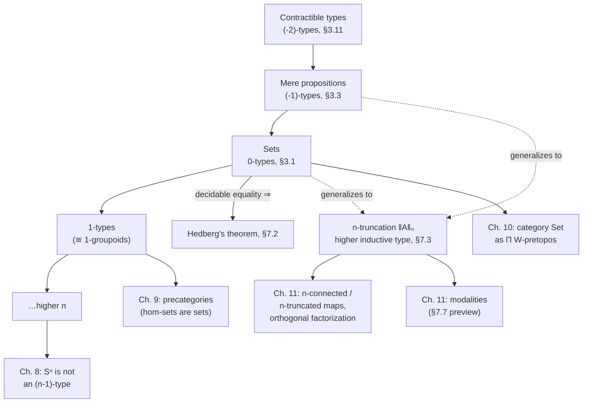

[[book-guidelines|↩ Back to guidelines]]

## What problem does this solve?

Once identity types are paths (Chapter 2), a natural question becomes urgent: *how much path structure does a given type actually have?* Some types — `Nat`, `Bool`, most data structures you'd put in a Rust `struct` — have at most one path between any two equal elements: knowing `x = y` is all there is to know, there's no further choice of *which* proof. Other types — the universe $\mathcal{U}$ itself, or a circle $S^1$ — have genuinely different, inequivalent paths between the same two points, and even different paths *between those paths*, all the way up.

This matters for more than taxonomy. If you're building a type checker, you constantly need to know: "is equality at this type just a yes/no fact, or does it carry information I need to track?" A `PartialEq` check in Rust, or a definitional-equality check (`isDefEq`) in a Lean-style kernel, implicitly assumes the *first* case — it collapses an equality proof to a boolean, discarding "which proof" as irrelevant. That collapse is only sound at types where all equality proofs coincide. HoTT calls this hierarchy of "how much extra proof-content lives at each level" the **hierarchy of homotopy $n$-types**, and it gives you a precise, recursively defined criterion for exactly when that collapse is legitimate — this is Hedberg's theorem below, and it is the theoretical justification for why a decidable-equality kernel gets to throw away proof objects and just return `bool`.

The book actually needs the bottom two rungs of this ladder — mere propositions and sets — well before it can state the general definition, because Chapter 3's whole account of logic depends on them. So this article does two things: it revisits *why* those two rungs (built ad hoc in Chapter 3) are really the base cases of one uniform recursive definition (given properly in Chapter 7), and it develops what Chapter 3 couldn't yet say — the general $n$-type hierarchy, $n$-truncation as a higher inductive type, and Hedberg's theorem. (Mere propositions themselves, and propositional truncation as a logical device, are covered in more depth in [[The-Propositions-as-Types-Correspondence]]; here the focus is the *hierarchy* and its two structural theorems.)

## The bottom of the ladder, informally first

Before any recursion, look at what Chapter 3 already built by hand, because the recursive definition is designed to reproduce exactly this pattern one level at a time.

**A type is a set** (§3.1) if any two parallel paths between the same two points are themselves equal:
$$
\mathrm{isSet}(A) :\equiv \prod_{x,y:A} \prod_{p,q : x=y} (p = q).
$$
Equality is "flat" — once you know two things are equal, there's nothing more to say about *how*.

**A type is a mere proposition** (§3.3) if any two of its own elements are equal:
$$
\mathrm{isProp}(P) :\equiv \prod_{x,y:P} (x = y).
$$
This is one level "lower": instead of asking that paths between paths collapse, it asks that the *points themselves* collapse. A mere proposition behaves like a boolean fact — inhabited or not, with no further distinguishing information among its inhabitants.

**A type is contractible** (§3.11) if it has a distinguished point that everything else is (uniquely, though we don't yet insist on uniqueness) equal to:
$$
\mathrm{isContr}(A) :\equiv \sum_{a:A} \prod_{x:A} (a = x).
$$
This is one level lower still: not only are all elements equal, there's a canonical center of contraction they're all equal *to*. Concretely, `isContr(A)` says "$A$ has exactly one element" — Lemma 3.11.3 in the book proves this is equivalent to $A$ being an inhabited mere proposition, and also equivalent to $A \simeq \mathbf{1}$.

Notice the pattern before it's made explicit: a set is a type whose identity types ($x = y$) are mere propositions; a mere proposition is a type whose *own* identity types are contractible (Lemma 3.11.10: $P$ is a mere proposition iff $x =_P y$ is contractible for all $x,y$). Contractibility is the type sitting still — nowhere left to descend, so it becomes the base case.

## The recursive definition (§7.1)

Chapter 7 makes this pattern the *definition*, rather than a coincidence you'd have to notice three times. Levels are indexed by integers $n \geq -2$ (yes, negative — this is a labeling convenience, not a claim that types have "negative dimension"):

$$
\text{is-}n\text{-type}(X) :\equiv
\begin{cases}
\mathrm{isContr}(X) & \text{if } n = -2, \\[4pt]
\displaystyle\prod_{x,y:X} \text{is-}n'\text{-type}(x =_X y) & \text{if } n = n' + 1.
\end{cases}
$$

Read it as: "$X$ is an $n$-type" means "$X$ is contractible" when $n=-2$, and otherwise means "every identity type of $X$ is one level down." Unwinding the recursion:

- $n = -2$: contractible types.
- $n = -1$: identity types are contractible $\Longleftrightarrow$ mere propositions (this recovers Lemma 3.11.10 exactly).
- $n = 0$: identity types are mere propositions $\Longleftrightarrow$ sets (this recovers §3.1's definition exactly — Example 7.1.3 states this explicitly).
- $n = 1$: identity types are sets — types with possibly-distinct parallel paths, but no distinguishable *paths between paths*. Ordinary 1-groupoids live here.
- and so on upward, one dimension of "interesting higher path structure" unlocked at each step.

`is-n-type` is itself a type (a $\Pi$-type of a recursively defined family), so the whole apparatus lives inside the type theory rather than being a meta-level classification — you can quantify over it, prove things about it, and (Theorem 7.1.10) show it's always a mere proposition: *being* an $n$-type is itself a yes/no fact with no extra content, however elaborate the type's internal path structure is.

### Why "start two levels below zero"

This is a real design decision, not numerology. If levels started at $n=0$ with sets, you'd need separate, unmotivated definitions for "mere proposition" and "contractible" bolted on below — exactly the ad-hoc situation Chapter 3 was actually in. Starting the recursion at $-2$ makes contractibility (a single, simple base case) generate the entire hierarchy uniformly by one syntactic rule, so every subsequent structural theorem about $n$-types (closure properties, preservation under equivalence, etc.) is proved once, by induction on $n$, instead of separately for propositions, sets, 1-types, ….

### Closure properties, briefly

Chapter 7 spends most of §7.1 proving that [[Type-Theory-as-a-Foundational-System-Qwen#The hierarchy|the hierarchy]] is well-behaved as engineering infrastructure, by induction on $n$ in every case:

- **Cumulativity** (Theorem 7.1.7): every $n$-type is also an $(n+1)$-type. The hierarchy is nested, not partitioned — being "flat enough" at level $n$ is inherited going up.
- **Retracts** (Theorem 7.1.4) and **equivalence** (Corollary 7.1.5): if $Y$ is a retract of an $n$-type $X$, $Y$ is an $n$-type; in particular equivalent types share a level. This is what lets you transport "is a set" across an isomorphism without re-proving it from scratch.
- **$\Sigma$ and $\Pi$ closure** (Theorems 7.1.8, 7.1.9): if $A$ and every $B(a)$ are $n$-types, so are $\sum_{x:A}B(x)$ and $\prod_{x:A}B(x)$. Products, function spaces, and (Theorem 7.1.6) embeddings into $n$-types inherit the level too. Practically: build your data types out of pieces that are already sets, and the whole is a set for free — this is the theorem that lets you stop proving `isSet` by hand for every derived structure.
- **The universe of levels closes on itself** (Theorem 7.1.11): $n\text{-Type} :\equiv \sum_{X:\mathcal{U}} \text{is-}n\text{-type}(X)$ is itself an $(n+1)$-type. The type of all sets is a 1-type; the type of all mere propositions ($\mathrm{Prop}$) is a set; and so on — the hierarchy is coherent one level up from where it classifies.

### Grounding: what the levels look like as code

The recursive *definition* — a predicate on types whose base case is contractibility and whose inductive step recurses into the type's own identity types — has no faithful Rust encoding, because Rust's type system isn't dependent: it can't quantify "for all `x, y : A`" and recurse into `x = y` as a type. What *does* transfer is the operational content once you fix a level, which is exactly what a Lean kernel or a Rust equality-checker cares about:

```lean
-- Lean: the recursive definition, stated the way the book states it.
-- (This is illustrative, not literally load-bearing Lean 4 syntax for
-- the negative-indexed case, but it mirrors Definition 7.1.1 directly.)
inductive Level where
  | minusTwo
  | succ (n : Level)

def isNType : Level → Sort u → Prop
  | Level.minusTwo, X => ∃ a : X, ∀ x : X, a = x        -- isContr
  | Level.succ n,   X => ∀ x y : X, isNType n (x = y)    -- recurse into Id
```

Lean's own `Subsingleton` class (at most one element — a mere proposition, $n=-1$) and its kernel's built-in proof-irrelevance for `Prop` are a *direct, load-bearing* instance of level $-1$: Lean's kernel treats any two proofs of the same `Prop` as definitionally equal without inspecting them, which is exactly the license Definition 7.1.1 gives you once you know a type is a mere proposition. `DecidableEq α`, by contrast, is the *hypothesis* of Hedberg's theorem below, not a level itself — decidability is what gets you *into* level $0$ for free.

```python
# Python: a toy, non-dependent sketch of the recursion, operating on
# a symbolic model where each type carries an explicit "identity-type
# builder" — illustrative only, since real identity types aren't
# enumerable data in general.
def is_n_type(n, ty, id_type_of):
    if n == -2:
        return ty.is_contractible()
    return all(
        is_n_type(n - 1, id_type_of(x, y), id_type_of)
        for x, y in ty.all_pairs()
    )
```

## Uniqueness of Identity Proofs and Hedberg's theorem (§7.2)

This section answers the practical question motivating the whole article: *when is it sound to treat equality at a type as a mere boolean, discarding the proof?*

**Uniqueness of Identity Proofs (UIP)** is just the $n=0$ case spelled out: a type $X$ has UIP exactly when it is a set, i.e. any two proofs $p, q : x = y$ are equal. **Axiom K** (Theorem 7.2.1) is an equivalent, more economical-looking formulation: $X$ satisfies Axiom K if every *loop* $p : x = x$ is equal to $\mathrm{refl}_x$. The book stresses — and it's worth internalizing before writing a checker around this — that UIP/Axiom K are not axioms being *assumed*; they are properties a given type may or may not have, and Example 3.1.9 already exhibited a type without them: the universe $\mathcal{U}$, via the non-trivial self-equivalence of `Bool` transported along univalence into a loop $p : \mathrm{Bool} = \mathrm{Bool}$ with $p \neq \mathrm{refl}$.

The general technique for *proving* a type has UIP is Theorem 7.2.2: if you can exhibit a reflexive mere relation $R$ on $X$ that implies identity (i.e. $R(x,y) \to x = y$, with $R(x,y)$ itself a mere proposition), then $X$ is a set and $R(x,y) \simeq (x = y)$. This is the same move a compiler engineer makes constantly: replace "equality of these two ASTs" (a type that could in principle carry structure) with a boolean structural-equality relation, then argue that relation is reflexive, propositional, and implies literal equality — which is exactly what a `derive(PartialEq)` structural comparison is doing, when it's sound.

**Hedberg's theorem** (Theorem 7.2.5) specializes this to the case a type-checker actually has in hand:

> If $X$ has decidable equality — $\prod_{x,y:X}\big((x=y) + \neg(x=y)\big)$ — then $X$ is a set.

The proof route matters as much as the statement (Corollary 7.2.3 + Lemma 7.2.4): decidability gives you $\neg\neg(x=y) \to (x=y)$ for free (case on the decision procedure — if it says "yes," use that proof; if it says "no," derive `False` from the double-negation and use ex falso), and *any* type satisfying that double-negation-elimination property is automatically a set. Intuitively: a decision procedure is a single, canonical, continuous function of $x$ and $y$; if it exists, it *is* the unique proof, so there is no room left for two different proofs $p,q:x=y$ to disagree. The book proves `Nat` has decidable equality (Theorem 7.2.6) by structural double induction, and Hedberg then gives you `isSet(Nat)` as a corollary — a strictly more economical route than working out `Nat`'s full identity-type structure by hand (§2.13's encode-decode calculation).

This is precisely the theorem underwriting a design decision you will make in any type-checker with decidable base types: **once equality on a type is decidable, you never need to track *which* proof of `x = y` justified a step — there is only ever one, up to equality.** A Rust `Eq` impl (not just `PartialEq`) is an unproven promise of exactly this fact; a Lean kernel's `isDefEq` for base types like `Nat` and `Bool` is *sound* to implement as a plain boolean decision procedure precisely because Hedberg's theorem holds for them. Where Hedberg's theorem does *not* apply — types without decidable equality, or genuinely higher-dimensional types like the universe — a checker cannot get away with `bool`-valued equality; it has to keep proof terms around, because different proofs really can be different data. This is the formal boundary of proof-irrelevant equality-checking in a trusted kernel.

```rust
// Rust: Hedberg's theorem is the reason `derive(Eq)` is a meaningful,
// checkable-in-principle claim and not just `PartialEq` with extra ceremony.
// `Eq` promises the equivalence-relation laws; Hedberg says that for any
// type with a *total, terminating* equality decision procedure, the
// specific proof `x == y` produced never matters -- there's only one,
// up to equality of proofs. That's what licenses collapsing "proof of
// equality" down to a `bool` everywhere in the checker.
#[derive(PartialEq, Eq)]
enum Ty {
    Nat,
    Bool,
    Arrow(Box<Ty>, Box<Ty>),
}

// A hand-rolled decision procedure, mirroring Theorem 7.2.2's shape:
// a reflexive, propositional relation (structural equality, here just
// bool) that implies identity.
fn ty_eq(a: &Ty, b: &Ty) -> bool {
    match (a, b) {
        (Ty::Nat, Ty::Nat) | (Ty::Bool, Ty::Bool) => true,
        (Ty::Arrow(a1, a2), Ty::Arrow(b1, b2)) => ty_eq(a1, b1) && ty_eq(a2, b2),
        _ => false,
    }
}
```

Theorem 7.2.7 generalizes Axiom K to every level: $X$ is an $(n+1)$-type iff the loop space $\Omega(X,x)$ is an $n$-type for every basepoint $x$, and iterating (Theorem 7.2.9) gives $X$ is an $n$-type iff $\Omega^{n+1}(X,a)$ is contractible for every $a$. This is the same "flatten by one dimension per step" idea as the recursive definition, restated in terms of iterated loop spaces — the two views (recursing on identity types, or demanding contractible iterated loop spaces) coincide.

## $n$-truncation as a higher inductive type (§7.3)

Chapter 6 already built the $(-1)$-truncation $\|A\|$ as a higher inductive type: the "best mere-proposition approximation" of $A$, freely collapsing all of $A$'s internal structure down to a bare yes/no fact of inhabitation. §7.3 generalizes this to every level: for any $n \geq -2$, $\|A\|_n$ is the best $n$-type approximation of $A$ (in classical algebraic topology this is called the $n$th Postnikov truncation).

[[Sets-in-Univalent-Foundations#The construction|The construction]] needs a trick because a naive "just add path constructors forcing everything above dimension $n$ to be trivial" would require infinitely many constructors, one per dimension. The book's **hub-and-spoke** device (already used in §6.7 to reduce 2-dimensional path constructors to 1-dimensional ones) handles this in one stroke, using the fact (Theorem 7.2.9) that $X$ is an $n$-type iff $\Omega^{n+1}(X,a)$ is contractible for all $a$, together with the fact that $\Omega^{n+1}(X,a) \simeq \mathrm{Map}_*(S^{n+1}, (X,a))$ (pointed maps out of a sphere). Forcing contractibility of *that* mapping space is what the hub-and-spoke constructors do directly:

- $|-|_n : A \to \|A\|_n$ — the point constructor, injecting $A$;
- for every $r : S^{n+1} \to \|A\|_n$, a **hub** point $h(r) : \|A\|_n$;
- for every such $r$ and every $x : S^{n+1}$, a **spoke** path $s_r(x) : r(x) = h(r)$.

The spokes force every map out of an $(n+1)$-sphere into $\|A\|_n$ to be null-homotopic (contract to its hub), which is exactly the condition for $\Omega^{n+1}(\|A\|_n, b)$ to be contractible at every point — i.e., for $\|A\|_n$ to be an $n$-type (Lemma 7.3.1). For $n=-2$ the construction degenerates and you can just define $\|A\|_{-2} :\equiv \mathbf{1}$ directly, since every type is meant to collapse all the way to a point.

The payoff is a clean **universal property** (Lemma 7.3.3): for any $n$-type $B$,
$$
(\|A\|_n \to B) \;\simeq\; (A \to B),
$$
i.e. giving a map out of the truncation is exactly as much data as giving a map out of $A$ into an $n$-type. Categorically, $n$-types form a **reflective subcategory** of all types, with $\|-\|_n$ as the reflector — and reflectivity is exactly what makes the truncation *functorial* (Lemma 7.3.5 upgrades this to functorial-on-homotopies too) rather than just an existence statement. Corollary 7.3.7 rounds this off: $A$ was already an $n$-type iff $|-|_n : A \to \|A\|_n$ is an equivalence — truncating a type that's already flat enough at level $n$ does nothing.

The Lean-side correspondence here is closer than it looks. Lean's `Quot` type (with `Quot.mk` and `Quot.sound`) is precisely a *point-plus-path* higher inductive type — it freely adds exactly the identifications a given relation demands, the same shape as $|-|_n$ plus path constructors, just without needing hubs and spokes because a plain quotient only ever needs one dimension of path. Lean's `Trunc α` (built on `Quot` with the "always-related" relation) *is* the $(-1)$-truncation $\|A\|$ realized computationally: it exposes `Trunc.mk : α → Trunc α` (that's $|-|_{-1}$) and enforces that any two elements are propositionally equal, and its recursion principle (`Trunc.lift`, requiring the target to be a `Subsingleton`) is exactly Lemma 7.3.3's universal property specialized to $n=-1$. There is no general `Trunc.mk`-style built-in for arbitrary $n$ in Lean's core, precisely because [[Higher-Inductive-Types|higher inductive types]] with genuine higher path constructors (hubs and spokes for $n \geq 0$) are not native to Lean's cubical-free kernel — this is one of the places where "the book's formalism" outruns what an off-the-shelf dependently typed kernel gives you for free, and a reason cubical type theories exist.

## Where this leads



The two rungs Chapter 3 needed by hand — mere propositions for logic, sets for equality reasoning — turn out to be the first two steps of one uniform recursive definition, with contractibility as the natural stopping point below both. That uniformity is what lets Chapter 7's closure theorems (retracts, $\Sigma$/$\Pi$-closure, cumulativity) apply identically to "is this a set" and "is this a mere proposition," instead of needing separate proofs for each, as Chapter 3 effectively had to give.

Going forward, this hierarchy is load-bearing machinery rather than a curiosity: Chapter 8 needs it to state that spheres $S^n$ are genuinely higher-dimensional (not $n$-types), which is what makes their homotopy groups worth computing at all; Chapter 9's category theory quietly assumes hom-types are sets (0-types) so that "category" behaves the way you expect; Chapter 10's $\mathbf{Set}$ is by definition the category of 0-types; and Chapter 11 dualizes truncatedness into *connectedness*, pairing $n$-truncated maps with $n$-connected maps into an orthogonal factorization system that generalizes ordinary image factorization — with modalities (§7.7) eventually abstracting the entire ladder into one uniform pattern.

For the compiler/elaborator project this article's learning goals are steering toward, the load-bearing takeaway is Hedberg's theorem specifically: it is the formal justification for the everyday move of implementing definitional-equality checks on decidable base types as plain boolean procedures inside a trusted kernel, with no proof object carried around — proof-irrelevance for equality falls out for free once decidability is established, and does *not* extend past that boundary (e.g. to universes, or to any type built from univalence) without genuinely tracking which proof you have. The $n$-truncation construction, meanwhile, is the same "freely impose exactly the identifications needed, no more" idea that governs `Quot`/`Trunc` in Lean's own kernel — worth having in mind when the elaborator needs to canonicalize a metavariable's value up to some notion of observational equivalence rather than syntactic identity.
