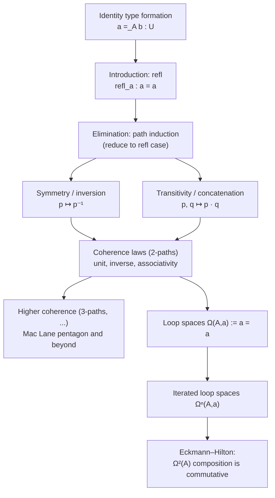

# Identity Types and Path Structure

[[book-guidelines|↩ Back to guidelines]]

## Why equality needs its own type

Every type theory covered so far in this book — products, coproducts, $\Pi$-types, $\Sigma$-types — has been about building *new* data out of old. But there's a question none of those formers can answer: given two elements $a, b : A$, what does it *mean* for them to be equal, and what evidence would prove it?

In set theory the answer is a non-question. Equality is a primitive, external relation the metatheory hands you for free: $a = b$ is either true or false, full stop, and a proof of it carries no information beyond "yes." But type theory has committed to the propositions-as-types principle (§1.11): every proposition is a type, and proving the proposition means producing an inhabitant of that type. If "$a$ equals $b$" is a proposition, it has to *be* a type — and, per proof-relevance, an element of that type is not just a yes/no bit but a genuine piece of data, a specific *witness* that can itself be inspected, compared, and reasoned about.

This is where the identity type comes from. Awodey, Coquand, and Voevodsky write the family as
$$\mathrm{Id}_A : A \to A \to \mathcal{U}, \qquad \mathrm{Id}_A(a,b) \text{ written } a =_A b \text{ or just } a = b.$$
Note the type-theoretic instinct at work: instead of asking "are $a$ and $b$ equal?" as a yes/no query, the theory asks "what does the *type* of equality proofs between $a$ and $b$ look like?" — and that type can turn out to have a rich internal structure of its own. That structure is what forces the book to introduce, in the same breath, a second reading of equality: not as a static fact but as a **path** between two points in a space. This is the homotopical interpretation that gives the book its name, and everything else in this article is really about unpacking what a "path" buys you that a bare true/false fact does not.

**What breaks without this move.** If you tried to bolt equality onto type theory the way set theory does — as an external, unstructured relation — you'd get something equivalent to *extensional* type theory, where judgmental and propositional equality collapse into one notion and every type is forced to be "discrete" (flat, set-like, no higher structure). You'd lose the ability to say anything interesting about *how* two things are equal, only *that* they are. The entire homotopical reading of type theory — spaces, higher groupoids, [[Formal-Metatheory#Univalence|univalence]] — depends on keeping equality proof-relevant, i.e. keeping identity types as genuine types with possibly many distinct inhabitants.

## The formation, introduction, and (missing) elimination rules

Identity types follow the same four-part rule pattern (formation, introduction, elimination, computation) as every other type former in Chapter 1, and it's worth being explicit about each piece, because the elimination rule is where all the actual content lives.

**Formation.** Given $A : \mathcal{U}$ and $a, b : A$, we can form $(a =_A b) : \mathcal{U}$, in the same universe as $A$.

**Introduction.** The *only* constructor is reflexivity:
$$\mathrm{refl} : \prod_{a:A} (a =_A a).$$
$\mathrm{refl}_a$ is read as "the constant path at $a$" — the trivial witness that $a$ equals itself. Crucially, if $a$ and $b$ happen to be *judgmentally* equal ($a \equiv b$), then $\mathrm{refl}_a$ is already a well-typed inhabitant of $a =_A b$, because the type $a =_A b$ is itself judgmentally equal to $a =_A a$. This is the precise seam between the two notions of equality the book insists on distinguishing in §1.1: judgmental equality $\equiv$ is a metatheoretic bookkeeping fact about the rules of the calculus (it's decided by the type-checker, not proved by the user); propositional equality $=$ is genuine mathematical content, something a program constructs as a term.

**Elimination — path induction.** This is the subtle part, and the book spends most of §1.12 on it. Ordinary "indiscernibility of identicals" — substituting equals for equals — falls out as a special case, but the full induction principle is stronger. Stated precisely:

> **Path induction.** Given a family $C : \prod_{x,y:A}(x=_A y) \to \mathcal{U}$ and a function $c : \prod_{x:A} C(x,x,\mathrm{refl}_x)$, there is
> $$f : \prod_{x,y:A}\prod_{p:x=_Ay} C(x,y,p) \quad\text{such that}\quad f(x,x,\mathrm{refl}_x) :\equiv c(x).$$

Read this the same way you'd read the induction principle for natural numbers or coproducts: "every element of the family is generated by the constructors, so it suffices to handle the constructor case." For $\mathbb{N}$, the constructors are $0$ and $\mathrm{succ}$. For the identity type family, the (only) constructor is $\mathrm{refl}$ — so path induction says: to prove something about *every* triple $(x, y, p)$ with $p : x = y$, it's enough to prove it when $x$ and $y$ are literally the same point and $p$ is $\mathrm{refl}$.

There's also a second, more convenient variant — **based path induction** — that fixes one endpoint $a$ and lets only the other vary:

> **Based path induction.** Fix $a : A$. Given $C : \prod_{x:A}(a =_A x) \to \mathcal{U}$ and $c : C(a, \mathrm{refl}_a)$, there is $f : \prod_{x:A}\prod_{p:a=x} C(x,p)$ with $f(a,\mathrm{refl}_a) :\equiv c$.

The book proves these two principles are logically equivalent (§1.12.2) — one direction is a direct instantiation, the other requires a clever trick where you build a single path-induction argument that simultaneously proves *every* instance of based path induction, by quantifying over all possible families $C$ inside the motive. The book flags this as needing a jump to a higher universe (since you're now quantifying over all $C : A \to \mathcal{U}_i$), which is the kind of thing that matters once you start caring about exactly which universe an argument lives in.

**Why there's no separate computation rule to state.** For products or naturals, the computation rule is a fact you check about the recursor *after* defining it. For identity types, the computation rule $f(x,x,\mathrm{refl}_x) :\equiv c(x)$ is baked directly into the *statement* of the induction principle as a judgmental equality — it's not optional, it's part of what makes path induction path induction.

## What path induction can and can't prove

Here's the trap the book deliberately sets up (Remark 1.12.1) and then dismantles, because falling into it and climbing back out is the fastest way to actually understand the principle.

Read naively, path induction sounds like it's saying "every path is $\mathrm{refl}$" — after all, the only case you ever have to handle is the reflexivity case. But that can't be right, because the whole homotopical picture the book is building toward depends on there being *many* distinct paths between two points (think of a loop that winds around a hole versus one that doesn't — both are paths from a point to itself, and they are not the same path). If path induction proved all paths equal reflexivity, the entire theory would collapse to sets.

The resolution: **it is not the identity type $x =_A y$ that is inductively generated — it's the identity type *family*, i.e. the dependent triple $(x, y, p)$ ranging over $\sum_{x,y:A}(x=y)$.** Path induction tells you that this indexed *family* is freely generated by the reflexivity elements — every $(x,y,p)$ is *connected by a path* (in the total space $\sum_{x,y:A}(x=y)$) to some $(z,z,\mathrm{refl}_z)$. It does **not** tell you that $p$ itself, sitting inside the single fixed type $x=_A y$, is equal to $\mathrm{refl}$.

Concretely, this is exactly why you cannot construct a function
$$f : \prod_{x:A}\prod_{p:x=x} (p =_{x=x} \mathrm{refl}_x)$$
by path induction — that would require fixing *both* endpoints at $x$ while letting $p$ vary, but path induction only ever lets you reduce to the diagonal case where the endpoints themselves collapse together as part of the argument. This is the book's Exercise 1.14, and it's worth sitting with, because the gap between "the family is free on $\mathrm{refl}$" and "every specific loop is $\mathrm{refl}$" is precisely the gap that gives homotopy type theory room to have nontrivial fundamental groups, nontrivial higher structure, and eventually a coherent notion of $\infty$-groupoid.

The book's own topological picture: a loop threading once around the puncture in an annulus can't be straightened to a constant path *while both endpoints stay fixed* — but if you let one endpoint slide, you can always retract it home. That asymmetry (fixed-both-endpoints vs. slide-one-endpoint) is exactly the asymmetry between the ("family is free") reading of path induction and the false ("every loop is trivial") reading.

### Grounding: this is `Eq.rec`, not a runtime `==`

This is the single most load-bearing translation for the compiler/elaborator project, so it's worth being completely explicit about it.

**Lean.** Lean's kernel has a primitive eliminator for its inductive `Eq` type that is *exactly* path induction (in the based form):

```lean
inductive Eq {α : Sort u} (a : α) : α → Prop where
  | refl : Eq a a

-- Eq.rec is the kernel-primitive eliminator, essentially:
-- Eq.rec : {motive : (b : α) → a = b → Sort v} →
--          motive a rfl →
--          {b : α} → (h : a = b) → motive b h
```

`Eq.rec` (often invoked for you as `▸`, "substitution") *is* based path induction — read off the definitions and the correspondence is literal: `motive` is the book's $C$, the `motive a rfl` argument is $c$, and the case-split of `Eq.rec` down to `Eq.rec ... rfl = (the given proof)` is the judgmental computation rule $f(a,\mathrm{refl}_a) :\equiv c$. When you write `h ▸ x` in a Lean proof to transport `x` along an equality `h`, you are invoking path induction directly. `rfl` itself is the book's $\mathrm{refl}_a$, and the fact that Lean's `Eq` is *propositional*, proof-relevant, and only *definitionally* trivial for judgmentally-equal terms is the same seam the book draws between $\equiv$ and $=$.

This matters directly for the elaborator/unification project in the standing learning goals: Lean's `isDefEq` — the routine that decides whether two terms are judgmentally/definitionally equal during elaboration — is a *decision procedure* operating one level below the `Eq` type entirely. `rfl : a = a` only type-checks when `isDefEq a a` (or, more usefully, `isDefEq lhs rhs` after both sides normalize) succeeds. Path induction is the propositional machinery built *on top of* that decision procedure; `isDefEq` is what the kernel actually runs to decide whether the trivial case even applies. Keeping these two levels distinct — judgmental equality as a checkable, decidable procedure; propositional equality as a type with possibly nontrivial inhabitants — is exactly the distinction a from-scratch elaborator needs to get right, because conflating them (à la extensional type theory) makes type-checking undecidable in general.

**Rust.** Rust has no native identity type, but the *shape* of path induction — "to define something for all proofs of `a == b`, it suffices to define it when they're the same, syntactically" — shows up whenever you build a typestate or witness-passing API. A minimal illustration, using a phantom-typed equality witness:

```rust
use std::marker::PhantomData;

// A witness that types A and B are "the same" — analogous to `a = b`.
struct Refl<A>(PhantomData<A>);

impl<A> Refl<A> {
    fn refl() -> Refl<A> { Refl(PhantomData) }
}

// "path induction" for a two-type witness: given a proof that A = B,
// convert a value of type A into a value of type B. This is the
// runtime analogue of `Eq.rec` / transport, specialized to a
// non-dependent motive C(_) = B.
fn transport<A, B>(_proof: Refl<A>, x: A) -> B
where
    A: Into<B>, // stand-in for "A and B are definitionally the substitutable"
{
    x.into()
}
```

This is necessarily a weak analogy — Rust's type system can't express a genuine dependent identity type or the based-path-induction motive `C : ∏(x:A) (a = x) → U` — but it's useful precisely *because* it shows what's missing: Rust can encode the "reflexivity is the only constructor" shape as a marker type, but it has no way to make the compiler check that a `Refl<A, B>` value only exists when `A` and `B` are truly interchangeable, nor any way to eliminate it generically over an arbitrary dependent motive. That gap — no dependent elimination principle — is exactly the gap a verifier embedding a real identity type has to close, and it's the reason "just simulate dependent types with traits" schemes tend to hit a wall precisely at path induction.

**Python.** For quick illustration only: path induction is the same shape as pattern-matching a `Literal` equality check where you only ever handle the "same" branch and let the framework fill in everything else:

```python
def path_induction(x, y, p, base_case):
    # Conceptually: if p proves x == y, and we've defined base_case
    # only for the case x is y, p is "reflexivity", the induction
    # principle promises this generalizes to every (x, y, p).
    # Python has no proof objects, so this is illustrative only —
    # there is no type-checker enforcing that `p` is *evidence*.
    assert x == y  # the only case we're ever "allowed" to handle
    return base_case(x)
```

## Building the groupoid structure: inversion, concatenation, and their laws

Chapter 2 opens by making the path metaphor literal: a type $A$ is regarded as a space, its elements as points, and $a =_A b$ as the type of paths from $a$ to $b$. In classical topology, paths admit **inversion** (walk it backwards) and **concatenation** (walk one, then the other), and there are equations between these operations — but the equations only hold *up to homotopy*, not as strict, pointwise equalities of functions. The book's entire agenda in §2.1 is to show that this same structure — reversal, concatenation, and coherence laws relating them — falls straight out of path induction, with zero extra axioms.

### Symmetry / inversion

**Lemma 2.1.1.** For every $x, y : A$ there is a function $(x = y) \to (y = x)$, written $p \mapsto p^{-1}$, with $\mathrm{refl}_x^{-1} \equiv \mathrm{refl}_x$.

*Proof idea:* take the motive $D(x,y,p) :\equiv (y = x)$. In the reflexivity case this reduces to $x = x$, discharged by $\mathrm{refl}_x$. Path induction extends this to every $p$.

### Transitivity / concatenation

**Lemma 2.1.2.** For every $x,y,z:A$, there's a function $(x=y)\to(y=z)\to(x=z)$, written $p \mapsto q \mapsto p \cdot q$, with $\mathrm{refl}_x \cdot \mathrm{refl}_x \equiv \mathrm{refl}_x$.

The book deliberately proves this by induction on *both* $p$ and $q$ in sequence (rather than stopping after inducting on $p$ alone, which would already produce something of the right type) — and flags this as a genuine choice with consequences, not padding. If you induct only on $p$, you get the computation rule $\mathrm{refl}_y \cdot q \equiv q$ (asymmetric: the left unit is "free," the right one isn't judgmentally trivial). Inducting on $q$ alone gives the mirror-image rule $p \cdot \mathrm{refl}_y \equiv p$. Inducting on both, as the book does, gives *only* $\mathrm{refl}_x \cdot \mathrm{refl}_x \equiv \mathrm{refl}_x$ judgmentally — weaker in each individual case, but symmetric. **This is a direct, concrete instance of proof-relevance actually biting**: three different proofs of the identical *proposition* $\prod_{x,y,z}(x=y)\to(y=z)\to(x=z)$ produce three different, non-judgmentally-equal *elements* of that type, and which one you pick changes what reduces automatically for you later. A prover or elaborator built on this machinery has to make the same kind of choice — and live with its consequences — whenever it defines an operation by induction over more than one argument.

### The unit, inverse, and associativity laws — and why they need their own proofs

Symmetry and transitivity alone aren't the end of the story, precisely because of proof-relevance: in set theory, "equality is symmetric and transitive" is a property you check once and forget. Here, $p^{-1}$ and $p \cdot q$ are *operations* on paths, and operations need to be shown well-behaved — which itself produces more paths, this time paths between paths.

**Lemma 2.1.4.** For $p:x=y$, $q:y=z$, $r:z=w$:

$$
\begin{aligned}
\text{(i)} \quad & p = p \cdot \mathrm{refl}_y \quad\text{and}\quad p = \mathrm{refl}_x \cdot p \\
\text{(ii)} \quad & p^{-1}\cdot p = \mathrm{refl}_y \quad\text{and}\quad p \cdot p^{-1} = \mathrm{refl}_x \\
\text{(iii)} \quad & (p^{-1})^{-1} = p \\
\text{(iv)} \quad & p \cdot (q \cdot r) = (p \cdot q)\cdot r
\end{aligned}
$$

Every one of these is proved the same way: pick a motive, reduce to the all-reflexivity case by (possibly repeated) path induction, and observe the reflexivity case is trivially true, hence witnessed by $\mathrm{refl}_{\mathrm{refl}_x}$. Note the type of that witness: $(i)$–$(iv)$ are equalities *between paths* — elements not of $x=y$ but of $p =_{(x=y)} q$ for $p,q:x=y$. This is the first appearance of a genuinely 2-dimensional path, and it is why the book insists these laws "hold up to homotopy" rather than strictly: concatenating $p$ with its inverse doesn't give you back the literal constant path (that would be a judgmental/strict equality), it gives you a *specific 2-path* connecting $p\cdot p^{-1}$ to $\mathrm{refl}_x$.

The book's own summary table is worth reproducing directly, because it's the cleanest statement of the whole chapter's thesis:

| Equality | Homotopy | $\infty$-Groupoid |
|---|---|---|
| reflexivity | constant path | identity morphism |
| symmetry | inversion of paths | inverse morphism |
| transitivity | concatenation of paths | composition of morphisms |

### Higher-dimensional paths and $\infty$-groupoids

Because type theory (unlike first-order logic) lets you treat proofs as first-class terms, nothing stops you from iterating the identity type: given $p, q : x=_Ay$, you can form $p =_{(x=y)} q$ — a **2-path**, a path between paths. Given $r, s : p =_{(x=y)} q$, you can form $r =_{(p=q)} s$ — a **3-path**. And so on, without end.

This tower — points, then paths between points, then paths between paths, then paths between those — is precisely the algebraic structure topologists call a **(weak) $\infty$-groupoid**: a collection of objects, morphisms between objects, 2-morphisms between morphisms, and so on, with identity/composition/inverse operations at every level, all satisfying the groupoid laws only "weakly," i.e. only up to a morphism at the *next* level up. Associativity of composition, for instance, is itself a higher morphism (Lemma 2.1.4(iv)); and there's a further coherence condition — the classical Mac Lane pentagon — governing the different ways of reassociating a four-fold composite, and coherence conditions on *that* coherence condition, "all the way up to infinity."

The book's headline claim, and the thing that makes this whole framework tractable rather than a combinatorial nightmare, is: **you never have to construct this tower by hand.** Every level of it — the identity morphisms, the inverses, the composition, all their coherence laws — is derivable purely from the single induction principle for identity types, applied as many times as needed. The book explicitly declines to formalize "coherent structure at all higher levels" in general (that requires machinery like globular operads) and instead only ever needs 2-paths and occasionally 3-paths in practice — but the *guarantee* that arbitrarily high structure is there, generated for free by path induction, is what licenses treating a type as a bona fide $\infty$-groupoid rather than a mere approximation of one.



### Grounding: composition operations you already know

**Lean.** `Eq.symm` and `Eq.trans` are exactly $p^{-1}$ and $p \cdot q$:

```lean
theorem symm  {a b : α}   (h : a = b) : b = a := h ▸ rfl
theorem trans {a b c : α} (h1 : a = b) (h2 : b = c) : a = c := h1 ▸ h2
```

Both are defined by exactly the pattern the book uses: case on the proof (`h1`/`h2`), and in the `rfl` case the result is judgmentally forced. Lean's `calc` blocks — chains like `a = b := h1 ; _ = c := h2` — are literally the book's "chain of intermediate steps" notation (§2.1's $a=b=c=d$ display), each step producing a piece that gets concatenated by `Trans.trans` under the hood. And Lean's associativity lemma for `Eq.trans`-chains is a proof-obligation of exactly the shape of Lemma 2.1.4(iv), for exactly the reason the book gives: composed proof terms aren't *syntactically* identical under different bracketings, so associativity has to be proved, not assumed, even though at the level of *propositions* everyone agrees it's "obviously true."

**Rust.** The concatenation/inversion structure maps naturally onto a small trait for composable, invertible transformations — the kind of thing you'd want for the Hoare-triple verifier's proof-object plumbing, where a "proof" of a program transformation composes exactly like a path:

```rust
trait Path<A> {
    fn refl(a: A) -> Self;
    fn inverse(self) -> Self;
    fn concat(self, other: Self) -> Self; // self: x=y, other: y=z -> x=z
}
```

The point of writing it this way isn't that Rust's trait system enforces the *laws* (unit, inverse, associativity) — it doesn't, those would need to be proved externally, exactly as the book proves them by hand — but that the *interface shape* (a composable, invertible, unit-having operation) is precisely a groupoid structure, and recognizing "this API I need is a groupoid" is a genuinely transferable piece of design vocabulary from this section.

## The Eckmann–Hilton argument: where higher paths get *extra* structure

The chapter's capstone result is the one place where going up a dimension doesn't just repeat the groupoid pattern — it produces something qualitatively new: **commutativity that wasn't there one level down.**

Fix a point $a:A$ and define its **loop space** $\Omega(A,a) :\equiv (a =_A a)$ — the type of paths from $a$ back to itself. Concatenation gives $\Omega(A,a)$ the structure of a "higher group" (associative, unital, invertible — but only up to still-higher paths, since we're in a proof-relevant setting). Iterating, define $\Omega^2(A,a) :\equiv \mathrm{refl}_a =_{(a=a)} \mathrm{refl}_a$, the type of 2-dimensional loops on the trivial loop, and more generally $\Omega^{n+1}(A,a) :\equiv \Omega^n(\Omega(A,a))$.

**Theorem 2.1.6 (Eckmann–Hilton).** The composition on $\Omega^2(A,a)$ is commutative: for $\alpha,\beta:\Omega^2(A,a)$, $\alpha\cdot\beta = \beta\cdot\alpha$.

The proof is worth walking through because the *mechanism*, not just the conclusion, is the payoff. Ordinary ("vertical") concatenation of 2-paths only lets you compose $\alpha:p=q$ with something starting where $\alpha$ ends. But because 2-paths sit one level above 1-paths, there's a *second*, independent way to compose them: **horizontal composition**, built by "whiskering" — extending a 2-path along an adjacent 1-path via the ordinary unit laws (Lemma 2.1.4(i)) — and then vertically composing the whiskered pieces:
$$\alpha \star \beta :\equiv (\alpha \triangleright r)\cdot(q \triangleleft \beta).$$
You can build this composite two different ways (whiskering left-then-right, or right-then-left), call them $\star$ and $\star'$. The argument has three moves:

1. When everything is based at a single point with all 1-paths equal to $\mathrm{refl}_a$, ordinary vertical composition $\alpha\cdot\beta$ *equals* $\alpha\star\beta$ (the whiskering degenerates to the unit laws, which cancel).
2. By the *same* computation done in the other associativity order, $\alpha\star'\beta$ equals the vertical composite $\beta \cdot \alpha$ — composed in the *opposite* order.
3. But $\star$ and $\star'$ are actually the same operation — a purely combinatorial fact provable by path induction on $\alpha,\beta$ and the surrounding 1-paths, reducing everything to reflexivities.

Chain these together: $\alpha\cdot\beta = \alpha\star\beta = \alpha\star'\beta = \beta\cdot\alpha$. Two composition operations that look unrelated (vertical composition and horizontal whiskering) turn out to coincide *because* they're both being squeezed through the same interchange law, and the only way two associative-unital operations can coincide like that is if they're commutative. This is a genuinely classical piece of category theory/homotopy theory (it's what forces higher homotopy groups $\pi_n$, $n\geq 2$, of any space to be abelian, which the book will use directly in Chapter 8) — the book's contribution is showing it's not an extra axiom about type theory, it *falls out* of path induction the same way concatenation and inversion did.

**What this is really telling you.** Once you have enough dimensions of path structure available, *any* two independent ways of composing things at that level are forced to agree, and forced-agreement-between-two-composition-orders is exactly what commutativity means. This is a genuinely different flavor of consequence than "operations need coherence laws" (§2.1's earlier lemmas) — it's a structural theorem that only becomes visible once you're willing to go two levels up. It's a preview of why the book keeps insisting the tower of higher paths isn't decoration: real theorems (abelian-ness of $\pi_{\geq 2}$) live at the second level and above, not the first.

### Grounding

There's no clean Rust or Python analogue here — Eckmann–Hilton is a fact about the specific coherence structure of *iterated* identity types, and neither language has anything resembling a 2-dimensional path type to translate it into; forcing an example would misrepresent the result as "just" commutativity rather than a consequence of interchange. It's flagged here rather than skipped silently, per the "missing example is better than a misleading one" principle. In Lean/HoTT-flavored formalizations (e.g. the Lean/Coq HoTT libraries), the proof is carried out essentially verbatim as a term of type `α ⬝ β = β ⬝ α` built from `whiskerRight`/`whiskerLeft` operations mirroring $\triangleright$/$\triangleleft$ directly — worth knowing exists if you ever need to look up the fully formalized version, but not something to hand-roll for this project's non-goals (this book is explicitly flagged as HoTT-adjacent background, not a target system to reimplement).

## Where this leads

Everything downstream of Chapter 1's identity type rests on treating path induction as the *sole* source of structure, never an added axiom — that discipline is what §2.1 spends its whole length demonstrating. Concretely, this topic is the direct prerequisite for:

- **§2.2 ("Functions are functors")** and **§2.3 ("Type families are fibrations")** — the action-on-paths operator $\mathrm{ap}_f$ and the transport operator $p_*$ are both defined by the exact same path-induction recipe used here for inversion and concatenation, and their own coherence laws (functoriality of $\mathrm{ap}$, Lemma 2.3.9's transport-composition law) are proved the same way.
- **§2.4 and Chapter 4 (equivalences)** — "sameness of types" is defined as a homotopy-equivalence-flavored structure built directly on the $\Omega(A,a)$ / groupoid vocabulary introduced here.
- **The univalence axiom (§2.10)** — univalence is precisely the claim that the identity type of the universe, $A =_{\mathcal U} B$, itself behaves exactly like the type of equivalences $A \simeq B$; you cannot state that claim without first having a firm grip on what an identity type *is* and how its path structure behaves.
- **Chapter 8 ([[Synthetic-Homotopy-Theory|synthetic homotopy theory]])** — [[Synthetic-Homotopy-Theory#The encode-decode method|the encode-decode method]] used to compute $\pi_1(S^1) \cong \mathbb{Z}$ is, at bottom, a sophisticated application of path induction to characterize an identity type; and Eckmann–Hilton is invoked directly to prove higher homotopy groups are abelian.

For the standing project: the identity-type/path-induction pair is the *direct* ancestor of `Eq`/`Eq.rec`/`rfl` machinery in any dependently-typed kernel, which means it's also the direct ancestor of the "does this term reduce to `rfl`" check sitting underneath `isDefEq` in an elaborator, and of the substitution step underneath any Hoare-triple soundness argument that needs to replace one program state description with a provably-equal one. The distinction the book insists on — judgmental equality (checked, decidable, structural) versus propositional equality (proved, a first-class type, potentially carrying nontrivial higher structure) — is exactly the distinction a from-scratch verifier or elaborator has to preserve to stay both expressive and decidable. Everything past this point in the book (transport, univalence, the whole homotopical apparatus) is optional background for that project; path induction itself is not.
