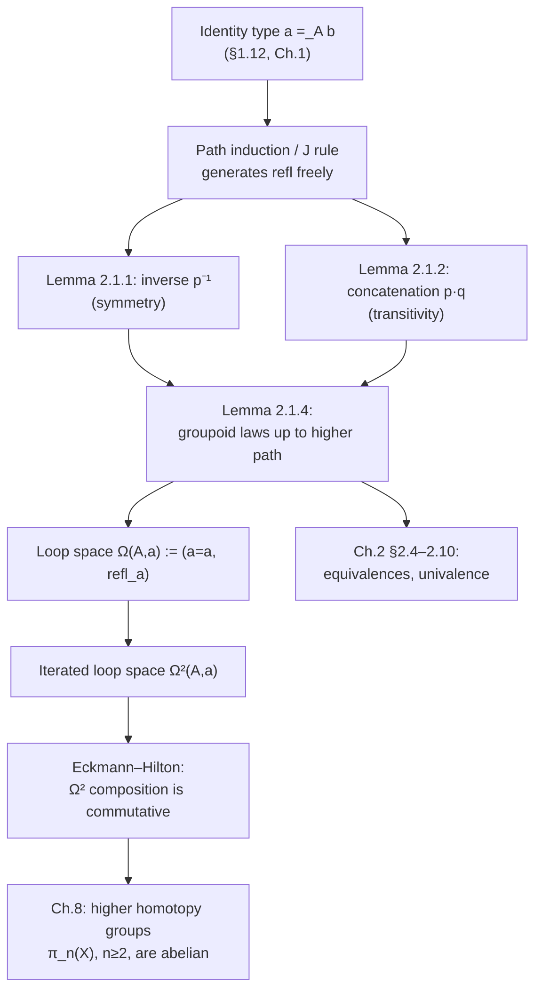

[[book-guidelines|↩ Back to guidelines]]

## Why equality needs its own type

In first-order logic — the language set theory is built on — there is exactly one kind of judgment: "this proposition has a proof." Equality, like every other statement, is just a proposition, external to the objects it relates. "$a = b$" either holds or it doesn't, and once it holds, you're done with it; there is nothing further to say about *how* $a$ and $b$ came to be equal.

Type theory starts from a different judgment, $a : A$ ("$a$ is a term of type $A$"), and it treats equality of *terms* at two separate levels that must not be confused:

- **Judgmental (definitional) equality**, written $a \equiv b : A$, is a fact about the deductive system itself — a metatheoretic statement decided by expanding definitions and computing. It is not something you can assume, negate, or reason about *inside* the theory; you can only observe that it holds or doesn't, the way you observe that `3 + 1` and `4` reduce to the same normal form.
- **Propositional equality**, written $a =_A b$, must itself be a *type* — because under the propositions-as-types correspondence (§1.11), every proposition is a type, and equality is a proposition like any other. This type is called an **identity type**, and its elements are *evidence* that $a$ and $b$ are equal, in exactly the same sense that an element of $A \times B$ is evidence of "$A$ and $B$."

This second point is the entire subject of this topic, and it is more radical than it first looks. If equality is a type, then — just as with $\Sigma$-types or coproducts — it can have *more than one element*. Two objects can be equal in several different, non-identical ways. Nothing in the axioms of set theory prepares you for that idea, because in set theory "$a=b$" is a truth value, not a container. This is precisely where the book's title starts to make sense: an inhabitant of $a =_A b$ behaves like a **path** from $a$ to $b$ in a topological space $A$, and just as a space can have many genuinely different paths between the same two points, a type can have many genuinely different proofs of the same equation.

**[[Sets-in-Univalent-Foundations#What breaks without this|What breaks without this]] distinction.** If you collapse propositional and judgmental equality into one notion (as *extensional* type theory does), type-checking becomes undecidable in general, because deciding an arbitrary propositional equality can require arbitrary proof search — whereas judgmental equality is required to be a syntactic, terminating, decidable check the type checker can run on its own. This is not a side remark: it is the exact fork in the road between "intensional" systems like Lean, Coq, and Agda (which keep the two separate, at the cost of needing an explicit `Eq.mpr`/`transport`/`subst` every time you want to substitute along a propositional proof) and their extensional cousins. Every dependently-typed elaborator you will build inherits this decision on day one.

## Identity types as path spaces

The book's formation rule: given $A : \mathcal{U}$ and $a, b : A$, there is a type $(a =_A b) : \mathcal{U}$ in the same universe — traditionally written $\mathrm{Id}_A(a,b)$, though the book quickly switches to infix "$=$" notation once propositions-as-types is familiar.

The **introduction rule** is a single constructor:

$$\mathrm{refl} : \prod_{a:A} (a =_A a)$$

called *reflexivity*: every element is equal to itself, in one canonical, specified way. $\mathrm{refl}_a$ is read homotopically as "the constant path at the point $a$." Note the asymmetry this already sets up: there is exactly one *rule* for producing an identity proof, but that does not mean there is exactly one *proof* — path induction (next section) will show precisely why not.

One immediate consequence: if $a \equiv b$ judgmentally, then $\mathrm{refl}_a : a =_A b$ typechecks, because $a =_A b$ is judgmentally equal to $a =_A a$. Judgmental equality is thus a **sufficient but not necessary** condition for propositional equality — the entire richness of the identity type lives in the gap between the two.

**Lean correspondence.** This is not an analogy so much as a direct restatement: Lean's `Eq` is defined exactly this way, as an inductive family with one constructor.

```lean
inductive Eq {α : Sort u} (a : α) : α → Prop
  | refl : Eq a a
```

`Eq a a` — literally "the type $a =_A a$" — is inhabited by `Eq.refl`, HoTT's $\mathrm{refl}_a$. The crucial difference (flagged below) is that Lean puts `Eq` in `Prop`, which is proof-irrelevant by fiat; HoTT's identity type lives in an ordinary universe $\mathcal{U}$ and is deliberately *not* assumed proof-irrelevant. That single choice is what separates "Lean's kernel equality" from "HoTT's path spaces," and it's worth sitting with, because it's a design decision you will have to make explicitly when you build your own kernel.

## Path induction: the eliminator that generates everything

Every type in this book comes with formation/introduction/elimination/computation rules, and identity types are no exception — but their elimination rule, **path induction**, is subtle enough that the book treats it as the central technical achievement of the chapter.

**Path induction (the $J$ rule).** Given a family
$$C : \prod_{x,y:A} (x =_A y) \to \mathcal{U}$$
and a function $c : \prod_{x:A} C(x,x,\mathrm{refl}_x)$, there is
$$f : \prod_{x,y:A}\prod_{p:x=_Ay} C(x,y,p)$$
such that $f(x,x,\mathrm{refl}_x) :\equiv c(x)$.

Read this the same way you'd read induction on `Nat` or a `match` on an `enum`: to construct something for *every* $x, y, p$, it suffices to handle the case where $y$ has collapsed onto $x$ and $p$ has collapsed onto $\mathrm{refl}_x$. The book is explicit that this is a *freeness* statement: the identity type family is "freely generated" by the constructor $\mathrm{refl}$, in the same sense that $\mathbb{N}$ is freely generated by $0$ and $\mathrm{succ}$. Concretely, this gives you a recursor $\mathrm{ind}_{=_A}$ (traditionally called $J$) packaged as one dependent function, with the defining (judgmental) computation rule $J(C,c,x,x,\mathrm{refl}_x) \equiv c(x)$.

There is a second, equivalent form that is often more convenient:

**Based path induction.** Fix $a:A$. Given $C : \prod_{x:A}(a=_A x) \to \mathcal{U}$ and $c : C(a,\mathrm{refl}_a)$, there is $f : \prod_{x:A}\prod_{p:a=x} C(x,p)$ with $f(a,\mathrm{refl}_a) :\equiv c$.

Here you fix *one* endpoint and induct only on the other, which reads as: "the based path space $\sum_{x:A}(a=x)$ is contractible onto $(a,\mathrm{refl}_a)$." The book proves the two forms interderivable — path induction gives based path induction directly by specializing $C$ and $c$ (§1.12.2, first direction), while the converse direction is genuinely harder: you have to build one instance of ordinary path induction whose motive $D(x,y,p)$ quantifies over *all* possible based motives $C$ at once, which pushes you up a universe level (resolved without universes only via a more delicate route through Lemma 2.3.1 and Lemma 3.11.8). This asymmetry is worth internalizing: "these two elimination principles are equivalent" is itself a nontrivial theorem, not a free observation.

**[[Real-Numbers-and-Analysis#The trap|The trap]] this closes off, precisely.** Path induction only ever lets you replace *both* endpoints by the same variable simultaneously with $p \rightsquigarrow \mathrm{refl}$. There is no way to fix $C$ at two distinct, already-known endpoints $a \ne b$ and eliminate a loop; consequently you cannot derive $\prod_{p:a=_A a}(p = \mathrm{refl}_a)$ — you cannot prove every loop is trivial. This is exactly what keeps the theory consistent with a homotopically rich interpretation: if it *could* prove that, every type would be forced down to something like a set, before you'd even gotten to the chapter that defines what a "set" is (Chapter 3's `isSet`). What path induction *does* give you for free is the weaker but still useful fact that the pair $(x,p)$ is always equal to $(x,\mathrm{refl}_x)$ as an element of $\sum_{y:A}(x=y)$ — the endpoint can't be pinned down individually, but the *whole path record* can always be deformed back to the reflexivity record. That is the type-theoretic mirror of "you can always contract a loop if you let one end slide."

**Rust grounding: Leibniz equality as a cast function.** Rust has no primitive dependent identity type, but there is a well-known encoding — used, e.g., in GADT-emulation crates — that is a direct, unglamorized transcription of `indiscernibility of identicals` (the simpler, non-dependent special case of path induction the book states first, before generalizing to the full $J$ rule):

```rust
// A proof that types A and B are propositionally equal, in the Leibniz sense:
// "for every property F, if F holds of A it holds of B."
// This is `indiscernibility of identicals`, specialized to a universe of types.
trait TypeEq<A, B> {
    fn cast(self, a: A) -> B;
}

// The single introduction rule: reflexivity.
struct Refl;
impl<A> TypeEq<A, A> for Refl {
    fn cast(self, a: A) -> A { a }   // refl_a's computation rule: cast is the identity
}

// symmetry (Lemma 2.1.1), built with nothing but the interface above
fn symm<A, B>(eq: impl TypeEq<A, B>) -> impl TypeEq<B, A> {
    // In real Rust this needs a HKT-style encoding to typecheck generically;
    // sketched here to show the *shape* of the proof, which is exactly
    // Lemma 2.1.1's proof: induct on the witness, and in the refl case
    // the two directions coincide.
    todo!("requires a defunctionalized higher-kinded `cast`, see e.g. the `type-equalities` crate")
}
```

The honest caveat (per the style guide's rule: no strained analogies) — Rust's trait system can express *this specific instance* of transport (casting along a type-level equality) but cannot express the fully general, dependently-typed $J$ eliminator, because `C` in the $J$ rule ranges over families indexed by *terms*, not just types. What you're seeing here is the "erased," non-dependent shadow of path induction that survives into a language without dependent types — and it is exactly the fragment your own compiler's kernel will need to get right first, before tackling the dependent case.

## Higher-dimensional path structure and $\infty$-groupoids

The book's homotopical motivation (opening of Chapter 2) is worth restating in its own right, because it explains *why* anyone would want propositional equality to carry more information than "true/false" in the first place. Classically, a path in a space $X$ is a continuous map $p : [0,1] \to X$. Two paths with the same endpoints can be *literally* (pointwise) equal, or merely *homotopic* — continuously deformable into one another while endpoints stay fixed — and homotopy is the coarser, more useful notion of "the same path" in topology. Crucially, $p \cdot p^{-1}$ (walk out and back) is homotopic to, but not literally equal to, the constant path — you can shrink it, but the shrinking itself is data (a 2-dimensional path between paths), not a proof of a proposition.

Path induction gives every type $A$ this exact structure "for free," turning $A$ into what the book calls a **higher groupoid** (an $\infty$-groupoid): a structure with

- objects (elements of $A$),
- morphisms $x \to y$ (paths, i.e. elements of $x =_A y$),
- 2-morphisms between morphisms (paths between paths, i.e. elements of $p =_{(x=y)} q$),
- and so on, at every dimension, with **composition, inverses, and identities that are only "correct" up to a higher path**, whose own coherence is itself only correct up to a still-higher path — the tower does not terminate.

The dictionary the book gives is the cleanest summary:

| Equality | Homotopy | $\infty$-Groupoid |
|---|---|---|
| reflexivity | constant path | identity morphism |
| symmetry | inversion of paths | inverse morphism |
| transitivity | concatenation of paths | composition of morphisms |

A function $f : A \to B$ then acts functorially on this structure via $\mathrm{ap}_f : (x =_A y) \to (f(x) =_B f(y))$ (§2.2 — the immediate next section, not covered in depth here, but worth knowing the name of since it is the operation that makes "functions preserve paths" precise).

The special case where a path starts and ends at the *same* point is singled out because it is where the higher structure becomes visible and interesting: the **loop space** of a pointed type $(A,a)$ is
$$\Omega(A,a) :\equiv (a =_A a, \ \mathrm{refl}_a),$$
itself a pointed type, so you can iterate: $\Omega^{n+1}(A,a) :\equiv \Omega^n(\Omega(A,a))$. In set theory $a=a$ is a vacuous, one-element fact; in HoTT, $\Omega(A,a)$ can be as rich as $\mathbb{Z}$ (as you'll see for the circle in Chapter 8, $\Omega(S^1) \simeq \mathbb{Z}$) — the loop space is where a type's "shape" becomes algebraically visible.



## Concatenation, inversion, and associativity — and why they're not free

Symmetry (Lemma 2.1.1) constructs $p \mapsto p^{-1} : (x=y) \to (y=x)$ by path induction: in the reflexivity case, $x=y$ and $y=x$ are both just $x=x$, so define $\mathrm{refl}_x^{-1} :\equiv \mathrm{refl}_x$ and let induction extend it everywhere. Transitivity/concatenation (Lemma 2.1.2), $p \mapsto q \mapsto p \cdot q : (x=y)\to(y=z)\to(x=z)$, needs *two* nested inductions (first on $p$, then on $q$), with the computation rule $\mathrm{refl}_x \cdot \mathrm{refl}_x \equiv \mathrm{refl}_x$.

The book pauses here to make a point that is easy to miss and important for anything you build later: **there were three different, equally valid proofs of Lemma 2.1.2** — induct on $p$ alone, on $q$ alone, or on both — and they are *propositionally* but not *definitionally* equal, because they yield different judgmental computation rules ($\mathrm{refl}\cdot q \equiv q$ vs. $p\cdot\mathrm{refl}\equiv p$ vs. only $\mathrm{refl}\cdot\mathrm{refl}\equiv\mathrm{refl}$). This is a direct, concrete instance of **proof relevance**: in ordinary mathematics you'd say "there's an obvious proof of transitivity" and move on; here, *which* obvious proof you pick becomes part of the data your kernel computes with, and an asymmetric choice can make automated normalization behave better or worse depending on which side of a composite gets simplified for free. This is precisely the kind of implementation tradeoff that shows up again the moment you write a `WHNF`/definitional-equality checker: which reduction rules you orient which way changes what "obviously equal" terms your checker accepts without invoking the propositional (and therefore proof-search-shaped) equality machinery at all.

Because propositional equality is itself a type, symmetry and transitivity being *well-behaved operations* is not automatic the way it is for a mere binary relation in set theory — it must be proved, and the proofs are themselves paths one dimension up:

**Lemma 2.1.4.** For $p:x=y$, $q:y=z$, $r:z=w$:
1. $p = p\cdot\mathrm{refl}_y$ and $p = \mathrm{refl}_x\cdot p$ (unit laws)
2. $p^{-1}\cdot p = \mathrm{refl}_y$ and $p\cdot p^{-1} = \mathrm{refl}_x$ (inverse laws)
3. $(p^{-1})^{-1} = p$ (double inverse)
4. $p\cdot(q\cdot r) = (p\cdot q)\cdot r$ (associativity)

Every one of these is proved by path induction reducing everything to the reflexivity case, where the corresponding judgmental equality already holds — e.g. associativity reduces, after three nested inductions, to $\mathrm{refl}_x\cdot(\mathrm{refl}_x\cdot\mathrm{refl}_x) \equiv (\mathrm{refl}_x\cdot\mathrm{refl}_x)\cdot\mathrm{refl}_x$, both sides definitionally $\mathrm{refl}_x$. The book flags — and this is the point that makes the whole topic cohere — that (1)–(4) are not *properties* the way "transitivity holds" is a property of set-theoretic equality; they are **paths between paths**: elements of $p =_{(x=y)} q$, i.e. 2-dimensional structure. Topologically: $p\cdot p^{-1}$ is not literally the constant path, but there *is* a homotopy from it to the constant path, and that homotopy is exactly what Lemma 2.1.4(ii) constructs. And this doesn't stop at dimension 2 — (1)–(4) satisfy their own coherence laws at dimension 3, and so on, in principle "all the way up" (formalizable via globular operads, which the book explicitly declines to develop, noting you rarely need more than 2- or 3-paths in practice).

**Python sketch — an untyped model you can actually run**, purely to make the associativity-as-a-path point concrete without HoTT machinery: represent a path as a token carrying its witness trace, and observe that "the composite is associative" only as an *equivalence of tokens*, not identical construction history.

```python
from dataclasses import dataclass

@dataclass(frozen=True)
class Path:
    src: object
    dst: object
    trace: tuple  # the "shape" of how this path was built - proof-relevant!

def refl(a):
    return Path(a, a, ("refl", a))

def concat(p: Path, q: Path) -> Path:
    assert p.dst == q.src
    return Path(p.src, q.dst, ("concat", p.trace, q.trace))

def inv(p: Path) -> Path:
    return Path(p.dst, p.src, ("inv", p.trace))

# p . (q . r)  and  (p . q) . r  have the same src/dst and are "propositionally"
# interchangeable, but as Python objects they are NOT the same value -
# exactly the book's point that Lemma 2.1.4(iv) is itself a nontrivial path,
# not a free structural fact.
p, q, r = refl(0), refl(0), refl(0)
left  = concat(p, concat(q, r))
right = concat(concat(p, q), r)
assert left.src == right.src and left.dst == right.dst
assert left != right   # different traces: associativity is *data*, not a triviality
```

## The Eckmann–Hilton argument

This is the payoff of the chapter: a genuinely surprising theorem obtained almost for free once the groupoid structure above is in place.

**Theorem 2.1.6 (Eckmann–Hilton).** The composition operation on the second loop space, $\Omega^2(A) \times \Omega^2(A) \to \Omega^2(A)$, is commutative: $\alpha\cdot\beta = \beta\cdot\alpha$ for all $\alpha,\beta:\Omega^2(A)$.

Ordinary path concatenation ($\Omega A \times \Omega A \to \Omega A$) has no reason to be commutative — walking loop $p$ then loop $q$ is a different journey from $q$ then $p$. The theorem says that one dimension up, at the level of loops-between-loops, composition suddenly *does* commute. The proof is a small masterpiece of exploiting proof-relevance rather than fighting it:

1. Take $\alpha : p = q$ and $\beta : r = s$, four 1-paths $p,q,r,s$ arranged so $p,q : a=b$ and $r,s : b=c$. Define **whiskering**: $\alpha \star r : p\cdot r = q\cdot r$ by induction on $r$ (in the $r \equiv \mathrm{refl}_b$ case, this reduces to $\alpha$ conjugated by the unit-law paths from Lemma 2.1.4(i)), and symmetrically $q \star \beta : q\cdot r = q\cdot s$ by induction on $q$.
2. Compose these two whiskered 2-paths **vertically** to get a "horizontal composition" $\alpha \star \beta :\equiv (\alpha \star r)\cdot(q \star \beta) : p\cdot r = q\cdot s$.
3. Specialize to $a\equiv b\equiv c$ and $p\equiv q\equiv r\equiv s\equiv \mathrm{refl}_a$, so $\alpha,\beta : \Omega^2(A,a)$. Unwinding [[Type-Theory-as-a-Foundational-System-Qwen#The definition|the definition]] (the unit-law paths $ru_{\mathrm{refl}_a}, lu_{\mathrm{refl}_a}$ all become $\mathrm{refl}_{\mathrm{refl}_a}$ by the computation rule) shows $\alpha \star \beta \equiv \alpha\cdot\beta$.
4. But you could equally well have composed the two whiskerings in the *other* order, defining $\alpha \star' \beta :\equiv (p\star\beta)\cdot(\alpha\star s)$, which specializes instead to $\alpha\star'\beta = \beta\cdot\alpha$.
5. The closing move is that **the two horizontal compositions agree**, $\alpha\star\beta = \alpha\star'\beta$ — provable by induction on $\alpha,\beta$ and the remaining 1-paths, reducing everything to reflexivity, where both sides trivially coincide.

Chaining these: $\alpha\cdot\beta = \alpha\star\beta = \alpha\star'\beta = \beta\cdot\alpha$. Commutativity of $\Omega^2$ falls out of a purely formal *interchange law* between two independent ways of stacking 2-dimensional composition — vertically (ordinary path concatenation of 2-paths) and horizontally (whiskering by the ambient 1-paths) — which must agree because they're both instances of the same underlying operation applied in a $2\times2$ grid. This is the type-theoretic form of the classical Eckmann–Hilton argument from homotopy theory (originally about $H$-space multiplications), and the book flags exactly where it pays rent later: it is the engine behind the theorem in Chapter 8 that **all higher homotopy groups $\pi_n(X)$ for $n \ge 2$ are abelian** — a fact that in classical algebraic topology requires you to already have topological spaces and homotopy groups defined; here it drops out of path induction and nothing else.

## Where this leads

**Inside the book.** Everything from Chapter 2 onward *presupposes* this apparatus. §2.2's "functions are functors" needs $\mathrm{ap}_f$ acting compatibly with concatenation and inversion (Lemma 2.2.2 mirrors Lemma 2.1.4 one level up the functorial ladder). §2.4's notion of equivalence, and ultimately the univalence axiom in §2.10 ($(A =_\mathcal{U} B) \simeq (A \simeq B)$), only make sense because identity types were shown here to be *structured*, not merely *inhabited-or-not* — univalence is precisely the statement that the path space between types coincides with (rather than merely maps to) their equivalences. Chapter 3's hierarchy of `mere propositions`, `sets`, and `n-types` is defined entirely in terms of how much of this higher path structure a given type is willing to give up (a *set* is a type whose identity types are all mere propositions — i.e. all the higher structure collapses at dimension 1). And the encode-decode method used throughout Chapter 8 to compute $\pi_1(S^1) \cong \mathbb{Z}$ is, at bottom, a sustained application of path induction to characterize an identity type explicitly.

**For the compiler/elaborator project.** This topic is as load-bearing as it gets. The judgmental-vs-propositional split is the same split your elaborator's `isDefEq` sits on one side of: a fast, syntactic (here: computation-rule-driven) check the kernel trusts unconditionally, backed by a strictly more expressive propositional layer that requires an explicit proof term (a `transport`/`subst`/`Eq.mpr` call) to cross. The $J$ rule *is* `Eq.rec` in Lean's kernel — it is the one primitive from which `Eq.symm`, `Eq.trans`, and every substitution lemma in a dependently-typed proof assistant are derived exactly as Lemmas 2.1.1 and 2.1.2 are derived here. And the asymmetric-vs-symmetric computation rule choice for concatenation is a small preview of a much bigger recurring decision in kernel design: every time you have multiple definitionally-inequivalent ways to derive the same propositional fact, you are choosing which reductions your normalizer gets "for free" and which it must discharge through the (much more expensive) propositional-equality / proof-search path — the same tradeoff that shows up later in deciding what your unifier is allowed to solve by first-order matching versus what it must hand off to full unification or unification-modulo-theory. Keep this chapter in mind concretely: it's the chapter where "propositional equality" stops being a slogan and becomes a piece of machinery you can actually build.
