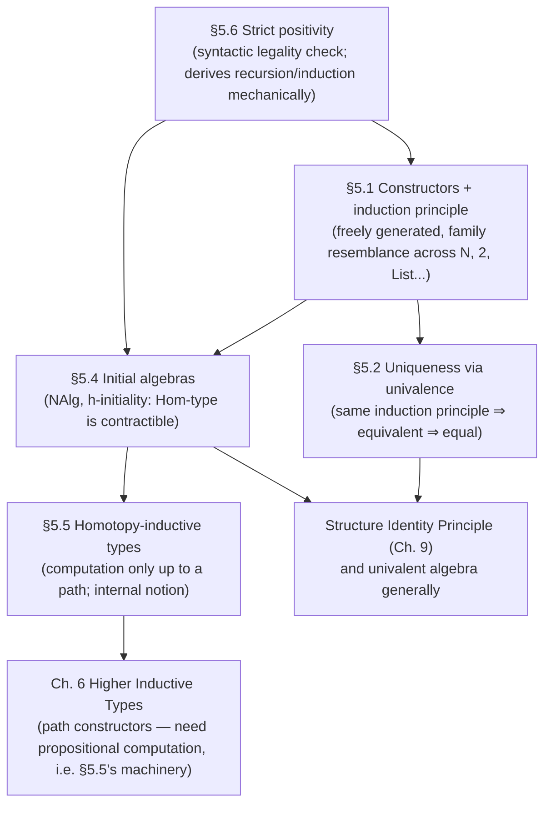

[[book-guidelines|↩ Back to guidelines]]

# Inductive Definitions and Initial Algebras

## Why you need a theory of inductive types, not just a list of them

By the end of Chapter 1 you have a working zoo: $\mathbf{0}$, $\mathbf{1}$, $\mathbf{2}$, $\mathbb{N}$, coproducts, products, $\Sigma$-types. Each one came with its own hand-written recursion and induction principle, stated as a special case, from scratch, every time. That's fine as a tour, but it leaves two questions completely open, and they're exactly the questions you'd ask if you were implementing a proof assistant's kernel rather than just reading about one:

1. **Given an arbitrary new type declaration — one the book's author never anticipated — how do I *mechanically* derive its recursion principle, its induction principle, and its computation rules?** If the answer is "you can't, you have to think about each case," then inductive types aren't really a *feature* of the type theory, they're a folklore pattern the metatheory doesn't actually understand.
2. **When are two "looks-the-same" type declarations actually forced to produce equal types?** $\mathbb{N}$ built as `zero`/`succ` and $\mathbb{N}$ built as `List(1)` (unary lists) are obviously "the same set" to a working mathematician. Is that a theorem, or a convention someone has to assert by hand?

Chapter 5 answers both. The answer to (2) turns out to be the categorical notion of *initial algebra*, generalized to homotopy-initiality; the answer to (1) is a syntactic discipline — **strict positivity** — precise enough that a compiler could check it, together with a mechanical recipe that reads a constructor's type off the page and produces the induction principle for it. This is, in a very literal sense, the chapter that specifies what "define a new type by `enum`/`inductive`/`data`" is allowed to mean, and why the kernel is entitled to trust whatever comes out. If you are eventually going to write a Rust type-checker that admits user-declared inductive types, §5.6 is close to the actual algorithm you'll implement, and §5.4–§5.5 is the soundness argument for why that algorithm doesn't let you smuggle in a paradox.

## Constructors as free generation (§5.1)

The book's starting intuition, stated plainly: an inductive type $X$ is "freely generated" by a finite list of *constructors*, each a function of some arity into $X$. A 0-ary constructor is just a distinguished element. $\mathbf{2}$ is generated by $0_{\mathbf 2}, 1_{\mathbf 2} : \mathbf 2$; $\mathbb N$ by $0 : \mathbb N$ and $\mathrm{succ} : \mathbb N \to \mathbb N$; lists by $\mathrm{nil}$ and $\mathrm{cons} : A \to \mathrm{List}(A) \to \mathrm{List}(A)$.

"Freely generated" is cashed out not as a direct axiom ("every element is $0$ or a successor") but as an **induction principle**: to prove $E : \mathbb N \to \mathcal U$ for every natural number, it suffices to supply
$$e_z : E(0) \qquad e_s : \prod_{n:\mathbb N} E(n) \to E(\mathrm{succ}(n)),$$
and the resulting $\mathrm{ind}_{\mathbb N}(E, e_z, e_s)$ *computes* judgmentally on the constructors:
$$\mathrm{ind}_{\mathbb N}(E,e_z,e_s,0) \equiv e_z, \qquad \mathrm{ind}_{\mathbb N}(E,e_z,e_s,\mathrm{succ}(n)) \equiv e_s(n, \mathrm{ind}_{\mathbb N}(E,e_z,e_s,n)).$$

This is exactly a `match` compiled into structural recursion — no surprise, since dependent pattern matching *is* sugar for the eliminator (§1.10, revisited in §5.6 below).

```rust
// The shape indN(E, e_z, e_s) compiles to, concretely:
enum Nat { Zero, Succ(Box<Nat>) }

fn ind_nat<E>(ez: E, es: impl Fn(&Nat, E) -> E, n: &Nat) -> E
where E: Clone {
    match n {
        Nat::Zero => ez,
        Nat::Succ(pred) => {
            let rec = ind_nat(ez.clone(), &es, pred); // the recursive call
            es(pred, rec)
        }
    }
}
```

```lean
-- Lean literally generates this from the `inductive` declaration:
inductive Nat where
  | zero : Nat
  | succ : Nat → Nat

-- `Nat.rec` is indN; `Nat.rec_zero`, `Nat.rec_succ` are the ≡ computation rules,
-- and they hold by `rfl` — i.e. by Lean's kernel-level definitional equality,
-- exactly the judgmental ≡ the book writes.
```

A subtlety worth flagging because the learning-goals thread (unification, `isDefEq`) depends on it: the computation rule is stated with $\equiv$, judgmental equality, not $=$, propositional equality. That distinction becomes the entire subject of §5.5.

**What breaks without an induction principle, only a recursion principle?** A recursion principle lets you build $f : \mathbb N \to C$ for a *fixed* codomain $C$, with no access to "the property being proved about $n$." You could define `double : Nat -> Nat`, but you could *not* prove `∀ n, double(succ n) = succ(succ(double n))` by recursion alone — that statement's truth value depends on $n$, so its proof needs induction's dependent codomain $E : \mathbb N \to \mathcal U$. Recursion is the special case of induction where $E$ is constant.

The book proves something stronger than "the eliminator lets you define functions": *functions satisfying the recurrences are unique*, even only up to propositional equality (Theorem 5.1.1, by induction on $D(x) :\equiv f(x) = g(x)$). This uniqueness theorem is the load-bearing lemma for everything that follows — it's what lets you say "these two constructions of $\mathbb N$ produce the same type" without hand-waving.

## Uniqueness of inductive types via univalence (§5.2)

Suppose you define $\mathbb N'$ with fresh constructors $0', \mathrm{succ}'$, syntactically distinct from $\mathbb N$ but obeying an identical-shaped induction principle. Traditionally you'd say "obviously the same" and move on — informally identifying isomorphic structures, at the cost of never making precise *how much* structure transfers.

HoTT does better because of a three-step argument that recurs constantly in this book:

1. Build mutually inverse maps $f : \mathbb N \to \mathbb N'$ and $g : \mathbb N' \to \mathbb N$ using each side's recursion principle.
2. Use the *uniqueness* theorem (5.1.1, and its "primed" twin) to show $g \circ f \sim \mathrm{id}$ and $f \circ g \sim \mathrm{id}$ — so $f$ is a quasi-inverse, giving $\mathbb N \simeq \mathbb N'$.
3. Apply **univalence**: $\mathbb N \simeq \mathbb N' \Rightarrow \mathbb N =_{\mathcal U} \mathbb N'$. Now every construction on $\mathbb N$ transports *automatically* along this path to a construction on $\mathbb N'$ — no manual insertion of $f$s and $g$s into every lemma statement, which is what you'd otherwise have to do (the book works out `double′` both ways to make the contrast concrete).

The book generalizes this immediately: *any* two types satisfying the same induction principle are equal, not just $\mathbb N$-shaped ones — e.g. $\mathrm{List}(\mathbf 1) \simeq \mathbb N$ by exhibiting a recurrence-compatible relabeling ($\mathrm{nil} \mapsto 0$, $\mathrm{cons}(\star,\ell) \mapsto \mathrm{succ}(\ell)$). This is the type-theoretic incarnation of the categorical fact "objects with the same universal property are canonically isomorphic" — which is exactly what §5.4 makes literal.

## Initial algebras: the categorical universal property (§5.4)

Here the chapter names the universal property inductive types actually have. Package $\mathbb N$'s constructor data as algebraic structure:

> **Definition 5.4.1.** An $\mathbb N$-**algebra** is a type $C$ with $c_0 : C$ and $c_s : C \to C$: $\mathrm{NAlg} :\equiv \sum_{C:\mathcal U} C \times (C \to C)$.
>
> **Definition 5.4.2.** An $\mathbb N$-**homomorphism** $(C,c_0,c_s) \to (D,d_0,d_s)$ is $h : C \to D$ with $h(c_0) = d_0$ and $h(c_s(c)) = d_s(h(c))$ for all $c$.

$\mathbb N$-algebras and their homomorphisms form a category, and the claim — familiar to any category theorist as "$\mathbb N$ is a natural numbers object" — is that $(\mathbb N, 0, \mathrm{succ})$ is **initial** in it: there's a unique homomorphism out of it to any other algebra.

But "unique" in a category built from types that behave like $\infty$-groupoids can't mean "unique up to isomorphism" in the 1-categorical sense — every hom-type here is itself a type with potential higher path structure. So the book defines **homotopy-initiality**:

$$\mathrm{isHinit}_{\mathbb N}(I) :\equiv \prod_{C : \mathrm{NAlg}} \mathrm{isContr}\big(\mathrm{NHom}(I,C)\big).$$

Not "there exists a unique morphism" (a $\Sigma$-type sliced by a mere proposition) but "**the type of morphisms is contractible**" — literally has exactly one point up to a canonical path, and moreover that point's uniqueness proof is itself unique, and so on up the dimensions. This is the correct, homotopically-coherent replacement for 1-categorical initiality, and it sidesteps having to formally define $(\infty,1)$-categories to state it.

Two theorems then do the real work:

- **Theorem 5.4.4** (uniqueness of h-initial objects): if $I,J$ are both h-initial, contractibility of $\mathrm{NHom}(I,J)$ and $\mathrm{NHom}(J,I)$ gives mutually-inverse homomorphisms $f,g$ whose composites equal identities *because* $\mathrm{NHom}(I,I)$ and $\mathrm{NHom}(J,J)$ are contractible (so any two self-homomorphisms are equal, in particular $g\circ f = \mathrm{id}$). Hence $I \simeq J$, hence $I = J$ by univalence — h-initial algebras aren't just isomorphic, they're a *mere proposition*: the type of proofs "$I$ is h-initial" has at most one inhabitant up to equality.
- **Theorem 5.4.5**: $(\mathbb N, 0, \mathrm{succ})$ *is* h-initial. The recursion principle builds the unique-up-to-path homomorphism directly, and Theorem 5.1.1 supplies the contraction.

Generalizing $\mathbb N$'s algebra to an arbitrary $W$-type $W_{(a:A)}B(a)$, the book associates a **polynomial functor**
$$P(X) :\equiv \sum_{x:A} \big(B(x) \to X\big),$$
a $P$-algebra is $(C, s_C : PC \to C)$, and h-initiality is defined the same way (contractible hom-type into every other algebra). **Theorem 5.4.7**: $(W_{(x:A)}B(x), \mathrm{sup})$ is h-initial for this functor. The strict-positivity restriction from §5.6 exists *precisely* so that "the endofunctor associated to a constructor list" is always polynomial — general endofunctors need not have initial algebras at all (a fact from ordinary category theory the book flags in a footnote), so restricting to the polynomial case is what buys consistency for free.

```rust
// The "algebra" and "polynomial functor" picture translated directly:
// P(X) = Σ(a:A) (B(a) → X)   —   an algebra is a coalgebra-shaped carrier + a map PC → C
trait NatAlgebra {
    fn zero() -> Self;
    fn succ(self) -> Self;
}

// A homomorphism is exactly a structure-preserving map:
fn nat_hom<C: NatAlgebra, D: NatAlgebra>(
    h: impl Fn(C) -> D,
    c0: C, cs: impl Fn(C) -> C,
) -> bool {
    // laws that must hold, not something Rust's type system enforces on its own:
    // h(c0) == D::zero()  and  h(cs(c)) == h(c).succ()
    true // stand-in: in Rust these are propositions you'd prove externally,
         // not types the compiler checks — this is exactly the gap a
         // refinement-type / verifier layer exists to close.
}
```

The Rust sketch above is deliberately limited: Rust's trait system can state the *signature* of an algebra homomorphism but has no way to state, let alone check, the propositional laws $h(c_0)=d_0$ and $h(c_s(c))=d_s(h(c))$ as first-class obligations. That gap — "the type system can express the interface but not the contract" — is exactly what a refinement-type layer with Hoare-style pre/postconditions is for, which is one reason this initial-algebra picture is worth internalizing before designing such a system: your verifier's job is to make the homomorphism laws checkable obligations, not just comments.

## Homotopy-inductive types: computing only up to a path (§5.5)

Encode $\mathbb N$ as a $W$-type: $\mathbb N^w :\equiv W_{(b:\mathbf 2)}\,\mathrm{rec}_{\mathbf 2}(\mathcal U, \mathbf 0, \mathbf 1, b)$, with $0^w :\equiv \mathrm{sup}(0_{\mathbf 2}, \lambda x.\,\mathrm{rec}_{\mathbf 0}(\mathbb N^w,x))$ and $\mathrm{succ}^w :\equiv \lambda n.\,\mathrm{sup}(1_{\mathbf 2}, \lambda x.\,n)$. The *recursion* principle transfers cleanly (the book works `double` through it explicitly). But the **induction** principle doesn't: given $E : \mathbb N^w \to \mathcal U$ and recurrences $e_z, e_s$, the derived eliminator only satisfies them *propositionally* — up to a path, not up to $\equiv$. The judgmental computation rules for ordinary $\mathbb N$ cannot be recovered from the $W$-type encoding "in any obvious way."

Rather than treat this as a defect to route around, the book turns it into a *definition*: a **homotopy-inductive type** is one where every computation rule is asserted up to a path from the start — $\equiv$ replaced by $=$ everywhere, including in the type of the eliminator itself. Why bother?

- Not every h-initial algebra literally satisfies the strict, judgmental induction principle — but *every* h-initial algebra is a homotopy-inductive type. Homotopy-inductive types are the notion that exactly matches h-initiality; ordinary (judgmental) inductive types are a strictly stronger, and not always available, refinement.
- The notion becomes **internal**: because propositional equalities are themselves data (paths, elements of a type), you can package "being a homotopy-$W$-type" as a single type and quantify over it — impossible for a notion resting on judgmental equality, which lives at the meta-level and can't be talked about *inside* the theory.

The book gives three equivalent packagings of "$X$ is a homotopy-$W$-type for $(A,B)$":

- $W^d(A,B)$ — carrier + supremum map + a full induction principle with *propositional* computation rule,
- $W^s(A,B)$ — carrier + supremum + a plain (non-dependent) recursion principle, plus explicitly postulated uniqueness and coherence laws (since without induction, uniqueness is no longer derivable — it has to be an axiom),
- $W^h(A,B)$ — the h-initial-algebra packaging directly: $\sum_{I : \mathrm{WAlg}(A,B)} \mathrm{isHinit}_W(A,B,I)$.

**Lemma 5.5.4**: $W^d(A,B) \simeq W^s(A,B) \simeq W^h(A,B)$, and each is a *mere proposition* (Theorems 5.5.1–5.5.3) — being a homotopy-$W$-type is a property a type either has or doesn't, not extra structure with multiple witnesses to keep track of. **Theorem 5.5.5** sharpens 5.4.7: h-initial $W$-algebras are *precisely* the types satisfying the (propositional) formation/introduction/elimination/computation rules — not just "h-initiality implies you can build an eliminator," but the converse too, proved by the classic categorical trick of building $C :\equiv \sum_{w:W} C'(w)$, using h-initiality to get a section, and extracting the eliminator from it.

For a compiler/kernel builder, the practical upshot: if your kernel's normalizer only ever needs `rfl`-style judgmental computation for canonicity and decidable type-checking, you want ordinary inductive types with strict $\equiv$ rules. If you're instead building a *model* of the type theory internally (e.g. proving consistency, or implementing HITs where strict computation for path constructors is provably unattainable — foreshadowing Chapter 6), homotopy-inductive types are the right level of strictness to demand, and no more.

## Strict positivity: the syntactic condition that makes any of this legal (§5.6)

Steps back to ask: given an arbitrary list of constructor signatures, when is it a *legitimate* inductive definition at all — one for which a consistent recursion/induction principle can be derived?

**The naive necessary condition.** Replace every occurrence of the type being defined, $W$, by a fresh variable $X$. Each constructor's domain must be expressible as a **covariant functor of $X$** — informally, "$X$ only ever appears in positions you could map over." $\mathrm{inl} : A \to A+B$: the functor is constant ($X \mapsto A$), trivially covariant. $\mathrm{succ} : \mathbb N \to \mathbb N$: the functor is the identity ($X \mapsto X$), covariant.

The book motivates this with a broken counterexample: a constructor $g : (C \to \mathbb N) \to C$. Given $f : C \to P$ under construction, the "recursive call" would need to apply $f$ to $\alpha : C \to \mathbb N$ — but $\alpha$ is a function *out of* $C$, so "$f(\alpha)$" doesn't typecheck; $C$ occurs *contravariantly* (on the left of an arrow) in the domain, and there is no way to functorially transform it along $f$.

**Why covariance alone isn't enough.** The composite of two contravariant functors is covariant, so double-negation-shaped domains like $(X \to \mathrm{Prop}) \to \mathrm{Prop}$ pass the naive covariance test while still being dangerous — they let $W$ occur underneath a function arrow *twice*. The book then gives a full worked Cantor-style paradox: postulate
$$k : \big((D \to \mathrm{Prop}) \to \mathrm{Prop}\big) \to D,$$
and derive an injection of "the power set of $D$" into $D$ (via $f(\delta) :\equiv k(\lambda x.\,x = \delta)$), then a diagonal proposition $\theta(\gamma) :\equiv \neg\, p(\gamma)(\gamma)$ that forces $p(\delta)(\delta) = \neg p(\delta)(\delta)$ — a genuine logical contradiction, not merely a surprising type. **This is a live, checkable derivation of $\bot$, not a hand-wave** — it's the reason the restriction below is non-negotiable rather than a stylistic preference.

**Strict positivity.** Ban the type being defined from ever appearing *to the left of an arrow* in a constructor's domain — even nested arbitrarily deeply inside other arrows, so that a merely-eventually-covariant occurrence like $(X\to\mathrm{Prop})\to\mathrm{Prop}$ is still forbidden. (Occurrences in the domain of a dependent $\Pi$-type are forbidden too, for the same reason.) A constructor signature like
$$c : (A \to W) \to (B \to C \to W) \to D \to W \to W$$
is legal: every occurrence of $W$ is either absent from a component, or sits purely in a *codomain* position, however many arrows deep.

This is the general form the induction/recursion principles are read off of mechanically:

- **Recursion.** Build $f : W \to P$ by supplying, for the constructor above, a "compiled" function
  $$d : (A \to W) \to (A \to P) \to (B \to C \to W) \to (B \to C \to P) \to D \to W \to P \to P,$$
  i.e. *for every domain component that mentions $W$, add a parallel component with $W$ replaced by $P$* — that extra component is where the recursive call's result lands. The computation rule is then read off directly: $f(c(\alpha,\beta,\delta,\omega)) \equiv d(\alpha, f\!\circ\!\alpha,\ \beta, f\!\circ\!\beta,\ \delta,\ \omega,\ f(\omega))$.
- **Induction.** Same recipe, but generalize $P$ to a family $P : W \to \mathcal U$ and replace each "recursive-call" component $A \to P$ by the dependent $\prod_{a:A} P(\alpha(a))$ — you don't just get "$f$ applied to the sub-piece," you get the *inductive hypothesis about* that sub-piece.
- **Pattern matching** (§1.10's sugar, revisited here) is exactly writing definitional equations `f(c(α,β,δ,ω)) :≡ ⋯` where the right-hand side may mention recursive calls `f(α(a))`, `f(β(b,c))`, `f(ω)` — which desugars, mechanically, into exactly the $d$/$\mathrm{ind}_W$ term above.

This is, essentially verbatim, the algorithm a kernel implementer runs: parse a constructor telescope, check every occurrence of the type-being-defined is strictly positive (a purely syntactic scan — no semantic reasoning needed, which is exactly why it's decidable and cheap enough to run on every declaration), then mechanically generate the eliminator's type by "twinning" each self-referential argument with a motive-instantiated counterpart. Lean, Coq/Rocq, and Agda all implement a variant of precisely this check as a compile-time gate before accepting an `inductive`/`data` declaration — reject anything with a negative occurrence, accept and auto-derive the eliminator otherwise.

```lean
-- Legal: W only appears in codomain position, however deep.
inductive Tree (A B C D : Type) (W : Type) where
  | c : (A → W) → (B → C → W) → D → W → W

-- Illegal — Lean's positivity checker rejects this outright:
-- inductive Bad where
--   | g : (Bad → Nat) → Bad
-- error: constructor 'Bad.g' has a non-positive occurrence
--        of the inductive datatype 'Bad'
```

```python
# The mechanical "twinning" the recursion principle performs, sketched:
# for a domain component X -> W, add a parallel component X -> P
# (the slot where the recursive call's result goes).
def derive_recursor_signature(ctor_domain_components, W, P):
    hyp = []
    for comp in ctor_domain_components:
        hyp.append(comp)
        if mentions(comp, W):
            hyp.append(replace(comp, W, P))  # the "recursive call" slot
    return hyp
```

Strict positivity is, concretely, a **decidable syntactic well-formedness check that stands between a user's type declaration and a sound kernel** — a smaller, sharper cousin of the termination/positivity checks that guard every proof assistant's trusted core. If you're scoping out a trusted computing base for a verifier, this is the shape that check takes: cheap, syntactic, and load-bearing for consistency, in contrast to termination checking (needed for total recursion, not discussed in this section) which is usually far more expensive and heuristic.

## Synthesis



This chapter is the theory that everything calling itself "an inductive type" elsewhere in the book has to satisfy. The $W$-types of §2.2/§5.3 are the concrete polynomial-functor case; §5.6's strict positivity is precisely the condition that guarantees the associated endofunctor *is* polynomial, so that §5.4's h-initiality theorem applies to it. Chapter 6's [[Higher-Inductive-Types|higher inductive types]] push past ordinary strict positivity into constructors that produce *paths*, not just points — and the reason Chapter 6 needs the propositional-computation-rule apparatus of §5.5 at all is that path constructors essentially *never* admit judgmental computation rules, only propositional ones; §5.5 is where that idea is first isolated and studied on the comparatively tame $W$-type case, before Chapter 6 has to live with it as the norm rather than the exception. Later, the Structure Identity Principle (Chapter 9) and the "equality of algebraic structures via univalence" theme (already previewed in §2.14 and reused throughout §5.2) both generalize the exact "same universal property $\Rightarrow$ equal" argument built here into general categorical structures, not just inductive types.

For the compiler-and-elaborator project this workbench is built around, this chapter is close to load-bearing in the most literal sense: strict positivity (§5.6) is the well-formedness gate your kernel runs on every user-declared inductive type before trusting it at all; the mechanical recursion/induction-principle derivation is the actual code you'd write to support user-defined `inductive` declarations rather than a hard-coded list of built-ins; and the initial-algebra semantics (§5.4) is the *specification* against which that generated eliminator's correctness should be judged — "does the eliminator I derived actually witness h-initiality" is a soundness question with a precise, checkable answer, not a matter of taste. [[Type-Theory-as-a-Foundational-System-Qwen#The distinction|The distinction]] between ordinary and homotopy-inductive types (§5.5) also foreshadows a design decision you'll face directly: whether your kernel demands judgmental ($\equiv$) computation for every eliminator (fast, decidable type-checking, but restrictive) or tolerates propositional ($=$) computation for some constructs (more expressive, but pushes proof obligations — and trust — outward from the kernel into user-supplied proof terms).
