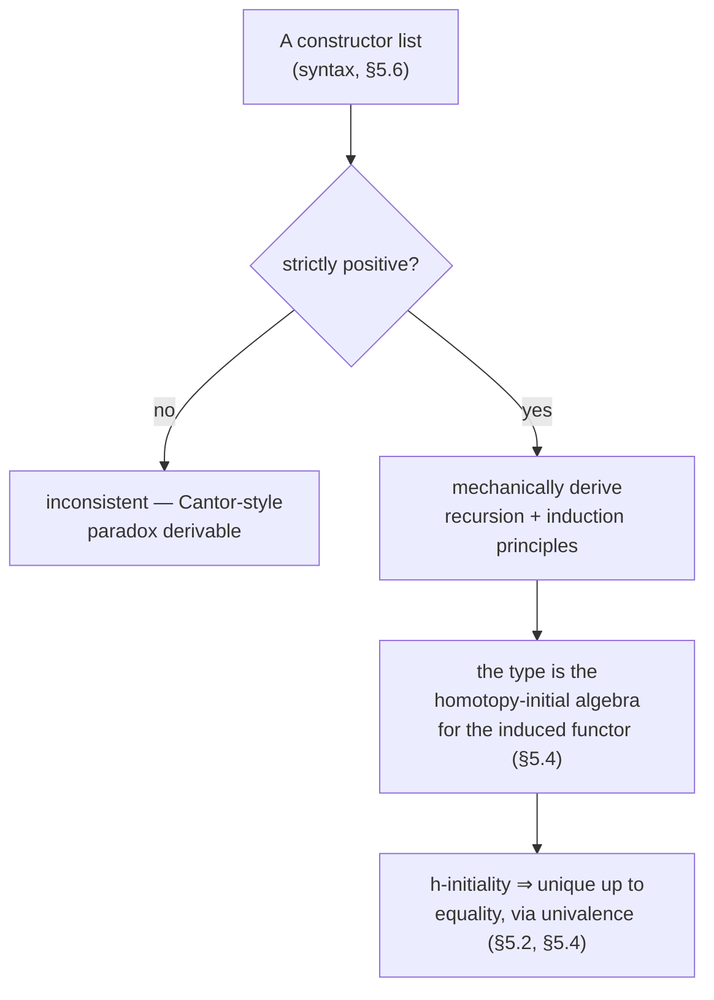
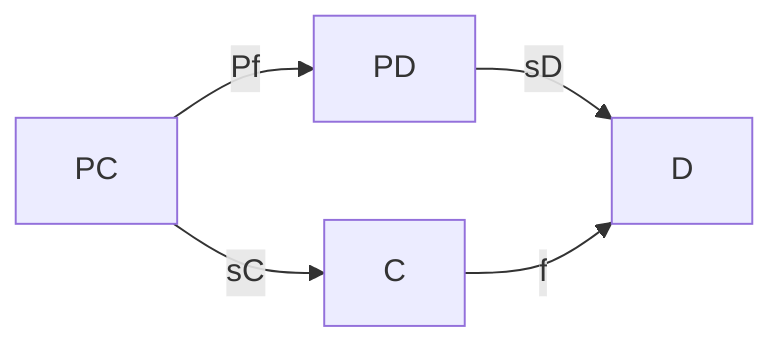
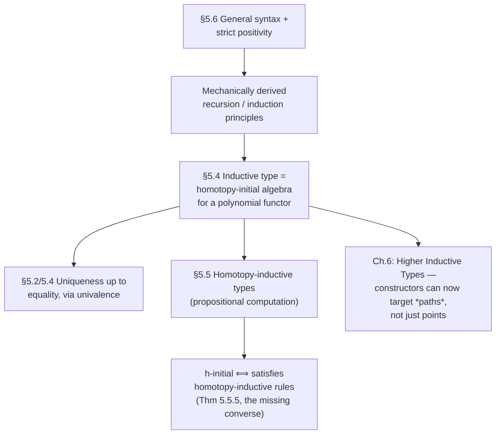

[[book-guidelines|↩ Back to guidelines]]

# Inductive Definitions and Initial Algebras

## Why a *general theory* of "inductive type" has to exist at all

Chapter 1 handed you seven type formers — $\mathbf 0$, $\mathbf 1$, $\mathbf 2$, $A+B$,
$A\times B$, $\mathbb N$, and (later) $W$-types — each arriving with its own hand-written
recursor, its own computation rule, its own induction principle. [[Type-Formers-and-Their-Universal-Properties|The
W-types article]] already showed that all of them are instances of one shape: labels with
arities, `sup(a, f)`, structural recursion on trees. But that raises the real question this
article answers: if I, the type theory *user*, want to define my *own* new inductive type —
some data structure the book's authors never anticipated — what rules govern which
"constructor lists" are even legal, and where do the induction principle, the recursion
principle, and the initiality property *come from*? Nobody hands you a bespoke recursor for a
type you just invented; you have to be able to derive it mechanically from the shape of the
constructors alone.

This is exactly the problem a compiler author solving `inductive Foo where | mk1 : ... | mk2 :
...` has to solve for real: given an arbitrary declaration, synthesize the eliminator, its
computation rules, and — if you want a semantic account of what makes the declaration
*consistent* — a proof that it denotes something at all. HoTT's Chapter 5 answers this in three
moves, and this article walks through each:

1. **A general syntax** for what a legal constructor list looks like, and a syntactic
   restriction — **strict positivity** — that keeps arbitrary "definitions" from being
   inconsistent (§5.6).
2. **A uniform recipe** for reading off the induction and recursion principles from that syntax,
   mechanically, the same way a `.rec`/`.ind` generator in a proof assistant's kernel does
   (§5.1, §5.6).
3. **A category-theoretic characterization**: an inductive type isn't just "the type generated
   by these constructors" as an intuition — it is the **homotopy-initial algebra** for the
   endofunctor those constructors determine, and this universal property, not the syntax, is
   what actually pins the type down up to equality (§5.4–§5.5).



---

## 1. What breaks if you don't restrict the syntax at all

Start from the failure case, because it's the cleanest way to see *why* the restriction the
book eventually imposes is exactly the one it is, and not something weaker.

Suppose you let yourself write down any "constructor" you like. Consider:

$$g : (C \to \mathbb N) \to C$$

as a single constructor for a type $C$. What would the recursion principle even say? To define
$f : C \to P$, you'd want to handle the case $c \equiv g(\alpha)$ for $\alpha : C \to \mathbb N$,
and — following the pattern from every recursor you've seen — you'd want to "recursively call
$f$" on the constructor's arguments. But $\alpha$ has type $C \to \mathbb N$, not $C$: there is
no sensible way to "apply $f$ to $\alpha$," because both $f$ and $\alpha$ have $C$ in their
*domain*. The recursive-call machinery that works fine for `succ : N → N` (apply $f$ to the one
argument of type $\mathbb N$) has nothing to grab onto here.

You could dodge this by *not* trying to recurse into $\alpha$ — just treat $C \to \mathbb N$ as
an opaque indexing family and give the recursor $h : (C \to \mathbb N) \to P$ with computation
rule $\mathrm{rec}_C(P, h, g(\alpha)) \equiv h(\alpha)$. This typechecks as a *syntactic*
recipe. But the book states plainly that a type $C$ with exactly this recursor is
**inconsistent** — you can derive $\mathbf 0$ from it (Exercises 5.7–5.10). The problem is that
$C$ appears to the *left* of an arrow in the type of its own constructor's argument: $\alpha : C
\to \mathbb N$ is *contravariant* in $C$. A constructor that consumes "the type being defined"
contravariantly lets you build something big enough to diagonalize against itself.

### The sharper trap: double negatives look covariant but aren't safe

You might think: fine, just ban $C$ appearing to the left of a single arrow, i.e. require every
constructor argument to be *covariant* in the type being defined (formation `X ↦ A` for a
constant `A`, or `X ↦ X` for the identity, or composites of those, are all covariant). But
composing two contravariant functors is *covariant* — $(X \to \mathrm{Prop}) \to \mathrm{Prop}$
passes the "covariance" test purely syntactically, since $C$ occurs twice, both times to the
left of an arrow, canceling out. And this is enough to reconstruct a genuine paradox. The book
works out the full argument for a type $D$ with constructor

$$k : ((D \to \mathrm{Prop}) \to \mathrm{Prop}) \to D$$

By defining an "inverse" $r$ via the recursion principle of $D$, and an injection $f : (D \to
\mathrm{Prop}) \to D$ via $f(\delta) :\equiv k(\lambda x.\, (x = \delta))$, one shows $f$ is
injective — which means $D$ admits an injection *from its own power type*, a direct
proof-relevant analogue of Cantor's theorem being violated. A diagonal predicate
$\theta(\gamma) :\equiv \neg\, p(\gamma)(\gamma)$ (where $p$ is built from $f$'s inverse) then
produces a proposition equivalent to its own negation — a genuine contradiction, not just an
awkward definition.

**What this buys you, precisely:** the lesson isn't "avoid contravariance," full stop — it's
that *nested* contravariance, however many arrows deep, is still unsafe if the type being
defined ever sits to the left of *any* arrow along the way. So the book's actual restriction —
**strict positivity** — is stronger than plain covariance: the type being defined may never
occur in the domain of a function type anywhere in a constructor's argument types, not even
nested arbitrarily deep inside further arrows where the sign would formally cancel out to
"positive." Only strictly-positive occurrences (always in a *return* position, however deeply
nested under further covariant constructions) are permitted.

> Footnote worth internalizing (the book states this explicitly, §5.6 n.1): strict positivity is
> exactly the condition ensuring the endofunctor determined by the constructors is
> **polynomial** — and it is a standard fact in category theory that arbitrary endofunctors need
> not have initial algebras at all, while polynomial functors always do. The syntactic
> restriction and the semantic guarantee (§4 below) are two views of the same fact.

**[[Homotopical-Interpretation-of-Type-Theory#Grounding|Grounding]] — this is exactly the "positivity checker" in a real kernel.** Any language with
user-declared inductive/recursive types has to run this exact check. Rust's `enum` sidesteps the
issue entirely by requiring recursive fields to go through `Box`/`Vec`/a pointer indirection
(so the compiler never needs a positivity checker — indirection makes size-computation trivial,
which is a *different* problem strict positivity doesn't address, but the two get conflated in
practice). Lean's kernel, by contrast, runs a real strict-positivity check on every `inductive`
declaration:

```lean
-- accepted: C occurs only in return position (covariant, strictly positive)
inductive Tree (A : Type) where
  | leaf : A → Tree A
  | node : (Tree A → Tree A) → Tree A   -- OK: Tree only appears as a *codomain*

-- rejected by Lean's kernel with "constructor resulting type is not
-- valid, it must be an inductive datatype" / positivity failure:
-- inductive Bad where
--   | mk : (Bad → Prop) → Bad
```

If you are ever writing your own elaborator/kernel for a checker that accepts user-defined
inductive types (per the standing project's "accept arbitrary declarations, not hard-code
`Nat`/`List`" goal), this positivity check is not optional scaffolding — it is the difference
between a sound kernel and one where `Prop`/`False` becomes derivable from a legal-looking
declaration.

---

## 2. The general syntax, and reading off the eliminator mechanically

Having ruled out the bad case, the book states the general shape a **valid** inductive
definition of a type $W$ takes: a *finite* list of constructors, each assigned a function type
that takes some number of (possibly dependent) arguments and returns an element of $W$, where
$W$ itself may occur in argument types **only strictly positively** — i.e., each argument is
either a type not mentioning $W$ at all, or an iterated (possibly dependent) function type whose
*codomain* is $W$. The book's running example constructor:

$$c : (A \to W) \to (B \to C \to W) \to D \to W \to W \tag{5.6.4}$$

is legal: $W$ appears as the codomain of `A → W`, as the codomain of `B → C → W`, and bare, but
never as a domain.

### Recursion principle: mechanical, from the shape alone

To build $f : W \to P$, you need one case per constructor, and inside each case you get to
*recursively call* $f$ on every strictly-positive occurrence of $W$ in that constructor's
arguments — because those occurrences are exactly the ones $f$ can be legally composed with
(covariance is precisely "you can post-compose"). For constructor `c` above, the recursor needs:

$$d : (A \to W) \to (A \to P) \to (B \to C \to W) \to (B \to C \to P) \to D \to W \to P \to P
\tag{5.6.5}$$

— read this left to right: the *raw* argument `α : A → W`, then the *recursive-call result*
`A → P` obtained by post-composing `α` with `f`; the raw `β : B → C → W`, then its recursive
result `B → C → P`; the non-recursive `δ : D` untouched; the raw `ω : W`, then its recursive
result `P`. The computation rule is exactly what you'd guess:

$$f(c(\alpha,\beta,\delta,\omega)) \equiv d(\alpha,\, f\circ\alpha,\, \beta,\, f\circ\beta,\, \delta,\, \omega,\, f(\omega)) \tag{5.6.6}$$

### Induction principle: same shape, dependent codomain

The induction principle is the same recipe, but the "recursive-call result" types become
dependent: instead of a flat `A → P`, you need $\prod_{a:A} P(\alpha(a))$ — a proof of the
motive at every recursively-reached point, not just a value:

$$d : \prod_{\alpha:A\to W}\Big(\prod_{a:A}P(\alpha(a))\Big) \to \prod_{\beta:B\to C\to W}\Big(\prod_{(b,c)}P(\beta(b,c))\Big) \to \prod_{\delta:D}\prod_{\omega:W} P(\omega) \to P(c(\alpha,\beta,\delta,\omega)) \tag{5.6.7}$$

The recursion principle is literally the special case where $P$ is taken to be a constant
family — the same relationship you already saw for $\mathbb N$ and for $W$-types, now stated
once, generically, for *any* legal inductive definition. This is also precisely how definitions
by pattern matching (§1.10) get "compiled" back down to an explicit `ind` call: each clause
`f(c(α,β,δ,ω)) :≡ ⋯` may use recursive calls `f(α(a))`, `f(β(b,c))`, `f(ω)` on the right,
and these get systematically replaced by fresh bound variables `ᾱ`, `β̄`, `ω̄` of exactly the
motive-applied types above when repackaging the definition as `ind_W(P, …)`.

**Grounding.** This is exactly what a `#[derive(...)]`-style eliminator generator, or a proof
assistant's automatic `.rec`/`.ind` synthesis, computes from a declaration's AST: walk each
constructor's argument list, and for every argument whose type has $W$ (the type being defined)
appearing only in codomain position, add a matching "recursive result" slot right after it.

```rust
// The shape of constructor (5.6.4), directly transcribed. Rust can't express the
// strict-positivity check as a *language rule* (it doesn't need to, since Box<T>
// sidesteps the sizing issue that positivity in HoTT is not actually about) —
// but the eliminator's *shape* is identical to (5.6.5) once you write it by hand:
enum W<A, B, C, D> {
    C(fn(A) -> Box<W<A, B, C, D>>, fn(B, C) -> Box<W<A, B, C, D>>, D, Box<W<A, B, C, D>>),
}

// recursor: one "recursive result" slot per strictly-positive occurrence — this
// is (5.6.5) read off the constructor's shape, mechanically:
fn rec_w<A, B, C, D, P: Clone>(
    d: impl Fn(/*α*/ &dyn Fn(A) -> W<A,B,C,D>, /*f∘α*/ &dyn Fn(A) -> P,
               /*β*/ &dyn Fn(B, C) -> W<A,B,C,D>, /*f∘β*/ &dyn Fn(B, C) -> P,
               D, /*ω*/ &W<A,B,C,D>, /*f(ω)*/ P) -> P,
    w: &W<A, B, C, D>,
) -> P {
    todo!("walk w, recurse into the boxed W occurrences, apply d")
}
```

```lean
-- Lean synthesizes exactly (5.6.7) for you when you write the inductive declaration;
-- `@W.rec` printed by #check has this precise shape, one motive-applied hypothesis
-- per strictly-positive recursive occurrence, generated by the kernel — you never
-- hand-write it, but it is (5.6.7) verbatim, specialized to your constructors.
inductive Wex (A B C D : Type) where
  | c : (A → Wex A B C D) → (B → C → Wex A B C D) → D → Wex A B C D → Wex A B C D

#check @Wex.rec
```

---

## 3. Inductive types *are* homotopy-initial algebras

Everything so far has been syntax: a recipe for writing down constructors and mechanically
reading off an eliminator. But *why* should this recipe pin down "the" type it defines, up to
equality, rather than just being one possible implementation among many? The book's answer is a
universal property, borrowed from category theory and adapted to homotopy: an inductive type is
the **homotopy-initial algebra** for the endofunctor its constructors determine.

### Warm-up: $\mathbb N$-algebras

Strip away everything specific to $\mathbb N$ except the *shape* of its constructors — a point
and a self-map:

> **Definition 5.4.1.** An $\mathbb N$-**algebra** is a type $C$ equipped with $c_0 : C$ and
> $c_s : C \to C$. $\mathrm{NAlg} :\equiv \sum_{C:\mathcal U} C \times (C \to C)$.
>
> **Definition 5.4.2.** An $\mathbb N$-**homomorphism** between algebras $(C,c_0,c_s)$ and
> $(D,d_0,d_s)$ is $h : C \to D$ with $h(c_0) = d_0$ and $h(c_s(c)) = d_s(h(c))$ for all $c:C$ —
> i.e. a structure-preserving map, exactly the category-theorist's notion of algebra
> homomorphism for the functor $F(X) :\equiv X + \mathbf 1$.

Any type with a distinguished point and a self-map is an $\mathbb N$-algebra — $\mathbb N$
itself with $(0,\mathrm{succ})$, but also, say, $\mathbb Z$ with $(0, n\mapsto n+1)$, or
$\mathbf 2$ with $(0_{\mathbf 2}, \lambda x.\,1_{\mathbf 2})$. What's special about $\mathbb N$ is
that it's *initial* among these: from every other $\mathbb N$-algebra there is a unique (not
just "a") structure-preserving map out of $\mathbb N$.

> **Definition 5.4.3.** $I$ is **homotopy-initial** (h-initial) if for every $\mathbb N$-algebra
> $C$, the *type* of homomorphisms $I \to C$ is **contractible** —
> $\mathrm{isHinit}_{\mathbb N}(I) :\equiv \prod_{C:\mathrm{NAlg}} \mathrm{isContr}(\mathrm{NHom}(I,C))$.

Contractibility, not mere inhabitation, is the load-bearing upgrade over 1-categorical
initiality: it says the homomorphism exists *and* any two such homomorphisms are connected by a
canonical (in fact, unique-up-to-higher-path) identification, which is exactly what "uniqueness
up to unique isomorphism" has to mean once you take the $\infty$-groupoid structure of types
seriously — you cannot get away with mere set-level uniqueness for an $(\infty,1)$-categorical
statement.

**Theorem 5.4.5.** $(\mathbb N, 0, \mathrm{succ})$ is h-initial. *Proof sketch:* the recursion
principle of $\mathbb N$ directly builds a homomorphism $f$ into any algebra $(C,c_0,c_s)$ by
$f(0):\equiv c_0$, $f(\mathrm{succ}(n)):\equiv c_s(f(n))$; that's the center of contraction, and
the uniqueness theorem for $\mathbb N$ (the propositional-uniqueness fact you get for free from
having an *induction*, not just a recursion, principle) shows every other homomorphism equals
it.

And crucially, h-initial algebras are unique **as elements of a type**, not just "unique up to
isomorphism" as a loose figure of speech:

> **Theorem 5.4.4.** Any two h-initial $\mathbb N$-algebras are equal. (Sketch: mutual
> homomorphisms $f: I\to J$, $g:J\to I$ compose to homomorphisms $I \to I$ and $J \to J$; but
> $\mathrm{NHom}(I,I)$ is contractible and contains $\mathrm{id}_I$, forcing $g\circ f =
> \mathrm{id}_I$, and symmetrically $f \circ g = \mathrm{id}_J$. So $I \simeq J$, and by
> **[[Formal-Metatheory#Univalence|univalence]]**, $I = J$.)

This is the exact same "same universal property ⇒ equivalent ⇒ (by univalence) equal" move
from §5.2's discussion of $\mathbb N$ vs. an isomorphic $\mathbb N'$ — except now it is stated
*abstractly*, as a theorem about *any* h-initial algebra, rather than proved by hand for one
pair of isomorphic-looking definitions each time.

### The general case: polynomial functors and $W$-algebras

The $\mathbb N$ story generalizes uniformly to $W$-types (and, implicitly, to any strictly
positive constructor list, since — per §2 above — strict positivity is exactly what makes the
associated functor polynomial). Given $A : \mathcal U$ and $B : A \to \mathcal U$, the
**polynomial functor** they determine is

$$P(X) :\equiv \sum_{x:A} \big(B(x) \to X\big) \tag{5.4.6}$$

A **$P$-algebra** (equivalently, a $W$-algebra for $A,B$) is a type $C$ with a structure map
$s_C : PC \to C$ — by the universal property of $\Sigma$-types, this unpacks to exactly
$\prod_{a:A}(B(a) \to C) \to C$, i.e. "given a label and its $B(a)$-many children (already
mapped into $C$), produce a $C$." A **homomorphism** $(C,s_C) \to (D,s_D)$ is $f : C \to D$
together with a homotopy witnessing that the square



commutes: $f \circ s_C \sim s_D \circ Pf$. And $(C,s_C)$ is h-initial exactly as before —
contractible homomorphism-type into every $P$-algebra.

**Theorem 5.4.7.** $(W_{(x:A)} B(x), \mathrm{sup})$ is h-initial. The proof pattern is identical
in spirit to the $\mathbb N$ case (build the unique-up-to-contractibility homomorphism via the
$W$-elimination and computation rules), but the *coherence* data is genuinely harder: showing
$(f, s_f) = (g, s_g)$ for two homomorphisms requires exhibiting not just a path $e : f = g$ but
a *higher* path $s_e$ between the two ways $s_f$ and $s_g$ transport along $e$ — an "algebra
2-cell." This is the first place in the chapter where the "up to coherent homotopy" qualifier in
"homotopy-initial" is doing real, unavoidable work rather than being a decorative prefix: at
set-level, "unique up to isomorphism" is a single equation; at $\infty$-groupoid level, you need
the *paths between the paths* to also cohere, and the book's proof of Theorem 5.4.7 is precisely
[[Homotopical-Interpretation-of-Type-Theory#The construction|the construction]] of that missing layer.

**Why this matters more than the syntax from §2:** the syntactic recipe (constructors →
eliminator) tells you *how to compute with* an inductive type. The initial-algebra
characterization tells you *what it means for a type to deserve the name* — it is the answer to
"give me the free structure generated by these constructors and nothing else," stated as a
universal property independent of any particular syntactic presentation. Two different-looking
definitions (say, $\mathbb N$ built directly vs. $\mathbb N^w$ built as a $W$-type) are equal
not because you laboriously check they satisfy the same rules by hand (§5.2's approach), but
because *both* are h-initial algebras for the same functor, and h-initial algebras are
unique by Theorem 5.4.4's argument, full stop.

**Grounding.** The categorical vocabulary here — initial algebra for an endofunctor — is
precisely "the least fixed point of a functor," which is the semantic justification for why
`fold`/`catamorphism` is *the* canonical way to consume a recursive data structure in functional
languages, and it is the exact abstraction Lean's kernel is implementing when it checks that
your `.rec` satisfies the expected computation rules against the declared constructors:

```lean
-- "PC → C" for the Nat functor F(X) := X + 1, spelled out:
def NatAlg := Σ (C : Type), C × (C → C)

-- initiality, made executable: rec_N *is* the unique homomorphism out of Nat
def natFold {C : Type} (c0 : C) (cs : C → C) : Nat → C
  | .zero   => c0
  | .succ n => cs (natFold c0 cs n)
-- uniqueness (Theorem 5.4.5's punch line) is what lets you prove any two
-- Nat → C functions satisfying the same recurrence are *equal*, by induction —
-- exactly the argument Theorem 5.4.4 makes abstract and reusable.
```

```rust
// A trait is a lightweight stand-in for "algebra for a functor": implementing
// Fold for your own type is exactly supplying an F-algebra structure map,
// and `fold` computed via structural recursion is the unique homomorphism
// out of the initial algebra (your recursive enum) into it.
trait NatAlgebra<C> {
    fn zero(&self) -> C;
    fn succ(&self, c: C) -> C;
}
fn fold<C>(alg: &impl NatAlgebra<C>, n: u64) -> C {
    if n == 0 { alg.zero() } else { alg.succ(fold(alg, n - 1)) }
}
```

**Load-bearing note (standing project):** this is the semantic backbone a from-scratch
verifier needs if "accept a user-declared inductive type" is supposed to mean more than
"generate *some* recursor by convention." Initiality is the theorem that tells you the generated
recursor is not an arbitrary choice — it's *the* structure-preserving map, unique up to
(higher) homotopy, which is precisely the soundness statement you want before trusting
structural-recursion-based proofs your checker accepts as terminating and well-typed.

---

## 4. Homotopy-inductive types: when the computation rule is only propositional

Section §5.5 asks a question that only becomes visible once you've built $\mathbb N$ as a
$W$-type and tried to push the analogy all the way: does the $W$-type encoding of $\mathbb N$
give you back the *same* induction principle, judgmentally, that you started with?

Recall from the [[Type-Formers-and-Their-Universal-Properties|W-types article]]:
$\mathbb N^w :\equiv W_{(b:\mathbf 2)}\mathrm{rec}_{\mathbf 2}(\mathcal U,\mathbf 0,\mathbf 1,b)$.
The *recursion* principle transfers cleanly — `double` on $\mathbb N^w$ computes exactly as
expected, judgmentally, as the worked example in §5.3 shows step by step. But the **induction**
principle does not transfer cleanly: given $E : \mathbb N^w \to \mathcal U$ with recurrences
$e_z : E(0^w)$ and $e_s$, the best you can construct from $W$-elimination is a dependent
function $r(E,e_z,e_s) : \prod_n E(n)$ satisfying the recurrences only **propositionally** — up
to a path, not by judgmental (definitional) reduction. The judgmental computation rules baked
into $\mathbb N$'s own induction principle simply don't fall out of the $W$-type's rules for
free.

This motivates a genuinely different notion: a **homotopy-inductive type** is one where *every*
computation rule — recursor and inductor alike — is stated with `=` (propositional equality)
instead of `≡` (judgmental equality) from the outset, rather than judgmental computation being
the goal and propositional computation being a fallback you occasionally settle for. For the
homotopy version of $W$-types, $W^h$, the computation rule reads:

$$\mathrm{rec}_{W^h}(E, e, \mathrm{sup}(a,f)) = e\big(a, f, \lambda b.\,\mathrm{rec}_{W^h}(E, f(b))\big)$$

— same shape as before, `=` instead of `≡`.

### Why bother, if this is strictly weaker?

Homotopy-inductive types trade away judgmental computation — genuinely a loss, since a
typechecker can no longer verify these equalities by silent unfolding; every use requires an
explicit proof term. But three considerations make them worth having as a separate notion
rather than a defect to route around:

1. **They're the honest converse of h-initiality.** §5.4 showed every ordinary inductive type is
   an h-initial algebra. The converse fails at the "ordinary" level — not every h-initial
   algebra satisfies a genuine (judgmental) induction principle — but it holds exactly at the
   homotopy level: **every h-initial algebra is a homotopy-inductive type.** Homotopy-inductive
   types are precisely the class for which "satisfies the universal property" and "satisfies an
   induction/computation principle" coincide, with no residual gap.
2. **They make the uniqueness argument from §5.2 available even when one side is only
   homotopy-inductive** — e.g. exactly the case of showing $\mathbb N^w \simeq \mathbb N$, where
   $\mathbb N^w$'s induction principle from the $W$-type encoding is only propositional.
3. **The notion becomes internal to the type theory itself.** Because everything is stated with
   `=` rather than `≡`, you can package "being a homotopy-$W$-type for $A,B$" as an actual *type*
   — the book calls it $W^d(A,B)$ — and prove *theorems about the type of all such structures*,
   something you cannot do about a judgmental rule, which lives at the meta-level of the
   theory, not inside it.

### Three equivalent characterizations, one mere proposition

The book gives three ways to package "being a homotopy-$W$-type for $A, B$":

- $W^d(A,B)$ — directly, as a $\Sigma$-type bundling a type $W$, a `sup` map, and an induction
  operator satisfying the propositional computation rule (the direct transcription of "has an
  inductor").
- $W^s(A,B)$ — via a **recursion** principle instead, plus explicit uniqueness and coherence
  laws stated as extra data (since, unlike the judgmental case, propositional uniqueness is no
  longer *derivable* from mere recursion — Theorem 5.3.1's argument used the induction
  principle essentially — so it has to be *postulated*, together with a coherence law
  describing how the uniqueness proof behaves on canonical elements).
- $W^h(A,B)$ — the most concise: $\sum_{I:\mathrm{WAlg}(A,B)} \mathrm{isHinit}_W(A,B,I)$, i.e.
  literally "being an h-initial algebra," packaged as a type.

**Lemma 5.5.4** states these three are all equivalent: $W^d(A,B) \simeq W^s(A,B) \simeq
W^h(A,B)$. And each of $W^d$, $W^s$, $W^h$ is separately shown to be a **mere proposition**
(Theorems 5.5.1–5.5.3) — there is at most one way (up to equality) for a type to *be* the
homotopy-$W$-type for given $A, B$, exactly mirroring Theorem 5.4.4's uniqueness result but now
proved for the weaker, propositional-computation notion.

The payoff, stated as **Theorem 5.5.5**: *the types satisfying the formation, introduction,
elimination, and propositional computation rules for $W$-types are precisely the
homotopy-initial $W$-algebras.* This is the exact converse the ordinary (judgmental) theory
couldn't deliver — at the homotopy level, "satisfies the rules" and "is h-initial" become
logically equivalent, not just one-directional.

**Grounding.** The judgmental-vs-propositional-computation distinction is precisely the
difference between `rfl`-closable equalities and equalities that need an explicit proof term in
Lean — and it is *exactly* the phenomenon your elaborator's `isDefEq` routine has to be
prepared for: some reductions unfold silently during unification (judgmental, like $\iota$-
reduction on a genuine `inductive`'s `.rec`), and some require the unifier to fall back to
searching for an explicit propositional witness (`Eq.mpr`/`cast`-style coercions) because no
sequence of judgmental unfoldings will close the gap.

```lean
-- Genuine inductive Nat: rec on `succ n` reduces *judgmentally*.
example (c0 : Nat) (cs : Nat → Nat → Nat) (n : Nat) :
    Nat.rec c0 cs (Nat.succ n) = cs n (Nat.rec c0 cs n) := rfl   -- succeeds: ≡

-- A "homotopy-inductive" analogue would instead only give you a *propositional*
-- witness — imagine a hand-rolled encoding where the "computation rule" is
-- itself an axiom/theorem rather than a kernel-level ι-reduction:
axiom Whcomp {W C : Type} (rec : W → C) (sup_ : W → W) (e : C → C) (w : W) :
    rec (sup_ w) = e (rec w)   -- `=`, not `≡` — must be *cited*, never unfolds for free
```

`rfl` closes the first goal because Lean's kernel performs $\iota$-reduction (the judgmental
computation rule) automatically during definitional-equality checking; the second is, by
construction, the sort of fact your elaborator would have to invoke explicitly (`rw [Whcomp]` or
similar) — it can never be discharged by silent unfolding, no matter how the kernel is tuned,
because there is no reduction rule backing it, only a propositional axiom. This is the concrete,
implementation-level shape of "what changes when computation becomes propositional instead of
judgmental" — not an abstract nicety, but the literal difference between what `isDefEq` can
solve unassisted and what it has to hand off to explicit proof search.

---

## Where this leads



This chapter is the last piece of "ordinary" (point-constructor-only) type theory before the
book turns homotopical in earnest. Everything that follows leans on it: Chapter 6's **higher
inductive types** are, syntactically, exactly this same general-constructor-list machinery, with
one addition — constructors are now allowed to target *identity types* (produce paths, not just
points), which is precisely what §5.6's syntax doesn't yet permit and Chapter 6 extends it to
allow. The initial-algebra semantics from §5.4 is also the template Chapter 6 re-uses (higher
inductive types are, again, initial algebras — just for a richer notion of "algebra" that
tracks path data alongside point data).

For the standing project: strict positivity is the exact syntactic gate a from-scratch
kernel must implement before accepting *any* user-declared inductive type, and it is
non-negotiable — skip it and your checker can derive `False` from a legal-looking declaration,
as the $D$-type Cantor argument in §1 shows concretely rather than abstractly. The
constructor-shape-to-eliminator-shape recipe in §5.6 (walk the arguments, add a recursive-result
slot after every strictly-positive occurrence) is literally the algorithm a `.rec`/`.ind`
generator runs, and it generalizes uniformly rather than needing a special case per type
former — the same generic machine that handles `Nat` handles any inductive type the user throws
at it. And the judgmental-vs-propositional-computation distinction from §5.5 is the precise,
load-bearing fork your `isDefEq`/unifier has to navigate: which equalities close by silent
unfolding, and which require explicit proof search — the exact boundary between "the kernel
handles it" and "the elaborator has to go find a term."
