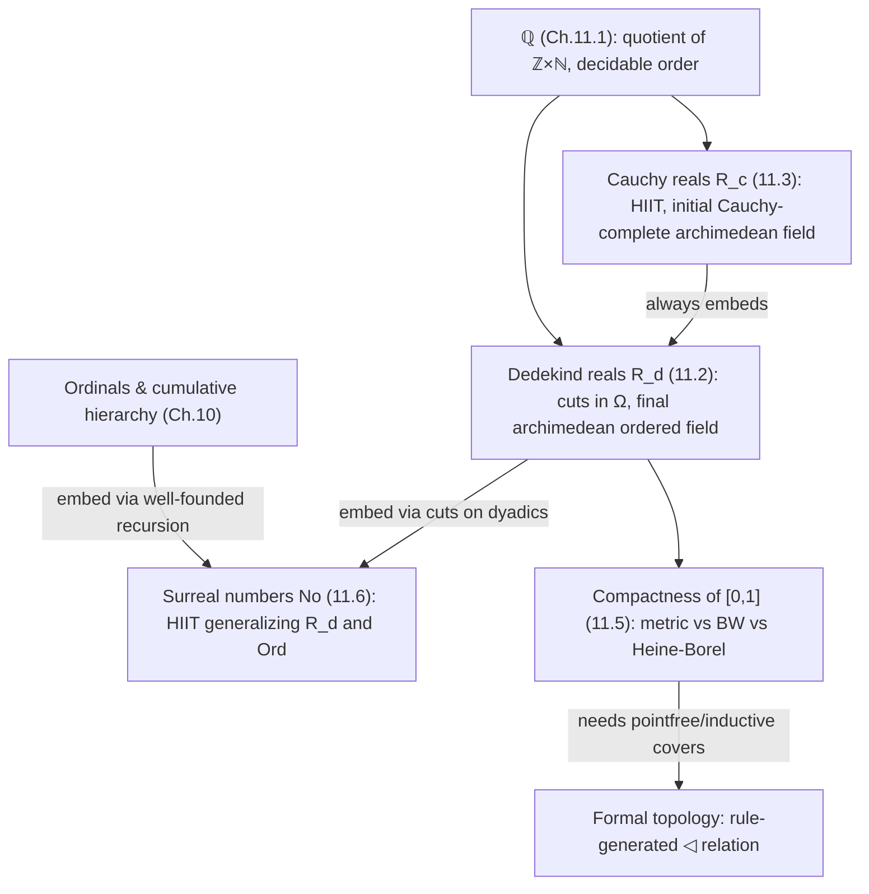

# Real Numbers and Analysis

[[book-guidelines|↩ Back to guidelines]]

## Why this chapter exists, and why it comes this late

By Chapter 11, the book has built dependent types, identity types and paths, [[Higher-Inductive-Types|higher inductive types]], the univalence axiom, and — in Chapter 10 — a full internal set theory (the cumulative hierarchy, cardinals, ordinals). Real numbers are the payoff of that investment, and also its stress test. "Real number" sounds like the most basic mathematical object there is, yet constructing $\mathbb{R}$ forces you to confront every foundational choice you've made so far: What is a proposition, exactly? Do you have excluded middle? Do you have choice? Does a quotient by an equivalence relation actually give you what you think it gives you? Classical analysis quietly assumes "yes" to all of these and never notices. Constructive type theory cannot look away, because every one of those assumptions has to be *built*, not postulated by fiat.

This is the mechanism-first reading of the chapter: what actually breaks, at the level of definitions and proofs, when you refuse to assume excluded middle and refuse to assume the axiom of choice — and how homotopy type theory's higher inductive-inductive types repair the breakage.

## 1. The rational numbers: the field you get almost for free

The book doesn't dwell here, and neither will we, but it's worth being precise about [[Sets-in-Univalent-Foundations#The construction|the construction]] because it sets the pattern for everything after. Integers $\mathbb{Z}$ were built in an earlier chapter as a quotient of $\mathbb{N} \times \mathbb{N}$ (pairs standing for differences). Rationals repeat the trick one level up:

$$\mathbb{Q} :\equiv (\mathbb{Z} \times \mathbb{N}) / {\approx}, \qquad (u, a) \approx (v, b) :\equiv \big(u \cdot (b+1) = v \cdot (a+1)\big).$$

A pair $(u, a)$ represents $u / (1+a)$ — the "$+1$" on the denominator is a cheap trick to make division-by-zero syntactically impossible, since $a : \mathbb{N}$ ranges over $0, 1, 2, \dots$ but $1+a$ never hits $0$. Because there's a canonical representative for each equivalence class (lowest terms), the earlier machinery for quotients-by-idempotent-generated-relations applies cleanly, and $\mathbb{Q}$ comes out as a *set* with **decidable equality and decidable order**. This matters: it means every later construction gets to treat $q < r$ for $q, r : \mathbb{Q}$ as computable, and the entire theory of real numbers is built as various kinds of limiting or completing operations *on top of* this decidable base. $\mathbb{Q}$ is also, up to isomorphism, the *initial ordered field* — the field every ordered field embeds a copy of.

```python
# The gist, ignoring the HoTT quotient machinery: canonical lowest-terms pairs
from math import gcd

def make_rational(u: int, a: int):        # represents u / (1 + a)
    d = 1 + a
    g = gcd(abs(u), d) or 1
    return (u // g, d // g - 1)           # canonical (numerator, denominator-1)
```

## 2. Dedekind reals: completing $\mathbb{Q}$ by cuts

### The motivating picture

A Dedekind cut is the type-theoretic version of "the point that separates the rationals below it from the rationals above it." The book uses the symmetric, two-sided formulation (a *pair* of subsets $L, U \subseteq \mathbb{Q}$) rather than the more familiar one-sided "$L$ alone" version, because the symmetric version behaves well both classically and constructively.

**Definition 11.2.1.** A pair of predicates $L, U : \mathbb{Q} \to \Omega$ is a Dedekind cut when:

1. **inhabited** (bounded): $\exists q. L(q)$ and $\exists r. U(r)$,
2. **rounded**: $L(q) \Leftrightarrow \exists r.\, (q<r) \wedge L(r)$, and symmetrically for $U$ — cuts are *open*, they never claim to contain "the point itself,"
3. **disjoint**: $\neg(L(q) \wedge U(q))$,
4. **located**: $q < r \Rightarrow L(q) \vee U(r)$ — there's no unbridged gap between $L$ and $U$.

$$\mathbb{R}_d :\equiv \{ (L, U) : (\mathbb{Q} \to \Omega) \times (\mathbb{Q} \to \Omega) \mid \mathrm{isCut}(L,U) \}.$$

**What breaks without locatedness.** Drop condition (iv) and you get the *lower* and *upper* reals — one-sided approximations useful for semi-continuous functions, but you lose the ability to compare two such objects with a decidable-ish order; locatedness is exactly the "no gap" condition that makes $<$ on $\mathbb{R}_d$ behave like a real order relation rather than a mere preorder on approximations.

### The universe-bookkeeping problem, and why $\Omega$ is a knob you turn

Here is the chapter's first genuinely constructive headache. If $L, U : \mathbb{Q} \to \mathrm{Prop}_{\mathcal U_i}$, then $\mathbb{R}_d$ lives in $\mathcal U_{i+1}$, a *property of reals* lives in $\mathcal U_{i+2}$, and so on — an infinite regress of universe bumps for something that is supposed to be one fixed mathematical object. The book sidesteps this by fixing a single "type of propositions" $\Omega$ and listing four ways to justify doing so: track universes explicitly and pay the bureaucracy tax; assume **propositional resizing** (collapses all $\mathrm{Prop}_{\mathcal U_i}$ to one level); assume **excluded middle**, in which case $\Omega \equiv \mathbf 2$ and you're doing ordinary classical analysis; or take $\Omega$ to be the **initial $\sigma$-frame** (a lattice with countable joins where binary meets distribute over them) — a minimal predicative choice that itself turns out to be constructible as a higher inductive-inductive type.

This is a recurring shape in the chapter worth naming explicitly for anyone building a checker: *"what counts as a proposition" is not a fixed background fact but a parameter of the construction*, and different choices of that parameter (LEM vs. resizing vs. a free frame) yield definitionally different but classically-coincident theories. A trusted kernel that wants to support both classical and constructive modes would need to make this parameterization a first-class design choice, not an afterthought.

### Algebraic structure — and why multiplication is worse than addition

Addition and negation on cuts read almost like Minkowski sums:

$$L_{x+y}(q) :\equiv \exists r,s.\, L_x(r) \wedge L_y(s) \wedge q = r+s, \qquad L_{-x}(q) :\equiv \exists r.\, U_x(r) \wedge q = -r.$$

Multiplication is genuinely more cumbersome, because "the sign of $x\cdot y$" is not locally determined the way "the sign of $x+y$" is — you need all four sign combinations of bounds on $x$ and $y$:

$$L_{x\cdot y}(q) :\equiv \exists a,b,c,d.\; L_x(a)\wedge U_x(b)\wedge L_y(c)\wedge U_y(d) \wedge q < \min(ac,ad,bc,bd),$$

which is literally interval-arithmetic multiplication $[a,b]\cdot[c,d] = [\min(ac,ad,bc,bd), \max(ac,ad,bc,bd)]$ lifted to cuts. If you've ever implemented interval arithmetic or affine arithmetic in a numerics library, this is *exactly* that idea, promoted to be the actual definition of multiplication rather than an approximation of it.

An **ordered field** (Definition 11.2.7) axiomatizes what you'd want any of these constructions to satisfy: a commutative ring, an apartness relation $\#$ (irreflexive, symmetric, cotransitive — $x \# y \Rightarrow x\#z \vee y\#z$), invertibility iff apart-from-zero, and the usual compatibility laws between $\le, <, +, \cdot$. **Theorem 11.2.4**: a Dedekind real is invertible iff it is apart from $0$ — note this is a genuinely *constructive* strengthening of "nonzero implies invertible," because in the absence of LEM, "$x \ne 0$" (negation of equality) is strictly weaker than "$x \# 0$" (positively witnessed apartness). This is the real-number-theory analogue of a distinction that shows up constantly in refinement-type and SMT contexts: a *negative* fact ("not equal") is not the same computational commodity as a *positive* witness ("provably apart," i.e. you can exhibit a rational separating them), and only the positive fact lets you build an actual inverse.

### Completeness comes in two flavors, and $\mathbb{R}_d$ gets both

- **Cauchy complete** (Theorem 11.2.12): every Cauchy approximation $x : \mathbb{Q}^+ \to \mathbb{R}_d$ (satisfying $|x_\delta - x_\epsilon| < \delta+\epsilon$) has a limit in $\mathbb{R}_d$.
- **Dedekind complete** (Corollary 11.2.16): every Dedekind cut *of Dedekind reals* is realized by an actual Dedekind real — cutting $\mathbb{R}_d$ doesn't produce anything new.

The proof of the second is a beautiful bit of "no more turtles" reasoning. **Theorem 11.2.14** shows every archimedean ordered field *admissible for $\Omega$* (meaning $<$ factors through $\Omega$, not just some ambient `Prop`) embeds into $\mathbb{R}_d$ via $x \mapsto (\{q \mid q<x\}, \{q \mid x<q\})$. Then **Lemma 11.2.15** shows the Dedekind completion of an admissible field is again admissible. Apply Theorem 11.2.14 *twice* — once to $\mathbb{R}_d$ itself and once to its own completion $\bar{\mathbb{R}}_d$ — and you get embeddings each way; since both are order-preserving field maps fixing the dense subfield $\mathbb{Q}$, they must be mutually inverse. $\mathbb{R}_d$ is therefore the **final archimedean ordered field admissible for $\Omega$** — the terminal object in exactly the category you'd expect real numbers to be terminal in. This "final object" characterization is the payoff of doing 11.2 at all: it's a universal-property proof, not a "just believe me, it's the reals" proof.

```rust
// The shape of an admissible ordered field embedding — not runnable HoTT,
// but the type signature that Theorem 11.2.14 is proving exists uniquely.
trait AdmissibleOrderedField {
    fn lt(&self, other: &Self) -> Prop;      // < : F -> F -> Omega, not just bool
}

fn embed<F: AdmissibleOrderedField>(x: F) -> DedekindCut {
    DedekindCut {
        lower: Box::new(move |q: Rational| q.lt_field(&x)),
        upper: Box::new(move |r: Rational| x.lt_field(&r)),
    }
}
```

## 3. Cauchy reals: the fourth way out of a classic constructive trap

### The trap

The textbook classical construction — Cauchy sequences in $\mathbb{Q}$, quotiented by "converges to the same limit" — hides a subtle use of choice. To prove the quotient $C/{\approx}$ is itself Cauchy complete, you take a Cauchy sequence *of equivalence classes* $x : \mathbb{N} \to C/{\approx}$ and need to *lift* it to an actual sequence of representative sequences $\bar x : \mathbb{N} \to C$. That lift is exactly one instance of the **axiom of countable choice**. Any construction of the reals whose last step is "quotient, then hope you can lift" inherits this dependency. The book lists three traditional constructive escape hatches — treat reals as a bare setoid and never actually quotient; just accept countable choice (it's true in most computational/realizability models anyway); or give up on Cauchy reals and only build Dedekind reals (which, as §11.2 showed, has its *own* universe-level headaches).

### The fourth way: higher inductive-inductive types

The idea: define $\mathbb{R}_c$ as the **free complete metric space generated by $\mathbb{Q}$**, using a higher inductive type to add "take a limit" as a genuine *constructor* rather than a derived quotient operation. The circularity to defeat is: a Cauchy sequence of reals needs a notion of "distance between reals," but distance between reals is itself a real number you haven't built yet. The fix is to not need full distance — only a family of *closeness* relations $\sim_\epsilon$ for each rational $\epsilon > 0$, meaning "within $\epsilon$." Since $\sim_\epsilon$ is indexed by two copies of the very type being defined, this cannot be an ordinary inductive definition — it must be **inductive-inductive**, and because it also carries path constructors, **higher inductive-inductive**.

**Definition 11.3.2.** $\mathbb{R}_c$ and $\mathord\sim : \mathbb{Q}^+ \times \mathbb{R}_c \times \mathbb{R}_c \to \mathcal U$ are defined *simultaneously* by:

Constructors of $\mathbb{R}_c$:
- $\mathsf{rat}(q) : \mathbb{R}_c$ for every $q : \mathbb{Q}$,
- $\mathsf{lim}(x) : \mathbb{R}_c$ for every $x : \mathbb{Q}^+ \to \mathbb{R}_c$ satisfying $\forall \delta,\epsilon.\ x_\delta \sim_{\delta+\epsilon} x_\epsilon$ (a *Cauchy approximation*),
- $\mathsf{eq}_{\mathbb{R}_c}(u,v) : u =_{\mathbb{R}_c} v$ whenever $\forall \epsilon.\ u \sim_\epsilon v$.

Constructors of $\sim$ (mutually, at the same time):
- $-\epsilon < q-r < \epsilon \Rightarrow \mathsf{rat}(q)\sim_\epsilon \mathsf{rat}(r)$,
- $\mathsf{rat}(q)\sim_{\epsilon-\delta} y_\delta \Rightarrow \mathsf{rat}(q)\sim_\epsilon \mathsf{lim}(y)$,
- $x_\delta \sim_{\epsilon-\delta} \mathsf{rat}(r) \Rightarrow \mathsf{lim}(x)\sim_\epsilon \mathsf{rat}(r)$,
- $x_\delta \sim_{\epsilon-\delta-\eta} y_\eta \Rightarrow \mathsf{lim}(x)\sim_\epsilon \mathsf{lim}(y)$,
- $\sim_\epsilon$ is propositionally truncated (a mere relation).

Read this as: *rationals are real numbers*; *any Cauchy approximation valued in reals-you-already-have gets a limit, for free, as a new point*; *two Cauchy approximations that stay $\sim_\epsilon$-close for every $\epsilon$ produce the same real*. The closeness relation's four "real" clauses say precisely what you'd hope — closeness of rationals is ordinary rational $\epsilon$-closeness, and closeness involving a `lim` unfolds via how close the approximants are to their own limit.

There's a genuine design decision buried here that the book flags explicitly (Remark 11.3.1): you *could* instead define $\sim_\epsilon$ by recursion on $\mathbb{R}_c$ (a higher inductive-*recursive* definition), but the authors reject that route for two reasons — it's harder to justify in the homotopical (simplicial-set) semantics, and, more importantly for anyone implementing this, the inductive-inductive route gives you a *strictly stronger induction principle*, one that's actually needed to develop the basic theory. This is a genuinely useful lesson for kernel design: when two encodings of "the same" mutual definition are classically equivalent, they can still differ in what induction principle you're entitled to extract, and that difference can be load-bearing.

**Why this avoids the choice problem entirely.** Because `lim` is a *constructor of the very type $\mathbb{R}_c$*, a Cauchy sequence of *already-constructed reals* just directly produces a new real — there is no quotient step at the end where you'd need to lift representatives. The completion is built by (transfinitely) iterating the "take a limit" operation as part of the free construction, the same way the free group on a set isn't just "products and inverses of generators" but arbitrarily long words built by iterating those operations.

### Comparing Cauchy and Dedekind reals

There's always a canonical embedding $\mathbb{R}_c \hookrightarrow \mathbb{R}_d$ (via Theorem 11.2.14, since $\mathbb{R}_c$ turns out to be an archimedean ordered field admissible for $\Omega$), but **they need not coincide** constructively. **Lemma 11.4.1** pins down exactly what's missing: if for every Dedekind real $x$ you can (untruncated, i.e. *computably*) decide, for any $q<r$, whether $q<x$ or $x<r$, then every Dedekind real is *actually* (not just merely) the limit of a rational Cauchy sequence, obtained by a bisection algorithm shrinking an interval $[q_n, r_n] \ni x$ by a factor of $2/3$ at each step using that decision procedure. **Corollary 11.4.3**: either **excluded middle** or **countable choice** is enough to supply that decision procedure (LEM directly; countable choice by choosing, for each of the countably many pairs $(q,r)\in S \cong \mathbb{N}$, a witness of $q<x \vee x<r$). So the gap between $\mathbb{R}_c$ and $\mathbb{R}_d$ is a genuine, non-trivial piece of information: it's exactly the room left over once you refuse both classical axioms, and it disappears the instant you readmit either one.

## 4. Compactness of $[0,1]$: three notions that classically collapse, constructively don't

Classically, "compact" is one concept with three equivalent faces. Constructively, it fractures, and the fracture pattern is genuinely diagnostic of where classical reasoning was hiding.

**Metric compactness** ("complete + totally bounded") survives constructively without any fuss: **Theorem 11.5.6** shows $[0,1]$ has, for every $\epsilon$, an explicit $\epsilon$-net $\{i/k\}$, and is complete via the retraction $r(x) = \max(0,\min(1,x))$, which is Lipschitz and therefore commutes with limits. Note the book's discipline here — totally-boundedness is defined with an *untruncated* $\Sigma$ (you get an actual net-producing function, a "modulus of total boundedness"), not a truncated $\exists$, precisely because a merely-existential net gives you nothing to compute with. This "prefer $\Sigma$ over truncated $\exists$ when you'll need to compute with the witness" discipline generalizes directly to invariant-generation and Skolemization choices in a verifier: keep the witness untruncated exactly when downstream code needs to extract and use it, truncate only where you only ever need the bare fact.

**Bolzano–Weierstraß compactness** ("every sequence has a convergent subsequence") is constructively *too strong* — **Theorem 11.5.9** shows it implies the **limited principle of omniscience** (LPO): being able to decide, for arbitrary $\alpha : \mathbb{N}\to\mathbf 2$, whether $\alpha$ is eventually always $0$ or hits a $1$ somewhere. LPO is a genuine instance of excluded middle over an infinite search, and it's the kind of thing a computationally faithful theory must reject: no algorithm decides that in general. The proof is a slick reduction — build a sequence that stalls at $0$ until $\alpha$ first hits $1$, then jumps to $1$ and stays; a convergent subsequence effectively answers the omniscience question.

**Heine–Borel compactness** ("every open cover has a finite subcover") is the interesting middle case. Classically it holds outright (**Theorem 11.5.11**, a bisection proof by contradiction — assume no finite subcover exists, nest shrinking intervals that each individually resist finite subcovering, derive a contradiction at the limit point). Constructively, the *naive, pointwise* formulation is simply too weak to work with computationally: even two overlapping intervals visibly covering $[1,4]$ can't be verified to cover it pointwise without effectively deciding a non-constant map $[1,4]\to\mathbf 2$.

The repair borrows from **formal/pointfree topology (locale theory)**: define an **inductive cover** relation $\triangleleft$ (Definition 11.5.13) by *rules*, not by quantifying over points — reflexivity (a member of the family covers itself), transitivity, monotonicity under interval inclusion, localization under intersection, plus two rules specific to the real line (an interval is covered by two overlapping sub-intervals; an interval is covered "from within" by all strictly-smaller sub-intervals). This is a genuinely higher-inductive-type-flavored definition — proof-relevant, closed under a fixed rule set, and — crucially — it *does* satisfy Heine–Borel (**Corollary 11.5.15**) using a real proof by induction on the derivation of $\triangleleft$ (**Lemma 11.5.14**), no excluded middle required. And it's classically conservative: **Theorem 11.5.16** shows inductive covers imply pointwise covers unconditionally, and the converse holds given excluded middle — so nothing is lost for a classical reader, and the constructive reader gets something usable.

If you've worked with **reachability analysis via abstract interpretation** or **Craig interpolation for refinement**, this pattern should feel familiar: you replace "does this predicate hold at every point of an infinite/uncountable domain" (intractable to decide directly) with "is this fact derivable by a fixed, finitary set of *inference rules* over a well-founded structure" (an inductively-defined provability relation, checkable by structural induction on derivations). Formal topology's inductive covers are doing for compactness exactly what a fixed-point/least-solution characterization does for invariant generation: turn a semantic, potentially undecidable property into a syntactic, rule-generated one that admits induction.

## 5. Surreal numbers: the other higher inductive-inductive type

Conway's surreals $\mathbf{No}$ generalize both the (Dedekind) reals and the ordinals, built classically as a pair of sets of surreals $\{L \mid R\}$ with every element of $L$ below every element of $R$. Translating this to type theory hits three separate obstacles, each already familiar from earlier in the chapter:

1. **Simultaneity.** The well-formedness of a cut $\{L\mid R\}$ needs "$<$ between surreals," but that relation is being defined by the very cuts it's used to constrain — inductive-inductive again, chosen (as with $\sim_\epsilon$) over inductive-recursive for the stronger induction principle it yields. The book also separates $<$ and $\le$ into their own mutual definition, rather than Conway's classical move of defining $<$ as the negation of $\ge$ — a negative definition can't legally appear as a hypothesis of a higher-inductive-type constructor (§5.6's positivity restriction).
2. **Size.** "$L$, $R$ are sets of surreals" cannot mean "arbitrary predicate $\mathbf{No}\to\mathrm{Prop}$" — that's not strictly positive, and moreover it's the wrong translation of Conway's intent (in Conway's set theory, $\mathbf{No}$ is a proper class, while $L,R$ are genuinely small sets). The fix, exactly parallel to the cumulative hierarchy of Chapter 10: index $L,R$ by $\mathcal U$-small types, so the cut constructor has the strictly-positive shape $\prod_{L,R:\mathcal U} (L\to\mathbf{No}) \to (R\to\mathbf{No}) \to (\dots) \to \mathbf{No}$, and $\mathbf{No}$ itself lives one universe up, in $\mathcal U'$.
3. **Quotienting by $x\le y \wedge y\le x$.** Conway's usual final step — quotient "pre-surreals" by mutual $\le$ — reintroduces exactly the lifting problem that plagued the naive Cauchy reals (a family of surreals can't necessarily be lifted to a family of pre-surreal representatives without choice). The fix is the same fix as §11.3: fold the quotienting into the higher-inductive-inductive definition itself, via a path constructor `eqNo`.

**Definition 11.6.1**, compressed: $\mathbf{No}$'s point constructor takes $L,R:\mathcal U$, functions $L\to\mathbf{No}$ and $R\to \mathbf{No}$ (written $x^L$, $x^R$), a proof $\forall L,R.\ x^L < x^R$, and yields a surreal $x$ — plus a path constructor identifying $x,y$ whenever $x\le y \wedge y\le x$. Then $\le$ and $<$ are defined *mutually* with $\mathbf{No}$: $x\le y$ iff $x^L < y$ for all left options and $x < y^R$ for all right options; $x<y$ iff $x \le y^{L}$ for some left option of $y$, or $x^R \le y$ for some right option of $x$ — each truncated to a mere proposition. You can check directly against Conway's classical clauses ($x\ge y$ iff no $x^R\le y$ and no $y^L \ge x$; $x=y$ iff $x\ge y\wedge y\ge x$) that negating his $\ge$ and canceling double negations recovers exactly this $<$.

This machinery immediately produces familiar objects by simple recursive cuts: $\iota_{\mathbb N}(0):\equiv\{\mid\}$, $\iota_{\mathbb N}(\mathrm{succ}(n)) :\equiv \{\iota_{\mathbb N}(n)\mid\}$; dyadic rationals via halving cuts; $\iota_{\mathbb{R}_d}(x) :\equiv \{q\in\mathbb Q_D : q<x \mid q\in\mathbb Q_D : x<q\}$ (literally a Dedekind cut restricted to dyadics); ordinals via $\iota_{\mathrm{Ord}}(A) :\equiv \{\iota_{\mathrm{Ord}}(A/a) \text{ for all } a:A\mid\}$; and genuinely new objects like $\omega :\equiv \{0,1,2,\dots\mid\}$, $1/\omega :\equiv \{0 \mid 1,\tfrac12,\tfrac14,\dots\}$, and $\omega - 1 :\equiv \{0,1,2,\dots \mid \omega\}$. **Conway's simplicity theorem** (Theorem 11.6.2) gives sufficient conditions for two differently-presented cuts to denote the *same* surreal — the tool that lets you prove, e.g., that $\iota_{\mathbb{R}_d}$ genuinely extends $\iota_{\mathbb Q_D}$.

The mutual **No-induction principle** (stated in full generality for three simultaneously-defined dependent families $A, B, C$ over $\mathbf{No}, \le, <$) is the engineering payoff: it lets you define functions and prove properties of surreals by structural recursion on cuts, exactly mirroring Conway's own informal justification ("we prove $P(x)$ by deducing it from $P(x^L)$ and $P(x^R)$ for all options — 'all numbers are constructed in this way' licenses this"). This is a clean real-world instance of a **strengthened induction principle purchased by choosing inductive-inductive over inductive-recursive** — the same tradeoff flagged for $\sim_\epsilon$, now paying off visibly in Theorem 11.6.4 ($x\le x$ and $x^L < x < x^R$, proved by a single No-induction).

## Where this leads



This chapter is the book's demonstration case for the thesis that constructive type theory is not a *restriction* of classical mathematics but a *refinement* of it — everywhere a classical proof used LEM or choice, this chapter shows exactly which construction breaks, and repairs it with a strictly more expressive tool: higher inductive-inductive types. Nothing here is needed by later chapters (this is the last chapter of the "mathematical applications" part), but as a case study it's the most complete illustration in the book of *why* higher-inductive-inductive types (beyond the simpler HITs of Chapter 6 and the plain inductive-inductive types glimpsed in §5.7) earn their keep: they let you define a type and its own comparison/closeness relations by simultaneous induction, side-stepping quotient-then-lift arguments that secretly needed choice.

**For the elaborator/verifier project**, three threads are directly load-bearing:

- The **positivity discipline** forced on the surreal-number cut constructor (§5) is the same discipline any inductive type checker (including yours) must enforce on constructor argument types — this chapter is a worked example of what happens when a "natural" classical definition (arbitrary predicates as "sets") fails strict positivity and needs to be re-engineered around universe-indexed small types, exactly the situation a dependent kernel hits whenever a user tries to define impredicative-looking inductive data.
- The **untruncated-$\Sigma$-vs-truncated-$\exists$ discipline** running through §11.5 (moduli of total boundedness, moduli of uniform continuity) is precisely the discipline you need when deciding whether a piece of proof-search output should carry a reusable *witness* (Skolem term, model, interpolant) or can be safely thrown away as a bare existence fact — get this wrong in a CEGAR loop and you either bloat certificates uselessly or lose information you needed for refinement.
- The **inductive-cover** relation of §11.5 is a small, self-contained example of replacing an intractable semantic quantification (over all points) with a finitary, rule-generated derivability relation admitting structural induction — the same move that underlies Horn-clause / CHC-based invariant generation and least-fixed-point semantics for reachability.
