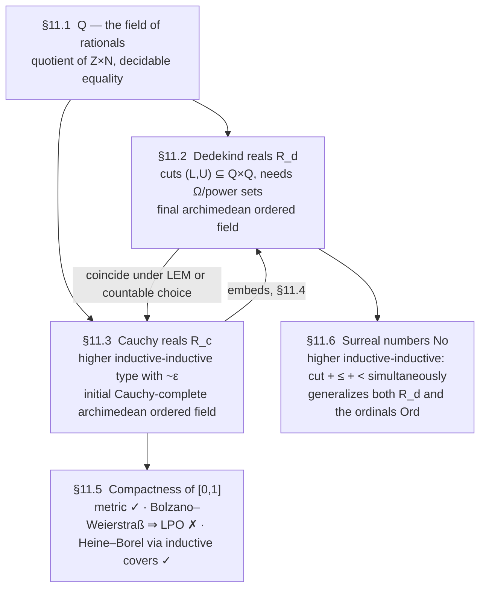

# Real Numbers and Analysis

[[book-guidelines|↩ Back to guidelines]]

## What problem does this solve?

Every foundation of mathematics eventually has to build $\mathbb{R}$, and the book is candid about why this is a genuinely hard chapter rather than a routine one: "any foundation of mathematics worthy of its name must eventually address [[Homotopical-Interpretation-of-Type-Theory#The construction|the construction]] of real numbers... namely as a complete archimedean ordered field." There are two classically-equivalent notions of completeness — Cauchy's (every Cauchy sequence converges) and Dedekind's (every cut has a supremum) — and classically you build either one, prove the field axioms, and move on without a second thought, because excluded middle and choice paper over every constructive wrinkle.

Homotopy type theory does not get to assume excluded middle or choice for free — [[Formal-Metatheory#Univalence|univalence]] is actively *incompatible* with the strongest classical excluded-middle-flavored propositions-as-types reading (see [[The-Univalence-Axiom-and-Its-Consequences]]) — so this chapter has to face the wrinkles head-on. And it turns out the traditional construction of Cauchy reals (take the set of Cauchy sequences, quotient by "eventually close") secretly leans on the **axiom of countable choice**: to prove the quotient is itself Cauchy complete, you need to take a sequence of *equivalence classes* of Cauchy sequences and lift it to an actual sequence of *sequences* — and that lift is a choice principle in disguise. Dedekind cuts sidestep this, but pay a different constructive tax: they need power sets (impredicativity) to even typecheck as a definition.

The chapter's central technical contribution, and the reason this topic belongs in the same neighborhood as [[Higher-Inductive-Types]] and [[Inductive-Definitions-and-Initial-Algebras]] rather than in a generic analysis textbook, is a *third* way to build the Cauchy reals: as a **higher inductive-inductive type**. This gets you Cauchy completeness on the nose, without countable choice and without power sets. It is the chapter's headline example of "surprising economy" — the same construction philosophy that gave you $S^1$ and pushouts for free now gives you a metric completion for free.



**What breaks without this chapter.** Every later analytic result in the book — anything about continuous maps, uniform continuity, integration-flavored exercises — is stated over *some* type of reals. If you don't settle which one and why it's well-behaved, "the real numbers" silently becomes three incompatible objects (a setoid of Cauchy sequences, a subset of $\mathcal{P}(\mathbb{Q})^2$, an admission of classical logic) depending on which section you're reading, and none of the universal-property theorems (11.2.14, 11.3.50) that let you *compare* constructions would be available.

## §11.1 — The field of rational numbers $\mathbb{Q}$

Nothing conceptually new here — it's a direct reuse of the quotient-type machinery from the integers construction (§6.10, referenced by the book). $\mathbb{Z}$ was built as $(\mathbb{N} \times \mathbb{N})/\!\approx$; $\mathbb{Q}$ is built the same way one level up:

$$\mathbb{Q} :\equiv (\mathbb{Z} \times \mathbb{N})/\!\approx \qquad (u, a) \approx (v, b) :\equiv \bigl(u(b+1) = v(a+1)\bigr).$$

A pair $(u, a)$ represents $u/(1+a)$ — the $+1$ on the denominator is a cheap trick to avoid division by zero as a side condition. Because there's a canonical choice of representative (lowest terms), the quotient recipe from Lemma 6.10.8 hands you a genuine **set** $\mathbb{Q}$ with **decidable equality** and **decidable order** — no propositional truncation needed anywhere, no choice principle invoked. $\mathbb{Q}$ is the *initial ordered field*: every ordered field has a unique structure-preserving map out of $\mathbb{Q}$. The chapter also fixes notation $\mathbb{Q}_+ :\equiv \{q : \mathbb{Q} \mid q > 0\}$, which becomes the indexing type for "precision" throughout the rest of the chapter — this is the constructive substitute for "$\forall \epsilon > 0$."

**[[Homotopical-Interpretation-of-Type-Theory#Grounding|Grounding]].** This is exactly a `newtype` over a normalized pair, and any language can express it:

```rust
// Rust: Q as reduced (numerator, denominator) pairs.
// Decidable equality and order come for free from i64/u64 comparison
// once you enforce the reduced-form invariant in the constructor.
#[derive(Clone, Copy, PartialEq, Eq, PartialOrd, Ord)]
struct Q { num: i64, den: u64 } // den > 0, gcd(|num|, den) == 1

impl Q {
    fn new(num: i64, den: i64) -> Self {
        assert!(den != 0);
        let g = gcd(num.unsigned_abs(), den.unsigned_abs());
        let sign = if (num < 0) != (den < 0) { -1 } else { 1 };
        Q { num: sign * (num.abs() / g as i64), den: den.unsigned_abs() / g }
    }
}
```

Nothing about $\mathbb{Q}$'s construction is HoTT-specific; skip straight to §11.2 for the first genuinely novel material.

## §11.2 — Dedekind reals $R_d$: completion as "the set of gaps"

**The idea, before the symbols.** A real number can be pinned down by *where it sits relative to every rational* — everything below it, and everything above it. Formally: a **Dedekind cut** is a pair of subsets $(L, U)$ of $\mathbb{Q}$ — think "strictly less than $x$" and "strictly greater than $x$" — satisfying four conditions that together say "there's no rational number missing from the classification, and no rational is claimed by both sides, and the split is razor-thin with no gap." $\pi$, for instance, *is* the pair (all rationals $< \pi$, all rationals $> \pi$) — the cut doesn't approximate $\pi$, it *is* $\pi$, by definition.

**The definition.** $(L, U)$, with $L, U : \mathbb{Q} \to \Omega$ (mere predicates valued in a fixed type of propositions $\Omega$, discussed below), is a Dedekind cut when:

1. **inhabited**: $\exists(q).\, L(q)$ and $\exists(r).\, U(r)$,
2. **rounded**: $L(q) \Leftrightarrow \exists(r).\, (q<r) \wedge L(r)$, and symmetrically for $U$ — this says the cuts are *open*, never claiming the boundary point itself,
3. **disjoint**: $\neg(L(q) \wedge U(q))$,
4. **located**: $q < r \Rightarrow L(q) \vee U(r)$ — no wide gap between the two sides.

$$R_d :\equiv \{(L,U) : (\mathbb{Q}\to\Omega)\times(\mathbb{Q}\to\Omega) \mid \mathrm{isCut}(L,U)\}.$$

**Why $\Omega$ and not `Bool`, and why that's a real constructive tax.** Classically you'd write $L, U : \mathbb{Q} \to \mathbf{2}$ and be done. Constructively, "is $q$ in the lower cut" is a genuinely propositional (not decidable) fact in general, so you need $L, U : \mathbb{Q} \to \mathrm{Prop}_{\mathcal{U}_i}$ for some universe level $i$ — and then $R_d$ itself lives one universe up, its power set two levels up, and so on, an infinite regress of bureaucracy. The book's workaround is to *posit* a single type of propositions $\Omega$ sufficient for everything (via propositional resizing, or by fully committing to classical logic where $\Omega \equiv \mathbf{2}$, or — the most parsimonious option — taking $\Omega$ to be the *initial $\sigma$-frame*, a lattice closed under countable joins, which is itself constructible as a higher inductive-inductive type; the book flags this last option and declines to pursue it, saving that trick for $R_c$ instead). **This power-set dependency is exactly the "impredicativity tax" the introduction warned about** — it's the price of Dedekind's approach, and it's precisely what $R_c$'s HII construction below is built to avoid.

**Algebraic structure, briefly.** Addition, negation, multiplication, order ($\leq$, $<$) are all defined pointwise on the cuts — e.g. $L_{x+y}(q) :\equiv \exists(r,s).\, L_x(r) \wedge L_y(s) \wedge q = r+s$ — using interval-arithmetic-style formulas for multiplication (the min/max of four cross-products, mirroring $[a,b]\cdot[c,d]$). The book does this carefully but treats it as routine, not conceptually novel, and neither will this note — the interesting content is in what *replaces* excluded middle:

- **Weak linearity** replaces trichotomy: $(x<y) \Rightarrow (x<z)\vee(z<y)$ (Eq. 11.2.3) — read as "linearity up to a small numerical error": taking $x \equiv u-\epsilon$, $y\equiv u+\epsilon$ gives $(u-\epsilon<z)\vee(z<u+\epsilon)$, i.e. you can decide order only down to whatever precision you've actually computed. This is the constructive fingerprint of the whole chapter: **classical facts about $<$ survive as facts about $<$-up-to-$\epsilon$.**
- **Apartness** $x \# y :\equiv (x<y)\vee(y<x)$ replaces $\neg(x=y)$ as the condition for invertibility (Theorem 11.2.4: *a real is invertible iff it is apart from $0$*) — apartness implies inequality but the converse needs excluded middle, so constructively these are genuinely different notions, and "invertible iff nonzero" quietly becomes false without apartness.

**Two completeness theorems, and why they matter for comparison later.** §11.2.2 shows $R_d$ is **Cauchy complete** (every Cauchy approximation — defined below — has a limit, Theorem 11.2.12, existence *not merely existence*), and §11.2.3 shows $R_d$ is **Dedekind complete** in the strongest possible sense: **Theorem 11.2.14**, *every archimedean ordered field admissible for $\Omega$ embeds into $R_d$* — i.e. $R_d$ is the **final** (terminal) archimedean ordered field. This finality is the fact that makes §11.4's comparison theorem possible.

## §11.3 — Cauchy reals $R_c$: the headline higher inductive-inductive construction

**The problem restated precisely.** Classically, $R_c$ is $\{\text{Cauchy sequences in }\mathbb{Q}\}/\!\approx$. To show this quotient is *itself* Cauchy complete, take a Cauchy sequence of equivalence classes $x : \mathbb{N} \to C/\!\approx$, and you need to *lift* it to a sequence of actual representative sequences $\bar x : \mathbb{N} \to C$ — pick, for each $n$, one Cauchy sequence out of the (possibly infinite, unquotiented) set of sequences representing $x(n)$. That's literally an application of the axiom of countable choice. Constructive mathematics has three traditional escape hatches (pretend the reals are a setoid and never actually complete them; just accept countable choice; give up and use Dedekind reals instead, which have their own power-set tax) — and the book offers a fourth.

**The idea, before the symbols.** Think of $R_c$ as **the free complete metric space generated by $\mathbb{Q}$** — the same "free gadget" idea that built free groups and free monoids as higher inductive types in §6.11 ([[Higher-Inductive-Types]]), now applied to "completion under limits" as the free operation. The catch: to state "$x$ is a Cauchy sequence of *real numbers*" you need a notion of distance between reals — but reals are exactly what you're in the middle of constructing. The way out is to not build the full metric all at once, but to build only the *finite-precision* comparisons you actually need: a family of relations $u \sim_\epsilon v$ meaning "$u$ and $v$ are within $\epsilon$" for each $\epsilon : \mathbb{Q}_+$ — and to define **the type $R_c$ and the relation $\sim_\epsilon$ by simultaneous induction**. That simultaneity is exactly what "higher inductive-*inductive*" means: an ordinary inductive-inductive definition (§5.7) lets you define a type and a family indexed by it together; the "higher" upgrade lets both carry path constructors too. (This is the general pattern flagged in the closing synthesis below — it recurs almost verbatim for the surreal numbers in §11.6.)

**Definition 11.3.2 — the constructors, verbatim.** $R_c$ and $\sim : \mathbb{Q}_+ \times R_c \times R_c \to \mathcal{U}$ are generated simultaneously by:

*Constructors of $R_c$:*
- **rational points**: for $q : \mathbb{Q}$, a point $\mathrm{rat}(q) : R_c$.
- **limit points**: for $x : \mathbb{Q}_+ \to R_c$ satisfying $\forall(\delta,\epsilon).\; x_\delta \sim_{\delta+\epsilon} x_\epsilon$ (a **Cauchy approximation**), a point $\lim(x) : R_c$.
- **paths**: for $u, v : R_c$ with $\forall(\epsilon).\; u\sim_\epsilon v$, a path $\mathrm{eq}_{R_c}(u,v) : u =_{R_c} v$.

*Constructors of $\sim$* (for $q,r$ rational; $\delta,\epsilon,\eta$ positive rational; $u,v$ reals; $x,y$ Cauchy approximations):
- if $-\epsilon < q-r < \epsilon$, then $\mathrm{rat}(q)\sim_\epsilon \mathrm{rat}(r)$,
- if $\mathrm{rat}(q)\sim_{\epsilon-\delta} x_\delta$, then $\mathrm{rat}(q)\sim_\epsilon \lim(x)$,
- if $x_\delta \sim_{\epsilon-\delta}\mathrm{rat}(r)$, then $\lim(x)\sim_\epsilon \mathrm{rat}(r)$,
- if $x_\delta \sim_{\epsilon-\delta-\eta} y_\eta$, then $\lim(x)\sim_\epsilon \lim(y)$,
- $\sim_\epsilon$ takes values in mere propositions (propositional truncation, built into the constructor).

**Reading these constructors as "one operation used only once."** Notice what's *not* here: no explicit quotient, and — crucially — no separate "take a sequence and produce its limit" step that has to be applied *iteratively*. In the classical/choice-assuming setting, Cauchy-completing $\mathbb{Q}$ is a one-shot operation because choice lets you flatten any nested limit-of-limits back down to a single limit; without choice, a "free completion" would naively need to iterate the limit operation transfinitely (limits of limits of limits...) the way a free group needs arbitrarily long words. The higher-inductive-inductive trick sidesteps this entirely: because $\lim$ and $\mathrm{eq}_{R_c}$ and $\sim$ are all generated *together*, a limit-of-a-Cauchy-approximation-of-limits is already just another instance of the $\lim$ constructor — there's no iteration to do. This is the "surprising economy" the introduction alluded to.

**The induction principle — why it has to be so much more elaborate than an ordinary HIT's.** Because $\sim$ is indexed by *two copies* of $R_c$, motive families must come in a linked pair: $A : R_c \to \mathcal{U}$ and $B : \prod_{x,y:R_c} A(x) \to A(y) \to \prod_{\epsilon} (x\sim_\epsilon y) \to \mathcal{U}$, written suggestively as $(x,a) \frown_\epsilon (y,b)$ — "$a$ and $b$ agree with the fact that $x,y$ are $\epsilon$-close." The full $(R_c,\sim)$-induction principle specializes to two familiar special cases that are worth knowing by name because the book uses them constantly afterward:

- **$R_c$-induction** (freeze $\sim$-dependence, i.e. take $B$ constant): to prove a mere property of all reals, it suffices to check it on rationals and show it's preserved by $\lim$. *Immediate payoff*: Lemma 11.3.8 ($u \sim_\epsilon u$ for all $u$) and **Theorem 11.3.9: $R_c$ is a set** — both proved this way in a few lines, because the reflexivity of the coincidence relation combined with the path constructor of $R_c$ satisfies the hypotheses of Theorem 7.2.2 (a reflexive mere relation implying identity forces set-truncation) — a direct echo of the encode-decode technique from [[Identity-Types-and-Path-Structure]].
- **$\sim$-induction** (freeze $R_c$-dependence): "if we take $R_c$ as given, $\sim_\epsilon$ is inductively generated by its constructors." Used to prove e.g. **symmetry of $\sim$** (Lemma 11.3.12) in one clean case split.

**Characterizing $\sim$ by encode-decode (Theorem 11.3.16 / 11.3.32).** Just as identity types on inductive types can "contain more than was put in" unless you check via an encode/decode argument (§5.8, [[Identity-Types-and-Path-Structure]]), the same worry applies here: did the five constructors of $\sim$ produce *exactly* the closeness relation intended, or could the HII machinery have smuggled in extra witnesses? The book resolves this by defining a *recursively computed* comparison relation $\approx_\epsilon$ (that evaluates directly on `rat`/`lim` the way a decision procedure would) and proving $(u\sim_\epsilon v) = (u\approx_\epsilon v)$ by a genuinely delicate double-recursion (the proof spans several pages precisely because $\approx$ has to satisfy roundedness and a two-sided triangle inequality simultaneously with its own definition — this is the technical heart of the section, and the book itself calls the result "a fibration of codes for $\sim$"). The payoff, Theorem 11.3.44, is the theorem that makes $R_c$ usable as an actual metric space: $(u\sim_\epsilon v) \simeq (|u-v| < \mathrm{rat}(\epsilon))$ — the type-theoretic $\sim_\epsilon$ *is* the ordinary metric $\epsilon$-ball, once you've built enough algebraic structure to state it.

**Algebraic structure via `Lipschitz` extension.** Rather than defining $+,-,\times$ on cuts pointwise (as $R_d$ does), $R_c$'s arithmetic is built by a single reusable lemma: *any non-expanding (Lipschitz) function $\mathbb{Q} \to \mathbb{Q}$ extends uniquely to a Lipschitz function $R_c \to R_c$* (Lemma 11.3.15, itself proved by $(R_c,\sim)$-recursion). Negation, $\min$, $\max$, absolute value, and (via a min/max-based patchwork, since squaring isn't globally Lipschitz but is on every bounded interval) squaring and multiplication are all obtained this way — a genuinely elegant reuse of one lemma across the whole algebraic structure. The chapter closes §11.3 with: **Theorem 11.3.49**, every Cauchy approximation in $R_c$ has a limit (Cauchy completeness, essentially by construction), and **Theorem 11.3.50**, $R_c$ **embeds into every Cauchy-complete archimedean ordered field** — $R_c$ is the *initial* such field, dually to $R_d$ being final.

**What breaks without the HII construction.** Drop the simultaneity and try to define $\sim$ *after* $R_c$ by ordinary recursion on an already-built $R_c$ (an inductive-*recursive* definition, which the book explicitly considers and rejects in Remark 11.3.1): you lose the strong induction principle needed to prove basic facts like Theorem 11.3.9 ($R_c$ is a set) and — the book notes — such definitions are harder to justify in the homotopical (simplicial-set) semantics at all. The inductive-inductive route is not a stylistic preference; it's load-bearing for the theory that follows.

**Grounding — the pattern, not the analysis.** The book's own framing ("free complete metric space") suggests the closest engineering analogue is *how you'd represent an idealized numeric type as an AST with an attached equivalence/refinement, generated together* — not floating point (which is a fixed-precision approximation of $\mathbb{Q}$, not a completion of it). A shape that at least carries the right idea in Rust:

```rust
// A (non-HoTT!) sketch of the *shape* of the R_c constructors — NOT a
// faithful implementation, since Rust has no path constructors and no
// quotient-by-construction; `PartialEq` here is ordinary decidable
// equality standing in for the propositional path constructor.
enum CauchyReal {
    Rat(Q),
    // A "Cauchy approximation": for every positive rational epsilon,
    // an approximant, together with (morally) a proof that any two
    // approximants are within delta+epsilon of each other.
    Lim(Box<dyn Fn(Q /* epsilon, den > 0 */) -> CauchyReal>),
}
```

The genuinely load-bearing idea to take from this section — independent of real analysis — is the **general pattern of inductive-inductive definition**: whenever a type and a relation/family *on* that type are mutually dependent from the start, defining them by ordinary induction-then-recursion forces a choice of which comes first, and that choice can be unjustifiable (as it is here) or can silently weaken the induction principle you get to use later. Lean's kernel supports exactly this shape via **mutual inductive types with indices**, and this HII is close in spirit to a mutual `inductive` block:

```lean
-- Genuinely mimicking the *proof-relevant, simultaneous* character of
-- Definition 11.3.2 (elided: the higher path constructor `eqRc`, which
-- Lean's ordinary mutual inductives cannot express without a quotient).
mutual
  inductive CauchyReal : Type where
    | rat (q : ℚ) : CauchyReal
    | limit (x : ℚ → CauchyReal) (h : ∀ δ ε, close δ x δ ε (x ε)) : CauchyReal
  -- `close` would need to be mutually defined alongside CauchyReal;
  -- Lean's inductive-inductive support is limited, so a real
  -- implementation typically threads the invariant as a separate
  -- Prop-valued relation defined afterward by well-founded recursion,
  -- which is precisely the inductive-*recursive* alternative the book
  -- considers and rejects in Remark 11.3.1.
end
```

That gap — Lean happily doing inductive-recursive definitions but being awkward about genuine inductive-*inductive* ones — is itself a faithful reflection of the book's own remark that the two approaches are not interchangeable.

## §11.4 — Comparing $R_c$ and $R_d$

Since $R_c$ is admissible for $\Omega$ (its strict order factors through $\Omega$) and archimedean, Theorem 11.2.14's finality of $R_d$ immediately gives an embedding $R_c \hookrightarrow R_d$ fixing $\mathbb{Q}$. The interesting question is whether it's an *equivalence*.

**Lemma 11.4.1** isolates exactly the extra ingredient needed: if for every $x : R_d$ there **purely** (not merely) exists a decision procedure $c$ choosing, for any $q<r$, between $q<x$ and $x<r$ — an *untruncated* version of weak linearity — then $R_c \simeq R_d$. The proof is a clean bisection argument: starting from bounds $a<x<b$, repeatedly trisect $[q_n,r_n]$ using $c$ to decide which third to keep, producing two Cauchy sequences of rationals squeezing down onto $x$.

**Corollary 11.4.3**: excluded middle *or* countable choice each suffice to manufacture such a $c$ (excluded middle directly decides $x<z$ vs. $\neg(x<z)$; countable choice turns the *merely*-existing located witness for each of the countably many pairs $(q,r) \in \mathbb{Q}\times\mathbb{Q}$ into a genuine choice function). So **the two constructions coincide exactly under the assumptions the HII construction was built to avoid** — without either assumption, the inclusion $R_c \hookrightarrow R_d$ may be strict. This is the cleanest illustration in the whole chapter of the book's broader thesis about constructive mathematics: classically-identical objects can bifurcate, and *how much* extra logical strength is needed to re-glue them becomes a precise, provable quantity rather than a hand-wave.

## §11.5 — Compactness of $[0,1]$: three notions, three fates

Classically, "metrically compact," "Bolzano–Weierstraß compact" (every sequence has a convergent subsequence), and "Heine–Borel compact" (every open cover has a finite subcover) are all equivalent. Constructively they split apart, and the book walks through exactly where and why.

1. **Metric compactness — survives cleanly.** $[0,1]$ is complete (it's a Lipschitz retract of $R$, via $r(x) = \max(0,\min(1,x))$, which commutes with limits) and totally bounded (an explicit $\epsilon$-net $\{i/k : 0\le i\le k\}$ for $2/k<\epsilon$ — note this is *pure*, not merely, existence: you get an actual algorithm producing the net, not just a proof one exists). This buys a genuinely useful corollary, **Theorem 11.5.7**: a uniformly continuous $f$ on a totally bounded metric space attains its supremum, constructed explicitly as the limit of the maxima over successively finer nets — a real *algorithm* for extremum-finding, not a pure-existence theorem.

2. **Bolzano–Weierstraß compactness — actively fails constructively.** **Theorem 11.5.9**: assuming it for $[0,1]$ implies the **limited principle of omniscience** (LPO) — deciding, for any binary sequence $\alpha$, whether $\alpha$ is eventually all-$0$ or has *some* $1$. LPO is a full instance of excluded middle over an infinite domain, and no one expects a computer to decide it (it would mean deciding a halting-problem-shaped question about an arbitrary infinite input stream in finite time). The proof constructs a sequence that jumps from $0$ to $1$ the moment $\alpha$ first hits $1$, and reads LPO's answer straight off wherever a hypothetical convergent subsequence lands. **This is the section's sharpest "what breaks without care" moment**: a compactness notion that *looks* purely topological turns out to smuggle in an undecidable proposition.

3. **Heine–Borel compactness — recoverable, but only after redesigning "cover."** A naive pointwise cover (∃ some interval in the family containing each point, truncated existential) is too weak to extract a finite subcover from constructively — the book gives an explicit counterexample sketch (you can't even show two open intervals cover $[1,4]$ without a non-constant map to $\mathbf{2}$, i.e. without deciding something). The fix, borrowed from formal/pointfree topology, is **Definition 11.5.13**: define the covering relation $\triangleleft$ *inductively*, as a mere-propositional higher inductive type, generated by explicit closure rules (reflexivity, transitivity, monotonicity under interval inclusion, localization under intersection, and two rules specific to the real line — overlap-covering and interior-covering). Because $\triangleleft$ is built by induction rather than asserted by a truncated quantifier, **Lemma 11.5.14** — any interval strictly inside a $\triangleleft$-covered interval has a genuine finite subcover — is provable *by induction on the derivation of the cover itself*, i.e. by structural induction on a proof tree, exactly the way a type-checker or proof search procedure extracts a witness by recursing on the *shape of the derivation* rather than by search over an infinite space. Theorem 11.5.16 then reconciles the two notions: an inductive cover is always a pointwise cover, and the converse holds if you assume excluded middle — so **the difference between the two notions of cover isn't which intervals get covered, but what the covering proofs are allowed to look like.**

**Grounding — this is the section with the clearest transferable mechanism.** The inductive-cover relation $\triangleleft$ is, structurally, exactly a **proof-search judgment defined by inference rules**, and Lemma 11.5.14's proof-by-induction-on-the-derivation is precisely how a Prolog-style solver or a type-checker's `isDefEq` recovers a concrete witness (here: a finite list of intervals) from an abstract provability judgment, by pattern-matching on which rule produced the proof:

```rust
// The shape of Definition 11.5.13 as a derivation type — closely
// analogous to how a small-step or big-step judgment is represented
// as an inductively defined proof object in a Rust-hosted checker.
enum Covers {
    Reflexivity   { i: usize },
    Transitivity  { via: Box<Covers>, sub: Vec<Covers> },
    Monotonicity  { subset_of: (Rational, Rational), proof: Box<Covers> },
    Localization  { proof: Box<Covers>, window: (Rational, Rational) },
    Overlap       { q: Rational, s: Rational, t: Rational, r: Rational }, // rule (v)
    Interior      { q: Rational, r: Rational },                          // rule (vi)
}

// Lemma 11.5.14 is then literally a recursive function over this type
// that pattern-matches on the constructor and returns a Vec<Interval>
// -- structural recursion over a proof object, exactly like extracting
// a finite subcover from a formal-topology derivation.
fn extract_finite_subcover(proof: &Covers) -> Vec<(Rational, Rational)> {
    match proof {
        Covers::Reflexivity { i } => vec![/* F(i) */],
        Covers::Transitivity { via, sub } => {
            sub.iter().flat_map(extract_finite_subcover).collect()
        }
        // ... one arm per constructor, mirroring the six-case proof.
        _ => unimplemented!(),
    }
}
```

## §11.6 — The surreal numbers: the pattern repeats, sharper

Conway's surreals $\mathrm{No}$, classically, are pairs of sets of surreals $\{L \mid R\}$ with every element of $L$ strictly below every element of $R$ — visibly inductive, except for exactly the same three obstructions the book flagged for $R_c$:

1. **$<$ must be defined simultaneously with $\mathrm{No}$** (an inductive-inductive dependency, chosen over inductive-recursive for the same reasons as $\sim$).
2. **$L, R$ must be $\mathcal{U}$-small families**, not arbitrary predicates $\mathrm{No}\to\mathrm{Prop}$ (which wouldn't be strictly positive and couldn't be a valid constructor argument) — so the constructor has the *positive* shape $\prod_{L,R:\mathcal{U}} (L\to\mathrm{No})\to(R\to\mathrm{No})\to(\text{ordering condition})\to \mathrm{No}$, echoing the cumulative-hierarchy construction from [[Sets-in-Univalent-Foundations|§10.5's cumulative hierarchy]].
3. **Equality-by-mutual-inequality** ($x=y$ iff $x\le y \wedge y\le x$) is, without choice, exactly the same "can't safely lift equivalence classes back to representative cuts" problem $R_c$ faced — so it's solved the same way: **a path constructor built into $\mathrm{No}$ itself.**

**Definition 11.6.1, verbatim shape.** $\mathrm{No}$, with $<,\le : \mathrm{No}\to\mathrm{No}\to\mathcal{U}$, is generated higher inductive-inductively:
- for $L,R:\mathcal{U}$ and $L\to\mathrm{No}$, $R\to\mathrm{No}$ (writing values $x^L, x^R$) such that $\forall L,R.\, x^L < x^R$, a surreal $x$ (a **cut**);
- for $x\le y$ and $y\le x$, a path $x=y$;
- $\le$'s constructor: $x^L < y \,\forall L$ and $x < y^R\, \forall R$ implies $x\le y$ (plus truncation);
- $<$'s constructors: $\exists L.\, x\le y^L$, or $\exists R.\, x^R\le y$ (plus truncation).

Notice the deliberate departure from Conway: he defines $<$ *negatively* in terms of $\le$ ($x<y :\equiv x\le y \wedge y\not\ge x$), which is classically fine but a negative definition is disallowed as a HIT-constructor hypothesis (§5.6's positivity discipline again) — so the book gives $<$ its *own* positive constructors and derives Conway's characterization as a theorem instead of taking it as the definition.

**The induction principle, and what it buys you.** Structurally identical to $(R_c,\sim)$-induction but now threading *two* auxiliary relations ($\frown$ tracking $\le$, $\triangleleft$ tracking $<$) alongside the motive $A$. Corollary 11.6.5 reprises Theorem 11.3.9's trick exactly: $x\le x \wedge y\le x$ implies identity (No-induction gives reflexivity, the path constructor turns the reflexive relation into identity, Theorem 7.2.2 finishes it) — **$\mathrm{No}$ is a 0-type**, by the same encode-decode-flavored argument used for $R_c$.

**Conway's simplicity theorem** (11.6.2) and worked examples — $\iota_\mathbb{N}, \iota_\mathbb{Z}, \iota_{\mathbb{Q}_D}$ (dyadic rationals), $\iota_{R_d} : R_d \to \mathrm{No}$ (embedding *Dedekind* reals, not Cauchy — because dyadic rationals as a countable dense subset play better with $R_d$'s $\Omega$-valued cuts), and $\iota_{\mathrm{Ord}} : \mathrm{Ord}\to\mathrm{No}$ (embedding the ordinals of [[Sets-in-Univalent-Foundations|§10.3]]) — demonstrate that $\mathrm{No}$ genuinely is the common generalization the section claims: it contains a full copy of the reals *and* a full copy of the ordinals as substructures, plus exotic elements like $\omega, 1/\omega, \omega-1$ that are neither. Negation and addition are constructed by the same joint-recursion discipline as $R_c$'s arithmetic — e.g. addition's defining equation $x+y :\equiv \{x^L+y,\, x+y^L \mid x^R+y,\, x+y^R\}$ requires simultaneously threading four inequality obligations through a nested outer-recursion/inner-induction, structurally the same shape as Theorem 11.3.40's Lipschitz-extension argument for $R_c$'s addition.

**The book's own closing philosophical note is worth preserving verbatim in spirit**, because it's the most direct statement in the chapter of why HITs matter beyond real numbers specifically: Conway argued that any "reasonably constructive" way of creating objects, plus any desired equivalence relation on them, should be formalizable in *some* standard foundation. The book observes that condition (i) — reasonably constructive creation — is precisely **strict positivity of inductive constructors**, and condition (ii) — arbitrary desired equality — is precisely **higher inductive path constructors**. Univalent foundations isn't just *a* setting where Conway's proposal can be carried out; its inductive-definition machinery is close to a formal reading of what Conway was gesturing at informally.

## Comparison table: the two real-number constructions

| | Dedekind reals $R_d$ | Cauchy reals $R_c$ |
|---|---|---|
| Built from | subsets of $\mathbb{Q}$ (cuts) | HII type: points + limits + $\sim_\epsilon$ |
| Constructive cost | needs $\Omega$ / power sets (impredicativity) | needs neither power sets nor countable choice |
| Universal property | **final** archimedean ordered field (11.2.14) | **initial** Cauchy-complete archimedean ordered field (11.3.50) |
| Completeness | Cauchy complete *and* Dedekind complete | Cauchy complete by construction |
| Coincide with the other when | LEM or countable choice holds (11.4.3) | (same) |
| Best suited for | classical / impredicative settings (sheaf models) | computational / choice-free settings (realizability) |

## Where this leads

This chapter is largely a terminal application chapter within the book's own arc — it draws on the higher inductive type machinery of Chapter 6 ([[Higher-Inductive-Types]]), the inductive-inductive discussion flagged in §5.7, the "sets behave as expected" results of Chapter 10 ([[Sets-in-Univalent-Foundations]]), and the ordinal/cumulative-hierarchy constructions referenced for the surreals — rather than being a prerequisite for later chapters. Its role in the book's overall argument is evidentiary: it demonstrates that univalent foundations can carry out genuine, hard, load-bearing mathematics (not just re-derive toy examples) using nothing but the type-forming machinery already built, and that doing so *without* classical assumptions produces mathematically meaningful distinctions (LPO's failure, $R_c \ne R_d$ in general) rather than just annoying technical friction.

**On this topic's relationship to the standing learning-goals project.** Per the workbench's own learning-goals configuration, HoTT-specific mathematics like this chapter's real-number constructions is explicitly scoped as background/context, not a build target — there is no faithful way to connect Dedekind-cut arithmetic, apartness relations, or Conway's simplicity theorem to a Rust program-verifier or a Miller-pattern-unification elaborator, and forcing one would be dishonest to both this chapter and that project. Being upfront about that: most of this note's mathematical content (§§11.1, 11.2, 11.4, and the algebraic parts of 11.3/11.6) is genuinely inert for those two engineering targets, and is included here for the same reason the book includes it — because a serious foundations text has to show it can do real analysis, not because it teaches elaborator or verifier mechanics.

What *does* transfer, cleanly, is one structural idea that recurs three times in this single chapter (once for $\Omega$ as a $\sigma$-frame, once for $R_c$/$\sim$, once for $\mathrm{No}$/$\le$/$<$): **the higher inductive-inductive pattern — simultaneously defining a type and a relation (or family) on it, rather than defining the type first and bolting the relation on afterward.** This is exactly the situation a bidirectional elaborator or a Hoare-triple checker runs into whenever a term-syntax type and its well-formedness/typing judgment are mutually recursive (a term is well-typed relative to a context that itself contains terms) — and this chapter is a sustained, worked demonstration of *why* getting the definition order right matters: the book explicitly rejects the inductive-*recursive* alternative for $\sim$ (Remark 11.3.1) because it yields a strictly weaker induction principle, the same failure mode that shows up if a typechecker's context-validity judgment is defined by recursion over an already-fixed term syntax instead of being threaded through the syntax's own well-formedness from the start. The second transferable thread, more minor: this chapter is the book's most sustained demonstration that **avoiding choice principles is not merely an ideological nicety but changes what you can prove** (§11.4's precise catalogue of exactly how much choice — countable, not full — is needed to re-glue $R_c$ and $R_d$) — a useful case study in how to audit a proof pipeline for hidden non-constructive steps, relevant to anyone who wants their verifier's certificates to mean what they claim to mean.
