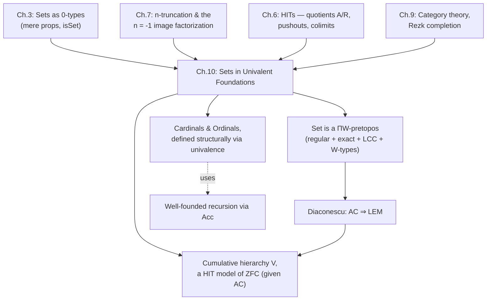

[[book-guidelines|↩ Back to guidelines]]

## Why a homotopy theory book has a set-theory chapter

Every book in this series eventually has to answer an awkward question: if types are spaces and equality is a path, what happened to *ordinary* sets — the boring, discrete objects mathematicians actually compute with every day? Chapter 3 already answered this at the level of a single type: a **set** is a type at truncation level 0, one where any two parallel paths between two points are themselves equal (`isSet(A) :≡ ∏(x,y:A) ∏(p,q:x=y) (p = q)`, no higher homotopy). But being told "a set is a 0-truncated type" doesn't yet tell you that the *collection of all sets*, with its functions between them, behaves the way category theorists and working mathematicians expect the universe of sets to behave: closed under images, quotients, products, unions — everything ZFC gives you, but built instead from types, paths, and univalence.

That is the job of Chapter 10. It has three intertwined goals, and the book is explicit about the connective tissue:

1. Show the category $\mathbf{Set}$ (0-types and functions) satisfies the closure properties expected of "the category of sets" — culminating in the technical classification "$\mathbf{Set}$ is a $\Pi W$-pretopos," and pinpointing exactly what it's missing to be a full elementary topos.
2. Rebuild **cardinal and ordinal numbers** *structurally* — using univalence to avoid the usual set-theoretic trick of picking canonical representatives (like von Neumann ordinals).
3. Build a literal **model of ZFC** — the cumulative hierarchy $V$ — as a higher inductive type internal to the theory, showing univalent foundations can simulate classical set theory rather than merely coexist with it.

If you already read [[Higher-Inductive-Types|Higher Inductive Types]], you've seen the *mechanism* for quotients (the HIT $A/R$ with point and path constructors). This article assumes that mechanism and asks the different question the book asks in Chapter 10: given that mechanism, does the resulting category of sets have the abstract properties a category theorist would demand of it, and can you use it to found mathematics the way ZFC does? That's a foundational/categorical reading, not a rehash of the HIT construction itself.

## Part 1 — $\mathbf{Set}$ as a category with the right closure properties

### What breaks without this

Suppose someone hands you a definition of "set" as a type-theoretic notion (0-truncation) and stops there. You could still ask: can I take an image of a function between sets and land back in a set? Can I quotient a set by an equivalence relation and get a set back, with the *expected* universal property? Without proving these closure properties, "sets" in HoTT would be a curiosity — a truncation predicate with no guarantee that ordinary mathematical constructions (subsets, quotients, disjoint unions, function spaces) stay inside the world of sets, or interact the way Grothendieck's or Lawvere's axiomatizations say they should. Chapter 9 already established $\mathbf{Set}$ *is a category* (not just a precategory) — since for 0-types, equality of objects coincides with isomorphism only after we correctly define hom-sets and use $\mathrm{idtoiso}$; see [[Univalent-Category-Theory]]. Chapter 10 goes further and asks what *kind* of category it is.

### Limits and colimits (§10.1.1)

The book dispatches this quickly, because most of the work was already done: sets are closed under $\Pi$, $\Sigma$, $\times$, $+$, and $\mathbf{0}$ (from Chapters 1–2), and pushouts exist among $n$-types by §7.4. So $\mathbf{Set}$ is both complete and cocomplete "for free," inherited from the general truncation machinery.

### Images and the regular-epi/mono factorization (§10.1.2)

This is the load-bearing definition of the section. Recall from §7.6 (see [[Connectedness-and-Orthogonal-Factorization]]) that any $f : A \to B$ factors as

$$A \xrightarrow{\tilde f} \mathrm{im}(f) \xrightarrow{i_f} B, \qquad \mathrm{im}(f) :\equiv \sum_{b:B} \|\mathrm{fib}_f(b)\|_{-1}$$

with $\tilde f$ surjective (the $(-1)$-connected map) and $i_f$ injective (the $(-1)$-truncated map, i.e. a mere-proposition-fibered embedding). Specializing this general $n$-truncation factorization system to $n = -1$ gives exactly the classical image factorization of a function between sets.

The book's precise **regularity** claim is a package of three conditions:

- $\mathbf{Set}$ is finitely complete.
- The kernel pair of any $f : A \to B$ — the pair $\mathrm{pr}_1, \mathrm{pr}_2 : \big(\sum_{x,y:A} f(x) = f(y)\big) \to A$ — has a coequalizer.
- Pullbacks of **regular epimorphisms** (coequalizers) are again regular epimorphisms.

The book proves each ingredient using tools you've already seen: injectivity of $f$ between sets ("$\forall a,a'. f(a)=f(a') \Rightarrow a=a'$") coincides exactly with being a categorical monomorphism (Lemma 10.1.2), and surjectivity coincides with being an epimorphism, proved via a slick trick: $f$ is an epi iff the pushout $C_f$ ("mapping cone" of $f$ along the map to $\mathbf{1}$) is contractible, and contractibility of $C_f$ is shown, via induction on the HIT presentation of the pushout, to be logically equivalent to surjectivity of $f$ (Lemma 10.1.4). Regularity then follows abstractly (Theorem 10.1.5) because a category with finite limits and a pullback-stable orthogonal factorization system $(\mathcal E, \mathcal M)$ — with $\mathcal M$ the monos — is automatically regular, and that factorization system is precisely Theorem 7.6.6's $n = -1$ image factorization.

**Grounding — Rust.** A regular category's "coequalizer of the kernel pair recovers the image" pattern is exactly the compiler-construction idea of computing the image of a partial evaluation function by canonicalizing under an equivalence relation on inputs:

```rust
// The kernel pair of f: A -> B is {(x, y) : A x A | f(x) = f(y)}.
// Its coequalizer IS the image of f, packaged as a set (a quotient type).
// This is the categorical justification for "canonicalize-then-compare"
// term representations in a compiler: the canonical form *is* the image.
fn kernel_pair<A: Eq + Clone, B: PartialEq>(elems: &[A], f: impl Fn(&A) -> B) -> Vec<(A, A)> {
    let mut pairs = Vec::new();
    for x in elems {
        for y in elems {
            if f(x) == f(y) {
                pairs.push((x.clone(), y.clone()));
            }
        }
    }
    pairs
}
```

### Quotients and effective equivalence relations (§10.1.3)

This is the section that turns "$\mathbf{Set}$ is regular" into "$\mathbf{Set}$ is *exact*" (in the categorical sense: every equivalence relation is a kernel pair of some map, i.e. is **effective**).

**Definition 10.1.7.** A relation $R : A \to A \to \mathrm{Prop}$ is **effective** if the naturality square

$$
\begin{array}{ccc}
\sum_{x,y:A} R(x,y) & \xrightarrow{\mathrm{pr}_1} & A \\
\downarrow{\mathrm{pr}_2} & & \downarrow{c_R} \\
A & \xrightarrow{c_R} & A/R
\end{array}
$$

is a pullback — equivalently, $(c_R(x) = c_R(y)) \simeq R(x,y)$: the quotient map's induced identifications recover *exactly* the relation you quotiented by, no more and no less.

Effectiveness is not automatic — it's the precise statement that a quotient doesn't accidentally identify more than the relation says, and it fails in naive set-theoretic implementations that model quotients as raw equivalence classes without checking this (or that require choice to construct sections). The book's proof (Lemma 10.1.8) is a beautiful instance of the **encode-decode method** familiar from Chapter 8: define an auxiliary relation $\widetilde R$ on $A/R$ by double recursion, $\widetilde R(c_R(x), c_R(y)) :\equiv R(x,y)$, well-defined because $R$ is an equivalence relation (transitivity/symmetry give the needed transport), then show $\widetilde R(w,w') \simeq (w = w')$ using Theorem 7.2.2 (a reflexive mere relation implying identity is enough to show it *is* identity). This is structurally identical to how you'd prove $\Omega(S^1) \simeq \mathbb{Z}$ in Chapter 8 — same proof shape, different relation.

The book gives **three constructions** of the same quotient, and proves they agree (Theorem 10.1.10):
1. The **HIT set-coequalizer** $A/R$ (from §6.10) — generators-and-relations, computationally primitive.
2. The **subset-of-power-set** construction $A/\!/R :\equiv \{P : A \to \mathrm{Prop} \mid P \text{ is an equivalence class of } R\}$ — classical, but requires propositional resizing to stay in the same universe.
3. (Mentioned, left as exercise) The **Rezk completion** of the precategory with objects $A$ and hom-sets $R$ — reusing Chapter 9's machinery wholesale.

That three independently-motivated constructions coincide (up to equivalence, hence up to *equality* by univalence) is the univalent-foundations payoff: you're never stuck asking "but which quotient is the *real* one" the way you sometimes are in ZFC when canonical representatives matter.

**Theorem 10.1.9** extends this: for *any* $f : A \to B$ between sets, the kernel relation $\ker(f, x, y) :\equiv (f(x) = f(y))$ is automatically effective — quotienting by "agreement under $f$" always reconstructs $\mathrm{im}(f)$ faithfully. This is the general form of the "canonicalize-then-compare" pattern.

**Grounding — Lean, this is the load-bearing one for your project.** Lean's kernel primitive `Quot` is *precisely* this section's set-coequalizer, and `Quot.sound` is precisely the effectiveness statement in constructive form:

```lean
-- Quot.mk r a  is c_R(a).
-- Quot.sound   : r a b → Quot.mk r a = Quot.mk r b     (one direction of effectiveness)
-- Quot.lift    is the universal property (Lemma 10.1.3's mapping-out property).
-- Effectiveness ((c_R x = c_R y) ≃ R x y) in full requires r to be an
-- equivalence relation and uses Quot.exact — this is EXACTLY Lemma 10.1.8's
-- statement, specialized to Lean's built-in quotient.
example (r : α → α → Prop) (h : Equivalence r) (a b : α) :
    Quot.mk r a = Quot.mk r b → r a b :=
  Quot.exact r
```
If your refinement-type checker ever needs to canonicalize terms modulo a congruence (alpha-equivalence, definitional equality up to a rewrite system, or a decision procedure's internal normal form), this is the theorem that tells you *when your canonicalization is safe*: it's safe exactly when the induced identification relation on canonical forms is effective, i.e. recovers your intended equivalence relation exactly.

### $\mathbf{Set}$ is a $\Pi W$-pretopos (§10.1.4)

A **$\Pi W$-pretopos** is defined as: a locally cartesian closed category, with disjoint finite coproducts, effective equivalence relations (exactness), and initial algebras for polynomial endofunctors (i.e. $W$-types exist). This is explicitly framed by the book as the **predicative** analogue of an elementary topos — the "topos of predicative sets," suited to constructive mathematics the way an ordinary topos suits classical mathematics.

Theorem 10.1.11 assembles the pieces already proved:
- Local cartesian closure: for $f : A \to B$, "fibrant replacement" $\sum_{a:A} f(a) = b$ recovers $A$ over $B$, and dependent products give the needed exponentials.
- Regularity (already shown) plus effectiveness of equivalence relations (already shown) gives a locally cartesian closed *pretopos*.
- $W$-types are closed under $n$-truncation (Exercise 7.3) and, by Theorem 5.4.7, are exactly initial algebras for polynomial endofunctors — see [[Inductive-Definitions-and-Initial-Algebras]] — giving the "$\Pi W$" in the name.

**What's missing for a full elementary topos** is a *subobject classifier*: a small type classifying monomorphisms. Univalence does give you $\mathrm{Prop} :\equiv \sum_{X:\mathcal U} \mathrm{isProp}(X)$ classifying monomorphisms (§4.8's object-classifier argument specialized), but $\mathrm{Prop}$ is generally as large as its ambient universe $\mathcal U$ — it is a *set* (0-type) but not necessarily *small* (an object *of* $\mathcal U$ itself), so it can fail to be an object of $\mathbf{Set}$ at all. Only with **propositional resizing** (§3.5) does $\mathrm{Set}$ become a genuine elementary topos (Theorem 10.1.12). This is a genuinely interesting predicativity/impredicativity tension: the categorical package (pretopos) is free, but the topos-theoretic crown jewel (subobject classifier as a small object) costs you an extra axiom.

### Diaconescu's theorem: AC implies LEM (§10.1.5)

This is the section's showstopper, and it explains why the book treats the axiom of choice with real caution throughout (recall §3.8/§3.9 on choice and unique choice).

**Theorem 10.1.14 (Diaconescu).** The axiom of choice implies the law of excluded middle.

*Proof idea.* Given a mere proposition $A$, form the suspension $\Sigma(A)$. Lemma 10.1.13 shows that when $A$ is a mere proposition, $\Sigma(A)$ is a *set* and, remarkably, $A \simeq (N =_{\Sigma(A)} S)$ — the two suspension poles are equal exactly when $A$ holds. (This is itself an encode-decode argument, defining a family $P$ on $\Sigma(A) \times \Sigma(A)$ that is $\mathbf{1}$ or $A$ depending on which poles you compare, then using univalence to turn $A$'s equivalence to $\mathbf{1}$ into an actual path.) Then the map $f : \mathbf{2} \to \Sigma(A)$ sending the two booleans to the two poles is surjective; by AC it merely has a section $g : \Sigma(A) \to \mathbf{2}$; decidable equality on $\mathbf{2}$ then decides whether $g(f(0_2)) = g(f(1_2))$, which (since $g$ is a section, hence injective) decides whether $N = S$ in $\Sigma(A)$ — i.e. decides $A$ itself.

This is a striking example of "classical logic isn't free" made completely concrete: **the mere act of assuming every surjection has a (mere) section is already strong enough to force excluded middle.** If your compiler project ever reaches for choice-like reasoning (e.g., "there merely exists a valid instantiation of this metavariable satisfying the constraint") you should recognize you may be silently importing classical reasoning, which matters if your kernel is meant to stay constructive/decidable. Theorem 10.1.15 closes the loop: assuming AC, $\mathbf{Set}$ is a **well-pointed Boolean elementary topos with choice** — literally Lawvere's axioms for the Elementary Theory of the Category of Sets (ETCS), recovered inside HoTT.

## Part 2 — Cardinal and ordinal numbers, done structurally

### What breaks without univalence here

In classical set theory, "the cardinality of $A$" is usually defined as a *canonical representative* — the least ordinal in bijection with $A$ — precisely because raw isomorphism classes are proper classes, too big to be sets, unless you pick a representative via the axiom of choice or Scott's trick. This representative-picking is bureaucratic overhead with no mathematical content: two sets of the same size *are* the same cardinal, you shouldn't need a designated witness to say so. Univalence removes the bureaucracy entirely.

### Cardinals (§10.2)

**Definition 10.2.1.** $\mathrm{Card} :\equiv \|\mathbf{Set}\|_0$ — the 0-truncation of the type of all sets. Because $\mathbf{Set}$ is only a 1-type (not a 0-type — recall two sets can be isomorphic in multiple inequivalent ways as far as *paths* go, but 0-truncating collapses all of that), truncating to level 0 forces exactly "isomorphic sets become equal," nothing more, nothing less. That's the whole definition — no representative, no rank function, no well-ordering needed up front.

Arithmetic is defined by induction on truncation (the "since the target is a set/mere-prop, it suffices to handle the point case" pattern that recurs throughout this chapter):

$$|A|_0 + |B|_0 :\equiv |A + B|_0, \qquad |A|_0 \cdot |B|_0 :\equiv |A \times B|_0, \qquad |A|_0^{|B|_0} :\equiv |B \to A|_0$$

with $\le$ defined as $|A|_0 \le |B|_0 :\equiv \|\mathrm{inj}(A,B)\|_{-1}$ (merely-exists-an-injection). $\mathrm{Card}$ is a commutative semiring (Lemma 10.2.4), each law reducing — again by induction on truncation — to a univalence-supplied equivalence like $A \times B \simeq B \times A$. Under excluded middle, $\le$ becomes a genuine partial order via **Schröder–Bernstein** (Theorem 10.2.10: mutual injections give an isomorphism, by the classical back-and-forth argument, now literally producing a *path* $A = B$ via univalence rather than a mere set-theoretic bijection statement). **Cantor's theorem** (Theorem 10.2.12: no surjection $A \to (A \to \mathbf{2})$, proved by the usual diagonal function $g(a) :\equiv \lnot f(a)(a)$) then gives an unbounded hierarchy of cardinals, all without ever leaving the type-theoretic universe.

**Grounding — Python (illustrative only, per the "don't force a strained analogy" rule — this genuinely fits the tertiary/quick-sketch slot).** The induction-on-truncation pattern reads almost exactly like defining an operation on equivalence classes by picking any representative, in Python:

```python
# Illustrative only: "arithmetic on cardinals is well-defined because
# it doesn't depend on which representative set you pick" is the same
# proof obligation as showing a Python function on a quotient is well-defined.
def card_add(A: frozenset, B: frozenset) -> int:
    # any two sets of the same cardinality give the same answer -
    # that's the content of "defined by induction on 0-truncation"
    return len(A) + len(B)
```

### Ordinals (§10.3–10.4)

This is the densest and most technically interesting stretch of the chapter, because it has to reconstruct *well-foundedness itself* using only induction principles — no ambient meta-level induction to borrow from.

**Accessibility**, defined by an actual inductive family (recall inductive families from §5.7, e.g. `Vec`): $a$ is accessible ($\mathrm{acc}(a)$) if every $b < a$ is accessible. This looks circular but is a perfectly good well-founded inductive definition — elements with no predecessors are vacuously accessible, and the induction principle for `acc` is genuinely a strengthening of ordinary induction on $A$ (Lemma 10.3.2 needs the *full* dependent induction principle, not the simplified non-dependent one, to prove accessibility is a mere proposition — a rare case in the book where the general form of an induction principle is load-bearing rather than a simplification).

A relation is **well-founded** if every element is accessible (Definition 10.3.3), which licenses genuine well-founded recursion/induction (Lemma 10.3.7: given $g : \mathcal P(B) \to B$, produce $f : A \to B$ with $f(a) = g(\{f(a') \mid a' < a\})$ — this is literally the specification of a memoized recursive solver over a well-founded input relation, the shape every terminating recursive algorithm on recursively-defined data ultimately has).

**Extensionality** (Definition 10.3.9) is the type-theoretic analogue of the classical axiom of extensionality: two elements with the same set of predecessors are *equal*, not just "the same set" in some external sense — $\forall c.\, (c<a) \Leftrightarrow (c<b) \to a = b$. Theorem 10.3.10 shows the type of extensional well-founded relations on a set is itself a set — proved via univalence: any automorphism of an extensional well-founded relation must be the identity (proved by well-founded induction on the automorphism itself — a lovely bootstrapping argument), so isomorphic structures are *equal*, not just isomorphic, which is exactly what "being a set" (0-truncated) demands.

**Simulations** (order-preserving, order-reflecting maps, Definition 10.3.11) play the role of order-embeddings; Lemma 10.3.12 shows every simulation is injective, and — crucially — **at most one simulation exists between any two given extensional well-founded relations** (Lemma 10.3.16). This uniqueness is what makes "$A \le B$" (there exists a simulation $A \to B$) behave like a genuine order rather than a preorder up to isomorphism: Corollary 10.3.15's category of ordinals-and-simulations is a *poset*, for free, because simulations are unbounded-choice-free and unique.

**Definition 10.3.17.** An **ordinal** is a set with an extensional, well-founded, *transitive* relation. **Theorem 10.3.20**, the section's centerpiece: $(\mathrm{Ord}, <)$ is itself an ordinal (one universe level up) — the type of ordinals in universe $\mathcal U_i$, ordered by "is an initial segment of," is itself well-founded, extensional, and transitive. This is the type-theoretic reconstruction of the classical fact that the ordinals themselves are well-ordered — but note the careful **universe bookkeeping**: the book explicitly contrasts a correct proof of "$A < B$ for some $B$" (Lemma 10.3.21, using $B :\equiv A + \mathbf 1$, staying in the *same* universe) against a tempting but universe-broken alternative proof using $B :\equiv \mathrm{Ord}$ itself (which lives one universe up). This is a genuinely useful cautionary tale for anyone implementing universe polymorphism: "typical ambiguity" (treating $\mathcal U$ as an implicit unspecified parameter) can silently hide a universe-level dependency that later breaks a downstream theorem.

Under LEM, **Theorem 10.4.3** recovers the classical characterization: $(A,<)$ is an ordinal iff every nonempty subset has a least element (well-ordering). **Theorem 10.4.4**, using AC, shows every set merely admits an ordinal structure — the type-theoretic well-ordering theorem — via a genuinely intricate transfinite argument building an injection $\mathrm{Ord} \to X+\mathbf 1$ and diagonalizing against $\mathrm{Ord}$'s own size (Lemma 10.3.22's bounding construction, itself a **set-quotient** of a sigma-type by an isomorphism-of-initial-segments relation — quotients showing up again as the technical workhorse). Corollary 10.4.6 then observes something structurally interesting for your project: $\mathrm{Ord} \to \mathbf{Set}$ (forgetting order) becomes surjective under AC, giving Corollary 10.4.7 a **weak equivalence functor from a strict category** ($\mathrm{Ord}$, a genuine 0-type of objects) onto $\mathbf{Set}$ — a concrete instance of the Rezk-completion machinery from [[Univalent-Category-Theory]] used to *present* a big univalent category by a small strict one.

**Grounding — Rust, checker-shaped.** Well-founded recursion via accessibility is precisely the termination-checking discipline a dependently-typed kernel needs when accepting user-defined recursive functions without a syntactic structural-recursion checker:

```rust
// Definition 10.3.1's accessibility, made executable: a value is
// "accessible" if all its immediate predecessors under `<` are accessible.
// This is exactly Rust's std::cmp ordering plus explicit termination witnesses,
// the shape you'd want if your elaborator accepts well-founded (not just
// structural) recursive definitions and must certify termination.
trait WellFounded {
    fn predecessors(&self) -> Vec<Self> where Self: Sized;
}

fn well_founded_recurse<A: WellFounded + Clone, B: Clone>(
    a: &A,
    g: &impl Fn(&[B]) -> B,
) -> B {
    let sub_results: Vec<B> = a.predecessors()
        .iter()
        .map(|a_prime| well_founded_recurse(a_prime, g))
        .collect();
    g(&sub_results)          // Lemma 10.3.7's f(a) = g({f(a') | a' < a})
}
```

**Grounding — Lean.** Lean's own `WellFoundedRecursion` / `Acc` type is *literally* this section's `acc` predicate, constructor-for-constructor:

```lean
-- Lean's Acc is the book's acc(a), and WellFounded is Definition 10.3.3 verbatim.
inductive Acc (r : α → α → Prop) : α → Prop where
  | intro (x : α) (h : ∀ y, r y x → Acc r y) : Acc r x

def WellFounded (r : α → α → Prop) : Prop := ∀ a, Acc r a
-- WellFounded.fix is exactly Lemma 10.3.7's recursion principle.
```
If your elaborator ever needs to accept recursive definitions that aren't obviously structurally decreasing (e.g. a Euclidean-algorithm-style refinement-type solver), this `Acc`/well-foundedness machinery — straight out of §10.3 — is the trusted-kernel-side justification for why the recursion terminates and is therefore safe to unfold definitionally.

## Part 3 — The cumulative hierarchy: modeling ZFC inside HoTT (§10.5)

### What breaks without this

Up to this point, the chapter has shown univalent foundations can *behave like* set theory (pretopos, cardinals, ordinals). But can it actually *host* a model of ZFC — the specific iterative, membership-based universe $V$ that classical set theorists work in — so that theorems proved in ZFC transfer over? Without this section, univalent foundations would only be shown *compatible* with the spirit of set theory, not capable of literally containing a faithful copy of it.

### The construction

**Definition 10.5.1.** The cumulative hierarchy $V$ (relative to a universe $\mathcal U$) is the higher inductive type generated by:

(i) For $A : \mathcal U$ and $f : A \to V$, a point $\mathrm{set}(A,f) : V$ — "the set that is the image of $f$," i.e. $\{f(a) \mid a : A\}$.

(ii) A **path** $\mathrm{set}(A,f) = \mathrm{set}(B,g)$ whenever $f$ and $g$ are "bi-total" against each other:
$$\forall a.\, \exists b.\, f(a) = g(b) \;\land\; \forall b.\, \exists a.\, f(a) = g(b)$$
— i.e., two presentations denote the same set exactly when they enumerate the same elements. This is a genuinely novel *kind* of higher inductive type constructor: not a path between two point-constructor applications in the usual sense, but a path whose *hypothesis* is itself a truncated existential — the book flags this explicitly as not fitting the general HIT syntax of §6.13.

(iii) A 0-truncation constructor, forcing $V$ to actually be a set.

This is bootstrapped exactly the way you'd hope: $\emptyset :\equiv \mathrm{set}(\mathbf 0, \mathrm{rec}_{\mathbf 0}(V))$ (the empty map from the empty type), $\{\emptyset\}$ next via the map out of $\mathbf 1$, and so on — the familiar iterative buildup of von Neumann ordinals, except now the "so on" is a genuine free construction rather than a transfinite recursion bolted on from outside.

**Membership** is then simply

$$x \in \mathrm{set}(A,f) :\equiv \exists (a:A).\, x = f(a)$$

well-defined on the quotient because constructor (ii)'s bitotality hypothesis is exactly what's needed to show membership is preserved across the identifying path (§10.5, just after Definition 10.5.1). A **bisimulation relation** $\sim$ (Definition 10.5.4, defined by double recursion, landing in a *small* $\mathrm{Prop}_{\mathcal U}$ rather than the ambient large universe) is then shown to *coincide* with actual identity on $V$ (Lemma 10.5.5) — this is the section's own encode-decode argument, giving you a computationally tractable, universe-small way to compare elements of $V$ without invoking propositional resizing.

### The ZFC axioms, verified

**Theorem 10.5.8** proves, directly from the HIT's induction principle, that $(V, \in)$ satisfies: extensionality, the empty set, pairing, infinity, union, function sets, $\in$-induction, replacement, and separation (the last, only for **$\mathcal U$-small** classes — a predicativity tax that appears exactly where you'd expect it). Each proof is short precisely because the HIT's constructors were *designed* so that the corresponding axiom becomes close to definitional — e.g. pairing is $w = \mathrm{set}(\mathbf 2, \mathrm{rec}_{\mathbf 2}(V,u,v))$, literally "the set whose enumerating function picks out $u$ and $v$." Separation requires an auxiliary notion of a **$\Delta_0$ formula** — built from $=$/$\in$ using only mere-propositional connectives and *bounded* quantifiers $\exists(x \in a)$, $\forall(y \in b)$ — mirroring exactly the syntactic restriction Kripke–Platek / bounded set theory imposes, needed here to keep quantifiers from silently escaping to a larger universe (Corollary 10.5.9).

Finally, **Theorem 10.5.11**: assuming AC (hence LEM, by Diaconescu — the chapter's threads all converge here), full separation holds, power sets become ordinary function types $\mathcal P(a) = (a \to \mathbf 2)$, and **$(V, \in)$ is a genuine model of ZFC.** The book is candid that it doesn't know whether $V$ satisfies the *stronger* Constructive-ZF axioms (strong/subset collection) — an open problem flagged explicitly, not swept under the rug.

**Grounding — Lean.** There is no built-in Lean primitive for this (unlike `Quot` for §10.1.3's quotients), but the shape is a textbook instance of an **inductive-inductive-like** definition (a HIT whose path constructor's hypothesis quantifies existentially) — worth having in your mental library if your compiler ever needs to model "structural equality up to reordering/duplication of a container," since that's exactly bitotality's role here:

```lean
-- Sketch only (Lean doesn't support this HIT natively):
-- inductive V where
--   | set (A : Type u) (f : A → V) : V
--   -- plus a HIT-path axiom for bitotal f, g, which Lean can only
--   -- approximate via a setoid/quotient-of-quotients encoding.
```

## Synthesis: where this sits in the book, and what it means for your project



This chapter is where the book **pays off its foundational promise**: it isn't enough to show univalence and HITs are internally coherent (Chapters 1–9); Chapter 10 shows the resulting theory can *reconstruct*, from scratch, everything a working mathematician (or a classical set theorist) actually relies on — closure properties, cardinal/ordinal arithmetic, and literally ZFC itself as an internal model. Chapter 11's real numbers (Dedekind cuts, Cauchy sequences as a higher-inductive-inductive type) lean directly on this chapter's quotient and truncation machinery, and Chapter 9's category theory is presupposed throughout (pretopos, regular category, Rezk completion all being category-theoretic vocabulary).

For your compiler/elaborator project specifically, three threads from this chapter are directly load-bearing, not just analogically interesting:

- **Effective equivalence relations (§10.1.3) are the correctness condition for canonicalization.** Any time your refinement-type checker "quotients" terms — by alpha-equivalence, by a rewrite-to-normal-form procedure, by an SMT-adjacent congruence closure — Theorem 10.1.9/Lemma 10.1.8 tell you exactly what has to be true for that canonicalization to be *sound*: the induced identification on canonical forms must recover the intended relation exactly, no over- or under-identification. This is precisely Lean's `Quot`/`Quot.sound`/`Quot.exact` triple, and it's the theorem you'd cite if someone asked "why is it safe for your kernel to treat these two terms as definitionally equal."
- **Well-founded recursion via `Acc` (§10.3) is the trusted-kernel justification for accepting non-structurally-obvious recursive definitions** — exactly the mechanism Lean's own kernel uses, and exactly what you'll need if your automated theorem prover's proof-search or your elaborator's unification procedure recurses on a metric that isn't literal syntactic structure (e.g. a strictly-decreasing constraint-count in a CEGAR loop).
- **Diaconescu's theorem is a concrete warning about the cost of classical reasoning in a constructive kernel.** If your verification engine's abstract-interpretation or CHC-solving layer ever reaches for "there merely exists a satisfying instantiation, therefore pick one" as an assumption baked into the trusted core (rather than as a proof-search *heuristic* whose output gets independently checked), you have — via this section's argument — implicitly assumed something as strong as full excluded middle. That's a fine engineering tradeoff for a decision procedure, but it's exactly the line a **proof-producing architecture** (your stated goal) needs to keep explicit: classical reasoning is welcome in the *search*, but any object that crosses into the *trusted kernel* needs a genuinely constructive proof term, not just a "some witness merely exists" derived from choice.
