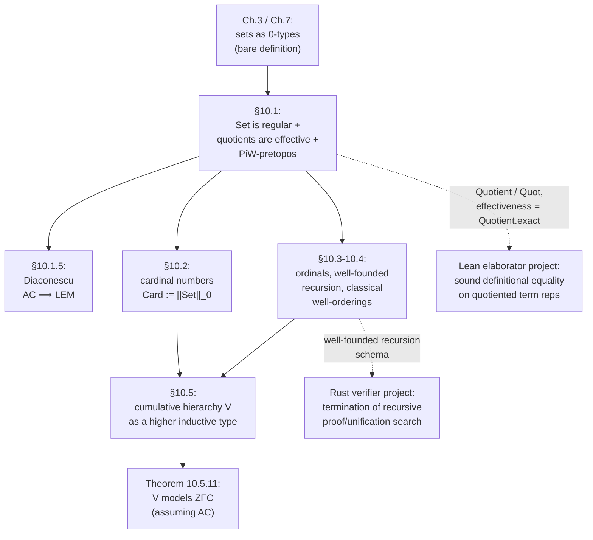

# Sets in Univalent Foundations

[[book-guidelines|↩ Back to guidelines]]

## What problem does this solve?

Every earlier chapter of the book has been building toward a quiet but load-bearing claim: you don't need Zermelo–Fraenkel set theory to do ordinary mathematics. [[Homotopy-n-Types-and-Truncation-Levels|Sets, as $0$-types]], were defined back in §3.1 as nothing more than types whose identity types are mere propositions — no membership relation, no cumulative hierarchy, no axioms bolted on from outside. That's an elegant definition, but elegance alone doesn't tell you it actually *works* as a foundation. A working mathematician doesn't just want "a type with boring equality" — they want images, quotients, cardinality, well-orderings, and (if they're doing set theory itself) something that behaves like the classical universe of sets, membership relation included. Chapter 10 is the payoff chapter: it takes the bare $0$-type notion of "set" and shows it supports the *entire toolkit* classical set theory offers, built up from nothing but the type-theoretic machinery already in hand (equivalences, [[Formal-Metatheory#Univalence|univalence]], [[Higher-Inductive-Types|higher inductive types]], truncation).

The chapter has two halves with a shared throughline. §10.1 shows that the category $\mathbf{Set}$ of $0$-types has all the *categorical* structure you'd expect of "the sets" — limits, colimits, images, quotients, a notion of predicative topos — culminating in the observation that it's a **$\Pi W$-pretopos**. §§10.2–10.5 then show that $\mathbf{Set}$ also supports the *set-theoretic* toolkit — cardinal numbers, ordinal numbers, and, in the final and most striking construction, an internally-built copy of the **cumulative hierarchy $V$** (Zermelo's iterative universe) that turns out to model full ZFC. The two halves are connected by one idea worth holding onto throughout: **univalence turns definitions that classical set theory has to state axiomatically (extensionality, structural identity of isomorphic objects) into *theorems*, because equal-up-to-equivalence and equal-as-types coincide.**

**What breaks without this chapter:** without it, "sets are $0$-types" is a promise with no proof. You could show $0$-types are closed under products and sums (easy), but you couldn't yet quotient a set by an equivalence relation and be sure the quotient map behaves like a classical epimorphism; you couldn't compare cardinalities of two sets without borrowing set-theoretic machinery from outside the system; and you'd have no internal object that *looks like* the sets a working set theorist reasons about, membership relation and all — which matters if you ever want to interpret ZFC-based mathematics inside HoTT rather than merely gesture that it's "possible in principle."

---

## Part I — The category $\mathbf{Set}$

### Limits and colimits: the easy half

Recall from Chapter 9 that $\mathbf{Set}$ is the category of $0$-types and functions between them, and (because $0$-types have decidable-enough identity for hom-sets to be sets) it's an honest *category*, not merely a precategory.

Most closure properties are inherited for free from closure properties of $0$-types you've already proved:

- **Finite and infinite products**: sets are closed under $\Sigma$ and $\Pi$, and $\prod_{a:A} B(a)$ being a set (when each $B(a)$ is) gives you arbitrary products at once, via $X \to \prod_a B(a) \;\simeq\; \prod_a (X \to B(a))$.
- **Pullbacks**: $f: A \to C$, $g: B \to C$ pulled back is $\sum_{(a:A)}\sum_{(b:B)} f(a) = g(b)$, itself a set when $A, B, C$ are.
- **Finite and infinite coproducts**: sets are closed under $+$ and contain $\mathbf{0}$; more generally $\sum_{(a:A)} B(a)$ is a set whenever $A$ and each $B(a)$ are, giving arbitrary coproducts.
- **Pushouts**: proved in §7.4 for all $n$-types, $\mathbf{Set}$ included.

So $\mathbf{Set}$ is complete and cocomplete "for free," inherited from the closure properties of the truncation levels. This part is unsurprising — the interesting content starts once you ask what a *quotient* or an *image* looks like internally.

### Images and regular epimorphisms

A **regular category** is one that (i) is finitely complete, (ii) every kernel pair $\mathrm{pr}_1, \mathrm{pr}_2 : \big(\sum_{(x,y:A)} f(x) = f(y)\big) \to A$ has a coequalizer, and (iii) pullbacks of regular epimorphisms (coequalizers of some parallel pair) are again regular epimorphisms.

The book already has the raw material to build the coequalizer of a kernel pair: it's the **image** of $f$, from §7.6:
$$
\mathrm{im}(f) :\equiv \sum_{(b:B)} \mathrm{fib}_f(b), \qquad \tilde f :\equiv \lambda a.\, (f(a), (a, \mathrm{refl}_{f(a)})), \qquad i_f :\equiv \mathrm{pr}_1,
$$
fitting into the factorization
$$
\sum_{(x,y:A)} f(x) = f(y) \;\rightrightarrows\; A \xrightarrow{\ \tilde f\ } \mathrm{im}(f) \xrightarrow{\ i_f\ } B.
$$
Because $\tilde f$ is exactly the $(-1)$-connected part and $i_f$ the $(-1)$-truncated part of $f$ in the sense of Chapter 7's general orthogonal factorization system, this factorization is automatically **stable under pullback** — you get property (iii) essentially for free from work already done.

The book then reconnects two familiar words — *surjective* and *injective* — with their categorical shadows, *epimorphism* and *monomorphism*:

- **Lemma 10.1.1**: for $f : \hom_{\mathcal{A}}(a,b)$ in any category, being a monomorphism is equivalent to the diagonal $a \to a \times_b a$ being an isomorphism, to $\sum_{(h)} (k = f \circ h)$ being a mere proposition for all $k$, and to that same type being contractible.
- **Lemma 10.1.2**: $f : A \to B$ between sets is injective iff it's a monomorphism in $\mathbf{Set}$.
- **Lemma 10.1.4 / Theorem 10.1.5**: for $f: A \to B$ between sets, being an epimorphism, having a contractible mapping cone $C_f$, and being surjective are all equivalent — and $\mathbf{Set}$ is regular, with surjections coinciding exactly with regular epimorphisms.

**What breaks without this identification:** without Theorem 10.1.5, "surjective" (a $\Sigma$-type statement: $\forall b.\ \exists a.\ f(a)=b$) and "epimorphism" (a universal-property statement about maps out of $B$) would be two different notions that merely happen to coincide in ordinary set theory, and every later theorem that wants to reason categorically (e.g. that $\mathbf{Set}$ is a pretopos) would have to re-derive the connection by hand. Proving it once, generically, is what lets the rest of the chapter move freely between the "elementwise" and "universal-property" pictures of the same fact.

### Quotients and effective equivalence relations — the load-bearing section

This is the part of Chapter 10 with the sharpest payoff for anyone building a type checker or proof elaborator, so it's worth slowing down here.

**The problem quotients solve.** You have a set $A$ and an equivalence relation $R : A \to A \to \mathrm{Prop}$ — "these two elements should count as the same," even though they aren't literally the same term. Ordinary programming (and ordinary set theory) wants a new type $A/R$ where elements of $A$ related by $R$ become *literally, definitionally-comparable-as-equal* elements of $A/R$. **What breaks without a well-behaved quotient**: without one, "the same up to $R$" and "provably equal in the type theory" stay permanently different relations, and every downstream construction that wants to reason about equivalence classes (rational numbers as pairs of integers, syntax modulo alpha-equivalence, terms modulo a definitional-equality relation) has to carry $R$ around explicitly forever instead of letting the type system absorb it.

The book already built quotients as higher inductive types back in §6.10 — this chapter's job is to certify that they behave *correctly*, in the precise sense a category theorist means by "exact category."

**Definition 10.1.7 (effective).** $R : A \to A \to \mathrm{Prop}$ is **effective** if the commuting square
$$
\begin{array}{ccc}
\sum_{(x,y:A)} R(x,y) & \xrightarrow{\ \mathrm{pr}_1\ } & A \\
\downarrow{\scriptstyle \mathrm{pr}_2} & & \downarrow{\scriptstyle c_R} \\
A & \xrightarrow{\ c_R\ } & A/R
\end{array}
$$
is a **pullback** — equivalently (Theorem 4.7.7), the canonical map $\prod_{(x,y:A)} R(x,y) \to (c_R(x) = c_R(y))$ is a fiberwise equivalence.

In plain language: effectiveness says the quotient map $c_R$ doesn't *lose information* beyond exactly what $R$ says to forget. Two elements of $A$ become equal in $A/R$ **if and only if** $R$ said they should — no more identifications sneak in, and no fewer. This is exactly the property you want from `Quotient` types.

**Lemma 10.1.8** proves this by an encode–decode argument (the same technique used repeatedly for path spaces since Chapter 2): define a relation $\tilde R : A/R \to A/R \to \mathrm{Prop}$ by double recursion, $\tilde R(c_R(x), c_R(y)) :\equiv R(x,y)$ (well-defined because $R$ is transitive/symmetric), then show $\tilde R(w, w') \simeq (w = w')$ for all $w, w' : A/R$. The forward direction is transport along reflexivity of $\tilde R$; the backward direction reduces — since it's a mere proposition and $c_R$ is surjective — to the case $w = c_R(x)$, $w' = c_R(y)$, where the canonical map $R(x,y) \to (c_R(x)=c_R(y))$ does the job directly.

**A second construction, and why they agree.** The book gives an alternative definition of the quotient as the type of *equivalence classes*, viewed as a subtype of the power set:
$$
A/\!\!/R :\equiv \{\, P : A \to \mathrm{Prop} \mid P \text{ is an equivalence class of } R \,\}
$$
(this needs propositional resizing to stay in the same universe). Viewing $R$ as a map $A \to (A \to \mathrm{Prop})$, $A/\!\!/R$ is exactly $\mathrm{im}(R)$ from §10.1.2 — and since images are already known to be coequalizers (Theorem 10.1.5), this gives a **second, independent proof** that equivalence relations are effective, and that $A/R \simeq A/\!\!/R$ (Theorem 10.1.10, via univalence: coequalizers are unique up to equivalence, so the two constructions of "the same" quotient are literally equal, not just isomorphic-by-convention). A *third* construction is sketched too — take the precategory with objects $A$ and hom-sets $R$, and its Rezk completion (§9.9) has the quotient as its type of objects — left as an exercise, but worth knowing it exists: it says quotients, exact-completion setoids, and Rezk completion are three views of one underlying construction.

**Theorem 10.1.9** proves something slightly more general and very useful: for *any* function $f : A \to B$ between sets, the **kernel relation** $\ker(f, x, y) :\equiv (f(x) = f(y))$ is automatically effective — you don't need $f$ to be a quotient map already, the fact that it lands in a set is enough. This is the theorem that lets you treat "quotient by the kernel of a function" and "the image of that function" as interchangeable, which is exactly the move used throughout the rest of the chapter (e.g. to build cardinals and to build the cumulative hierarchy's membership relation).

### $\mathbf{Set}$ is a $\Pi W$-pretopos

A **$\Pi W$-pretopos** is a locally cartesian closed category with disjoint finite coproducts, effective equivalence relations, and initial algebras for polynomial endofunctors (i.e. $W$-types) — the book's chosen "predicative" analogue of an elementary topos, suited to constructive mathematics where you can't assume a full impredicative power object.

**Theorem 10.1.11.** $\mathbf{Set}$ is a $\Pi W$-pretopos. The proof assembles pieces already proved: initial object and disjoint sums (stable under pullback because pullback has a right adjoint — local cartesian closure, since the "fibrant replacement" $\sum_{(a:A)} f(a) = b$ is equivalent to $A$ over $B$ for any $f: A\to B$); regularity (Theorem 10.1.5); effective quotients (Lemma 10.1.8); and $W$-types, which are closed under $n$-truncation levels (Exercise 7.3) and are initial algebras for polynomial endofunctors (Theorem 5.4.7).

This is a striking result on its own: normally, getting *well-behaved quotients* in constructive type theory requires an external detour through **setoids** (an "exact completion" bolted on from outside, because raw quotient-by-an-inductively-defined-relation doesn't automatically satisfy effectiveness). Univalent foundations gets the same closure property **internally**, for free, via higher inductive types — no setoid layer required. The book flags this explicitly as one of the chapter's headline advantages.

What keeps $\mathbf{Set}$ from being a full elementary topos is the absence, in general, of a *small* subobject classifier: $\mathrm{Prop} :\equiv \sum_{(X:\mathcal U)} \mathrm{isProp}(X)$ does classify monomorphisms (Theorem 10.1.12's hypothesis), but it's as large as the ambient universe unless you assume propositional resizing, in which case $\mathbf{Set}_{\mathcal U}$ *does* become an elementary topos.

### Diaconescu's theorem: choice implies excluded middle

The chapter closes §10.1 with a genuinely surprising classical fact, reproduced constructively: **the axiom of choice implies the law of excluded middle** (Theorem 10.1.14, due to Diaconescu, adapted from topos theory). The proof is a small gem worth walking through because it's a beautiful use of the suspension construction:

1. **Lemma 10.1.13**: if $A$ is a mere proposition, its suspension $\Sigma(A)$ (formed with point constructors $\mathsf N, \mathsf S$ and meridian $\mathrm{merid} : A \to (\mathsf N = \mathsf S)$) is a *set*, and $A \simeq (\mathsf N =_{\Sigma(A)} \mathsf S)$. The proof builds an explicit encode–decode family $P$ that collapses to $A$ or $\mathbf 1$ depending on which points you compare, using univalence to turn the equivalences into path equalities.
2. Given a mere proposition $A$, the map $f : \mathbf 2 \to \Sigma(A)$ sending $0_2 \mapsto \mathsf N,\ 1_2 \mapsto \mathsf S$ is surjective.
3. Since $\Sigma(A)$ is a **set**, AC gives a (mere) section $g : \Sigma(A) \to \mathbf 2$ of $f$.
4. Equality on $\mathbf 2$ is decidable, so $g(f(0_2)) = g(f(1_2))$ is decidable; since $g$ is a section (hence injective), $f(0_2) = f(1_2)$ is decidable.
5. But $f(0_2) = f(1_2)$ *is* $(\mathsf N = \mathsf S) \simeq A$ by step 1 — so $A$ is decidable. Since $A$ was an arbitrary mere proposition, this is exactly excluded middle.

The mechanism to notice: choice is only ever applied to a genuine *set* ($\Sigma(A)$), never to $A$ itself — the suspension trick is precisely what manufactures a set out of an arbitrary proposition so that AC (which the book only ever states for sets) becomes applicable. This is the same reason AC is a delicate axiom in HoTT: it's not automatically weaker or stronger than its classical counterpart, it's stated at a specific truncation level, and Diaconescu's construction shows exactly how far that level can be exploited.

---

## Part II — Cardinal and ordinal numbers

### Cardinal numbers

**Definition 10.2.1.** $\mathrm{Card} :\equiv \|\mathrm{Set}\|_0$ — the $0$-truncation of the type of sets. For a set $A$, $|A|_0$ (its image under the truncation map) is its **cardinality**.

Arithmetic is defined by induction on truncation — the standard move whenever you want to define a function *out of* a truncated type into a set: since $\mathrm{Card}$ is a set, it suffices to define the operation on representatives and check it respects the truncation.
$$
|A|_0 + |B|_0 :\equiv |A + B|_0, \qquad |A|_0 \cdot |B|_0 :\equiv |A \times B|_0, \qquad |A|_0^{|B|_0} :\equiv |B \to A|_0.
$$
$\mathrm{Card}$ is a **commutative semiring** under $+, \cdot$ (Lemma 10.2.4) — e.g. commutativity of multiplication reduces, by induction on truncation twice, to giving an equivalence $A \times B \simeq B \times A$, which univalence then turns into an actual equality of cardinals $|A \times B|_0 = |B \times A|_0$. This is a recurring pattern worth internalizing: **every classical set-theoretic cardinal-arithmetic identity becomes "produce an equivalence, invoke univalence"** — the hard combinatorial content is exactly the same as in classical mathematics, but the bookkeeping of "these are literally the same cardinal, not just equinumerous" is handled by the type theory itself.

**Cardinal inequality**, $|A|_0 \le |B|_0 :\equiv \|\mathrm{inj}(A,B)\|$ ("there merely exists an injection"), is a preorder unconditionally (Lemma 10.2.8), and — **assuming excluded middle** — an antisymmetric partial order, via the classical **Schröder–Bernstein theorem** (Theorem 10.2.10: `inj(A,B) → inj(B,A) → (A ≅ B)`, by the usual back-and-forth argument, which genuinely needs LEM to decide which of the finitely many cases an element falls into). **Cantor's theorem** (10.2.12) reproduces exactly, with the same diagonal argument: for any set $A$ there is no surjection $A \to (A \to \mathbf 2)$, giving (assuming LEM, Corollary 10.2.13) an unbounded hierarchy of ever-larger cardinals $\alpha < 2^\alpha$.

### Ordinal numbers

This is the densest technical section of the chapter, and it rewards being read as *machinery for well-founded recursion*, not just as classical-ordinal bookkeeping.

**Accessibility and well-foundedness.** Given a relation $\mathord{<} : A \to A \to \mathrm{Prop}$ on a set $A$, define accessibility as an *inductive family* (like `Vec` in §5.7): $a$ is accessible ($\mathrm{acc}(a)$) if every $b < a$ is accessible. This bottoms out vacuously at minimal elements (nothing below them, so they're accessible for free). $<$ is **well-founded** if every element is accessible — and well-foundedness of accessibility gives you exactly the induction principle that lets you prove $\forall a.\, P(a)$ from "$\forall b < a.\, P(b) \Rightarrow P(a)$," i.e. **well-founded induction / strong induction**.

- **Lemma 10.3.2**: accessibility is a *mere property* — any two proofs $s_1, s_2 : \mathrm{acc}(a)$ are equal — proved by a genuinely nontrivial induction (this is the one place in the section that needs the fully dependent induction principle for the accessibility family, not just its non-dependent shadow).
- **Example 10.3.5**: the usual order on $\mathbb N$ is well-founded (ordinary strong induction). A *sparser* well-founded relation, $n < \mathrm{succ}(n)$ only, is essentially the ordinary induction principle of $\mathbb N$ in disguise.
- **Example 10.3.6**: for $W$-types, the "immediate subtree" relation is well-founded, and the proof is *literally* the $W$-type's own induction principle — accessibility induction and $W$-type induction are the same mechanism viewed from two angles.
- **Lemma 10.3.7** is the payoff: given a well-founded $<$ on $A$ and $g : \mathcal P(B) \to B$, there's an $f : A \to B$ with $f(a) = g(\{f(a') \mid a' < a\})$ — **well-founded recursion**, the general schema every structural-recursion function you've ever written is an instance of.

**Extensionality and simulations.** A well-founded relation is **extensional** (Definition 10.3.9) if elements with the same "downward set" are literally equal: $\forall c.\ (c<a) \Leftrightarrow (c<b) \Rightarrow a = b$. Theorem 10.3.10 shows the type of extensional well-founded relations on a set is itself a set — proved, characteristically for this book, by showing any self-isomorphism of such a structure is the identity, then invoking univalence.

A **simulation** $f : A \to B$ between extensional well-founded relations preserves $<$ and reflects it "from below" (Definition 10.3.11); simulations are automatically injective (Lemma 10.3.12, by a double well-founded induction) and, between any fixed pair of such structures, **unique** if they exist at all (Lemma 10.3.16). This uniqueness is what makes "$A \le B$ iff there is a simulation $A \to B$" behave like a genuine order rather than a mere preorder up to noncanonical choice — antisymmetry follows immediately from Corollary 10.3.15 plus univalence, since two mutually-simulating structures are isomorphic and hence, by structure identity, *equal*.

**Definition 10.3.17 (ordinal).** An ordinal is a set with an extensional, well-founded, *transitive* relation. $\mathrm{Ord}$ denotes the type of ordinals.

**Theorem 10.3.20**, the section's centerpiece: $(\mathrm{Ord}, <)$ is itself an ordinal — one universe level up. The proof reuses the initial-segment trick ($A/a :\equiv \{b : A \mid b < a\}$, and $a \mapsto A/a$ is injective by extensionality) to show $\mathrm{Ord}$ is well-founded (every $A/a$ is accessible, by induction on $A$'s own well-foundedness) and extensional (two ordinals with the same downward-closed set of smaller ordinals are isomorphic, hence equal by univalence). This is the type-theoretic analogue of the classical fact that "the ordinals are themselves well-ordered" — but here it's not a separate axiom scheme, it *falls out* of the general well-founded/extensional/transitive machinery applied reflexively to $\mathrm{Ord}$ itself.

A genuinely instructive aside: **Lemma 10.3.21** (every ordinal has a strictly larger one, via the successor $A + \mathbf 1$) has an "easy" alternative proof using $A < \mathrm{Ord}$ directly — but the book flags that alternative as subtly *wrong* if the lemma is meant to hold within a single universe, because it silently forces $\mathrm{Ord}$ in the statement to live one universe level higher than the $A$ being compared. This is a sharp, concrete illustration of why **universe polymorphism bookkeeping is not pedantry** — it's the difference between a lemma that's actually usable predicatively and one that only looks like it is.

---

## Part III — Classical well-orderings

§10.4 reconciles the constructive ordinal machinery of §10.3 with the classical picture, and shows exactly where excluded middle and choice enter.

- **Trichotomy** (Lemma 10.4.1): assuming LEM, every ordinal satisfies $\forall a, b.\ (a<b) \vee (a=b) \vee (b<a)$ — proved by a delicate double well-founded induction that case-splits (via LEM) on whether some smaller element already resolves the comparison.
- **No cycles** (Lemma 10.4.2): well-founded relations are automatically acyclic (hence irreflexive) — an easy induction, but worth stating because it's the fact that makes "well-founded" a genuine *strengthening* of a mere preorder.
- **Theorem 10.4.3**: assuming LEM, $(A,<)$ is an ordinal iff every nonempty subset has a **least** element — recovering the classical textbook definition of well-ordering as a theorem rather than a stipulation, once trichotomy is available to upgrade "merely has a minimal element" (which holds unconditionally, Lemma 10.3.8) to "has a *least* element."
- **Theorem 10.4.4 / Corollary 10.4.6–10.4.8**: assuming LEM, the classical set-theoretic axiom of choice ("every family of nonempty subsets has a choice function") is *equivalent* to "every set merely admits ordinal structure" — and, assuming full AC, the forgetful map $\mathrm{Ord} \to \mathrm{Set}$ is surjective, giving $\mathbf{Set}$ a weak equivalence from a genuine *strict category* built out of $\mathrm{Ord}$ (useful because $\mathrm{Set}$ itself is only a $1$-type, not a set, so it can't literally *be* the object-type of a strict category). The surjection $\mathrm{Ord} \to \mathrm{Card}$ (composing with $|-|_0$) even has a canonical section under AC: send each cardinal to the *least* ordinal of that cardinality — this is the type-theoretic mirror of the traditional identification "cardinals are the initial ordinals of their cardinality."

The throughline across §§10.3–10.4: **the book never needs to introduce ordinals as equivalence classes of well-orderings under order-isomorphism** — a genuinely nontrivial simplification over the classical treatment, made possible precisely because univalence collapses "isomorphic" and "equal" for structures satisfying the structure identity principle. Ordinals are literally *sets equipped with the right relation*, full stop; there's no separate act of "taking the canonical representative."

---

## Part IV — The cumulative hierarchy $V$

Everything up to this point has shown that $0$-types support the *category-theoretic* and *combinatorial* apparatus of set theory. §10.5 goes further and asks: can you build, **internally**, something that looks exactly like the classical cumulative hierarchy $V = \bigcup_\alpha V_\alpha$ — a type with a genuine binary $\in$-relation satisfying the ZFC axioms?

**Definition 10.5.1.** $V$ (relative to a universe $\mathcal U$) is the **higher inductive type** generated by:

1. For $A : \mathcal U$ and $f : A \to V$, a point $\mathsf{set}(A,f) : V$ — "the set that is the image of $A$ under $f$."
2. For $A, B : \mathcal U$, $f: A \to V$, $g : B \to V$ satisfying
$$
\big(\forall a.\ \exists b.\ f(a) =_V g(b)\big) \wedge \big(\forall b.\ \exists a.\ f(a) =_V g(b)\big) \qquad (\ast)
$$
(i.e. $f$ and $g$ have the same image "up to mere existence"), a **path** $\mathsf{set}(A,f) =_V \mathsf{set}(B,g)$.
3. A $0$-truncation constructor forcing $V$ to be a set.

Constructor (2) is the genuinely novel move: it doesn't just identify two *elements*, it identifies two elements **whenever the truncated data used to build them agree** — this is a higher inductive type whose path constructor is itself indexed by an existential (truncated) condition, which is why the book flags it as not fitting the general HIT scheme of §6.13 and needing an auxiliary-HIT workaround to justify its induction principle (left as Exercise 10.11). The intuitive content, though, is exactly Zermelo's iterative hierarchy: $\emptyset = \mathsf{set}(\mathbf 0, \mathrm{rec}_{\mathbf 0})$, $\{\emptyset\} $ enters via $\mathbf 1 \to V$, and so on — $V$ is built the same way the classical cumulative hierarchy is, just internally and via a HIT rather than by transfinite recursion on ordinal-indexed stages from outside.

**Membership** is then defined by recursion on $V$ itself:
$$
x \in \mathsf{set}(A,f) :\equiv \exists (a:A).\ x = f(a),
$$
well-defined precisely because constructor (2)'s side condition $(\ast)$ is exactly what's needed to show two "presentations" of the same set have the same members.

**The bisimulation shortcut.** Because $V$ lives in a strictly larger universe than the $\mathcal U$ it's built from (its identity types could in principle be as large as $\mathcal U'$), the book defines a **$\mathcal U$-small bisimulation relation** $\sim$ by double recursion,
$$
\mathsf{set}(A,f) \sim \mathsf{set}(B,g) :\equiv \big(\forall a.\, \exists b.\, f(a)\sim g(b)\big) \wedge \big(\forall b.\, \exists a.\, f(a) \sim g(b)\big),
$$
and proves $(u =_V v) \simeq (u \sim v)$ (Lemma 10.5.5). This is the familiar **encode–decode pattern one more time**, now used to *resize* an identity type down to a smaller universe — a technique worth recognizing on sight, since it recurs at essentially every point in the book where "the natural identity type lives too high up" is a problem to be solved rather than lived with.

**Theorem 10.5.8** then delivers the punchline: $(V, \in)$ satisfies **extensionality, empty set, pairing, infinity, union, function-set formation, $\in$-induction, replacement, and separation** — essentially the full Zermelo–Fraenkel axiom list, each one proved by a short, concrete construction (e.g. *infinity* takes $w = \mathsf{set}(\mathbb N, I)$ with $I(0) := \emptyset$, $I(n+1) := I(n) \cup \{I(n)\}$ — literally the von Neumann encoding of the naturals, built as a genuine element of $V$). **Separation** in full generality needs the class in question to be $\mathcal U$-small (Corollary 10.5.9 gives a syntactic sufficient condition, $\Delta_0$-ness: built only from $=_V$, $\in$, mere-propositional connectives, and *bounded* quantifiers $\exists(x\in a)$, $\forall(y\in b)$) — because unrestricted quantification over all of $V$ can escape the universe $\mathcal U$ that separation needs to land in.

**Theorem 10.5.11**, the chapter's final theorem: assuming the axiom of choice (hence LEM, hence a two-element $\mathrm{Prop} = \mathbf 2$, hence full unrestricted separation and power sets as plain function types $\mathcal P(a) = (a \to \mathbf 2)$), **the cumulative hierarchy $V$ is a model of ZFC**. Full stop — the informal set theory that opened this article's motivation, and the formal set theory most of 20th-century mathematics is built on, is recovered as an *internal construction* inside univalent type theory, with no membership relation, transfinite stage-indexing, or ambient set-theoretic universe assumed from outside. (The book notes honestly that $V$ is *not* known to validate the extra axioms of Constructive Zermelo–Fraenkel set theory, strong/subset collection — an open question flagged rather than swept under the rug.)

---

## Grounding: quotients, decidable equality, and what carries over

**Lean — primary, because quotients here are exactly `Quotient` and `Quot`.** Lean's `Quot` is a *primitive* type former: given `r : α → α → Prop`, `Quot r` and the map `Quot.mk r : α → Quot r` come with a computation rule (`Quot.lift` factors through `Quot.mk` definitionally when the target function respects `r`) that is, term for term, the universal property in Lemma 10.1.3. When `r` is genuinely an equivalence relation, `Quotient` layers `Setoid` on top and gives you `Quotient.sound : a ≈ b → Quotient.mk a = Quotient.mk b` plus `Quotient.exact`, the *converse* direction — and `Quotient.exact` is precisely effectiveness (Definition 10.1.7 / Lemma 10.1.8) stated as a Lean lemma: two classes are equal **only if** the underlying elements were related, no accidental extra collapsing. This is the single most directly transferable fact in the whole chapter for your elaborator project: whenever your type checker needs to reason "these two terms are definitionally equal because they're equal modulo some relation" (alpha-equivalence of bound variables, equality of metavariable-solved terms up to a substitution, or a `Setoid`-style equality on your own term representation), effectiveness is the property that guarantees the quotient doesn't silently identify *more* than the relation licenses — which is exactly the soundness property you need before you can treat `Quotient`-style term identification as safe for unification and definitional-equality checking. Hedberg's theorem (from [[Homotopy-n-Types-and-Truncation-Levels]]) told you *when* equality proofs can be ignored; effectiveness of quotients tells you, symmetrically, *when a quotient's equality is exactly the relation you intended and nothing more* — the two results are the load-bearing pair for building a term representation with decidable, provably-correct equality.

**Rust — secondary, for the "regular epimorphism = surjection" half.** There's no first-class quotient-type former in Rust, but the *pattern* the book proves (a surjective function's fibers determine everything about it, Lemma 10.1.4) shows up constantly in interning/hash-consing schemes: a `fn intern(&mut self, t: RawTerm) -> TermId` that maps raw terms to canonical IDs is exactly a regular epimorphism onto its image, and the correctness property you actually want from an interner — `intern(t1) == intern(t2)` iff `t1` and `t2` are equivalent under your intended relation — is effectiveness again, just without the categorical vocabulary. If you're building deduplicated, hash-consed term representations for your verifier (a near-certainty for a serious implementation), this section is the formal statement of the invariant your interning table needs to maintain.

**Well-founded recursion (Lemma 10.3.7) — Rust and Lean both, and directly load-bearing.** Every recursive function your verifier writes over syntax with metavariables, or your elaborator writes over a dependency graph of pending unification constraints, needs *some* well-founded order to terminate on (structural size, a fuel counter, an explicit rank function). Lemma 10.3.7's schema — accessibility as an inductive family, well-founded recursion as its induction principle — is exactly what Lean's own `termination_by`/`decreasing_by` machinery is discharging under the hood when it isn't using plain structural recursion, and it's the honest mathematical justification for any Rust code that recurses on a custom "this argument is getting smaller" argument that the borrow checker and structural recursion alone can't see.

**Python — illustrative only, for cardinal/ordinal arithmetic.** Python has no native notion of "the type of all sets of a given cardinality," but the arithmetic pattern — define an operation on representatives, prove it respects the relevant equivalence, get a well-defined operation on classes — is the same pattern behind, e.g., `functools.total_ordering` or any deliberately-quotiented value class (`Fraction` reducing to lowest terms is a concrete, if informal, instance of "define on representatives, prove independence of choice of representative"). Not load-bearing for either target project; included because the pattern-recognition is free once you've internalized cardinal arithmetic's proof shape.

**A deliberate omission**: cardinal and ordinal arithmetic itself (§§10.2–10.4's semiring structure, Schröder–Bernstein, trichotomy) has no meaningful correspondence in either target project — a Rust verifier or a Lean-style elaborator has no use for comparing the sizes of infinite sets. It's included here for completeness of the source material and because the *proof techniques* (induction on truncation, encode–decode, the LEM/AC dependency bookkeeping) recur throughout the book, but the content itself is flagged as background rather than a target-project prerequisite, consistent with this workbench's standing note that HoTT-specific mathematical content is context, not a build target.

---

## Where this leads

Structurally, this chapter closes off Part II of the book (the "mathematics" chapters, 8–11): having shown in Chapters 8–9 that homotopy theory and category theory both work natively inside univalent foundations, Chapter 10 shows the *third* classical foundation — Zermelo–Fraenkel set theory — is not a rival to type theory but a **theorem inside it**, via $(V, \in)$. Nothing later in the book depends essentially on cardinal or ordinal arithmetic, but the *techniques* — quotients as effective HITs, well-founded recursion via accessibility, encode–decode for resizing identity types, and induction-on-truncation as the standard way to define operations on a truncated type — are used throughout Chapter 11's connectedness theory and the real-number constructions of Chapter 11's later sections.

For your own projects, the two threads worth carrying forward explicitly: **effectiveness of quotients** (Definition 10.1.7, mirrored exactly by `Quotient.exact` in Lean) is the soundness condition you need before trusting any quotiented term representation's equality in a unifier or definitional-equality checker; and **well-founded recursion via accessibility** (Lemma 10.3.7) is the general schema underlying any terminating recursive proof-search or elaboration procedure that isn't simple structural recursion on syntax.
