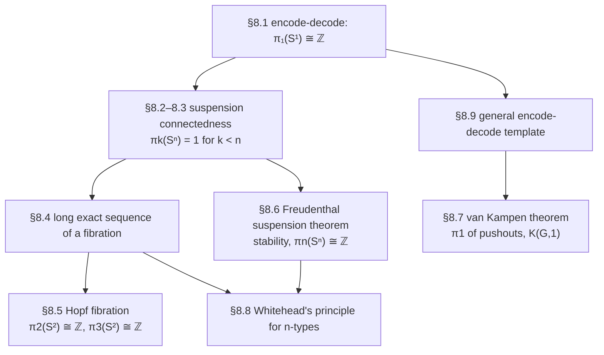

# Synthetic Homotopy Theory

[[book-guidelines|↩ Back to guidelines]]

## What problem does this solve?

Every earlier chapter established that types *are* spaces — points are points, paths are paths, and the identity type carries genuine $\infty$-groupoid structure (associativity, inverses, higher coherences, all proved by path induction rather than assumed). Chapter 8 is where that equivalence is put to work: can you actually *compute* with this structure well enough to answer the questions algebraic topologists ask about real spaces?

The canonical such question: is the circle $S^1$ different from a point? Obviously yes — geometrically, a loop around the circle can't be contracted, while a loop at a point trivially can. But "obviously" is not a proof. The type-theoretic definition of $S^1$ as a higher inductive type gives you exactly two constructors, `base : S¹` and `loop : base = base`, and nothing tells you *up front* that `loop` isn't secretly equal to `refl_base`. Proving that requires computing the entire loop space $\Omega(S^1, \mathrm{base})$ and showing it isn't the point type. That computation is the spine of this chapter, and the technique used to do it — the **encode-decode method** — turns out to be reusable for essentially every homotopy-group calculation in the book.

**What breaks without this machinery:** without [[Formal-Metatheory#Univalence|univalence]], it is *consistent* to assume every type is a set (Axiom K, "uniqueness of identity proofs") — in that world `loop` really would equal `refl_base`, the circle would be indistinguishable from a point at the level of paths, and homotopy type theory would collapse into ordinary set-level type theory. Univalence is what stops that collapse: it lets you turn a nontrivial automorphism of $\mathbb{Z}$ (the successor function) into an honest nontrivial path in the universe, and that path is the raw material from which a nontrivial loop on $S^1$ gets built. Every calculation in this chapter leans on univalence at exactly this point.

---

## 1. The fundamental group of the circle: $\pi_1(S^1) \cong \mathbb{Z}$

### The geometric picture first

Classically, $\pi_1(S^1) \cong \mathbb{Z}$ is proved using a **universal cover**: the helix $w : \mathbb{R} \to S^1$ that winds around the circle, projecting each real number down onto the point of the circle "beneath" it (Figure 8.1 in the book). Walking counterclockwise around the loop on $S^1$ corresponds to climbing up one level of the helix; walking clockwise descends one level. The fiber of $w$ over any point is (isomorphic to) $\mathbb{Z}$ — literally, "which turn of the helix am I on." Since $\mathbb{R}$ and the path space $P_{\text{base}}S^1$ are both contractible, and a homotopy equivalence of total spaces over a common base induces an equivalence on fibers, the fiber $\mathbb{Z}$ and the fiber $\Omega(S^1,\text{base})$ must themselves be equivalent.

Homotopy type theory doesn't have $\mathbb{R}$ or continuous winding maps, but it has an exact structural analogue: a **type family** `code : S¹ → U` that plays the role of the covering fibration. This is the crucial move — instead of building a covering *space*, you build a covering *type family*, using nothing but the recursion principle of the higher inductive type $S^1$.

### Defining the universal cover

By circle recursion, to define `code : S¹ → U` you just need to supply a point of $\mathcal{U}$ (the value at `base`) and a path from that point to itself (what `loop` gets sent to):

$$
\mathrm{code}(\mathrm{base}) :\equiv \mathbb{Z}, \qquad \mathrm{ap}_{\mathrm{code}}(\mathrm{loop}) :\equiv \mathrm{ua}(\mathrm{succ})
$$

Here is exactly where univalence enters: `succ : ℤ → ℤ` is an equivalence (it has `pred` as an inverse), and `ua` converts that equivalence into an actual path $\mathbb{Z} = \mathbb{Z}$ in the universe. Transporting along that path acts as `succ`; transporting along its inverse acts as `pred`. This gives the computational content of "code": the integer $n$ is literally *the winding number*, and `code` is called the fibration of codes because its elements encode paths on the circle combinatorially.

$$
\mathrm{transport}^{\mathrm{code}}(\mathrm{loop}, x) = x + 1, \qquad \mathrm{transport}^{\mathrm{code}}(\mathrm{loop}^{-1}, x) = x - 1 \tag{Lemma 8.1.2}
$$

### The encode-decode method

The naive approach — define `f : Ω(S¹) → ℤ` and `g : ℤ → Ω(S¹)` only at the single point `base`, then show they're inverse — gets stuck immediately: proving `loop^(g(p)) = p` requires **path induction**, but path induction only applies to a path that varies (one endpoint free); `p : base = base` has *both* endpoints nailed down. This is a real technical wall, not a matter of choosing a cleverer proof.

The fix is a generalization move that recurs constantly in type theory: instead of proving a statement about the one point `base`, prove it about *every* point `x : S¹` simultaneously — turn a statement about `Ω(S¹)` into a statement about the whole family `code`.

$$
\mathrm{encode} : \prod_{x : S^1} (\mathrm{base} = x) \to \mathrm{code}(x), \qquad \mathrm{encode}_x(p) :\equiv \mathrm{transport}^{\mathrm{code}}(p, 0)
$$

`encode` lifts a path into the covering family and reads off where `0` lands — mechanically, composing a path like $\mathrm{loop} \cdot \mathrm{loop}^{-1} \cdot \mathrm{loop} \cdots$ becomes composing $\mathrm{succ} \circ \mathrm{pred} \circ \mathrm{succ} \circ \cdots$, applied to $0$: exactly the winding number, with cancellation built in for free by functoriality of `transport`.

```
decode : ∏(x:S¹) code(x) → (base = x)
```
is defined by **circle induction**: at `base` it's `n ↦ loopⁿ` (concatenate `n` copies of `loop`, or of `loop⁻¹` if `n < 0`); showing it respects `loop` is one calculation using Lemma 8.1.2.

Both round-trips are now provable by ordinary induction — the "hard direction" that stumped the naive approach becomes easy once you're inducting over the whole family:

- `decode(encode(p)) = p` — by path induction, reduces to `decode(0) = refl`, true by definition.
- `encode(decode(c)) = c` — by circle induction + integer induction on `n`, using Lemma 8.1.2 in the inductive step.

$$
\text{Theorem 8.1.9: } \prod_{x:S^1} (\mathrm{base} = x) \simeq \mathrm{code}(x) \;\;\Longrightarrow\;\; \Omega(S^1,\mathrm{base}) \simeq \mathbb{Z} \;\;\Longrightarrow\;\; \pi_1(S^1) \cong \mathbb{Z},\;\; \pi_n(S^1) = 0 \; (n>1)
$$

The book also gives two other routes to the same result worth knowing exist, even without full derivations here: the **homotopy-theoretic proof** (§8.1.5), which mimics the classical argument directly — show $\sum_{x:S^1}\mathrm{code}(x)$ is contractible (via the flattening lemma, producing a higher inductive "homotopical reals" type playing the role of $\mathbb{R}$), then invoke that a fiberwise map between contractible total spaces is an equivalence on every fiber; and the **identity-system proof** (§8.1.6), which packages `(code, 0)` as an instance of the abstract identity-system machinery from §5.8 — the encode-decode and homotopy-theoretic proofs turn out to be the two different characterizations of what it means to be an identity system, unified into a single argument done once, generically.

**What breaks without univalence:** without it, "all types are sets" (Axiom K) is consistent, and under that assumption $\pi_1(S^1) \simeq 1$ instead of $\mathbb{Z}$ — the theorem doesn't just get harder to prove, it becomes *false*. The book notes the converse too: `loop = refl_base` would itself imply all types are sets. Non-triviality of $\pi_1(S^1)$ and non-triviality of the universe's path structure are the same fact viewed two ways.

### Grounding: encode-decode as a verified round-trip

There's no faithful Rust or Python analogue of transporting along a univalence-produced path — that mechanism is intrinsically type-theoretic (it requires paths *in the universe* to carry computational content, which no mainstream language's type system has). What *does* transfer directly is the **proof pattern**: encode/decode is structurally identical to proving a serializer and parser are mutual inverses.

```rust
// The "code" family, specialized to the case at hand: an isomorphism
// between two representations of the same data, verified both ways.
trait EncodeDecode {
    type Repr;
    fn encode(&self) -> Self::Repr;
    fn decode(repr: &Self::Repr) -> Self;
}

// decode(encode(x)) == x   and   encode(decode(r)) == r
// are exactly Lemma 8.1.7 / Lemma 8.1.8 — you prove both directions
// separately because nothing forces them to agree automatically.
fn roundtrip_laws<T: EncodeDecode + PartialEq>(x: &T)
where
    T::Repr: PartialEq,
{
    assert!(T::decode(&x.encode()) == *x);              // decode ∘ encode = id
    assert!(T::decode(&x.encode()).encode() == x.encode()); // encode ∘ decode = id (on the image)
}
```

In Lean, the shape is even closer to the book, because Lean's kernel really does traffic in dependent families and transport:

```lean
-- The type-theoretic skeleton, stripped of the S¹-specific content.
-- `Code` plays the role of the book's `code : S¹ → U`.
structure EncodeDecode (A : Type) (a₀ : A) (Code : A → Type) where
  c₀     : Code a₀
  decode : (x : A) → Code x → a₀ = x
  encode : (x : A) → a₀ = x → Code x := fun x p => p ▸ c₀   -- transport along p
  decode_encode : ∀ (c : Code a₀), encode a₀ (decode a₀ c) = c
  encode_decode : decode a₀ c₀ = rfl
```

This is precisely Lemma 8.9.1 below, generalized — the book's own closing move in this chapter is to notice that this skeleton *is* the reusable content, and state it as a standalone lemma once the circle case has motivated it.

---

## 2. Connectedness of suspensions

Recall (from [[Homotopy-n-Types-and-Truncation-Levels]]) that $A$ is **$n$-connected** if $\|A\|_n$ is contractible — informally, $A$ has no interesting structure *at or below* dimension $n$; all its truncations up to level $n$ collapse to a point.

$$
\textbf{Theorem 8.2.1. } \text{If } A \text{ is } n\text{-connected, then } \Sigma A \text{ is } (n+1)\text{-connected.}
$$

The proof exploits that suspension is a pushout, $\Sigma A \equiv \mathbf{1} \sqcup_A \mathbf{1}$, and that pushouts commute with truncation in the relevant sense (Theorem 7.4.12): $(\mathbf 1 \sqcup_A \mathbf 1)_{n+1}$ is itself a pushout of $\|A\|_{n+1}$, and once $A$ is $n$-connected, $\|A\|_{n+1}$ becomes contractible-as-a-diagram-input, collapsing the whole pushout to $\mathbf 1$.

This single fact, applied inductively starting from $S^0$ (merely inhabited, i.e. $(-1)$-connected) and using $S^{n+1} :\equiv \Sigma S^n$, immediately gives:

$$
\textbf{Corollary 8.2.2. } S^n \text{ is } (n-1)\text{-connected, for every } n : \mathbb{N}.
$$

Combined with two easy lemmas about truncated and connected types — an $n$-type has $\pi_k = 1$ for $k > n$ (loop spaces of $n$-types are $(n-k)$-types, hence eventually mere propositions, hence contractible since inhabited), and an $n$-connected type has $\pi_k = 1$ for $k \le n$ — this yields:

$$
\textbf{Corollary 8.3.3. } \pi_k(S^n) = 1 \text{ for } k < n.
$$

This is the first real payoff of the connectedness machinery: it explains, for free and without touching any specific sphere's construction, why the upper-left triangle of Table 8.1 (homotopy groups of spheres) is all zero.

**What breaks without this:** without a general connectedness-of-suspension theorem, you would have to prove $\pi_k(S^n) = 1$ for $k < n$ separately, sphere by sphere, by direct calculation — exactly the kind of per-case labor that a recursive/structural argument is meant to eliminate (the same motivation that drove the recursive definition of $n$-types itself).

---

## 3. Fiber sequences and the long exact sequence

Given a pointed map $f : (X,x_0) \to (Y,y_0)$, its fiber $F :\equiv \mathrm{fib}_f(y_0)$ generates an infinite **fiber sequence**
$$
\cdots \to \Omega^2 Y \to \Omega F \to \Omega X \to \Omega Y \to F \to X \to Y
$$
by repeatedly taking fibers of fibers (each new map is again a fiber inclusion, one loop-space level up). Applying $\pi_k$ (i.e. $\Omega^k(-)_0$) all the way along produces the **long exact sequence of homotopy groups**:

$$
\cdots \to \pi_k(F) \to \pi_k(X) \to \pi_k(Y) \to \pi_{k-1}(F) \to \cdots \to \pi_0(F) \to \pi_0(X) \to \pi_0(Y)
$$

"Exact" means image equals kernel at each stage — proved by truncating the fiber sequence and chasing elements through mere-proposition goals. This machinery is what turns "I know the homotopy groups of two of $F, X, Y$" into "I can constrain, or even compute, the third" — it's the load-bearing tool behind the Hopf fibration computation in the next section, and it also sharpens the connectedness results above: if $f$ is $n$-connected, then $\pi_k(f)$ is an isomorphism for $k \le n$ and surjective at $k = n+1$ (Corollary 8.4.8) — a converse to this (that these conditions on homotopy groups *imply* $n$-connectedness) is exactly what Whitehead's principle will supply, but only for truncated types (§4 below).

---

## 4. The Hopf fibration

$$
\textbf{Theorem 8.5.1 (Hopf Fibration). } \text{There is a fibration } H \text{ over } S^2 \text{ with fiber } S^1 \text{ and total space } S^3.
$$

Classically the Hopf fibration is presented as an explicit map $S^3 \to S^2$ using quaternions or complex projective coordinates. The type-theoretic construction is different in flavor and genuinely synthetic — it never touches coordinates at all, and proceeds in three structural steps.

**Step 1 — fibrations over pushouts (Lemma 8.5.3).** Given a span $Y \xleftarrow{j} X \xrightarrow{k} Z$ and fibrations $E_Y, E_Z$ over $Y, Z$ that agree (up to a chosen equivalence) over $X$, you can glue them into a single fibration over the pushout $Y \sqcup_X Z$, and — crucially — the *total space* of the glued fibration is itself the pushout of the two total spaces. This is a completely general gluing lemma; it's the mechanism, not yet the Hopf fibration.

**Step 2 — the Hopf construction from an H-space (Lemma 8.5.7).** An **H-space** is a pointed type $(A, e)$ with a multiplication $\mu : A \times A \to A$ that's unital up to path ($\mu(e,a) = a = \mu(a,e)$) — think "a group, but without associativity or inverses as data, and only up to homotopy." If $A$ is additionally connected, then $\mu(a,-)$ and $\mu(-,a)$ are automatically equivalences for every $a$ (proved via the fact that "is an equivalence" is a mere proposition, so it suffices to check at the basepoint $e$, where $\mu(e,-)$ is literally the identity). Since $\Sigma A$ is the pushout $\mathbf 1 \sqcup_A \mathbf 1$, applying Lemma 8.5.3 with $E_{\mathbf 1} = E_{\mathbf 1} = A$ and the family of equivalences $\mu(a,-)$ produces a fibration over $\Sigma A$ whose fiber is $A$ and — after identifying the resulting total space with the *join* $A * A$ (the pushout of $A \xleftarrow{\mathrm{pr}_1} A\times A \xrightarrow{\mathrm{pr}_2} A$) — whose total space is exactly $A * A$.

**Step 3 — instantiate at $A \equiv S^1$.** The circle carries an H-space structure (defined by circle recursion: $\mu(\mathrm{base},-) :\equiv \mathrm{id}$, and $\mu(\mathrm{loop},-)$ acts by the pointwise-loop function from Lemma 6.4.2). Feeding $A \equiv S^1$ into Step 2 gives a fibration over $\Sigma S^1 \equiv S^2$ with fiber $S^1$ and total space $S^1 * S^1$. What remains is a chain of small equivalences identifying that join with $S^3$:

$$
S^1 * S^1 \;\simeq\; (\Sigma \mathbf 2) * S^1 \;\simeq\; (\mathbf 2 * \mathbf 2) * S^1 \;\simeq\; \mathbf 2 * (\mathbf 2 * S^1) \;\simeq\; \Sigma(\Sigma S^1) \;\equiv\; S^3
$$

using associativity of join (Lemma 8.5.9), $\Sigma A \simeq \mathbf 2 * A$ (Lemma 8.5.10), and $S^1 \equiv \Sigma \mathbf 2$.

**The payoff.** Feeding the Hopf fibration into the long exact sequence of §3, and plugging in the already-known values $\pi_k(S^1) = 0$ for $k \ne 1$, collapses most of the sequence to zero, leaving:

$$
\textbf{Corollary 8.5.2. } \pi_2(S^2) \cong \mathbb{Z}, \qquad \pi_k(S^3) \cong \pi_k(S^2) \text{ for every } k \ge 3.
$$

This is a genuinely striking result to sit with: $\pi_2(S^2) \cong \mathbb{Z}$ is the *first* nontrivial higher homotopy group computed in the chapter (everything in §§8.1–8.3 was $\pi_1$ or vanishing groups), and it drops out purely from gluing, a group structure on the circle, and bookkeeping through an exact sequence — no coordinates, no explicit quaternion multiplication.

**[[Homotopical-Interpretation-of-Type-Theory#Grounding|Grounding]] — where the faithful analogue runs out.** There is no honest Rust/Python/Lean analogue of "the total space of a glued fibration is the pushout of the total spaces," because that statement is about *identifying two constructions up to equivalence of types*, which is a univalence-flavored fact with no counterpart in a set-theoretic type system. What *is* worth keeping as a mental anchor: the H-space structure on $S^1$ is structurally the same shape as a `Group`-like trait without the associativity/inverse axioms — a "magma with a two-sided unit up to homotopy" — and Lean's own algebraic hierarchy (`Mul`, `One`, one-sided unit lemmas) is the closest legitimate reflection of that shape, even though Lean's version is a strict (set-level) structure, not a homotopical one. Flagging this explicitly rather than forcing a strained code example: the Hopf construction itself (gluing fibrations over a pushout, joins, the chain of equivalences to $S^3$) is intrinsically homotopy-theoretic and doesn't have a meaningful "translate this into a type-checker" reading.

---

## 5. The Freudenthal suspension theorem

Where the encode-decode method has so far been used to characterize a loop space *exactly* (get an equivalence), Freudenthal generalizes it to prove a map is merely **$k$-connected** — a weaker, more flexible target, useful precisely because you don't always need (or can't get) an exact description.

The suspension map $\sigma : X \to \Omega\Sigma X$ sends $x$ to the loop $\mathrm{merid}(x) \cdot \mathrm{merid}(x_0)^{-1}$ (go up to the north pole via $x$, back down via the basepoint).

$$
\textbf{Theorem 8.6.4 (Freudenthal). } \text{If } X \text{ is } n\text{-connected and pointed } (n \ge 0), \text{ then } \sigma : X \to \Omega\Sigma X \text{ is } 2n\text{-connected.}
$$

The proof builds a family `code` not over $X$ but over $\Sigma X$ — for every path $p : N = y$ in the suspension, `code(y, p)` is the (truncated) fiber of $\sigma$ or of the meridian map, depending on whether $y$ is the north or south pole — and shows every such `code(y,p)` is contractible, using the **wedge connectivity lemma** (Lemma 8.6.2) to reduce a case analysis over two independent connected points down to checking just the two "one side is the basepoint" cases plus their agreement. This is the encode-decode method's "connectedness" variant made explicit (compare Lemma 8.9.2 in §7).

**Corollary — stability.** Because $2$-truncation commutes appropriately, Freudenthal immediately yields $\|X\|_{2n} \simeq \|\Omega\Sigma X\|_{2n}$, and specializing to $X \equiv S^n$ (which is $(n-1)$-connected by Corollary 8.2.2):

$$
\textbf{Corollary 8.6.15 (Stability). } \text{If } k \le 2n - 2, \text{ then } \pi_{k+1}(S^{n+1}) \cong \pi_k(S^n).
$$

This is exactly the phenomenon visible as the diagonal stripes in Table 8.1 (the homotopy groups of spheres table): once $n$ is large enough relative to $k$, $\pi_{n+k}(S^n)$ stops depending on $n$ at all — these are the **stable homotopy groups**. Since $\pi_1(S^1) = \mathbb{Z}$ (§1) and $\pi_2(S^2) = \mathbb{Z}$ (§4), induction along the stable diagonal gives:

$$
\textbf{Theorem 8.6.17. } \pi_n(S^n) \cong \mathbb{Z} \text{ for every } n \ge 1. \qquad \textbf{Corollary 8.6.19. } \pi_3(S^2) \cong \mathbb{Z}.
$$

**What breaks without stability:** without Freudenthal, each diagonal entry of Table 8.1 would need its own bespoke calculation — the table would still have gaps and no unifying explanation for *why* the pattern along each diagonal eventually stabilizes to a constant.

---

## 6. The van Kampen theorem

Van Kampen computes $\pi_1$ of a pushout — classically stated for a space covered by two open sets $U, V$, but that's just a concrete way of saying the space is the pushout of $U$ and $V$ over their intersection, so the type-theoretic statement is naturally about arbitrary pushouts $P \equiv B \sqcup_A C$.

The proof reuses encode-decode, but at a subtler level: instead of characterizing a *loop space*, it characterizes the whole **fundamental groupoid** $\Pi_1 X(x,y) :\equiv \|x = y\|_0$ (the $0$-truncation of the identity type — paths up to homotopy, forming a groupoid rather than a group since there's no fixed basepoint). The codes are **alternating sequences** of $\Pi_1 B$- and $\Pi_1 C$-paths, glued along elements of $A$, quotiented by a relation that lets adjacent segments merge.

**Naive van Kampen (Theorem 8.7.4)** gives $\Pi_1 P(u,v) \simeq \mathrm{code}(u,v)$ but only cleanly computes $\pi_1(P)$ when $A$ is a *set* — when $A$ isn't a set, its own path structure gets invisibly absorbed into the quotient relation defining `code`, and you can't extract it back out. The book works three illustrative special cases:

- $A \equiv \mathbf 2, B \equiv C \equiv \mathbf 1$: $P \simeq S^1$, and reduced sequences over $\mathbf 2$ recover exactly the integers — a second, independent proof of $\pi_1(S^1) \cong \mathbb{Z}$.
- $B \equiv C \equiv \mathbf 1$, $A$ arbitrary: $P \equiv \Sigma A$, and codes become alternating words $x_1 y_1^{-1} \cdots x_n y_n^{-1}$ — the free group on $\|A\|_0$, modulo one relation.
- $A \equiv \mathbf 1$: $P$ is the wedge $B \vee C$, and $\pi_1(B \vee C) \cong \pi_1(B) * \pi_1(C)$ — the free product.

**Van Kampen with a set of basepoints (Theorem 8.7.12)** fixes the set-of-$A$ restriction by indexing basepoints through an auxiliary set $S$ rather than through $A$ directly. This is the version that recovers the classical statement in full:

$$
\pi_1(P) \cong \pi_1(B) *_{\pi_1(A)} \pi_1(C) \quad \text{(the amalgamated free product, pushout in the category of groups)}
$$

and its specializations reconstruct familiar facts synthetically: $\pi_1(B/A)$ is $\pi_1(B)$ modulo the normal subgroup generated by the image of $\pi_1(A)$; the torus $T^2$ (built as $S^1 \vee S^1$ coned off along $p \cdot q \cdot p^{-1} \cdot q^{-1}$) has $\pi_1(T^2) \cong \mathbb{Z} \times \mathbb{Z}$; and — the theorem's ultimate reach — **every group $G$ arises as $\pi_1$ of some type**, built directly from any presentation $G = \langle X \mid R\rangle$ by wedging a circle per generator and coning off a loop per relation. $1$-truncating that type produces an **Eilenberg–Mac Lane space** $K(G,1)$.

**Grounding.** Van Kampen's codes-as-alternating-sequences-modulo-a-relation is structurally a **free product with amalgamation**, which has a completely standard implementation as a rewriting system / normal-form data structure:

```rust
// A "code" in the sense of naive van Kampen: an alternating word,
// exactly as reduced in Example 8.7.6 (the S¹ case).
#[derive(Clone, PartialEq)]
enum Segment { InB(GroupElem), InC(GroupElem) }

struct Code(Vec<Segment>);

impl Code {
    // The set-quotient relations from the book: adjacent same-type
    // segments merge (this is literally normalizing a word in a free product).
    fn normalize(mut self) -> Self {
        let mut out: Vec<Segment> = Vec::new();
        for seg in self.0.drain(..) {
            match (out.last_mut(), &seg) {
                (Some(Segment::InB(a)), Segment::InB(b)) => *a = a.mul(b),
                (Some(Segment::InC(a)), Segment::InC(b)) => *a = a.mul(b),
                _ => out.push(seg),
            }
        }
        Code(out)
    }
}
```
This is exactly Example 8.7.6's reduction procedure for $\pi_1(S^1)$, made executable — a nice sanity check that the abstract quotient construction really does compute the group you expect.

---

## 7. Whitehead's theorem and Whitehead's principle for $n$-types

Classically, **Whitehead's theorem** says: a map inducing isomorphisms on all homotopy groups (and on $\pi_0$) between well-behaved spaces (e.g. CW complexes) is a homotopy equivalence. It's tempting to expect this holds automatically in HoTT, since type theory works with $\infty$-groupoids directly rather than through a "badly-behaved" concrete model like topological spaces. **It doesn't.** Whitehead's theorem, stated as "every map inducing isomorphisms on all $\pi_k$ is an equivalence," is *not provable* in HoTT — it fails in specific models (non-hypercomplete $\infty$-toposes), and so must be treated as an additional classicality axiom, in the same family as LEM and AC: consistent to assume, not derivable, invisible if you happen to work inside a concrete set-theoretic model (where it's automatically true), but a genuine extra commitment from type theory's own point of view.

What *is* provable, unconditionally, is the **truncated Whitehead's principle**:

$$
\textbf{Theorem 8.8.3. } \text{If } A, B \text{ are } n\text{-types and } f : A \to B \text{ induces a bijection on } \pi_0 \text{ and on every } \pi_k \; (k \ge 1),\text{ then } f \text{ is an equivalence.}
$$

The proof is downward induction on $n$: at $n = -2$ it's trivial (both types are contractible already); the inductive step reduces "is $f$ an equivalence between $(n{+}1)$-types" to "is $\Omega f$ an equivalence between the $n$-type loop spaces $\Omega A, \Omega B$" (via an intermediate lemma, Corollary 8.8.2, that upgrades a $\pi_0$-bijection-plus-$\Omega$-equivalence into a full embedding), and that's exactly the induction hypothesis. **Crucially, the induction needs a finite $n$ to bottom out at** — if $A$ and $B$ aren't $n$-types for *any* finite $n$ (and such types genuinely exist, e.g. §8.8's explicit construction of $C :\equiv \prod_n B(n)$ built from spheres with nontrivial higher loops), there's no base case, and the argument simply doesn't go through. This is the precise reason the general (untruncated) Whitehead's theorem needs an extra axiom: the proof strategy that works for $n$-types structurally cannot be extended past finite truncation level.

A useful converse falls out along the way: **Corollary 8.8.5** characterizes $n$-connectedness of a map entirely in terms of isomorphisms/surjections on homotopy groups up to level $n{+}1$ — the precise converse to Corollary 8.4.8 promised back in §3.

**Grounding.** This is a genuinely load-bearing conceptual parallel worth stating explicitly, because it names a pattern that recurs constantly in category theory and type-checking: Whitehead's principle for $n$-types is the $\infty$-groupoid-flavored analogue of *"a functor that's fully faithful and essentially surjective is an equivalence of categories"* — indeed the book says so explicitly, and the two proofs share a shape (reduce "equivalence" to "surjective embedding," reduce "embedding" level-by-level). In Lean, the corresponding fact about categories is `CategoryTheory.Equivalence.ofFullyFaithfullyEssSurj` — worth knowing exists as the strict-category shadow of Theorem 8.8.3, though it isn't literally the same proof since Lean's categories don't carry the truncation-level induction this theorem needs.

---

## 8. The general encode-decode method (§8.9)

Having used encode-decode repeatedly — for coproducts and naturals (Ch. 2), truncations (Ch. 7), the circle (§8.1), suspensions/Freudenthal (§8.6), and pushouts/van Kampen (§8.7) — the book closes the chapter by extracting the two reusable shapes explicitly, rather than one abstract lemma covering everything (the variants genuinely differ enough that a single lemma would be unnaturally contorted).

**Loop-space form (Lemma 8.9.1).** Given $(A,a_0)$ and $\mathrm{code} : A \to \mathcal{U}$, if you have $c_0 : \mathrm{code}(a_0)$, a `decode` map, and the two "one side of the round trip is free" conditions (iii)-(iv) below, you get a full equivalence $(a_0 = a_0) \simeq \mathrm{code}(a_0)$ — this is the shape used for $S^1$ itself.

**Truncated form (Lemma 8.9.2).** Replace $(a_0 = x)$ throughout by $\|a_0 = x\|_k$ and require `code(x)` to be a $k$-type; the same two-condition recipe now gives $\|a_0 = a_0\|_k \simeq \mathrm{code}(a_0)$ — this is the shape used for van Kampen (characterizing only the *set*-truncated fundamental groupoid) and implicitly for Freudenthal (characterizing connectivity, i.e. a truncation of the fiber, rather than an exact equivalence).

The pattern that survives across every instance: build `encode` uniformly by `transport`, build `decode` by induction on the higher inductive structure, and prove the two composites are the identity — one direction usually falls out by definition/computation, the other requires the actual induction. Internalizing this as a template (rather than five unrelated ad hoc arguments) is arguably the single most transferable skill in this chapter.

---

## Beyond §8.9: what the chapter gestures at but doesn't prove (§8.10)

The book closes with brief, proof-free pointers worth knowing by name even without derivations: $\pi_{n+1}(S^n) \cong \mathbb{Z}_k$ for $n \ge 3$ (constructively computed, with $k$ conjectured — not yet verified in HoTT at time of writing — to be the classical value $2$); the **Blakers–Massey theorem**, a connectivity statement about pushout-vs-pullback approximation that generalizes the wedge connectivity lemma used inside Freudenthal's proof; a synthetic construction of **Eilenberg–Mac Lane spaces** $K(G,n)$ for all $n$ (§8.7 built $K(G,1)$ already, as a byproduct of van Kampen); and an equivalence between covering spaces of a connected type and sets with a $\pi_1$-action. These are flagged here as "exists, named, out of scope for this article's depth" rather than covered in full, per the source material's own treatment.

---

## Where this leads



This chapter is the payoff chapter for essentially everything preceding it: identity types (Ch. 2) supply the raw path-algebra; [[Higher-Inductive-Types|higher inductive types]] (Ch. 6) supply the spaces ($S^1$, $S^2$, suspensions, pushouts, joins) as first-class citizens with computation rules; univalence (Ch. 4) is what makes `code`-style covering families computationally meaningful; and $n$-types/truncation (Ch. 7, see [[Homotopy-n-Types-and-Truncation-Levels]]) supply the vocabulary — connectedness, truncation level — in which every theorem here is stated. Downstream, Chapter 9's category theory reuses the exact "fully faithful + essentially surjective ⟹ equivalence" pattern that Theorem 8.8.1 introduces as a homotopical warm-up, and the book's broader claim that HoTT gives genuinely new, machine-checkable proofs of classical homotopy theory rests almost entirely on the constructions in this chapter (the Hopf fibration via H-spaces and joins, and $\pi_1(S^1)$ via encode-decode, are the two most frequently cited examples of "new type-theoretic proof, not just a transcription").

Per this workbench's standing goals: this chapter is flagged as background/context rather than a load-bearing prerequisite for the Rust verifier or the elaborator project — no HoTT library is being built here. The one piece worth carrying forward regardless is the **encode-decode method as a general proof-engineering pattern** (§8.9): generalize a statement about one point to a statement about a whole family, build the two directions of a round-trip separately, and prove the composites are the identity by induction. That's the same discipline that underlies proving a parser/serializer pair correct, or proving an elaborator's `isDefEq` and its "distinguisher" agree — the mechanism transfers even though the homotopy-theoretic content (spheres, connectedness, the Hopf fibration) does not.
