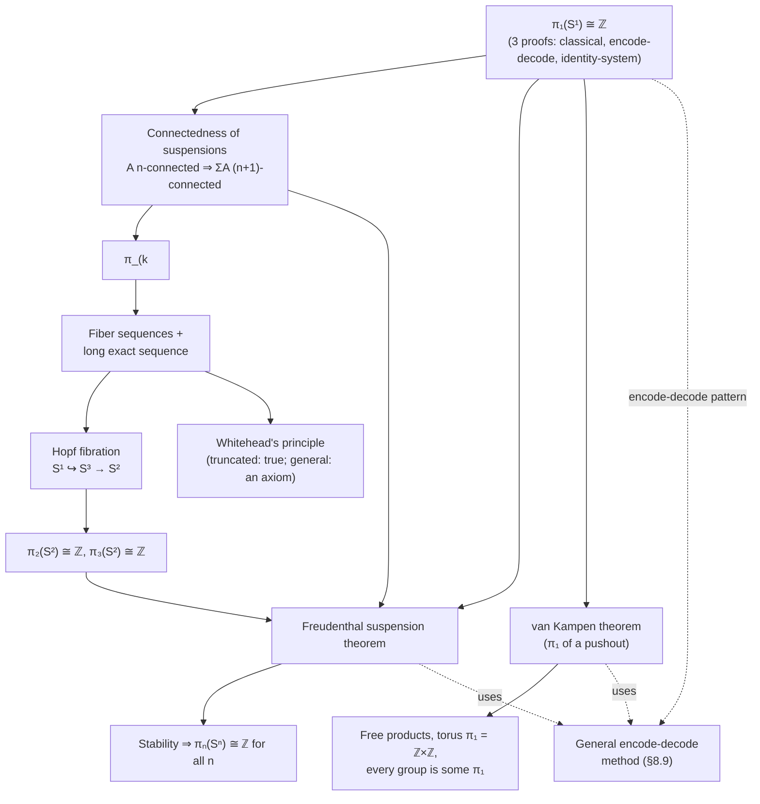

[[book-guidelines|↩ Back to guidelines]]

# Synthetic Homotopy Theory

## Why this chapter exists

Every prior chapter built machinery: identity types as paths, [[Higher-Inductive-Types|higher inductive types]] as free ∞-groupoid presentations, univalence turning equivalence into equality. This chapter is where you finally *use* that machinery to answer a genuinely hard question that classical topology also struggles with: given a space, what are its homotopy groups?

Concretely: $\pi_1(S^1)$, the fundamental group of the circle, "should" be $\mathbb{Z}$ — going around the loop once is different from going around twice, and winding numbers add. Every topology student learns this fact. But *proving* it, in any foundational system, is surprisingly non-trivial, and the type-theoretic proof turns out to reveal something the classical proof obscures: the precise load-bearing role of univalence.

What makes this "synthetic" rather than "analytic" homotopy theory: classical algebraic topology builds spaces out of sets (a topological space is a set of points plus open subsets satisfying axioms), and derives homotopy invariants as a secondary, extracted structure via limits and colimits of that point-set data. Synthetic homotopy theory, by contrast, takes "space," "path," and "homotopy" as *primitive, undefined notions* — directly modeled by types, terms, and paths-between-paths, respectively — the same way synthetic (Euclid-style) geometry takes "point" and "line" as primitive rather than building them out of coordinates. The book states this explicitly at the top of the chapter: no rebuilding of continuous maps as functions $[0,1] \to X$, no combinatorial simplicial machinery to define composition — associativity of path concatenation is proved by *path induction*, a single elimination rule, rather than by explicit reparametrization. If you've worked with algebraic structures given by generators and relations (free groups, term algebras, initial algebras for a signature) you already have the right intuition: a higher inductive type presents a space by its *universal property*, and the identity type of that presentation is exactly as much structure as the generators force and no more — often *surprisingly more* than you'd naively expect, which is the whole difficulty of this chapter.

**[[Sets-in-Univalent-Foundations#What breaks without this|What breaks without this]] machinery.** Without identity types carrying non-trivial path structure (i.e., without moving past `UIP`/Axiom K, discussed in Chapter 7), every type collapses to a set, every loop is reflexivity, and $\pi_1(S^1)$ is trivially $1$. Synthetic homotopy theory is only interesting — is only *homotopy theory* — because univalence forces paths in the universe to carry real content.

---

## Part 1 — $\pi_1(S^1) \cong \mathbb{Z}$: three proofs of one theorem

### 1.1 What we're actually proving

The book's target is stronger than "the fundamental group is $\mathbb{Z}$": it shows the *loop space* $\Omega(S^1, \mathrm{base}) :\equiv (\mathrm{base} =_{S^1} \mathrm{base})$ is *equivalent* to $\mathbb{Z}$ — not just that their 0-truncations (the actual groups, "isomorphism classes of loops") agree. This is strictly stronger: it says there's already no redundancy at the level of paths, before any truncation. Concluding $\pi_1(S^1) \cong \mathbb{Z}$ is then immediate, and as a bonus you get that $\Omega(S^1)$ is already a set (since $\mathbb{Z}$ is a set-quotient), which forces all higher homotopy groups $\pi_n(S^1)$ for $n > 1$ to vanish for free.

Homotopy groups themselves are defined recursively via iterated loop spaces:
$$\Omega^0(A,a) :\equiv (A,a), \qquad \Omega^{n+1}(A,a) :\equiv \Omega^n(\Omega(A,a))$$
$$\pi_n(A,a) :\equiv \left\| \Omega^n(A,a) \right\|_0 \qquad (n \geq 1)$$

with $\pi_0(A) :\equiv \|A\|_0$ handled separately since it isn't a group and needs no basepoint. For $n \geq 2$, $\pi_n(A)$ is automatically *abelian* — this falls straight out of [[Identity-Types-and-Path-Structure#The Eckmann–Hilton argument|the Eckmann–Hilton argument]] from Chapter 2 (two compatible monoid structures on the same set force each other to be commutative and coincide; here the two structures are "outer" and "inner" loop composition on $\Omega^2$).

**Grounding — why this is the "checker" of a spec, not just a "gadget":** think of $\Omega^n(A,a)$ the way you'd think of a family of refinement types layered on top of each other. $\pi_n$ is what you get after you *quotient out* proof-irrelevant redundancy (0-truncation) — the same move a refinement-type checker makes when it discards *how* a Hoare-triple obligation was discharged and keeps only *that* it was discharged. The book's insistence on working with the untruncated $\Omega(S^1) \simeq \mathbb{Z}$ before truncating is analogous to keeping proof terms around during elaboration (for later proof reconstruction) rather than immediately erasing to a boolean "type-checks: yes/no."

### 1.2 First attempt, and why it fails

The circle's induction principle (from Chapter 6: $S^1$ is generated by `base : S¹` and `loop : base = base`) gives an easy function $\mathbb{Z} \to \Omega(S^1)$:
$$\mathrm{loop}^n :\equiv \underbrace{\mathrm{loop} \cdot \mathrm{loop} \cdots \mathrm{loop}}_{n} \quad (n>0), \qquad \mathrm{loop}^{-n} :\equiv (\mathrm{loop}^{-1})^{\cdot n}, \qquad \mathrm{loop}^0 :\equiv \mathrm{refl}$$

The hard direction is a map $\Omega(S^1) \to \mathbb{Z}$. The book builds one using univalence: since `succ : ℤ → ℤ` is an equivalence, $\mathrm{ua}(\mathrm{succ}) : \mathbb{Z} =_{\mathcal U} \mathbb{Z}$ is an honest path in the universe. Circle-recursion then gives a map $c : S^1 \to \mathcal{U}$ with $c(\mathrm{base}) :\equiv \mathbb{Z}$ and $\mathrm{ap}_c(\mathrm{loop}) :\equiv \mathrm{ua}(\mathrm{succ})$, and $g(p) :\equiv \mathrm{transport}^{X \mapsto X}(\mathrm{ap}_c(p), 0)$ finishes the job.

This is easy to state but you can prove $g(\mathrm{loop}^n) = n$ and get stuck trying to prove the *other* direction $\mathrm{loop}^{g(p)} = p$: **path induction does not apply**, because path induction only lets you reason about paths of the form $\mathrm{refl}_a$ from a fixed point to itself when the *entire path* is generic — a loop with both endpoints pinned at the same fixed point `base` is exactly the pathological case path induction can't touch (this is the same phenomenon flagged in Chapter 1: path induction cannot prove all loops are reflexivity, precisely because it's not strong enough to see anything special about loops).

### 1.3 Fix: generalize over the whole fibration, not just the fiber at `base`

The key mathematical realization — one that recurs constantly in dependently-typed proof engineering — is: **when a statement about one point of an inductive type resists induction, generalize it to a statement about every point, and induct on that.** Concretely, instead of trying to build isolated maps between $\Omega(S^1)$ and $\mathbb{Z}$, build a whole **morphism of fibrations** over all of $S^1$:
$$\prod_{x : S^1} \big((\mathrm{base}=x) \to \mathrm{code}(x)\big) \qquad \text{and/or} \qquad \prod_{x:S^1} \big(\mathrm{code}(x) \to (\mathrm{base}=x)\big)$$

where `code : S¹ → 𝒰` is the **universal cover**:
$$\mathrm{code}(\mathrm{base}) :\equiv \mathbb{Z}, \qquad \mathrm{ap}_{\mathrm{code}}(\mathrm{loop}) :\equiv \mathrm{ua}(\mathrm{succ})$$

This is the same `c` from the failed first attempt, just given a proper name and a proper job: it's called "code" because each integer $n$ acts as *combinatorial data encoding a path* — "the path that winds around $n$ times." A quick calculation (`transport` is functorial, and `transport` along `ua(e)` computes to applying `e`) gives:
$$\mathrm{transport}^{\mathrm{code}}(\mathrm{loop}, x) = x+1, \qquad \mathrm{transport}^{\mathrm{code}}(\mathrm{loop}^{-1}, x) = x-1$$

which is exactly the picture of a winding staircase: walking around the loop once in the base bumps you up one level in the fiber.

**Rust grounding.** The "generalize to the whole family, then induct" move maps almost literally onto how you'd structure a *typestate* proof in Rust: instead of trying to directly prove a property of one state transition, you index a `trait` or `enum` variant by *all* reachable states and prove the invariant is preserved by every transition (an inductive invariant, in the abstract-interpretation sense). `code` is playing the role of an *abstract domain* attached to each point of `S¹`, and the transport equations are exactly the *transfer functions* of that domain across the single generating edge (`loop`) of the automaton. This is the same shape as building a state machine where the state space is $\mathbb{Z}$ (winding count) and the one transition (`loop`) increments it — a covering-space proof is, structurally, an inductive-invariant proof for a one-transition automaton with infinite state space.

The book now offers **three separate proofs** that this generalized statement holds — a striking feature of this chapter: there is no unique "right" formalization, and comparing the proofs teaches you something about the underlying machinery each time.

### 1.4 Proof 1 — the classical (homotopy-theoretic) proof, transcribed

Classically: consider the "winding" map $w : \mathbb{R} \to S^1$ (a helix projecting onto the circle). This is a fibration with fiber $\mathbb{Z}$ over each point; $\mathbb{R}$ is contractible; the *path fibration* $P_{\mathrm{base}}S^1 \to S^1$ (whose total space is $\sum_{x:S^1}(\mathrm{base}=x)$, contractible since paths retract to their start point) is also, essentially by definition, a fibration with fiber $\Omega(S^1)$ over `base`. The general fact "an equivalence of total spaces over the same base induces an equivalence on each fiber" (Theorem 4.7.7 in the book) then finishes the argument, *provided* you can show the total space of `code` is itself contractible.

Proving $\sum_{x:S^1}\mathrm{code}(x)$ contractible is the hard part, and it uses the **flattening lemma** (§6.12): instantiating it exhibits this total space as equivalent to a new higher inductive type $R$ generated by a function $c : \mathbb{Z} \to R$ and, for every $z$, a path $c(z)=c(\mathrm{succ}(z))$ — the "homotopical reals," a discretized stand-in for $\mathbb{R}$. Contractibility of $R$ is then proved directly: pick $c(0)$ as center, and induct.

### 1.5 Proof 2 — encode-decode, the book's preferred method

This is the technique that gives the whole chapter its recurring rhythm (see Part 6 below), so it's worth internalizing precisely. Instead of using contractibility of total spaces (an existence argument), **construct both directions of the desired equivalence explicitly** and show they're mutually inverse by direct computation.

- **`encode`** — the easy direction, defined uniformly for every $x$:
  $$\mathrm{encode}_x(p) :\equiv \mathrm{transport}^{\mathrm{code}}(p, 0)$$
  Because `transport` is functorial, `encode` applied to a composite path like $\mathrm{loop}\cdot\mathrm{loop}^{-1}\cdot\mathrm{loop}\cdots$ computes the *composite function* $\mathrm{succ}\circ\mathrm{pred}\circ\mathrm{succ}\circ\cdots$ applied to $0$ — literally counting up winding number with cancellation, purely by unfolding definitions. This is where you feel univalence doing real computational work: `ap_code(loop)` being `ua(succ)` is what makes "transport along a path in the base" *literally be* "apply an isomorphism."

- **`decode`** — built by circle induction: it suffices to give a function $\mathrm{code}(\mathrm{base}) \to (\mathrm{base}=\mathrm{base})$ (this is `loop^–` from §1.2) and check that it "respects the loop" — a dependent-path condition that reduces, after unfolding `transport` through a function type and a path type, to the arithmetic fact $\mathrm{loop}^{n-1}\cdot\mathrm{loop} = \mathrm{loop}^n$.

- Showing `encode`/`decode` are mutual inverses is now comparatively mechanical: `decode(encode(refl)) = refl` by direct computation, and `encode(decode(n)) = n` by ordinary integer induction, using `code(x)` being a set at every stage so that higher coherence is free.

The punchline the book stresses: "what used to be the difficult direction is now easy" — the hard direction (constructing `decode`) is now *easy* because it never has to fight path induction on a pinned endpoint; the induction is on the *inductive type itself* (`S¹`, then `ℤ`), which is exactly what induction principles are for.

### 1.6 Proof 3 — the universal cover as an identity system

A third, more uniform proof recognizes `(code, 0)` as an **identity system** at `base` in the sense of Chapter 5's §5.8 (recall: a "pointed predicate" $D$ together with a witness that satisfies a Yoneda-style universal mapping property is equivalent to being literally the identity type). This reformulates encode/decode as one abstract theorem instance, performing the inductive argument only once rather than duplicating it across the two earlier proofs. This is the type-theoretic analogue of recognizing that a bespoke unification routine is actually an instance of a general categorical universal property — once you see the pattern, you stop reproving it by hand every time.

**Lean grounding.** This identity-system move is precisely the trick behind Lean's own `Eq.rec`/`@[elab_as_elim]` custom recursors and behind how Lean's kernel treats *inductive families* like `Vector` or `Fin` — once you exhibit a predicate as satisfying the "pointed predicate is an identity system" criterion, you get a bespoke, computationally-behaved induction principle for free, exactly the way `rfl`-based unfolding underlies definitional equality checks in `isDefEq`. If you're building your own kernel, this section is the direct blueprint for how to justify a derived elimination principle for indexed inductive types rather than re-deriving it from raw `J` (path induction) every time.

### 1.7 Why univalence is unavoidable here

The chapter is explicit and emphatic: **all three proofs use univalence essentially**, and this isn't an artifact of a clumsy proof — it's provably necessary. Without univalence, it is *consistent* to assume `Axiom K` / uniqueness of identity proofs (every type is a set), and under that assumption $\pi_1(S^1) \simeq \mathbf{1}$ (trivial). In fact the book notes the converse: $\pi_1(S^1)$ being non-trivial is logically *equivalent* to the failure of "all types are sets." So the (non)triviality of the circle's fundamental group is, in a precise sense, a *litmus test* for whether your type theory has genuine homotopical content at all.

---

## Part 2 — Connectedness of suspensions

**Motivation.** Section 8.1's proof leaned on `Sⁿ` being built as an iterated suspension. To bootstrap the rest of the chapter (computing $\pi_{k<n}(S^n) = 0$, setting up Freudenthal), you need a structural fact: **suspension increases connectedness by one.**

Recall (Chapter 7) $A$ is $n$-connected if $\|A\|_n$ is contractible. The theorem:
$$\text{if } A \text{ is } n\text{-connected, then } \Sigma A \text{ is } (n+1)\text{-connected.}$$

The proof is a clean application of the pushout machinery from Chapter 6/7: $\Sigma A$ is the pushout $\mathbf{1} \sqcup_A \mathbf{1}$, and truncating a pushout diagram commutes with truncating its legs (Theorem 7.4.12); since $\|A\|_{n+1}$ is $n$-connected (hence contractible as an $(n+1)$-type once truncated appropriately), the pushout collapses to $\mathbf{1}$.

**Corollary (the one you'll actually use downstream):** $S^n$ is $(n-1)$-connected, by induction — $S^0$ is merely inhabited (0-connected... well, $(-1)$-connected, i.e., merely inhabited, the base case), and each suspension step bumps connectedness by one, exactly matching the recursive definition $S^{n+1} :\equiv \Sigma S^n$.

**What breaks without it:** without this connectivity bookkeeping there'd be no way to bound *how much* information a map like Freudenthal's $\sigma: X \to \Omega\Sigma X$ preserves — connectivity numbers are the currency the rest of the chapter trades in.

---

## Part 3 — $\pi_{k \le n}$ of an $n$-connected space

Two lemmas convert connectivity data directly into vanishing homotopy groups:

- **Lemma 8.3.1.** If $A$ is $n$-truncated, $\pi_k(A,a) = 1$ for $k > n$ — an $n$-type has $(n-1)$-truncated loop spaces (Chapter 7), so iterating $k$ times past $n$ drives you into "mere proposition, and inhabited, hence contractible" territory.
- **Lemma 8.3.2.** If $A$ is $n$-connected, $\pi_k(A,a) = 1$ for $k \le n$ — a short chain of truncation identities collapses $\Omega^k(A,a)$ down through $\|A\|_n \simeq 1$.

Combined with $S^n$ being $(n-1)$-connected: $\pi_k(S^n) = 1$ for $k < n$ (Corollary 8.3.3). This is the "trivial region" of Table 8.1 in the book — everything above the diagonal — dispensed with in two short lemmas, before any hard combinatorics.

---

## Part 4 — Fiber sequences and the long exact sequence

**Motivation.** To get past the trivial region and compute $\pi_2(S^2)$, $\pi_3(S^2)$, etc., you need to relate homotopy groups of three spaces connected by a map: total space, base, and fiber. Classical topology's tool for this is the long exact sequence of homotopy groups; the chapter derives a type-theoretic version from first principles, iterating a simple observation.

A **pointed map** $f:(X,x_0)\to(Y,y_0)$ is a function plus a path $f_0 : f(x_0)=y_0$. Looping is functorial on pointed maps: $\Omega f (p) :\equiv f_0^{-1}\cdot f(p)\cdot f_0$. There's a second functor, $f \mapsto \mathrm{pr}_1 : \mathrm{fib}_f(y_0)\to X$, and — crucially — this operation can be **iterated**, producing the **fiber sequence**:
$$\cdots \to X^{(n+1)} \xrightarrow{f^{(n)}} X^{(n)} \to \cdots \to X^{(2)} \to X^{(1)} \to X^{(0)}$$
with $X^{(0)} :\equiv Y$, $X^{(1)} :\equiv X$, and $X^{(n+1)} :\equiv \mathrm{fib}_{f^{(n-1)}}(x_0^{(n-1)})$.

The payoff (Lemma 8.4.4) is that this sequence, three steps in, is *literally* built from iterated loop spaces: the fiber of $\mathrm{pr}_1 : \mathrm{fib}_f(y_0)\to X$ is $\Omega Y$; the fiber of *that* map is $\Omega X$; and under these identifications, the next map in line is $\Omega f$ composed with path-inversion. Truncating the whole tower at $\pi_0$ turns it into an honest **exact sequence of pointed sets/groups**:
$$\cdots \to \pi_k(F) \to \pi_k(X) \to \pi_k(Y) \to \pi_{k-1}(F) \to \cdots \to \pi_0(F)\to\pi_0(X)\to\pi_0(Y)$$
where exactness means image of one map equals kernel of the next.

Two standard exactness lemmas (injective if kernel vanishes, surjective if cokernel vanishes, isomorphism if both) then give the chapter's real workhorse:

**Corollary 8.4.8.** If $f:A\to B$ is $n$-connected, then $\pi_k(f)$ is an *isomorphism* for $k \le n$ and *surjective* for $k=n+1$.

This is the tool that turns "I know $f$ is $n$-connected" into concrete group-theoretic mileage, and it's what powers the Hopf fibration computation next.

**Rust/verification grounding.** An exact sequence is, structurally, the homotopy-theoretic analogue of a *soundness chain* in a verification pipeline: each stage's "false positives" (things the previous stage wrongly let through, i.e. the kernel) are exactly captured by what the *next* stage recognizes as coming from further upstream (the image). If you've built a CEGAR loop or an abstract-interpretation refinement chain, the shape is the same: exactness at a node is precisely the invariant "nothing spurious survives past this checkpoint that wasn't already accounted for by the stage before it."

---

## Part 5 — The Hopf fibration

**Motivation.** This is the chapter's showpiece: a completely synthetic, higher-inductive-type construction of one of the classic objects of algebraic topology — a nontrivial fibration $S^1 \hookrightarrow S^3 \to S^2$ — built with no coordinates, no quaternions in sight at the type-theoretic level, purely from the *recursion principle* of pushouts.

### 5.1 Fibrations over pushouts, generically

The enabling lemma (8.5.3) says: given a span $Y \xleftarrow{j} X \xrightarrow{k} Z$ and fibrations $E_Y : Y\to\mathcal U$, $E_Z:Z\to\mathcal U$ agreeing (up to a chosen equivalence $e_X$) over $X$, you can *glue* them into a single fibration $E$ over the pushout $Y\sqcup_X Z$, using `ua(e_X)` as the path-constructor's image. Moreover, the **total space of the glued fibration is itself the pushout of the total spaces of $E_Y$ and $E_Z$** — proved via the flattening lemma from Chapter 6. This is the reusable "gluing" tool the rest of the section instantiates twice.

### 5.2 H-spaces and the Hopf construction

An **H-space** is a type $A$ with basepoint $e$, multiplication $\mu$, and unit laws $\mu(e,a)=a=\mu(a,e)$ — "a monoid up to path, without associativity required." If $A$ is *connected*, both $\mu(a,-)$ and $\mu(-,a)$ are automatically equivalences for every $a$ (proved by reducing to a statement about $\|A\|_0 \simeq 1$ and checking it just at the basepoint — connectivity again doing the work of "check one representative, get all of them for free").

Since $\Sigma A \equiv \mathbf 1 \sqcup_A \mathbf 1$, instantiating the gluing lemma with $F_1=F_2=A$ and the family of equivalences $a \mapsto \mu(a,-)$ produces the **Hopf construction**: a fibration over $\Sigma A$ with fiber $A$, whose total space turns out (after identifying two equivalent spans) to be the **join** $A * A$ (recall from §6.8: the join is the pushout of $A \xleftarrow{\mathrm{pr}_1} A\times B \xrightarrow{\mathrm{pr}_2} B$).

### 5.3 Assembling $S^1 \hookrightarrow S^3 \to S^2$

Two more ingredients close the loop:
1. **$S^1$ is an H-space** — define multiplication by circle recursion, sending `base` to `id` and `loop` to `funext(h)` where `h(x) :≡ x = x` picks out `loop` at `base`; unit laws check out by a direct computation matching `loop` against itself.
2. **The join is associative and $\Sigma A \simeq \mathbf 2 * A$** — both proved directly (associativity via a long but "essentially straightforward" inductive computation, or more conceptually via a Fubini-style colimit argument).

Chaining these: $S^1 * S^1 \simeq (\Sigma\mathbf 2)*S^1 \simeq (\mathbf 2*\mathbf 2)*S^1 \simeq \mathbf 2*(\mathbf 2*S^1) \simeq \Sigma(\Sigma S^1) \equiv S^3$. So the Hopf construction over $S^1$'s H-space structure *is* the Hopf fibration: a fibration over $S^2$ with fiber $S^1$ and total space $S^3$ — **Theorem 8.5.11**, obtained without ever leaving the type theory or invoking quaternions/unit spheres in $\mathbb{R}^4$ explicitly.

### 5.4 Payoff: computing $\pi_2(S^2)$ and $\pi_3(S^2)$

Feed the Hopf fibration into the long exact sequence from Part 4. Since all $\pi_k(S^1)$ are already known ($\mathbb Z$ at $k=1$, else $0$) and $\pi_{k<n}(S^n)=0$ from Part 3, most of the sequence's terms vanish, leaving:
$$0 \to \pi_2(S^3) \to \pi_2(S^2) \to 0, \qquad \mathbb{Z} \to 0 \to \pi_1(S^2) \to 0 \ \Rightarrow\ \pi_2(S^2)\cong\mathbb{Z}, \qquad \pi_k(S^3)\cong\pi_k(S^2) \ (k\ge3)$$
This is a striking demonstration of how much mileage the machinery from Parts 1–4 buys once a single nontrivial fibration (Hopf) is on hand.

---

## Part 6 — The Freudenthal suspension theorem

**Motivation.** So far every homotopy group computed has needed a bespoke fibration. Freudenthal generalizes the *pattern* itself: it says the canonical map $\sigma : X \to \Omega\Sigma X$ (send $x$ to the loop $\mathrm{merid}(x)\cdot\mathrm{merid}(x_0)^{-1}$, "going up to $x$ and back down through the basepoint") is *highly connected* whenever $X$ already is:

**Theorem 8.6.4.** If $X$ is $n$-connected and pointed ($n\ge0$), then $\sigma: X\to\Omega\Sigma X$ is $2n$-connected.

### 6.1 A generalized encode-decode

The proof reuses the Part 1 playbook but generalizes it in a way worth internalizing as its own reusable pattern (Lemma 8.9.2 below crystallizes this): instead of characterizing a loop space *exactly*, characterize the **truncated fibers** of a map directly — construct `code(y,p) :≡ ∥fib_σ(p)∥_{2n}` for every path `p : N = y` in the suspension, show `code` is contractible everywhere, and conclude `σ`'s fibers are $2n$-connected by definition.

Two auxiliary tools make this possible where plain induction can't reach:
- **Lemma 8.6.1** quantifies "how much" you lose inducting along an $n$-connected map into a family of $k$-types for $k>n$ — the answer is a specific truncation level $(k-n-2)$, not total failure. This turns connectivity from a binary "does induction work or not" into a *graded, quantitative* tool.
- **The wedge connectivity lemma (8.6.2)** lets you build a function on a product $A\times B$ from functions on each factor separately (agreeing at the shared basepoint), provided $A,B$ are connected enough relative to the codomain's truncation level — precisely the tool needed to define `code`'s action on `merid` uniformly rather than case-by-case.

### 6.2 Why this matters: stability

**Corollary 8.6.14 (Freudenthal Equivalence).** $\|X\|_{2n}\simeq\|\Omega\Sigma X\|_{2n}$.

**Corollary 8.6.15 (Stability for spheres).** If $k \le 2n-2$, then $\pi_{k+1}(S^{n+1}) \cong \pi_k(S^n)$.

This is the mechanism behind the diagonal bands of constant values in the homotopy-groups-of-spheres table every algebraic topologist has seen — once you compute *one* entry on a stable diagonal, you know the whole diagonal. The book bootstraps straight to the crown jewel:

**Theorem 8.6.17.** $\pi_n(S^n)\cong\mathbb Z$ for all $n\ge1$ — proved by induction using $\pi_1(S^1)=\mathbb Z$ (Part 1), $\pi_2(S^2)=\mathbb Z$ (Part 5, via Hopf), and stability closing the gap for all higher $n$ at once.

**Grounding — why "stability" is a familiar shape.** This is structurally identical to a widening/narrowing fixpoint argument in abstract interpretation: once an analysis result stabilizes past some threshold index, you *know* it stays fixed forever after, and you can stop iterating. Freudenthal is the type-theoretic proof that the "iteration" of taking loop spaces of spheres literally reaches a fixed isomorphism class past a computable connectivity bound — the same "prove a bound, then stop computing" move that makes abstract-interpretation analyses terminate.

---

## Part 7 — The van Kampen theorem

**Motivation.** Van Kampen answers a different kind of question than "what is $\pi_n(S^n)$": given a space built as a **pushout** $B \sqcup_A C$ (glue $B$ and $C$ along shared structure $A$), what is $\pi_1$ of the result, in terms of $\pi_1(B)$, $\pi_1(C)$, and $\pi_1(A)$? Classically this is the theorem that computes fundamental groups of spaces glued from open covers — the type-theoretic version, since HITs let you *define* pushouts directly, becomes a computation of $\pi_1$ of an arbitrary HIT pushout.

### 7.1 A refined encode-decode: the fundamental groupoid

Since we only want $\pi_1$ (not the whole loop space), the book works with the **0-truncated identity type**, $\Pi_1 X(x,y) :\equiv \|x=y\|_0$ — the **fundamental groupoid** — carrying induced composition, inversion, and `ap` functoriality, all inherited from the corresponding path operations. This is exactly the right level of truncation to make `code(u,v)` land in *sets*, which is what makes the encode-decode argument tractable by ordinary set-quotient techniques (Chapter 6, §6.10) rather than higher coherence bookkeeping.

### 7.2 Naive van Kampen

For a pushout $P \equiv B\sqcup_A C$ generated by $i:B\to P$, $j:C\to P$, and $k_x : i(fx)=j(gx)$, the code type `code(u,v)` is defined as a **set-quotient of alternating sequences**
$$(b,\,p_0,\,x_1,\,q_1,\,y_1,\,p_1,\,\ldots,\,y_n,\,p_n,\,b')$$
— literally, "words alternating between a $\Pi_1B$-path, an element of $A$, a $\Pi_1C$-path, an element of $A$, ..." quotiented by relations that merge adjacent trivial steps. This is a direct type-theoretic transcription of the classical van Kampen picture: a loop crossing back and forth between $B$ and $C$ is coded as an alternating word of loops-and-transitions, exactly the free-product-with-amalgamation intuition from group theory.

Decode concatenates such a sequence back into an actual path in $P$ using $h$ (image of the glue paths $k_x$) to bridge $B$-segments and $C$-segments. **Theorem 8.7.4** proves encode/decode mutually inverse.

Worked instances the book gives directly:
- $A\equiv\mathbf 2, B\equiv C\equiv\mathbf 1 \Rightarrow P\simeq S^1$: reduced sequences are literally winding numbers — **recovering $\pi_1(S^1)\cong\mathbb Z$ by a completely different route than Part 1.**
- $B\equiv C\equiv\mathbf 1$, $A$ arbitrary $\Rightarrow P \equiv \Sigma A$: $\pi_1(\Sigma A)$ is the group presented by generators $\|A\|_0$ and one relation collapsing the basepoint — the free group on $\|A\|_0\setminus\{a_0\}$ classically.
- $A\equiv\mathbf 1 \Rightarrow P \equiv B\vee C$ (wedge): $\pi_1(B\vee C)\cong\pi_1(B)*\pi_1(C)$, the free product.

The naive version's limitation: it says nothing directly usable about $\pi_1(A)$ when $A$ isn't a set — the paths in $A$ get baked opaquely into the quotient relation.

### 7.3 The refined version: a set of basepoints

The fix mirrors the classical trick of choosing a *set* $S$ of basepoints surjecting onto $A$ (via $k:S\to A$, required only to be $(-1)$-connected/surjective, not injective). An auxiliary HIT $T$ (generated by $\ell:S\to T$ and, for each pair $s,s'$ with $ks=ks'$, a path $\ell s = \ell s'$) *improves the connectivity of $k$ by one*, which is exactly enough slack to redo the whole `code` construction with $x_k,y_k$ ranging over $S$ instead of $A$, landing you in **Theorem 8.7.12**:
$$\Pi_1 P(u,v) \simeq \mathrm{code}(u,v), \qquad \text{now genuinely usable even when } A \text{ is not a set.}$$

The classical statement drops straight out (Example 8.7.13, $S\equiv\mathbf1$): $\pi_1(P) \cong \pi_1(B) *_{\pi_1(A)} \pi_1(C)$, the amalgamated free product — the textbook van Kampen theorem, word for word. Special cases recover the fundamental group of the torus as $\mathbb Z\times\mathbb Z$ (Example 8.7.15, via the presentation $p q p^{-1}q^{-1}=1$) and, more generally, show **every group is the fundamental group of some type** (Example 8.7.17: build a pushout realizing an arbitrary presentation $\langle X\mid R\rangle$) — the type-theoretic construction of Eilenberg–MacLane spaces $K(G,1)$.

**Lean/proof-engineering grounding.** The naive-vs-refined van Kampen distinction is a clean instance of a pattern you'll hit constantly writing an elaborator: a first encoding that's *correct but not usable* (opaque quotient, no way to extract structure) versus a refined encoding that adds an auxiliary structure (here, $T$) purely to *improve the granularity you can pattern-match/induct on* — directly analogous to why you sometimes introduce fresh metavariables or auxiliary "spine" representations in unification just to get an induction/recursion principle with the right shape, rather than fighting the raw representation.

---

## Part 8 — Whitehead's theorem and Whitehead's principle

**Motivation.** Classically, Whitehead's theorem says a map inducing isomorphisms on *all* homotopy groups is automatically a homotopy equivalence (for reasonably well-behaved spaces). Since HoTT works directly with $\infty$-groupoids rather than concrete point-set models, you might expect this to just hold outright. **It doesn't** — and understanding exactly *why not*, and exactly how far you can rescue it, is one of the most conceptually important payoffs of the whole chapter.

### 8.1 The truncated version is provable

Two lemmas build up to it. **Theorem 8.8.1**: if $f:A\to B$ has $\|f\|_0$ surjective and $\mathrm{ap}_f$ an equivalence for all $x,y$ (i.e. $f$ is a surjective embedding), then $f$ is an equivalence — a direct type-theoretic mirror of "fully faithful + essentially surjective $\Rightarrow$ equivalence of categories," foreshadowing Chapter 9. **Corollary 8.8.2** upgrades this to loop spaces instead of path spaces (using $\Omega f$ from Part 4).

**Theorem 8.8.3 (Truncated Whitehead's principle).** If $A,B$ are $n$-types and $f:A\to B$ induces a bijection on $\pi_0$ and on every $\pi_k$ ($k\ge1$, every basepoint), then $f$ is an equivalence. Proved by downward induction on $n$: the $n=-2$ case is trivial, and each inductive step reduces "$f$ an equivalence" to "$\Omega f$ an equivalence between $(n-1)$-types," recursing until the base case.

The crucial caveat, stated explicitly by the book: **"if $A$ and $B$ are not $n$-types for any finite $n$, there is no way for the induction to get started."** This is exactly where the principle fails in general.

### 8.2 Why it fails for arbitrary types, and what the failure means

The book states plainly: Whitehead's theorem is **not provable** in general homotopy type theory, and there exist models — "non-hypercomplete $\infty$-toposes," roughly sheaves of $\infty$-groupoids over infinite-dimensional base spaces — where it's actually false. Since classical models (built from sets — topological spaces, simplicial sets) can never exhibit this failure, the phenomenon is *invisible from a set-theoretic vantage point*, in the same way that "the integers happen to be a PID" is a fact about one concrete ring, not a fact forced by the abstract theory of rings. HoTT is the abstract theory; classical topology is (one) concrete model of it, with extra properties the abstract theory doesn't guarantee.

This licenses **Whitehead's principle** as an optional, classicality-flavored axiom (in the spirit of LEM or AC): "every $\infty$-connected map is an equivalence," equivalently "every type is $\infty$-truncated / hypercomplete." The book exhibits genuine examples of types that are *not* $n$-types for any finite $n$ (Example 8.8.6: a countable product $\prod_n B(n)$ where each $B(n)$ carries a nontrivial $n$-loop) — so the caveat above isn't vacuous, and the induction really can fail to get off the ground.

**Why this belongs in your mental model of foundations work.** This is the chapter's clearest lesson in *reading axioms as design choices rather than as free truths*: the same posture you need when deciding whether your own verifier's trusted kernel should assume classical reasoning principles (LEM, AC-style choice in proof search) or stay strictly constructive. Whitehead's principle, LEM, and AC all sit in the same category — consistent, useful, not derivable, and each one changes what your foundations can prove without changing what they can *compute*.

---

## Part 9 — The encode-decode method, generalized

Having used encode-decode at least five times by this point (coproducts and $\mathbb N$ in Chapter 2, truncations in Chapter 7, the circle, Freudenthal, and van Kampen here), the book pauses to state the pattern explicitly as two reusable lemmas — worth having as a checklist any time you reach for this technique yourself:

**Lemma 8.9.1 (encode-decode for loop spaces).** Given `code : A → 𝒰` with $c_0:\mathrm{code}(a_0)$ and `decode : ∏ code(x) → (a₀=x)`, if `transport^code(decode(c),c₀) = c` for all $c$, and `decode(c₀)=refl`, then $(a_0=a_0)\simeq\mathrm{code}(a_0)$.

**Lemma 8.9.2 (encode-decode for truncated loop spaces).** The same statement one truncation level up, when `code(x)` is only guaranteed to be a $k$-type and you only want $\|a_0=a_0\|_k \simeq \mathrm{code}(a_0)$ rather than the full untruncated equivalence.

The honest caveat the book gives is worth taking seriously rather than glossing: it explicitly declines to abstract this into one single master lemma, because the "right" variant differs by whether you want a full loop space or a truncation of one, and whether your goal is an equivalence or merely an $n$-connectivity statement. **This is a template family, not a single reusable subroutine** — exactly the situation you'll recognize from writing a general-purpose unification or constraint-solving routine: there's a common skeleton (build a witness structure, show round-trip identities), but the precise obligations you discharge depend on what invariant you're threading through it.

---

## Structural map of the chapter

---

## Where this leads

This chapter is the payoff chapter for nearly everything before it — Chapter 2's $\infty$-groupoid structure, Chapter 6's higher inductive types, Chapter 7's truncation and connectedness machinery — and its results feed forward in two directions. Internally to the "applications" half of the book, §8.10 gestures at further results built the same way ($\pi_4(S^3)$, the Blakers–Massey theorem, Eilenberg–MacLane spaces, covering spaces) that this chapter doesn't fully prove but sets up the toolkit for. More importantly for the book's overall arc: Chapter 9's [[Univalent-Category-Theory|univalent category theory]] explicitly reuses the "fully faithful + essentially surjective ⇒ equivalence" pattern from Theorem 8.8.1 verbatim in categorical language, and the Rezk completion's construction as a higher inductive type is a direct structural descendant of the pushout/HIT techniques exercised throughout this chapter (Hopf construction, van Kampen).

**For the standing project (a Rust-based dependent/refinement-type checker with an elaborator):** the two threads most worth carrying forward are (1) the "generalize the statement to the whole family before inducting" move from §1.3, which is *the* recurring technique for proving properties by induction over an inductive/higher-inductive type when the naive statement resists path induction — this is directly the discipline needed when proving substitution lemmas or context-validity invariants by induction on typing derivations; and (2) the identity-system framing of the universal cover (§1.6), which is the closest thing in this book to a template for justifying a *custom, computationally well-behaved elimination principle* for an indexed inductive type — exactly the kind of derived recursor a kernel needs to trust before it can use it in `isDefEq` or unification. Whitehead's principle (Part 8) is a smaller but sharp lesson in treating an appealing-but-unprovable classicality principle as an explicit, optional axiom rather than baking it silently into your trusted kernel.
