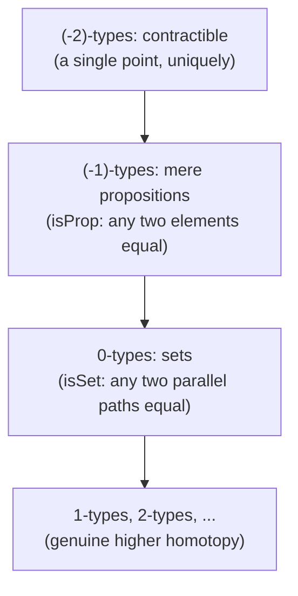

[[book-guidelines|↩ Back to guidelines]]

## What problem does this solve?

Suppose you're writing a compiler that needs to check a `requires`/`ensures` contract on a function — say, `sqrt(x: Nat) -> Nat requires x >= 0 ensures result * result <= x`. Somewhere in your toolchain you need to represent the *statement* `x >= 0` as data, generate a *proof obligation* for it, and eventually *check* that a candidate proof actually discharges that obligation. Classically you'd reach for two separate universes of objects: propositions (truth-valued formulas manipulated by a separate proof system) and terms (the actual program values, checked by the type system). That split is exactly why most verification toolchains need *two* trust boundaries — an SMT solver that reasons about propositions, glued via a fragile FFI to a type checker that reasons about terms.

Martin-Löf's insight, formalized here as propositions-as-types (also called the Curry-Howard correspondence), is that you don't need two universes. A proposition *is* a type. A proof of the proposition *is* a term (an element) of that type. Checking whether a proof is valid is the same act as type-checking a term. There is exactly one trust boundary: the type checker's kernel.

This is not a philosophical flourish — it is the architectural decision that makes Lean's kernel able to double as both a compiler's type checker and a proof assistant's proof checker. If you want to build the dependent/refinement-type compiler with an embedded prover described in your learning goals, §1.11 and Chapter 3 of this book are literally the specification of your term representation for logical formulas, and the mechanism by which "prove `P`" and "construct a term of type `P`" become the same operation.

## The core correspondence: connectives as type formers

The book builds this compositionally, reusing type formers already introduced in Chapter 1 (§§1.2–1.9): function types, products, coproducts, the empty and unit types. Nothing new is introduced at the type-theoretic level in §1.11 — what's new is the *reading*.

| English | Type theory |
|---|---|
| True | $\mathbf{1}$ |
| False | $\mathbf{0}$ |
| $A$ and $B$ | $A \times B$ |
| $A$ or $B$ | $A + B$ |
| If $A$ then $B$ | $A \to B$ |
| $A$ if and only if $B$ | $(A \to B) \times (B \to A)$ |
| Not $A$ | $A \to \mathbf{0}$, written $\neg A$ |

Why do these lines up? Because the *rules for using and constructing elements* of the type on the right match the *rules for reasoning about* the proposition on the left, one for one:

- To prove "$A$ and $B$" you prove $A$ and separately prove $B$. To build an element of $A \times B$ you supply a pair $(a, b)$ where $a : A$ and $b : B$. Same shape.
- To prove "if $A$ then $B$" you assume $A$ and derive $B$. To build an element of $A \to B$ you write an expression of type $B$ that may mention a free variable of type $A$. Same shape.
- Negation $\neg A :\equiv A \to \mathbf{0}$ makes "proof by contradiction of $\neg A$" — assume $A$, derive absurdity — a perfectly ordinary, *constructive* function $A \to \mathbf{0}$. What's disallowed constructively is the other direction: assuming $\neg A$ and deriving a contradiction to conclude $A$. That would require excluded middle, which is not a theorem of the base theory.

**[[Sets-in-Univalent-Foundations#What breaks without this|What breaks without this]] correspondence being exact:** if you tried to make "or" correspond to, say, a truncated/quotient type by default, you would lose the ability to do case analysis on a proof of "$A$ or $B$" and recover *which* disjunct held — see the coproduct type former's induction principle (`ind_{A+B}`, Chapter 1 §1.7): it eliminates into any family $C$, including one that depends on which injection was used. That case-splitting capability is precisely proof-relevance (more below), and it's why $A+B$, not some quotient of it, is the default "or."

### Worked example: a de Morgan law, term by term

The book gives a detailed derivation of "if not $A$ and not $B$, then not ($A$ or $B$)" — de Morgan's law — translating an English proof into a term, step by step (§1.11, eq. 1.11.1–1.11.2). The target type is
$$(A \to \mathbf{0}) \times (B \to \mathbf{0}) \to (A + B \to \mathbf{0}).$$
Walking the English proof "suppose not $A$ and not $B$; suppose $A$ or $B$; derive a contradiction; there are two cases..." mechanically produces:
$$f((x,y))(\mathrm{inl}(a)) :\equiv x(a) \qquad f((x,y))(\mathrm{inr}(b)) :\equiv y(b).$$
Notice what happened: "suppose ... and ..." became a pair-destructuring lambda; "there are two cases" became a case-split on the coproduct (equivalently, a call to $\mathrm{rec}_{A+B}$); "derive a contradiction" became literally applying a hypothesis-as-function to a witness. This is the general recipe: **an informal proof and a term-mode program are the same artifact**, described at different levels of verbosity. This is precisely the correspondence a bidirectional elaborator exploits — natural-language proof steps map onto elaboration actions (introduce a pair, introduce a lambda, eliminate a coproduct) exactly the way a `check`/`infer` pass maps surface syntax onto core terms.

The book also gives the crucial *negative* result, worth flagging because it foreshadows Chapter 3 entirely: "if not ($A$ and $B$), then (not $A$) or (not $B$)" — a classical de Morgan variant — is **not** provable, because it needs excluded middle. Constructive logic is a genuine restriction, not a notational variant of classical logic.

### Rust and Lean grounding

In Rust, the correspondence is almost literally how `enum`/`struct`/function types already behave — modulo Rust having no dependent types (yet), this is the "logic connectives are ADTs" idea familiar from functional programming, made precise:

```rust
// "True" -- the terminal proposition
struct True;

// "False" -- the uninhabited proposition; no constructors
enum False {}

// A and B
struct And<A, B>(A, B);

// A or B -- proof-relevant: you know which side holds
enum Or<A, B> { Inl(A), Inr(B) }

// not A -- a function from a witness of A to absurdity
type Not<A> = fn(A) -> False;

// If A then B
type Implies<A, B> = fn(A) -> B;

// case analysis on Or *recovers* which disjunct was proved --
// this is exactly the induction principle ind_{A+B}
fn demorgan<A, B>(not_a: Not<A>, not_b: Not<B>) -> Not<Or<A, B>> {
    move |ab: Or<A, B>| -> False {
        match ab {
            Or::Inl(a) => not_a(a),
            Or::Inr(b) => not_b(b),
        }
    }
}
```

This is a faithful (if non-dependent) shadow of the theory: `False` having zero variants *is* $\mathbf{0}$'s having no constructors; a `match` arm *is* an instance of the recursor `rec_{A+B}`. What Rust's `enum`/`fn` types cannot express is the *dependent* generalization — a family of types indexed by a term, which is exactly what $\Sigma$ and $\Pi$ add (next section).

In Lean, the correspondence is not an analogy — it *is* the mechanism. `Prop` in Lean's kernel is literally a universe whose types are propositions and whose terms are proofs; `And`, `Or`, `Not`, `Exists` are inductive types defined by ordinary `inductive` declarations, and Lean's kernel type-checks a proof term of `P` by the same `isDefEq`/whnf-reduction machinery it uses for any other term. The de Morgan proof above is, verbatim,
```lean
theorem demorgan {A B : Prop} (na : ¬A) (nb : ¬B) : ¬(A ∨ B) :=
  fun ab => match ab with
    | Or.inl a => na a
    | Or.inr b => nb b
```
Note this is *not* a special "tactic proof" — it's a plain term, checked by the same kernel machinery as any function definition. This is the load-bearing fact for a trusted-kernel architecture: your compiler's core type checker and your prover's proof checker can be the literal same code path, provided propositions are represented as types from the start.

## Quantifiers: $\Pi$ and $\Sigma$ as "for all" and "there exists"

The correspondence extends to predicate logic once we have *dependent* types (Chapter 1, §§1.4 and 1.6). A predicate on $A$ is represented as a type family $P : A \to \mathcal{U}$ — a function assigning to each $a : A$ the type of *evidence that $P$ holds of $a$*.

| English | Type theory |
|---|---|
| For all $x:A$, $P(x)$ holds | $\prod_{(x:A)} P(x)$ |
| There exists $x:A$ such that $P(x)$ | $\sum_{(x:A)} P(x)$ |

**Universal quantification as $\Pi$-types.** A dependent function $f : \prod_{(x:A)} P(x)$ takes an *arbitrary* $x : A$ and produces a witness of $P(x)$ — exactly the shape of a universally quantified proof: "for all $x$, here's how to prove $P(x)$, uniformly, without knowing which $x$ you'll get." Ordinary non-dependent function types $A \to B$ are the special case where the codomain doesn't vary — the "if...then" reading is really the constant-family case of "for all."

**Existential quantification as $\Sigma$-types.** A pair $(a, p) : \sum_{(x:A)} P(x)$ *is* a witness $a$ together with a proof $p : P(a)$ that the witness works. This is stronger than the classical existential — you don't just know a witness exists, you are handed one, explicitly, by the pair's first projection $\mathrm{pr}_1$. The book calls this **proof relevance**: a $\Sigma$-type proof of "there exists" *remembers* the specific witness, the same way a coproduct proof of "or" remembers which disjunct held.

**What breaks without dependency:** without type families $B : A \to \mathcal{U}$, you can only quantify over *fixed* propositions, i.e. you're stuck in propositional logic. The moment your refinement-type compiler needs to state "for all inputs $x$, if $x \geq 0$ then $\mathrm{sqrt}(x)^2 \leq x$" — a genuinely dependent statement, where the codomain proposition varies with $x$ — you need $\Pi$, full stop. This is the exact mechanism by which Hoare-style pre/postconditions get represented as types: a Hoare triple $\{P\}\ c\ \{Q\}$ for a *pure*, terminating `c` can be phrased as an inhabitant of $\prod_{(x : \mathrm{dom})} P(x) \to Q(x, c(x))$ — a dependent function from an input satisfying the precondition to a proof the output satisfies the postcondition.

### A concrete inequality, built from $\Sigma$

The book defines natural-number $\leq$ directly from these primitives (§1.11):
$$(n \leq m) :\equiv \sum_{(k:\mathbb{N})} (n + k = m).$$
A proof that $n \leq m$ is *not* an opaque bit — it's a pair of a witness $k$ and a proof that $n + k \equiv m$. This is the seed of the entire refinement-type idea in your learning goals: a refinement type $\{x : \mathbb{N} \mid P(x)\}$ is nothing but the type $\sum_{(x:\mathbb{N})} P(x)$, restricted (once we get to Chapter 3) to have $P$ be a mere proposition so that the pair doesn't carry spurious extra data beyond "$x$ satisfies $P$."

```rust
// "n <= m" as data: a witness k and a proof obligation n + k = m.
// In real Rust you can't state `n + k == m` as a *type*-level proof
// without something like typenum/const-generics tricks, but the
// shape is exactly a dependent pair (witness, evidence).
struct LeProof<const N: usize, const M: usize> {
    k: usize,
    // proof obligation: N + k == M (checked externally, e.g. by
    // your compiler's constraint solver -- this is where SMT/CHC
    // solving plugs into the elaborator)
}
```

```lean
-- Lean: literally a Σ-type (Exists / Subtype), checked by the kernel.
def LE' (n m : Nat) : Prop := ∃ k, n + k = m

example : LE' 2 5 := ⟨3, rfl⟩   -- the witness 3, plus a proof by computation
```

The Lean example is worth lingering on: `⟨3, rfl⟩` is a genuine anonymous-constructor pair, and `rfl` type-checks because `2 + 3` and `5` are *definitionally* equal — judgmental equality doing the proof work for free, with zero search. This is the cheapest possible proof-obligation discharge, and it's exactly the case your constraint solver wants to special-case before falling back to SMT.

### Higher-order logic, briefly

Because propositions are types living in some universe $\mathcal{U}_i$, you can quantify over *all* predicates on $A$ by forming $\prod_{P : A \to \mathcal{U}_i} P(a) \to P(b)$ — literally quantifying over propositions. The book flags one subtlety worth keeping in mind for an elaborator: this statement lives one universe level higher than the $P$'s being quantified over ($\mathcal{U}_{i+1}$, not $\mathcal{U}_i$), because $\prod_{P:A \to \mathcal{U}_i}$ ranges over a type built from $\mathcal{U}_i$. Universe polymorphism/cumulativity (Chapter 1, §1.3) exists precisely to keep this bookkeeping from becoming unbearable — the same bookkeeping your elaborator's metavariables will need to track for universe metavariables during unification.

## The crack: why proof-relevance breaks classical reasoning

Chapter 3 opens by showing the propositions-as-types story, exactly as told so far, is *inconsistent with univalence* if you also want classical excluded middle in its naive form. This is the central plot point of the whole book, and it's why "propositions as types" needed an appendix in Chapter 1 titled "Propositions as types?" in Chapter 3.

Theorem 3.2.2 (Hedberg-style diagonal argument): it is **not** the case that $\prod_{(A:\mathcal{U})} (\neg\neg A \to A)$ — the naive double-negation-elimination law, quantified over *all* types $A$, not just propositions. The proof exploits univalence directly: any function $f$ polymorphic in $A : \mathcal{U}$ must be *natural with respect to equivalences* (because univalence turns equivalences into paths, and every function respects paths — `ap`/transport). Applying this naturality to the non-trivial automorphism of the booleans $e : \mathbf{2} \simeq \mathbf{2}$ (swap true/false) forces $e(f(\mathbf{2})(u)) = f(\mathbf{2})(u)$ for any $u$ — i.e. $f$'s output would have to be a fixed point of the swap, but the swap has none. Contradiction. A direct corollary: $\prod_{(A:\mathcal{U})} (A + \neg A)$ — "untruncated LEM" — is equally inconsistent, and there is provably **no Hilbert-style global choice operator** picking an element out of every inhabited type, because such an operator could not be natural under univalence either.

**What this means for your elaborator/verifier:** if you're planning to add classical reasoning (e.g. LEM for decidability checks in your CHC solver) to a univalent kernel, you cannot bolt it onto arbitrary types — you must restrict it to a subclass of types for which the naturality obstruction vanishes. That subclass is exactly what Chapter 3 builds next.

## Mere propositions: the $(-1)$-truncated fix

**Definition 3.3.1.** A type $P$ is a **mere proposition** if
$$\mathrm{isProp}(P) :\equiv \prod_{(x,y:P)} (x = y).$$
In words: any two elements of $P$ are equal — inhabiting $P$ carries no information beyond the bare fact that it's inhabited. Compare $\mathbf{2}$ (two elements, genuinely different — a proof-relevant "or" needs this) against $\mathbf{1}$ (one element up to equality — a truth value needs only this). A mere proposition that's inhabited is equivalent to $\mathbf{1}$ (Lemma 3.3.2); the uninhabited case is (vacuously) also a mere proposition, corresponding to $\mathbf{0}$. Two logically equivalent mere propositions ($P \to Q$ and $Q \to P$) are automatically *equivalent as types* (Lemma 3.3.3) — this is the promise made back in §1.11 finally cashed in: for mere propositions, and only for mere propositions, "if and only if" and "equivalent" coincide.

Restated in the book's later terminology (Chapter 7): mere propositions are the $(-1)$-types, sets are the $0$-types (any two *paths* between the same two points are equal — Definition 3.1.1), and contractible types are the $(-2)$-types. This gives the bottom of the truncation-level ladder:



**Why the type formers matter here:** not every connective preserves mere-proposition-ness. $\Pi$, $\to$, and $\neg$ *do* preserve it (Example 3.6.2: if each $B(x)$ is a mere proposition, so is $\prod_{(x:A)} B(x)$, by function extensionality) — "for all," "implies," and "not" behave classically for free. But $+$ and unrestricted $\Sigma$ do **not**: even if $A$ and $B$ are mere propositions, $A + B$ generally isn't ($\mathbf{1} + \mathbf{1} = \mathbf{2}$ is the standard counterexample) — because a witness of $A + B$ still remembers *which side* held, which is exactly the extra bit "or" is supposed to discard when read classically.

### Propositional truncation: forcibly discarding the witness

To get a classical "or" and "there exists" back, the book introduces **propositional truncation** $\|A\|$ (§3.7) — a higher-inductive-flavored type former with two constructors:
- $|a| : \|A\|$ for any $a : A$ (inhabited $A$ gives inhabited $\|A\|$), and
- for any $x, y : \|A\|$, a path $x = y$ (this *forces* $\|A\|$ to be a mere proposition by fiat).

Its recursion principle: any map $A \to B$ into a mere proposition $B$ factors uniquely through $\|A\|$. This is a genuine universal property — $\|-\|$ is the free mere-proposition-reflection of $A$, i.e. exactly a *left adjoint into the subcategory of $(-1)$-types* (foreshadowing the "modalities" and "reflective subuniverses" of Chapter 7). With truncation in hand, the book redefines the classical connectives (Definition 3.7.1):
$$P \vee Q :\equiv \|P + Q\|, \qquad \exists (x:A).\, P(x) :\equiv \Big\| \sum_{(x:A)} P(x) \Big\|.$$
Now $\mathrm{LEM}$ can be stated *correctly*, quantifying only over mere propositions, escaping Theorem 3.2.2's obstruction entirely:
$$\mathrm{LEM} :\equiv \prod_{(A:\mathcal{U})} \big(\mathrm{isProp}(A) \to (A + \neg A)\big).$$
This is now *consistent* to assume as an axiom (unlike the untruncated $\mathrm{LEM}_\infty$), because the naturality argument that killed Theorem 3.2.2 specifically exploited a non-proposition ($\mathbf{2}$) as a counterexample — mere propositions have no non-trivial automorphisms to violate naturality with.

### The principle of unique choice — the piece your elaborator actually needs

This is arguably the single most practically important lemma in the chapter for a metaprogramming elaborator. **Corollary 3.9.2:** if $P : A \to \mathcal{U}$ is a family of mere propositions and you know $\|P(x)\|$ (merely, i.e. non-constructively) for every $x$, then you actually have $\prod_{(x:A)} P(x)$ — the truncation is *free to remove* precisely because $P(x)$ being a mere proposition means there's nothing left to lose by forgetting how you proved it. This is the formal justification for a very common elaborator move: *"I know a solution to this unification/constraint problem exists (e.g. because the algorithm terminated and said SAT); since the specification I'm satisfying is subsingleton-valued (there's at most one metavariable assignment satisfying these rigid constraints — this is exactly the Miller pattern-unification tractability guarantee), I can just take the found solution without further justification."* Concretely: pattern unification's uniqueness theorem is a special case of "unique choice" — the type of most-general unifiers for a Miller pattern equation is a mere proposition (subsingleton), so *finding* an answer and *proving* an answer are the same act, with no bookkeeping loss.

### The axiom of choice, both ways

The book gives two versions worth contrasting sharply (this is exactly the "book's own formalism doing unification's/choice's job without naming it" thread from the learning goals):

- **Untruncated ("type-theoretic") axiom of choice**, §1.6 eq. (1.6's `ac`): $\prod_{(x:A)}\sum_{(y:B)} R(x,y) \to \sum_{(f:A\to B)}\prod_{(x:A)} R(x,f(x))$ is a *theorem*, provable with zero axioms, by literally projecting the two components out of the hypothesis pointwise. "No choice is actually involved... all we have to do is take it apart."
- **Truncated (classical-shaped) axiom of choice**, §3.8: $\prod_{(x:X)}\big\|\sum_{(a:A(x))} P(x,a)\big\| \to \big\|\sum_{(g:\prod_{x} A(x))}\prod_{(x:X)} P(x,g(x))\big\|$ requires $X$ and each $A(x)$ to be *sets*, and is **not** a theorem — it must be assumed as an axiom, exactly matching the classical status of AC.

The gap between these two is precisely the gap that propositional truncation measures: once you discard the witnesses (by truncating the hypothesis), reconstructing a single global choice function is no longer free — it's an extra axiomatic commitment, and Diaconescu's theorem (referenced forward to Chapter 10) shows this truncated AC actually implies LEM. If your compiler's elaborator ever needs "some solution to this constraint system exists" to imply "here is a specific solution," check whether you're implicitly invoking a truncated-choice-shaped axiom — that's exactly the kind of non-constructive step a trusted kernel should either avoid or flag as an explicit assumption.

## Where this leads

Structurally, this topic is the hinge between Chapter 1's syntax (types, $\Pi$, $\Sigma$, coproducts — pure term formers with no logical content assumed) and Chapter 2's homotopy interpretation (identity types as paths). Chapter 3 revisits propositions-as-types specifically *because* Chapter 2's univalence axiom breaks the naive version — you cannot understand why HoTT needs "mere propositions" at all without first seeing exactly what propositions-as-types promised and exactly where that promise overreaches. Downstream, the $(-1)$-truncation introduced here is the base case of the full $n$-truncation hierarchy in Chapter 7 (recursively: $(n+1)$-types are types whose identity types are $n$-types), which in turn is the load-bearing machinery for the orthogonal factorization systems, connectedness, and modalities used throughout the [[Synthetic-Homotopy-Theory|synthetic homotopy theory]] of Chapter 8 and the set-theoretic and category-theoretic reconstructions of Chapters 9–10.

For the compiler/elaborator project specifically: this chapter is the formal contract for representing logical formulas as types, proof search as term construction, and the crucial fact that *not every logically-shaped statement should carry data* — refinement-type predicates, verification conditions, and Hoare-style contracts should almost always be built from mere propositions (or their truncations), while the *witnesses* your constraint solver produces (unifiers, invariants, interpolants) live in the proof-relevant, untruncated $\Sigma$-world where you actually want to keep the data around. Knowing which regime a given piece of your type checker's output belongs to — proof-relevant term or subsingleton proposition — is exactly [[Type-Theory-as-a-Foundational-System-Qwen#The distinction|the distinction]] this topic exists to make precise.
