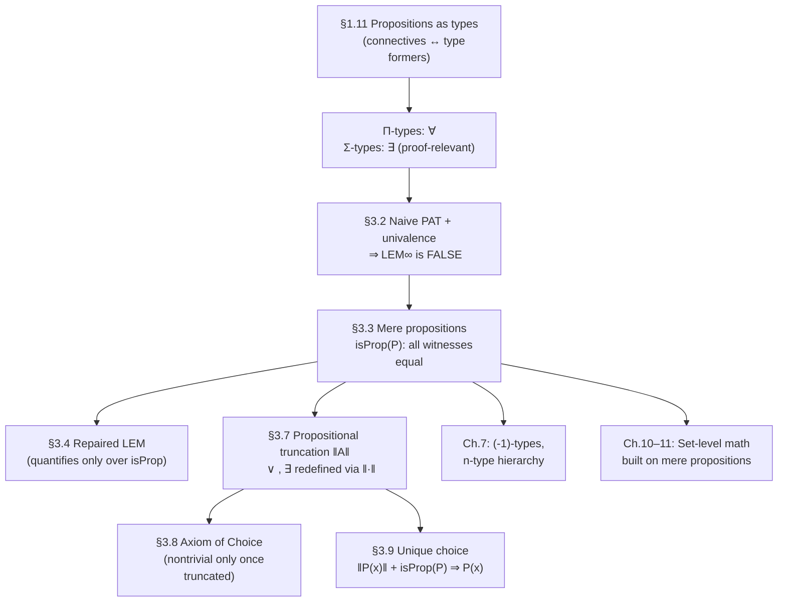

# The Propositions as Types Correspondence

[[book-guidelines|↩ Back to guidelines]]

## What problem does this solve?

Suppose you're building a type checker, and someone asks you: "does this checker also do logic?" In set-theoretic mathematics the answer is architecturally awkward — sets and propositions are two different kinds of thing. A set is a bag of elements; a proposition is a statement that's either true or false, and its "proof" is a certificate that lives outside the mathematical universe of sets, in the metatheory. You can't put a proof *inside* a set the way you put a number inside it.

Type theory refuses that split. It has exactly one basic notion — the type — and the central move of this topic is to notice that "proposition" and "type" can be made to *coincide*. To prove a proposition is to construct an element of the type that represents it. This isn't an analogy or a trick encoding; it's the same judgment form (`a : A`) doing double duty as "$a$ is a value of type $A$" and "$a$ is a proof of proposition $A$." The book calls this **propositions as types**, and it's the reason a dependently-typed language can be, simultaneously, a programming language and a proof assistant — which is exactly the architectural fact your Rust verifier and Lean-style elaborator both lean on. When you write `isDefEq` or a typing judgment `Γ ⊢ e : A`, you are, whether you intend to or not, already doing logic — this correspondence is *why* that's true rather than a coincidence.

But (and this is the twist the book spends all of Chapter 3 on) the naive version of this idea has a serious defect once you add the [[Formal-Metatheory#Univalence|univalence]] axiom: it makes classical logic inconsistent. Understanding *why*, and how the book repairs it with mere propositions and truncation, is the second half of this topic and arguably the more load-bearing half for anything you build as a checker.

---

## Part 1: Connectives as type constructors (§1.11)

### The dictionary

The book's core observation: the *rules* for building and using an element of a type mirror the *rules* for proving and using a proposition, connective by connective.

| English | Type theory |
|---|---|
| True | $\mathbf{1}$ |
| False | $\mathbf{0}$ |
| $A$ and $B$ | $A \times B$ |
| $A$ or $B$ | $A + B$ |
| If $A$ then $B$ | $A \to B$ |
| $A$ iff $B$ | $(A \to B) \times (B \to A)$ |
| Not $A$ | $A \to \mathbf{0}$, written $\neg A$ |

This isn't a table you memorize; it falls out of matching introduction/elimination rules. "The basic way to prove $A \text{ and } B$ is to prove $A$ and prove $B$" is *literally* the pairing constructor of $A \times B$: you supply an $a : A$ and a $b : B$ and get $(a,b) : A \times B$. "The basic way to prove $A \to B$" — assume $A$, derive $B$ — is a $\lambda$-abstraction: an expression for an element of $B$ that may mention an unspecified variable of type $A$. Modus ponens is function application.

**What breaks without this reading of $\neg$:** negation is defined as $\neg A :\equiv A \to \mathbf{0}$ — a function from $A$ to the empty type. A witness of $\neg A$ is therefore literally a *procedure* that, given a supposed proof of $A$, manufactures an absurdity. This licenses ordinary proof by contradiction *for proving negations* (assume $A$, derive $\bot$, conclude $\neg A$ — this is just how you construct a function into $\mathbf{0}$), but it does **not** license classical proof by contradiction for proving positive statements (assume $\neg A$, derive $\bot$, conclude $A$). That second move needs $\neg\neg A \to A$, and nothing in the constructors above gives you that — you only ever get $\neg\neg\neg A \to \neg A$ for free (negations always "cancel in threes," never in twos). This asymmetry is where constructive logic actually bites, and it's worth sitting with, because it's the exact asymmetry a bidirectional proof search needs to respect: refutation-by-construction is cheap, existence-by-double-negation is not.

**A worked translation.** The book walks through translating the English proof of a De Morgan law, "if not $A$ and not $B$, then not ($A$ or $B$)," into an inhabitant of
$$(A \to \mathbf{0}) \times (B \to \mathbf{0}) \to (A + B \to \mathbf{0})$$
step by step: "suppose not $A$ and not $B$" introduces variables $x : A \to \mathbf 0$, $y : B \to \mathbf 0$ via the product's recursor; "suppose $A$ or $B$" introduces $z : A + B$; "there are two cases" is a case split (the recursor for $+$); each case closes by applying the corresponding hypothesis. The point of walking through this mechanically is that it's exactly what a proof-term elaborator does when it turns tactic-style or prose-style reasoning into a checkable term — every "suppose," "there are two cases," and "therefore" corresponds one-to-one to an elimination or introduction rule.

The converse-shaped classical law, "if not $(A \text{ and } B)$ then not $A$ or not $B$," is **not** provable — you cannot build an element of $((A \times B) \to \mathbf 0) \to (A \to \mathbf 0) + (B \to \mathbf 0)$ in general. Deciding which disjunct holds requires information the hypothesis doesn't give you a constructive way to extract.

### Grounding: connectives as types you already have

**Rust.** Every connective above is a familiar Rust type — this is not a loose analogy, it's the same algebra of types that underlies `enum`/`struct` in any ML-family type system:

```rust
// A ∧ B  — a proof is a pair of proofs
struct And<A, B>(A, B);

// A ∨ B  — a proof remembers *which* disjunct, and its proof
enum Or<A, B> { Left(A), Right(B) }

// A → B  — a proof is a procedure turning proofs of A into proofs of B
type Implies<A, B> = fn(A) -> B; // morally; real HOAS needs closures/traits

// ¬A ≡ A → 0 — a proof of not-A is a function into the uninhabited type
enum False {}                    // no constructors: an uninhabited type
type Not<A> = fn(A) -> False;
```

`False` having zero variants is exactly $\mathbf{0}$ having no constructors — the type system, not a runtime check, is what makes it impossible to produce a value of it, mirroring "there is no basic way to prove a contradiction" in the book (footnote 9). A `fn(A) -> False` is, structurally, a refutation: feed it any purported evidence of `A` and it can't return, because there's nowhere for it to return *to*. This is the same shape as a Rust `Result<T, !>` collapsing to just `T`, and it's the shape you want if your verifier represents "this Hoare precondition is unsatisfiable" as an uninhabited witness type rather than a boolean flag — an uninhabited type composes through the rest of the type checker for free, a boolean doesn't.

**Lean.** Lean's `Prop`-and-`Type` design *is* this correspondence made literal in a real kernel:

```lean
-- these are definitions, not new machinery — logic is data
def And' (A B : Prop) : Prop := A ∧ B  -- built from a one-constructor structure
def Or'  (A B : Prop) : Prop := A ∨ B  -- built from a two-constructor inductive
def Not' (A : Prop) : Prop := A → False

theorem demorgan (A B : Prop) : ¬A → ¬B → ¬(A ∨ B) :=
  fun na nb ab => Or.elim ab na nb
```

`Or.elim` here is precisely the case-split the book performs by hand with the coproduct recursor. When you later build pattern unification or bidirectional checking, this is the register you're already in: `Prop` in Lean is a genuine type universe, and proof terms are genuine terms subject to the same `isDefEq`/reduction machinery as any other term — there's no separate "proof language."

---

## Part 2: Quantifiers as dependent types (§1.11)

Once you allow types to depend on values — a predicate $P : A \to \mathcal U$ assigning to each $a : A$ a type $P(a)$ standing for "the proposition that $P$ holds of $a$" — the connective table extends to quantifiers:

| English | Type theory |
|---|---|
| For all $x:A$, $P(x)$ holds | $\prod_{(x:A)} P(x)$ |
| There exists $x:A$ such that $P(x)$ | $\sum_{(x:A)} P(x)$ |

### Universal quantification as $\Pi$-types

A $\Pi$-type $\prod_{(x:A)} P(x)$ is the dependent function type: a function that, given any $x:A$, returns a proof of $P(x)$ specifically (not some fixed type — the *return type itself depends on the input*). That dependency is exactly what "for all" needs: to prove $\forall x, P(x)$ you must produce, uniformly, a proof that works for an *arbitrary* $x$, which is precisely what a function with domain $A$ gives you. When $P$ is a constant family, $\prod_{(x:A)} P(x)$ degenerates to the ordinary non-dependent $A \to P$, which is why the book already introduced $\Pi$-types in §1.4 as the generalization of function types before this section names them as universal quantification.

The book proves a small tautology this way — "if $\forall x, P(x) \land Q(x)$ then $(\forall x, P(x)) \land (\forall x, Q(x))$" — by literally constructing the term step by step from the English proof:
$$f(p) :\equiv \Big(\lambda x.\, \mathsf{pr}_1(p(x)),\ \lambda x.\, \mathsf{pr}_2(p(x))\Big)$$
Note how "we suppose given $x$" becomes a $\lambda$, and "hence we have $P(x)$" (from "$P(x)$ and $Q(x)$") becomes a projection — the English proof and the term are in lockstep, which is the whole point of propositions-as-types: informal mathematical prose is *already* an untyped sketch of a proof term, and elaboration is the process of filling in the sketch.

### Existential quantification as $\Sigma$-types

A $\Sigma$-type $\sum_{(x:A)} P(x)$ is the dependent pair type: a pair $(x, p)$ where $x : A$ and $p : P(x)$. This matches "there exists" precisely because to prove existence you must actually *exhibit* a witness $x$ together with evidence $P(x)$ — you cannot construct an inhabitant of $\sum_{(x:A)}P(x)$ without picking a specific $x$. This is **proof-relevant** existence: the proof doesn't just certify that some $x$ works, it *contains* which $x$ works, retrievable via $\mathsf{pr}_1$.

The book gives a genuinely useful worked example: numeric inequality is defined existentially,
$$(n \leq m) :\equiv \sum_{k:\mathbb N} (n + k = m),$$
i.e., $n \le m$ *is*, as a type, the type of witnesses $k$ together with a proof that $n+k=m$. This single definition later supports two different readings of $\Sigma$ that the book flags as recurring: as "there exists," and (§3.5, revisited below) as a **subtype** — $\sum_{(x:A)} P(x)$ can equally be read as "the type of all $x:A$ such that $P(x)$," i.e. $\{x : A \mid P(x)\}$. This dual reading is also how the book defines algebraic structure as data: a semigroup is
$$\mathsf{Semigroup} :\equiv \sum_{A:\mathcal U} \sum_{m : A \to A \to A} \prod_{x,y,z:A} m(x,m(y,z)) = m(m(x,y),z),$$
nesting $\Sigma$ (carrier, then operation) around a $\Pi$ (the associativity axiom, universally quantified) — "existence of structure satisfying a law" is exactly $\Sigma$-then-$\Pi$, all the way down. This is the shape every dependent-record / refinement-type encoding of a Hoare-style contract takes: a $\Sigma$ packaging the data together with a $\Pi$-quantified proof obligation over it.

### Grounding: quantifiers as generics and refinements

**Rust — the closest fit, and where it strains.** $\Pi$-types over a *type-level* domain are what Rust generics/traits already give you (a `fn<T: Trait>(x: T) -> P<T>` is morally $\prod_{(T:\mathcal U)} P(T)$), but $\Sigma$-types resist a clean encoding because Rust has no first-class dependent pairing where the *type* of the second component depends on the *value* of the first:

```rust
// Π-type: a proof-producing function, uniform in x — an ordinary generic fn
fn all_nonneg<T: Ord + Zero>(x: T) -> ProofNonNeg<T> { /* ... */ }

// Σ-type, encoded as a trait-object-style existential — you get "there exists
// some witness," but the connection between the witness's *value* and the
// proof's *type* has to be smuggled through a phantom or an associated const;
// Rust's type system stops depending on runtime values here.
struct LessEq<const N: usize, const M: usize> {
    k: usize,          // witness: morally the Σ's first projection
    _proof: PhantomData<()>, // stands in for "N + k = M", unchecked by rustc
}
```
This gap — Rust generics model $\Pi$ over *types* cleanly but can't model $\Sigma$ over *values* with a value-dependent proof obligation — is precisely the gap a Hoare-triple verifier has to close by hand (typically by carrying proof obligations as a side condition discharged by an SMT solver rather than as a genuinely dependent pair in the host type system).

**Lean — the honest encoding.** Lean has real $\Pi$- and $\Sigma$-types (the latter as the inductive type `Sigma`, or `Exists` for the `Prop`-valued mere-existence version — a distinction that matters, see Part 3):

```lean
-- Π-type: ∀ x : A, P x  — literally Lean's dependent function type
theorem all_holds (A : Type) (P : A → Prop) (f : ∀ x, P x) : ∀ x, P x := f

-- Σ-type, proof-relevant existence, witness retrievable:
def LessEq (n m : Nat) : Type := Σ k : Nat, n + k = m

-- Exists — the Prop-valued, truncated cousin (Part 3): you get *that* a
-- witness exists, but Prop's proof-irrelevance means you can't project it out.
def LessEq' (n m : Nat) : Prop := ∃ k : Nat, n + k = m
```
`Sigma` vs `Exists` in Lean *is* the untruncated-vs-truncated $\exists$ distinction the book spends §3.10 on, made into two different, both-real Lean types rather than a philosophical aside — seeing them side by side here previews exactly the machinery of Part 3.

---

## Part 3: The crack — why untruncated propositions-as-types breaks under univalence (§3.2)

Here's where the "one basic notion" idea runs into trouble. If propositions are just types, and univalence identifies equal types with equivalent ones, then a type like $\mathbf 2$ (booleans) is a perfectly good "proposition" under the naive reading — and $\mathbf 2$ has a nontrivial automorphism ($e$ swapping $0_{\mathbf 2}$ and $1_{\mathbf 2}$). The book proves (Theorem 3.2.2) that assuming univalence, it is **not** the case that $\neg\neg A \to A$ holds for *all* types $A$ — and hence, by extension (Corollary 3.2.7), the untruncated law of excluded middle $\mathrm{LEM}_\infty :\equiv \prod_{A:\mathcal U}(A + \neg A)$ also fails.

**The proof idea, compressed:** if $f : \prod_{A}(\neg\neg A \to A)$ existed, univalence would force $f$ to be *natural* with respect to type equivalences (functions in type theory are automatically "continuous"/functorial in this sense). Applying $f$ at $A = \mathbf 2$ and transporting along the path $p := \mathsf{ua}(e)$ induced by the swap equivalence $e$ forces $e(f(\mathbf 2)(u)) = f(\mathbf 2)(u)$ for the relevant $u$ — i.e., $f(\mathbf 2)(u)$ would have to be a *fixed point* of $e$. But $e$ swaps the two elements of $\mathbf 2$ and has none. Contradiction.

**What breaks:** naturality under univalence is incompatible with any operation that would need to secretly "look inside" a type and pick out a specific element based on more than its equivalence class — a Hilbert-style global choice operator, essentially. LEM as literally "$A$ or not-$A$, for every type $A$" asks for exactly that kind of operator, so it has to go. This is not a defect to route around quietly — it's the book's proof that naive Curry–Howard and univalence are jointly inconsistent, and the fix (mere propositions) is designed specifically to route around it without discarding either.

## Part 4: The fix — mere propositions and truncation (§§3.3–3.10)

### Mere propositions: types with no extra information

**Definition 3.3.1.** A type $P$ is a **mere proposition** if $\mathrm{isProp}(P) :\equiv \prod_{x,y:P}(x=y)$ — any two elements are equal. Concretely: knowing $P$ is inhabited is *all* the information a witness of $P$ carries; there's no "which witness" question left to ask, because all witnesses coincide. $\mathbf 1$ is a mere proposition (any two elements are trivially equal); $\mathbf 2$ is not (its two elements are visibly distinct, and that distinctness is exactly the extra bit of information that made the $\Pi$/naturality argument above go through).

Key consequences the book establishes:
- **Lemma 3.3.2/3.3.3**: mere propositions that are logically equivalent ($P \to Q$ and $Q \to P$) are *equivalent as types* — for mere propositions, "iff" really does collapse onto "$=$," matching classical intuition, in a way it provocatively does *not* for general types.
- **Lemma 3.3.4**: every mere proposition is a set (i.e., a $0$-type — no nontrivial higher paths either). Mere propositions sit at the very bottom of the $n$-type hierarchy the book calls out in §3.1: $(-1)$-types.
- **Lemma 3.3.5**: $\mathrm{isProp}(A)$ and $\mathrm{isSet}(A)$ are themselves always mere propositions — "being a proposition" is *itself* proposition-like, so there's no infinite regress of needing to prove uniqueness-of-uniqueness-proofs.

### The repaired LEM

With mere propositions in hand, the book restates excluded middle so it only quantifies over things that behave like classical truth values:
$$\mathrm{LEM} :\equiv \prod_{A:\mathcal U} \big(\mathrm{isProp}(A) \to (A + \neg A)\big)$$
This sidesteps Theorem 3.2.2 because $\mathbf 2$ — the counterexample — is not a mere proposition, so it's simply not in LEM's domain of quantification anymore. $\mathrm{LEM}$ (unlike $\mathrm{LEM}_\infty$) is consistent to assume as an axiom, though not provable from the base theory. Types satisfying $A + \neg A$ are called **decidable** (Definition 3.4.3) — and "$A$ has decidable equality" ($\forall a,b, (a=b)+\neg(a=b)$) is the formal name for exactly the property a type checker's equality test needs to hold judgmental/definitional equality decidable in practice.

### Propositional truncation: forcing proof-irrelevance where you want it

Not every type is naturally a mere proposition, but you often *want* the "or"/"exists" you're using to behave like one (e.g., to state LEM or AC, or simply because you don't care which witness was found). The book introduces **propositional truncation** $\|A\|$ — also called $(-1)$-truncation, the bracket type, or squash type — as a new type former with two constructors:
- $|a| : \|A\|$ for any $a : A$ (inhabited-ness transfers in),
- for any $x, y : \|A\|$, a path $x = y$ (forced to be a mere proposition by fiat).

Its recursion principle: to map $\|A\| \to B$ you need $B$ to be a mere proposition and a plain function $A \to B$; the truncation then "doesn't remember" *which* $a$ you used. This gives truncated logical notation, restated in Definition 3.7.1 using the untruncated connectives from Parts 1–2 as raw material:
$$P \lor Q :\equiv \|P + Q\|, \qquad \exists(x:A).\,P(x) :\equiv \Big\|\sum_{x:A} P(x)\Big\|$$
— truncated "or" and truncated "exists" are just the untruncated $+$ and $\Sigma$ with the witness deliberately erased.

**Why you'd ever want to throw information away:** the book's own framing (§3.10) is refreshingly non-dogmatic — untruncated logic is often *closer* to how mathematicians actually reason informally ("the $x$ constructed in Theorem Y," referred back to later by its specific construction), so the book adopts **untruncated logic as the default** and uses the adverb *merely* to mark truncation explicitly ("there merely exists an $x$..."). Truncation becomes essential specifically when you need a genuine truth-valued statement — LEM, or the Axiom of Choice, whose formulation (§3.8) truncates in *both* the hypothesis (witnesses per $x$ aren't specified) and the conclusion (the choice function itself isn't determined):
$$\mathrm{AC} :\equiv \forall(x:X).\ \exists(a:A(x)).\, P(x,a)\ \Rightarrow\ \exists\Big(g:\prod_{x:X}A(x)\Big).\ \forall(x:X).\, P(x,g(x))$$
Contrast this with the *untruncated* reading, which the book showed back in §1.11/§2.15 is *trivially true* by projections — "axiom of choice" isn't an axiom at all under untruncated propositions-as-types, it's a tautology, because $\Sigma$ already packages the choice function. AC only becomes a genuine, non-trivial, sometimes-unprovable axiom once you truncate — which is a sharp illustration of how much logical content the choice between truncated and untruncated readings actually carries.

**The principle of unique choice** (Corollary 3.9.2) is the load-bearing bridge back the other way: if $P(x)$ is a mere proposition for every $x$ and $\|P(x)\|$ holds for every $x$, then $\prod_{(x:A)} P(x)$ holds outright — you can "un-truncate" for free whenever the target was already proof-irrelevant. This is exactly the principle that lets a checker say "I only know a solution *merely* exists (e.g. from an SMT solver's SAT answer), but since 'is this the right typing derivation' is itself proof-irrelevant, I can treat it as if I'd found the derivation directly."

### Grounding: proof-irrelevance as a language feature you already half-have

**Lean — the closest real-world analogue.** `Prop` in Lean *is* the mere-propositions universe: Lean enforces **proof irrelevance** for `Prop` by definitional equality — any two proofs of the same `Prop` are treated as definitionally equal by the kernel, exactly mirroring $\mathrm{isProp}$:

```lean
-- Prop-valued: proof irrelevant by the kernel's own rules — you cannot
-- pattern-match on *which* proof of h1 vs h2 you were handed to get
-- different data out, only Type-valued matches can branch on content.
example (P : Prop) (h1 h2 : P) : h1 = h2 := rfl   -- proof irrelevance, for free

-- Exists (∃) is Prop-valued and truncated: you can prove Exists but
-- Exists.elim only lets you extract a witness to build another Prop,
-- never to build ordinary Type-valued data — this IS the recursion
-- principle of ‖A‖ restricted to mere-proposition codomains.
theorem exists_pair : ∃ n : Nat, n + 1 = 2 := ⟨1, rfl⟩
-- versus Sigma, which is Type-valued and untruncated: you CAN project
-- the witness back out to build further data.
def sigma_pair : Σ n : Nat, n + 1 = 2 := ⟨1, rfl⟩
#eval sigma_pair.1   -- 1 — the witness survives; try that with Exists.elim
                      -- into a Type-valued result and Lean will refuse.
```
This `Exists`/`Sigma` split, and the kernel-level proof irrelevance of `Prop`, is Lean *implementing* exactly the §3.7–3.9 distinction the book develops abstractly. If you're modeling your elaborator's unifier on Lean's, this is precisely the invariant `isDefEq` gets to lean on for free when comparing two proof terms of the same `Prop`: it doesn't need to check they're syntactically equal, or even reduce them to normal form and compare — proof-irrelevance means *any* two proofs of the same proposition are automatically interchangeable, which is a real performance and simplicity win a proof-relevant unifier doesn't get.

**Rust.** Rust has no built-in proof-irrelevance, but the *pattern* shows up as "erase-the-witness" APIs — `bool` is the truncated cousin of an enum that remembers *why*:

```rust
// Untruncated: an enum that remembers *which* branch and *why* — Σ-flavored
enum Justified<E> { Yes(E), No(E) }

// Truncated: information deliberately thrown away — this IS ∥Justified<E>∥
// projected down to a bare bool, the same move as P ∨ Q :≡ ‖P + Q‖
fn erase<E>(j: Justified<E>) -> bool {
    matches!(j, Justified::Yes(_))
}
```
A verifier deciding whether to keep proof terms around (untruncated — useful for producing certificates/explanations) or discard them once a check passes (truncated — smaller, faster, but no longer explains *why*) is making exactly this book's §3.10 default-convention choice, just at the systems-design level instead of the type-theoretic one.

---

## Where this leads



Within the book, this topic is the hinge between Chapter 1's syntax and Chapter 3's logic: everything in Chapter 1 (connectives, $\Pi$, $\Sigma$) is *reused verbatim* as the raw material Chapter 3 refines — mere propositions and truncation don't introduce new connectives, they add a discipline on top of the ones you already have. Downstream, the $(-1)$-type ($=$ mere proposition) becomes the base case of the full $n$-type hierarchy in Chapter 7, and virtually all of the "ordinary mathematics" chapters (10: Set Theory, 11: Real Numbers) are built on sets and mere propositions specifically because that's where classical-feeling reasoning (LEM, decidability, subtypes via $\{x \mid P(x)\}$) is safe to use without contradicting univalence.

For your own projects, this is close to as load-bearing as a topic gets. The $\Pi$/$\Sigma$-as-quantifiers reading *is* the judgment-form vocabulary your Rust checker's typing rules and Hoare-triple contracts will be built from — $\Sigma$-then-$\Pi$ nesting (data, then a proof obligation about it) is the literal shape of a refinement type. And the mere-propositions/truncation machinery is the theoretical justification for Lean's `Prop` and its proof irrelevance, which is precisely the shortcut your elaborator's `isDefEq` will want to take whenever it's comparing two proof terms rather than two pieces of data: don't unify them structurally, just check they inhabit the same `Prop` and move on. Getting this distinction right early — which of your obligations are genuinely proof-relevant (need their witness kept) versus merely need to be discharged once (safe to truncate) — will shape a lot of downstream design decisions about what your IR even needs to carry around at runtime.
