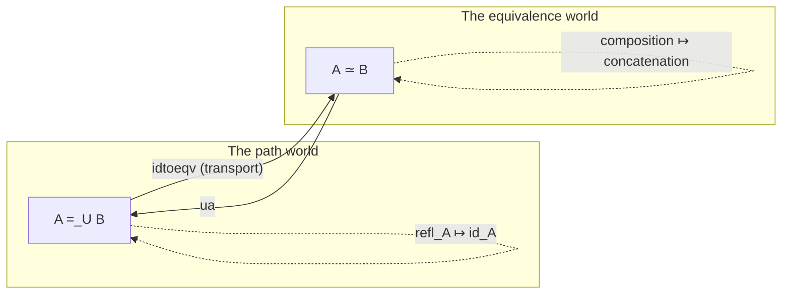

# The [[Formal-Metatheory#Univalence|Univalence]] Axiom and Its Consequences

[[book-guidelines|↩ Back to guidelines]]

## The problem this solves: equal types that refuse to be equal

By §2.9 the book has already worked out, type former by type former, what the identity type $x =_A y$ looks like when $A$ is a product, a $\Sigma$-type, a coproduct, $\mathbb{N}$ — see [[Type-Formers-and-Their-Universal-Properties]] and [[Identity-Types-and-Path-Structure]] for that machinery. Every one of those characterizations came for free from path induction on the *elements*. But there's one type the book has been building all along and conspicuously not characterizing: the universe $\mathcal{U}$ itself. Given two types $A, B : \mathcal{U}$, what does a path $A =_{\mathcal{U}} B$ look like?

You already know, informally, what *should* count as evidence that two types are "the same": a bijection. $\mathbb{N}$ and the type of binary strings are "the same" in every way that matters to a working mathematician or programmer, because you can convert losslessly back and forth. Rust's own type system half-agrees with this intuition — a `Vec<T>` sorted ascending and a `BinaryHeap<T>` are "the same information" wearing different invariants, and you'd happily write a function `Vec<T> -> BinaryHeap<T>` and back without a second thought. But nothing in bare type theory (Chapter 1's rules, or even the higher-groupoid structure from §§2.1-2.8) tells you that a bijection $A \simeq B$ (defined in §2.4, recapped below) gives you a *path* $A =_{\mathcal{U}} B$. Path induction only lets you build paths by reflexivity; it says nothing about how to manufacture new paths between types that merely happen to be interchangeable.

**What breaks without this move.** Without some axiom bridging equivalence and identity, every theorem you prove about a specific type $A$ would need to be reproved from scratch for every type $B \simeq A$, even though $B$ is, for all practical purposes, a repackaging of $A$. This is exactly the pain point every working mathematician papers over with "WLOG" or "identify $A$ with $B$" — an informal abuse of notation that set theory never actually justifies (in ZFC, isomorphic sets are still *different sets*, just ones a theorem happens to be indifferent to). Voevodsky's **univalence axiom** is the formal license to stop apologizing for this move: it says the type $A =_{\mathcal{U}} B$ *is* (equivalent to) the type of equivalences $A \simeq B$. Identity of types and interchangeability of types become, literally, the same thing.

## Prerequisite: what an equivalence is, quickly

Chapter 2 (§2.4) defines a **homotopy** between functions $f, g : \prod_{x:A} P(x)$ as $f \sim g :\equiv \prod_{x:A} f(x) = g(x)$ — pointwise equality, one level down from equality of functions themselves. A **quasi-inverse** of $f : A \to B$ is
$$\mathrm{qinv}(f) :\equiv \sum_{g:B\to A} (f \circ g \sim \mathrm{id}_B) \times (g \circ f \sim \mathrm{id}_A),$$
and $A \simeq B :\equiv \sum_{f:A\to B} \mathrm{isequiv}(f)$, where $\mathrm{isequiv}(f)$ is *some* well-behaved refinement of "$f$ has a quasi-inverse" — the book flags in Remark 2.10.4 that this refinement matters a great deal here, and devotes all of Chapter 4 to nailing it down precisely (see the sibling topic on equivalence characterizations). For this article, treat $\mathrm{isequiv}(f)$ as a black box with the property that it's a mere proposition (at most one proof, up to the notion of "at most one" the book makes precise later) and is logically equivalent to having a quasi-inverse. That's the only fact univalence's statement needs.

## Building the bridge: `idtoeqv`

The book doesn't postulate the identification $(A =_{\mathcal{U}} B) \simeq (A \simeq B)$ out of nowhere — first it constructs a canonical, *unconditional* function in one direction, using nothing but path induction, and only afterward asserts as an axiom that this function is an equivalence.

Recall from §2.3 that any type family $P : X \to \mathcal{U}$ gives you transport $p_* : P(x) \to P(y)$ along $p : x =_X y$. Now instantiate $X :\equiv \mathcal{U}$ and $P :\equiv \mathrm{id}_{\mathcal{U}}$ — the identity function on the universe, read as a family that assigns each type $X : \mathcal{U}$ to the type $X$ itself. Given a path $p : A =_{\mathcal{U}} B$, transporting along this family gives a function $p_* : A \to B$. The book's Lemma 2.10.1 observes that $p_*$ is automatically an equivalence: by path induction you may assume $p \equiv \mathrm{refl}_A$, in which case $p_* \equiv \mathrm{id}_A$, which is trivially an equivalence. This defines

$$\mathrm{idtoeqv} : (A =_{\mathcal{U}} B) \to (A \simeq B), \qquad \mathrm{idtoeqv}(p) :\equiv p_*.$$

Nothing exotic here — `idtoeqv` just says "any two paths-equal types come with an obvious equivalence between them, namely transport." This part requires no new axiom; it's a theorem of ordinary type theory. The interesting question, and the one Chapter 1's rules genuinely cannot answer, is whether `idtoeqv` is *itself* an equivalence — i.e., whether every equivalence $A \simeq B$ arises this way, and does so essentially uniquely.

## The axiom itself

> **Axiom 2.10.3 (Univalence).** For any $A, B : \mathcal{U}$, the function $\mathrm{idtoeqv} : (A =_{\mathcal{U}} B) \to (A \simeq B)$ is an equivalence.

Immediately, this gives
$$(A =_{\mathcal{U}} B) \simeq (A \simeq B).$$
A universe satisfying this axiom is called **univalent**; the book (and this article) assumes all universes are univalent from here on except where explicitly noted (e.g. §4.9, discussed below, deliberately works *without* it in order to derive it).

This has exactly the same shape as the [[Formal-Metatheory#Function extensionality|function extensionality]] axiom from §2.9 — `happly` there is the analogue of `idtoeqv` here, and both sections postulate that an unconditionally-definable "forgetful" map (`happly` throws away that a path is a *path* and remembers only pointwise behavior; `idtoeqv` throws away that a path is a *path* and remembers only the underlying map-plus-inverse) is actually invertible. Note that they aren't independent: §4.9 proves univalence implies function extensionality, discussed at the end of this article.

Since `idtoeqv` is (assumed to be) an equivalence, it has a quasi-inverse in the other direction, conventionally named for the axiom itself:
$$\mathrm{ua} : (A \simeq B) \to (A =_{\mathcal{U}} B).$$
This gives the same four-part rule structure the book has used for every other type former:

- **Introduction** ($\mathrm{ua}$): an equivalence $e : A \simeq B$ produces a genuine path $\mathrm{ua}(e) : A =_{\mathcal{U}} B$.
- **Elimination** ($\mathrm{idtoeqv}$): a path $A =_{\mathcal{U}} B$ produces an equivalence, by transport.
- **Propositional computation rule**: $\mathrm{transport}^{X \mapsto X}(\mathrm{ua}(f), x) = f(x)$ — i.e. transporting along the path you built from an equivalence $f$ acts exactly like applying $f$.
- **Propositional uniqueness principle**: for any $p : A = B$, $p = \mathrm{ua}(\mathrm{transport}^{X\mapsto X}(p))$ — every path between types is $\mathrm{ua}$ of *some* equivalence, namely the one it induces.

The book also records that $\mathrm{ua}$ is compatible with the groupoid structure on paths from §2.1: $\mathrm{refl}_A = \mathrm{ua}(\mathrm{id}_A)$, $\mathrm{ua}(f) \cdot \mathrm{ua}(g) = \mathrm{ua}(g \circ f)$ (note the order flip — concatenating paths composes equivalences the way you'd compose the underlying functions), and $\mathrm{ua}(f)^{-1} = \mathrm{ua}(f^{-1})$. Concatenation of type-identifications *is* composition of equivalences; inversion of a type-identification *is* taking the quasi-inverse. Univalence doesn't just relate two types — it makes the entire $\infty$-groupoid of types-and-paths line up, structurally, with the category of types-and-equivalences.



### Grounding: `idtoeqv`/`ua` as `cast`, and why Rust can't have this

**Lean.** This is the one place in HoTT where the correspondence to an everyday proof-assistant primitive is startlingly direct. Lean's kernel has a primitive `cast : α = β → α → β` for `α β : Sort u`, and the notation `h ▸ e` (built on `Eq.mpr`/`Eq.subst`) is exactly `idtoeqv(h)` applied to `e` — transport along a path in the universe, specialized to the identity family, is `cast`. Where Lean and HoTT diverge is the converse direction: Lean's `Eq` for `Sort u` is *not* univalent by default — there is no built-in `ua` turning an `Equiv`/`≃` (Mathlib's bundled-equivalence type, literally the book's $A \simeq B$) into a genuine `Eq`. Mathlib works around this constantly with the `Equiv` API and tactics like `simp` lemmas tagged for transport, but it's doing by convention and rewriting what HoTT gets as a theorem. (Lean *can* consistently add univalence as an axiom — Voevodsky's own original model was for exactly such a system — but it costs computational canonicity, discussed in the book's Appendix A and out of scope here.) The practical upshot for an elaborator: whenever you see `cast`/`▸` chains accumulating in a Lean term, you're looking at the exact same "transport along a type-level path" operation this section formalizes — recognizing that pattern is recognizing `idtoeqv` in the wild.

**Rust.** There is deliberately no code example forcing a Rust analogy for the axiom itself, because Rust's type system is the cleanest illustration of *the exact thing univalence adds*: Rust has no way to turn "I have written an infallible, structure-preserving `From<A> for B` and `From<B> for A` with `from(from(x)) == x`" into "the compiler now treats `A` and `B` as the same type for the purposes of `impl` resolution, generic instantiation, or trait coherence." You still have to write every trait impl twice, once per type, even for types you've mathematically proven interchangeable. That gap — provable interchangeability that the type system still refuses to *use* as identity — is precisely the gap univalence closes. Section [[#Lifting equivalences: making that concrete gap go away]] below shows what closing it buys you.

## Transport along paths in the universe

Lemma 2.10.5 packages a fact that will get used constantly for the rest of the book: transport along an arbitrary path in a *non-universe* type family can always be rewritten as transport-in-the-universe (i.e., as an application of `idtoeqv`). For a type family $B : A \to \mathcal{U}$, a path $p : x =_A y$, and $u : B(x)$,
$$\mathrm{transport}^B(p, u) = \mathrm{transport}^{X\mapsto X}(\mathrm{ap}_B(p), u) = \mathrm{idtoeqv}(\mathrm{ap}_B(p))(u).$$
Read right to left: apply $B$ to the path $p$ (via the action-on-paths functor $\mathrm{ap}_B$ from §2.2) to get a path $B(x) =_{\mathcal{U}} B(y)$ *between types*, then run that path through `idtoeqv` to get the actual equivalence, and apply it to $u$. In other words, all transport, everywhere in the theory, secretly bottoms out in "follow a path between types and apply the equivalence it names." This is the lemma that makes univalence load-bearing rather than merely decorative — it's not just that types-that-are-equivalent-are-equal, it's that *every* instance of substituting equals for equals, for every type family whatsoever, is computed through this one mechanism.

## Consequence #1: univalence implies function extensionality (§4.9)

The book proves — deliberately working *without* assuming Axiom 2.9.3, to show it's not needed as a separate primitive — that univalence alone forces function extensionality. The proof runs through an intermediate principle:

> **Weak function extensionality** (Definition 4.9.1): for any family $P : A \to \mathcal{U}$ of *contractible* types, $\prod_{x:A}\mathrm{isContr}(P(x)) \to \mathrm{isContr}\left(\prod_{x:A} P(x)\right)$ — a pointwise-contractible family has a contractible space of sections.

The chain of reasoning (Theorem 4.9.4, Theorem 4.9.5): univalence gives, for any equivalence $e : A \simeq B$, an equivalence $(X \to A) \simeq (X \to B)$ by post-composition (Lemma 4.9.2, itself just `idtoeqv`/path-induction). Specializing this to the projection out of a $\Sigma$-type of a contractible family shows that family's dependent-product-of-sections is a retract of a contractible fiber, hence itself contractible — that's weak function extensionality. Then, separately and *without* univalence, weak function extensionality is shown to imply full function extensionality by expressing $f = g$'s homotopies as a $\Sigma$-type of contractible pieces (using the axiom-of-choice-shaped equivalence from Theorem 2.15.7).

You don't need to reproduce that argument to take away the headline fact: **univalence is strictly the stronger axiom** — it doesn't just relate types to equivalences, it *subsumes* the earlier extensionality principle for functions as a special, derivable case. This is why the book, having proved this once in §4.9, is content to just assume both axioms freely everywhere else.

## Lifting equivalences: making that concrete gap go away

Section 2.14 works a complete, non-toy example: **semigroups**. A semigroup structure on a carrier type $A$ is
$$\mathrm{SemigroupStr}(A) :\equiv \sum_{m:A\to A\to A} \prod_{x,y,z:A} m(x, m(y,z)) = m(m(x,y), z),$$
i.e. a multiplication operation plus a proof it's associative, and $\mathrm{Semigroup} :\equiv \sum_{A:\mathcal{U}} \mathrm{SemigroupStr}(A)$.

Here's the payoff. Because $\mathrm{SemigroupStr}$ is *just* an ordinary type family $\mathcal{U} \to \mathcal{U}$, it automatically has an action on paths via transport — and by univalence, an equivalence $e : A \simeq B$ *is* a path $\mathrm{ua}(e) : A =_{\mathcal{U}} B$, so you get, for free, with zero additional proof obligation,
$$\mathrm{transport}^{\mathrm{SemigroupStr}}(\mathrm{ua}(e)) : \mathrm{SemigroupStr}(A) \to \mathrm{SemigroupStr}(B),$$
and this map is automatically an equivalence, since $\mathrm{transport}^C(\alpha)$ is always invertible (inverse: transport along $\alpha^{-1}$). No one had to prove "bijections lift to isomorphisms of semigroup structure" as a separate theorem about semigroups specifically — it falls straight out of the fact that $\mathrm{SemigroupStr}$ is a type family and univalence turns bijections into paths.

Working out *what* the induced structure actually computes to (the book grinds through this with (2.9.4) applied twice, and the fact that `ua` is quasi-inverse to transport) confirms it's exactly what you'd write by hand: given a semigroup structure $(m, a)$ on $A$ and an equivalence $e : A \simeq B$, the induced multiplication on $B$ is
$$m'(b_1, b_2) :\equiv e\big(m(e^{-1}(b_1), e^{-1}(b_2))\big),$$
i.e. "cross over to $A$ via $e^{-1}$, multiply there, cross back via $e$" — precisely the operation you'd define informally by "transporting the operation across the bijection." The book carries the associativity proof through the same machinery (equation 2.14.3) and finds it's the composite of $e$'s inverse laws with the original associativity proof $a$, chased through six rewrite steps — the kind of bookkeeping a human would wave away with "clearly associative" and that univalence actually discharges as a genuine, checkable term.

### Grounding: this is the "blanket impl" Rust can't write

**Rust.** Imagine a trait
```rust
trait SemigroupStr {
    fn mul(&self, other: &Self) -> Self;
    // associativity is a proof obligation, not encoded in the type
}
```
and two implementors, `Vec<u8>` under concatenation and `im::Vector<u8>` (a persistent/immutable vector) under the same operation, with a proven bijective `From`/`Into` pair between them that respects concatenation. Rust forces you to write `impl SemigroupStr for Vec<u8>` and `impl SemigroupStr for im::Vector<u8>` *separately* — there's no way to say "derive the `im::Vector<u8>` impl automatically by pushing the `Vec<u8>` impl across the isomorphism," even though you've proven, informally, that this is exactly what should happen. `transport^{SemigroupStr}(ua(e))` **is** that missing derive macro, except it's a theorem instead of a macro, it comes with a machine-checked proof that the derived impl is correct, and it works uniformly for *any* type family, not just this one trait.

**Lean.** Mathlib's actual workaround for this exact problem is the `Equiv.semigroup` / `Equiv.transport`-style API: given `e : α ≃ β` and a `[Semigroup α]` instance, Mathlib provides combinators to manually push the instance across `e` to get a `Semigroup β`, and separately proves — by hand, per structure — that this construction is correct and that `e` becomes a `MulEquiv` (structure-preserving isomorphism) for the transported instances. Every one of these transport lemmas across every algebraic structure in Mathlib (`Equiv.group`, `Equiv.ring`, ...) is redoing, structure by structure, exactly what univalence gives HoTT once, uniformly, as a theorem about *all* type families simultaneously. This is a good gauge of how much load-bearing work univalence is quietly doing: it's the single axiom standing in for an entire library's worth of hand-written transport lemmas.

## Equality of structures via univalence

Section 2.14.2 closes the loop by asking the reverse question: given semigroups $(A, m, a)$ and $(B, m', a')$, what does a *path* between them — an element of $(A,m,a) =_{\mathrm{Semigroup}} (B,m',a')$ — actually amount to? Since $\mathrm{Semigroup}$ is a $\Sigma$-type, Theorem 2.7.2 (paths in $\Sigma$-types are pairs of paths, the second lying over the first) reduces this to a pair
$$p_1 : A =_{\mathcal{U}} B \qquad\text{and}\qquad p_2 : \mathrm{transport}^{\mathrm{SemigroupStr}}(p_1, (m,a)) = (m', a').$$
By univalence, $p_1 = \mathrm{ua}(e)$ for some equivalence $e$. Unwinding $p_2$ through the computation from the previous section and function extensionality reduces it to (after cancelling the inverses in $e(m(e^{-1}y_1, e^{-1}y_2))$) exactly
$$\prod_{x_1,x_2:A} e(m(x_1,x_2)) = m'(e(x_1), e(x_2)),$$
plus a matching condition on the associativity witnesses. That first equation says precisely that $e$ is a **homomorphism** — it commutes with the operation. So:

> **An equality of semigroups is exactly an equivalence of carriers that is also a homomorphism** — i.e., exactly a semigroup isomorphism in the classical algebraic sense, once you restrict to set-like carriers where associativity proofs are automatically unique (Chapter 3's notion of a *set*, previewed here).

This is the concrete instance of a pattern the book explicitly flags as recurring "more generally" (pointing forward to §9.8's **structure identity principle**, and to Chapter 9's definition of category-theoretic equality of objects as isomorphism): *whatever notion of mathematical structure you build as an iterated $\Sigma$-type over $\mathcal{U}$, univalence automatically hands you the "correct" notion of equality for it — isomorphism — with no extra proof effort, no abuse-of-notation, and no separate "transport theorem" needed per structure.* Groups, monoids, rings, topological spaces, categories: all get this for free, by the same two-line argument, because they're all, underneath, $\Sigma$-types over $\mathcal{U}$.

## Where this leads

- **Immediately (§2.15, and Chapter 3):** the axiom-of-choice-shaped universal property of $\Sigma$-types (Theorem 2.15.7) leans on function extensionality, which — per §4.9 above — is itself downstream of univalence; Chapter 3's definition of a *set* (a type with contractible identity types, so the associativity-witness subtlety above disappears) depends on the $n$-type hierarchy this article's transport machinery makes precise.
- **Chapter 4 (equivalence characterizations):** this article deliberately treated $\mathrm{isequiv}(f)$ as a black box "some good notion of invertibility." The reason it has to be a *good* one — and not just $\mathrm{qinv}(f)$ — is that univalence needs $(A =_\mathcal{U} B) \simeq (A \simeq B)$ to hold at the level of whole types, and Exercise 4.6 shows that using the naive $\mathrm{qinv}$-based notion instead makes the resulting "univalence" axiom outright *inconsistent*. That's the topic of the sibling article on equivalence characterizations.
- **Chapter 9 ([[Univalent-Category-Theory|univalent category theory]]):** §9.8's structure identity principle is the semigroup argument above, generalized to arbitrary notions of structure, and is the formal justification for why category theorists' informal habit of not distinguishing isomorphic objects is, in HoTT, not an abuse of notation at all.
- **For the elaborator/verifier project** (per the standing learning goals): treat this article's `idtoeqv`/`transport`/`cast` correspondence as the cleanest bridge between "abstract HoTT axiom" and "thing your kernel already does." Lean's `cast`/`▸` machinery is `idtoeqv` running today, in a system that (deliberately) doesn't close the loop with `ua`. If you ever need "transport a proof obligation across a proven-equivalent representation" in your own verifier, this section is the exact mechanism to reach for — the semigroup example above is a template for writing that transport once, generically over the structure's shape, instead of per-structure by hand the way Mathlib currently must.
