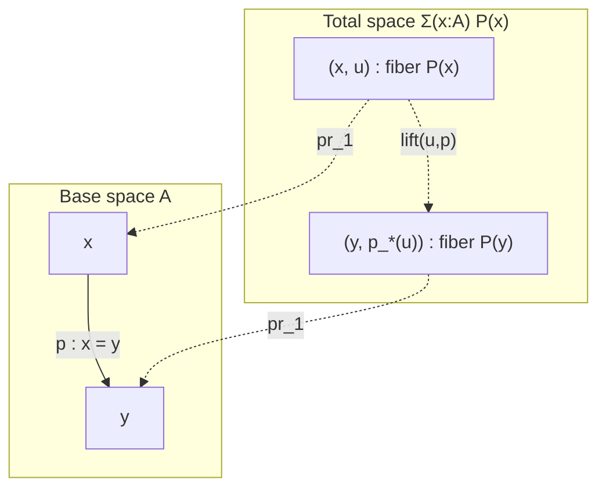
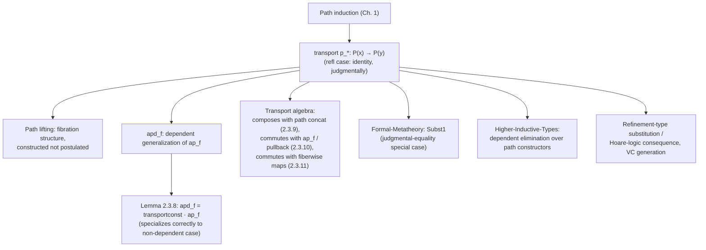

[[book-guidelines|↩ Back to guidelines]]

# Type Families as Fibrations with Transport

## The gap `ap_f` leaves open

[[Homotopical-Interpretation-of-Type-Theory]] established `ap_f : (x=_Ay) \to (f(x)=_Bf(y))` for an ordinary function $f:A\to B$ — functions act functorially on paths. But dependent functions are the workhorse of type theory, and `ap_f` doesn't typecheck for them. Given $f : \prod_{x:A} P(x)$ and $p : x=_Ay$, the naive question "is $f(x)$ equal to $f(y)$?" is not even well-formed: $f(x) : P(x)$ and $f(y) : P(y)$ are elements of *different types*, and equality types require both sides to inhabit the same type. Before you can compare them at all, $p$ itself has to supply a way of identifying $P(x)$ with $P(y)$.

This article is entirely about that missing ingredient — **transport** — and about the topological reading (**fibrations**) that makes it feel inevitable rather than ad hoc. This is genuinely the single most consequential construction in Chapter 2 for anything you build downstream: identity-type induction, dependent elimination for higher inductive types, and — for your project specifically — the formal shape of *substitution* all factor through this one lemma.

## Transport, derived by path induction like everything else

The book actually already proved the fact needed here, back in §1.12, under a different name: **indiscernibility of identicals**. §2.3 renames it and gives it dedicated notation because it will be used constantly from here on.

**Lemma 2.3.1 (Transport).** *Suppose $P$ is a type family over $A$ and $p : x=_Ay$. Then there is a function $p_* : P(x) \to P(y)$.*

*Proof (first style, spelling out the motive).* Let $D : \prod_{(x,y:A)}(x=y)\to\mathcal{U}$ be $D(x,y,p):\equiv P(x)\to P(y)$. Then $d:\equiv \lambda x.\,\mathrm{id}_{P(x)} : \prod_{x:A} D(x,x,\mathrm{refl}_x)$ — in the reflexivity case, the "transport function" is just the identity. Path induction now hands us $\mathrm{ind}_{=_A}(D,d,x,y,p) : P(x)\to P(y)$ for every $p:x=y$; call this $p_*$. $\blacksquare$

*Proof (second style, the one you'll use in practice).* By induction, it suffices to assume $p$ is $\mathrm{refl}_x$. In that case take $(\mathrm{refl}_x)_* :\equiv \mathrm{id}_{P(x)}$. $\blacksquare$

Occasionally the type family needs to be made explicit in the notation: $\mathrm{transport}^P(p,\text{--}) : P(x)\to P(y)$. Either way, the computational content is the same single fact: **transport along $\mathrm{refl}$ does nothing** — $(\mathrm{refl}_x)_* \equiv \mathrm{id}_{P(x)}$, judgmentally. Everything else about transport is downstream of that one computation rule.

## The topological reading: base, fiber, total space, section

A type family $P : A \to \mathcal{U}$ can be read as a *property* of elements of $A$ — "$P$ holds at $x$" meaning "$P(x)$ is inhabited" — but the book's preferred reading from here on is geometric: $P$ is a **fibration**, with $A$ as the **base space**, $P(x)$ as the **fiber over $x$**, and the **total space** $\sum_{x:A}P(x)$ (equipped with its first projection $\mathrm{pr}_1 : \sum_{x:A}P(x) \to A$) as the space that "glues all the fibers together over their base points."

Classical topology *defines* a fibration as a map admitting path liftings: given a path $p$ in the base and a point $u$ in the fiber over its start, you can lift $p$ to a path in the total space starting at $u$, continuously in $p$ and $u$. Type theory reverses the direction of definition entirely — **every** type family automatically comes equipped with such a lifting, constructed rather than merely postulated:

**Lemma 2.3.2 (Path lifting property).** *Let $P:A\to\mathcal{U}$, $u:P(x)$, $p:x=y$. Then*
$$\mathrm{lift}(u,p) : (x,u) =_{\sum_{x:A}P(x)} (y,\,p_*(u)) \qquad\text{such that}\qquad \mathrm{pr}_1(\mathrm{lift}(u,p)) = p.$$

The endpoint $p_*(u)$ is, by definition, "wherever the lifted path ends up" — which is exactly transport's job description restated geometrically. The book flags a genuinely striking philosophical point here: in classical homotopy theory, "fibration" is a *property* a map might or might not have (you have to check that liftings exist); in type theory, path-lifting is not a property to verify but a *structure* every type family carries automatically, constructed directly from the induction principle. This is proof-relevant constructive mathematics doing real work: you never get to say "a lifting exists" without the lifting being handed to you, and — because every type-theoretic function is automatically "continuous" (per [[Homotopical-Interpretation-of-Type-Theory#Functions are functors: `ap`|`ap`'s functoriality]]) — the liftings are automatically continuous too, with no separate continuity check ever required.

**A precise warning from the book, worth internalizing exactly as stated (Remark 2.3.3):** don't say "the fibration $P : A \to \mathcal{U}$" — that phrasing sounds like it names a fibration with base $\mathcal{U}$ and total space $A$, backwards from the intended reading. When $P:A\to\mathcal{U}$ is read as a fibration, the base is $A$ and the total space is $\sum_{x:A}P(x)$ — $\mathcal{U}$ never enters the geometric picture at all, it's just the codomain type family map into. Related vocabulary the book introduces here: a dependent function $f:\prod_{x:A}P(x)$ is a **section** of the fibration (it picks one point per fiber, continuously); something holding "for each $P(x)$" is said to hold **fiberwise**; and a section $f$ witnesses that $P$ is **fiberwise inhabited**.



## The dependent version of `ap`: `apd`

With transport in hand, the original problem — comparing $f(x):P(x)$ and $f(y):P(y)$ across a path $p:x=y$ — has an answer: transport $f(x)$ forward along $p$ *first*, landing it in $P(y)$, and only then ask whether it equals $f(y)$.

**Lemma 2.3.4 (Dependent map).** *For $f:\prod_{x:A}P(x)$,* $\mathrm{apd}_f : \prod_{p:x=y}\big(p_*(f(x)) =_{P(y)} f(y)\big)$.

*Proof.* By path induction, reducing to $p\equiv\mathrm{refl}_x$; then $(\mathrm{refl}_x)_*(f(x)) \equiv f(x)$ judgmentally (transport-along-refl computes to the identity), so the goal collapses to $f(x)=f(x)$, discharged by $\mathrm{refl}_{f(x)}$. $\blacksquare$

Paths of the shape $p_*(f(x))=f(y)$ — "a path lying over $p$" — are called **dependent paths**, and they recur constantly starting in [[Higher-Inductive-Types]] (where a higher inductive type's induction principle has to state, for each path constructor, what the motive does to a *dependent* path over that constructor). Getting comfortable with "compare after transporting, not before" here is exactly what makes those later induction principles legible rather than mysterious.

### Reconciling `apd` with `ap`: the constant-family case

Non-dependent $f:A\to B$ is the special case $P(x):\equiv B$ (a **constant type family**). In that case $P(x)$ and $P(y)$ are the *same* type $B$ regardless of $p$, so you'd expect transport to reduce to nothing — and it very nearly does, up to one coherence path:

**Lemma 2.3.5.** *For $P(x):\equiv B$ constant, $p:x=y$, $b:B$: there is* $\mathrm{transportconst}^B_p(b) : \mathrm{transport}^P(p,b) = b$.

*Proof.* Path induction reduces to $p\equiv\mathrm{refl}_x$, where $\mathrm{transport}^P(\mathrm{refl}_x,b)\equiv b$ judgmentally by the transport computation rule — so the goal is $b=b$, discharged by $\mathrm{refl}_b$. $\blacksquare$

This lets you convert between `apd_f` and `ap_f` for non-dependent $f$ by concatenating with `transportconst` and its inverse:

**Lemma 2.3.8.** *For $f:A\to B$ and $p:x=_Ay$:* $\mathrm{apd}_f(p) = \mathrm{transportconst}^B_p(f(x)) \cdot \mathrm{ap}_f(p)$.

*Proof.* By path induction; in the reflexivity case all three paths appearing are literally $\mathrm{refl}_{f(x)}$, so the goal degenerates to $\mathrm{refl}_{f(x)}=\mathrm{refl}_{f(x)}\cdot\mathrm{refl}_{f(x)}$, true judgmentally. $\blacksquare$

The dependent machinery specializes correctly back down to the non-dependent case — a basic sanity check the book insists on before trusting `apd` as the "real" generalization of `ap`, not just a superficially similar construction.

## The transport algebra: three lemmas you'll reach for constantly

The book states three further transport identities (proofs left as an exercise, since by this point in the chapter the pattern — path induction, reduce to $\mathrm{refl}$, use the computation rule — is fully internalized):

**Lemma 2.3.9 (Transport composes with path concatenation).** For $p:x=_Ay$, $q:y=_Az$, $u:P(x)$:
$$q_*(p_*(u)) = (p\cdot q)_*(u).$$
Transporting along a concatenated path equals transporting along each leg in turn, in the same order the paths were walked — the functor-like behavior you'd expect from "continuous deformation applied twice in a row."

**Lemma 2.3.10 (Transport along a composite type family).** For $f:A\to B$, $P:B\to\mathcal{U}$, $p:x=_Ay$, $u:P(f(x))$:
$$\mathrm{transport}^{P\circ f}(p,u) = \mathrm{transport}^P(\mathrm{ap}_f(p),u).$$
Transporting along $p$ in the *pulled-back* family $P\circ f$ is the same as first pushing $p$ forward through $f$ (via `ap_f`) and transporting along the image in $P$ directly — reindexing along $f$ commutes with transport.

**Lemma 2.3.11 (Transport commutes with a fiberwise map).** For $P,Q:A\to\mathcal{U}$, a family of functions $f:\prod_{x:A}P(x)\to Q(x)$, $p:x=_Ay$, $u:P(x)$:
$$\mathrm{transport}^Q(p,\,f_x(u)) = f_y(\mathrm{transport}^P(p,u)).$$
A fiberwise-defined map $f$ and transport commute — apply $f$ then transport, or transport then apply $f$ (using $f$'s incarnation at the *other* fiber), and you land in the same place. This is naturality of $f$ with respect to transport, stated without ever invoking category-theoretic language.

**Rust framing — the associated-type/witness pattern.** The cleanest analogue for "a family of types indexed by another type, with a canonical way to move data between fibers along an equality" is a generic function parametrized by a runtime-irrelevant proof:

```rust
// P : A -> Type, represented as a trait with an associated type per "index"
trait Fiber<Idx> {
    type Output;
}

// transport: given evidence that x and y denote "the same" index
// (in Rust, usually just x == y at the value level, since Rust lacks
// a first-class identity type), move data from the x-fiber to the y-fiber.
fn transport<Idx: Eq, F: Fiber<Idx>>(_p: PhantomData<Idx>, u: F::Output) -> F::Output {
    u // when the index is literally unchanged, transport is the identity --
      // exactly Lemma 2.3.1's reflexivity case, (refl_x)_* ≡ id
}
```

Rust's type system can't state "$P(x) \to P(y)$ given a proof $x=y$" in general (no first-class identity types, no dependent function space indexed by a proof term) — this sketch only captures the *shape* of the reflexivity case. The honest translation lives in Lean.

**Lean framing — this is `▸` (transport notation), used constantly and usually invisibly.** Lean's `Eq.mpr`/`▸` notation *is* `transport`, definitionally:

```lean
-- P : A → Type is a type family; h : x = y; u : P x. Produces P y.
example {A : Type} (P : A → Type) {x y : A} (h : x = y) (u : P x) : P y :=
  h ▸ u   -- literally transport^P(h, u)

-- Lemma 2.3.9 as a Lean theorem, proved by the same "induct, reduce to rfl" pattern:
example {A : Type} (P : A → Type) {x y z : A} (p : x = y) (q : y = z) (u : P x) :
    q ▸ (p ▸ u) = (p.trans q) ▸ u := by
  subst p; subst q; rfl   -- both sides definitionally the identity once p,q are refl
```

The `subst`/`rfl` pattern here is precisely the book's "second proof" style spelled out as a tactic script: `subst p` performs path induction on `p` (replacing $y$ by $x$ throughout and specializing $p$ to `rfl`), collapsing the goal until both sides become syntactically identical.

## Why this is the load-bearing lemma for your project, specifically

**Transport is substitution, generalized to a space of possible identifications rather than a single syntactic replacement.** [[Formal-Metatheory#Contexts made fully explicit|`Subst1`]] states: if $\Gamma\vdash a:A$ and $\Gamma,x{:}A,\Delta\vdash b:B$, then $\Gamma,\Delta[a/x]\vdash b[a/x]:B[a/x]$. That's the *judgmental*-equality-degenerate special case of transport — where the "path" being transported along is definitional unfolding rather than a genuine identity-type inhabitant. `transport^P(p, –) : P(x) → P(y)` is the same operation, stated for the general case where $x$ and $y$ are merely *propositionally* identified, with the specific witness $p$ tracked and available for later inspection (proof-relevance again, from [[Constructive-Logic-and-Proof-Relevance]]).

This generalization is exactly what a **Hoare-logic consequence rule** or a **weakest-precondition step** looks like when you unfold it to the type-theoretic level. If $P(x)$ reads as "postcondition/invariant $P$ holds relative to program state $x$," and $p$ certifies that states $x$ and $y$ are interchangeable for the purposes at hand, then $p_*$ is literally the operation "carry a proof obligation across a state-identifying step" — the same move a refinement-type checker performs every time it needs to re-express `{v : A | φ(v)}` after a substitution `[a/x]`: it is transporting the refinement predicate, viewed as a type family $P : A \to \mathcal{U}$ (or $A \to \mathrm{Prop}$), along the path/substitution connecting the old and new indices. Lemma 2.3.10 above — transport along a *pulled-back* family, $\mathrm{transport}^{P\circ f}$ reducing to $\mathrm{transport}^P$ composed with `ap_f` — is exactly the shape of substitution-through-a-function-call: when a verification condition generator pushes a postcondition backward across a call to `f`, it is reindexing the family $P$ along $f$ before transporting, precisely per this lemma.

## Where this leads



Everywhere a later chapter needs to state "how does a dependent construction behave across a path," it's invoking this section by name or by shape. [[Higher-Inductive-Types]]'s induction principles are stated entirely in terms of dependent paths — you cannot even *parse* the induction principle for the circle $S^1$ without already knowing what $p_*(f(x))=f(y)$ means. [[The-Univalence-Axiom-and-Its-Consequences]]'s "[[The-Univalence-Axiom-and-Its-Consequences#Transport along paths in the universe|transport along paths in the universe]]" specializes this exact machinery to the case $A:\equiv\mathcal{U}$ — transporting *along an equivalence of types itself*, which is where `idtoeqv` and univalence's practical payoff (moving a proof or structure across an equivalence "for free") come from. And for the compiler project, this is the piece worth internalizing as a single slogan: **substitution and transport are the same lemma, instantiated at different targets** — get the general, path-indexed version right here, and both the elaborator's substitution machinery and the verifier's proof-obligation bookkeeping inherit its correctness for free.
