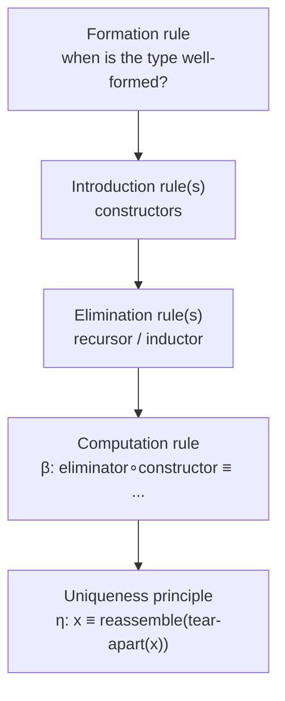
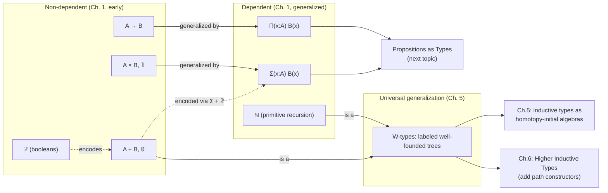

[[book-guidelines|↩ Back to guidelines]]

# Type Formers and Their Universal Properties

## Why type theory needs a zoo of type formers at all

Set theory gets away with almost nothing built in: everything — pairs, functions, natural
numbers — is *encoded* as sets, using membership as the only primitive. Type theory refuses
that move. In HoTT's own words, ordered pairs and functions are **primitive concepts**, not
functional relations or Kuratowski-encoded sets (§1.2, §1.5). This is not laziness; it's a
design decision with consequences. If pairs were encoded (say, as functions out of `{0,1}`),
then the type checker would need to unfold that encoding to know that `pr1(a, b)` reduces to
`a` — an entirely avoidable inference. Instead, each type former is defined by unbundling a
question into five sub-questions the book asks of *every* new type (Remark 1.5.1, p. 27), and
this five-part shape is the single most load-bearing idea in this chapter:

1. **Formation rule** — when is `A ⊛ B` (or `⊛A`) itself a well-formed type?
2. **Introduction rule(s)** — how do you *construct* an element (the constructors)?
3. **Elimination rule(s)** — how do you *use* an element (the eliminators / recursors)?
4. **Computation rule** — what happens when an eliminator meets a constructor head-on
   (β-reduction): this is a *judgmental* equality, checkable by the typechecker without any
   user-supplied proof.
5. **Uniqueness principle** (optional) — every element is *equal to* what you'd get by
   tearing it apart and reassembling it (η-expansion): sometimes judgmental, sometimes only
   provable propositionally.

If you've ever implemented a small typed language, this is exactly the shape of a typing-rules
table with an accompanying evaluator: formation = well-formedness check, introduction =
constructor typing rules, elimination = destructor typing rules, computation = the evaluator's
reduction rules, uniqueness = an optional normal-form/eta-law your evaluator may or may not
implement. Every type former below is an instance of this same five-slot template — once you
see it once, the rest of the chapter is just filling in the blanks for seven different shapes.



---

## 1. Function types ($A \to B$) and $\lambda$-abstraction

**The problem it solves.** Type theory needs a primitive notion of "a rule that turns an `A`
into a `B`," without appealing to sets of ordered pairs. The book gives two equivalent
surfaces for constructing an element of `A → B`: a *named definition* `f(x) :≡ Φ`, or an
*anonymous* $\lambda$-abstraction $\lambda x.\,\Phi$ (also written $x \mapsto \Phi$), related by
`f :≡ λx. Φ`.

**Computation and uniqueness.** The book gives both halves of the pattern explicitly:

- Computation (β): $(\lambda x.\,\Phi)(a) \equiv \Phi[a/x]$ — substitute and you're done, and
  this holds *judgmentally*, i.e. the typechecker can verify it by unfolding, with no proof
  obligation.
- Uniqueness (η): $f \equiv (\lambda x.\, f(x))$ — every function is *definitionally* equal to
  its own eta-expansion. This is what "a function is uniquely determined by its values" means
  formally.

A subtlety the book is careful about (p. 23): naive textual substitution can *capture*
variables. If $f(x) :\equiv \lambda y.\, x + y$ and you evaluate $f(y)$ for some ambient
`y : N`, blindly substituting gives $\lambda y.\, y + y$ — wrong, because the outer `y` gets
swallowed by the bound `y`. The fix is $\alpha$-conversion: bound variables are renamed first.
This is precisely the "avoid variable capture" caveat that shows up in every substitution
lemma in a type-checker's metatheory.

**Currying.** Multi-argument functions aren't given a special n-ary function type; instead
$f : A \to B \to C$ (right-associative) is used, with $f(a)(b)$ abbreviated $f(a,b)$ or $f\,a\,b$.

*What breaks without primitiveness:* if function types were derived (e.g. as graphs — sets of
input/output pairs), then applying `f` to `a` would require a search through the graph to find
the matching pair — an operation, not a computation rule. Making $\lambda$/application
primitive is exactly what buys you *judgmental* (decidable, silent) equality for
`(λx. Φ)(a) ≡ Φ[a/x]` instead of a propositional obligation.

**[[Homotopical-Interpretation-of-Type-Theory#Grounding|Grounding]].**

Rust doesn't have first-class dependent function types, but ordinary closures already show
the introduction/elimination/computation triad cleanly:

```rust
// introduction: a lambda-abstraction, closing over nothing
let f = |x: i32| x + x;
// elimination: application
let result = f(2);
// computation rule, made concrete by the compiler's own inlining:
// f(2) reduces (definitionally, for a pure fn) to 2 + 2
assert_eq!(result, 4);

// currying, done by hand, since Rust closures aren't curried by default
let add: Box<dyn Fn(i32) -> Box<dyn Fn(i32) -> i32>> =
    Box::new(|x| Box::new(move |y| x + y));
assert_eq!(add(2)(3), 5);
```

Lean's kernel treats this triad literally — `(fun x => e) a` reducing to `e[a/x]` *is* Lean's
beta-reduction, and it is exactly the rule Lean's `whnf` (weak-head-normal-form) routine
applies when your elaborator needs to compare two terms for definitional equality:

```lean
def f : Nat → Nat := fun x => x + x
example : f 2 = 4 := rfl   -- rfl succeeds because f 2 ≡ 2 + 2 ≡ 4 judgmentally
```

`rfl` succeeding here is not a coincidence of Lean's implementation — it is *definitionally*
the same claim as HoTT's computation rule $(\lambda x.\Phi)(a) \equiv \Phi[a/x]$: `rfl`
type-checks exactly when both sides reduce to the same normal form under judgmental equality.
Every time you write `rfl` to close a goal in Lean, you are invoking this rule (possibly
several of the rules below, chained).

---

## 2. Dependent function types ($\Pi$-types)

**The problem it solves.** Ordinary `A → B` fixes the codomain regardless of which `a : A` you
plug in. But `Fin(n)` (the type with exactly `n` elements) needs a codomain that changes with
its argument, and *polymorphic* functions like `id : ∏(A:U) A → A` need to receive a type as an
argument and then return something whose very type mentions that argument. Both require the
codomain to be a **family** $B : A \to \mathcal{U}$, not a fixed type — hence
$\prod_{(x:A)} B(x)$, read "for every $x:A$, produce something of type $B(x)$."

When $B$ is constant, $\prod_{(x:A)} B \equiv (A \to B)$ — the ordinary function type is the
non-dependent special case, not a separate primitive.

**Definitional shape (from the book, p. 25–26).**

$$\mathrm{id} :\equiv \lambda(A:\mathcal U).\,\lambda(x:A).\,x \quad:\quad \prod_{(A:\mathcal U)} A \to A$$

The book flags something a working type-checker author needs to internalize immediately:
arguments that are *inferable from context* — like the `A` above, when applying `id` to a
known `a : A` — may be omitted (p. 26: "if an argument can be inferred from context, we may
omit it altogether"). That single sentence is the entire justification for implicit arguments
as a language feature.

**Grounding.** Rust generics are the everyday analogue of a non-dependent-in-content-but-
dependent-in-type-index $\Pi$-type — `fn id<A>(x: A) -> A` really is $\prod_{(A:\text{Type})} A \to A$,
just checked at compile time rather than elaborated as a term:

```rust
fn id<A>(x: A) -> A { x }        // ∏(A:U) A → A, monomorphized per call site

// a genuinely *dependent*-flavored example: return type varies with a value, not just a type
fn fmax(n: usize) -> Fin { /* the "largest" element of Fin(n+1) */ todo!() }
```

Rust can't express `Fin(n)` as a real *type-level* function of a runtime `n` without leaning on
const generics or a proof library — this is precisely the gap that dependent typing closes and
Rust doesn't. Lean shows the real thing:

```lean
def id' : (A : Type) → A → A := fun A x => x
def fmax : (n : Nat) → Fin (n + 1) := fun n => Fin.last n
```

**Load-bearing note (learning-goals thread):** this is the type former your elaborator's
implicit-argument resolution is built on. Every `∏(A:U) A → A` with the `A` marked implicit is
a metavariable-solving problem: the elaborator sees `id(a)` for known `a : A`, must unify a
fresh metavariable `?A` against `A` by the type of `a`, and only then can it check the rest.
Miller pattern unification (mentioned in your standing goals) is precisely the restricted,
tractable fragment of "solve `?A` given its use site" that makes this decidable in practice for
Lean-style elaboration.

---

## 3. Product types ($A \times B$) and dependent pair types ($\Sigma$-types)

**Products first.** $A \times B$ pairs up two *unrelated* types; $\mathbf 1$ (unit) is the
nullary case, with sole inhabitant $\star$. Constructors: $(a,b) : A \times B$, $\star : \mathbf
1$. The book's key move (p. 27–28) is deriving projections from a more general **recursor**
rather than taking them as primitive:

$$\mathrm{rec}_{A\times B} : \prod_{C:\mathcal U} (A \to B \to C) \to A \times B \to C, \qquad
\mathrm{rec}_{A\times B}(C, g, (a,b)) :\equiv g(a)(b)$$

$$\mathrm{pr}_1 :\equiv \mathrm{rec}_{A\times B}(A, \lambda a.\lambda b.\, a), \qquad
\mathrm{pr}_2 :\equiv \mathrm{rec}_{A\times B}(B, \lambda a.\lambda b.\, b)$$

and the **dependent** version, `ind_{A×B}`, is what eventually proves the *propositional*
uniqueness principle — "every element really is a pair" — as a theorem
($\mathrm{uniq}_{A\times B}(a,b) :\equiv \mathrm{refl}_{(a,b)}$), rather than assuming it.

**Then $\Sigma$-types generalize this** exactly the way $\Pi$ generalized $\to$: let the type
of the second component *depend* on the value of the first, $\sum_{(x:A)} B(x)$. When $B$ is
constant, $\sum_{(x:A)} B \equiv A \times B$. Now $\mathrm{pr}_2$ must itself be dependently
typed: $\mathrm{pr}_2 : \prod_{p:\sum_{(x:A)} B(x)} B(\mathrm{pr}_1(p))$ — its very type
mentions the first projection of its own argument.

**Why this matters beyond "it's a pair type":** the book uses $\Sigma$-types to define *bundled
structures* — a magma is $\sum_{(A:\mathcal U)} (A \to A \to A)$, i.e. "a type together with an
operation on it" (p. 32). This is the same move as a Rust trait object bundling a vtable with
its data, or a Lean `structure` bundling a carrier type with its operations — except the
$\Sigma$-type version is the primitive, and structures/traits are sugar over it.

**The type-theoretic axiom of choice** (p. 32) is worth internalizing precisely because it's
counter-intuitive at first: $\mathrm{ac} : \big(\prod_{x:A}\sum_{y:B} R(x,y)\big) \to
\sum_{f:A\to B}\prod_{x:A} R(x, f(x))$ is *provable*, not an axiom, because — as the book says
— "no choice is actually involved, since the choices have already been given to us in the
premise": you just uncurry a $\Pi$ of $\Sigma$s into a $\Sigma$ of $\Pi$s by splitting each pair
with `pr1`/`pr2`. Nothing is chosen; everything was already handed over, proof-relevantly.

**Grounding.**

```rust
// non-dependent product — trivial
struct Pair<A, B>(A, B);

// a Σ-type in the "bundled structure" sense: an existential-ish trait object
trait Magma { fn op(&self, other: &Self) -> Self where Self: Sized; }
// Σ(A:U) (A → A → A) as a trait object: the *carrier type* is erased/dynamic
struct AnyMagma(Box<dyn Fn(f64, f64) -> f64>);
```

```lean
-- Σ-type exactly as written in the book
structure Magma where
  carrier : Type
  op : carrier → carrier → carrier

-- the axiom-of-choice-that-isn't-really-choice, as an uncurrying
example {A B : Type} (R : A → B → Prop) (g : ∀ x, Σ' y, R x y) :
    Σ' (f : A → B), ∀ x, R x (f x) :=
  ⟨fun x => (g x).1, fun x => (g x).2⟩
```

Note the Lean example uses `Σ'` (`PSigma`), the proof-relevant sigma over `Type`, which is the
literal HoTT $\Sigma$-type — as opposed to `Exists`/`∃`, which is its *propositionally truncated*
cousin (that distinction becomes the subject of the next topic in this book, "Propositions as
Types").

---

## 4. Coproduct types ($A + B$) and the empty type

$A + B$ is disjoint union: constructors $\mathrm{inl}(a)$, $\mathrm{inr}(b)$; the recursor does
case analysis, $\mathrm{rec}_{A+B}(C, g_0, g_1, \mathrm{inl}(a)) :\equiv g_0(a)$ (and
symmetrically for `inr`). The nullary case, $\mathbf 0$, has **no constructors at all**, so its
recursor $\mathrm{rec}_{\mathbf 0} : \prod_{C:\mathcal U} \mathbf 0 \to C$ needs no defining
equations whatsoever — you can produce a function out of the empty type "for free," which is the
type-theoretic reading of *ex falso quodlibet*.

**A striking cross-encoding (p. 35–36):** the book shows $A + B$ can itself be built as an
*indexed* union over $\mathbf 2$ (booleans), via a type family $P : \mathbf 2 \to \mathcal U$
with $P(0_{\mathbf 2}) \equiv A$, $P(1_{\mathbf 2}) \equiv B$, defined by `rec₂` into the
universe:

$$A + B :\equiv \sum_{x:\mathbf 2} \mathrm{rec}_{\mathbf 2}(\mathcal U, A, B, x)$$

This is a small but important realization: *type families defined by recursion into a
universe* let you encode one type former in terms of others — the same phenomenon your
elaborator will meet when a `match` on an inductive family needs to compute the *type* of each
branch, not just its value.

**Grounding.**

```rust
enum Sum<A, B> { Inl(A), Inr(B) }
enum Void {}   // the empty type: no variants, no way to construct one

fn ex_falso<C>(v: Void) -> C {
    match v {}   // exhaustive: Void has zero constructors, so this compiles with no arms
}
```

`match v {}` on `Void` is `rec₀` made completely literal: Rust's exhaustiveness checker accepts
zero arms precisely because it can see there are zero constructors — the same judgment the
formation/elimination rule for $\mathbf 0$ encodes.

```lean
inductive Sum' (A B : Type) where
  | inl : A → Sum' A B
  | inr : B → Sum' A B

def exFalso {C : Sort u} : Empty → C := fun e => nomatch e
```

---

## 5. The unit type and booleans

$\mathbf 1$ has one constructor $\star$; its recursor is "completely useless" by the book's own
admission (p. 29) since you can always just ignore the input, but its *induction* principle
does earn its keep: it proves the propositional uniqueness principle
$\mathrm{uniq}_{\mathbf 1} : \prod_{x:\mathbf 1} x = \star$, i.e. "every inhabitant really is
$\star$" as a *theorem*, not a stipulation.

$\mathbf 2$ (booleans) has $0_{\mathbf 2}, 1_{\mathbf 2}$; its recursor
$\mathrm{rec}_{\mathbf 2} : \prod_{C:\mathcal U} C \to C \to \mathbf 2 \to C$ is literally
if-then-else — the book says so explicitly. The dependent version `ind₂` is what proves "every
`x : 2` is either `0₂` or `1₂`" (equation 1.8.1), *the* motivating example of "proof by cases"
as an instance of a type former's induction principle rather than a separate logical rule.

**Grounding.**

```rust
fn if_then_else<C>(cond: bool, t: C, f: C) -> C {
    if cond { t } else { f }   // rec₂, spelled with Rust's built-in match on bool
}
```

```lean
#check @Bool.rec   -- {motive : Bool → Sort u} → motive false → motive true → (b : Bool) → motive b
```

`Bool.rec` in Lean *is* `ind₂` — same signature, same computation rules, generated
automatically because `Bool` is declared as an ordinary two-constructor inductive type. This is
the cleanest possible illustration that "if-then-else" and "case-split proof by induction" are
the same eliminator wearing two different hats.

---

## 6. Natural numbers and primitive recursion

$\mathbb N$ has $0 : \mathbb N$ and $\mathrm{succ} : \mathbb N \to \mathbb N$. The recursor:

$$\mathrm{rec}_{\mathbb N} : \prod_{C:\mathcal U} C \to (\mathbb N \to C \to C) \to \mathbb N \to C$$
$$\mathrm{rec}_{\mathbb N}(C, c_0, c_s, 0) \equiv c_0 \qquad
\mathrm{rec}_{\mathbb N}(C, c_0, c_s, \mathrm{succ}(n)) \equiv c_s(n, \mathrm{rec}_{\mathbb N}(C, c_0, c_s, n))$$

The "next step" function $c_s$ takes *both* the predecessor `n` and the recursive result
`f(n)` — this is exactly what lets you define `double` (p. 37: `double(succ(n)) :≡
succ(succ(double(n)))`) and `add`, by supplying $c_0, c_s$ pairs, then *deriving* the named
function as `recN` applied to them (equations 1.9.1–1.9.2), rather than the other way around.

The dependent form, `ind_N`, is Peano induction stated as a type former's elimination
principle: given $C : \mathbb N \to \mathcal U$, a base case $c_0 : C(0)$, and a step
$c_s : \prod_{n} C(n) \to C(\mathrm{succ}(n))$, you get $\prod_n C(n)$. The book's worked
associativity proof (p. 39) — `assoc0` for the base case, `assoc_s` invoking `ap_succ` on the
inductive hypothesis — is the formal shape *every* structural-recursion soundness proof in a
verifier takes: peel off one constructor, discharge the base case trivially, and in the
inductive case, transport the hypothesis through the constructor using "equal things have equal
successors" (proved later via path induction on identity types, Lemma 2.2.1).

*What breaks without primitive recursion having both `n` and `f(n)` in scope:* you could only
define non-recursive per-case transformations (that's what `rec₂`/`rec_{A+B}` give you already)
— you couldn't accumulate a result across the whole structure. That's the entire difference
between "case analysis" and "recursion," made syntactically explicit in the type of `c_s`.

**Grounding.**

```rust
fn rec_nat<C: Clone>(c0: C, cs: impl Fn(u64, C) -> C, n: u64) -> C {
    // literal transcription of rec_N — an explicit fold, not relying on Rust's own u64
    fn go<C: Clone>(cs: &impl Fn(u64, C) -> C, c0: &C, n: u64) -> C {
        if n == 0 { c0.clone() } else { cs(n - 1, go(cs, c0, n - 1)) }
    }
    go(&cs, &c0, n)
}
let double = |n: u64| rec_nat(0u64, |_pred, y| y + 2, n);
```

```lean
def recN' {C : Type} (c0 : C) (cs : Nat → C → C) : Nat → C
  | 0 => c0
  | .succ n => cs n (recN' c0 cs n)

-- Nat.rec is the built-in version; this hand-rolled one has identical computation rules
```

Python, tertiary, sketching the same recurrence without ceremony:

```python
def rec_nat(c0, cs, n):
    return c0 if n == 0 else cs(n - 1, rec_nat(c0, cs, n - 1))

double = lambda n: rec_nat(0, lambda pred, y: y + 2, n)
```

**Load-bearing note:** this recursor/inductor split — non-dependent codomain vs. dependent
family `C : N → U` — is the direct ancestor of *bidirectional typing*'s two modes.
`rec_N`-shaped elimination (constant codomain) is what you use when you already know the
target type and just need to *check* against it; `ind_N`-shaped elimination (family varying
over the scrutinee) is what a dependent `match`/`elim` needs when the branch's expected type
depends on which constructor fired — precisely the situation a bidirectional checker's "infer"
mode has to handle for dependent pattern matches.

---

## 7. $W$-types as well-founded trees

*(Chapter 5, §5.3, pp. 154–157 — introduced later in the book, once general inductive
definitions are on the table, but it is the universal generalization of everything above.)*

**The problem it solves.** Every type former so far — coproducts, naturals, even lists you
might define by hand — turns out to be a special case of *one* construction: labeled,
well-founded trees where each label determines how many children the node has. The book
motivates this directly: "$W$-types are a generalization of such types as natural numbers,
lists, and binary trees, which are sufficiently general to encapsulate the 'recursion' aspect
of any inductive type" (p. 154).

**Definition.** Given $A : \mathcal U$ (a type of *labels*, i.e. constructor tags) and a family
$B : A \to \mathcal U$ (recording each label's *arity* — how many recursive arguments it takes),
$W_{(a:A)} B(a)$ is generated by a single constructor:

$$\mathrm{sup} : \prod_{a:A} \big(B(a) \to W_{(x:A)}B(x)\big) \to W_{(x:A)}B(x)$$

Read `sup(a, f)` as: "a node labeled `a`, whose `b`-th child (for each `b : B(a)`) is `f(b)`."
The name is short for *supremum* — a tree is the supremum of its labeled root over all its
subtrees.

**Naturals as a $W$-type.** Take $A :\equiv \mathbf 2$ (two labels: "zero" and "successor").
$0_{\mathbf 2}$ needs zero children (arity 0), $1_{\mathbf 2}$ needs exactly one (the
predecessor), so $B :\equiv \mathrm{rec}_{\mathbf 2}(\mathcal U, \mathbf 0, \mathbf 1)$ — the
empty type for the "zero" label's arity, the unit type for "successor"'s:

$$\mathbb N^w :\equiv W_{(b:\mathbf 2)} \mathrm{rec}_{\mathbf 2}(\mathcal U, \mathbf 0, \mathbf 1, b)$$
$$0^w :\equiv \mathrm{sup}(0_{\mathbf 2}, \lambda x.\,\mathrm{rec}_{\mathbf 0}(\mathbb N^w, x)) \qquad
\mathrm{succ}^w :\equiv \lambda n.\, \mathrm{sup}(1_{\mathbf 2}, \lambda x.\, n)$$

`sup(0₂, f)` needs `f : 0 → N^w` — trivially satisfiable since `0` has no elements, which is
exactly why the "zero" case carries no real child data. `sup(1₂, f)` needs `f : 1 → N^w` — one
real argument, indexed by the sole inhabitant of `1`, i.e. genuinely "the predecessor."

**Lists as a $W$-type**, similarly, with $1 + A$ many labels — one nullary (empty list) plus one
unary label per element of $A$:

$$\mathrm{List}(A) :\equiv W_{(x:1+A)} \mathrm{rec}_{1+A}(\mathcal U, \mathbf 0, \lambda a.\,\mathbf 1, x)$$

**Induction principle.** To prove $E : W_{(x:A)}B(x) \to \mathcal U$ for every tree, it suffices
to handle `sup(a, f)` assuming $E$ already holds of every child `f(b)`:

$$e : \prod_{a:A}\prod_{f:B(a)\to W} \Big(\prod_{b:B(a)} E(f(b))\Big) \to E(\mathrm{sup}(a,f))$$

— structural induction on trees, stated once, generically, subsuming Peano induction on
$\mathbb N$, structural induction on lists, and induction on binary trees as instances, rather
than needing a bespoke induction principle per inductive type.

**Uniqueness (Theorem 5.3.1).** Any two functions $g, h$ satisfying the same recurrence
*propositionally* are (propositionally) equal — the $W$-type-level generalization of the
`double`/`add`-style uniqueness arguments from §1.9.

**Why the book returns to this in Chapter 5, not Chapter 1:** $W$-types are the mechanism that
lets §5.4–5.6 state a completely general, uniform account of *what an inductive type even is*
— an initial algebra for a polynomial functor, with strict positivity as the syntactic
condition guaranteeing the functor is well-behaved. Every type former in this article is later
re-derived as either a $W$-type or a close relative (a non-recursive one, effectively a
$\Sigma$-type) once that machinery is in place.

**Load-bearing note:** if you're building a checker/verifier that needs to accept *user-defined*
inductive types generically (not hand-roll `Nat`, `List`, `Tree`, ... as special cases each with
its own recursor), $W$-types are the target normal form: your surface syntax's "define an
inductive type by listing constructors and their argument arities" desugars into exactly the
$(A, B)$ pair above, and your generic recursor/eliminator-generation code can be written *once*,
against $\mathrm{rec}_W$, instead of once per inductive type. This is effectively what a kernel
that auto-generates `.rec` for every `inductive` declaration is doing under the hood.

**Grounding.**

```rust
// A "label" carries its arity encoded in its own shape — Rust enums do this natively,
// but you can also make the W-type structure completely explicit:
enum Label { Zero, Succ }
fn arity(l: &Label) -> usize { match l { Label::Zero => 0, Label::Succ => 1 } }

enum Wtree<L> { Sup(L, Vec<Wtree<L>>) }   // children: an arity-many Vec, not a fixed struct

fn nat_w_zero() -> Wtree<Label> { Wtree::Sup(Label::Zero, vec![]) }
fn nat_w_succ(n: Wtree<Label>) -> Wtree<Label> { Wtree::Sup(Label::Succ, vec![n]) }
```

```lean
-- Lean's own WType is in the standard library and matches the book exactly:
-- inductive WType (A : Type u) (B : A → Type v) where
--   | mk (a : A) (f : B a → WType A B) : WType A B

def NatArity : Bool → Type
  | false => Empty   -- label "zero": 0 children
  | true  => Unit    -- label "successor": 1 child

abbrev NatW := WType NatArity
def zeroW : NatW := WType.mk false Empty.elim
def succW (n : NatW) : NatW := WType.mk true (fun _ => n)
```

---

## Where this leads



Everything in this article is prerequisite machinery for the **propositions-as-types**
correspondence (the book's very next topic): $\Pi$ becomes universal quantification, $\Sigma$
becomes existential quantification, $+$ becomes disjunction, $\mathbf 0$ becomes `False`, and
`ind`-principles become proof-by-cases/induction. It is also the base case, quite literally, for
**identity types** (§1.12) — the book's presentation of `=` is itself an inductive family, and
the entire homotopical reading of the book (Chapters 2+) is about what happens once you take
that identity type former seriously as a *space*.

For the standing project: the five-slot template (formation / introduction / elimination /
computation / uniqueness) *is* the shared ancestor of "a type checker's typing rules" and "a
proof checker's inference rules" that your notes elsewhere ask to be made explicit — a
`rec`/`ind` pair for a type former is nothing but a typing-rule-plus-evaluation-rule pair, and a
generic implementation of $W$-types (rather than one recursor per inductive type) is the
concrete mechanism a from-scratch verifier needs if it wants to accept user-declared inductive
types instead of hard-coding `Nat`, `List`, and friends by hand. The recursor/inductor split
(constant vs. varying codomain) is also the cleanest possible seed for *bidirectional typing*:
non-dependent elimination checks against a known type, dependent elimination must infer a
codomain that varies per constructor — the same fork every dependent pattern-match compiler has
to resolve.
