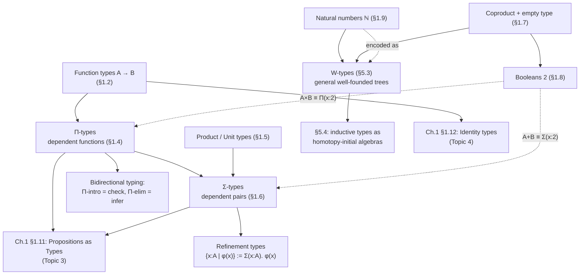

[[book-guidelines|↩ Back to guidelines]]

# Type Formers and Their Universal Properties

## What problem are we even solving?

Before this chapter's material, the book has told you that type theory has two kinds of judgment (`a : A` and `a ≡ b : A`) and that it treats these as primitive, not as encodings on top of sets. That's a nice philosophical stance, but it's empty until you can actually build anything. A foundational system needs *type formers*: rules that manufacture new types out of old ones, plus rules for how to construct and consume their elements. §§1.2–1.9 hand you exactly seven of these, and together they are the entire "standard library" out of which every data structure — records, tagged unions, optionals, generic containers, recursive trees — gets assembled, both in this book and in any dependently-typed system built on the same discipline (Lean, Coq, Agda, and eventually the elaborator you're building).

The book is explicit (Remark 1.5.1, p. 26–27) that every type former follows the same five-part recipe:

1. **Formation rule** — under what conditions can I even write down this type?
2. **Introduction rule(s)** (constructors) — how do I build an element of it?
3. **Elimination rule(s)** (recursor/inductor) — how do I *use* an element of it, i.e., how do I define a function *out of* it?
4. **Computation rule** — a *judgmental* equality: eliminator applied to constructor reduces.
5. **Uniqueness principle** (sometimes only propositional) — every element is (provably) reconstructible from what the eliminators extract from it.

This pattern is the universal property, stated operationally instead of categorically. If you've seen category theory, (2) is "there is a map into/out of this object" and (5) is "and it's the *unique* one making a diagram commute" — the book will make this literal in §2.15 and again in §5.4, where inductive types are recast as *homotopy-initial algebras*. Keep that in the back of your mind throughout: **an eliminator is not an ad hoc case-split, it's the unique arrow demanded by a universal property**, and this is exactly the invariant a trusted kernel needs to check when it validates a recursor application.

---

## 1. Function types: the primitive you can't define away

**What breaks without it.** In set theory a function is *defined as* a functional relation — a set of pairs satisfying single-valuedness. Type theory refuses that encoding: functions and pairs are both taken as *primitive* notions, because trying to build functions out of more basic pieces (e.g. graphs-as-sets) would drag in extensionality and other set-theoretic baggage the theory is deliberately avoiding. So the first type former, $A \to B$, has to be introduced by fiat: what are its constructors, and what can you do with its elements.

The book's presentation (§1.2, pp. 21–24):

- **Constructor:** $\lambda$-abstraction. Given $\Phi : B$ possibly involving a free variable $x : A$, we get $\lambda x.\, \Phi : A \to B$.
- **Eliminator:** application. $f : A \to B$ and $a : A$ give $f(a) : B$.
- **Computation rule** ($\beta$-reduction, judgmental): $(\lambda x.\, \Phi)(a) \equiv \Phi[a/x]$.
- **Uniqueness** ($\eta$-expansion, judgmental here): $f \equiv \lambda x.\, f(x)$ — a function is *uniquely determined by its values*.

Two things worth dwelling on because they resurface constantly in an elaborator's substitution machinery:

- **Definitions reduce to $\lambda$-abstraction.** Writing $f(x) :\equiv \Phi$ is sugar for $f :\equiv \lambda x.\, \Phi$ — there's no separate "named function" primitive.
- **Substitution must avoid variable capture** (p. 23–24). The book gives the integration-variable analogy: $\lambda y.\, x + y$ and $\lambda z.\, x + z$ are the *same* function ($\alpha$-conversion), and substituting a term containing a free `y` into `f(x) :≡ λy. x + y` must rename the bound `y` first. This is precisely the "hygienic substitution" problem you'll re-encounter as soon as you write a substitution function for your compiler's core terms — get it wrong and unification/typechecking becomes unsound.

Currying (p. 23) is introduced as the *design choice* to avoid product types being a prerequisite for multi-argument functions: $f : A \to B \to C$, right-associated by convention, with `f(a, b)` as notation for `f(a)(b)`.

**Rust grounding.** Non-dependent function types map almost verbatim onto `fn` pointers / closure traits:

```rust
// A → B is Fn(A) -> B (or, monomorphized, fn(A) -> B)
let f: fn(i32) -> i32 = |x| x + x;   // λ-abstraction
assert_eq!(f(2), 4);                  // application = elimination

// currying, done by hand since Rust has no native currying sugar
fn add(a: i32) -> impl Fn(i32) -> i32 {
    move |b| a + b
}
assert_eq!(add(2)(2), 4);
```

The uniqueness principle $f \equiv \lambda x. f(x)$ is invisible in Rust because closures are already extensional at the value level for the compiler's purposes — but it is exactly the identity a term-rewriting/normalization pass in a dependently-typed checker must decide whether to perform (it's what makes definitional equality up to $\eta$ a design decision, not a free fact).

**Lean grounding — this is the load-bearing one.** Lean's kernel literally implements this rule as its reduction relation. `(fun x => Φ) a` $\beta$-reduces to `Φ[a/x]` inside `whnf`/`isDefEq`, and Lean's `isDefEq` also normalizes up to $\eta$ for structures and (optionally) for functions. When you write your own elaborator's `is_def_eq`, this is the base case you build everything else on top of — every other type former's computation rule (below) is a case your `whnf` function has to dispatch on, exactly the way Lean's does.

---

## 2. Dependent function types ($\Pi$-types): quantifying over a family

**What breaks without it.** Ordinary $A \to B$ forces the codomain to be a fixed type, independent of the input. But the moment you want a function whose *return type itself depends on the argument* — the polymorphic identity function, or a function returning "the $n$-th finite set" — you're stuck. $\Pi$-types generalize function types by letting the codomain be a *type family* $B : A \to \mathcal{U}$ rather than a constant type.

$$\prod_{(x:A)} B(x) : \mathcal{U}$$

When $B$ is constant, $\prod_{(x:A)} B \equiv (A \to B)$ (p. 25) — ordinary functions are the non-dependent special case, not a separate primitive. Constructor, eliminator, computation, and uniqueness rules are verbatim generalizations of §1.2's, just tracking that the codomain now varies with the argument (p. 25).

The book's headline example is **polymorphism**: `id : ∏(A:U) A → A`, defined as `id :≡ λ(A:U). λ(x:A). x`. This is the moment "$A$ is itself an argument" appears — a function that takes a type and then acts on elements of that type.

**What breaks without it, concretely:** without $\Pi$, you cannot even *state* the type of a generic identity function, let alone the type of a recursor — every recursor in this article ($\mathrm{rec}_{A\times B}$, $\mathrm{rec}_{\mathbb N}$, $\mathrm{rec}_{W_{(a:A)}B(a)}$, etc.) is itself a $\Pi$-type quantifying over an arbitrary motive/codomain $C$.

**Rust grounding.** Rust's generics are a *restricted*, non-first-class shadow of $\Pi$-types: type parameters are erased at the value level and can't be returned as first-class values the way `A : U` can in `id`.

```rust
// ∏(A:U) A → A, restricted to Rust's generics (A is a compile-time parameter,
// not a runtime value — this is the key gap between Rust generics and real Π)
fn id<A>(x: A) -> A { x }

// swap, from the book (p. 26): ∏(A,B,C:U) (A→B→C) → (B→A→C)
fn swap<A, B, C>(g: impl Fn(A, B) -> C) -> impl Fn(B, A) -> C {
    move |b, a| g(a, b)
}
```

The gap matters: in Rust, `A` never becomes a runtime value passed around like `x`; in real $\Pi$-types (and in Lean), `A : U` genuinely *is* a term, which is exactly what makes universes and typical ambiguity (§1.3) meaningful and what makes a dependent-type checker's context able to bind type-valued variables uniformly with value-valued ones.

**Lean grounding — primary here.** Lean's `∀ (A : Type) (x : A), A` *is* $\prod_{(A:\mathcal U)} A \to A$, verbatim, with `A` a genuine first-class argument. This is the mechanism your elaborator's **implicit-argument resolution** rides on: an implicit `{A : Type}` argument is a $\Pi$-bound variable that the elaborator fills in via unification rather than requiring the user to write it — i.e., metavariable resolution against a $\Pi$-type's domain is precisely "solve for the missing argument to a dependent function." Bidirectional typing's *checking* mode for a $\Pi$-type introduction (`λ x, e` against expected type `∏(x:A)B(x)`) and *inference* mode for elimination (applying `f : ∏(x:A)B(x)` to `a : A` to get `f(a) : B(a)`) is exactly the introduction/elimination split the book gives you here — this section *is* the typing-rule skeleton for function application and abstraction in any bidirectional elaborator.

---

## 3. Product types and $\Sigma$-types: pairing, and pairing-with-dependency

### 3a. Non-dependent products ($A \times B$, and the unit type $\mathbf{1}$)

Products (§1.5, pp. 26–30) follow the five-part recipe: constructor `(a,b) : A × B`; recursor
$$\mathrm{rec}_{A\times B} : \prod_{C:\mathcal U} (A \to B \to C) \to A \times B \to C, \qquad \mathrm{rec}_{A\times B}(C,g,(a,b)) :\equiv g(a)(b);$$
and induction $\mathrm{ind}_{A\times B}$, the dependent generalization, which is what lets you *prove* — as a propositional, not judgmental, equality — the uniqueness principle "every element of $A \times B$ is a pair" (p. 29). Projections `pr₁`, `pr₂` are derived from the recursor, not primitive.

The **unit type** $\mathbf 1$ is the "nullary product": one constructor $\star : \mathbf 1$, and its induction principle lets you prove $\mathbf 1$'s own uniqueness principle (every element equals $\star$) — again propositionally, from the rules, not by fiat.

Categorically the book flags this directly (p. 28): $A \times B$ is characterized as being **left adjoint to the exponential $B \to C$** — i.e. $\mathrm{Hom}(A \times B, C) \cong \mathrm{Hom}(A, B \to C)$, which is exactly currying. The recursor for $A\times B$ *is* this adjunction's counit/universal map made computational.

### 3b. Dependent pairs ($\Sigma$-types)

**What breaks without it.** A plain pair $A \times B$ can't express "a natural number *together with* a proof it's even," because the second component's type doesn't depend on the value of the first. $\Sigma$-types fix this:

$$\sum_{(x:A)} B(x) : \mathcal U, \qquad (a,b) : \sum_{(x:A)}B(x) \text{ given } a:A,\ b:B(a).$$

When $B$ is constant, $\sum_{x:A} B \equiv A \times B$ — the non-dependent product is the special case (p. 30), mirroring $\Pi$ vs. $\to$ exactly. The first projection is non-dependent, but the *second* projection is forced to be dependent:
$$\mathrm{pr}_2 : \prod_{p:\sum_{(x:A)}B(x)} B(\mathrm{pr}_1(p))$$
— its codomain literally depends on the value being projected, which is only expressible because $\Pi$-types already exist (p. 31).

The book's worked example (pp. 33–34) is the **type-theoretic axiom of choice**:
$$\mathrm{ac} : \Big(\prod_{x:A}\sum_{y:B} R(x,y)\Big) \to \Big(\sum_{f:A\to B}\prod_{x:A} R(x,f(x))\Big),$$
proved constructively, with zero appeal to choice as an axiom — you just split a dependent function's output pairs into two projections. It's also used (p. 32–33) to define **structures**: a magma is $\sum_{A:\mathcal U}(A\to A\to A)$, a pointed magma is $\sum_{A:\mathcal U}(A\to A\to A)\times A$. Nested $\Sigma$s with axioms bolted on via further $\Sigma$-components is, in general, how *every* algebraic and (later) refinement structure in the book gets encoded.

**This is the single most load-bearing subsection in this whole topic for your project.** A refinement type $\{x : A \mid \phi(x)\}$ *is* $\sum_{(x:A)} \phi(x)$ where $\phi(x)$ is a (typically mere-propositional, see Topic 3) type family encoding the constraint. Constraint generation for a refinement checker is literally building $\Sigma$-typed obligations; discharging them is finding an inhabitant of the $B(x)$ component — which is exactly what your embedded theorem prover needs to search for.

**Rust grounding.**

```rust
// Non-dependent product: a plain struct/tuple.
struct Pair<A, B> { fst: A, snd: B }   // A × B, no dependency

// Σ-types have no direct Rust equivalent, because Rust's type system
// can't let a field's *type* depend on another field's *value*.
// The closest approximation is an enum tagging a value together with
// evidence (a proof object) about it, checked once at construction:
struct Even(u32);
impl Even {
    fn new(n: u32) -> Option<Even> {   // the "proof" is just the successful match
        if n % 2 == 0 { Some(Even(n)) } else { None }
    }
}
// Even is a crude Σ(n:u32). (n is even) — a refinement type smuggled in via
// a smart constructor, with the proof erased to "it type-checked as Even".
```

This gap — Rust *cannot* natively express $\sum_{x:A}B(x)$ when $B$ genuinely varies by value — is exactly the gap your refinement-type compiler exists to close: it needs to carry $B(x)$ as a real proof obligation through elaboration, then either discharge it via the embedded prover or erase it to a runtime check, rather than relying on a programmer-maintained smart constructor.

**Lean grounding.** Lean's `Sigma` (`⟨a, b⟩ : (x : A) × B x`) is a literal, first-class $\Sigma$-type, and `Subtype`/`{x : A // p x}` is its mere-proposition specialization — i.e. Lean's own built-in refinement type is defined *as* a $\Sigma$-type over a `Prop`-valued family. This is worth citing by name: when you design your language's refinement types, "$\{x : A \mid \phi\}$ elaborates to `Σ(x:A). φ(x)` with `φ` erased at runtime because it's a mere proposition" is exactly Lean's own `Subtype` design, and it's the cleanest formal justification for why refinement predicates can be checked once and then forgotten.

---

## 4. Coproduct types and the empty type: branching, and the type with no cases

**What breaks without it.** So far every type former has one shape of constructor. Real data — `Result<T, E>`, ASTs with multiple node kinds — needs *disjoint alternatives*. The coproduct $A + B$ (§1.7, pp. 33–35) gives two constructors, `inl(a) : A + B` for `a : A` and `inr(b) : A + B` for `b : B`, and its recursor forces case analysis:
$$\mathrm{rec}_{A+B} : \prod_{C:\mathcal U}(A\to C)\to(B\to C)\to A+B\to C,$$
with computation rules dispatching on which injection was used. The **empty type** $\mathbf 0$ is the nullary coproduct: no constructors at all, so its recursor
$$\mathrm{rec}_{\mathbf 0} : \prod_{C:\mathcal U} \mathbf 0 \to C$$
requires *no defining equations whatsoever* — there's nothing to case-split on — and it is the type-theoretic *ex falso quodlibet* (p. 34): from an element of $\mathbf 0$, anything follows.

A neat encoding trick (p. 36) the book flags for later use (§5.2): given $A,B:\mathcal U$, you can build $A+B$ as $\sum_{x:\mathbf 2}\mathrm{rec}_{\mathbf 2}(\mathcal U, A, B, x)$ using a two-element index type — coproducts *reduce to* $\Sigma$-types plus booleans. This is your first glimpse of how few genuinely primitive type formers you actually need; the rest are encodings.

**Rust grounding.** This one is exact, not approximate — Rust's `enum` *is* the coproduct type former, and pattern matching *is* its recursor/inductor:

```rust
enum Sum<A, B> { Inl(A), Inr(B) }   // A + B

fn rec_sum<A, B, C>(s: Sum<A, B>, g0: impl Fn(A) -> C, g1: impl Fn(B) -> C) -> C {
    match s {
        Sum::Inl(a) => g0(a),   // computation rule: rec(inl(a)) ≡ g0(a)
        Sum::Inr(b) => g1(b),   // computation rule: rec(inr(b)) ≡ g1(b)
    }
}

enum Empty {}   // 0, literally zero constructors
fn ex_falso<C>(e: Empty) -> C { match e {} }  // recΦ : ∏(C:U) 0 → C — exhaustive with 0 arms
```

`match e {}` on an uninhabited `enum Empty {}` compiling with zero arms *is* the empty type's recursor requiring no defining equations, made completely literal.

**Python (tertiary, illustrative only):** a tagged union without static exhaustiveness checking —
```python
def rec_sum(s, g0, g1):
    tag, val = s
    return g0(val) if tag == "inl" else g1(val)
```
worth mentioning only to note what you lose without a type checker: Rust's `match` is *checked* exhaustive against the enum's constructors; this Python version has no such guarantee, which is exactly the property a type-checked recursor buys you and an untyped case-split doesn't.

---

## 5. Booleans: the smallest illustration of the whole pattern, and a second encoding trick

The type $\mathbf 2$ (§1.8, pp. 35–36) exists mostly for economy of notation — it's definitionally $\mathbf 1 + \mathbf 1$ — but the book uses it to show the pattern working at its simplest and to run the encoding trick from §4 *in reverse*: coproducts and even non-dependent products can themselves be built from $\Sigma$/$\Pi$ indexed over $\mathbf 2$:
$$A + B :\equiv \sum_{x:\mathbf 2} \mathrm{rec}_2(\mathcal U, A, B, x), \qquad A \times B :\equiv \prod_{x:\mathbf 2} \mathrm{rec}_2(\mathcal U, A, B, x).$$
This depends on the family $\mathrm{rec}_2(\mathcal U, A, B, -) : \mathbf 2 \to \mathcal U$ being definable *at all* — which requires that the universe $\mathcal U$ is itself a type you can recurse into, "a subtle and important aspect of type theory" as the book puts it (p. 36). This is your first concrete sighting of *type families defined by recursion on data*, the same mechanism that later builds `Fin : N → U` and, eventually, indexed inductive families.

The recursor $\mathrm{rec}_2 : \prod_{C:\mathcal U} C \to C \to \mathbf 2 \to C$ is literally `if`-`then`-`else` (p. 35, stated explicitly in the book).

```rust
fn rec_bool<C>(b: bool, c0: C, c1: C) -> C {
    if b { c1 } else { c0 }   // rec₂(C, c0, c1, b)
}
```

```lean
-- Bool.rec in Lean's kernel is exactly rec₂; `if-then-else` desugars to it.
def rec2 {C : Sort u} (c0 c1 : C) : Bool → C
  | false => c0
  | true  => c1
```

---

## 6. Natural numbers: the first genuinely recursive eliminator

**What breaks without it.** Everything above has eliminators whose defining equations only ever inspect *one layer* of structure — a pair unpacks into two non-recursive pieces, a coproduct case-splits into one of two flat alternatives. $\mathbb N$ (§1.9, pp. 36–40) is the first type former where the eliminator's "next step" clause is allowed to *call back into the eliminator itself* on a strictly smaller argument. This is what "recursion" and "induction" formally mean, made precise for the first time.

Constructors: $0 : \mathbb N$ and $\mathrm{succ} : \mathbb N \to \mathbb N$ — decimal numerals are pure notation, $1 :\equiv \mathrm{succ}(0)$, etc.

Non-dependent recursor:
$$\mathrm{rec}_{\mathbb N} : \prod_{C:\mathcal U} C \to (\mathbb N \to C \to C) \to \mathbb N \to C,$$
$$\mathrm{rec}_{\mathbb N}(C,c_0,c_s,0) :\equiv c_0, \qquad \mathrm{rec}_{\mathbb N}(C,c_0,c_s,\mathrm{succ}(n)) :\equiv c_s(n,\, \mathrm{rec}_{\mathbb N}(C,c_0,c_s,n)).$$

Note the shape of $c_s : \mathbb N \to C \to C$: it receives *both* the predecessor $n$ and the already-computed recursive result — this is what makes `double` and `add` (the book's two worked examples, pp. 37–38) definable at all, and it's why the book calls this **primitive recursion** explicitly, distinguishing it from unrestricted recursion.

The dependent version, $\mathrm{ind}_{\mathbb N}$ (p. 38–39), is where "recursion" and "mathematical induction" are shown to be the *same rule*: given a family $C:\mathbb N \to \mathcal U$ (a "property of naturals"), a base case $c_0 : C(0)$, and an inductive step $c_s : \prod_{(n:\mathbb N)} C(n) \to C(\mathrm{succ}(n))$, you get $\prod_{(n:\mathbb N)}C(n)$. The book's worked proof of associativity of `+` (pp. 39–40) is a direct instance: `assoc₀` is the base case, `assocs` is literally an inductive-hypothesis-consuming step, packaged with $\mathrm{ind}_\mathbb{N}$.

**Rust grounding — a compiler-pass shape, since this is checker-relevant machinery.**

```rust
// The non-dependent recursor, specialized: fold-like structural recursion.
fn rec_nat<C>(n: u64, c0: C, cs: impl Fn(u64, C) -> C) -> C {
    if n == 0 { c0 } else { cs(n - 1, rec_nat(n - 1, c0, cs)) }
}
// double, exactly the book's (1.9.1):
fn double(n: u64) -> u64 { rec_nat(n, 0, |_, y| y + 2) }
```

**Why this matters for a trusted kernel, concretely:** `recN`'s computation rule (unfolding `succ(n)` one layer at a time) is the *entire* justification for why structural recursion terminates and why the recursor is safe to admit into a trusted kernel without a separate termination checker — the recursive call is only ever made on the syntactic predecessor supplied by pattern-matching on the constructor, never on an arbitrary smaller term. When you design your own compiler's inductive-type elaboration (à la Lean's `inductive` command generating `rec`/`brecOn`), this primitive-recursion shape is exactly what the automatically-generated recursor must be restricted to for the kernel to stay terminating without a general termination oracle.

---

## 7. $W$-types: the general recursion scheme underneath everything above

This is the one subtopic that isn't in Chapter 1 — the book defers it to **Chapter 5, §5.3 (pp. 154–157)**, once it's ready to talk about inductive types *in general*. It belongs here anyway, because it retroactively explains *why* $\mathbb N$, lists, and binary trees all had eliminators of the same shape: they're all instances of one construction.

**What problem it solves.** Rather than give a bespoke formation/introduction/elimination rule set for every new recursive datatype, $W$-types give you *one* type former general enough to express "the type of well-founded trees" for an arbitrary branching signature, and every ordinary inductive type reduces to it (the book explicitly says the general reduction is out of scope, but shows the two canonical cases: naturals and lists).

**[[Sets-in-Univalent-Foundations#The construction|The construction]].** Given $A : \mathcal U$ (a type of *labels*, i.e. constructor tags) and $B : A \to \mathcal U$ (recording, for each label, the *arity* — how many recursive sub-trees it takes), the $W$-type $W_{(a:A)}B(a)$ has one constructor:
$$\mathrm{sup} : \prod_{(a:A)} \big(B(a) \to W_{(a:A)}B(a)\big) \to W_{(a:A)}B(a).$$
Read `sup(a, f)` as: "a node labeled `a`, whose `b`-th child (for each `b : B(a)`) is `f(b)`." Concretely: a nullary label has $B(a) \equiv \mathbf 0$ (no children possible — `f : 0 → W` is trivial by `rec₀`); a unary label (like `succ`) has $B(a) \equiv \mathbf 1$ (exactly one child).

The book's own encoding of $\mathbb N$ as a $W$-type (p. 154–155):
$$\mathbb N^w :\equiv W_{(b:\mathbf 2)}\, \mathrm{rec}_2(\mathcal U, \mathbf 0, \mathbf 1, b)$$
— label $0_2$ gets arity $\mathrm{rec}_2(\ldots,0_2)\equiv \mathbf 0$ (no children: it's the base case), label $1_2$ gets arity $\mathbf 1$ (one child: the predecessor). Concretely, $0^w :\equiv \mathrm{sup}(0_2,\lambda x.\,\mathrm{rec}_0(\mathbb N^w,x))$ and $\mathrm{succ}^w :\equiv \lambda n.\, \mathrm{sup}(1_2, \lambda x.\, n)$. Lists get the same treatment with $\mathbf 1 + A$-many labels (one nullary for `nil`, one unary-per-element-of-$A$ for `cons`).

**Induction principle** — the general schema every specific inductive type's induction principle specializes:
$$e : \prod_{(a:A)}\prod_{(f:B(a)\to W)}\Big(\prod_{(b:B(a))} E(f(b))\Big) \to E(\mathrm{sup}(a,f))$$
gives you $\prod_{(w:W)}E(w)$ — "prove it for `sup(a,f)` assuming it holds for every child `f(b)`" is the generic statement of "structural induction," instantiated for whatever branching shape $A,B$ describe. And crucially, the book proves a **uniqueness theorem** (Thm 5.3.1): any two functions satisfying the same recurrence *propositionally* are equal — the universal-property pattern (part 5, "uniqueness principle") holding for the most general inductive shape available.

**Rust grounding — this is the shape of a generic AST/IR node, made explicit.**

```rust
// W(a:A) B(a), specialized to A = an enum of "labels" and B = arity-per-label,
// is exactly a generic rose-tree representation of an inductive datatype:
enum Label { Zero, Succ }
fn arity(l: &Label) -> usize { match l { Label::Zero => 0, Label::Succ => 1 } }

struct WNat { label: Label, children: Vec<WNat> }   // sup(label, children)

fn zero_w() -> WNat { WNat { label: Label::Zero, children: vec![] } }
fn succ_w(n: WNat) -> WNat { WNat { label: Label::Succ, children: vec![n] } }

// The generic recursor: fold over children first, then combine at the label.
fn rec_w<C>(t: &WNat, e: &impl Fn(&Label, &[C]) -> C) -> C
where C: Clone {
    let child_results: Vec<C> = t.children.iter().map(|c| rec_w(c, e)).collect();
    e(&t.label, &child_results)
}
```
This is precisely the shape of a generic "visit an AST bottom-up" fold — and it's exactly the internal representation a compiler uses when it needs to treat *all* user-defined inductive types uniformly (e.g. to auto-derive a recursor/eliminator for a user's `inductive Foo` declaration, the way Lean's `inductive` compiler does): rather than special-casing every constructor shape, you can compile everything down to "labels + arities" and get induction for free from one generic $W$-type schema.

**Lean grounding — this is the direct ancestor of how Lean's kernel treats user inductives.** Lean doesn't literally implement user inductives as $W$-types (it has native inductive families with a dedicated kernel rule, `Inductive.rec`), but $W$-types are the *theoretical justification* for why that's sound: any strictly-positive inductive signature (Chapter 5's later "strict positivity condition," §5.6) can in principle be reduced to a $W$-type, which is why the kernel's generic "recursor exists and satisfies the computation rule" guarantee is trustworthy for *arbitrary* user-declared inductives rather than needing to be re-proved by hand for each one. When you design the inductive-type-declaration feature of your own compiler, the $A$/$B$ split (labels vs. arities) is the right mental model for what your `inductive` elaborator needs to extract from a constructor list before it can auto-generate a sound recursor.

---

## Where this leads



Every later chapter leans on this one. The **propositions-as-types correspondence** (§1.11, next topic in the guidelines) reinterprets $\Pi$ as universal quantification and $\Sigma$ as existential quantification over exactly the types built here — nothing new is introduced, the same eliminators are just read logically. **Identity types** (§1.12, Topic 4) get their *own* formation/introduction/elimination/computation treatment, following the identical five-part recipe you now recognize on sight. And Chapter 5's initial-algebra semantics (§5.4, right after $W$-types) is where the "universal property, stated operationally" framing of this whole article gets its formal categorical proof: an inductive type's recursor is shown to be *the* unique structure-preserving map out of the initial algebra for its associated polynomial functor — the mathematically precise version of "eliminator = unique arrow" that this article has been asserting informally throughout.

For your compiler project specifically: **$\Sigma$-types are the mechanism your refinement-type layer is built on** (constraint generation is building $\Sigma$-typed proof obligations; the embedded prover's job is inhabiting the second component); **$\Pi$-types are the mechanism your elaborator's bidirectional typing and implicit-argument unification are built on** (checking a $\lambda$ against an expected $\Pi$, inferring the result of application); and **$W$-types are the theoretical justification for treating user-declared inductive types generically** in your kernel — the "labels + arities" decomposition is the right shape to reduce an arbitrary `inductive` declaration to before generating its recursor and proving that recursor sound.
