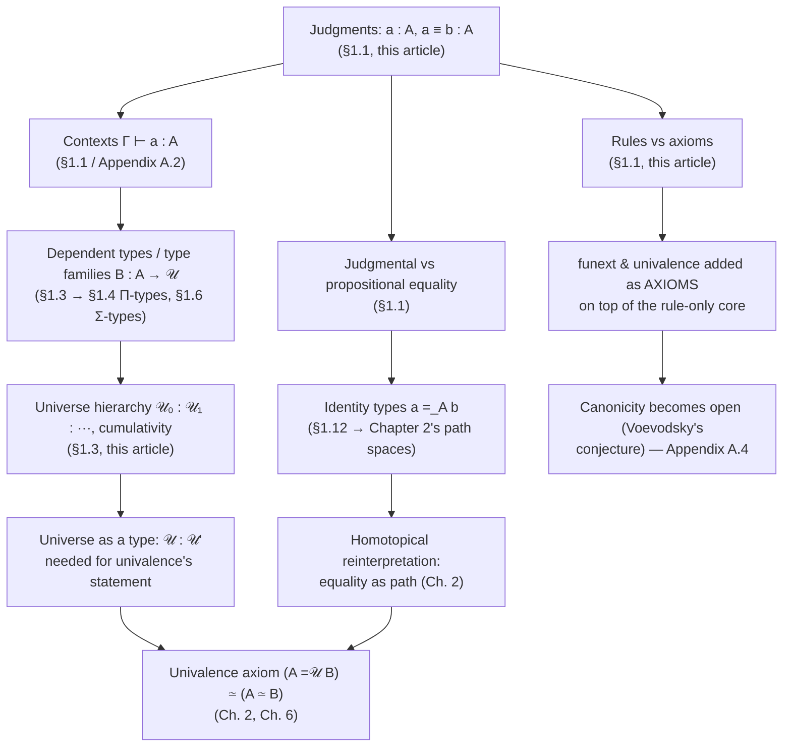

# Type Theory as a Foundational System

[[book-guidelines|↩ Back to guidelines]]

## Why a book about spaces starts with a chapter that isn't about spaces

Before *Homotopy Type Theory* can say anything homotopical — before "type" can mean "space"
and "equality" can mean "path" — it has to answer a much older and less glamorous question:
what *is* a foundational system, and why would anyone replace set theory with this one? Chapter
1 of the book is deliberately pre-homotopical. It presents type theory exactly as it existed before
Voevodsky's [[Formal-Metatheory#Univalence|univalence]] axiom entered the picture, because everything homotopical later in the
book is a *reinterpretation* of this machinery, not a replacement for it. If you don't have a solid
model of what a judgment is, what "the same by definition" means, and why universes exist,
the later claim "$(A =_\mathcal{U} B) \simeq (A \simeq B)$" reads as mysticism instead of as a precise
statement about two things you already understand.

This is also, not coincidentally, the most load-bearing chapter in the book for anyone building a
type checker or an elaborator. Every mechanism a proof assistant's kernel actually executes —
`isDefEq`, context lookup, universe-level inference — is a direct implementation of something
introduced here.

## Two layers versus one notion

Set theory, the book observes, is not really "about sets" in isolation — it's built from **two
layers**: first-order logic (the deductive system that lets you prove things), and, formulated
*inside* that system, a particular theory of sets (ZFC's axioms). A set-theoretic statement like
"$A$ is a group" lives inside first-order logic as a proposition; membership, $a \in A$, is itself a
proposition, something you can assert, negate, or fail to decide.

Type theory collapses this. It is its own deductive system — it doesn't need first-order logic
underneath it — and it has exactly **one** basic notion instead of two: the **type**. Propositions
aren't a separate kind of thing sitting on top of types; they *are* types, via the correspondence the
book develops throughout the chapter (propositions-as-types, covered properly in Topic 3 of this
book, but foreshadowed here). Proving a theorem and constructing an object become the same
activity: a proof of $A$ just is an inhabitant of the type $A$.

**What breaks without this distinction being explicit:** if you try to read type theory with a
set-theoretic mental model, you will keep reaching for "$a \in A$" as if it were a checkable-or-
refutable claim about two pre-existing objects. It isn't. In type theory you cannot introduce a
bare element and then ask what type it has — every element comes into existence *as an element
of a specific type*, "let $x : \mathbb{N}$" is atomic, not shorthand for "let $x$ be a thing, and assume
$x \in \mathbb{N}$." There is no free-floating $x$ to make the assumption about.

```rust
// The type-theoretic reading isn't exotic to a Rust programmer — it's the
// ordinary reading of `let`. You cannot write:
//     let x;          // "let x be a thing"
//     assume(x, i32); // "...and assume it's an i32"
// You write:
let x: i32 = 5;   // x's type is part of introducing x, not a separate claim about it
```

```python
# Python looks like the set-theoretic picture at first glance — you can ask
# `isinstance(x, int)` about a value that already exists — but at runtime every
# Python object still carries a type tag from construction; you're just allowed
# to defer *checking* it. The judgment "x : A" still holds the moment x is built;
# Python just doesn't make you write it down.
x = 5
isinstance(x, int)  # inspecting a judgment that was already true, not deciding a proposition
```

## Judgments, not propositions: the deductive-system layer

To make the "one notion instead of two" claim precise, the book leans on the general theory of
**deductive systems**. A deductive system is a set of rules for deriving **judgments** — think of
judgments as the legal positions in a formal game, reached by applying the game's rules; or, if
you prefer algebra, judgments are the elements of a theory and the rules are its operations.
Crucially, judgments live in the *metatheory* — they are what you, reasoning about the system
from outside, assert holds — as opposed to the *internal* statements of the theory itself.

First-order logic has exactly one judgment form: "$A$ has a proof." Type theory has (in this
chapter) two:

| Judgment | Meaning |
|---|---|
| $a : A$ | "$a$ is an object of type $A$" |
| $a \equiv b : A$ | "$a$ and $b$ are definitionally equal objects of type $A$" |

$a : A$ is the direct analogue of "$A$ has a proof" when $A$ is being read as a proposition — and
of "$a \in A$" when $A$ is being read as a set — but it is a *judgment*, not a proposition. You cannot
internally say "if $a : A$ then it is not the case that $b : B$"; judgments aren't things type theory's
own logic can negate, because they're not types with elements, they're the metatheoretic
statements *about* types and elements that the type theory's rules license you to assert.

This is precisely the boundary a type checker enforces at the language level: "does this term
typecheck" is a judgment the checker computes and reports, not a proposition the *program*
can inspect or negate at runtime.

```lean
-- Lean's `#check` is a direct, executable instance of asking "is Γ ⊢ a : A derivable?"
-- The answer isn't a Lean *value* you can pattern-match on — it's a judgment
-- the elaborator either succeeds or fails to derive.
#check (5 : Nat)        -- ⊢ 5 : Nat   (a judgment the kernel derives)
#check (fun n => n + 1) -- ⊢ (fun n => n + 1) : Nat → Nat
```

## Judgmental equality versus propositional equality

This is the single most important distinction in the chapter, and the one the book flags as the
"last difference between type theory and set theory" worth calling out explicitly.

Ordinary mathematical equality — the kind you can assume as a hypothesis, disprove, or derive
as a theorem — is a *proposition*. Since propositions are types, this equality is a **type**: for
$a, b : A$, there is a type $a =_A b$, called the **identity type**, and a term $p : a =_A b$ is a
*proof* that $a$ and $b$ are (propositionally) equal. This is the notion of equality that, later in the
book, gets reinterpreted homotopically as a *path* between points $a$ and $b$ in the space $A$ —
but nothing about that reinterpretation is needed yet; for now it's enough to know that
propositional equality is an ordinary type, something you construct evidence for.

But type theory needs a second, different notion of equality, existing at the *judgment* level
alongside $a : A$ itself: **judgmental equality**, written $a \equiv b : A$ (also called *definitional*
equality). The book's working intuition: $a \equiv b$ means "equal by definition." If $f(x) :\equiv x^2$,
then $f(3)$ and $3^2$ are judgmentally equal — not because you proved anything, but because
unfolding the definition of $f$ turns one into the other. Judgmental equality cannot be assumed,
negated, or proved as a theorem inside the theory; whether it holds is decided by an algorithm
external to the theory (expanding definitions and comparing), and — this is the property that
makes type checking possible at all — it is **decidable**.

The reason type theory needs this second notion is purely instrumental: judgmental equality is
what lets you *substitute* one type for another when checking $a : A$. If you've derived $A \equiv B$,
the rule "given $a : A$ and $A \equiv B$, derive $a : B$" is what lets a proof of $3^2 = 9$ silently count
as a proof of $f(3) = 9$ once $f(3) \equiv 3^2$ — without that substitution rule, judgmentally
equivalent presentations of the same fact would need separate proofs.

**What breaks without the distinction:** if judgmental and propositional equality were merged
into one thing, either type checking becomes undecidable (because propositional equality is
*not* decidable in general — that's the whole reason $\Sigma$-types, path induction, and eventually
univalence exist as substantial mathematical content rather than trivialities), or the theory loses
the ability to state and prove *interesting* equalities at all (because everything provably equal
would have to already be definitionally equal). Keeping them separate is what makes type theory
simultaneously a decidable checking algorithm *and* an expressive proof language.

This is, not coincidentally, exactly the distinction a proof assistant's kernel is built around.

```lean
-- `rfl` proves a PROPOSITIONAL equality, but it only succeeds when the two
-- sides are already JUDGMENTALLY equal — i.e. when Lean's kernel reduces them
-- to a common form (whnf / defeq checking) without any extra reasoning.
example : 2 + 2 = 4 := rfl        -- judgmentally equal after unfolding `+`
-- example : n + 0 = n := rfl     -- NOT judgmentally equal for a free variable n
--                                -- (defeq checking gets stuck on an opaque `n`);
--                                -- this needs an actual proof term (induction on n),
--                                -- i.e. genuine PROPOSITIONAL content.
```

`rfl`'s success or failure *is* Lean's `isDefEq` procedure — the decidable, rule-driven algorithm
that walks both sides to weak-head normal form and compares. Every time your elaborator needs
to check "does this metavariable's inferred type match the expected type," it is asking exactly
the $a \equiv b : A$ question this section introduces, not the harder $a =_A b$ question. Keeping
these two questions cleanly separated in your own kernel design — decidable defeq-checking as
a fast path, propositional-equality proof search as a slow, user-directed fallback — is the payoff
of understanding this section precisely.

```rust
// Rust's const-eval gives a (much weaker, monomorphic) taste of "equal by
// unfolding definitions": the compiler will accept these as the same type-level
// constant without you proving anything, purely by evaluating both sides.
const fn square(x: usize) -> usize { x * x }
const A: usize = square(3);
const B: usize = 9;
// A and B are "judgmentally" the same usize value to the compiler's const
// evaluator — no propositional-equality proof object is involved, and there's
// no way to *state* "A = B" as a first-class value the way `a =_A b` is a type.
```

## Contexts: judgments that depend on assumptions

A judgment rarely stands alone — it typically depends on a list of assumptions of the form $x : A$,
where $x$ is a variable and $A$ a type: "assuming $m, n : \mathbb{N}$, construct $m + n : \mathbb{N}$." This
list is the **context**, conventionally written $\Gamma$. The book is explicit that a context is not a
set of assumptions but an *ordered list* — later assumptions may mention earlier variables, so
$x : A$ can only be added after every variable free in $A$ has already been introduced. Formalized
in Appendix A, this becomes the judgment $\Gamma \vdash a : A$ ("$a : A$ under the assumptions in
$\Gamma$"), together with a well-formedness judgment $\Gamma\ \mathrm{ctx}$ asserting that each $A_i$ in the
context is itself a legitimate type *relative to the variables before it* — you cannot silently accept
a context that mentions a variable's type before that variable is in scope.

This ordering requirement is exactly what makes **dependent types** possible in the first place: a
type is allowed to *mention* a term from earlier in the context. $B(x)$, where $x : A$ is already in
scope, is a type that varies as $x$ varies — formally, a **type family** is a function $B : A \to \mathcal{U}$
into a universe (introduced in the next section). This is the type-theoretic analogue of an indexed
family of sets $\{B_a\}_{a \in A}$, except the indexing is built into the judgment structure itself rather
than bolted on as separate set-theoretic apparatus.

**What breaks without ordered contexts:** if contexts were unordered sets of assumptions, you
could write $x : \mathrm{Fin}(n)$ and $n : \mathbb{N}$ in either order — but $\mathrm{Fin}(n)$ literally cannot be
*formed* as a type until $n$ is in scope; it's not that the judgment would be false, it's that it
wouldn't parse as a judgment at all. Ordering is what keeps "which variables can this type
depend on" a decidable, syntactic question instead of a semantic one you'd have to reason about
case by case.

```rust
// Rust's const generics are a restricted, first-order shadow of a dependent
// type family: `[T; N]` is genuinely a type that depends on a *value*, N.
fn first_n<const N: usize>(xs: [i32; N]) -> [i32; N] { xs }
// The context here is exactly `N: usize` — you cannot write `[i32; N]` before
// N is bound, for the same reason Fin(n) needs n in scope first. What Rust's
// const generics can't do is let N range over anything but a small closed set
// of primitive kinds — there's no general B : A → 𝒰 for arbitrary A.
```

```lean
-- Lean's local context IS literally Γ, printed verbatim by `#check` and visible
-- in every tactic goal state as `n : Nat ⊢ ...`. A dependent function's type
-- signature is built by extending this context one binder at a time, in order —
-- you cannot reference a later binder from an earlier one.
def replicate (n : Nat) (a : α) : Vector α n :=  -- Vector α n depends on the
  ⟨List.replicate n a, by simp⟩                   -- earlier-bound value n
```

For the compiler/verifier project this pattern is aimed at: context management and ordered
substitution ($\Gamma \vdash a : A$, extended one binder at a time, with capture-avoiding substitution
$B[a/x]$ formalized in Appendix A.1) is the exact plumbing a Hoare-triple soundness proof needs
— a precondition's free variables must already be bound by the time you state the postcondition
that depends on them, for the same structural reason $\mathrm{Fin}(n)$ needs $n$ already in scope.

## Universes and cumulativity

"$A$ is a type" has been used informally up to this point. The book now makes it precise by
introducing **universes** — a universe is a type whose elements are types. The naive move,
wanting a universe $\mathcal{U}_\infty$ of *all* types including itself ($\mathcal{U}_\infty : \mathcal{U}_\infty$), is
unsound for the same reason unrestricted set comprehension is unsound in naive set theory: it
reproduces Russell's paradox, and from it you can derive that every type — including the empty
type representing *False* — is inhabited.

The fix is a strict hierarchy:

$$\mathcal{U}_0 : \mathcal{U}_1 : \mathcal{U}_2 : \cdots$$

where each universe is an element of the next one up. The theory additionally assumes
**cumulativity**: every element of $\mathcal{U}_i$ is also an element of $\mathcal{U}_{i+1}$, i.e. $A : \mathcal{U}_i
\implies A : \mathcal{U}_{i+1}$. This is convenient — you don't need to track exactly which level a type
"really" lives at — but it comes at a real cost the book flags directly: elements no longer have a
*unique* type. $\mathbb{N}$, say, inhabits $\mathcal{U}_0$, $\mathcal{U}_1$, $\mathcal{U}_2$, ... simultaneously.

In practice, universe levels are usually left implicit — you write $A : \mathcal{U}$ and let levels be
inferred consistently, a convention the book calls **typical ambiguity**. This lets you even write
$\mathcal{U} : \mathcal{U}$, silently meaning $\mathcal{U}_i : \mathcal{U}_{i+1}$ for some appropriate $i$ — convenient, but
dangerous: if the levels genuinely can't be assigned consistently, you've reconstructed the
paradox the hierarchy exists to avoid. The book's own worked non-example makes the boundary
concrete: there is no type family $\lambda(i : \mathbb{N}).\ \mathcal{U}_i$, because no single universe is large
enough to serve as its codomain — the indices $i$ of the universe hierarchy are not even
identified with the type theory's own $\mathbb{N}$.

**What breaks without the hierarchy:** exactly the same thing that breaks in naive set theory
without a cumulative hierarchy of sets — self-reference lets you build a fixed point that proves
$\bot$. Universe *checking* (assigning consistent levels, or verifying inferred ones don't create a
cycle) is therefore not bookkeeping — it's the mechanism that keeps the whole system consistent.

```lean
-- Lean's universe hierarchy is this section, implemented, level-polymorphism
-- and all. `Type 0`, `Type 1`, ... is Lean's 𝒰₀, 𝒰₁, ...; `Sort u` with a
-- universe-polymorphic `u` is exactly the book's "typical ambiguity" made
-- syntactically explicit instead of left implicit.
universe u
def idType (α : Type u) : Type u := α   -- lives at whatever level α happens to be at
#check (Type : Type 1)                   -- Type 0 : Type 1, i.e. 𝒰₀ : 𝒰₁
```

```rust
// Rust deliberately has no counterpart here: types are not first-class values,
// so there's no `A: TypeOfTypes` to stratify and no analogous paradox to
// avoid. This is a place where the Rust analogy should NOT be forced — it's
// a genuine expressiveness gap (no dependent, universe-indexed type families)
// that const generics and trait objects only approximate piecemeal.
```

## Rules versus axioms

The chapter closes §1.1 with a structural point that is easy to skim past but is, for a verifier
project, arguably the most consequential paragraph in the section. Revisiting the "deductive
system as formal game" metaphor: the **rules** are the rules of the game — they tell you how to
derive one judgment from others already derived. The **axioms** are the starting position — the
judgments you're simply handed, with no derivation required. In the algebraic-theory reading,
rules are the operations of the theory; axioms are generators of a particular free model.

Set theory, on this view, is almost all axioms: first-order logic supplies the rules (like deriving
"$A \wedge B$ has a proof" from "$A$ has a proof" and "$B$ has a proof"), but *everything* about how
sets actually behave — pairing, union, power set, replacement — is asserted as an axiom, not
derived from a rule. Type theory inverts this. The chapter presented so far — function types,
product types, coproducts, natural numbers, identity types — consists **entirely of rules**, with
*no axioms at all*. The pairing behavior that set theory gets from the pairing axiom, type theory
gets from a rule: "given $a : A$ and $b : B$, derive $(a, b) : A \times B$." Nothing is being postulated;
the rule tells you exactly how to construct the judgment.

Why this matters mechanically: rules are **procedural**. A rule tells an algorithm exactly what to
do — which is precisely what makes properties like **canonicity** (every closed term of type
$\mathbb{N}$ actually reduces to a numeral) achievable in a purely rule-based system. Axioms don't
compute; they're just asserted as true, and a term that *uses* an axiom (rather than only rules) has
nothing further to reduce to internally — it's stuck at the axiom, opaque to the reduction
algorithm. The book flags, honestly, that this rule-only style is not yet known to suffice for all of
homotopy type theory: [[Formal-Metatheory#Function extensionality|function extensionality]] and, later, univalence itself have to be added as
genuine **axioms** on top of this rule-based core (§§2.9–2.10, Chapter 6) — and Appendix A.4
records the resulting metatheoretic cost directly: adding univalence as an axiom is exactly what
makes canonicity for the full theory an open problem (Voevodsky's conjecture) rather than a
theorem, in a way it is *not* for the axiom-free core presented in this chapter.

This is precisely the tension a from-scratch kernel has to design around:

```lean
-- A `theorem`/`def` derived through Lean's actual reduction rules computes;
-- Lean's kernel can reduce it to canonical form by *running* the rules.
theorem two_plus_two : 2 + 2 = 4 := rfl   -- rule-driven: kernel reduces both sides

-- An `axiom` is a judgment you are simply handed — nothing to unfold, nothing
-- for the kernel to reduce through. `Classical.choice` is the paradigm example:
axiom myAxiom : ∀ (P : Prop), P ∨ ¬P
-- A proof built from `myAxiom` is, from the kernel's reduction machinery,
-- permanently stuck the moment it touches the axiom — exactly the "opaque to
-- computation" cost the book warns about for funext and univalence.
```

For the compiler/verifier project, this is the design fork to internalize early: judgment forms and
typing *rules* are what you want your kernel's core to be built from, because rules are what buy
you a decidable, terminating `isDefEq` and honest canonicity. Anything you're tempted to encode
as an *axiom* instead (an unverified equality, a trusted oracle result, a Hoare-logic side condition
you don't want to derive from first principles) should be treated as a deliberate, costed decision
— you are trading canonicity and computational transparency for convenience, exactly as
univalence does later in this book.

## Where this leads



Everything else in the book depends on the vocabulary fixed here. The propositions-as-types
correspondence (Topic 3) is a direct continuation of "judgments as constructions" from this
section. Every type former in Chapter 1 (Topic 2) is *introduced* exactly the way products were
introduced here — as rules, not axioms — which is why Chapter 1 as a whole can still guarantee
canonicity even though later chapters cannot. And the identity type $a =_A b$, treated here purely
as "propositional equality, a type you can inhabit," is the *same* type that Chapter 2 reinterprets
as a path space — nothing about its formal behavior changes, only the geometric picture attached
to it.

For the two standing projects this vault is built around: the judgment/context/rule machinery
here is the literal ancestor of both a type checker and a proof checker — they are the same
mechanism read two ways, exactly as the propositions-as-types section (next in the Topic List)
will make explicit. Judgmental equality is, concretely, the specification for `isDefEq`. Ordered
contexts with dependency are the specification for the elaborator's local context and for
substitution-based Hoare-triple soundness. And "rules versus axioms" is the decision you will
face, by name, the first time you're tempted to add something to your kernel that it can't reduce
through — univalence is this book's example of paying that price deliberately; your own verifier
will have smaller versions of the same trade-off.
