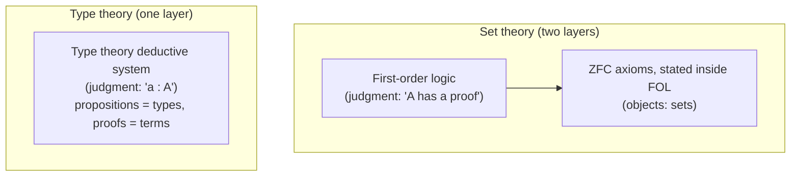

[[book-guidelines|↩ Back to guidelines]]

# Type Theory as a Foundational System

## Why a foundational system needs re-examining at all

Every working mathematician quietly assumes that, in principle, whatever they write down could be cashed out in Zermelo–Fraenkel set theory (ZFC). You don't think about this assumption day to day — it's the background contract that makes "rigorous proof" mean something specific. Homotopy Type Theory (HoTT) proposes a *different* background contract: instead of coding every mathematical object as a set built from $\in$-chains rooted at $\varnothing$, you code it as a **type**, governed by a completely different deductive apparatus.

This isn't cosmetic. Set theory and type theory disagree about something structural: what kind of thing a "statement you can prove" is, and how it relates to the "objects" the statement is about. Getting this distinction precise is the entire content of this topic — and it turns out to be exactly [[Type-Theory-as-a-Foundational-System-Qwen#The distinction|the distinction]] a type checker's kernel has to get right, because a type checker/proof checker *is* an implementation of one of these deductive systems.

## Two-layer vs. one-layer foundations

Set theory has **two layers** stacked on top of each other:

1. First-order logic — the deductive system that tells you how to derive **judgments** of the form "proposition $A$ has a proof."
2. The axioms of ZFC, stated *inside* that logic — pairing, union, power set, replacement, foundation, choice, and so on.

Sets and propositions are therefore two different kinds of thing living at two different layers: propositions are the "moves" of first-order logic, sets are the objects those moves talk about.

Type theory collapses this into **one layer**. There is a single deductive system, and its only basic notion is the **type**. Propositions are not a separate layer above types — they *are* types, via the propositions-as-types correspondence (its own topic, but worth flagging now: it's the reason "prove $A$" and "construct an element of $A$" become the same activity). A "theorem" is nothing but a type that happens to be inhabited, and a "proof" is nothing but a term inhabiting it.



**Why this matters for a kernel:** a proof assistant's trusted kernel is exactly a machine that decides derivability in *one* of these systems. Lean's kernel, Coq's kernel, and the type checker you'd write for a refinement-type compiler are all implementations of the one-layer picture — there is no separate "logic layer" bolted on top; typing *is* the logic. This is why "type checking" and "proof checking" are the same problem in these systems, not two problems that happen to share code.

## The basic judgment: `a : A`

The judgment analogous to "$A$ has a proof" in type theory is written

$$a : A$$

read "the term $a$ has type $A$." Depending on what $A$ is being used to model, this can mean "$a$ is an element of the set $A$" (informally) or, when $A$ represents a proposition, "$a$ is *evidence* that $A$ holds." The crucial difference from set-theoretic membership $a \in A$ is that $\in$ is a *proposition* — something you can assert, negate, or hypothesize — while $a : A$ is a **judgment**: a statement made *about* the formal system, from outside it, that is either derivable or it isn't. You cannot internally write "if $a : A$ then it is not the case that $b : B$"; judgments don't compose into further statements the way propositions do.

A second consequence: in type theory, a term never floats free. "Let $x$ be a natural number" is not sugar for "let $x$ be some thing, and additionally assume $x \in \mathbb{N}$" (two moves, as in set theory) — it is the single atomic judgment $x : \mathbb{N}$. Every term comes typed from the moment it's introduced.

**Rust framing.** This is precisely the difference between a dynamically-checked membership test and a statically-typed binding. `let x: u32 = 5;` doesn't first produce an untyped `5` and then verify `5 ∈ u32` — the compiler never has an untyped `5` to interrogate; `x`'s type is fixed at the point of introduction and threaded through every subsequent judgment about `x`. A `rustc` type error is a *failure to derive a judgment*, not a failed runtime predicate.

## Judgmental equality vs. propositional equality

This is the single most important distinction in the whole chapter, and it's the one that will resurface constantly once you build an elaborator.

Type theory has **two different notions of equality**, living at two different levels:

- **Propositional equality**, written $a =_A b$: this is a *type*. For $a, b : A$, the expression $a =_A b$ is itself a type, and *proving* $a = b$ means exhibiting a term (a witness) that inhabits it. Because it's a type, propositional equality is a proposition in the technical sense — you can hypothesize it, negate it (well, negate its negation), and in HoTT it can have highly nontrivial internal structure (paths, higher paths — the subject of later topics).
- **Judgmental equality** (also called *definitional* equality), written $a \equiv b : A$: this is a **judgment**, at the same level as $a : A$ itself, not a type you inhabit. It means "equal by unfolding definitions." If $f(x) :\equiv x^2$, then $f(3) \equiv 3^2$ holds *by definition* — there is nothing to prove, only definitions to expand. Judgmental equality is decidable by a mechanical (metatheoretic) procedure: normalize both sides and compare.

The book is explicit that you cannot internally negate or hypothesize a judgmental equality — "if $x \equiv y$ then $z \not\equiv w$" is not a statement type theory can even express, because $\equiv$ isn't a type-forming relation, it's a fact about derivability. What judgmental equality *does* do is control the other judgment form: if $a : A$ and $A \equiv B$, then also $a : B$. Definitional unfolding is silently interchangeable everywhere.

**This is exactly `isDefEq`.** If you've looked at how Lean's elaborator works, this section *is* the specification of `isDefEq`: the kernel-level, decidable, no-user-visible-proof-obligation check that two terms reduce to the same normal form. Every time the elaborator needs to check that an inferred type matches an expected type, it is checking judgmental — not propositional — equality first, falling back to unification (metavariable assignment) only when the terms aren't already syntactically/definitionally identical. Propositional equality (`Eq` in Lean, or `a = b : Prop`), by contrast, is a genuine *type* that you construct proof terms for (`rfl`, `Eq.trans`, `Eq.symm`, or a full tactic proof) — it's what a *user* proves, whereas definitional equality is what the *kernel* silently checks on your behalf, for free, without ever surfacing as an obligation.

```lean
-- judgmental/definitional equality: no proof term needed, the kernel just unfolds
example : (fun x => x + 0) 3 ≡ 3 := rfl   -- `rfl` succeeds because both sides
                                            -- normalize to the same term

-- propositional equality: a genuine type, needs an actual (possibly nontrivial) proof
theorem add_comm' (a b : Nat) : a + b = b + a := by
  induction b with
  | zero => rfl
  | succ n ih => simp [Nat.add_succ, ih]
```

Note that `rfl` succeeding on the first example is not a coincidence of tactic convenience — it is *definitionally* how the type checker validates that `3 : Nat` also has type `(fun x => x + 0) 3`'s type without your writing a single line of proof. The moment a propositional-equality proof is required instead (as in `add_comm'`), you've left the free, silent layer and entered the layer where the *user* (or an automated prover) has to do work.

**Why this is load-bearing for a compiler/elaborator project:** a bidirectional type checker's `check(term, expected_type)` mode has to decide, at every application and every let-binding, whether the *inferred* type and the *expected* type are the same type — and "the same" there means judgmentally equal, not propositionally equal. Get this boundary wrong (e.g. by requiring a propositional proof where a definitional unfolding would do, or vice versa) and you either lose decidability of type checking or reject perfectly good programs. This is also precisely the boundary that a refinement-type checker has to draw between what the *kernel* checks automatically (definitional unfolding of refinement predicates) and what has to be discharged by an SMT call (a genuine propositional obligation about the refinement predicate's truth).

## Contexts: judgments under assumptions

Judgments rarely stand alone — they're usually made *under assumptions*. You construct $m + n : \mathbb{N}$ *assuming* $m, n : \mathbb{N}$. The book calls the running collection of such assumptions the **context**, and stresses that a context is technically an *ordered list*: $x : A$ can only be introduced after every variable free in $A$ has already been introduced. Formally this is written $x_1 : A_1, \, x_2 : A_2(x_1), \, \ldots \vdash \Gamma$ — the source book defers this turnstile notation to Appendix A, but it's the standard shape you'll recognize as $\Gamma \vdash a : A$.

Two subtleties the source is careful about, both of which matter enormously for an implementation:

- You *can* assume a **propositional** equality ($p : x = y$ is a perfectly good context entry, since $x = y$ is a type). You *cannot* assume a **judgmental** equality — $x \equiv y$ isn't a type, so there's no context slot for it. The nearest thing to "assuming $x \equiv a$" is *substitution*: replacing the variable $x$ throughout a type or term by the concrete term $a$, wherever $x : A$ was previously in scope.
- Because later context entries can depend on earlier ones (e.g. $y : B(x)$ depends on $x : A$), contexts are not sets of bindings — they're *ordered, dependency-respecting* lists. This is the seed of **dependent types**: a type occurring later in a context can mention a term bound earlier.

**Why this is load-bearing:** context management — insertion, well-formedness (does every free variable in a new entry's type already have a binding?), and substitution under a context — is exactly the plumbing that both (a) an elaborator's local context (the thing metavariables get abstracted over, and the thing pattern unification checks variable-dependency against) and (b) a Hoare-logic soundness proof (substitution lemmas: "if $\Gamma, x:A \vdash e : B$ and $\Gamma \vdash a : A$ then $\Gamma \vdash e[a/x] : B[a/x]$") both rest on. Variable capture bugs in a real implementation are almost always context/substitution bugs of exactly this shape.

**Rust framing** — a minimal context as an implementer would represent it:

```rust
struct Context {
    // ordered: entry i's type may only mention variables 0..i
    entries: Vec<(VarId, Type)>,
}

impl Context {
    fn extend(&self, x: VarId, ty: Type) -> Context {
        debug_assert!(ty.free_vars().iter().all(|v| self.binds(*v)));
        let mut entries = self.entries.clone();
        entries.push((x, ty));
        Context { entries }
    }

    // substitution: replace `x` by `term` throughout, respecting binder scoping
    fn substitute(&self, x: VarId, term: &Term) -> Context { /* ... */ todo!() }
}
```

The `debug_assert!` there is doing, at runtime, exactly the well-formedness check the book states informally: a context is only valid if it respects the dependency order.

## Universes: the type of types, made safe

Once you've said "type theory has one basic notion, the type," a natural question follows: is "type" itself a type? Naively assuming a single universe $\mathcal{U}_\infty : \mathcal{U}_\infty$ (a universe of *all* types, including itself) is **unsound** — it reproduces Russell's paradox internally (Girard's paradox / Coquand's encoding via well-founded trees is the usual culprit), letting you inhabit the empty type and thereby prove anything.

The fix is a **cumulative hierarchy of universes**:

$$\mathcal{U}_0 : \mathcal{U}_1 : \mathcal{U}_2 : \cdots$$

Each $\mathcal{U}_i$ is itself an element of the next one up, $\mathcal{U}_{i+1}$, and **cumulativity** means every type in $\mathcal{U}_i$ is also (re-classified as) a type in $\mathcal{U}_{i+1}$: if $A : \mathcal{U}_i$ then also $A : \mathcal{U}_{i+1}$. This buys you the ability to quantify over "all types" *at a fixed level* without quantifying over the entire universe hierarchy — but it costs you unique typing: a term no longer has one canonical type, since it inhabits every universe level above its "natural" one. Most informal presentations (including the rest of this book) elide the explicit level and just write $A : \mathcal{U}$, called **typical ambiguity** — convenient, but you have to be able to reconstruct consistent level assignments on demand if you suspect an argument is secretly circular.

A **type family** is a function $B : A \to \mathcal{U}$ — a type that varies over elements of $A$, e.g. $\mathrm{Fin} : \mathbb{N} \to \mathcal{U}$ where $\mathrm{Fin}(n)$ has exactly $n$ elements. This is the formal notion underlying **dependent types**: not just "a type depending on a value" as a slogan, but literally a function into a universe.

**Why this is load-bearing:** universe levels are exactly the thing a real dependent-type elaborator has to solve constraints for (Lean, Agda, and Coq all run a universe-level unification/constraint pass alongside term-level unification), and getting cumulativity vs. strict universe polymorphism right determines whether your kernel accepts `Type u -> Type u` style code without spurious level explosions. For a refinement-type compiler this mostly stays in the background (most refinement predicates live at a single, fixed universe of propositions/booleans), but the *type family* reading — $B : A \to \mathcal{U}$ — is precisely the shape of a **dependent function type's codomain**, which is where refinement predicates ($\{x : A \mid \phi(x)\}$ as a $\Sigma$-type with $\phi : A \to \mathrm{Prop}$) come from directly.

## Rules, not axioms

The last structural point the source makes is about *how* type theory is specified at all, and it's a point about deductive-system design, not just a fact about HoTT. A deductive system has:

- **Rules** — ways to derive one judgment from others (like operations in an algebraic theory).
- **Axioms** — judgments simply handed to you at the outset (like generators of a free model).

Set theory lives almost entirely in its axioms: first-order logic supplies the rules, and *all* the content — pairing, union, power set, choice — is axiomatic. Type theory inverts this: the type theory presented in this chapter (before univalence, before [[Higher-Inductive-Types|higher inductive types]]) consists **entirely of rules, with no axioms at all**. Every type former — function types, $\Pi$-types, $\Sigma$-types, coproducts, the naturals — comes with its own formation/introduction/elimination/computation rules, and *that's the whole theory*; nothing is simply postulated to exist.

This matters because rules, unlike axioms, are **procedural** — they tell you an algorithm, not just a fact. This procedurality is what makes properties like *canonicity* (every closed term of type $\mathbb{N}$ reduces to a literal numeral) and *decidable type checking* possible in principle, though not automatic. It's also exactly why the book flags, later, that adding the univalence axiom (a genuine axiom, not a rule) breaks this: you regain expressive power but lose the uniform introduction/elimination structure, and canonicity for univalence-extended type theory was, at the time of writing, an open conjecture of Voevodsky's.

**Why this is load-bearing:** a trusted kernel's soundness argument is only as good as its rule set being closed and its rules being genuinely procedural (each elimination rule computes against the matching introduction rule — the computation rules). If your refinement-type kernel needs to admit an "axiom" (e.g. an SMT-discharged proof obligation accepted without a rule-level derivation), you have deliberately punched a hole in the closed rule-based picture — which is fine, but it's the exact same kind of hole univalence punches here, and it deserves the same scrutiny: does it preserve consistency, does it preserve (some form of) canonicity for the fragment that doesn't touch it, and is the hole confined to a clearly demarcated part of the trusted computing base?

## Where this leads

This chapter's five ideas — judgments vs. propositions, judgmental vs. propositional equality, contexts, universes, and rules-not-axioms — are the vocabulary every later chapter assumes without re-deriving. Concretely:

- The **propositions-as-types correspondence** (next topic) is the direct payoff of collapsing set theory's two layers into type theory's one.
- **[[Identity-Types-and-Path-Structure|Identity types and path structure]]** reopens propositional equality $a =_A b$ specifically, giving it the homotopical reading (a *path* $a \leadsto b$) that the rest of the book is built on — this section deliberately stayed at the "equality is a type, full stop" level so that the path-space reinterpretation has something precise to reinterpret.
- **The univalence axiom** is exactly the "genuine axiom, not a rule" case flagged above, generalized: it says $(A =_\mathcal{U} B) \simeq (A \simeq B)$, an axiom about the universe's own identity type, deliberately punching the kind of hole this section warned you to scrutinize.
- For the compiler project specifically: this topic *is* the boundary between the parts of a dependent-type checker that run silently and automatically (definitional equality, rule-driven type formation) and the parts that require explicit proof construction or external solving (propositional equality, axioms) — every later design decision about what the elaborator can decide on its own versus what it has to hand off to unification, tactics, or an SMT solver traces back to this split.
