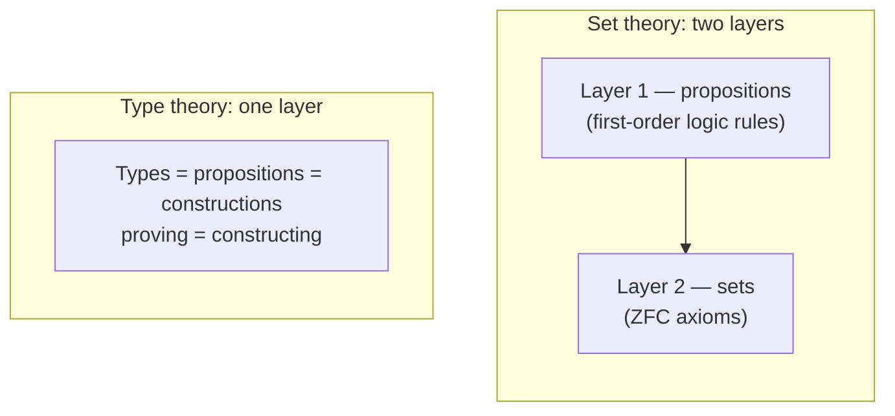
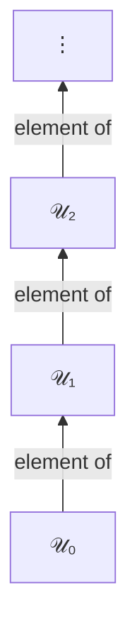
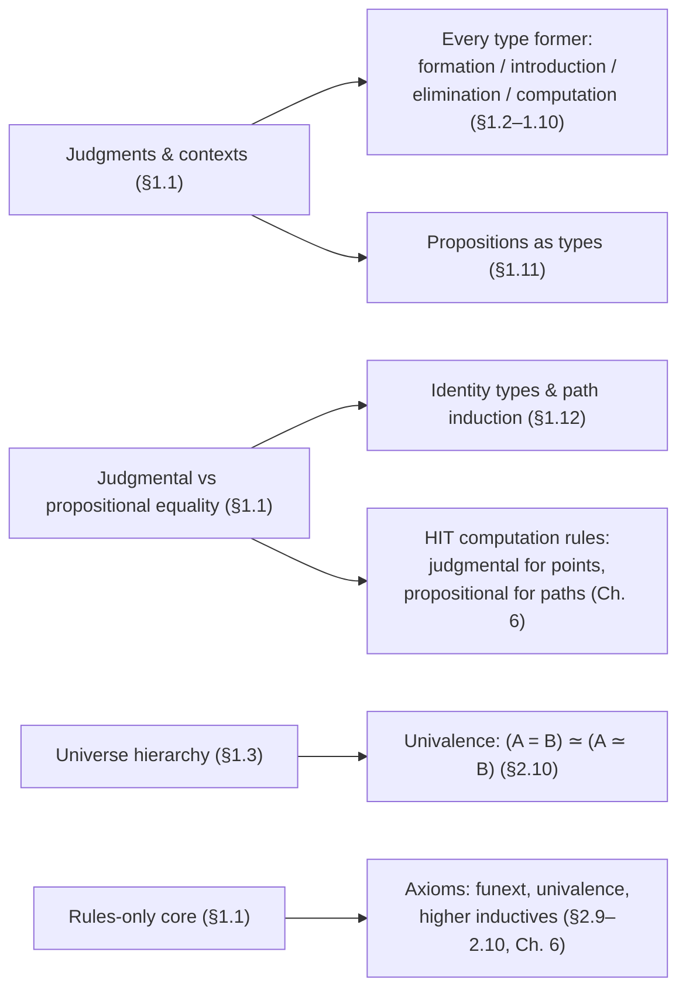

Part of the [[book-guidelines|HoTT study map]] — Chapter 1, §1.1 & §1.3.

# Type Theory as a Foundational System

The book opens Chapter 1 with a warning: type theory "behaves differently from set theory in several important ways, and that can take some getting used to," so the authors will be *more formal* here than anywhere else in the book. That's a signal worth taking seriously. This chapter isn't a warm-up; it specifies the **shape of the machine** that every later construction runs on. Get the shape wrong and the univalence axiom, higher inductive types, and everything in Part II will read as arbitrary symbol-pushing. Get it right and they become almost inevitable.

There are five ideas doing all the load-bearing work:

1. Foundations as **one layer** instead of two.
2. **Judgments** ($a : A$) as something other than propositions ($a \in A$).
3. **Two different equalities** — judgmental ($\equiv$) and propositional ($=$).
4. **Contexts** as the ordered environment in which judgments hold.
5. **Universes** as the disciplined way to talk about "all types."

We'll take them in order, each with the problem it solves first and the notation second.

---

## One layer instead of two

**The problem.** Set-theoretic foundations have *two layers*. Layer one is the deductive system of first-order logic: propositions, connectives, quantifiers, rules like "from $A$ and $B$ infer $A \land B$." Layer two is the actual theory of sets (say ZFC), formulated *inside* that logic: sets, membership, and axioms like Pairing and Choice. Proving a theorem means mixing both layers constantly — logic provides the reasoning machinery, set theory provides the objects.

Type theory collapses this to **one layer**. There is only one kind of object — *types* — and propositions are identified with particular types. The mathematical activity of *proving a theorem* becomes a special case of the mathematical activity of *constructing an object*: to prove proposition $A$ is to construct an inhabitant of the type $A$.



The book's Table 1 (p. 11) is the translation dictionary: $\land$ becomes product, $\lor$ becomes coproduct, $\exists$ becomes $\Sigma$-type, $\forall$ becomes $\Pi$-type, equality becomes the identity type. We'll meet the full table later (§1.11); right now the point is only architectural.

**Why bother collapsing the layers?** Because the two-layer design inherits a wart: in first-order logic, the judgment "$A$ has a proof" lives at a *different level* from the proposition $A$ itself. The logic talks *about* propositions from the outside. Type theory makes that external talk into internal structure: the basic act of the system — "$a$ has type $A$" — is simultaneously "a proof of proposition $A$" when $A$ is being used as a proposition. One mechanism, two readings.

### What breaks without this

Nothing technically fails if you keep two layers — set theory works fine. What you lose is *uniformity*. Every later chapter of this book exploits the fact that "build a program" and "prove a theorem" are the same operation: a verified program *is* a proof, a proof *is* a program you can run. That identity is impossible to even state in a two-layer foundation where proofs live in the meta-language and objects live in the object language.

---

## Judgments: what the machine actually checks

Now the single most important distinction in the whole book, and the one set-theoretic intuition most reliably sabotages.

### The basic judgment

The fundamental act of type theory is written:

$$a : A$$

and pronounced "the term $a$ has type $A$" (or loosely, "$a$ is an element of $A$"). This is a **judgment**, not a proposition.

**What is a judgment?** The book gives two mental pictures. Picture one: a deductive system is a formal *game*, and judgments are the *positions* you reach by following the rules. Picture two: a deductive system is an algebraic theory, and judgments are its *elements* (like elements of a group), with the deductive rules as the operations. Either way, judgments are the things you *derive*, sitting in the metatheory — they are not internal statements of the theory.

The contrast with set theory is sharp:

- In set theory, $a \in A$ is a **proposition**: a relation that may or may not hold between two *pre-existing* objects $a$ and $A$. You can prove it, disprove it, assume it, negate it.
- In type theory, $a : A$ is a **judgment**. You can derive it or fail to derive it — and that's it. As the book puts it, you cannot say "if $a : A$ then it is not the case that $b : B$," and you cannot "disprove" $a : A$.

And there's a deeper shift hiding in the notation: **there are no typeless elements.** In set theory, "let $x$ be a natural number" is shorthand for "let $x$ be a *thing*, and assume $x \in \mathbb{N}$." In type theory, "let $x : \mathbb{N}$" is *atomic* — you cannot introduce a variable without specifying its type, and every element's type is (generally) uniquely determined by the element itself.

### Grounding it in tools you already know

The judgment/proposition distinction is not philosophical garnish; it's the difference between *compile time* and *runtime*, and between the *kernel* and the *proof language*.

In **Rust**, `let x: u32 = 4;` is checked by the compiler and then *gone* — you cannot write an expression that asks "is it the case that `x: u32`?", negate it, or branch on it. It is a well-formedness condition on the program, not a value inside the program. A type error isn't a `false` you can inspect; it's a program that never was.

In **Lean**, judgments are literally what the kernel prints:

```lean
#check 42          -- 42 : Nat
#check Nat         -- Nat : Type
#check Type        -- Type : Type 1      ← the universe hierarchy, live
#check fun x => x  -- fun x => x : ?m.1 → ?m.1   ← unresolved metavariables!
```

That last line is worth pausing on: `?m.1` is a **metavariable** — a hole the elaborator must fill. The fact that a simple identity function elaborates through unification against unknown types is the entire seed of the elaborator project you're building toward. Everything that follows in this chapter (definitional equality, contexts, universes) is machinery that `isDefEq` and friends run on top of.

### A tiny judgment engine in Rust

Here is the judgment $a : A$, the context, and the distinction between inference and checking, as real (if miniature) code. This is the skeleton of every type checker *and* every proof checker:

```rust
#[derive(Debug, Clone, PartialEq, Eq)]
enum Ty {
    Nat,
    Arrow(Box<Ty>, Box<Ty>),
}

#[derive(Debug, Clone)]
enum Tm {
    Var(String),
    Zero,
    Succ(Box<Tm>),
    Lam(String, Ty, Box<Tm>),
    App(Box<Tm>, Box<Tm>),
}

/// The context Γ: an *ordered* list of (variable, type) assumptions.
/// Order matters: later assumptions may depend on earlier ones.
struct Ctx(Vec<(String, Ty)>);

impl Ctx {
    fn empty() -> Self { Ctx(vec![]) }

    fn lookup(&self, x: &str) -> Option<&Ty> {
        // Most recent binding wins (shadowing).
        self.0.iter().rev().find(|(name, _)| name == x).map(|(_, ty)| ty)
    }

    fn extend(&self, x: String, ty: Ty) -> Ctx {
        let mut v = self.0.clone();
        v.push((x, ty));
        Ctx(v)
    }
}

/// The judgment "Γ ⊢ t : A", in inference mode: synthesize A.
fn infer(ctx: &Ctx, t: &Tm) -> Result<Ty, String> {
    match t {
        Tm::Var(x) => ctx.lookup(x).cloned()
            .ok_or_else(|| format!("unbound variable: {x}")),
        Tm::Zero => Ok(Ty::Nat),
        Tm::Succ(t) => { check(ctx, t, &Ty::Nat)?; Ok(Ty::Nat) }
        Tm::Lam(x, dom, body) => {
            let cod = infer(&ctx.extend(x.clone(), dom.clone()), body)?;
            Ok(Ty::Arrow(Box::new(dom.clone()), Box::new(cod)))
        }
        Tm::App(f, arg) => match infer(ctx, f)? {
            Ty::Arrow(dom, cod) => { check(ctx, arg, &dom)?; Ok(*cod) }
            other => Err(format!("attempted to apply non-function: {other:?}")),
        },
    }
}

/// The judgment "Γ ⊢ t : A", in checking mode: verify against a given A.
fn check(ctx: &Ctx, t: &Tm, expected: &Ty) -> Result<(), String> {
    let actual = infer(ctx, t)?;
    if &actual == expected {
        Ok(())
    } else {
        Err(format!("expected {expected:?}, got {actual:?}"))
    }
}
```

Notice two things. First, `infer`/`check` *return `Result`* — a judgment is a decidable relation, not a boolean property of bare terms. "Is `Var("x")` well-typed?" is a malformed question; only "is it well-typed *in context Γ*?" is. Second, the `infer`/`check` split is already **bidirectional typing** — inference synthesizes a type, checking verifies against an expected one. Your elaborator target is precisely this skeleton, enriched with metavariables and a definitional-equality step where this code uses `==`.

### What breaks without this

Treat $a : A$ as a proposition and you immediately get grammatical sentences that are nonsense ("assume $a : A$; then it is not the case that $b : B$"), and worse, you re-open the door to Russell-style paradoxes — elements floating free of types, collections formed of arbitrary things. Historically this isn't hypothetical: **Russell invented type theory precisely to block these paradoxes** (the book notes this in its history of type theory, p. 2). The judgment discipline is the scar tissue.

---

## Two equalities: definitional vs. propositional

If the last section was the chapter's most important distinction, this one is the most *consequential* — it determines what your proof assistant can compute, what your elaborator can solve, and (later) whether univalence is even consistent.

### Propositional equality: equality as a type

In set theory, equality is a proposition: you can prove $a = b$, disprove it, assume it as a hypothesis. Since propositions are types, equality must be a **type**: for $a, b : A$ there is a type

$$a =_A b$$

whose inhabitants are *proofs* that $a$ equals $b$. When $a =_A b$ is inhabited, $a$ and $b$ are **propositionally equal**.

This equality is proof-relevant: there can be *many* different inhabitants of $a =_A b$, and which one you have can matter. (In homotopy type theory they're paths — but that's Chapter 2's business.)

### Judgmental equality: equality as computation

But the system also needs an equality that lives at the *judgment* level, alongside $a : A$. This is **judgmental** or **definitional equality**, written

$$a \equiv b : A \qquad \text{or simply} \qquad a \equiv b$$

The intuition the book gives: $a \equiv b$ means **"equal by definition."** If you define $f : \mathbb{N} \to \mathbb{N}$ by $f(x) :\equiv x^2$, then $f(3)$ is equal to $3^2$ *by definition* — no proof required, no inhabitant constructed. The symbol $:\equiv$ means "I am introducing a definitional equality," i.e., a definition.

Three properties make judgmental equality a different beast from propositional equality:

1. **It's not internal.** You cannot negate it, assume it as a hypothesis, or prove it inside the theory. "Whether or not two expressions are equal by definition is just a matter of expanding out the definitions."
2. **It's algorithmically decidable** — there is a (meta-theoretic) procedure that settles it. Propositional equality is decidedly not decidable in general.
3. **It controls conversion.** Its whole job is to govern the other judgment: from $a : A$ and $A \equiv B$, you may derive $a : B$.

### The motivating example, straight from the book

Why do we need the definitional notion at all? Suppose you've proved $3^2 = 9$, i.e. you have a term $p : (3^2 = 9)$. Then the *same witness* $p$ ought to count as a proof that $f(3) = 9$, since $f(3)$ **is** $3^2$ by definition. The cleanest way to make that true is not some elaborate axiom about $f$ — it's the conversion rule: judgmental equality lets the type checker silently rewrite goals.

A technical note worth absorbing: the symbols $:$ and $\equiv$ **bind more loosely than anything else**. So "$p : x = y$" parses as "$p : (x = y)$" — a term inhabiting an equality type — and never as "$(p : x) = y$", which is ill-formed because $p : x$ is a judgment and judgments can't be equal to anything.

### The Lean view: `rfl` is where the two equalities meet

Lean makes the division of labor concrete. Definitional equality is what the kernel decides by unfolding definitions and reducing; the proof term `rfl` is *accepted* exactly when both sides are definitionally equal:

```lean
-- Definitional: both sides compute to the same normal form.
example : 2 + 2 = 4 := by rfl
example : (fun x : Nat => x + x) 2 = 2 + 2 := by rfl   -- β-reduction
example (n : Nat) : n + 0 = n := by rfl                -- add recurses on arg 2
example (n : Nat) : n + 1 = Nat.succ n := by rfl

-- NOT definitional for generic n: `1 + n` is stuck while n is unknown.
-- This needs a real (propositional) proof.
example (n : Nat) : n + 1 = 1 + n := by
  induction n with
  | zero     => rfl
  | succ n ih => simp [ih]   -- the tactic is beside the point; a proof is required
```

This mirrors the book's own observation (Notes, p. 54): even the trivial commutativity $n + 1 = 1 + n$ is *not* judgmental for a generic $n$ — though it is judgmental for any *specific* $n$, since then both sides compute (e.g. $3 + 1 \equiv 4 \equiv 1 + 3$).

> **Load-bearing for your elaborator goal:** the kernel's definitional check has an elaborator-side cousin, **`isDefEq`** — the same question ("do these reduce to the same thing?") generalized to terms containing metavariables. When Lean elaborates `fun x => x` into `?m.1 → ?m.1`, it's solving constraints *up to definitional equality*. Everything in this section is the spec that `isDefEq` implements.

### The Rust view: normalization vs. verified properties

The same split appears in your compiler target. *Definitional* equality is constant folding, β-reduction, normalization — mechanical, terminating-by-construction rewriting you do at compile time without asking anyone's permission. *Propositional* equality is what your verifier's theorem prover establishes: "this program's output equals that specification," a claim with a proof object attached. If you blur these in the toolchain, either your compiler starts needing a theorem prover to compile `2 + 2` (unworkable), or your verifier can only prove things the constant folder can see (useless).

### What breaks without this

Both collapse directions are instructive, and the book's Notes are explicit about them:

- **Collapse propositional into judgmental** (add a *reflection rule*: $p : x = y$ implies $x \equiv y$). This is extensional type theory. Every type becomes homotopically discrete — a set with no higher path structure — which is **inconsistent with univalence** (Example 3.1.9 gives a path in the universe that isn't reflexivity). The entire homotopical content of the book dies.
- **Collapse judgmental into propositional** (no definitional equality at all). Now the conversion rule needs a proof term every time you rewrite, type-checking stops being decidable, and the "procedural" character of the system — the thing that makes it a programming language — evaporates.

Two equalities isn't a wart. It's the only configuration where both computation and proof-relevance survive.

---

## Contexts: the environment judgments live in

Judgments don't hold simpliciter; they hold *under assumptions*. The collection of assumptions is the **context**, and it's the plumbing underneath everything — dependent types, substitution, and eventually both of your target systems.

### The definition

A **context** is a list of assumptions like

$$x_1 : A_1,\; x_2 : A_2,\; \dots,\; x_n : A_n$$

under which a judgment may be derived — for instance, building $m + n : \mathbb{N}$ under assumptions $m : \mathbb{N}, n : \mathbb{N}$. Written formally (in the style of Appendix A): $\Gamma \vdash a : A$, read "in context $\Gamma$, term $a$ has type $A$." The book adds a lovely topological gloss: think of the context as a **parameter space**.

Two structural facts matter:

1. **The context is an ordered list, not a set.** Later assumptions may *depend* on earlier ones: the assumption $x : A$ can only be made after the assumptions for any variables appearing in the type $A$. This is what "dependent types" mechanically means — types that mention earlier variables.
2. **Assumptions whose type is a proposition act as hypotheses.** Assuming $p : x =_A y$ is assuming an equality, in the ordinary mathematical sense. But note the asymmetry from the previous section: you can assume a *propositional* equality (it's a type, it can have inhabitants), but you **cannot assume a judgmental equality** — it's not a type. The closest substitute is *substitution*: replacing a variable by a specific term, in language the book sanctions as "now assume $x \equiv a$."

### Why order and binding discipline are not pedantry

The book's §1.2 example of what goes wrong with naive substitution is worth knowing cold. Define $f : \mathbb{N} \to (\mathbb{N} \to \mathbb{N})$ by $f(x) :\equiv \lambda y.\, x + y$. Now: what is $f(y)$, assuming somewhere that $y : \mathbb{N}$?

Naïvely substituting gives $\lambda y.\, y + y$ — **wrong**. The substituted $y$ was referring to our assumption; after substitution it refers to the λ-bound argument. The variable got **captured**, the binding structure was destroyed, and "calculations which are semantically unsound" become possible. The correct answer is $\lambda z.\, y + z$ — rename the bound variable first (α-conversion).

The same phenomenon is why your Rust checker's `extend` above pushes onto an *ordered* list with shadowing lookup, and why any Hoare-logic soundness proof you'll ever write lives or dies on substitution lemmas. When the learning-goals note says substitution and context management are "the recurring plumbing under both Hoare-logic soundness proofs and elaboration," this paragraph is the concrete referent.

### What breaks without this

Without ordered contexts: dependent types like $B(x)$ can't even be stated well-formed (what is $B$ applied to a variable that isn't in scope?). Without binding discipline: capture-avoidance fails, substitution becomes unsound, and every metatheoretic proof (type preservation, soundness of your verifier) collapses. These failures are silent in examples and catastrophic in proofs — exactly the class of bug that makes formal metatheory worth doing.

---

## Universes: types of types, carefully

We've been saying "$A$ is a type" informally. Time to make it precise — and to meet the first place where naïve type theory explodes.

### The hierarchy

We'd love a universe of all types, $\mathcal{U}_\infty$, with $\mathcal{U}_\infty : \mathcal{U}_\infty$. **This is unsound**: the book states plainly that from it "we can deduce that every type, including the empty type representing the proposition False, is inhabited" — e.g., by encoding Russell's paradox directly (Girard's paradox in the type-theoretic setting). So instead: a **hierarchy of universes**,

$$\mathcal{U}_0 : \mathcal{U}_1 : \mathcal{U}_2 : \cdots$$

where each universe is an element of the next. A type $A$ "is a type" by virtue of inhabiting *some* $\mathcal{U}_i$. Types belonging to a universe $\mathcal{U}$ under discussion are called **small types**.



The book adopts **cumulativity**: if $A : \mathcal{U}_i$ then also $A : \mathcal{U}_{i+1}$. Convenient, and the book honestly flags the cost — "elements no longer have unique types." (If unique types matter to you, this is the first of several places where HoTT chooses ergonomics over a set-theoretic nicety.)

### Typical ambiguity: levels you don't write

Tracking indices everywhere is misery, so the book writes $A : \mathcal{U}$ with the level suppressed, trusting that levels "can be assigned in a consistent way." You may even write $\mathcal{U} : \mathcal{U}$, silently read as $\mathcal{U}_i : \mathcal{U}_{i+1}$. This convention is called **typical ambiguity**, and the book's warning is worth quoting: it's "convenient but a bit dangerous, since it allows us to write valid-looking proofs that reproduce the paradoxes of self-reference. If there is any doubt about whether an argument is correct, the way to check it is to try to assign levels consistently to all universes appearing in it."

If that "omit the indices, let the machine reconstruct them, occasionally get burned" pattern sounds familiar: it's the exact social contract of **Rust lifetime elision**, and of Lean's universe metavariables (`Type` elaborating to `Type u` with `u` to be solved). The analogy holds all the way down to the failure mode — the fix is always to write the indices out.

### Type families: dependent functions into a universe

With universes in hand, the book defines a **family of types** (or dependent type) over $A$ as a function $B : A \to \mathcal{U}$: to each element of $A$ it assigns a type. Examples: $\mathrm{Fin} : \mathbb{N} \to \mathcal{U}$ (finite sets of each size) and the constant family $\lambda (x : A).\, B$.

And a non-example that clarifies the whole setup: there is **no** family $\lambda (i : \mathbb{N}).\, \mathcal{U}_i$ — no universe large enough to be its codomain. Universe indices are not natural numbers of the theory; they are meta-level bookkeeping. That single non-example quietly encodes the entire paradox-avoidance strategy.

### What breaks without this

$\mathcal{U}_\infty : \mathcal{U}_\infty$ gives you an inhabited empty type — total inconsistency, and not in some exotic corner: the derivation is short enough that Coq formalized it as an exercise in the 1990s. The hierarchy isn't a stylistic choice; it's the price of having "the type of all (small) types" mean anything at all. Later, univalence (§2.10) will be stated *about a universe* $\mathcal{U}$ — so this discipline is also what makes the book's central axiom well-formed.

---

## Rules, not axioms — until further notice

Last architectural decision, and the one whose absence you'll feel hardest in Chapters 2 and 6.

### The distinction

In a deductive system:

- **Rules** let you conclude one judgment from others. (Game metaphor: the rules of the game. Algebra metaphor: the operations.)
- **Axioms** are judgments *given at the outset*. (Game metaphor: the starting position. Algebra metaphor: generators of a free model.)

Set theory puts everything into axioms: first-order logic contributes only generic rules, and all information about sets lives in ZFC's axioms. **Type theory inverts this**: information lives in the *rules*. There's no Pairing axiom; instead there's a *rule* saying that from $a : A$ and $b : B$ you may derive $(a, b) : A \times B$:

<svg viewBox="0 0 440 120" xmlns="http://www.w3.org/2000/svg" role="img" aria-label="Pairing inference rule as a derivation tree">
  <text x="120" y="38" text-anchor="middle" font-family="monospace" font-size="15" fill="#222222">a : A</text>
  <text x="255" y="38" text-anchor="middle" font-family="monospace" font-size="15" fill="#222222">b : B</text>
  <line x1="50" y1="54" x2="330" y2="54" stroke="#707070" stroke-width="1.5"/>
  <text x="345" y="59" font-family="sans-serif" font-style="italic" font-size="13" fill="#555555">(pair)</text>
  <text x="190" y="90" text-anchor="middle" font-family="monospace" font-size="15" fill="#222222">(a, b) : A × B</text>
</svg>

### Why rules? Because rules are procedural

The book's sentence to underline: "The advantage of formulating type theory using only rules is that rules are 'procedural.' In particular, this property is what makes possible (though it does not automatically ensure) the good computational properties of type theory, such as 'canonicity'."

**Canonicity**: every closed term of type $\mathbb{N}$ reduces to an actual numeral. From rules-only structure you get normalization, which gives decidable type-checking ("we should be able to recognize a proof when we see one"), which gives canonicity. This chain is why type theory doubles as a programming language and why proof checking is a mechanical affair.

### The punchline the chapter is setting up

Chapter 1 is rules-only — but **homotopy type theory is not**. The whole book hinges on adding axioms back in: function extensionality (§2.9), univalence (§2.10), higher inductive types (Chapter 6). And axioms are *not* procedural: an axiom is "an 'atomic' element that is declared to inhabit some specified type, without there being any rules governing its behavior." Add them carelessly and canonicity breaks — a closed $\mathbb{N}$-term may no longer compute to a numeral. The book names this tension explicitly: **the constructivity/canonicity of univalence is the most pressing open problem** of the field (Voevodsky's conjecture, pp. 11–12).

So Chapter 1's rules-only presentation isn't naive; it's the *baseline* whose properties make the later axioms meaningful — and whose partial loss makes those axioms interesting.

### What breaks without this

If you never add axioms: you get ordinary Martin-Löf type theory, which — as the book is frank about — cannot prove function extensionality or univalence, cannot identify isomorphic structures, and cannot describe spheres. If you add axioms without caring whether they preserve computation: you lose the procedural character, canonicity fails, and the system stops being usable as a programming language or a mechanically checkable foundation. HoTT's research program is, in one line, *getting the axioms without paying more computational price than necessary*.

---

## Where this leads

Everything downstream in the book is built from these five pieces:



For your two targets, this chapter is maximally load-bearing — not background, but the actual spec:

- **The Rust verifier:** judgment forms and typing rules are the shared ancestor of "a type checker" and "a proof checker," and this chapter is where that identity is stated outright — checking a proof *is* type-checking. The `Ctx`/`infer`/`check` skeleton above, with richer type formers and logical state carried in the context, is your toolchain's core loop. Hoare-triple contexts are typing contexts wearing a different hat.
- **The elaborator:** the two-equality split is `isDefEq`'s job description — definitional equality as the fast decidable check with metavariables layered on top, propositional equality as what the prover searches for. Contexts are the environment unification happens in; capture-avoiding substitution is the correctness condition your unifier must never violate.

Next in sequence: **§1.2–1.10**, where each type former is specified by the four-part rule pattern this chapter introduces (formation / introduction / elimination / computation) — the pattern you'll be pattern-matching against for the rest of the book.

---

[[book-guidelines|↩ Back to guidelines]]
```

**Notes on this generation:**
- **Guidelines match:** Topic List entry "Type Theory as a Foundational System" → Chapter 1; primary sources §1.1 (pp. 17–21) and §1.3 (pp. 24–25), with the Chapter Notes (pp. 54–56) drawn on for the extensional/intensional collapse discussion.
- **Style applied:** Lean promoted to a primary grounding language (source material is exactly the type-theoretic/elaboration-shaped case `article-style.md` describes); Rust primary for the checker-shaped context/judgment machinery; Python skipped as no load-bearing use existed.
- **Learning-goals flags:** three explicit callouts — `isDefEq` (definitional equality thread), bidirectional `infer`/`check` (bidirectional typing thread), and substitution/context plumbing (Hoare-soundness thread). Judgment-as-shared-ancestor made explicit in the synthesis.
- **Checklist coverage:** all five sub-items of the guidelines' topic entry (two foundations, two equalities, contexts/dependent types, universes/cumulativity, rules vs axioms) plus all Key Questions relevant to this chapter's foundational sections.