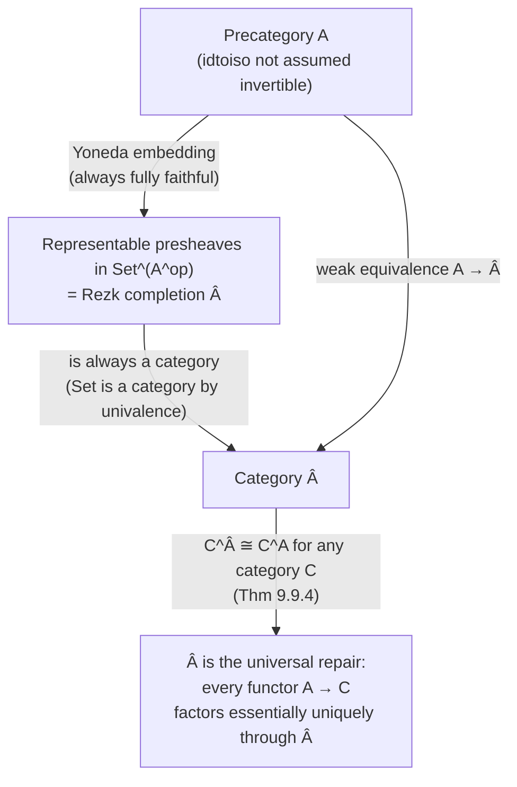

# Univalent Category Theory

[[book-guidelines|↩ Back to guidelines]]

## The problem: category theory doesn't believe in equality

Ordinary set-theoretic category theory has an open secret: almost nothing you ever prove about a category cares about the *literal* identity of its objects. You never ask "is the object $\mathbb{Z}$ equal to the object $\mathbb{Q}$" — you ask whether there's an isomorphism between them, and if there is, you treat them as interchangeable for every categorical purpose. Equality of objects, as a notion, is present in the definition (objects form a set or a class) but essentially never *used*. Category theorists have known this for decades; it's why "equal up to isomorphism" is treated as good enough everywhere in practice, even though set theory offers no formal license for that laxity — in ZFC, isomorphic sets are still different sets, full stop.

This is exactly the tension that [[The-Univalence-Axiom-and-Its-Consequences|the univalence axiom]] resolves for *types*: it identifies the path type $A =_{\mathcal{U}} B$ with the type of equivalences $A \simeq B$, so that "equal" and "interchangeable" become literally the same notion. Chapter 9 asks whether the same move can be made for categories, and answers yes — with a specific, checkable condition on when it applies. As the book puts it, opening the chapter: category theory "is one which perhaps fits the least comfortably in set theoretic foundations," precisely because it's invariant under a weaker notion of sameness (isomorphism) than the ambient foundation's notion of equality — and univalent foundations is built to fix exactly this kind of mismatch.

**What breaks without this move.** If equality of objects and isomorphism of objects stay separate, you get two kinds of unpleasant friction. First, philosophical noise: every categorical construction has to be accompanied by an unstated disclaimer that "of course we mean up to isomorphism," because the formal notion of equality is stricter than the one anybody actually reasons with. Second — and this is the sharper, more technical problem — the single most useful theorem in all of category theory, "a fully faithful and essentially surjective functor is an equivalence of categories," turns out to be *equivalent to the axiom of choice* when objects form a literal set in the classical sense. Univalent foundations gets to choose whether to inherit that dependency, and Chapter 9's central achievement is showing it doesn't have to.

## Precategories: mimicking the classical definition, cautiously

The book starts conservatively. Ignoring size issues, a set-based category is a set $A_0$ of objects and, for each $x, y \in A_0$, a set $\hom_A(x, y)$ of morphisms. Under dependent types the natural thing is a type $A_0$ of objects and, for each $a, b : A_0$, a type family of morphisms. If you let those hom-types carry arbitrary higher homotopy you'd be defining an $(\infty, 1)$-category — a much bigger project. Chapter 9 restricts to ordinary 1-categories, so it requires each $\hom_A(a, b)$ to be a *set* (a 0-type, no higher paths). With no further conditions on $A_0$, this gives:

> **Definition 9.1.1 (Precategory).** A precategory $A$ consists of:
> (i) a type $A_0$ of objects (write $a : A$ for $a : A_0$);
> (ii) for each $a, b : A$, a **set** $\hom_A(a, b)$ of morphisms;
> (iii) an identity morphism $1_a : \hom_A(a, a)$ for each $a : A$;
> (iv) composition $\hom_A(b,c) \to \hom_A(a,b) \to \hom_A(a,c)$, written $g \circ f$ or $gf$;
> (v) unit laws $f = 1_b \circ f = f \circ 1_a$;
> (vi) associativity $h \circ (g \circ f) = (h \circ g) \circ f$.

This is deliberately just the classical axioms, restated with dependent hom-types. The interesting part is what happens next.

**[[Homotopical-Interpretation-of-Type-Theory#Grounding|Grounding]] (Rust).** A precategory is close to a trait describing a graph with typed composition — think of `hom_A(a, b)` as a set of "proof objects" that a morphism exists, constrained so any two proofs of `hom_A(a,b)` compose associatively:

```rust
trait Precategory {
    type Obj;
    type Hom<A, B>: Eq;              // hom_A(a,b) must be a *set*: at most
                                       // one path between any two elements
    fn id<A>() -> Self::Hom<A, A>;
    fn compose<A, B, C>(g: Self::Hom<B, C>, f: Self::Hom<A, B>) -> Self::Hom<A, C>;
    // unit and associativity laws are proof obligations, not enforced by the type checker
}
```
The `Eq` bound on `Hom<A,B>` is doing real work: it's the "hom-sets are sets" condition (9.1.1(ii)), and it's what will make identity of morphisms a mere proposition later.

## Two notions of sameness, and the map between them

Here's the wrinkle that pure precategories inherit from ordinary mathematics: for objects $a, b : A$, there are *two* candidate notions of "the same." There's the type-theoretic one, $a = b$ (a path in $A_0$), and there's the categorical one:

> **Definition 9.1.2 (Isomorphism).** A morphism $f : \hom_A(a,b)$ is an isomorphism if there's $g : \hom_A(b,a)$ with $g \circ f = 1_a$ and $f \circ g = 1_b$. Write $a \cong b$ for the type of such isomorphisms.

**Lemma 9.1.3** shows "$f$ is an isomorphism" is always a mere proposition (any two witnessing inverses $g, g'$ are equal — a short calculation using that hom-sets are sets), so $a \cong b$ is itself a set. Good: isomorphism, like equality, is a well-behaved (proof-irrelevant) notion of sameness, not a structure you carry around.

Now the crucial construction — the categorical analogue of `idtoeqv` from [[Formal-Metatheory#Univalence|univalence]]:

> **Lemma 9.1.4 (idtoiso).** For a precategory $A$ and $a, b : A$: $(a = b) \to (a \cong b)$.

*Proof:* by path induction, assume $a \equiv b$; then $1_a : \hom_A(a,a)$ is trivially an isomorphism. This is *unconditional* — it needs no axiom, exactly like `idtoeqv` needed none. Equality always gives you an isomorphism (just not, in general, the other way).

The book immediately flags the parallel explicitly: this is *exactly* the same situation that motivated univalence. In fact, **Example 9.1.5** makes the connection precise — the precategory $\mathbf{Set}$, with objects the sets of some universe and $\hom(A,B) :\equiv A \to B$, has `idtoiso` from Lemma 9.1.4 equal (restricted to sets) to `idtoeqv` from §2.10. Category theory's "isomorphism vs. equality" problem *is* univalence's "equivalence vs. equality" problem, one level up.

> **Definition 9.1.6 (Category).** A precategory is a **category** if for all $a, b : A$, the function $\mathrm{idtoiso}_{a,b}$ is an equivalence.

So a category is a precategory satisfying its own miniature univalence axiom — one instance of it per object-pair, generalized in §9.8 into the structure identity principle. **Example 9.1.7**: the univalence axiom for types immediately implies $\mathbf{Set}$ is a category, and (by the same mechanism) any precategory of set-level structures — groups, rings, topological spaces — is a category. **Lemma 9.1.8**: in a category, the type of objects is automatically a 1-type (a groupoid, no higher structure), because $a = b$ is equivalent to the set $a \cong b$.

The book names $\mathrm{isotoid} : (a \cong b) \to (a = b)$ for the inverse of `idtoiso`, and records its compatibility with composition: $\mathrm{idtoiso}(p^{-1}) = \mathrm{idtoiso}(p)^{-1}$, $\mathrm{idtoiso}(p \cdot q) = \mathrm{idtoiso}(q) \circ \mathrm{idtoiso}(p)$, and dually for `isotoid` — concatenating paths of objects corresponds to composing isomorphisms, contravariantly. There's also a naturality fact, Lemma 9.1.9, that will do the heavy lifting later: transporting a morphism $f$ along paths $p : a = a'$ and $q : b = b'$ is the same as conjugating it by the corresponding isomorphisms, $(p,q)_* (f) = \mathrm{idtoiso}(q) \circ f \circ \mathrm{idtoiso}(p)^{-1}$.

**Worked examples the book gives, worth keeping in mind:**
- A **preorder** is a precategory where every hom-set is a mere proposition — this recovers "$a \le b$" reflexive/transitive. It's a category exactly when the underlying type is a set and $\le$ is antisymmetric: a **poset**.
- Any 1-type $X$ gives a category with $\hom(x,y) :\equiv (x = y)$; when $X$ is a set this is the *discrete category*, and in general a *groupoid*.
- The precategory with objects $X$ and $\hom(x,y) :\equiv \|x=y\|_0$ (the 0-truncated path space) is the *fundamental pregroupoid*.
- $\mathbf{Rel}$, the precategory of sets and relations, turns out — with some legwork the book carries out via propositional truncation — to be a genuine category, not merely a precategory.

**Grounding (Lean).** `idtoiso` versus `isotoid` is a strict analogue of `Eq.mpr`/`Eq.mp` versus `cast`-based coercions built from a proof of isomorphism rather than a proof of `Eq`. The condition "idtoiso is an equivalence" is the categorical cousin of what makes a Lean structure well-behaved under `Quotient` or `Subtype` reasoning: you want propositional equality of the packaged structure to coincide *exactly* with the natural notion of "same underlying data, compatibly related," with no slack in either direction. This is the same shape of problem your project's `Quotient` handling has to get right — a quotient type is only well-founded for reasoning if "equal in the quotient" tracks "related by the equivalence relation" with no gap.

## Functors and natural transformations: the totally expected definitions

**Definition 9.2.1 (Functor).** $F : A \to B$ consists of an object map $F_0 : A_0 \to B_0$, a morphism map $F_{a,b} : \hom_A(a,b) \to \hom_B(Fa, Fb)$ for each $a,b$, preservation of identities $F(1_a) = 1_{Fa}$, and preservation of composition $F(g \circ f) = Fg \circ Ff$. Nothing exotic — and by induction on identity, a functor automatically preserves `idtoiso` too.

**Definition 9.2.2 (Natural transformation).** $\gamma : F \to G$ consists of components $\gamma_a : \hom_B(Fa, Ga)$ for each $a$, satisfying naturality $Gf \circ \gamma_a = \gamma_b \circ Ff$. Because each $\hom_B(Fa, Gb)$ is a set, its identity type is a mere proposition — so the naturality axiom is automatically a mere proposition, and two natural transformations are equal exactly when their components agree pointwise. This is a small but important fact: it means the type of natural transformations $F \to G$ is itself a set, and equality of *functors* reduces to equality of the two underlying functions (on objects, then on hom-sets, transported).

These assemble into the **functor precategory** $B^A$ (Definition 9.2.3), with objects functors $A \to B$ and morphisms natural transformations. **Lemma 9.2.4**: a natural transformation is an isomorphism in $B^A$ exactly when each component is an isomorphism in $B$ — componentwise invertibility is enough, no extra global coherence needed, precisely because naturality itself is proof-irrelevant.

The chapter's first genuinely load-bearing theorem:

> **Theorem 9.2.5.** If $A$ is a precategory and $B$ is a **category**, then $B^A$ is a category.

The proof is worth walking through in outline because its pattern recurs throughout the chapter. Given naturally isomorphic $F, G : A \to B$ (i.e. $\gamma : F \cong G$ in $B^A$), you get, for each $a$, an isomorphism $\gamma_a : Fa \cong Ga$ — hence (because $B$ *is* a category) an actual identity $\mathrm{isotoid}(\gamma_a) : Fa = Ga$. [[Formal-Metatheory#Function extensionality|Function extensionality]] glues these pointwise identities into one identity $\bar\gamma : F_0 = G_0$ on the object-maps. The remaining functor data lives in mere propositions, so what's left is showing the two hom-maps agree when transported along $\bar\gamma$ — and this is exactly where Lemma 9.1.9's fact about transport-as-conjugation-by-isomorphism earns its keep, combined with naturality of $\gamma$. The three-way round trip (build $F = G$ from $\gamma$, extract $\gamma$ back from a path, and vice versa) confirms `idtoiso` for $B^A$ is genuinely an equivalence. The upshot: **naturally isomorphic functors between categories are equal, on the nose.** This is the first real payoff of the univalent redefinition — a routine, checkable statement in classical category theory ("naturally isomorphic functors are 'the same' functor") becomes a literal equality here, not an informal convention.

**What breaks without categories (as opposed to precategories) here.** If $B$ is merely a precategory, $B^A$ need not be a category — natural isomorphism of functors won't force equality — so this theorem is precisely calibrated to univalent categories, not an accident of the generality chosen.

The book also carefully tracks associativity and unit laws for functor composition (Lemmas 9.2.9–9.2.11): composition of functors is associative and unital, but *not definitionally* — the object-level composition is definitionally associative (it's just function composition), but the proof-data bundled into a functor (preservation of identities/composition) doesn't compose definitionally, so the book has to prove and coherently track a pentagon identity for reassociating triple composites. This is a genuinely HoTT-flavored wrinkle: equalities between equalities matter, and you have to check they cohere, not just that they exist.

**Grounding (Rust).** A functor between precategories is close to implementing a trait that maps both an associated type and its operations, and a natural transformation is a family of morphisms satisfying a commuting-square law — this is precisely the shape of a "polymorphic function over a trait" indexed by all instances, which is why the slogan "a natural transformation is a polymorphic function" (well known from Haskell/Rust generic programming) is literally the right intuition here, just refined to track proof-irrelevance carefully.

## Adjunctions, and where proof-relevance first bites

**Definition 9.3.1.** $F : A \to B$ is a left adjoint if there's $G : B \to A$, unit $\eta : 1_A \to GF$, counit $\epsilon : FG \to 1_B$, satisfying the triangle (zigzag) identities $(\epsilon F)(F\eta) = 1_F$ and $(G\epsilon)(\eta G) = 1_G$.

Classically, "being a left adjoint" is *structure* (you have to specify the adjoint data), not merely a *property*, because different choices of $(G, \eta, \epsilon)$ could in principle coexist. Univalent foundations lets you upgrade this:

> **Lemma 9.3.2.** If $A$ is a category, "$F$ is a left adjoint" is a mere proposition.

The proof constructs, from two candidate adjoint structures $(G,\eta,\epsilon)$ and $(G',\eta',\epsilon')$, a natural isomorphism $\gamma : G \cong G'$ using the triangle identities — and then invokes Theorem 9.2.5 to upgrade that natural isomorphism to an actual *equality* $G = G'$ (since $A$ is a category, $A^B$ — or rather the relevant functor category — sees isomorphic functors as equal). This is the pattern that will repeat again and again in this chapter: get an isomorphism from bare category theory, then use `idtoiso`/`isotoid` for a *category* to upgrade it to an equality, collapsing what would classically be "unique up to unique isomorphism" hedging into a genuine uniqueness statement. Section §9.5 gives a second, cleaner proof of this same fact via representability of the Yoneda embedding.

## Equivalences of categories: three notions that collapse to one

Classically, "equivalence of categories" is usually defined with an existential ("there exists $G$...") which, absent truncation, would be ill-behaved for the same reason `qinv` (quasi-inverse) is ill-behaved for type equivalences (see the sibling article on [[Equivalences-and-Their-Characterizations]]). So Chapter 9 makes the same move as Chapter 4's **half-adjoint equivalence**:

> **Definition 9.4.1.** $F : A \to B$ is an equivalence of (pre)categories if it's a left adjoint for which $\eta$ and $\epsilon$ are isomorphisms. Write $A \simeq B$ for the type of such equivalences.

By Lemmas 9.1.3 and 9.3.2, when $A$ is a category, "$F$ is an equivalence of precategories" is a mere proposition — the adjoint-equivalence packaging buys proof-irrelevance the naive definition wouldn't have.

The book then develops several equivalent characterizations, each one earning its own name:

- **Fully faithful**: each $F_{a,b}$ is an equivalence of hom-sets (injective + surjective, i.e. bijective on sets).
- **Split essentially surjective**: for every $b : B$ there's a *specified* $a : A$ with $Fa \cong b$.
- **Essentially surjective**: for every $b:B$ there *merely exists* such an $a$ (propositional truncation, not a chosen witness).
- **Weak equivalence**: fully faithful + essentially surjective.
- **Isomorphism of (pre)categories**: fully faithful, with $F_0$ an equivalence of the underlying *types* of objects.

**Lemma 9.4.5**: equivalence of precategories $\iff$ fully faithful + split essentially surjective — this is a fact about arbitrary precategories, proved by an explicit back-and-forth construction (build $G$ from the split essential-surjectivity data, or vice versa). But "split" essential surjectivity is data, not a proposition, and won't generally be well-behaved unless something forces uniqueness of the witness. That's exactly what a *category* buys you:

> **Lemma 9.4.7.** If $F : A \to B$ is fully faithful and $A$ is a category, then for any $b : B$ the type $\sum_{a:A} (Fa \cong b)$ is a mere proposition. Hence for fully faithful functors out of a category, essential surjectivity $\iff$ split essential surjectivity, and equivalence $\iff$ weak equivalence.

The proof is a clean illustration of the `idtoiso`/category interplay: given two witnesses $(a,f)$ and $(a',f')$ of $Fa \cong b \cong Fa'$, fully-faithfulness pulls the composite isomorphism $f'^{-1}\circ f : Fa \cong Fa'$ back to a $g : a \cong a'$ in $A$; because $A$ is a category, $g$ upgrades to a path $p : a = a'$; and transporting along $p$ turns out to identify $f$ with $f'$. **This is the crux fact that makes "fully faithful and essentially surjective functor is an equivalence" true without the axiom of choice**, for categories (but *not* for precategories in general, and *not* — the book notes — for **strict categories**, precategories where merely the type of objects $A_0$ is required to be a *set* rather than requiring the full `idtoiso` condition; there, the statement is exactly as choice-dependent as in ordinary set-based mathematics). This trichotomy — precategory / strict category / (univalent) category — is exactly the point of the chapter's opening paragraph, and it's worth restating precisely:

| Notion | "fully faithful + ess. surjective $\Rightarrow$ equivalence" |
|---|---|
| Precategory | provably false for some choice of AC-failing model; no consistent version holds |
| Strict category ($A_0$ a set) | true, but equivalent to the axiom of choice |
| Category (`idtoiso` an equivalence) | **provably true, no choice needed** |

Finally, isomorphism of categories and equivalence of categories, which can differ for general precategories (**Example 9.4.13**, the indiscrete precategory on a non-contractible type is equivalent to the point but not isomorphic to it), turn out to coincide once both sides are genuine categories:

> **Lemma 9.4.14.** For categories $A, B$, a functor $F : A \to B$ is an equivalence of categories iff it is an isomorphism of categories.

And then the chapter's central theorem for this section:

> **Theorem 9.4.16.** If $A$ and $B$ are categories, the canonical function $(A = B) \to (A \simeq B)$ (built by induction from the identity functor) is an equivalence.

This is univalence, specialized to $\mathbf{Cat}$: equality of categories *is* equivalence of categories, and by the same reasoning that made the type of types a 2-groupoid, the type of categories is a **2-type** (its equalities are 1-types, i.e. isomorphism-of-functor-data behaves like a groupoid, and there's nothing higher). This is the theorem the whole chapter has been building toward: it says categories, functors, and natural transformations aren't just a "pre-2-category" (the classical, equality-agnostic packaging) but a genuine **2-category**, because equality at the top level (categories) now coincides with the right notion of sameness (equivalence).

## The Yoneda lemma, and why it's stronger here than classically

To state Yoneda you need opposite categories ($A^{\mathrm{op}}$: same objects, $\hom_{A^{\mathrm{op}}}(a,b) :\equiv \hom_A(b,a)$) and products (componentwise, Definitions 9.5.1–9.5.2), plus the currying equivalence between functors $A \times B \to C$ and functors $A \to C^B$ (Lemma 9.5.3 — the categorified version of `curry`/`uncurry`). Instantiating this on the hom-functor $\hom_A : A^{\mathrm{op}} \times A \to \mathbf{Set}$ gives the **Yoneda embedding**
$$y : A \to \mathbf{Set}^{A^{\mathrm{op}}}, \qquad ya :\equiv \hom_A(-, a).$$

> **Theorem 9.5.4 (Yoneda lemma).** For any precategory $A$, any $a : A$, and any functor $F : \mathbf{Set}^{A^{\mathrm{op}}}$: $\hom_{\mathbf{Set}^{A^{\mathrm{op}}}}(ya, F) \cong Fa$, naturally in both $a$ and $F$.

The proof is the standard one — a natural transformation $\alpha : ya \to F$ is determined by, and recoverable from, the single element $\alpha_a(1_a) : Fa$ (evaluate the identity morphism; conversely, given $x : Fa$, build $\alpha_{a'}(f) :\equiv F_{a,a'}(f)(x)$) — but stated as a genuine *isomorphism of sets*, not merely a bijection between abstract classes, because everything in sight is already a set.

Two corollaries make the univalent version strictly sharper than the classical one:

- **Corollary 9.5.6.** $y$ is fully faithful (immediate from Yoneda applied to $F = yb$).
- **Corollary 9.5.7.** If $A$ is a category, $y_0 : A_0 \to (\mathbf{Set}^{A^{\mathrm{op}}})_0$ is an **embedding** — in particular, $ya = yb$ implies $a = b$. This upgrades the classical "Yoneda embedding is fully faithful, hence injective-on-objects-up-to-isomorphism" to a literal statement about equality of objects, because a fully-faithful functor between categories induces an equivalence on identity types (not merely on isomorphism-types).

**Theorem 9.5.9** then shows that for a category $A$, "$F$ is representable" (i.e. $F \cong ya$ for some $a$) is a mere proposition — representations, when they exist, are unique on the nose, not just up-to-unique-isomorphism. This lets the book re-derive Lemma 9.3.2 (left-adjoint data is a mere proposition, for categories) via **Lemma 9.5.10**: being a left adjoint is equivalent to a certain hom-functor being representable at every object, and representability's propositional-ness (Theorem 9.5.9) transports directly.

**Grounding (Lean/Rust).** The Yoneda lemma's "an object is determined by the functor it represents" is the exact categorical shadow of extensionality principles your elaborator already leans on — an object is nothing more than how it interacts with everything else via morphisms, just as (in an extensional type theory) a function is nothing more than its input-output behavior. If you ever formalize a small internal category (e.g. a type-class hierarchy graph) inside your verifier, Corollary 9.5.7 is the fact licensing you to treat "same represented functor" and "same object" interchangeably — without it, you'd need a separate uniqueness argument every time.

## The structure identity principle: generalizing univalence to arbitrary structures

Section 9.8 abstracts the pattern seen in $\mathbf{Set}$: univalence says $(A = B) \simeq (A \simeq B)$ for bare types; the structure identity principle (SIP) generalizes this to *types-with-structure* — groups, posets, topological spaces, or anything else you can layer as extra data-plus-axioms over an existing category.

> **Definition 9.8.1 (Notion of structure).** A notion of structure $(P, H)$ over a precategory $X$ consists of: (i) a type family $P : X_0 \to \mathcal{U}$ of "structures on $x$"; (ii) for $f : \hom_X(x,y)$, $\alpha : Px$, $\beta : Py$, a mere proposition $H_{\alpha\beta}(f)$ ("$f$ is a homomorphism from $\alpha$ to $\beta$"); (iii) $H_{\alpha\alpha}(1_x)$ for all $\alpha$; (iv) closure under composition, $H_{\alpha\beta}(f) \to H_{\beta\gamma}(g) \to H_{\alpha\gamma}(g \circ f)$.

Given such $(P,H)$, defining $\alpha \le_x \beta :\equiv H_{\alpha\beta}(1_x)$ turns $Px$ into a preorder (conditions (iii)-(iv) are exactly reflexivity/transitivity). $(P,H)$ is called **standard** if this preorder is a genuine partial order for every $x$ — i.e. structures that are homomorphic to each other in both directions (via identity morphisms) are literally equal, not merely order-equivalent.

From $(P,H)$ you build the precategory $\mathrm{Str}_{(P,H)}(X)$ of *structured objects*: objects are pairs $(x, \alpha)$ with $\alpha : Px$, and $\hom((x,\alpha),(y,\beta)) :\equiv \{f : x \to y \mid H_{\alpha\beta}(f)\}$.

> **Theorem 9.8.2 (Structure identity principle).** If $X$ is a category and $(P,H)$ is a *standard* notion of structure over $X$, then $\mathrm{Str}_{(P,H)}(X)$ is a category.

The proof pattern is by now familiar: an equality $(x,\alpha) = (y,\beta)$ in a $\Sigma$-type unpacks to a path $p : x=y$ plus a (propositional, since $P$ is set-valued) witness $p_*(\alpha) = \beta$; an isomorphism $(x,\alpha) \cong (y,\beta)$ unpacks to an isomorphism $f : x \cong y$ in $X$ with $H_{\alpha\beta}(f)$ and $H_{\beta\alpha}(f^{-1})$; and because $X$ is a category (so $(x=y)\simeq(x\cong y)$ already), the whole thing reduces to checking $p_*(\alpha)=\beta$ iff both $H$-conditions hold at $\mathrm{idtoiso}(p)$ — which follows from standardness by path induction ($p \equiv \mathrm{refl}$ collapses both $H$-conditions to $\alpha \le_x \beta$ and $\beta \le_x \alpha$, hence $\alpha=\beta$ by antisymmetry).

Two worked instances the book gives: (1) re-deriving Theorem 9.2.5 ($B^A$ is a category when $B$ is) by exhibiting functor-data as a *standard notion of structure* over the precategory of plain object-maps $B^{A_0}$; (2) building the category of $\Omega$-structures for an arbitrary first-order signature $\Omega$ (function symbols with arities, relation symbols with arities) directly out of $\mathbf{Set}_{\mathcal{U}}$, recovering "isomorphic algebraic structures are equal" as an instance of the general theorem rather than a bespoke argument per structure. This is precisely Voevodsky's slogan realized formally: univalence isn't just about the universe of bare types — it propagates automatically to *any* category of structured sets built the standard way, and SIP is the theorem that makes that propagation rigorous instead of folkloric.

**Why this is load-bearing for anything checker-shaped.** This is the piece of the chapter with the clearest mechanism-level payoff for a verifier or elaborator: SIP is exactly the theorem you'd invoke to justify that your own internal notion of "these two structured objects (e.g. two elaborated instances of a type class, or two `Quotient` representatives carrying extra invariants) are interchangeable" is *sound* — i.e. that treating isomorphic structures as equal doesn't silently break anything downstream, because equality-as-isomorphism is provably consistent with the ambient category being a genuine (univalent) category. Where Lean's `Quotient` machinery lets you *postulate* that related elements are equal, SIP is the theorem explaining *when that postulate is safe to generalize* to richer structured settings — it's the general form of "quotienting is fine here" rather than a case-by-case argument.

## The Rezk completion: repairing a precategory into a category

Not every precategory you naturally construct is a category — the "naive" precategory of, say, group presentations, or any precategory built without checking `idtoiso` is an equivalence, may fail Definition 9.1.6. Section 9.9 shows there's a universal fix.

The key notion: a functor $H : A \to B$ is a **weak equivalence** if it's fully faithful and essentially surjective (Definition 9.4.6) — recall from §9.4 that for categories, weak equivalence and equivalence-of-categories coincide, but for general precategories a weak equivalence need not have a specified inverse functor.

The load-bearing fact, built up through **Lemmas 9.9.1–9.9.2** and then:

> **Theorem 9.9.4.** If $H : A \to B$ is a weak equivalence and $C$ is a category, then precomposition $(- \circ H) : C^B \to C^A$ is an **isomorphism** (of categories).

In words: *categories cannot distinguish a precategory from anything weakly equivalent to it* — any functor out of $A$ into a category factors, uniquely, through any weak equivalence $A \to B$. The proof is a careful "contractible fiber" argument (repeated for objects, then morphisms) that crucially uses that $C$ is a category exactly at the step where classical category theory would need choice: to define a function landing on *objects* uniquely specified "up to unique isomorphism," you need "unique isomorphism" to *be* "unique equality" — i.e. you need $C$'s `idtoiso` to be an equivalence, so the space of choices is provably contractible rather than merely non-empty.

This universal property identifies the **Rezk completion**:

> **Theorem 9.9.5.** For any precategory $A$, there's a category $\hat A$ and a weak equivalence $A \to \hat A$.

The book gives two constructions. The slick one: take $\hat A_0 :\equiv \{F : \mathbf{Set}^{A^{\mathrm{op}}} \mid \exists a. \, ya \cong F\}$ — the representable presheaves — with hom-sets inherited from the presheaf category. Since $\mathbf{Set}^{A^{\mathrm{op}}}$ is a category (Theorem 9.2.5, since $\mathbf{Set}$ is a category by univalence), and $\hat A$ embeds fully faithfully into it, $\hat A$ is a category too; the Yoneda embedding $A \to \hat A$ is fully faithful (Corollary 9.5.6) and essentially surjective by construction — hence a weak equivalence. Elegant, but it silently jumps a universe level (you need a universe containing $\mathbf{Set}_{\mathcal U}$ itself).

The second construction avoids that cost with a **higher inductive type**: $\hat A_0$ is generated by a point $i(a)$ for every $a : A$, a path constructor $j_e : i(a) = i(b)$ for every isomorphism $e : a \cong b$, coherence equations making $j$ respect identities and composition, and a 1-truncation constructor forcing $\hat A_0$ to be a 1-type. The slogan: $\hat A_0$ is "$A_0$ with isomorphic objects freely identified." Building $\hom_{\hat A}$, the precategory structure, and finally proving $\hat A$ is a category is (the book's own words) "wide and shallow, with many short cases" — exactly the kind of proof that benefits from a proof assistant rather than hand-checking, and a genuine illustration of a HIT doing real mathematical work rather than serving as a toy example.

Finally, the Rezk completion closes the loop on the trichotomy from §9.4:

> **Theorem 9.9.8.** A precategory $C$ is a category iff, for *every* weak equivalence $H : A \to B$, precomposition $(-\circ H) : C^B \to C^A$ is an isomorphism.

("Only if" is Theorem 9.9.4; "if" specializes to the canonical weak equivalence $I : A \to \hat A$ and shows $I$ must then be a genuine isomorphism, so $A \cong \hat A$ as precategories, and $\hat A$ being a category forces $A$ to be one too.) In other words: **"category" is not an arbitrary extra axiom bolted onto "precategory" — it's forced by insisting that your notion of sameness treat weak equivalences as isomorphisms**, which is a property you'd want on independent grounds (it's the categorified form of univalence itself: "things that behave the same everywhere are the same").



## Where this leads

This chapter is the categorified instance of the whole book's central move. Chapters 1–4 build the machinery (path induction, transport, `idtoeqv`) and Chapter 2's univalence axiom asserts $(A=B)\simeq(A\simeq B)$ for bare types. Chapter 9 shows this same equation, restricted to hom-sets between objects (`idtoiso` an equivalence), is exactly the right definition to make "equivalent categories are equal" a *theorem* rather than folklore, and does so without invoking choice — a genuine mathematical dividend, not just an aesthetic one. Section 9.8's structure identity principle then generalizes the pattern one more notch: any category of set-level structures built the standard way over a univalent base automatically inherits "isomorphic $\Rightarrow$ equal," which is exactly the mechanism Chapter 10 relies on when it shows $\mathbf{Set}$ itself, and constructions like cardinal and [[Sets-in-Univalent-Foundations#Ordinal numbers|ordinal numbers]] built on top of it, behave the way a working mathematician expects (see the sibling topic on [[Sets-in-Univalent-Foundations|sets in univalent foundations]]). The Rezk completion, meanwhile, is the chapter's structural proof that "category" (as opposed to "precategory") isn't an arbitrary choice among several plausible definitions — it's the one forced by requiring that equivalence-invariant reasoning actually work, in exactly the same sense that univalent types are the ones where equivalence-invariant reasoning about types works.

For the standing project: the structure identity principle is the most directly transferable idea here — it's the general theorem behind any claim of the form "two differently-built-but-isomorphic instances of a structure should be treated as equal downstream," which is precisely the soundness condition a `Quotient`-based or type-class-resolution-based elaborator needs to get right. The rest of the chapter (weak equivalence, the Rezk completion, Yoneda) is genuinely elegant HoTT-native mathematics but sits further from the compiler/elaborator target — treat it, per this project's own stated non-goals, as high-value background rather than a component to reimplement.
