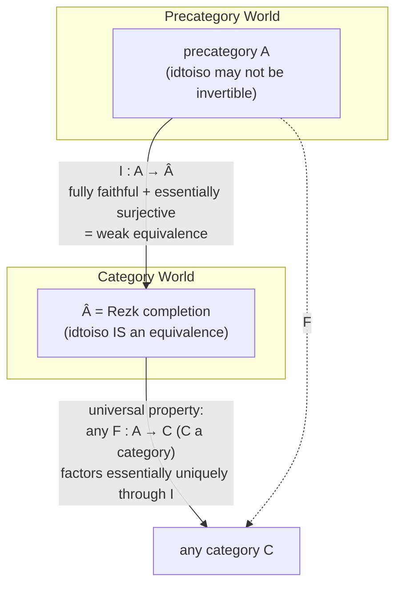

[[book-guidelines|↩ Back to guidelines]]

## The problem: category theory has two notions of "same," and set theory can't tell them apart

Ordinary set-theoretic category theory has a quiet embarrassment. You define a category as a set of objects and, for each pair, a set of morphisms. But almost nothing you ever prove about a category cares about equality of objects in that set-theoretic sense — it cares about *isomorphism*. Two isomorphic groups are "the same" for every purpose a group theorist has; whether they are the *same element of some ambient set* is an accident of how you happened to construct them. Category theory, as actually practiced, is invariant under isomorphism of objects and under equivalence of categories — but the foundational scaffolding (equality-as-identity-of-sets) doesn't reflect that invariance. It's a mismatch between what the theory *means* and what its ambient logic can *say*.

This is exactly the shape of problem the univalence axiom was built to solve for types: identify equality with the "correct" notion of sameness (equivalence), rather than making equality a strictly finer, less useful relation that you then have to route around with side conditions ("...unique up to isomorphism"). Chapter 9 asks: what if we set up category theory so that equality of objects is *by definition* identified with isomorphism? Univalence, applied one level down.

**[[Sets-in-Univalent-Foundations#What breaks without this|What breaks without this]].** Concretely, the classical theorem "every fully faithful, essentially surjective functor is an equivalence of categories" is, in set-based foundations, *equivalent to the axiom of choice*. That's an odd place for a supposedly formal/structural fact to depend on a set-theoretic choice principle. Section 9.9 will show that once equality-of-objects is isomorphism, this theorem is provable with no choice principle at all — the "problem" was never about category theory, it was an artifact of a foundation that couldn't express "unique up to isomorphism" as literal uniqueness.

## Precategories: the raw material, deliberately incomplete

The book builds up in two stages, and the first stage is deliberately weaker than what you'd want to call "a category."

**Definition 9.1.1 (precategory).** A precategory $A$ consists of:

1. A type $A_0$ of objects (write $a : A$ for $a : A_0$).
2. For each $a, b : A$, a *set* $\hom_A(a,b)$ of morphisms — set, not merely a type, because we're doing 1-category theory: no higher coherence data between parallel morphisms.
3. Identities $1_a : \hom_A(a,a)$.
4. Composition $\hom_A(b,c) \to \hom_A(a,b) \to \hom_A(a,c)$, written $g \circ f$.
5. Unit laws $f = 1_b \circ f = f \circ 1_a$.
6. Associativity $h \circ (g \circ f) = (h \circ g) \circ f$.

Nothing here is surprising — it's the usual data of a category, indexed dependently (`hom` is a type family over pairs of objects, which is the natural encoding once you have dependent types: you never compare two morphisms unless their domains and codomains already agree, so there's no need for a separate "domain/codomain" projection out of some flat morphism-set).

The gap: for $a, b : A_0$, there are now *two* candidate notions of "$a$ and $b$ are the same" — the identity type $a =_{A_0} b$, and the categorical notion of isomorphism:

**Definition 9.1.2.** $f : \hom_A(a,b)$ is an *isomorphism* if there exists $g : \hom_A(b,a)$ with $g \circ f = 1_a$ and $f \circ g = 1_b$. Write $a \cong b$ for the type of such isomorphisms.

A precategory gives you no guarantee these coincide. All it gives you is one direction, built by path induction exactly like every other canonical map out of an identity type in this book:

**Lemma 9.1.4 (`idtoiso`).** For a precategory $A$ and $a,b:A$, there is a canonical map
$$\mathrm{idtoiso} : (a = b) \to (a \cong b).$$

*Proof sketch.* By induction on the identity, assume $a \equiv b$; then $1_a$ is trivially an isomorphism. $\blacksquare$

This is the same trick as `idtoeqv` for types one universe level up (see [[The-Univalence-Axiom-and-Its-Consequences]]): whenever you have a "resource-bearing" equivalence relation on some collection of objects, path induction on the identity type gives you a map from equality into that relation for free — the direction from equality is *always* available, definitionally, because equal things trivially satisfy every reflexive relation. What's never free is the *converse* direction.

**Lemma 9.1.3 (a load-bearing fact you'll rely on constantly).** For fixed $f$, "$f$ is an isomorphism" is a mere proposition, and hence $a \cong b$ is a *set*. The proof is the standard "inverses of isomorphisms are unique" argument: given two candidate inverses $g, g'$, both satisfy $g' = 1_a \circ g' = (g \circ f) \circ g' = g \circ (f \circ g') = g \circ 1_b = g$. This matters because it means `idtoiso`'s codomain is exactly as truncation-well-behaved as a set-theoretic equality would be — no coherence data is silently lost by working up to isomorphism instead of strict identity.

## Definition 9.1.6: category = precategory where `idtoiso` is invertible

**Definition 9.1.6.** A precategory $A$ is a **category** if for all $a, b : A$, the function $\mathrm{idtoiso}_{a,b}$ from Lemma 9.1.4 is an *equivalence* (has a genuine two-sided inverse in the HoTT sense, not merely "there merely exists an inverse function").

This is the univalence move, transplanted: instead of positing a *new* axiom the way Chapter 2 does for types-in-a-universe, here it's baked directly into what counts as "category" — a precategory either satisfies this condition or it doesn't, so no consistency argument is needed the way it is for the type-level univalence axiom. (The set $\mathbf{Set}$ itself *is* a category exactly because the type-level univalence axiom holds — Example 9.1.7 — so type-level univalence and this category-level analogue are not independent; the former is used to establish an instance of the latter.)

The immediate payoff: **in a category, $a \cong b$ implies $a = b$** — the theorem you actually wanted all along ("isomorphic structures are the same structure") is now just the statement that `idtoiso` has an inverse, called `isotoid`.

**What this buys you structurally (Lemma 9.1.8).** In a category, the type of objects is a *1-type* (its identity types are all sets) — because $a = b$ is equivalent to $a \cong b$, which Lemma 9.1.3 already showed is a set. This is a strict generalization of the fact that $\mathbf{Set}$'s objects don't form a set (a set has a set of elements, i.e. is a 0-type, but $\mathbf{Set}$'s type of small sets is a 1-type) — a category of "set-level structures" is generally a 1-type of objects, one truncation level up from the structures themselves.

```rust
// The "two notions of sameness" problem shows up directly if you ever tried
// to implement a category/graph abstraction generically in Rust with derived
// PartialEq. Structural (derive) equality on a `Group` struct compares the
// *representation* — e.g. the literal Vec<Vec<usize>> Cayley table — not
// "is isomorphic to." Two isomorphic-but-differently-labeled groups are
// !=, exactly the precategory situation: you have hom-sets (isomorphisms)
// but the ambient `==` doesn't see them.
struct Group { elements: Vec<usize>, mul: Vec<Vec<usize>> }

// `idtoiso` would be: fn from_eq(a: &Group, b: &Group) -> Option<Iso> — trivial,
// since a == b implies the identity permutation works.
// `isotoid` — the interesting, generally-absent direction — would be:
// fn from_iso(iso: &Iso) -> Proof<Group1 == Group2>  // no such thing in Rust;
// isomorphism never upgrades to structural equality, because Rust's `==` is
// not "closed under the correct notion of sameness" the way a univalent
// category's `=` is by construction.
```

**Lean correspondence.** This is precisely the situation Lean's kernel navigates every time it decides `isDefEq a b`: definitional equality is a *strict*, decidable relation (whnf-reduce and compare), deliberately narrower than propositional equality, which is in turn narrower than the "correct" notion of sameness a mathematician has in mind (e.g. `Quotient`-level or `Setoid`-level equivalence). A category in this book's sense is what you get if you insist those three collapse to one relation. HoTT's `Category` structure is essentially demanding that a piece of your type theory behave, internally, the way Lean's `isDefEq` *cannot* be made to behave for anything beyond syntactic equality — which is exactly why HoTT needs univalence as extra axiomatic content rather than getting it as a theorem.

## Functors and natural transformations: nothing to add, but a lot to check

**Definition 9.2.1 (functor).** $F : A \to B$ between precategories consists of an object map $F_0 : A_0 \to B_0$ and, for each $a,b$, a morphism-action $\hom_A(a,b) \to \hom_B(Fa,Fb)$, preserving identities and composition. By induction on identity, a functor automatically preserves `idtoiso` — it doesn't need to be told to send isomorphisms to isomorphisms; that's a free theorem, not a separate axiom.

**Definition 9.2.2 (natural transformation).** $\gamma : F \to G$ is a family of components $\gamma_a : \hom_B(Fa, Ga)$ satisfying naturality $Gf \circ \gamma_a = \gamma_b \circ Ff$. Because each $\hom_B(Fa,Gb)$ is a set, naturality — an equation between morphisms — is automatically a mere proposition; so identity of natural transformations reduces entirely to identity of their components, and the type of natural transformations $F \to G$ is again a set. This truncation bookkeeping recurs throughout the chapter and is worth internalizing as a pattern: *whenever the ambient hom-sets are sets, any equational side-condition you attach is automatically propositional*, so you never have to separately argue coherence of coherence data.

These assemble into the **functor precategory** $B^A$ (Definition 9.2.3): objects are functors $A \to B$, morphisms are natural transformations, with componentwise identity and composition.

**Theorem 9.2.5 — the first real payoff of the "category" definition.** *If $A$ is a precategory and $B$ is a category, then $B^A$ is a category.* In other words, categories of functors into a category are themselves categories: naturally isomorphic functors are *equal* functors, not just related-up-to-a-side-condition. The proof is a careful bookkeeping exercise: given a natural isomorphism $\gamma : F \cong G$, function extensionality plus `isotoid` applied componentwise (using Lemma 9.1.9, the compatibility law $p_*(f) = \mathrm{idtoiso}(q) \circ f \circ \mathrm{idtoiso}(p)^{-1}$ relating transport and `idtoiso`) assembles a genuine equality $F = G$ of functors, and the round-trip back to $\gamma$ recovers exactly the original natural isomorphism component-by-component.

**Why this is load-bearing for the rest of the chapter:** it means "the type of categories is closed under exponentiation by an arbitrary precategory" — you get to build $\mathbf{Set}^{A^{\mathrm{op}}}$ (used for the Yoneda embedding below) and know in advance it will already be a category, without a separate saturation step.

```python
# Illustrative sketch only (per style: Python for quick, non-load-bearing
# illustration). Functors and natural transformations, structurally:
class Functor:
    def __init__(self, obj_map, hom_map):   # hom_map: (a,b,f) -> B-morphism
        self.obj_map, self.hom_map = obj_map, hom_map

class NatTrans:
    def __init__(self, F, G, components):   # components: a -> B-morphism Fa->Ga
        self.F, self.G, self.components = F, G, components
    def is_iso(self, is_iso_in_B):
        # Lemma 9.2.4: gamma is iso in B^A  iff  every component is iso in B
        return all(is_iso_in_B(c) for c in self.components.values())
```

**Lean correspondence.** `Functor` in Lean's `CategoryTheory` library is definitionally this shape (`obj`, `map`, `map_id`, `map_comp`), and `NatTrans` similarly. The book's Theorem 9.2.5 is the reason `Functor.category` in Mathlib-style developments can treat naturally-isomorphic functors as literally interchangeable — the univalent framing here is what makes that interchangeability a theorem about *equality* rather than a design choice you have to keep re-justifying every time you `rw` under a natural isomorphism.

## Equivalences of categories vs. weak equivalences — where AC used to live

Classically, "$F : A \to B$ is an equivalence of categories" means: there's $G : B \to A$ with natural isomorphisms $FG \cong 1_B$, $GF \cong 1_A$. But "there exists such a $G$" is not automatically a mere proposition — exactly the same defect that makes the naive "has a quasi-inverse" notion of type-equivalence ill-behaved (§4.1). The fix is the same one used there: an **adjoint equivalence**, where you additionally require the *triangle identities* to hold, pinning down $G, \eta, \epsilon$ up to a canonical further choice.

**Definition 9.4.1.** $F$ is an *equivalence of (pre)categories* if it's a left adjoint whose unit $\eta$ and counit $\epsilon$ are both isomorphisms.

The book then gives an entirely elementary, purely 1-categorical reformulation:

**Definitions 9.4.3–9.4.6.**
- $F$ is **faithful** if each $F_{a,b} : \hom_A(a,b) \to \hom_B(Fa,Fb)$ is injective, **full** if surjective, **fully faithful** if both (equivalently, each $F_{a,b}$ is an equivalence of sets).
- $F$ is **split essentially surjective** if for every $b:B$ there *merely-exists-with-witness*, i.e. there is *specified*, $a:A$ with $Fa \cong b$.
- $F$ is **essentially surjective** if that existence is only *propositionally truncated* — $\exists a. Fa \cong b$ with no witness extractable.
- $F$ is a **weak equivalence** if it is fully faithful and essentially surjective (the *truncated* version).

**Lemma 9.4.5.** $F$ is an equivalence of precategories $\iff$ $F$ is fully faithful and *split* essentially surjective. This is the honest classical statement — and note it needs the *split* (choice-laden) version of essential surjectivity, because reconstructing the quasi-inverse functor $G$ on objects requires actually picking, for each $b$, a specific preimage $a$ and isomorphism.

Here is the theorem that makes the whole categorical framework earn its keep:

**Lemma 9.4.7.** *If $F : A \to B$ is fully faithful and $A$ is a category, then for any $b:B$ the type $\sum_{a:A} (Fa \cong b)$ is a mere proposition.* Consequently: **for categories (not precategories), "equivalence" and "weak equivalence" coincide** — merely-existing essential surjectivity is exactly as good as split essential surjectivity, with no choice required.

*Why the proof works, mechanically*: given two witnesses $(a,f)$ and $(a',f')$ of $Fa\cong b \cong Fa'$, fully-faithfulness pulls the composite isomorphism $Fa \cong Fa'$ back to a genuine isomorphism $g : a \cong a'$ in $A$; and because $A$ is a *category*, $g$ upgrades to an actual equality $p : a = a'$ via `isotoid`. Transporting $f$ along $p$ recovers $f'$. So the space of witnesses collapses to a point — not because you did anything clever, but because being a category means "isomorphic implies literally equal," and literal equality of dependent-pair witnesses is exactly what contractibility of a $\Sigma$-type demands.

**This is the resolution of the axiom-of-choice puzzle from the opening section.** Classically, "fully faithful + essentially surjective $\Rightarrow$ equivalence" needs AC because you must *choose*, for each $b$, a preimage and an isomorphism, uniformly — and set theory's mere existence gives you no canonical way to do that without choice. Here, the book calls this "the category-theoretic version of the principle of unique choice" (§3.9): when the space of choices is contractible, picking one is not a choice at all, it's forced. Univalence-for-categories is precisely what makes the space of choices contractible.

**Isomorphism of categories (Definition 9.4.8)** is the still-stronger notion: $F$ fully faithful *and* $F_0$ an equivalence of types on objects. For categories, **Lemma 9.4.14** shows equivalence and isomorphism of categories actually coincide — again a phenomenon special to univalent categories; for precategories the two notions can genuinely diverge (Example 9.4.13: the "chaotic" precategory on a non-contractible type $X$ maps to the terminal category by an equivalence that is not an isomorphism).

Finally, the whole point closes with:

**Theorem 9.4.16.** For categories $A,B$: $(A = B) \simeq (A \simeq B)$ — equality of categories is equivalent to equivalence of categories. This is univalence propagated up another level: types satisfy $(A=B)\simeq(A\simeq B)$ by axiom; categories satisfy the analogous statement as a *theorem*, derived from the category axiom plus function extensionality. A corollary: **the type of categories (in a fixed universe) is itself a 2-type** — categories, functors, and natural transformations genuinely form a (2,1)-category internally, not just informally.

```rust
// Faithful / full / fully-faithful, as trait-level properties you'd actually
// check on a functor between small (finite, decidable-hom) categories:
trait Functor<A: Category, B: Category> {
    fn map_obj(&self, a: A::Obj) -> B::Obj;
    fn map_hom(&self, f: A::Hom) -> B::Hom;
}

fn is_fully_faithful<A: Category, B: Category, F: Functor<A,B>>(
    f: &F, a: A::Obj, b: A::Obj,
) -> bool {
    // injective AND surjective on hom(a,b) -> hom(Fa,Fb)
    let src: Vec<_> = A::hom_set(a, b);
    let img: Vec<_> = src.iter().map(|h| f.map_hom(h.clone())).collect();
    let tgt: Vec<_> = B::hom_set(f.map_obj(a), f.map_obj(b));
    injective(&src, &img) && img.iter().collect::<HashSet<_>>().len() == tgt.len()
}
```

**Why this matters for an elaborator/unifier (learning-goals connection):** "fully faithful" is structurally the same shape as asking a coercion/elaboration map to be *conservative* — it neither introduces new judgmental identifications between terms that weren't there in the source language, nor collapses distinctions that should survive. A type-checker's embedding of surface syntax into a core calculus is well-behaved exactly when it's the categorical analogue of fully faithful: the elaborated core terms are related exactly as much as the source terms were, no more (faithful) and no less (full, for the relations the elaborator is supposed to preserve, like definitional equality classes).

## The Yoneda lemma: an object is exactly what it does to every test object

Two ingredients first (Definitions 9.5.1–9.5.2): the **opposite precategory** $A^{\mathrm{op}}$ (same objects, $\hom_{A^{\mathrm{op}}}(a,b) :\equiv \hom_A(b,a)$), and **products of precategories**. Then Lemma 9.5.3 establishes currying at the categorical level: functors $A \times B \to C$ correspond to functors $A \to C^B$ — exactly the exponential law you'd expect, lifted one level.

This currying is what lets you build the **hom-functor**
$$\hom_A : A^{\mathrm{op}} \times A \to \mathbf{Set}, \qquad (a,b) \mapsto \hom_A(a,b),$$
and, currying it, the **Yoneda embedding**
$$y : A \to \mathbf{Set}^{A^{\mathrm{op}}}, \qquad y(a) :\equiv \hom_A(-, a).$$

$y(a)$ is the *presheaf* "what does everything else look like as seen from $a$" — the functor sending each test object $x$ to the set of arrows $x \to a$.

**Theorem 9.5.4 (Yoneda lemma).** For any precategory $A$, any $a:A$, and any $F : \mathbf{Set}^{A^{\mathrm{op}}}$:
$$\hom_{\mathbf{Set}^{A^{\mathrm{op}}}}(ya, F) \cong Fa,$$
naturally in both $a$ and $F$.

**The mechanism, not just the statement (this is where the "how you'd implement it" reading pays off).** A natural transformation $\alpha : ya \to F$ is *entirely determined by one value*, $\alpha_a(1_a) : Fa$ — plug in the identity morphism at the one point where $ya$ is guaranteed to have one. Conversely, given a single element $x : Fa$, you can *reconstruct the entire natural transformation* by defining $\alpha_{a'}(f) :\equiv F_{a,a'}(f)(x)$ for every $a'$ and every $f : a' \to a$ — naturality forces this formula, it isn't a choice. So the lemma isn't really "two sets happen to be in bijection" — it's "a natural transformation out of a representable functor carries *zero* information beyond where the identity morphism goes," a fact you can derive purely from unwinding definitions, with no cleverness.

**Corollary 9.5.6.** $y$ is fully faithful ($\hom_{\mathbf{Set}^{A^{\mathrm{op}}}}(ya,yb) \cong yb(a) \equiv \hom_A(a,b)$, directly from the lemma).

**Corollary 9.5.7.** If $A$ is a category, $y_0$ is an *embedding* on objects: $ya = yb \implies a = b$. This is the categorified Yoneda philosophy stated as a genuine theorem rather than folklore: **an object is (up to equality, in a univalent category!) completely determined by the presheaf of arrows into it.** "Determined by its universal property" stops being a slogan and becomes literally "the embedding $y_0$ has propositional fibers."

**Definition 9.5.8 / Theorem 9.5.9 (representability).** $F$ is *representable* if $\exists a. ya \cong F$; and if $A$ is a category, "$F$ is representable" is a *mere proposition* — a representing object, when it exists, is unique, not just unique-up-to-a-side-condition. This directly generalizes the familiar "universal properties determine their object uniquely up to unique isomorphism" — here "unique isomorphism" upgrades all the way to "the very same object."

The section closes by using representability to re-derive adjunctions (**Lemma 9.5.10**): $F$ is a left adjoint iff, for every $b$, the presheaf $a \mapsto \hom_B(Fa,b)$ on $A^{\mathrm{op}}$ is representable — cashing out "left adjoint" as "hom-set out of $F$ is *naturally* a hom-set into something," the standard adjunction-as-representable-functor viewpoint, now with propositional uniqueness for free (**Corollary 9.5.11**) whenever $A$ is a category.

```python
# Yoneda, made concrete: for a *finite* category A given as an adjacency-list
# of hom-sets, "the presheaf represented by a" is literally the column of
# incoming-arrow-sets, and Yoneda says: a natural transformation out of that
# column is *exactly* a choice of one element of F(a). No search required.
def yoneda_reconstruct(F, a, x):
    """Given F: obj -> set (a presheaf on A^op, restricted to hom-action
    F_hom: (obj, morphism a'->a) -> function F(a)->F(a')), and x in F(a),
    reconstruct the natural transformation y(a) -> F component-by-component."""
    def alpha(a_prime, f):       # f : a_prime -> a
        return F.hom_action(a_prime, f)(x)
    return alpha
```

**Lean correspondence — this is the primary grounding for this section per the standing project.** The Yoneda lemma is *the* categorical formalization of "proof search by representability": when your elaborator needs to solve a metavariable `?m : T` and `T` happens to be (isomorphic to) a representable presheaf — e.g. `T` is `Hom(-, a)`-shaped, as instance resolution goals typically are — Yoneda says the *entire* solution space is captured by a single canonical element, not by an open-ended search. This is structurally close to how Lean's typeclass resolution and `CategoryTheory.Yoneda` machinery actually get used together: representability arguments let Mathlib prove uniqueness of limits, colimits, and adjoints ("any two representing objects for the same functor are canonically isomorphic") in one stroke, rather than re-deriving uniqueness by hand for products, then again for pullbacks, then again for exponentials. Corollary 9.5.7's "$ya = yb \Rightarrow a = b$" is the univalent-foundations reason that argument goes through *on the nose* (equality) rather than merely up to (unstated) canonical isomorphism.

## The structure identity principle: univalence as a machine you can point at any signature

Section 9.8 generalizes the whole pattern. Instead of asking "when are two *types* equal" (univalence) or "when are two *categories* equal" (§9.4), it asks: given any first-order-ish notion of extra structure layered on top of an existing category $X$, when does *its* category of structured-objects-and-homomorphisms automatically satisfy "isomorphic implies equal"?

**Definition 9.8.1 (notion of structure).** A notion of structure $(P,H)$ over a precategory $X$ consists of:

- A type family $P : X_0 \to \mathcal{U}$ — for $x:X_0$, elements of $P x$ are "$(P,H)$-structures on $x$" (e.g., $X = \mathbf{Set}$ and $Px$ = "a group-multiplication-and-identity making $x$ into a group").
- For each $f : \hom_X(x,y)$ and $\alpha:Px$, $\beta:Py$, a mere proposition $H_{\alpha\beta}(f)$ — "$f$ is a $(P,H)$-homomorphism from $\alpha$ to $\beta$."
- Reflexivity ($H_{\alpha\alpha}(1_x)$) and closure under composition of $H$.

This automatically makes $\alpha \le_x \beta :\equiv H_{\alpha\beta}(1_x)$ into a preorder on $Px$ (Example 9.1.14's construction, one level up). $(P,H)$ is a **standard notion of structure** if that preorder is a genuine partial order — i.e., $Px$ is a set, and mutual-$H$-comparability of two structures on the *same* object implies they're literally the same structure.

Given $(P,H)$, you build the obvious precategory $\mathrm{Str}_{(P,H)}(X)$: objects are pairs $(x,\alpha)$ with $\alpha : Px$; morphisms $(x,\alpha)\to(y,\beta)$ are $H$-preserving morphisms $x\to y$ in $X$.

**Theorem 9.8.2 (structure identity principle).** *If $X$ is a category and $(P,H)$ is a standard notion of structure over $X$, then $\mathrm{Str}_{(P,H)}(X)$ is a category.*

*Mechanism:* an equality $(x,\alpha)=(y,\beta)$ in a $\Sigma$-type decomposes as a path $p:x=y$ plus $p_*(\alpha)=\beta$ (a mere proposition, since $P$ is set-valued); an isomorphism $(x,\alpha)\cong(y,\beta)$ decomposes as an isomorphism $f:x\cong y$ in $X$ plus $H_{\alpha\beta}(f)$ *and* $H_{\beta\alpha}(f^{-1})$ (also propositional). Since $X$ is a category, $(x=y)\simeq(x\cong y)$ already; the theorem just has to check the *remaining* propositional halves line up — and the "if" direction ($H_{\alpha\beta}(\mathrm{idtoiso}(p))$ and its converse imply $p_*(\alpha)=\beta$) is exactly where "standard" (antisymmetry of $\le_x$) gets used: mutual comparability of $\alpha,\beta$ via the identity morphism forces $\alpha=\beta$.

**Why this is a big deal (and this is the load-bearing takeaway for the standing project):** this theorem is a *generic, reusable engine* for proving "isomorphic algebraic structures are equal," applicable to any first-order signature at once, rather than needing a bespoke univalence proof for groups, then rings, then topological spaces, then partial orders, each time re-deriving "isomorphic groups are literally the same group." Example 9.8.4 makes this completely explicit: for any first-order signature $\Omega$ (function symbols with arities, relation symbols with arities), the category of $\Omega$-structures over $\mathbf{Set}$ is automatically a standard notion of structure, hence automatically satisfies univalence. Group theory, ring theory, graph theory, poset theory — all instances of one theorem, for free.

**This is precisely the shape of a type-class/trait hierarchy with a soundness obligation attached.** A Rust `trait Monoid: Semigroup { ... }` (or, closer still, a Lean `structure` with a `Prop`-valued law field, e.g. `Group` bundling carrier, operations, and proof obligations) is a notion-of-structure in exactly this sense: $P$ is "the extra data + laws," $H$ is "what counts as a structure-preserving map." The structure identity principle says: *if the underlying category is univalent, and your structure's compatibility predicate is antisymmetric in the right sense, then isomorphism of instances of your trait/structure is automatically the same as `Eq` on instances* — a soundness guarantee for "derive-style" reasoning ("these two `Group` values are `PartialEq`-equal because there's an isomorphism between them") that most languages have to hand-wave, and that this theorem proves once, generically.

```rust
// A "notion of structure" over Set, Rust-flavored: (P, H) where
//   P x  = "a Group-structure on carrier x" (mul, identity, laws)
//   H f  = "f preserves mul and identity"
struct GroupStruct<X> { mul: fn(X, X) -> X, id: X }

fn is_homomorphism<X, Y>(
    f: &dyn Fn(X) -> Y, gx: &GroupStruct<X>, gy: &GroupStruct<Y>,
) -> bool
where X: Copy, Y: Copy + PartialEq {
    // H_{gx,gy}(f) : f(gx.id) == gy.id  and  f(gx.mul(a,b)) == gy.mul(f(a),f(b))
    // (elided: universally quantified check over all a, b)
    true
}
// The structure identity principle says: IF the ambient category (here, Set,
// with its known-univalent hom = total functions) is univalent, AND
// "mutually-homomorphic implies equal" holds for GroupStruct (antisymmetry —
// this is where you'd actually have to do group-theoretic work, e.g. showing
// a bijective homomorphism with a homomorphic inverse forces the *same*
// multiplication table up to the bijection), THEN isomorphic GroupStructs on
// the same carrier are literally equal as GroupStructs — no separate proof
// needed per algebraic theory.
```

## The Rezk completion: turning "merely a precategory" into a category, universally

Not every precategory is a category — the fundamental *pregroupoid* of a type $X$ (hom-sets $\lVert x=y\rVert_0$, Example 9.1.17) is generally not one, nor is the homotopy precategory of types (Example 9.1.18, hom-sets $\lVert X\to Y\rVert_0$). Section 9.9 constructs, for any precategory $A$, its universal "categorification" $\hat A$ — called the **Rezk completion** (or *stack completion*).

**The key lemma that makes the whole construction choice-free** is that *categories cannot distinguish weak equivalences from genuine equivalences of the domain*:

**Theorem 9.9.4.** If $A,B$ are precategories, $C$ is a category, and $H:A\to B$ is a weak equivalence, then precomposition $(-\circ H): C^B \to C^A$ is an **isomorphism** (of precategories).

*Mechanism, briefly:* fully-faithfulness of $(-\circ H)$ (Lemmas 9.9.1–9.9.2) is routine diagram chasing using that $H$ is full, faithful, essentially surjective. Essential surjectivity — recovering a functor $G:B\to C$ from any $F:A\to C$ with $GH\cong F$ — is where category-ness of $C$ does the real work: for each $b:B$, the book builds a type $X_b$ of "candidate values $G(b)$ compatible with $F$ along every witness $Ha\cong b$," and shows $X_b$ is *contractible*. Classically you'd only get "$G(b)$ is well-defined up to unique isomorphism" here — precisely the point where classical category theory needs choice to turn "up to unique iso" into an actual function $B_0 \to C_0$. Because $C$ is a category, "up to unique isomorphism" *is* "up to equality," so $X_b$ being inhabited-and-propositional means it's contractible, and choosing the unique inhabitant for every $b$ requires no choice principle at all — it's forced, one $b$ at a time, by contractibility, and $\Pi$ of contractible types is contractible.

**This is Theorem 9.9.4's real content, restated for the compiler-building reader:** *"well-defined up to unique isomorphism" and "well-defined, full stop" are the same claim once your ambient category is univalent.* Any construction in ordinary mathematics that appeals to choice only to pick a canonical-but-technically-arbitrary representative (a colimit, a quotient's normal form, a completion) is, under univalence, not making a choice at all — it's evaluating a function into a space that happens to be a single point.

**Two constructions of $\hat A$:**

1. **Via Yoneda (slick, but universe-inflating).** Take $\hat A_0 :\equiv \{ F : \mathbf{Set}^{A^{\mathrm{op}}} \mid \exists a. \, ya \cong F \}$ — i.e., $\hat A$ is the full sub-precategory of *representable presheaves* inside $\mathbf{Set}^{A^{\mathrm{op}}}$. Since $\mathbf{Set}^{A^{\mathrm{op}}}$ is a category (Theorem 9.2.5, using univalence of $\mathbf{Set}$), and $\hat A$ is an embedding into it, $\hat A$ is a category. The Yoneda embedding $A\to\hat A$ is fully faithful (Corollary 9.5.6) and essentially surjective by construction — a weak equivalence. Drawback: $\hat A$ lives one universe level up from $A$, because it's built as a subtype of a presheaf category.

2. **Via a higher inductive type (universe-preserving, and the more instructive one for the standing project).** Define $\hat A_0$ as a HIT with constructors:
   - $i : A_0 \to \hat A_0$ (embed the original objects),
   - for each $e : a \cong b$ in $A$, a path constructor $j(e) : ia = ib$ — **isomorphisms become literal paths**, by fiat,
   - $j(1_a) = \mathrm{refl}_{ia}$ and $j(g\circ f) = j(f)\centerdot j(g)$ (functoriality of $j$ on the nose),
   - a 1-truncation constructor forcing $\hat A_0$ to be a 1-type.

   This is the "quotient a groupoid of isomorphisms down to a space of paths" move, structurally identical to the two HIT-based constructions you'll have seen elsewhere in the book ($S^1$ from a point-plus-loop, or truncations from an equivalence relation) — except here what's being freely added is not just *a* path per generator but paths that already satisfy the *category axioms* by construction (constructors 3–4 are exactly functoriality of $j$). The rest of the proof (hom-sets on $\hat A_0$ defined by a careful double induction that uses univalence itself to turn each generating isomorphism-path $j(e)$ into a transport-equivalence on hom-sets, then shows the induced `idtoiso` is invertible by an encode-decode argument structurally identical to the one used for $\pi_1(S^1)$ in Chapter 8) is, as the book itself says, "wide and shallow" — mechanically checking that every HIT constructor plays nicely with every piece of categorical structure, exactly the kind of proof a proof assistant is suited to and a human is not.

**Theorem 9.9.8 — the completion characterizes [[Type-Theory-as-a-Foundational-System-Qwen#The definition|the definition]].** *A precategory $C$ is a category iff, for every weak equivalence $H:A\to B$ of precategories, $(-\circ H):C^B\to C^A$ is an isomorphism.* Combined with Theorem 9.9.4, this says: "category" is not an arbitrary extra condition tacked onto "precategory" — it is *exactly* "sees every weak equivalence as an actual equivalence." The notion of category is fully determined by the notion of weak equivalence; if you accept the latter as the correct notion of "sameness" between precategories (which, per the chapter's opening, is forced on you by wanting to be isomorphism-invariant), the former follows.



**Examples that make it concrete:** the Rezk completion of the fundamental *pregroupoid* of a type $X$ is its fundamental *groupoid* — identifiable with the 1-truncation $\lVert X\rVert_1$ (Example 9.9.6). The Rezk completion of the homotopy precategory of types is the *homotopy category of types*, with object-type $\lVert\mathcal U\rVert_1$ (Example 9.9.7). Both are cases where "isomorphic-up-to-a-truncated-path" needed to be upgraded to "literally identified" before the category axiom could hold — Rezk completion is the generic machine for doing that upgrade.

**Elaborator/unification framing.** The Rezk completion is the categorical mirror of a *quotient-by-a-congruence* construction you'd build for a term language modulo definitional equality: you start with raw syntax (a "precategory" where syntactic identity is finer than the equivalence you actually care about — $\alpha$-equivalence, or $\beta\eta$-conversion classes), and you freely add exactly the paths needed to make "provably-interconvertible" and "identical" coincide, no more and no less (the HIT's truncation and coherence constructors are precisely "no more" — they don't add junk paths beyond what functoriality forces). A trusted kernel implementing `isDefEq` is implicitly committing to *some* precategory of terms already being (or being convertible into, via a normalization procedure) a category in this sense: the soundness property you want from a normalizer is exactly "if two terms are related by the conversion relation, and you can't tell them apart at any test, they're the same term" — the elaborator-side analogue of Theorem 9.9.8's "sees every weak equivalence as an equivalence."

## Where this leads

Chapter 9 sits at the head of the book's "mathematical applications" arc (Chapters 8–11): Chapter 8 built the raw $\infty$-groupoid machinery (higher paths, truncation levels, $\pi_1(S^1)$); Chapter 9 shows that 1-category theory, done univalently, both (a) resolves a genuine foundational awkwardness in classical category theory (the AC-dependence of "fully faithful + essentially surjective $\Rightarrow$ equivalence") and (b) hands you a reusable machine (the structure identity principle) for getting univalence "for free" on any first-order algebraic structure built over $\mathbf{Set}$. That machine is exactly what Chapter 10 needs: it shows $\mathbf{Set}$ itself is a $\Pi W$-pretopos using the category-theoretic apparatus built here, and the structure identity principle is what makes categories of set-level mathematical structures (groups, rings, ordinals, the cumulative hierarchy) behave the way univalent foundations promises throughout the rest of the book. The Rezk completion, meanwhile, is the chapter's clearest demonstration of [[Higher-Inductive-Types|higher inductive types]] earning their keep outside of pure homotopy theory — freely adding exactly the paths a universal property demands, and no more.

For the standing project: this chapter is the cleanest source-text illustration of the general slogan "isomorphism up to unique iso, upgraded to literal equality by univalence, removes an implicit dependency on choice." That is the exact shape of argument you'll want when justifying that your elaborator's handling of definitionally-equal (or even just observationally-equivalent) terms is sound without secretly baking in an unjustified choice principle — and the structure identity principle is a direct, reusable template for proving "my type-class/trait hierarchy's notion of `Eq` coincides with its notion of isomorphism" once, generically, rather than per-instance.
