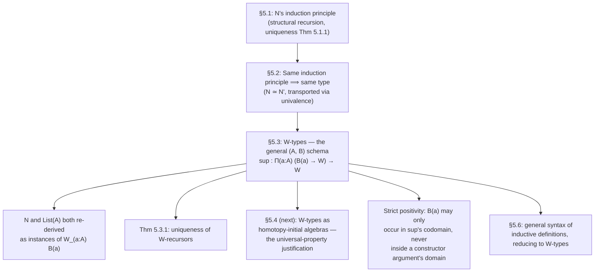

[[book-guidelines|↩ Back to guidelines]]

# W-Types as Well-Founded Trees

## The problem: too many inductive types to study one at a time

[[Type-Formers-and-Their-Universal-Properties]] walked through the type formers one at a time — $\Pi$, $\Sigma$, coproducts, $\mathbb{N}$, booleans — each with its own formation/introduction/elimination/computation rules. That's fine as an inventory, but it leaves a question hanging: is there anything *general* being repeated every time, or is each type former a bespoke, unrelated piece of machinery?

The book's answer, arriving in Chapter 5, is that inductive types are "very general... but they can all be formally reduced to a few special cases." **$W$-types** (Martin-Löf's *well-founded trees*) are the load-bearing special case: a single, uniform construction general enough to encode natural numbers, lists, binary trees, and — as later chapters make precise — the "recursion aspect" of essentially any inductive definition you'd write down. This article works through $W$-types both as a standalone construction and as the answer to "what do all inductive types actually have in common?"

## Setting the stage: what an induction principle is actually asserting

Before $W$-types specifically, §5.1 makes a point worth internalizing on its own. An inductive type is intuitively "freely generated by its constructors" — but *freely generated* is an informal gloss, not a definition. Type theory cashes it out as an **induction principle**: to prove a statement $E$ about every element, it suffices to prove it on each constructor, assuming it already holds on that constructor's "smaller" arguments. For $\mathbb{N}$:

$$e_z : E(0) \qquad e_s : \prod_{n:\mathbb{N}} E(n) \to E(\mathrm{succ}(n)) \quad\Longrightarrow\quad \mathrm{ind}_\mathbb{N}(E,e_z,e_s) : \prod_{x:\mathbb{N}} E(x)$$

with computation rules $\mathrm{ind}_\mathbb{N}(E,e_z,e_s,0)\equiv e_z$ and $\mathrm{ind}_\mathbb{N}(E,e_z,e_s,\mathrm{succ}(n))\equiv e_s(n,\mathrm{ind}_\mathbb{N}(E,e_z,e_s,n))$ — the second rule is exactly *structural recursion*: the recursive call is already available as an argument to the successor case.

**Uniqueness comes for free, and it matters more than it looks.** Theorem 5.1.1 proves that *any* two functions $f,g$ satisfying the same recurrences — even only *propositionally* — must be (propositionally) equal. This isn't just tidiness: it's what licenses treating two differently-*built* versions of "the same" inductive type as literally interchangeable. §5.2 runs this to its natural conclusion with a second copy of the naturals, $\mathbb{N}'$ (constructors $0', \mathrm{succ}'$), and shows $\mathbb{N} \simeq \mathbb{N}'$ purely from the fact that they satisfy the same induction principle — no reference to their internal construction — and then, via univalence, $\mathbb{N} =_\mathcal{U} \mathbb{N}'$, so **any** theorem about one transports automatically to the other. This generalizes: *if two types satisfy the same induction principle, they are equal as types.* This is the type-theoretic version of the category-theoretic fact "objects with the same universal property are canonically isomorphic," and it's exactly why the book can define lists-of-unit `List(1)` and show it satisfies $\mathbb{N}$'s induction principle (§5.2's closing example) and conclude they're *the same type*, not just "in bijection."

## The construction: labels, arities, and a single constructor

A $W$-type is specified by exactly two pieces of data: a type of **labels** $A : \mathcal{U}$, and a **type family** $B : A \to \mathcal{U}$ recording each label's **arity**. The resulting type is written $W_{(a:A)} B(a)$, and it has exactly one constructor:

$$\mathrm{sup} : \prod_{a:A} \big(B(a) \to W_{(a:A)}B(a)\big) \to W_{(a:A)}B(a)$$

Read operationally: to build a $W$-type element, pick a label $a : A$, then supply a function $f : B(a) \to W_{(a:A)}B(a)$ assigning a "$b$-th subtree" to every $b : B(a)$. So $\mathrm{sup}(a, f)$ is a **node labeled $a$ with $B(a)$-many children**, where "$B(a)$-many" can be zero (empty type), finite (`Fin(n)`), or even infinite (e.g. $B(a):\equiv\mathbb{N}$, giving countably-branching trees) — this is precisely why the book calls $W_{(a:A)}B(a)$ the type of **well-founded trees**: nodes carry a label from $A$, and each node's branching factor is read off $B$ applied to that label.

The induction principle mirrors $\mathbb{N}$'s shape exactly, generalized from "the one predecessor" to "all $B(a)$-many children":

$$e : \prod_{a:A}\ \prod_{f:B(a)\to W_{(a:A)}B(a)}\ \Big(\textstyle\prod_{b:B(a)} E(f(b))\Big) \to E(\mathrm{sup}(a,f))$$

with computation rule $\mathrm{rec}_{W}(E,e,\mathrm{sup}(a,f)) \equiv e\big(a,\,f,\,\lambda b.\,\mathrm{rec}_{W}(E,e,f(b))\big)$ — the inductive hypothesis $g$ in the rule is *literally* "the recursive call, already applied to every child," which is what makes structural recursion on a $W$-type total by construction: you can only recurse into strictly smaller subtrees, and there's no other way to invoke the eliminator.

## Worked example: the natural numbers, rebuilt from nothing but labels and arities

The book's running example is deliberately chosen to show the mechanism concretely. Natural numbers have exactly two "shapes" — zero (no predecessor) or successor (exactly one predecessor) — so the label type is $A :\equiv \mathbf{2}$ (booleans $0_2, 1_2$), and the arity function sends $0_2$ to the *empty* type (zero children: "zero" needs no predecessor) and $1_2$ to the *unit* type (one child: "successor" needs exactly one predecessor):

$$\mathbb{N}^w :\equiv W_{(b:\mathbf{2})}\, \mathrm{rec}_2(\mathcal{U}, \mathbf{0}, \mathbf{1}, b)$$

Concretely:

$$0^w :\equiv \mathrm{sup}\big(0_2,\ \lambda x.\,\mathrm{rec}_0(\mathbb{N}^w,x)\big) \qquad 1^w :\equiv \mathrm{sup}(1_2,\ \lambda x.\,0^w) \qquad \mathrm{succ}^w :\equiv \lambda n.\,\mathrm{sup}(1_2,\ \lambda x.\,n)$$

The function supplied to $\mathrm{sup}$ at the $0_2$ label has domain $\mathbf{0}$ (the empty type) — there is nothing to supply, so $\lambda x.\,\mathrm{rec}_0(\mathbb{N}^w, x)$ is the unique (vacuous) function out of the empty type, exactly playing the role "zero has no predecessor." At the $1_2$ label the domain is $\mathbf{1}$ (unit) — exactly one child slot, filled by the actual predecessor. The book then derives `double` on this encoding by case-splitting on the label ($a:\mathbf{2}$) inside the $W$-recursor's motive, and — crucially — walks through the computation-rule unfolding step by step to *check* that `double(0ʷ) ≡ 0ʷ` and `double(1ʷ) ≡ succʷ(succʷ(0ʷ))` reduce correctly, purely by the single $W$-computation rule. This is the payoff of the uniform construction: you don't need a bespoke computation rule per inductive type, you need exactly one, parametrized by $(A,B)$.

A second worked case makes the generalization concrete: lists over $A$ get encoded with labels $A':\equiv \mathbf{1}+A$ (one nullary label for `nil`, one unary label per element for "cons this element"), and arity $B'$ sending the `nil`-label to $\mathbf{0}$ and each `cons(a)`-label to $\mathbf{1}$:

$$\mathrm{List}(A) :\equiv W_{(x:\mathbf{1}+A)}\, \mathrm{rec}_{\mathbf{1}+A}(\mathcal{U},\mathbf{0},\lambda a.\,\mathbf{1},x)$$

Same shape as $\mathbb{N}^w$, just with a richer label type. This is the sense in which $W$-types "encapsulate the recursion aspect of any inductive type": *the label type $A$ says which constructor you used; the arity family $B$ says how many recursive sub-occurrences that constructor has.* Every ordinary (non-higher, non-mutual, non-indexed) inductive type reduces to picking the right $(A,B)$ pair.

**Rust framing — this is exactly what an `enum` desugars to, made fully explicit.** A Rust enum like

```rust
enum Tree {
    Leaf,                      // label with 0 children
    Unary(Box<Tree>),          // label with 1 child
    Binary(Box<Tree>, Box<Tree>), // label with 2 children
}
```

is, structurally, a $W$-type where the label type $A$ has three elements (`Leaf`, `Unary`, `Binary`) and the arity family sends them to `Fin(0)`, `Fin(1)`, `Fin(2)` respectively — `Box` is doing the same job `sup`'s recursive-occurrence function $f : B(a) \to W$ does, just without a dependent-type-level tracking of "how many." The reason Rust needs `Box` (a pointer, breaking the otherwise-infinite size of a self-referential type) while type theory just writes $W_{(a:A)}B(a)$ directly is that HoTT's $W$-type is defined *inductively as a type*, not laid out as a concrete memory representation — the analogy is at the level of *shape*, not implementation, but the shape correspondence is exact: **label type = the enum's variant tag; arity function = each variant's field arity, viewed as "how many recursive occurrences."**

**Lean framing — this is the general schema a `structural recursion` termination checker verifies against.** Lean's kernel doesn't special-case `Nat.rec` and `List.rec` and every user-defined `inductive` separately — it generates one recursor per inductive type following essentially this pattern (positivity-checked constructors, one eliminator, computation rules definitionally by `Nat.rec`/`List.rec`/etc. reducing on constructors), and Lean's termination checker for `def foo : Nat → X` by pattern matching is, underneath, checking that your recursive calls only ever occur on a strictly-smaller *structural* subterm — i.e., on some $f(b)$ for $b : B(a)$, never on an unrelated term. Well-foundedness of $W_{(a:A)}B(a)$ is precisely the semantic fact that licenses this check: there is no way to construct an infinite descending chain of "child of a child of a child..." because every element is built by finitely many applications of $\mathrm{sup}$ starting from labels of arity $\mathbf 0$ or from well-founded recursion into strictly prior elements.

## The uniqueness theorem, and why it's not just a curiosity

Theorem 5.3.1 states the $W$-type analogue of Theorem 5.1.1: if $g,h : \prod_{w:W}E(w)$ both satisfy the same recurrence $e$ *propositionally* (not necessarily judgmentally), then $g$ and $h$ are (propositionally) equal. Combined with §5.2's earlier argument, this is the exact tool that proves $\mathbb{N} \simeq \mathbb{N}^w$: both satisfy the *same* induction principle (once you transport across the label/arity encoding), so by uniqueness any two implementations of "the recursor" agree, and by univalence the two types are literally equal, not merely isomorphic. This is the general template — *same induction principle $\Rightarrow$ same type* — that the book flags will get a proper categorical treatment as a **universal property** in the very next section (§5.4, homotopy-initial algebras), which this article deliberately stops short of, since that's the mechanism, not the $W$-type construction itself.

**Why this recurs directly in your compiler/elaborator project.** "Two differently-built implementations of the same recursive datatype are interchangeable, provably, as long as they satisfy the same recursor signature" is *exactly* the guarantee you want when you have, say, a naive `Vec`-backed AST representation and a more efficient interned/hash-consed representation, and you want to prove program transformations sound across the swap — the uniqueness-of-recursors argument is the formal justification, not just an engineering convention. More directly: whenever your refinement-type or dependently-typed compiler needs to accept a **user-defined inductive type declaration** and derive its eliminator automatically (as Lean, Coq, and Agda all do), the $(A, B)$-pair schema here — a label/constructor type plus a per-constructor arity family — is *the* general recipe your elaborator's "derive the recursor from this inductive declaration" routine has to implement. Positivity-checking a user's inductive definition (ensuring the type doesn't occur in a negative position in any constructor argument) is precisely the check that $B(a)$'s occurrences of $W_{(a:A)}B(a)$ stay in the *codomain* of the arity function, never buried inside a function type's *domain* — get this check wrong and you can encode a paradox (an inconsistent, non-well-founded "tree" with no actual base cases), which is exactly why every real proof assistant enforces strict positivity before accepting an `inductive` declaration.

## Where this leads



This section is the pivot from "here is a catalogue of type formers" to "here is the one construction they all reduce to." [[Inductive-Definitions-and-Initial-Algebras|Inductive Definitions and Initial Algebras]] picks up immediately where this article stops — proving that $W$-types (and inductive types generally) are **homotopy-initial algebras**, giving the universal-property justification for the uniqueness phenomena observed here. [[Higher-Inductive-Types]] then generalizes the *shape* of $\mathrm{sup}$'s constructor itself, allowing constructors to produce not just points but *paths* — a strict superset of what a $W$-type's single point-constructor can express. For the compiler project specifically: this is the schema to reach for the moment "derive the eliminator/recursor for an arbitrary user-declared inductive type" becomes a real feature of your elaborator, and the strict-positivity discipline flagged above is the exact soundness boundary your type-declaration checker has to enforce before ever trusting a user-supplied inductive definition's derived recursor.
