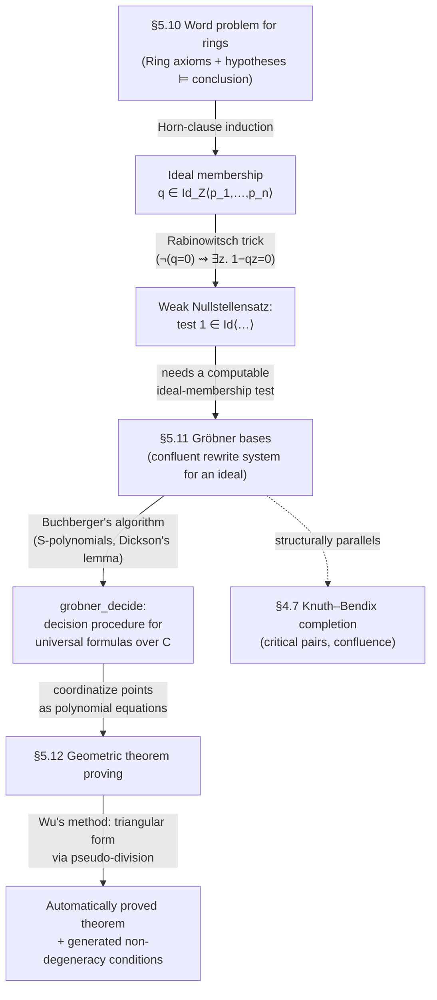

# Algebraic Decision Procedures

[[book-guidelines|↩ Back to guidelines]]

## Why leave the reals for algebra at all?

Section 5.9's real quantifier elimination decides *every* first-order sentence about real closed fields — that's an extraordinarily strong guarantee. But strength has a price: the algorithm (Tarski/Seidenberg-style sign-matrix recursion) is doubly exponential, and eliminating one quantifier tends to blow up the degree and size of the remaining formula so badly that even modest problems become impractical. If what you actually need is *validity of a purely universal statement* — $\forall x_1 \ldots x_n.\ P[x_1,\ldots,x_n]$ over the complex numbers, no quantifier alternation at all — you're paying for generality you don't need.

Harrison's move in §5.10–5.12 is to notice that a huge class of practically important universal statements — "these polynomial hypotheses imply this polynomial conclusion" — can be answered by a completely different route: translate the logical question into a question about **ideals of polynomials**, and answer *that* question with **rewriting**. This is the same move you already know from Chapter 4: a validity question becomes a normal-form computation, provided you can build a confluent rewrite system. The new ingredient is that the "terms" being rewritten are now polynomials, and the rewrite system is a **Gröbner basis** built by **Buchberger's algorithm** — a direct algebraic cousin of Knuth–Bendix [[Equality-Reasoning#Completion|completion]]. Once you have that machine, an entire sub-industry — automatically proving Euclidean geometry theorems — falls out of it (§5.12), because geometric statements about points translate directly into polynomial equations over their coordinates.

This is the chapter's clearest illustration of a theme that recurs throughout your compiler-verifier project: a *semantic* decidability argument (Horn theories are convex, Nullstellensätze relate provability to ideal membership) cashed out as a *terminating rewriting procedure* with a clean confluence criterion — exactly the shape a constraint solver takes when it can be phrased as "normalize and compare to a target."

---

## Part 1 — Word problems for rings, and reducing them to ideal membership

### What problem is a "word problem," concretely?

Given a class of algebraic structures $K$ (say, all rings, or all groups) and a set of ground equations $E$, the **word problem for $K, E$** asks: given a new equation $s = t$, does $E \models_M s = t$ hold in *every* model $M$ of $K$? Three variants matter:

- **uniform word problem**: both $E$ and $s = t$ vary — decide $E \models_M s=t$ for arbitrary $E$;
- **word problem for $K, E$**: $E$ is fixed, only $s = t$ varies;
- **free word problem**: $E = \varnothing$ — decide whether $s = t$ is a *logical* consequence of $K$'s axioms alone.

You've already solved the free word problem for groups: run Knuth–Bendix completion on the group axioms, rewrite both sides of $s=t$ to normal form, and compare. But this doesn't generalize cleanly — there exist finite $E$ for which the word problem for groups is *undecidable* (Novikov 1955; Boone 1959). So a blanket "run completion" strategy is a dead end for general algebraic theories. Rings, however, behave much better, and that's the class Harrison focuses the machinery on.

**What breaks without this reduction:** without a route from "is this equation a semantic consequence of the ring axioms plus hypotheses" down to a *purely syntactic, checkable* condition, you're stuck doing first-order proof search in a theory (`Ring`) whose axioms are just equations — technically decidable in principle via resolution/Horn-clause methods, but with no termination guarantee and no exploitable structure. The Nullstellensatz-style theorems below give you that structure.

### Rings and polynomial rings, precisely

A **ring** is an algebraic structure with $+, \cdot, 0, 1, -$ satisfying commutativity/associativity/identity for $+$ and $\cdot$, and distributivity. Harrison works in first-order logic *without* equality, so `Ring` bundles in explicit reflexivity/symmetry/transitivity/congruence axioms for $=$. Elementary consequences like $0 \cdot x = 0$ and $s = t \iff s - t = 0$ let every equation be normalized to the form $t = 0$ — this "reduce everything to compare-with-zero" move is what makes ideal membership the right target notion.

The **characteristic** of a ring is the least $n>0$ with $n\cdot 1 = 0$ (or $0$ if none exists — "characteristic zero"). $\mathbb{Z}/6\mathbb{Z}$ has characteristic 6; $\wp(A)$ under symmetric difference and intersection has characteristic 2; $\mathbb{R}$ has characteristic 0. This matters because several of the theorems below are characteristic-sensitive.

Given a base ring $R$, the **polynomial ring** $R[x_1,\ldots,x_n]$ is defined — carefully — not as an expression syntax (which conflates $x+1$ and $1+x$) and not as a set of functions (which conflates $x^2+x$ and $0$ over a 2-element ring), but as a function $p : \mathbb{N}^n \to R$ with finite support, where $(i_1,\ldots,i_n)$ names the monomial $x_1^{i_1}\cdots x_n^{i_n}$ and $p$ gives its coefficient. This is the *canonical form* move again — the same instinct as canonical rewriting systems in Chapter 4, just applied to a different syntactic category.

**Rust [[Equality-Reasoning#Grounding|grounding]].** The book's OCaml representation is a sparse, sorted association list of `(coefficient, exponent-vector)` pairs. A direct Rust transliteration:

```rust
use num_rational::BigRational as Q;

#[derive(Clone, PartialEq, Eq, PartialOrd, Ord, Debug)]
struct Monomial(Vec<u32>);   // exponent vector, aligned to a fixed variable list

#[derive(Clone, Debug)]
struct Term(Q, Monomial);    // a "monomial" in Harrison's loose sense: coeff + exponents

// A polynomial: sorted descending by a fixed monomial order, no zero coefficients.
#[derive(Clone, Debug, Default)]
struct Poly(Vec<Term>);

impl Monomial {
    fn mul(&self, other: &Monomial) -> Monomial {
        Monomial(self.0.iter().zip(&other.0).map(|(a, b)| a + b).collect())
    }
    fn divides(&self, other: &Monomial) -> bool {
        self.0.iter().zip(&other.0).all(|(a, b)| a <= b)
    }
    fn lcm(&self, other: &Monomial) -> Monomial {
        Monomial(self.0.iter().zip(&other.0).map(|(a, b)| *a.max(b)).collect())
    }
}
```

This is the load-bearing data structure for everything that follows: monomial ordering (`Ord` above, but really the graded-reverse-lex order defined below), reduction, and S-polynomials are all built on top of it.

The book's monomial order compares first by **total degree** (multidegree, the sum of all exponents), breaking ties **reverse-lexicographically**. So $x_2^2 \prec x_1^2 x_2$ (degree 2 vs. 3), and among degree-3 monomials $x_1^2x_2 \succ x_2^3$ because $x_1$'s exponent is compared first. This order is compatible with multiplication ($m_1 \prec m_2 \Rightarrow m\cdot m_1 \prec m\cdot m_2$) — the single property that makes everything downstream (termination of reduction, Dickson's lemma argument) work.

### Ideals: the target notion

Given polynomials $p_1,\ldots,p_n \in R[\mathbf x]$, the **ideal** $\mathrm{Id}_R\langle p_1,\ldots,p_n\rangle$ is the set of all $R$-linear *polynomial* combinations $p_1 q_1 + \cdots + p_n q_n$ (the $q_i$ — "cofactors" — range over arbitrary polynomials, not just constants). Ideals are closed under $+, -,$ and multiplication by any polynomial; these five closure facts (Harrison lists them explicitly) are the entire toolkit used to prove every Nullstellensatz-style theorem that follows, by structural induction on proof trees.

### Theorem 5.15 — the word problem for rings *is* ideal membership

$$\mathrm{Ring} \models \forall\mathbf x.\ p_1(\mathbf x)=0 \wedge \cdots \wedge p_n(\mathbf x)=0 \Rightarrow q(\mathbf x)=0 \iff q \in \mathrm{Id}_{\mathbb Z}\langle p_1,\ldots,p_n\rangle.$$

The proof is a clean induction: the ring axioms plus the hypotheses $p_i = 0$ are all **Horn clauses**, so by the Chapter 3 results on Prolog-style deduction, any semantic entailment has a Prolog-style (definite-clause) proof tree. Induct on that tree, showing at every node that $(s - t) \in \mathrm{Id}_{\mathbb Z}\langle p_1,\ldots,p_n\rangle$ — leaves are trivial (axioms give $s-t \approx 0$; hypotheses give $p_i$ itself), and every inference rule (transitivity, congruence, …) preserves membership because ideals are closed exactly under the operations those rules perform. This is a beautiful instance of "compile a proof-theoretic completeness argument into closure properties of an algebraic object" — the semantic content of first-order Horn deduction gets absorbed entirely into the ideal-closure lemmas, and the resulting criterion no longer mentions proof search at all.

The **free word problem** (Theorem 5.16) is the $n=0$ special case: $\mathrm{Ring} \models s = t \iff s \approx t$, i.e. $s$ and $t$ normalize to the *same polynomial*. This already tells you the previous group-word-problem-via-rewriting story was a special case of a more general phenomenon.

Convexity of Horn theories (Theorem 3.39, cited here) also lets you handle the *general* universal clause $\bigwedge_i p_i(\mathbf x)=0 \Rightarrow \bigvee_j q_j(\mathbf x)=0$ — with several disjuncts $q_j$, it decomposes into a disjunction of separate word problems, so ideal membership solves the entire universal theory of rings, not just single-conclusion implications.

### Torsion-free rings and integral domains: adjusting the target ring

**Torsion-free rings** add the infinite axiom set $T = \{\forall x.\ nx=0 \Rightarrow x=0 \mid n\ge 1\}$. Theorem 5.17 sharpens membership to $\mathrm{Id}_{\mathbb Q}$ instead of $\mathrm{Id}_{\mathbb Z}$ — i.e. now the cofactors are allowed rational coefficients. (A non-trivial torsion-free ring automatically has characteristic zero, though the converse fails in general — it holds for integral domains, considered next.)

**Integral domains** add the *non-Horn* axiom $I$: $x\cdot y = 0 \Rightarrow x=0 \vee y=0$. This is the first genuinely new proof-theoretic wrinkle: since $I$ isn't Horn, Prolog-style deduction trees no longer suffice, and Harrison switches to **binary resolution** (refutation-complete, Chapter 3) over the clausal instantiations. The inductive invariant generalizes accordingly — instead of tracking simple ideal membership per node, each clause in the refutation is shown to satisfy
$$\Big(\big(\textstyle\sum_i q_i\big)\big(\textstyle\prod_j f_j\big)\Big)^k \in \mathrm{Id}_{\mathbb Z}\langle e_1,\ldots,e_r,p_1,\ldots,p_n\rangle$$
for *some* exponent $k$ — the power $k$ is what tracks the bookkeeping needed to push $I$'s disjunction through resolution's factoring and pseudo-resolution steps. This yields **Theorem 5.18**, the general result for integral domains:
$$\mathrm{Ring}\cup\{I\} \models \forall\mathbf x.\ \bigwedge_i p_i(\mathbf x)=0 \Rightarrow \bigvee_i q_i(\mathbf x)=0 \iff \exists k\ge 0.\ \Big(\textstyle\prod_i q_i\Big)^k \in \mathrm{Id}_{\mathbb Z}\langle p_1,\ldots,p_n\rangle.$$
The power $k$ is *exactly* the "how many multiplicities of degeneracy" cost of moving from a Horn theory's convexity to a genuinely disjunctive one — the single technical wrinkle that separates rings (easy, Horn) from integral domains (harder, needs an exponent search).

Specializing further: for characteristic $p$ (Theorem 5.20) you additionally need a scalar $c$ not divisible by $p$; for characteristic 0 (Theorem 5.21) you get the cleanest form, $q^k \in \mathrm{Id}_{\mathbb Q}\langle p_1,\ldots,p_n\rangle$.

### Fields, algebraic closure, and arriving back at $\mathbb{C}$

A **field** is a non-trivial ring where every nonzero element is invertible; fields are automatically integral domains. The converse fails ($\mathbb Z$ isn't a field) but every integral domain embeds in its **field of fractions** (the familiar $(p,q) \sim (p',q') \iff pq'=p'q$ construction). Because universal formulas transfer both ways across this embedding, **Theorem 5.22**: a universal ring-language formula holds in all fields [of characteristic $p$] iff it holds in all integral domains [of characteristic $p$].

Pushing one step further: every field embeds in an **algebraically closed field**, and by the Fundamental Theorem of Algebra, $\mathbb{C}$ is exactly the algebraically closed field of characteristic 0 that Section 5.8's complex quantifier elimination already used. Chaining all these equivalences together, Harrison arrives at a striking closing-the-loop result: for a universal ring-language formula, *all* of the following are equivalent —

- holds in all integral domains of characteristic 0,
- holds in all fields of characteristic 0,
- holds in all algebraically closed fields of characteristic 0,
- holds in $\mathbb{C}$.

So after this whole detour into abstract algebra, deciding a universal statement reduces right back to something about $\mathbb{C}$ — but now via ideal membership rather than quantifier elimination.

### The Rabinowitsch trick — this is your Nullstellensatz

This is the piece with the most direct payoff for **non-linear constraint solving**: it's literally how you turn "prove this doesn't factor a solution out" into a *positive* algebraic statement. For a general clause with a disjunctive conclusion, convexity (used for pure rings) doesn't apply — $I$ is non-Horn. Harrison's fix: since fields have inverses, $\neg(x=0) \iff \exists y.\ xy=1$. This licenses rewriting *negated* equations as *unnegated* ones (with fresh existential variables):
$$\forall\mathbf x.\ \bigwedge_i p_i(\mathbf x)=0 \Rightarrow q(\mathbf x)=0 \quad\rightsquigarrow\quad \forall \mathbf x\, z.\ \bigwedge_i p_i(\mathbf x)=0 \wedge (1 - q(\mathbf x)z)=0 \Rightarrow \bot.$$
This is the **Rabinowitsch trick**. Since $\bot \iff 1=0$ in any field, the whole question collapses to **membership of the constant $1$** in an ideal — the **weak Nullstellensatz** (Theorems 5.23–5.24): $\forall \mathbf x.\ \bigwedge p_i(\mathbf x)=0 \Rightarrow \bot$ holds in all integral domains/fields [of characteristic 0] iff $1 \in \mathrm{Id}_{\mathbb Z}\langle p_1,\ldots,p_n\rangle$ (resp. $\mathrm{Id}_{\mathbb Q}$). This is preferred computationally over the strong form because you no longer need to search over exponents $k$ — you just add one new variable per negated conclusion and test triviality of the resulting ideal.

**Connection to your CSP kernel.** This is precisely the shape of a **non-linear constraint satisfaction problem over polynomial equalities**: "does this system of polynomial equality constraints have a common solution?" becomes "is $1$ in the ideal generated by the constraint polynomials (plus Rabinowitsch witnesses for disequalities)?" A CSP kernel that needs to detect *infeasibility* of a conjunction of polynomial equality/disequality constraints — exactly the kind of non-linear arithmetic domain your abstract-interpretation engine will eventually need to handle alongside linear/interval domains — can use ideal-triviality-via-Gröbner-basis as a *decision procedure module*, the same way an SMT solver plugs in a Presburger or linear-arithmetic theory solver. It won't scale to everything (worst-case doubly exponential, as noted below), but for structured algebraic side-conditions arising from verification conditions (e.g. an invariant expressed as a polynomial equality), it's a real, complete decision procedure — not a heuristic.

### Monoids and abelian groups: going the other way

Symmetrically, Harrison shows universal formulas for **abelian monoids** reduce to the same ring-based ideal-membership machinery (Theorem 5.25, via the *monoid ring* construction — literally the polynomial-ring construction generalized to replace monomials with arbitrary monoid elements), and for **abelian groups** (Theorem 5.27) the reduction becomes especially concrete: $s - t \in \mathrm{Id}_{\mathbb Z}\langle s_1-t_1,\ldots,s_n-t_n\rangle$ is equivalent to the existence of plain *integer* cofactors $c_1,\ldots,c_n$ with $s-t = \sum c_i(s_i-t_i)$ — because everything has multidegree 1, you never need cofactors beyond constants. This is why the group word problem, restricted to *abelian* groups, is tractable even though general groups are undecidable: commutativity is exactly what buys you the ring embedding.

---

## Part 2 — Gröbner bases: making ideal membership *computable*

### The naive approach, and why it's not good enough

Theorems 5.15–5.27 tell you *what* to check (ideal membership) but not *how*. A first attempt: parametrize candidate cofactors $q_i$ as polynomials of some bounded degree, expand, and compare coefficients — this reduces to solving a *linear* system (over $\mathbb{Q}$ or $\mathbb{Z}$, both tractable). Harrison works a concrete example ($x^4+1 \in \mathrm{Id}\langle x^2+xy+1, y^2-2\rangle$) this way. The defect: you must *guess* a degree bound on the cofactors up front. Iterative deepening turns this into a semi-decision procedure (find a proof if one exists, loop forever if not) — and even the known theoretical degree bounds (Hermann 1926) are doubly exponential over $\mathbb{Q}$ and worse over $\mathbb{Z}$. **What breaks without Gröbner bases:** you get a correct but practically useless algorithm — no different in spirit from an unbounded brute-force search over proof depth.

### Reduction as rewriting

Gröbner bases fix this by replacing "guess cofactors" with "build a confluent rewrite system," reusing essentially all of §4.5's abstract-reduction-relation machinery. A polynomial equation $m_1 + m_2 + \cdots + m_p = 0$ (with $m_1$ the *head* monomial under the chosen order) becomes a rewrite rule $m_1 \to -m_2-\cdots-m_p$. **Reduction**: $p \to_S p'$ if $p$ contains a monomial $m$ divisible by some rule's head monomial $h$ (with $h+q \in S$), and $p' = p - m'(h+q)$ for the appropriate cofactor monomial $m'$.

```rust
// One reduction step: try to rewrite the head-divisible term of `target`
// using any polynomial in `basis` whose head monomial divides it.
fn reduce_step(target: &Poly, basis: &[Poly]) -> Option<Poly> {
    for term @ Term(c, m) in &target.0 {
        for rule in basis {
            let Term(hc, hm) = &rule.0[0]; // head monomial of the rule
            if hm.divides(m) {
                let quotient = Term(c / hc, /* m - hm componentwise */ subtract_exp(m, hm));
                // subtract quotient * rule from target
                return Some(target.sub(&rule.scale_by_monomial(&quotient)));
            }
        }
    }
    None
}
```

**Termination** is guaranteed regardless of $S$ or the starting polynomial: a reduction step replaces one monomial by strictly *smaller* ones (under the well-founded multidegree order), and there are only finitely many monomials below any given one — so termination follows from well-foundedness of the multiset ordering (Appendix 1 of the book), exactly the argument used for LPO termination in §4.6.

### Confluence, S-polynomials, and the Knuth–Bendix analogy made explicit

Since reduction terminates, Newman's Lemma (Theorem 4.9, reused verbatim) says confluence $\iff$ *local* confluence. Two reductions of the same polynomial to different monomials can only genuinely conflict if they rewrite the **same** monomial $m$ — this is the polynomial analogue of a critical pair in term rewriting. The "most general" such conflict occurs at $m = \mathrm{LCM}(m_1,m_2)$ where $m_1, m_2$ are the head monomials of the two competing rules — this is the Gröbner-basis version of unifying two rewrite-rule left-hand sides in Knuth–Bendix completion. Given two polynomials $p, q$ with head monomials $m_1, m_2$ and $\mathrm{LCM}(m_1,m_2) = m_1'm_1 = m_2'm_2$, the **S-polynomial** (for *syzygy*) is:
$$S(p,q) = m_1' p - m_2' q.$$

```ocaml
let spoly pol1 pol2 =
  match (pol1,pol2) with
    ([],p) -> []
  | (p,[]) -> []
  | (m1::ptl1,m2::ptl2) ->
        let m = mlcm m1 m2 in
        mpoly_sub (mpoly_mmul (mdiv m m1) ptl1)
                  (mpoly_mmul (mdiv m m2) ptl2);;
```

**Theorem 5.35** (the polynomial analogue of Theorem 4.24/Corollary 4.25 for term rewriting): a finite set $F$ defines a confluent reduction relation $\to_F$ iff every S-polynomial $S(p,q)$ for $p,q \in F$ reduces to $0$. So — exactly as with [[Equality-Reasoning#Critical pairs|critical pairs]] in Knuth–Bendix — confluence of a possibly-infinite relation reduces to a *finitely checkable* condition on *finitely many* pairwise obligations.

| Knuth–Bendix completion (§4.7) | Buchberger's algorithm (§5.11) |
|---|---|
| terms + rewrite rules | polynomials + head-monomial rules |
| critical pair (unify overlapping LHSs) | S-polynomial (LCM of head monomials) |
| local confluence ⟺ all critical pairs joinable | confluence ⟺ all S-polys reduce to 0 |
| orient a normalized non-joinable pair into a new rule | add a normalized nonzero S-poly-reduct as a new basis element |
| **may not terminate** (fair strategy needed) | **guaranteed to terminate** (Dickson's lemma) |
| gives a canonical TRS for an equational theory | gives a **Gröbner basis** for an ideal |

### Gröbner bases: definition and the payoff theorem

$F$ is a **Gröbner basis** for ideal $J$ if $J = \mathrm{Id}_{\mathbb{Q}}\langle F\rangle$ *and* $\to_F$ is confluent. The payoff (**Theorem 5.38**) is exactly the rewriting-decides-equality pattern from Chapter 4, transported to ideals:

- $F$ is a Gröbner basis for $\mathrm{Id}_{\mathbb Q}\langle F\rangle$ $\iff$
- for any $p$: $p \to_F^* 0 \iff p \in \mathrm{Id}_{\mathbb Q}\langle F\rangle$ $\iff$
- for any $p,q$: $p \downarrow_F q \iff (p-q) \in \mathrm{Id}_{\mathbb Q}\langle F\rangle$.

In particular, **ideal membership becomes: reduce $p$ to normal form and check whether the result is $0$.** Testing whether $1$ is in the ideal (the weak-Nullstellensatz criterion from Part 1) is then a single normal-form computation.

### Buchberger's algorithm

Structurally identical to completion: maintain a `basis` and a worklist of `pairs`; for each pair, reduce its S-polynomial against the current basis; if the result is nonzero, add it to the basis and generate new pairs against everything already there; repeat until the worklist empties.

```ocaml
let rec grobner basis pairs =
  match pairs with
    [] -> basis
  | (p1,p2)::opairs ->
        let sp = reduce basis (spoly p1 p2) in
        if sp = [] then grobner basis opairs
        else if forall (forall ((=) 0) ** snd) sp then [sp] else
        let newcps = map (fun p -> p,sp) basis in
        grobner (sp::basis) (opairs @ newcps);;

let groebner basis = grobner basis (distinctpairs basis);;
```

The one crucial way this *beats* Knuth–Bendix: **termination is guaranteed**, not merely hoped for under a fair strategy. The proof is **Dickson's Lemma** — there is no infinite sequence of monomials $(m_i)$ in $\mathbb{N}^n$ such that $m_j$ is never divisible by $m_i$ for $i<j$ — proved by induction on the number of variables via a "minimal bad sequence" argument (the same proof technique used for LPO termination in Chapter 4). Because Buchberger's algorithm only ever adds a polynomial whose monomials are *not* divisible by any existing basis head monomial, an infinite run would produce exactly such a forbidden sequence. This guaranteed termination is a genuinely stronger property than what completion offers, and it's why Gröbner-basis engines can be run as unconditional decision procedures rather than best-effort heuristics.

**Rust sketch of the algorithm's control loop** (the reduce/S-poly plumbing above already gives you `reduce` and `spoly`):

```rust
fn groebner_basis(mut basis: Vec<Poly>) -> Vec<Poly> {
    let mut pairs: Vec<(usize, usize)> =
        (0..basis.len()).flat_map(|i| (i+1..basis.len()).map(move |j| (i, j))).collect();
    while let Some((i, j)) = pairs.pop() {
        let sp = reduce(&spoly(&basis[i], &basis[j]), &basis);
        if sp.is_zero() { continue; }
        if sp.is_nonzero_constant() { return vec![sp]; } // ideal is trivial: contains 1
        let new_idx = basis.len();
        pairs.extend((0..new_idx).map(|k| (k, new_idx)));
        basis.push(sp);
    }
    basis
}
```

### `grobner_decide`: the universal decision procedure

Putting it together, `grobner_trivial` takes a set of equations/inequations, applies the Rabinowitsch trick to each negated equation (introducing a fresh variable per disequality), builds the Gröbner basis of the resulting polynomial set, and checks whether $1$ reduces to $0$ — i.e. whether the ideal is trivial:

```ocaml
let grobner_trivial fms =
  let vars0 = itlist (union ** fv) fms []
  and eqs,neqs = partition positive fms in
  let rvs = map (fun n -> variant ("_"^string_of_int n) vars0) (1--length neqs) in
  let vars = vars0 @ rvs in
  let poleqs = map (mpolyatom vars) eqs
  and polneqs = map (mpolyatom vars ** negate) neqs in
  let pols = poleqs @ map2 (rabinowitsch vars) rvs polneqs in
  reduce (groebner pols) (mpoly_const vars (Int 1)) = [];;

let grobner_decide fm =
  let fm1 = specialize(prenex(nnf(simplify fm))) in
  forall grobner_trivial (simpdnf(nnf(Not fm1)));;
```

`grobner_decide` handles a *general* universal formula by simplifying/prenexing, negating, converting to DNF, and testing each disjunct for triviality — the standard "refute the negation" architecture used throughout the chapter. On examples like
```
grobner_decide <<a^2 = 2 /\ x^2 + a*x + 1 = 0 ==> x^4 + 1 = 0>>
```
it returns `true` after building a tiny 3-element basis — and Harrison notes it is often *dramatically* faster than real/complex quantifier elimination on formulas with many variables, precisely because it avoids QE's characteristic blow-up from repeated elimination.

**What breaks without this machinery:** you'd be back to either (a) bounded-degree linear-system guessing with no completeness guarantee at a fixed bound, or (b) full quantifier elimination, whose cost is dominated by variable-elimination blow-up rather than the actual algebraic content of the hypotheses. Gröbner bases isolate exactly the "is this system of polynomial equalities/disequalities jointly satisfiable" question and answer it with a rewriting engine that's complete *and* terminating.

---

## Part 3 — Geometric theorem proving: coordinates, complex tricks, and Wu's method

### From points to polynomials

The chapter's payoff application: automate Euclidean geometry proofs via **coordinatization** (Fermat/Descartes). Each point $p$ becomes a pair of coordinates $(p_x, p_y)$, and geometric predicates become polynomial equations — a *template library*, essentially a small DSL compiler from geometric relations to algebra:

- **collinear**$(1,2,3)$: $(1_x-2_x)(2_y-3_y) = (1_y-2_y)(2_x-3_x)$
- **perpendicular**$(1,2,3,4)$: $(1_x-2_x)(3_x-4_x) + (1_y-2_y)(3_y-4_y) = 0$
- **is\_midpoint**$(1,2,3)$: $2\cdot 1_x = 2_x+3_x \wedge 2\cdot 1_y = 2_y+3_y$
- **lengths\_eq**: equality of *squared* lengths, avoiding square roots entirely.

Harrison flags a deliberate design choice here: length and angle are never defined directly (they need square roots and arctangents, which don't play well with polynomial algebra); instead everything is phrased via **quadrance** (squared distance) and **spread** (squared sine of an angle) — Wildberger's (2005) proposal for a square-root-free "rational trigonometry." This is exactly the discipline you want in a verifier: stick to operations your decision procedure's domain (here, polynomial equalities) can represent exactly, rather than reaching for transcendental functions that would force you out of the algebraic fragment.

### Exploiting invariance to fix a convenient coordinate frame

Before attacking a theorem, `grobner_decide` itself is used as a *meta-tool* to verify that each geometric predicate is invariant under translation, rotation ($x \to cx-sy,\ y\to sx+cy$ with $s^2+c^2=1$), and scaling — but *not* shearing (perpendicularity and length-equality break under shear). This licenses picking a convenient coordinate system for free — e.g. placing one point at the origin, another on the x-axis — without loss of generality, which is exactly the kind of symmetry-reduction technique that also matters for keeping a CSP's search space small: fix gauge/symmetry before search, not during it.

### Wu's first insight: prove over $\mathbb{C}$, get $\mathbb{R}$ for free

Real quantifier elimination *could* answer these questions directly, but it's far too slow for non-trivial geometry. Wu Wen-tsün's (1978) key observation: **remarkably many geometric theorems, stated as universal polynomial statements, remain true for all complex values of the coordinates** — not just real ones. Since $\mathbb{C} \subseteq$ (in the relevant algebraic sense) validity implies real validity for universal formulas, you can decide the *harder-looking* but computationally *easier* complex statement with Gröbner bases, and the real geometric theorem follows for free. (The converse can fail — $\forall x.\ x^2+1=0$ is false over $\mathbb{C}$ trivially but says nothing about $\mathbb{R}$ — so this is a one-directional soundness argument, not an equivalence; in practice it's adequate for almost all classical theorems.) This section's connection to the reader's CSP/constraint-solving interests is more standalone than Part 1/2's — the geometric coordinatization itself doesn't map cleanly onto the refinement-type or Horn-clause machinery — but the underlying "decide over an easier structure that soundly over-approximates the one you care about" pattern is one you'll recognize from abstract interpretation.

### Degenerate cases: why non-degeneracy conditions are unavoidable

A first example — an isosceles-triangle theorem — works immediately with `grobner_decide`. But the *parallelogram theorem* (diagonals bisect each other) initially comes back **false**. The reason isn't the complex-numbers trick; it's that the naive formalization doesn't exclude the degenerate case where all four points are **collinear** (a "flat" parallelogram). Adding `~collinear(a,b,c)` as an extra hypothesis fixes it. This is the chapter's explicit warning: **geometric theorems as usually stated carry unstated non-degeneracy assumptions**, and naive coordinatization will simply return "false" (a genuine counterexample in the degenerate configuration) rather than silently succeeding — a much better failure mode than silent unsoundness, but one that demands the prover *produce* the missing conditions rather than the human guessing them.

### Wu's method: triangular form via pseudo-division

Wu's second contribution is a way to *generate* the needed non-degeneracy conditions automatically, using a different algebraic strategy from Gröbner bases: put the hypothesis polynomials in **triangular form**.

$$
\begin{aligned}
p_m(x_1,\ldots,x_k,x_{k+1},\ldots,x_{k+m}) &= 0\\
&\ \ \vdots\\
p_1(x_1,\ldots,x_k,x_{k+1}) &= 0\\
p_0(x_1,\ldots,x_k) &= 0
\end{aligned}
$$

where each $p_i$ introduces exactly one new "top" variable not appearing in the equations below it — exploiting exactly the *constructive order* in which geometric problems are naturally phrased (point $P_i$ is defined by constraints only on earlier points $P_j,\ j<i$).

Given the triangular set and a target polynomial $p$, **pseudo-division** by the top polynomial $p_m$ (treating other variables as parameters) yields
$$a_m^k\, p = p_m \cdot s_m + p'$$
for some integer power $k$ (needed because polynomial coefficients, not just constants, may need clearing). A **sufficient** (not necessary!) condition for $p=0$ given $p_m=0$ is then $a_m = 0 \wedge p' = 0$ — and crucially, $a_m=0$ is exactly a **non-degeneracy condition**: it's the leading coefficient that had to be nonzero for the pseudo-division to behave as expected. Iterating this pseudo-division down through $p_{m-1}, \ldots, p_0$ eventually eliminates every "constructed" variable, leaving a conjunction of purely algebraic side-conditions on the base points.

```ocaml
let rec pprove vars triang p degens =
  if p = zero then degens else
  match triang with
    [] -> (mk_eq p zero)::degens
  | (Fn("+",[c;Fn("*",[Var x;_])]) as q)::qs ->
        if x <> hd vars then
          if mem (hd vars) (fvt p)
          then itlist (pprove vars triang) (coefficients vars p) degens
          else pprove (tl vars) triang p degens
        else
          let k,p' = pdivide vars p q in
          if k = 0 then pprove vars qs p' degens else
          let degens' = Not(mk_eq (head vars q) zero)::degens in
          itlist (pprove vars qs) (coefficients vars p') degens';;
```

The non-degeneracy conditions the algorithm emits (as a growing `degens` list, alongside the accumulated proof obligations) are exactly the missing hypotheses a human geometer would have silently assumed — Wu's method makes them *explicit output* rather than tacit background knowledge.

`triangulate` turns an arbitrary polynomial set into triangular form: repeatedly find the polynomial of lowest degree in the current "top" variable, pseudo-divide every other polynomial by it (this strictly decreases the aggregate degree in that variable, guaranteeing termination), and recurse. Because geometric constructions are already "almost triangular" (each new point is defined by one or two equations in its own coordinates), triangulation tends to be fast — though Harrison notes the tradeoff: triangular sets are quick to *build* but a Gröbner basis is often more efficient to actually *reduce with*. Two genuinely different rewriting-flavored strategies, each with its own cost profile — a tradeoff worth remembering when your own verifier has to choose between building a canonical form up front versus reducing on demand.

**Why this is "sufficient, not necessary."** Wu's triangularization produces *a* proof, when the theorem is true and the non-degeneracy side-conditions hold — but a different triangular decomposition (different variable order, different choice of leading coefficients) could in principle produce a different, incomparable set of side-conditions. This is fundamentally weaker than a true quantifier-elimination *equivalence* (which characterizes the exact real-solvability condition): Wu's method gives you a *sufficient* algebraic certificate, cheaply, at the cost of not being a canonical/complete characterization the way Gröbner-basis ideal triviality is. It's the same tradeoff you'll face choosing between a sound-but-incomplete invariant generator and a complete-but-expensive one.

### Worked examples: Simson's theorem and Pappus's theorem

**Simson's theorem**: for four points $A,B,C,D$ on a circle centered at $O$, the feet of the perpendiculars from $D$ to the three sides of triangle $ABC$ are collinear. Encoded as:
```ocaml
let simson =
 <<lengths_eq(o,a,o,b) /\ lengths_eq(o,a,o,c) /\ lengths_eq(o,a,o,d) /\
   collinear(e,b,c) /\ collinear(f,a,c) /\ collinear(g,a,b) /\
   perpendicular(b,c,d,e) /\ perpendicular(a,c,d,f) /\
   perpendicular(a,b,d,g)
   ==> collinear(e,f,g)>>;;
```
With $A$ at the origin and $O$ on the x-axis, `wu simson vars zeros` runs quickly and returns non-degeneracy conditions that simplify to $(b_x-c_x)^2+(b_y-c_y)^2=0$, $b_x^2+c_x^2=0$, $b_x=c_x$, $c_x^2+c_y^2=0$, $b_x=0$, $c_x=0$, and a trivial $-1=0$. These say — once you read past the algebra — that $B\ne C$, $B\ne A$, and $C\ne A$: exactly the "these aren't degenerate points" conditions a geometer takes for granted. The choice of coordinate system matters enormously for performance: running the same theorem *without* the special coordinate choice (`wu simson (vars @ zeros) []`) takes substantially longer, though it produces an equivalent (re-expressed) answer.

**Pappus's theorem**: given collinear triples $A_1,A_2,A_3$ and $B_1,B_2,B_3$, the pairwise intersection points of lines $A_iB_j / A_jB_i$ are themselves collinear. Choosing the two given lines *as the coordinate axes* (so all $A_i$ have $y=0$ and all $B_i$ have $x=0$) — exploiting invariance under general affine transformations, not just the rigid ones — gives a fast solution whose non-degeneracy output translates to: the relevant line-pairs aren't parallel, and $A_1, A_2$ aren't the origin (i.e., the two chosen axes actually meet at a single point rather than the construction being vacuous).

---

## Where this leads



Within the book, this section closes out the chapter's "algebraic" wing before §5.13 turns to *combining* decision procedures across theories (Nelson–Oppen, Shostak) — the natural next question once you have several complete, terminating decision procedures (Presburger, real/complex QE, Gröbner-basis ring theory) and need them to cooperate inside one SMT-style solver.

For your own project, the load-bearing takeaways are:

- **Ideal-membership-via-Gröbner-basis is a genuine non-linear-arithmetic theory solver**, complete and terminating (unlike Knuth–Bendix), directly pluggable into a CSP/SMT kernel as the module responsible for polynomial equality constraints — the natural complement to your linear/interval/lattice domains when a verification condition involves multiplication of program variables (e.g. array-index arithmetic, geometric or physical invariants).
- **The confluence-via-critical-pairs pattern is now a recurring architectural motif**, not a one-off: term rewriting (Knuth–Bendix, Ch. 4) and polynomial rewriting (Buchberger, here) are the same abstract-reduction-relation theory (Newman's Lemma, local confluence) instantiated on two different term algebras. If your elaborator or invariant generator ever needs a *third* instance — say, canonicalizing constraint clauses under some domain-specific algebra — this is the template to reach for.
- **Wu's method is a cautionary, useful example of a sound-but-incomplete certificate generator**: it produces sufficient side-conditions cheaply rather than a canonical equivalence. When you're designing your own invariant-generation or refinement-type inference procedure, this is the tradeoff between "expensive and exact" (Gröbner-basis triviality, full QE) versus "cheap and sufficient, with explicit generated side-conditions" (Wu-style triangularization) — both are legitimate design points, and the *explicit* non-degeneracy output is the model to imitate whenever your own procedure produces a sound-but-partial proof.
