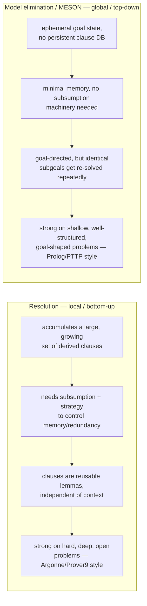
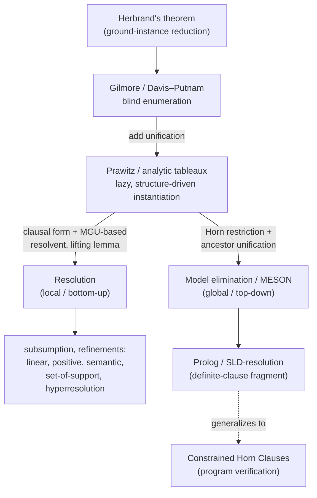

# Automated First-Order Theorem Proving

[[book-guidelines|↩ Back to guidelines]]

> This article picks up exactly where [[First-Order-Logic-Syntax-and-Semantics|First-Order Logic: Syntax and Semantics]] leaves off. That article got you to **Herbrand's theorem**: a quantifier-free formula is first-order satisfiable iff every finite set of its ground instances is propositionally satisfiable. That's a beautiful reduction — first-order satisfiability collapses to propositional satisfiability — but it is not yet an algorithm. This article is about what Harrison does with that theorem across §3.8–3.16: turn it into six successively smarter proof-search procedures, each one attacking the same underlying problem (the space of ground instances is infinite, and blind enumeration doesn't scale) with a sharper tool.

## The problem Herbrand's theorem leaves open

Herbrand's theorem gives you a semi-decision procedure for free: enumerate larger and larger finite sets of ground instances of a (negated, Skolemized) formula, and test each set for propositional satisfiability. If the formula is unsatisfiable, you're guaranteed to hit an unsatisfiable finite set eventually (Theorem 3.25, Corollary 3.26 in the text). Gilmore (1960) built exactly this: `groundterms`/`groundtuples` enumerate ground instances by number of function applications, `gilmore_loop` (an instance of the generic `herbloop` driver) checks each accumulated DNF for a complementary pair of literals.

**What breaks without something smarter.** Gilmore's method explodes. Converting a growing conjunction into DNF causes multiplicative blowup in the number of disjuncts — problems like Pelletier's p20 run the machine out of memory before terminating. Davis and Putnam's own 1960 procedure — the ancestor of DPLL from [[Propositional-Logic|propositional logic]] — helps by keeping formulas in CNF instead, where accumulating a new ground instance just appends clauses rather than multiplying disjuncts. `davisputnam` solves p20 in 19 ground instances where Gilmore never finishes. But even DP still "generates a very large number of ground instances and becomes quite slow at each propositional step" (Harrison, quoting Davis's own retrospective: "*effectively eliminating the truth-functional satisfiability obstacle only uncovered the deeper problem of the combinatorial explosion inherent in unstructured search through the Herbrand universe*").

The problem in both cases is the same: **blind enumeration**. You generate ground instances without knowing in advance which instantiation of the variables will actually produce a contradiction. The fix, due to Prawitz (1960) and then Robinson (1965), is to stop guessing and instead *compute* the necessary instantiation directly from the syntactic shape of the clauses. That computation is unification, and it is the single most important idea in this chapter — not just for theorem proving, but because it is the direct ancestor of what your elaborator's metavariable-unification pass will do when it resolves implicit arguments.

## Unification: computing the necessary instantiation

### The idea, before the algorithm

Suppose the Davis–Putnam loop has accumulated these two clauses (Harrison's own example):

$$P(x, f(y)) \vee Q(x, y), \qquad \neg P(g(u), v).$$

Blind enumeration would wait for ground instances where these two atoms happen to coincide syntactically. But you can *read off* the instantiation that makes them coincide: set $x = g(u)$ and $v = f(y)$. After substitution:

$$P(g(u), f(y)) \vee Q(g(u), y), \qquad \neg P(g(u), f(y)),$$

and resolution yields $Q(g(u), y)$ directly — a clause that's still as general as possible, with $u$ and $y$ left as free (implicitly universal) variables, rather than one committed to a single ground tuple.

### Definitions: unifier, MGU, generality ordering

**Definition 3.27.** Given a set of term pairs $S = \{(s_1,t_1),\dots,(s_n,t_n)\}$, a **unifier** of $S$ is an instantiation $\sigma$ such that $\mathrm{tsubst}\,\sigma\,s_i = \mathrm{tsubst}\,\sigma\,t_i$ for every $i$.

Unification problems can fail to have solutions for exactly two syntactic reasons, both worth internalizing because they will recur verbatim in a dependent-type checker's `isDefEq`:

- **Clash**: no unifier of $f(x)$ and $g(y)$ when $f \ne g$ — the top-level symbols disagree no matter what the variables become.
- **Occurs check / circularity**: no unifier of $x$ and $f(x)$ (or any term with $x$ as a proper subterm) — analogous to the unsolvable equation $x = x+1$. The unification problem $\{(x,f(y)),(y,g(x))\}$ fails for the same structural reason, analogous to $x=y+1 \wedge y=x+2$.

If a unification problem has *one* solution it has infinitely many — for any unifier $\sigma$ and any instantiation $\tau$, $\mathrm{tsubst}\,\tau \circ \mathrm{tsubst}\,\sigma$ is also a unifier. This motivates ordering instantiations by generality:

$$\sigma \le \tau \iff \exists \delta.\ \mathrm{tsubst}\,\tau = \mathrm{tsubst}\,\delta \circ \mathrm{tsubst}\,\sigma.$$

$\sigma$ is a **most general unifier (MGU)** of $S$ if it unifies $S$ and $\sigma \le \tau$ for every other unifier $\tau$. MGUs aren't unique — $\{(x,y)\}$ has both $x \mapsto y$ and $y \mapsto x$ as MGUs — but any two MGUs of the same set differ only by a variable renaming.

**What breaks without "most general."** If you unify with an over-specific instantiation (say, $x = g(f(g(y)))$ instead of $x = g(u)$), you've thrown away solutions that a more general unifier would have preserved. The lifting lemma below depends critically on always working with the MGU, not just *a* unifier — otherwise resolution steps derived from over-instantiated clauses can miss propositional resolvents that a more careful choice would have found.

### The algorithm: `unify` and `solve`

Harrison's `unify` is a finite-partial-function-building recursion. `env : var → term` accumulates assignments; `eqs` is the worklist of pairs still to process. The key invariant `env` must maintain is **cycle-freedom**: writing $x \to y$ when `env` has an assignment $x \mapsto t$ with $y$ free in $t$, there must be no chain $x_0 \to x_1 \to \cdots \to x_0$.

```ocaml
let rec istriv env x t =
  match t with
    Var y -> y = x or defined env y & istriv env x (apply env y)
  | Fn(f,args) -> exists (istriv env x) args & failwith "cyclic";;

let rec unify env eqs =
  match eqs with
    [] -> env
  | (Fn(f,fargs),Fn(g,gargs))::oth ->
        if f = g & length fargs = length gargs
        then unify env (zip fargs gargs @ oth)
        else failwith "impossible unification"
  | (Var x,t)::oth ->
        if defined env x then unify env ((apply env x,t)::oth)
        else unify (if istriv env x t then env else (x|->t) env) oth
  | (t,Var x)::oth -> unify env ((Var x,t)::oth);;

let rec solve env =
  let env' = mapf (tsubst env) env in
  if env' = env then env else solve env';;

let fullunify eqs = solve (unify undefined eqs);;
```

`unify` decomposes function applications pairwise (`Fn/Fn` case), resolves an existing assignment by substitution (`Var x` already `defined`), and otherwise tries to add $x \to t$ — but only after `istriv` confirms the addition won't create a cycle. `istriv` returns `true` for the *benign* self-loop ($t = x$, or $t$ chases through existing assignments back to $x$) and raises `"cyclic"` — which propagates as failure — for any other occurrence of $x$ inside $t$. `unify` itself only chases *indirect* assignments (`env` may map $x \to y$ and $y \to z$ instead of $x \to z$ directly); `solve` is the second pass that iterates substitution until the environment is a fixed point, producing a fully "solved form" MGU.

Harrison proves three things about this pair of functions, and the proof pattern is worth carrying forward — it's exactly the shape a dependent-type elaborator's soundness argument for `isDefEq`/unification needs:

1. **Soundness of failure.** Every recursive call preserves the invariant that the combined set `env ∪ eqs` has *exactly the same unifiers* as the original problem. So a clash or occurs-check failure at any point means the *original* problem was unsolvable — not just this intermediate state.
2. **Soundness of success.** If `unify` terminates with `env`, then `σ = solve env` is genuinely an MGU: it unifies each pair by construction, and for any other unifier $\tau$ one shows $\mathrm{tsubst}\,\tau = \mathrm{tsubst}\,\tau \circ \mathrm{tsubst}\,\sigma$, giving $\sigma \le \tau$ directly (with $\delta = \tau$).
3. **Termination.** Define the "size" of `eqs` as the total `Var`/`Fn` constructor count after fully substituting via `solve env`. Across recursive calls either the number of unassigned variables strictly decreases, or that count is unchanged and the size decreases (splitting a function application, discarding a trivial pair), or a pair is merely reversed — which can't happen twice consecutively. This lexicographic measure terminates because `env` stays cycle-free throughout.

Put together: `unify` terminates, and it terminates with success *iff the problem is solvable*, in which case `solve` yields an MGU. That's the complete correctness story for a syntactic unification algorithm, proved from five lines of pattern matching.

**A warning that matters for implementation.** Unification problems can produce exponentially large *unifiers* even though `unify env eqs` itself, by keeping terms in indirect (unexpanded) form via `env`, avoids exponential blowup in the environment representation:

```
unify_and_apply [x_0, f(x_1,x_1); x_1, f(x_2,x_2); x_2, f(x_3,x_3)]
```

produces a term that doubles in size at each level. `unify` itself can still take exponential time due to its linear descent through the chain of assignments in `istriv`/dereferencing — Martelli and Montanari (1982) give an asymptotically better algorithm, but Harrison notes the naive version is fine in practice for theorem-proving workloads.

### Rust grounding: union-find-style substitution

The direct translation of `env` is a substitution map from metavariables to terms, exactly what an elaborator's unifier maintains:

```rust
use std::collections::HashMap;

#[derive(Clone, Debug, PartialEq)]
enum Term {
    Var(String),
    Fn(String, Vec<Term>),
}

type Env = HashMap<String, Term>;

fn deref<'a>(env: &'a Env, t: &'a Term) -> &'a Term {
    match t {
        Term::Var(x) => env.get(x).map(|t2| deref(env, t2)).unwrap_or(t),
        _ => t,
    }
}

fn occurs(env: &Env, x: &str, t: &Term) -> bool {
    match deref(env, t) {
        Term::Var(y) => y == x,
        Term::Fn(_, args) => args.iter().any(|a| occurs(env, x, a)),
    }
}

fn unify(mut env: Env, mut eqs: Vec<(Term, Term)>) -> Option<Env> {
    while let Some((s, t)) = eqs.pop() {
        let s = deref(&env, &s).clone();
        let t = deref(&env, &t).clone();
        match (s, t) {
            (Term::Fn(f, fa), Term::Fn(g, ga)) if f == g && fa.len() == ga.len() => {
                eqs.extend(fa.into_iter().zip(ga));
            }
            (Term::Var(x), t) | (t, Term::Var(x)) => {
                if let Term::Var(y) = &t { if *y == x { continue; } }
                if occurs(&env, &x, &t) { return None; } // occurs check: reject cyclic binding
                env.insert(x, t);
            }
            _ => return None, // clash
        }
    }
    Some(env)
}
```

This is structurally identical to Harrison's OCaml — dereference through the environment instead of maintaining a separate `solve` pass (this variant keeps `env` in fully-dereferenced-on-read form rather than doing a final fixed-point pass, a common practical variant). The occurs check is exactly the cycle-freedom invariant Harrison proves by induction.

### Lean grounding: this *is* `isDefEq`

The style guidance in this vault promotes Lean to primary [[Equality-Reasoning#Grounding|grounding]] for exactly this kind of proof-theoretic machinery, and there's no better example than unification. Lean's elaborator maintains a **metavariable context** (`MetavarContext`) mapping metavariables to either "still open" or "assigned to a term" — structurally identical to Harrison's `env`. When Lean's kernel needs to check two terms for **definitional equality** (`isDefEq`), and one side is a metavariable `?m` not yet assigned, it performs exactly the `(Var x, t)` case above: check `?m` doesn't occur in `t` (the occurs check, to avoid infinite terms), then assign `?m := t`. When both sides are applications of the same head symbol, it recurses into arguments — exactly the `(Fn f fa, Fn g ga)` case. Two structural differences are worth flagging explicitly because they're exactly the places where **your elaborator's design decisions will diverge from this section**:

- Harrison's unification is **first-order and syntactic**: no notion of a metavariable appearing under a binder, no reduction. Lean's `isDefEq` is a **higher-order, semantic** unifier — it must unify up to $\beta\eta$-reduction and definitional unfolding, and metavariables can appear applied to bound variables (`?m x y`), which is exactly the case first-order unification has no vocabulary for at all.
- This is precisely why **Miller pattern unification** exists as a distinguished tractable fragment: when every metavariable occurrence `?m x₁ ... xₙ` has the `xᵢ` as *distinct bound variables* (a "pattern"), the problem reduces to something with unique most general solutions computable by an algorithm that is a direct, only mildly complicated descendant of the `unify`/`solve` pair above. Outside the pattern fragment, higher-order unification is undecidable in general, so real elaborators (Lean included) fall back to heuristics, postponement, and unification hints when a problem isn't a pattern.

So when you build the Miller-pattern-unification core of your elaborator, this section is quite literally the base case you are extending: get first-order syntactic unification exactly right (cycle-freedom, MGU generality, the `Fn/Fn`-decompose / `Var`-assign / occurs-check-reject case split), and pattern unification is "the same algorithm, plus a check that metavariable spines are lists of distinct bound variables, plus $\eta$-expansion bookkeeping."

### Local vs. global: bottom-up and top-down methods

Harrison draws a distinction that structures everything else in the chapter. Suppose unification derives $Q(g(u), y)$ as a new clause from two others (as above): $u$ and $y$ are free variables that can be instantiated *independently and repeatedly* every time the clause is reused later, because the clause is implicitly universally quantified and stands on its own. Methods with this property — no case-splits, every derived clause independently reusable — are called **local** or **bottom-up**: they build lemmas the way ordinary mathematical proofs do, context-free and reusable.

By contrast, if you case-split on a disjunctive clause (assume $P(x,f(y))$ separately from $Q(x,y)$ and try to refute each branch), any later instantiation of $x$ or $y$ must be applied *consistently to both branches* — you cannot conclude $(\forall xy.\,P(x,f(y))) \vee (\forall xy.\,Q(x,y))$ from $\forall xy.\,P(x,f(y)) \vee Q(x,y)$. Methods that do this — **global** or **top-down** — must propagate variable instantiations through the whole proof state, and lemmas can't be freely reused across contexts without re-proving them.

$$\textbf{tableaux} = \text{Gilmore procedure} + \text{unification} \qquad \textbf{resolution} = \text{Davis–Putnam} + \text{unification}$$

Tableaux and model elimination are global/top-down; resolution is local/bottom-up. This single architectural fork explains almost every performance difference discussed for the rest of the chapter.

## Analytic tableaux and the Prawitz procedure

### Prawitz: instantiate lazily instead of eagerly

`gilmore` instantiates *before* checking propositional structure — generating full ground DNF at every step. Prawitz's improvement (1960) is to work with *uninstantiated* formulas and let unification discover only the instantiation actually needed. Concretely: replace bound variables with **fresh free variables** at each level of the enumeration (rather than ground terms), expand to DNF, and search each disjunct for a pair of literals that are *unifiable complements* rather than syntactically identical complements.

```ocaml
let rec unify_literals env tmp =
  match tmp with
    Atom(R(p1,a1)),Atom(R(p2,a2)) -> unify env [Fn(p1,a1),Fn(p2,a2)]
  | Not(p),Not(q) -> unify_literals env (p,q)
  | False,False -> env
  | _ -> failwith "Can't unify literals";;

let unify_complements env (p,q) = unify_literals env (p,negate q);;

let rec unify_refute djs env =
  match djs with
    [] -> env
  | d::odjs -> let pos,neg = partition positive d in
               tryfind (unify_refute odjs ** unify_complements env)
                       (allpairs (fun p q -> (p,q)) pos neg);;

let rec prawitz_loop djs0 fvs djs n =
  let l = length fvs in
  let newvars = map (fun k -> "_"^string_of_int (n * l + k)) (1--l) in
  let inst = fpf fvs (map (fun x -> Var x) newvars) in
  let djs1 = distrib (image (image (subst inst)) djs0) djs in
  try unify_refute djs1 undefined,(n + 1)
  with Failure _ -> prawitz_loop djs0 fvs djs1 (n + 1);;
```

The soundness argument here is a small but instructive piece of reasoning: any ground refutation exists as an instance $\theta$ of some uninstantiated refutation; find the MGU $\sigma$ of the pair the ground refutation used, note $\sigma \le \theta$, and observe that applying $\sigma$ already makes *some* disjunct contradictory — you never had to guess $\theta$ itself. The practical payoff is large: `prawitz` solves the previously-infeasible `p20` in **2 instances**, versus 19 for `davisputnam`.

### Tableaux proper: break the formula down incrementally

Prawitz still prenexes and fully DNF-expands. The full **analytic tableau** method does both incrementally, driven entirely by formula structure:

- $p \wedge q$: assume both $p$ and $q$ on the current branch.
- $p \vee q$: split into two branches, one assuming $p$, one assuming $q$.
- $\forall x.\,P[x]$: introduce a fresh variable $y$, assume $P[y]$, but *keep* $\forall x.\,P[x]$ around since multiple instances may be needed.
- If the branch's literals ever contain a unifiable complementary pair, the branch closes.

```ocaml
let rec tableau (fms,lits,n) cont (env,k) =
  if n < 0 then failwith "no proof at this level" else
  match fms with
    [] -> failwith "tableau: no proof"
  | And(p,q)::unexp -> tableau (p::q::unexp,lits,n) cont (env,k)
  | Or(p,q)::unexp ->
      tableau (p::unexp,lits,n) (tableau (q::unexp,lits,n) cont) (env,k)
  | Forall(x,p)::unexp ->
      let y = Var("_" ^ string_of_int k) in
      let p' = subst (x |=> y) p in
      tableau (p'::unexp@[Forall(x,p)],lits,n-1) cont (env,k+1)
  | fm::unexp ->
      try tryfind (fun l -> cont(unify_complements env (fm,l),k)) lits
      with Failure _ -> tableau (unexp,fm::lits,n) cont (env,k);;
```

The bound `n` limits how many universal instantiations are attempted at a given depth, and `deepen` retries with increasing `n` until a proof is found (**iterative deepening**) — the same technique you'll want for any proof-search procedure whose branching factor makes a fixed depth bound wasteful in one direction and incomplete in the other. `splittab` adds one more refinement: split a closed top-level formula into independently-DNF'd disjuncts first, so unrelated parts of a proof don't share (and inflate) a single variable-instantiation budget — this alone is what makes Andrews's Challenge (`p34`) tractable, splitting it into 32 small independent subproblems instead of one large one.

**What breaks without incremental structure-driven expansion.** Both Gilmore's and Prawitz's methods commit to a global normal-form transformation before any case analysis. Real problems are heterogeneous — some parts need deep case-splitting, others none — and a monolithic DNF transformation forces the same treatment on all of them. Tableaux's continuation-passing implementation (`cont`) is what lets each branch's proof search terminate independently, as soon as *that* branch closes, rather than waiting for a single global normal form to resolve.

## Resolution and the lifting lemma

### Why the naive combination of unification + Davis–Putnam almost works — and where it doesn't

The propositional resolution rule — from $p \vee C_1$ and $\neg p \vee C_2$ derive $C_1 \vee C_2$ — lifts to first-order by finding an MGU that makes some literal of one clause complementary to some literal of the other, then resolving on the instantiated clauses. The tempting first guess is: whenever ground instantiation $\theta$ would let propositional resolution apply, use the MGU $\sigma$ of the matching atoms instead of $\theta$, since $\sigma \le \theta$.

This is *usually* right but not quite enough, and Harrison's counterexample is worth internalizing because it's the reason the resolution rule needs an extra moving part (**factoring**). Consider Russell's-paradox-flavored barber clauses:

```
simpcnf(skolemize(Not barb));;
[[~shaves(x,x); ~shaves(c_b,x)]; [shaves(x,x); shaves(c_b,x)]]
```

Every pairing of potentially-complementary literals here unifies to a *tautology* — no help. The fix: before resolving, allow unifying a *subset of literals within the same clause* too, so that a notional ground instance could have identified them. Doing that collapses the clauses to `shaves(c_b,c_b)` and `~shaves(c_b,c_b)` — a trivial contradiction.

### The lifting lemma

**Lemma 3.28 (lifting lemma).** Suppose $A$ and $B$ are clauses with no variables in common, $A'$ and $B'$ instances of them, and $A'$, $B'$ have a propositional resolvent $C'$. Then there exist nonempty $A_1 \subseteq A$, $B_1 \subseteq B$ such that $S = A_1 \cup B_1^-$ is unifiable, and for any MGU $\sigma$ of $S$, $C'$ is an instance of $\sigma((A - A_1) \cup (B - B_1))$.

The proof identifies $A_1 = \{q \in A \mid \theta(q) = p\}$ and $B_1 = \{q \in B \mid \theta(q) = \neg p\}$ for the resolved-on literal $p$ — i.e. it collects *every* literal of $A$ and $B$ that the ground instantiation happened to collapse onto $p$/$\neg p$, not just one. Unifying that whole set (rather than a single pair) is exactly what recovers the barber-paradox case above. This is why a proper **first-order resolvent** of $A$ and $B$ is defined as $\sigma((A_0 - A_1) \cup (B_0 - B_1))$ for *arbitrary nonempty* $A_1 \subseteq A_0$, $B_1 \subseteq B_0$ (renamed apart) with $\sigma$ an MGU of $A_1 \cup B_1^-$ — the freedom to pick more than a singleton subset **is** the factoring step baked directly into the resolution rule, rather than split out separately (Harrison discusses both conventions; some texts, e.g. Loveland, keep resolution and factoring as two separate rules — logically equivalent, but a combined rule is simpler to implement while separate factoring avoids recomputing factors across many resolution steps).

**Corollary 3.29 (refutation completeness).** If a set $S$ of first-order clauses is unsatisfiable, resolution derives the empty clause. *Proof*: by Herbrand + propositional compactness, some finite set of ground instances is propositionally unsatisfiable, hence propositionally refutable by resolution; induct up through that proof, applying the lifting lemma at each step to replace the ground derivation with a first-order one whose conclusion the ground clause instantiates. The final empty clause can't be a proper instance of anything nonempty, so it must literally be derived.

Resolution is refutation-complete but **not** complete in the stronger sense that every logical consequence is resolution-derivable — from $\{P\}$ you cannot derive $P \vee Q$ by resolution at all, even though it's entailed. This asymmetry is exactly why automated provers work by refutation (negate the goal, derive $\bot$) rather than by forward derivation of the goal itself.

### Implementation: the given-clause algorithm

```ocaml
let resolve_clauses cls1 cls2 =
  let cls1' = rename "x" cls1 and cls2' = rename "y" cls2 in
  itlist (resolvents cls1' cls2') cls1' [];;

let rec resloop (used,unused) =
  match unused with
    [] -> failwith "No proof found"
  | cl::ros ->
      let used' = insert cl used in
      let news = itlist(@) (mapfilter (resolve_clauses cl) used') [] in
      if mem [] news then true else resloop (used',ros@news);;
```

The loop maintains `used` and `unused` clause sets. Each iteration pulls a "given clause" out of `unused`, moves it to `used`, and resolves it against every clause already in `used'` (including itself) — never against another still-`unused` clause. This guarantees every pair of clauses is tried exactly once (whichever reaches `used` first waits for the other), and it is the **given-clause algorithm**, the organizing loop of essentially every production resolution prover (Argonne's Prover9 included).

## Subsumption and replacement

Resolution alone floods the search space with junk: tautological factors (e.g. transitivity's factor $\neg R(x,x) \vee R(x,x)$) and redundant clauses that are strictly weaker than ones already derived. **Subsumption**: $C \le_{ss} D$ if some instantiation $\theta$ makes $\mathrm{subst}\,\theta\,C \subseteq D$ (as a set of literals). This is decidable via `term_match` — unification restricted to instantiate only the left side, no cycle check needed because sides are never conflated:

```ocaml
let rec term_match env eqs =
  match eqs with
    [] -> env
  | (Fn(f,fa),Fn(g,ga))::oth when f = g & length fa = length ga ->
        term_match env (zip fa ga @ oth)
  | (Var x,t)::oth ->
        if not (defined env x) then term_match ((x |-> t) env) oth
        else if apply env x = t then term_match env oth
        else failwith "term_match"
  | _ -> failwith "term_match";;
```

Subsumption is reflexive and transitive, but only reduces to logical implication one way: $C \le_{ss} D$ implies $C \models D$, but not conversely — $\neg P(x) \vee P(f(x))$ logically implies (by iterating) $\neg P(x) \vee P(f(f(x)))$ without subsuming it, and first-order clause implication is in fact undecidable in general (Schmidt-Schauss 1988), which is *why* subsumption — a decidable syntactic approximation — is used instead of full entailment as the pruning criterion.

**Theorem 3.30** proves subsumption is *preserved by resolution*: if $C \le_{ss} C'$, any resolvent of $C'$ and $D$ is subsumed either by a resolvent of $C$ and $D$, or by $C$ itself. This licenses three pruning policies, in increasing order of aggressiveness and danger:

- **Forward deletion** — discard a newly generated clause if something already present subsumes it. Safe in the sense that anything the discarded clause could produce will be produced (earlier) from the subsuming clause.
- **Backward deletion** — discard an *existing* clause when a new one subsumes it. Dangerous: naive backward deletion can cause a needed clause to recede indefinitely, repeatedly displaced before it reaches the front of `unused` (Kowalski 1970b gives a concrete pathological example). Restricting to *proper* subsumption ($C' \le_{ss} C$ but not $C \le_{ss} C'$) makes this well-founded and non-infinite, but it can still substantially delay useful conclusions.
- **Backward replacement** — replace the subsumed clause *in place* rather than discarding-and-re-adding at the back. Harrison's `incorporate`/`replace` implement exactly this, and it's what the book actually ships.

**Tautology deletion is justified, not just convenient.** Lemma 3.34: any resolution proof of a non-tautologous conclusion that uses a tautology can be shown to *also* involve subsumption by an immediate ancestor — so tautologies never need to be kept at all, and discarding them on sight loses no proofs. Adding subsumption and tautology deletion to the plain given-clause loop is, empirically, the single biggest efficiency jump in the whole chapter — "all the problems solved by tableaux, and more besides, are now quickly solved by resolution."

## Refinements of resolution

Even with subsumption, resolution routinely re-derives the same clause via many different orderings of the same underlying steps — the same conclusion reachable by resolving left-branch-first or right-branch-first. Several *restriction strategies* cut this down while provably preserving refutation completeness:

- **Linear resolution** (Loveland 1970, Luckham 1970): restrict to derivations shaped like a single "trunk," each step resolving the previously-derived clause against either an input clause or an earlier trunk clause. Any resolution proof can be "rotated" into a linear one (of a subsuming conclusion), but linear proofs are not always tautology-free, complicating compatibility with the pruning above. Harrison doesn't implement it directly, but it's conceptually the bridge to Prolog and model elimination later in the chapter.
- **Positive resolution** (Robinson's $P_1$-resolution, 1965a): require one of the two hypothesis clauses in every resolution step to be all-positive. Proved complete via a minimal-falsifying-valuation argument (Lemma 3.35 → Theorem 3.36) that lifts to first-order by the usual Herbrand + lifting-lemma route (Corollary 3.37). Implementing it is a one-line restriction on `resolve_clauses`, and it is *dramatically* more effective on some problems — the Łoś example is essentially intractable for unrestricted resolution or tableaux but solves quickly under positive resolution.
- **Semantic resolution** (Slagle 1967): generalizes positivity to an arbitrary fixed interpretation $I$ — require one hypothesis of every step to be false under $I$. Positive resolution is the special case where $I$ interprets every predicate as false everywhere.
- **Set-of-support strategy** (Wos, Robinson, Carson 1965): partition input clauses into a "set of support" $S$ and "unsupported" clauses $U$, and forbid resolving two clauses of $U$ together. Sound whenever $T - S$ (the unsupported clauses alone) is satisfiable — a direct corollary of semantic resolution, choosing $I$ to be a model of $T - S$. A convenient sufficient choice: put all all-negative clauses (in practice, often just the negated goal) in the set of support, since any clause set where every clause has a positive literal is trivially satisfiable.
- **Hyperresolution**: observe that in a positive-resolution proof, a clause with $n$ negative literals must be resolved against $n$ successive all-positive clauses before it can contribute usefully — so collapse that whole chain into one macro-step, avoiding the intermediate (partially-negative, dead-end-prone) clauses entirely.

The common thread: **restrict** which pairs of clauses may resolve, using a soundness argument that always bottoms out in the same move — prove the restricted rule complete at the *propositional* level (a finite combinatorial argument about a minimal falsifying valuation or a minimal unsatisfiable set), then lift to first-order via Herbrand's theorem plus the lifting lemma. That two-step pattern — ground completeness argument, then lift — is worth recognizing as the chapter's real methodological signature; it recurs for practically every metatheorem here.

## Horn clauses, least Herbrand models, and Prolog

### Why Horn clauses are special: unique least models

A Herbrand interpretation corresponds exactly to a subset of the **Herbrand base** (the set of all ground atomic formulas). For a set $S$ of clauses, define $M$ by $P_M(\bar t) = \mathrm{true}$ iff $P_H(\bar t) = \mathrm{true}$ in *every* Herbrand model $H$ of $S$ — the intersection of all Herbrand models. This $M$ is not always itself a model: $S = \{P(0) \vee Q(0)\}$ has three distinct Herbrand models (only $P$, only $Q$, or both), and their intersection satisfies neither disjunct.

The failure mode is a clause with **more than one positive literal**. Define a **Horn clause** as one with at most one positive literal, a **definite clause** as one with exactly one. Rewriting with implication instead of negation makes the classification legible:

- $P_1 \wedge \cdots \wedge P_n \Rightarrow Q$ — definite clause.
- $P_1 \wedge \cdots \wedge P_n \Rightarrow \bot$ — non-definite Horn clause (a "goal" or constraint).
- $P_1 \wedge \cdots \wedge P_n \Rightarrow Q_1 \vee \cdots \vee Q_m$, $m \ge 2$ — non-Horn.

**Lemma 3.41.** Any set of definite clauses has a least Herbrand model $M$ (the intersection construction above), which satisfies exactly the atoms that hold in *every* Herbrand model. The proof is a direct inductive argument tracking one clause instance at a time, and the footnote in the text is exactly right to flag it: this is "strongly reminiscent of monotone inductive definitions" — the least model is the least fixed point of the immediate-consequence operator, built the same way an inductive type's constructors build its least closed set of inhabitants.

**Theorem 3.42** extends this to arbitrary (satisfiable) Horn clause sets by splitting $S = D \cup N$ (definite plus non-definite), taking the least model of $D$, and showing it must already satisfy every constraint in $N$ or else $D \cup N$ has no Herbrand model at all — contradicting satisfiability.

**Theorem 3.43 (convexity)** is the payoff: for Horn $S$, $S \models A_1 \vee \cdots \vee A_n$ iff $S \models A_i$ for *some single* $i$. A Horn theory never needs disjunctive reasoning to derive a disjunctive consequence — everything routes through one definite atom at a time. **Theorem 3.45** sharpens this to existentials: $S \models \exists \bar x.\,P[\bar x]$ iff some single ground instance $P[\bar t]$ is entailed. This convexity property is exactly what will resurface, greatly generalized, when Horn clauses reappear as **Constrained Horn Clauses (CHCs)** in program verification: CHC solving for invariant generation relies on the same single-witness structure to avoid needing case-split reasoning over disjunctive candidate invariants.

### Backchaining, and then Prolog

The least-model construction is constructive: a ground atom $P$ holds in the least model of $S$ iff there's a finite tree of ground clause instances rooted at $P$ whose leaves are unit clauses. Searching for that tree top-down, discovering instantiations by unifying the current goal against clause heads, is **backward chaining**:

```ocaml
let rec backchain rules n k env goals =
  match goals with
    [] -> env
  | g::gs ->
     if n = 0 then failwith "Too deep" else
     tryfind (fun rule ->
        let (a,c),k' = renamerule k rule in
        backchain rules (n - 1) k' (unify_literals env (c,g)) (a @ gs))
     rules;;
```

`hornprove` bounds `n` and uses `deepen` for completeness — the same iterative-deepening pattern as tableaux, needed because unbounded search can loop.

Drop the bound entirely and you get depth-first search with backtracking-on-first-failure: **Prolog**. Harrison writes a small interpreter (`simpleprolog`, `parserule`) and demonstrates the crucial extra feature unification buys beyond raw proof search: it can *bind* variables in the goal and report the bindings as an answer, giving Prolog its programming-language character:

```ocaml
let prolog rules gl =
  let i = solve(simpleprolog rules gl) in
  mapfilter (fun x -> Atom(R("=",[Var x; apply i x]))) (fv(parse gl));;
```

```
prolog appendrules "append(X,3::4::nil,1::2::3::4::nil)";;
- : fol formula list = [X = 1::2::nil]
```

`append` run "backwards" — discovering `X` from the shape of the goal rather than computing an output from given inputs — is unification doing double duty as both proof search *and* term construction. This is the same duality your elaborator will exploit: unifying a metavariable against a term doesn't just check compatibility, it *computes* the metavariable's value.

**What breaks without care: declarative reading vs. procedural behavior.** Prolog *aspires* to declarative programming (say what's true, not how to compute it), but its fixed left-to-right, depth-first, no-backtrack-past-cut search strategy means logically-equivalent reorderings of a program can have wildly different runtime behavior — `append(X,3::4::nil,X)` loops forever, and swapping the two conjuncts of the `sort` rule (`perm` then `sorted`, vs. the reverse) is the difference between a working (if inefficient) sort and non-termination. Real Prolog implementations also typically **omit the occurs check** for performance, silently accepting circular unifications like `X = f(X)` and moving further from the logical ideal that Harrison's own `unify` carefully guarantees.

### SLD-resolution: backchaining recast as restricted linear resolution

Prolog-style backchaining is literally a special case of linear resolution: represent the current fringe of unsolved goals $[p_1;\dots;p_n]$ as the clause $\neg p_1 \vee \cdots \vee \neg p_n$, and an extension step using rule $q_1 \wedge \cdots \wedge q_m \Rightarrow p_1$ is a resolution step against $\neg q_1 \vee \cdots \vee \neg q_m \vee p_1$. This restricted linear resolution — no ancestor resolution, no factoring, always resolve on the *leftmost* subgoal — is **SLD-resolution** (linear resolution with a selection function, for definite clauses), sometimes called LUSH-resolution. It's the theoretical bridge showing Prolog's operational behavior *is* a sound and (on Horn clauses) complete proof procedure, not just a heuristic that happens to work — and it is the calculus underneath every CHC solver's fixpoint / unfolding engine.

## Model elimination and MESON: global goal-directed proof search

### Extending backchaining past Horn clauses

Can Prolog-style search handle *non*-Horn clauses? A naive trick — rename predicates to force everything Horn — fails in general (the four clauses $\{P\vee Q,\ P\vee\neg Q,\ \neg P\vee Q,\ \neg P\vee\neg Q\}$ stay non-Horn under any predicate renaming, by symmetry). A better idea: for an $n$-literal clause, generate $n$ different **contrapositives**, treating each literal in turn as the "head":

$$P \vee Q \vee \neg R \quad\rightsquigarrow\quad \neg Q \wedge R \Rightarrow P,\quad \neg P \wedge R \Rightarrow Q,\quad \neg P \wedge \neg Q \Rightarrow \neg R.$$

Still not enough — the four-clause example above still can't be refuted this way, because there are no unit clauses to terminate a branch. The missing ingredient is **ancestor unification**: let a subgoal close not just against a unit fact, but against the *negation of any of its own ancestors* in the current proof-search tree.

### Model elimination as connection tableaux

Loveland's **model elimination** (1968), recast by him later as **MESON** (model elimination, subgoal-oriented, 1978), is best understood — following Harrison — as a refinement of the tableau method rather than as a resolution variant. Run tableaux on a conjunction of universally-quantified clauses: instantiate each clause with fresh variables, split disjunctions into branches. The weakness is that clauses get pulled in and split over in round-robin order **even when doing so contributes nothing** — Harrison's own toy example needs a variable limit of 2 with clauses in one order, and 0 in a reordering that happens to use the useful clause first.

**Connection tableaux** fix this by maintaining a stronger invariant than plain tableaux: *there is always a minimal unsatisfiable subset of the current (literals, remaining-formulas) state that includes the most recently added literal.* This licenses a disciplined three-rule search:

1. If the literal list is empty, pick an all-negative clause and branch on its literals.
2. If the most recent literal $P$ has a complementary literal $-P$ **already on the current branch** (an ancestor), close the branch immediately.
3. Otherwise, pick a clause **connected to** $P$ (containing $-P$) and branch on its remaining literals.

Rule (2) is the whole trick — a subgoal can be discharged by unifying against something already assumed further up the *same* proof branch, without consulting the clause set at all. Harrison proves each rule preserves the minimal-unsatisfiable-subset invariant by a short case analysis, giving completeness essentially for free once the propositional argument is lifted via Herbrand's theorem in the usual way.

<svg viewBox="0 0 760 340" xmlns="http://www.w3.org/2000/svg" font-family="sans-serif" font-size="13">
  <style>
    .box { fill: none; stroke: #7a7a7a; stroke-width: 1.5; }
    .lbl { fill: #444; }
    .anc { stroke: #7a7a7a; stroke-width: 1.2; }
    .close { stroke: #b5473a; stroke-width: 2; }
    .node { fill: #4a7ba6; }
  </style>
  <text x="20" y="24" class="lbl" font-weight="bold" font-size="15">Connection tableau: ancestor unification closes a branch</text>

  <circle cx="120" cy="60" r="5" class="node"/>
  <text x="132" y="65" class="lbl">root: goal ⊥</text>
  <line x1="120" y1="65" x2="180" y2="120" class="anc"/>
  <circle cx="180" cy="120" r="5" class="node"/>
  <text x="192" y="125" class="lbl">subgoal P(x)   (ancestor list: [⊥])</text>

  <line x1="180" y1="125" x2="240" y2="180" class="anc"/>
  <circle cx="240" cy="180" r="5" class="node"/>
  <text x="252" y="185" class="lbl">subgoal Q(f(x))   (ancestors: [P(x), ⊥])</text>

  <line x1="240" y1="185" x2="300" y2="240" class="anc"/>
  <circle cx="300" cy="240" r="5" class="node"/>
  <text x="312" y="245" class="lbl">subgoal R(x,y)   (ancestors: [Q(f(x)), P(x), ⊥])</text>

  <line x1="300" y1="245" x2="360" y2="300" class="anc"/>
  <circle cx="360" cy="300" r="5" class="node"/>
  <text x="372" y="305" class="lbl">subgoal ¬P(g(y))</text>

  <path d="M 360 300 C 260 340, 160 260, 180 130" fill="none" class="close" marker-end="url(#arr)"/>
  <text x="380" y="330" class="lbl" fill="#b5473a">unifies with ¬(ancestor P(x)) via x := g(y) — branch closes, no new clause consulted</text>

  <defs>
    <marker id="arr" markerWidth="8" markerHeight="8" refX="6" refY="3" orient="auto">
      <path d="M0,0 L6,3 L0,6 z" fill="#b5473a"/>
    </marker>
  </defs>
</svg>

### Implementation: `mexpand`

```ocaml
let contrapositives cls =
  let base = map (fun c -> map negate (subtract cls [c]),c) cls in
  if forall negative cls then (map negate cls,False)::base else base;;

let rec mexpand rules ancestors g cont (env,n,k) =
  if n < 0 then failwith "Too deep" else
  try tryfind (fun a -> cont (unify_literals env (g,negate a),n,k))
              ancestors
  with Failure _ -> tryfind
    (fun rule -> let (asm,c),k' = renamerule k rule in
                 itlist (mexpand rules (g::ancestors)) asm cont
                        (unify_literals env (g,c),n-length asm,k'))
    rules;;

let puremeson fm =
  let cls = simpcnf(specialize(pnf fm)) in
  let rules = itlist ((@) ** contrapositives) cls [] in
  deepen (fun n ->
     mexpand rules [] False (fun x -> x) (undefined,n,0); n) 0;;
```

`mexpand` tries ancestor unification first (cheap, and productive whenever applicable), falls back to normal clause expansion otherwise, and threads the current goal onto the ancestor list for its subgoals. Two practical refinements Harrison layers on top are worth carrying into any goal-directed prover you build:

- **Repetition check**: if the current goal is *identical* (under the current environment) to an ancestor, fail immediately — any expansion possible from here was already available starting from that ancestor, so retrying is pure waste.
- **Size-bound splitting** (`expand2`/`mexpands`): when solving two subgoals under a combined size budget $n$, one of them must be solvable within $n/2$ — so try that split first (and its mirror image) instead of exhausting the whole budget on the first subgoal before touching the second. This alone is what makes Schubert's Steamroller (a genuinely hard 14-hypothesis benchmark) tractable — 53 steps, versus effectively unsolvable with the naive size distribution.

### Retrospective: why the architecture, not just the tuning, matters

Harrison's closing comparison is the chapter's clearest statement of the tradeoff your own theorem-prover-in-a-compiler will have to navigate:



Resolution's redundancy control is a strength precisely because it's *possible* — MESON's ephemeral goal state gives it no comparable place to hang a "remember what I already proved" mechanism, which is exactly why the fundamental weakness of top-down search is repeated resolution of near-identical subgoals (the Łoś problem again: resolution factors it into a reusable lemma; MESON re-derives the same near-duplicate subgoal from scratch). Research systems like SETHEO layer lemma-caching onto the MESON architecture to try to recover this, at the cost of some of its simplicity and low memory footprint.

## Compactness and Löwenheim–Skolem for first-order logic

The chapter closes by extending Herbrand's theorem's technology to genuinely infinite sets of formulas, giving two of model theory's foundational results.

Skolemizing an *infinite* set of formulas requires care that Skolem functions for different formulas in the set don't clash — solved by first renaming every existing function symbol with an `old_` prefix, then Skolemizing each formula in turn with the freed-up namespace (`skolems`/`skolemizes`). **Theorem 3.46**: a countable set $\Sigma$ is satisfiable in domain $D$ iff `skolemizes(Σ)` is — proved by building up a chain of models $M_0 \subseteq M_1 \subseteq \cdots$, one per formula in an enumeration of $\Sigma$, and taking the union.

**Theorem 3.47** is the payoff: if every *finite* subset of a countable $\Sigma$ has a model, then `skolemizes(Σ)`'s ground instances are all finitely propositionally satisfiable, hence (by propositional compactness) satisfiable outright, giving `skolemizes(Σ)` a countable Herbrand model — and hence $\Sigma$ itself a model of the same countable cardinality. Splitting this apart gives the two named theorems:

- **Corollary 3.48 (compactness for FOL)**: if every finite subset of a countable $\Sigma$ has a model, so does $\Sigma$.
- **Corollary 3.49 (downward Löwenheim–Skolem)**: if a countable $\Sigma$ has a model, it has a *countable* model.

The downward direction has a genuinely startling consequence Harrison flags explicitly: write down *every* first-order sentence true of the real numbers under the usual operations — an uncountable structure — and that (countable) theory still has a countable model. No countable set of first-order axioms can pin down uncountability; that's a property first-order logic simply cannot express. (Full treatment of this — and of what *does* distinguish structures at the first-order level — is deferred to [[Equality-Reasoning|equality reasoning]] in Chapter 4.)

**Theorem 3.50 (upward Löwenheim–Skolem)**, in this equality-free setting, is comparatively easy: given a model with domain $D$ and any larger cardinal $\kappa$, extend $D$ with fresh elements all behaving identically to some fixed $a \in D$, which trivially preserves every formula's truth value.

## Where this leads



This section is dense with load-bearing material for the compiler/elaborator project this vault is building toward:

- **Unification is the direct ancestor of your elaborator's core loop.** Everything about `unify`/`solve` — the cycle-free environment, the occurs check, the MGU-generality argument, the soundness/completeness/termination proof triple — is the base case that Miller-pattern unification specializes and extends. When you implement metavariable assignment in the bidirectional elaborator, you are writing a typed, higher-order, definitionally-aware descendant of exactly the five-case pattern match above. Get the first-order case's invariants right first (cycle-freedom above all — an unchecked occurs violation is the one bug class that turns "fails to unify" into "loops forever building an infinite term"), and the pattern-unification extension is additive, not a rewrite.
- **Resolution and MESON are your two live options for the embedded theorem prover's proof-search architecture**, and the tradeoff Harrison draws (bottom-up/reusable/redundancy-controlled vs. top-down/lightweight/goal-directed) is exactly the tradeoff between a CHC-solver-style fixpoint engine and a tableau/backchaining-style verification-condition discharger. If your prover needs to reuse lemmas across many similar verification conditions (the common case when checking many call sites against the same refinement-typed function), resolution's local/bottom-up structure is the better fit; if it's discharging one deeply goal-directed VC at a time with tight memory, MESON's architecture — including its ancestor-unification trick and iterative-deepening size-bound splitting — is the more direct model.
- **Horn clauses, least Herbrand models, and SLD-resolution are, essentially unchanged, the theory underneath CHC solving.** The convexity property (Theorem 3.43/3.45) is precisely why definite-clause / Horn encodings of verification conditions are tractable in a way general first-order verification conditions are not: a disjunctive goal always reduces to proving one specific disjunct, never genuine case-split reasoning over the disjunction itself. When your compiler's abstract-interpretation and invariant-generation layer emits Horn-clause verification conditions, this section is the semantic foundation for why solving them is well-founded — the same least-fixed-point argument as Lemma 3.41, generalized from ground Herbrand models to constrained numeric/relational domains.
- **Proof-producing architecture**: note what resolution and MESON actually output — not just "unsatisfiable," but an explicit derivation (the sequence of resolvents, or the connection-tableau closure tree) that is itself a certificate. A trusted-kernel-style checker for your compiler's embedded prover can replay this derivation cheaply (unify, substitute, check for $\bot$) without re-deriving it — the proof-search engine can be as heuristic and untrusted as you like, provided the certificate it emits is checked by a small, trusted replay of exactly the moves described in this article.

The next chapter (Equality) is where this machinery gets extended to handle `=` properly — congruence closure, term rewriting, Knuth–Bendix [[Equality-Reasoning#Completion|completion]] — because everything covered here, taken literally, treats `=` as just another predicate symbol, which is sound but hopelessly inefficient for the equational reasoning any real verification condition is full of.
