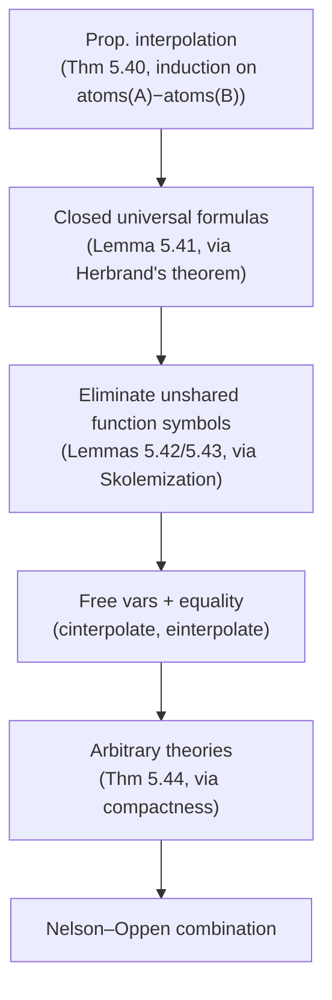
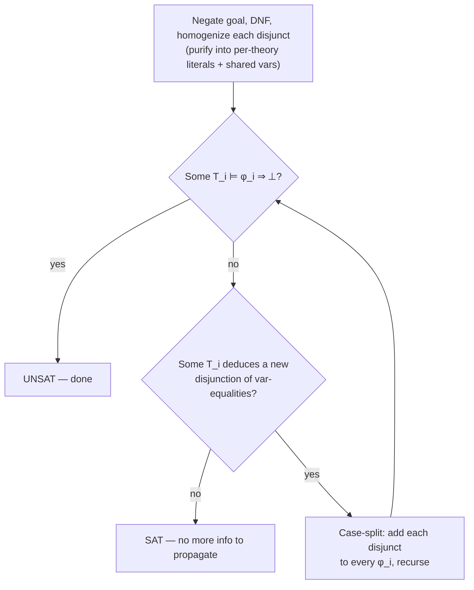
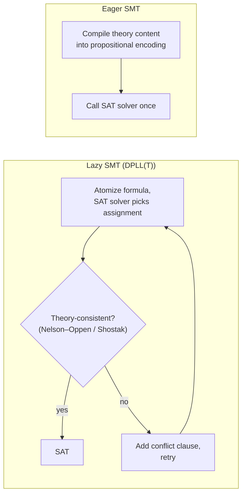

[[book-guidelines|↩ Back to guidelines]]

## The alien-term problem

Every decision procedure in Chapter 5 up to this point buys decidability by *fixing a signature*. Presburger arithmetic decides formulas built from `+`, `<`, `=`, and numerals — nothing else. Real quantifier elimination decides formulas over `+`, `*`, `<`, `=` on $\mathbb{R}$ — nothing else. That's the whole trick: restrict the language enough and a complete algorithm exists.

But real verification problems don't respect that restriction. Harrison's opening example is exactly the shape you'll hit constantly in a program verifier: you want to prove, over the naturals,

$$n < 1 \Rightarrow n = 0$$

but the actual proof obligation coming out of the program is

$$\mathtt{el}(a,i) < 1 \Rightarrow \mathtt{el}(a,i) = 0$$

where $\mathtt{el}(a,i)$ is array indexing — a function symbol that Presburger arithmetic's decision procedure has never heard of and cannot process. This is the **alien term** problem: the term is well-formed and semantically sits inside the domain your procedure decides over (array elements here are naturals), but syntactically it's foreign to the procedure's fixed vocabulary.

**What breaks without a fix here:** every decision procedure you build stays an island. A refinement-type checker whose verification conditions mix linear arithmetic, array reads, uninterpreted record projections, and string operations would need one bespoke decision procedure per *combination* of theories it might see — combinatorially infeasible. The entire premise of a practical SMT-backed verifier is that theory solvers combine.

### The naive fix, and why it's not enough

The obvious idea: generalize. Replace the alien subterm with a fresh variable, solve the resulting pure-Presburger problem, then specialize back. This works for the array example — $\forall n.\, n<1\Rightarrow n=0$ is valid, so it specializes to any term including $\mathtt{el}(a,i)$.

But generalization can turn a valid formula into an invalid one. Consider (interpreting `f` as an arbitrary but *fixed* function, uninterpreted otherwise):

$$m \le n \land n \le m \Rightarrow f(m-n) = f(0)$$

This is valid — it only needs $m=n$ (from the antecedent) and then substitutivity of $f$ ($m-n=0 \Rightarrow f(m-n)=f(0)$, an instance of "equal arguments give equal results," which holds for *any* function under any normal interpretation). But naively replacing every $f(\cdots)$ occurrence with a fresh variable gives

$$m \le n \land n \le m \Rightarrow x = y$$

which is not valid — nothing forces $x=y$ once $f$'s substitutivity is thrown away along with its name. Generalization is unsound in general; you can only generalize away information that genuinely doesn't matter, and naive term-blindness deletes exactly the fact that mattered (that both occurrences are applications of the *same* function to *equal* arguments).

So the real question the rest of this section answers: under what conditions, and by what algorithm, can decision procedures for disjoint theories be soundly combined — including combining a procedure for arithmetic with a procedure that knows nothing except "equal arguments give equal results" (the theory of uninterpreted functions, i.e. congruence closure from Chapter 4)?

### Limits: combination is not free

Before the positive results, Harrison is careful to show combination has a hard ceiling. Take the decidable theory of $\mathbb{R}$ with $+,\times$ (Section 5.9) and add just **one** new monadic predicate $P$, constrained by

$$(\forall n.\, P(n+1)\Leftrightarrow P(n)) \land (\forall n.\, 0\le n < 1 \Rightarrow (P(n)\Leftrightarrow n=0))$$

Over $\mathbb{R}$ this pins $P$ down to exactly the integers, so any problem about $\mathbb{Z}$ with $+,\times$ — which is wildly undecidable (Chapter 7, via Gödel/Church) — reduces to a problem over "$\mathbb{R}$ plus one new predicate symbol." So *that* combined theory is undecidable. Similarly, Presburger arithmetic plus one new unary function symbol $f$ becomes undecidable, because a hypothesis pinning $f$ to the squaring function lets you define multiplication ($m\cdot n \Leftrightarrow (n+p)^2=n^2+p^2+2m$) and fall back into full (undecidable) integer arithmetic.

The moral: unrestricted combination — allowing arbitrary *axioms* on the new symbols, and arbitrary quantifier alternation — is hopeless. The results below survive only because they restrict to **universally quantified (or quantifier-free) formulas**, and to symbols that stay **uninterpreted** (no axioms at all, beyond what equality itself forces) unless they belong to one of the component theories being combined. That's still enormously useful in practice — most program-verification VCs are universal.

---

## Craig's interpolation theorem

The tool that makes combination possible is **Craig's interpolation theorem** (Craig 1957), which Harrison proves constructively rather than citing model-theoretically — the proof itself is the algorithm the rest of the section runs. This is one of the most load-bearing results in the whole book for anyone building an SMT-style verification stack: it is the formal machinery behind **abductive reasoning and clause generation for refinement-type inference** — an interpolant is literally a candidate refinement predicate that separates "what the antecedent forces" from "what the consequent needs," expressed only in shared vocabulary.

**Traditional statement:** if $\models \varphi_1 \Rightarrow \varphi_2$, there is a formula $\psi$ — the *interpolant* — whose free variables and function/predicate symbols occur in *both* $\varphi_1$ and $\varphi_2$, such that $\models \varphi_1\Rightarrow\psi$ and $\models\psi\Rightarrow\varphi_2$.

Harrison uses the logically equivalent refutational form, which fits the book's refutation-based proof machinery better:

**Refutational form.** If $\models \varphi_1\land\varphi_2\Rightarrow\bot$, there is an interpolant $\psi$ — using only variables and function/predicate symbols common to both $\varphi_1$ and $\varphi_2$ — such that $\models\varphi_1\Rightarrow\psi$ and $\models\varphi_2\Rightarrow\neg\psi$.

(The two forms convert into each other by taking $\varphi_2 := \neg\varphi_2$ / negating the result. This variant is often called the **Craig–Robinson theorem**, since it is equivalent to **Robinson's consistency theorem** (A. Robinson 1956): if $T_1$ and $T_2$ agree on their common language and each is individually consistent, $T_1\cup T_2$ is consistent — Robinson's theorem and Craig's interpolation theorem are interderivable.)

### Step 1: propositional interpolation (the base case)

Everything is built by lifting a genuinely simple propositional fact:

> **Theorem 5.40.** If $\models A\land B\Rightarrow\bot$ for propositional $A,B$, there is an interpolant $C$ with $\mathrm{atoms}(C)\subseteq\mathrm{atoms}(A)\cap\mathrm{atoms}(B)$, such that $\models A\Rightarrow C$ and $\models B\Rightarrow\neg C$.

*Proof, by induction on $|\mathrm{atoms}(A)-\mathrm{atoms}(B)|$.* Base case: if $A$ has no atoms outside $B$'s, take $C:=A$ — trivially $\models A\Rightarrow A$, and $\models A\land B\Rightarrow\bot$ directly gives $\models B\Rightarrow\neg A$. Inductive step: pick an atom $p$ in $A$ but not $B$; case-split it out via Shannon expansion,

$$A' := (A[p\mapsto\bot]) \lor (A[p\mapsto\top])$$

$A'$ has one fewer atom outside $B$, so by IH it has an interpolant $C$. Since $\models A\Rightarrow A'$ (any $A$-model satisfies whichever disjunct matches $p$'s value), $\models A\Rightarrow C$ too, and $\mathrm{atoms}(C)$ only shrinks, so the atom-inclusion property is preserved.

This proof *is* an algorithm — literally executable as written:

```ocaml
let pinterpolate p q =
  let orify a r = Or(psubst(a|=>False) r, psubst(a|=>True) r) in
  psimplify (itlist orify (subtract (atoms p) (atoms q)) p)
```

This is the seed of everything downstream: propositional interpolation is decidable, constructive, and cheap. Every later generalization is a way of *reducing* first-order interpolation to this base case.

### Step 2: closed universal formulas, via Herbrand's theorem

> **Lemma 5.41.** For closed universal $\forall\vec x.P[\vec x]$ and $\forall\vec y.Q[\vec y]$ with $\models(\forall\vec x.P[\vec x])\land(\forall\vec y.Q[\vec y])\Rightarrow\bot$, there is a quantifier-free ground $C$, using only predicate symbols common to both, with $\models(\forall\vec x.P)\Rightarrow C$ and $\models(\forall\vec y.Q)\Rightarrow\neg C$.

*Proof.* By **Herbrand's theorem** (Section 3.7–3.8), the unsatisfiable universal conjunction has a finite unsatisfiable set of *ground instances*:

$$\models \bigl(P[\vec t_1]\land\cdots\land P[\vec t_k]\bigr)\land\bigl(Q[\vec s_1]\land\cdots\land Q[\vec s_l]\bigr)\Rightarrow\bot$$

Treating each ground atom as a propositional atom, apply Theorem 5.40 to get a propositional interpolant $C$ over these ground instances, then lift back with ordinary first-order reasoning to get $\models(\forall\vec x.P)\Rightarrow C$ and $\models(\forall\vec y.Q)\Rightarrow\neg C$. Any relation symbol surviving into $C$ must have occurred in *both* propositional expansions, hence in both original formulas. $\blacksquare$

This is directly executable using the Davis–Putnam ground-instance enumeration from Section 3.8:

```ocaml
let urinterpolate p q =
  let fm = specialize(prenex(And(p,q))) in
  let fvs = fv fm and consts,funcs = herbfuns fm in
  let cntms = map (fun (c,_) -> Fn(c,[])) consts in
  let tups = dp_refine_loop (simpcnf fm) cntms funcs fvs 0 [] [] [] in
  let fmis = map (fun tup -> subst (fpf fvs tup) fm) tups in
  let ps,qs = unzip (map (fun (And(p,q)) -> p,q) fmis) in
  pinterpolate (list_conj(setify ps)) (list_conj(setify qs))
```

Run on `p = (∀x. R(x,f(x))) ∧ (∀x y. S(x,y) ⇔ R(x,y) ∨ R(y,x))` and `q = (∀x y z. S(x,y) ∧ S(y,z) ⇒ T(x,z)) ∧ ¬T(0,0)`, this produces an interpolant containing only the shared predicate $S$ — but it still contains the *unshared function symbols* $0$ and $f$, so it's not a genuine interpolant yet (an interpolant may only use symbols common to *both* input formulas — $0$ and $f$ appear in only one side each). Eliminating unshared function symbols from the terms of an otherwise-valid partial interpolant is the next problem to solve.

### Step 3: eliminating unshared function symbols

The mechanism is elegant: replace an unshared-function term with a quantified variable, existentially or universally depending on which side of the interpolant it came from. Two lemmas do the work.

> **Lemma 5.42.** If $t=h(t_1,\ldots,t_m)$ is a ground term whose head $h$ never occurs applied to non-ground arguments anywhere in $C[\vec x,z]$, and $\models(\forall\vec x. C[\vec x,t])\Rightarrow\bot$, then $\models(\exists z.\forall\vec x.\,C[\vec x,z])\Rightarrow\bot$.

The proof again goes through Herbrand's theorem: get ground instances refuting $C[\vec x,t]$, uniformly replace the (necessarily uniform, since $h$'s arguments are always the same ground term here) occurrences of $t$ by a fresh variable $z$, and the instances are still propositionally refuting — hence the universally-then-existentially-quantified version is still unsatisfiable.

> **Lemma 5.43** lifts this from quantifier-free $C$ to arbitrary $P[z]$, by induction on the number of existential quantifiers, using Skolemization at each step to peel off one $\exists$ and reduce to Lemma 5.42, then using the equisatisfiability of Skolemization (Section 3.6) to translate the result back.

Applying this repeatedly: take the maximal unshared-function term $t=h(\vec t)$ in the partial interpolant $C$ (maximal, so no other unshared term is nested inside it — this ordering matters for *iterating* the elimination correctly), abstract it to $C = D[t]$, and:

- if $h$ occurs only in $P$ (the left side), replace $t$ by $\exists z$: the new interpolant candidate is $\exists z. D[z]$;
- if $h$ occurs only in $Q$ (the right side), replace $t$ by $\forall z$: the new candidate is $\forall z.D[z]$.

Each replacement strictly shrinks the set of unshared-function terms, so the process terminates at a genuine interpolant. This is implemented by finding all "top terms" headed by an unshared function and processing them in decreasing size order:

```ocaml
let uinterpolate p q =
  let fp = functions p and fq = functions q in
  let rec simpinter tms n c =
    match tms with
      [] -> c
    | (Fn(f,args) as tm)::otms ->
        let v = "v_"^(string_of_int n) in
        let c' = replace (tm |=> Var v) c in
        let c'' = if mem (f,length args) fp
                  then Exists(v,c') else Forall(v,c') in
        simpinter otms (n+1) c'' in
  let c = urinterpolate p q in
  let tts = topterms (union (subtract fp fq) (subtract fq fp)) c in
  simpinter (sort (decreasing termsize) tts) 1 c
```

On the running example this now correctly produces `forall v_2. exists v_1. S(v_2,v_1) ∧ S(v_1,v_2) ∨ S(v_2,v_1) ∧ S(v_1,v_2)` — using only the shared symbol $S$.

### Step 4: arbitrary formulas, free variables, and equality

Two further lifts complete the theorem:

1. **Non-closed formulas / shared free variables.** Existentially generalize over the free variables ($\exists\vec u.\, p\land q$), Skolemize (getting fresh Skolem functions per formula, never shared, so they vanish from the interpolant by construction), interpolate the closed result, then "manually" pull shared free variables back out by round-tripping them through fresh constants before and after (`interpolate`, built on `cinterpolate`).
2. **Equality.** Since $\models p\land q\Rightarrow\bot$ in logic-with-equality iff $\models(p\land\mathrm{eqaxiom}(p))\land(q\land\mathrm{eqaxiom}(q))\Rightarrow\bot$ in plain first-order logic (Section 4.1's `equalitize` reduction), and the equality-axiom augmentations only add the equality symbol to the language, the ordinary algorithm applies and the interpolant may use `=` even if only one side did.

Finally, by compactness, the theorem generalizes from single formulas to arbitrary (possibly infinite) theories:

> **Theorem 5.44.** If $T_1\cup T_2\models\bot$, there is $C$ in the common language plus equality, with free variables only from $T_1\cap T_2$'s shared variables, such that $T_1\models C$ and $T_2\models\neg C$.

*Proof.* Compactness gives finite $T_1'\subseteq T_1$, $T_2'\subseteq T_2$ with $T_1'\cup T_2'\models\bot$; form the universal closures $p,q$ of their conjunctions and apply the formula-level result. $\blacksquare$



**What breaks without constructivity here:** a model-theoretic existence proof of Craig's theorem tells you an interpolant exists but not how to find one. Because Harrison's proof bottoms out in an *algorithm* (propositional interpolation via Shannon expansion, lifted through explicit Skolemization/Herbrandization), it hands you exactly the artifact a verifier needs: a concrete formula in shared vocabulary that a downstream refinement-type checker (or a CEGAR loop refining an abstract domain) can actually emit and re-check. This is precisely the mechanism underlying interpolation-based *predicate abstraction refinement* and *clause learning for CHCs* (Constrained Horn Clauses) in modern verifiers — an unsatisfiability proof of a bad program path, Craig-interpolated at each cutpoint, produces exactly the new predicates/refinement types needed to rule that path out.

---

## The Nelson–Oppen combination method

Nelson and Oppen (1979) turn interpolation into an actual decision procedure for combining decision procedures $T_1,\ldots,T_n$ over **pairwise disjoint** signatures (no two theories share a function or predicate symbol, except equality), restricted to **universal formulas**.

### Setup: languages as discriminators

Because a theory's signature can be infinite (e.g. "all numerals"), Harrison represents a language not as a symbol list but as a triple of *discriminator functions*: is this symbol a function of the theory, is this symbol a predicate of the theory, and a decision procedure for the theory's universal formulas:

```ocaml
let real_lang =
  let fn = ["-",1; "+",2; "-",2; "*",2; "^",2]
  and pr = ["<=",2; "<",2; ">=",2; ">",2] in
  (fun (s,n) -> n = 0 & is_numeral(Fn(s,[])) or mem (s,n) fn),
  (fun sn -> mem sn pr),
  (fun fm -> real_qelim(generalize fm) = True)
```

`add_default` appends a catch-all "everything else, decided by congruence closure" language — this is exactly the theory of uninterpreted functions with equality, from Chapter 4:

```ocaml
let add_default langs =
  langs @ [(fun sn -> not (exists (fun (f,p,d) -> f sn) langs)),
           (fun sn -> sn = ("=",2)), ccvalid]
```

The running example throughout is $u+1=v \land f(u)+1=u-1 \land f(v-1)-1=v+1 \Rightarrow \bot$ — arithmetic mixed with an uninterpreted function $f$.

### Homogenization (purification)

The first mechanical step reduces the (negated, DNF'd) goal to a conjunction of literals, each belonging to exactly one theory (except that any literal may use `=`), by introducing fresh variables for "alien" subterms:

$$u+1=v \land v_1+1=u-1 \land v_2-1=v+1 \land v_2=f(v_3) \land v_1=f(u) \land v_3=v-1$$

This is satisfiability-preserving because the new variables really behave as fresh constants. Implementation-wise this is a recursive descent (`homot`/`homol`/`homo`) choosing, for each literal, a language via its topmost symbol (`chooselang`), then recursively replacing any subterm not in that language by a fresh variable $v_n$ plus a new defining equation $v_n = t$ — iterated until no non-homogeneous subterms remain. The resulting literals are then partitioned by language (`langpartition`) into per-theory conjunctions $\varphi_1,\ldots,\varphi_n$.

### The core problem and why individual theories can't see it

The decision problem is now: is $T_1,\ldots,T_n \models \varphi_1\land\cdots\land\varphi_n\Rightarrow\bot$? Crucially, no single $T_i\models\varphi_i\Rightarrow\bot$ individually — exactly as in the alien-term motivating example, the contradiction is only visible once information crosses theory boundaries. In the running example, the needed cross-theory fact is the equation $u=v_3\land\neg(v_1=v_2)$: Presburger arithmetic can verify $\varphi_{\mathrm{arith}}\Rightarrow(u=v_3\land\neg(v_1=v_2))$, and congruence closure can verify $\varphi_{\mathrm{uf}}\land(u=v_3\land\neg(v_1=v_2))\Rightarrow\bot$ — but *only equalities between shared variables* need to cross the boundary. This is Craig interpolation in action: the interpolant *is* the communication channel.

### Stable infiniteness: making equality interpolants quantifier-free

Craig's theorem guarantees an interpolant exists but says nothing about its quantifier structure — and quantified interpolants over infinitely many inequivalent possibilities are unusable as a decision procedure (you'd need to *test candidates*, and there are infinitely many). The fix: restrict attention to interpolants that are pure Boolean combinations of variable equalities, then show these are enough.

Equality (as a theory on its own) admits a quantifier-elimination-like procedure: the only obstruction to eliminating $\exists x$ from a conjunction of (in)equations is a formula of shape $\exists x.\, x=y_1\land\cdots\land x=y_k$ — trivially $\top$ in any interpretation with more than $k$ elements (in particular, any infinite one), but with **no quantifier-free equivalent in general** (a finite model could force $x$ to coincide with none of the $y_i$'s only if the domain is too small).

> **Definition 5.45.** A theory $T$ is **stably infinite** iff a quantifier-free formula holds in all models of $T$ exactly when it holds in all *infinite* models of $T$.

Write $\Gamma\models_\infty\varphi$ for "$\varphi$ holds in all infinite models of $\Gamma$." If $C'$ is the quantifier-free equivalent, over infinite models, of an equality formula $C$ (i.e. $\models_\infty C\Leftrightarrow C'$), and $T\models\varphi[C_1,\ldots,C_n]$ for quantifier-free $\varphi$ built around equality subformulas $C_i$, then $T\models_\infty\varphi[C_1,\ldots,C_n]$ follows a fortiori, hence $T\models_\infty\varphi[C_1',\ldots,C_n']$, and by stable infiniteness $T\models\varphi[C_1',\ldots,C_n']$ — the equality subformulas can be swapped for their quantifier-free surrogates without losing validity. Arithmetic theories are trivially stably infinite (all their models are infinite). Uninterpreted functions with equality is stably infinite too: any finite countermodel of a ground formula can have its domain arbitrarily enlarged without affecting the (ground, hence quantifier-blind) truth value.

**What breaks without stable infiniteness:** without it, the interpolant genuinely needs quantifiers, and Nelson–Oppen's whole strategy — communicate only variable (dis)equalities between component procedures — collapses; you'd be back to needing full first-order interpolant search, which isn't a usable decision procedure.

### Naive combination: enumerate all equality arrangements

With stable infiniteness in hand, here's a first (inefficient) complete algorithm. Given free (Skolem) variables $x_1,\ldots,x_k$ shared across the homogenized $\varphi_1,\ldots,\varphi_n$, an **arrangement** $\mathrm{ar}(P)$ for a partition $P$ of $\{x_1,\ldots,x_k\}$ into equivalence classes is the conjunction asserting exactly which pairs are equal and which are not:

```ocaml
let arrangement part =
  itlist (union ** arreq) part
         (map (fun (v,w) -> Not(mk_eq (Var v) (Var w)))
              (distinctpairs (map hd part)))
```

Since the disjunction over all arrangements is valid (any interpretation realizes exactly one), the original problem is equivalent to: for **every** arrangement $P$, $T_1,\ldots,T_n\models\varphi_1\land\cdots\land\varphi_n\land\mathrm{ar}(P)\Rightarrow\bot$. And — this is the theorem that licenses per-theory checking — if that holds, then (by stable infiniteness and Craig–Robinson applied to $T_1$ versus $T_2\cup\cdots\cup T_n$, iterated) some single $T_i\models\varphi_i\land\mathrm{ar}(P)\Rightarrow\bot$. So: enumerate every partition of the shared variables, and for each, ask each component decision procedure in turn whether it alone refutes $\varphi_i\land\mathrm{ar}(P)$.

This is correct (`nelop`/`nelop1`/`nelop_refute` in the text) but the number of partitions of $k$ elements — the **Bell number** $B(k)$ — grows explosively: $B(10)=115975$. This is unusable at scale.

### The real Nelson–Oppen procedure: deduce, don't enumerate

The efficient reformulation replaces "guess a full arrangement, test it" with "deduce the minimal information actually needed, incrementally":

- Try each component theory: does $T_i\models\varphi_i\Rightarrow\bot$ alone? If so, done.
- Otherwise, try to **deduce** a disjunction of new equations $T_i\models\varphi_i\Rightarrow x_1=y_1\lor\cdots\lor x_m=y_m$ (none already known) from some component theory.
- If none is deducible, the whole system is satisfiable (by the arrangement argument: extending to full arrangements with all-inequality on the rest preserves consistency, again by stable infiniteness deciding all quantifier-free equality formulas).
- Otherwise, case-split on the disjunction: for each disjunct $x_j=y_j$, add it to *every* $\varphi_i$ and recurse.

This terminates because there are only finitely many equations between finitely many shared variables, so the case-splitting tree is finite. It's implemented via `findsubset`/`trydps`/`nelop_refute`, searching subsets of candidate equations in increasing size order (so single deducible equations — the common case — are found immediately, without ever considering non-trivial disjunctions).



### Convexity: when case-splitting never happens

Running the efficient procedure on real examples, Harrison observes something striking: it never actually needed a non-trivial case split — every deduction was a single equation, not a genuine disjunction. This isn't luck.

> A theory $T$ is **convex** if whenever $T\models L_1\land\cdots\land L_n\Rightarrow A_1\lor\cdots\lor A_m$ (for literals $L_i$, atoms $A_j$), there is already some single $k$ with $T\models L_1\land\cdots\land L_n\Rightarrow A_k$. (Restricting attention, as here, to $A_j$'s that are equations between variables.)

If every component theory is convex, the deduced disjunctions from Nelson–Oppen's second bullet are *always* singletons, so the case-split step never triggers non-trivially — a dramatic practical speedup, going from potentially exponential branching to a single deduce-and-propagate pass.

But convexity is fragile. **Uninterpreted functions with equality is convex** (more generally, any theory axiomatizable purely by Horn clauses is convex — Theorem 3.39 connects Horn-clause axiomatizability to this least-model-style property). **Linear arithmetic over $\mathbb{R}$ is convex.** But:

- **The reals with multiplication are not convex:** $x\cdot y=0 \land z=0 \Rightarrow x=z\lor y=z$ is valid, but neither disjunct alone is.
- **Linear integer arithmetic (Presburger) is not convex either:** $0\le x<2 \land y=0 \land z=1 \Rightarrow x=y\lor x=z$ is valid, but neither $x=y$ nor $x=z$ follows alone — this is genuinely due to discreteness (there are only finitely many integers in $[0,2)$, forcing a disjunction that has no single-witness proof), which is exactly why the linear theory of *reals* stays convex while its integer restriction doesn't.

**What breaks without convexity:** you're back to case-splitting over disjunctions of equations (potentially large ones), which is where Nelson–Oppen's efficiency guarantee erodes — for a refinement-type checker mixing arithmetic and array/uninterpreted theories, expect Presburger-flavored obligations (integer bounds, indices) to occasionally force real case-split search, even though congruence-closure-flavored obligations mostly won't.

---

## Shostak's method

Nelson–Oppen's genius is that it's a **black-box combinator** — it needs nothing about a component procedure's internals, only its discriminator triple. **Shostak's method** (Shostak 1984b) trades that generality for speed: it requires each component theory to supply two specific artifacts.

- A **canonizer** $\mathrm{can}$ maps each term to a $T$-equivalent canonical (normal) form, with the technical closure property that canonical subterms stay canonical: if $\mathrm{can}(t)=f(s_1,\ldots,s_n)$ then $\mathrm{can}(s_i)=s_i$ for each $i$.
- A **solver** $\sigma$ maps an equation $s=t$ to a set of equations $\{x_i=t_i\}$, $T$-equivalent to the original, in *solved form* (each $x_i$ occurs nowhere on any right-hand side — non-circularity). E.g. over linear arithmetic on $\mathbb{R}$, $x+3y+z=2x$ solves to $\{x=3y+z\}$.

Shostak's algorithm then generalizes congruence closure, using the component canonizers/solvers as its normalization and equation-orientation primitives, rather than treating theories as opaque oracles. Empirically this tighter integration is faster, but the theoretical price is real: **Shostak's method is complete iff the theory is both convex and solvable** — a strictly narrower class than "any theory with a universal-formula decision procedure," which is all Nelson–Oppen needs (and the canonizer, per Ganzinger 2002, isn't even theoretically necessary — the solver alone suffices for completeness in principle).

Harrison flags a genuinely interesting historical wrinkle here, worth internalizing as a caution about "obviously correct" combination algorithms: **Shostak's original algorithm was subtly wrong for over 15 years.** Levitt (1999) first noticed that combining *multiple* solvers, as Shostak's paper claimed was possible, doesn't actually work in general. Ruess and Shankar (2001) then showed the original algorithm and every published refinement were actually incomplete and potentially non-terminating — concretely, they fail on Harrison's own running example and loop forever on `f(v)=v ∧ f(u)=u-1 ∧ u=v ⇒ ⊥`. A corrected version exists (subsequently machine-checked, Ford and Shankar 2002) and underlies the real SMT solver **Yices**. The general lesson Harrison draws: **combining multiple Shostak theories with nontrivial axioms essentially never works by naive solver composition** (Krstić and Conchon 2003) — the modern, *actually* complete Shostak-style methods are best understood as optimized special cases of Nelson–Oppen using canonizers, not as an independent combination principle.

---

## Modern SMT architecture: lazy, eager, and delayed theory combination

By the time Harrison was writing (2009), this whole area had crystallized into **satisfiability modulo theories (SMT)** — explicitly framed as a generalization of propositional SAT, and most SMT solvers structure themselves around a SAT-solving core.

**Lazy SMT.** Treat every atomic formula as an opaque propositional atom, hand the skeleton to a SAT solver. If the SAT solver reports UNSAT propositionally, the original first-order formula is UNSAT too — done. If it returns a satisfying assignment, check whether the conjunction of the corresponding literals is *theory*-satisfiable (calling Nelson–Oppen/Shostak here). If yes, the whole formula is SAT. If no, conjoin the negation of that assignment as a conflict clause — exactly like SAT clause learning (Section 2.9) — and retry. Termination follows because each iteration excludes at least one propositional assignment over a fixed finite atom set.

- **Offline lazy** (Armando, Castellini, Giunchiglia 1999): the SAT solver restarts from scratch each round.
- **Online lazy** (the dominant modern approach, Flanagan, Joshi, Ou, Saxe 2003): the theory solver is integrated *into* the SAT search itself, so conflict clauses and other learned state persist across theory calls instead of being thrown away — this is the DPLL(T) architecture underlying most production SMT solvers.

**Eager SMT** (Bryant, Lahiri, Seshia 2002): compile the theory reasoning directly down into [[Propositional-Logic|propositional logic]] as a *preprocessing* step, then invoke the SAT solver exactly once. No back-and-forth, no lazy refinement loop — all theory content is baked into the propositional encoding up front.

**Delayed theory combination** (Bozzano, Bruttomesso, Cimatti, Junttila, Ranise, van Rossum, Sebastiani 2005): rather than layering Nelson–Oppen as a separate module *on top of* a lazy SMT loop, reimplement the theory-combination logic itself inside the same SAT-based search — letting the propositional engine participate directly in deciding which cross-theory equalities to case-split on, instead of treating theory combination as a sealed black box invoked only after the SAT solver commits to an assignment.

Hybrid strategies also exist: e.g. eliminate congruence-closure overhead upfront via the **Ackermann reduction** (Section 4.4 — replacing each function application with a fresh variable plus explicit congruence hypotheses, turning uninterpreted-function reasoning into pure [[Equality-Reasoning|equality reasoning]] before the main loop), then proceed lazily for the remaining theories.



---

## Where this leads

Within Chapter 5, this section is the capstone: every earlier decidable-theory result (Presburger, real/complex QE, Gröbner bases, DLO) becomes a *pluggable component* rather than an isolated island the instant it's packaged as a discriminator triple obeying stable infiniteness. Structurally, the section rests on results from three earlier chapters at once — Herbrand's theorem and Skolemization (Chapter 3) drive the interpolation proof; congruence closure (Chapter 4) is the theory of uninterpreted functions that Nelson–Oppen combines against almost every other theory; and compactness (used throughout) lifts finite results to arbitrary theories.

For the reader's own project — a Rust-based verifier with an embedded theorem prover reasoning about refinement types — this section is close to a direct blueprint:

- **The Nelson–Oppen architecture is exactly the shape a refinement-type checker's constraint solver needs**, once verification conditions mix linear arithmetic (array bounds, integer refinements), uninterpreted structure (record/ADT projections), and possibly bitvector or string theories: each becomes a discriminator-triple component, purified via homogenization, communicating only shared-variable (dis)equalities.
- **Craig interpolation is the formal core of abductive reasoning for refinement inference and CHC-based clause generation** named explicitly in the reader's learning goals: given an unsatisfiability proof that a candidate refinement type is too weak (or a program path violates a Hoare triple), interpolating the proof at the right cutpoint produces a concrete new predicate — expressible in exactly the vocabulary available at that program point — to strengthen the type or refine the abstract domain. This is CEGAR's engine.
- **Stable infiniteness and convexity are the invariants a solver author must check before trusting cheap propagation** — for the reader's CSP kernel over integer and non-linear domains, expect non-convexity (as with Presburger) to force real case-split search on the arithmetic side even while congruence-closure-flavored obligations over data structures stay convex and cheap.
- **The lazy/DPLL(T) vs. eager vs. delayed-theory-combination taxonomy is the concrete architectural decision** for embedding a theory solver in a SAT/CSP-based verification backend — DPLL(T)'s online integration (persisting learned clauses across theory calls) is the practical default worth modeling the reader's own CSP-kernel/theory-solver integration on.
- Shostak's cautionary history — a widely-deployed algorithm silently wrong for fifteen years — is a concrete argument for building the reader's trusted kernel around the *simpler, more clearly correct* Nelson–Oppen-style combinator first, treating Shostak-style canonizer/solver optimizations (if pursued at all) as a verified-later refinement rather than a foundation.
