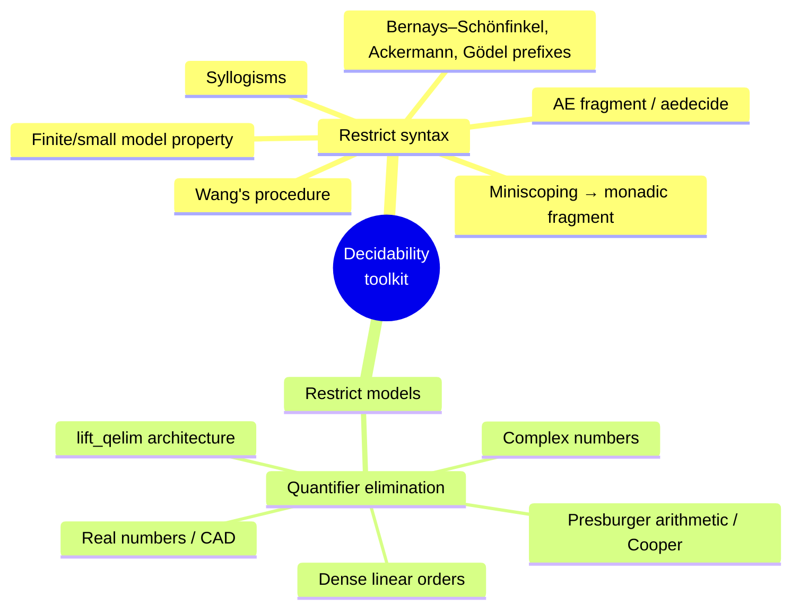
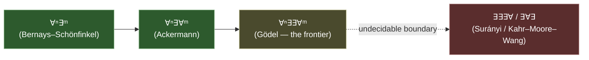
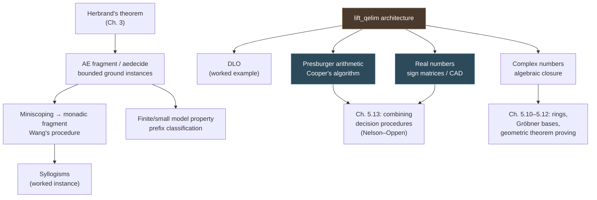

# Decidable Theories and Quantifier Elimination

[[book-guidelines|↩ Back to guidelines]]

## Why this chapter exists: validity has no algorithm, but *theories* can

Every prover built in Chapters 2–4 — tableaux, resolution, MESON — shares a structural limitation Harrison is careful to name at the very start of Chapter 5: they can *confirm* validity when a formula is valid, but they cannot in general *refute* it. Feed `tab` or `meson` an invalid formula and they search forever; there is no third outcome. Chapter 7 will prove this isn't a implementation gap but a theorem (Church–Turing): no algorithm decides first-order validity in general. So the only way forward is to stop asking for a universal decision procedure and start asking a narrower question: for *which* restricted classes of formulas, or *which* restricted classes of models, does a terminating algorithm exist?

This is precisely the shape of problem your CSP kernel and constraint solver will face. "Is this refinement-type constraint satisfiable?" is, in the fully general case, exactly as undecidable as first-order validity. What makes SMT solving *work in practice* is that real verification conditions live almost entirely inside decidable fragments — linear arithmetic, uninterpreted functions with equality, arrays with extensionality — each with its own decision procedure, glued together (Nelson–Oppen, in the next article in this series) rather than solved by one universal algorithm. This chapter is the first place Harrison builds that toolkit, and two of its constructions — Cooper's algorithm for Presburger arithmetic and quantifier elimination as a general architectural pattern — are close to literal blueprints for pieces of the theory-solver you'll eventually write in Rust.

---

## 1. The decision problem: three variants, and why two routes to decidability exist

Harrison opens by pinning down exactly what "decidable" should mean, because there are three related but distinct questions (§5.1, p. 308):

1. **Confirm validity** — given a valid formula, say so; never wrongly confirm an invalid one.
2. **Confirm invalidity** — given an invalid (satisfiable) formula, say so; never wrongly confirm a valid one.
3. **Decide** — determine which of the two holds, always terminating.

(3) subsumes both (1) and (2): run both semi-deciders in parallel and one of them terminates. Tableaux and resolution already solve (1) — that's what "refutation-complete" *means*. The problem is (2): feed `tab <<forall x. p(x)>>` a satisfiable formula and it just searches forever, and no cleverness rescues this in general, because Church and Turing proved (Chapter 7) that no general algorithm for (2) or (3) exists.

Given that, Harrison identifies exactly two general strategies for recovering decidability on a restricted problem:

- **Restrict the syntax** — bound the shape of the formula (e.g. the arrangement of quantifiers in prenex form).
- **Restrict the models** — instead of validity in *all* interpretations, ask about validity in the models of some fixed axiom set $\Sigma$ (i.e. decide $\Sigma \models p$ rather than $\models p$).

The rest of the chapter is organized around these two strategies, roughly in that order: §5.2–5.5 restrict syntax (the AE fragment, the monadic fragment, syllogisms, prefix classes), while §5.6–5.9 restrict models via specific axiomatized theories (dense linear orders, Presburger arithmetic, the complex numbers, the real numbers) attacked by quantifier elimination. A recurring theme (flagged explicitly as a Key Question in the guidelines) is that these two strategies *coincide* for some fragments — the AE fragment is decided both by a prefix restriction and, as it happens, by bounding ground instances — but sharply diverge for others: Presburger arithmetic needs no syntactic prefix restriction at all, but *does* need an enriched language (infinitely many divisibility predicates) before quantifier elimination becomes possible.



---

## 2. The AE fragment: bounding Herbrand's theorem to get termination

### What breaks without a bound on ground instances

Every prover in Chapter 3 rests on **Herbrand's theorem**: a Skolemized, quantifier-free formula is unsatisfiable iff *some finite conjunction* of its ground instances is propositionally unsatisfiable. The trouble is that "some finite conjunction" ranges over an infinite search space whenever the Skolemized formula contains a *non-nullary* function symbol — a Skolem function introduced for an existential quantifier trapped inside a universal one. Unification narrows *how* you search that infinite space, but it can't make it finite. This is exactly why `tab`/`meson` loop forever on invalid formulas: there's no bound to exhaust.

### `aedecide`: when the Skolemized form has only constants

Harrison's key observation (§5.2, p. 309): if the Skolemized negation of a formula contains **no functions except nullary ones** (constants), then the number of ground instances is *bounded* — each of the finitely many free variables can only be replaced by one of finitely many constants. The Loś formula illustrates this concretely: Skolemizing its negation produces exactly 4 constants and 3 variables, giving $4^3 = 64$ ground instances, and testing propositional unsatisfiability of their conjunction (via `dpll`) decides validity outright — no infinite search, because the whole ground-instance space was enumerated once and for all:

```ocaml
let aedecide fm =
  let sfm = skolemize(Not fm) in
  let fvs = fv sfm
  and cnsts,funcs = partition (fun (_,ar) -> ar = 0) (functions sfm) in
  if funcs <> [] then failwith "Not decidable" else
  let consts = if cnsts = [] then ["c",0] else cnsts in
  let cntms = map (fun (c,_) -> Fn(c,[])) consts in
  let alltuples = groundtuples cntms [] 0 (length fvs) in
  let cjs = simpcnf sfm in
  let grounds = map
   (fun tup -> image (image (subst (fpf fvs tup))) cjs) alltuples in
  not(dpll(unions grounds));;
```

The syntactic characterization is cleanest in prenex form: a formula is in the **AE fragment** ("all before exists", $\forall x_1 \ldots x_n. \exists y_1 \ldots y_m. P$) precisely when, after Skolemization, no existential quantifier is trapped under a universal — i.e. all universals come *after* all existentials in the original formula's negation (the **EA subset** for satisfiability, dually AE for validity). This is a strict subset of first-order logic, but it already captures the group-theory example from earlier chapters (a group where $x^2 = 1$ is abelian) *when the inverse axiom isn't needed* — `aedecide` both proves the theorem and, symmetrically, refutes a weakened version missing the identity axiom, something a mere refutation-complete prover cannot do.

A subtlety worth internalizing (§5.2, p. 311–312): the order of Skolemization and prenexing matters. Pulling quantifiers to prenex form before Skolemizing can accidentally *introduce* the bad nesting the AE test is designed to detect — Harrison's implementation Skolemizes directly rather than going through PNF first, precisely to sidestep this trap.

**Rust [[Equality-Reasoning#Grounding|grounding]].** The AE decision procedure is essentially: Skolemize, check a syntactic invariant (no function symbols of arity > 0 among the Skolem functions), then bound-and-enumerate:

```rust
fn ae_decide(fm: &Formula) -> Result<bool, &'static str> {
    let skolemized = skolemize(&negate(fm));
    let (consts, funcs): (Vec<_>, Vec<_>) = functions(&skolemized)
        .into_iter()
        .partition(|f| f.arity == 0);
    if !funcs.is_empty() {
        return Err("not decidable: non-nullary Skolem function present");
    }
    let free_vars = free_vars(&skolemized);
    let ground_conjuncts: Vec<Cnf> = all_tuples(&consts, free_vars.len())
        .into_iter()
        .map(|assignment| instantiate(&skolemized, &free_vars, &assignment))
        .collect();
    Ok(!dpll_unsat(&union(ground_conjuncts)))
}
```

This is the same shape as **bounded model checking with a static bound**: fix a finite instantiation domain up front (rather than iteratively deepening), compile to a propositional (or SMT) query, and hand it to a SAT solver. The difference from your eventual CSP kernel is exactly the difference between this and Presburger's Cooper procedure below: `aedecide` works because the *domain of instantiation* is syntactically forced to be finite; general linear-arithmetic constraints need an actual elimination algorithm because the domain (all integers) is infinite and no syntactic trick bounds it.

---

## 3. Miniscoping and the monadic fragment: pushing quantifiers in to *create* AE form

Not every formula that is "morally" decidable by `aedecide` arrives in AE shape. Pelletier problem 18, `exists y. forall x. P(y) ==> P(x)`, fails `aedecide` outright (`Exception: Failure "Not decidable"`) even though `davisputnam` handles it easily — the $\exists\forall$ nesting produces a genuine Skolem function.

**Miniscoping** (§5.3, p. 313) is the converse transformation to prenex normal form: instead of pulling quantifiers *out* to the front, push them *in* as far as possible, minimizing each quantifier's scope. The implementation composes three functions:

- `separate x cjs` splits a conjunction into the part mentioning `x` (left under the quantifier) and the part not mentioning it (pulled outside): $\exists x.\, p_1 \land \cdots \land p_n \to (\exists x. p_i \land \cdots \land p_j) \land (p_k \land \cdots \land p_l)$.
- `pushquant x p` converts `p` to DNF and distributes $\exists x$ over each disjunct, then calls `separate` on each.
- `miniscope` is the structural recursion tying these together, translating $\forall x. p$ to $\lnot(\exists x. \lnot p)$ to avoid a dual implementation.

Applied to the Pelletier 18 example, miniscoping alone already yields `<<(exists y. ~P(y)) \/ (forall x. P(x))>>` — recognizably a propositional tautology up to bound-variable renaming, and now trivially AE after prenexing.

The class where this is guaranteed to work is the **monadic fragment**: formulas with arbitrary quantifier nesting but *no function symbols* and *only unary (monadic) predicates*. Harrison proves by structural induction that `miniscope` applied to a monadic formula always achieves the property "every quantifier's body has no other quantifiers and no free variables besides the bound one" — because with only unary predicates, once you separate out the variable-`x`-containing literals, they can have no other free variable to smuggle in extra dependency. This licenses **`wang`** (after Hao Wang, 1960), which composes miniscoping with `aedecide`:

```ocaml
let wang fm = aedecide(miniscope(nnf(simplify fm)));;
```

`wang` decides the entire monadic fragment. The catch, flagged honestly (§5.3, p. 316): miniscoping's DNF/CNF alternation at each quantifier boundary can blow the formula up badly — "Andrews's challenge," with only modest quantifier nesting, explodes to an AE formula with 19 universal and 10 existential quantifiers, giving $10^{19}$ ground instances — decidable in principle, useless in practice. This is the chapter's first concrete lesson in the gap between "decidable" and "tractable," a distinction that will recur (in sharper form) with Presburger arithmetic's doubly-exponential worst case below.

---

## 4. Syllogisms: a self-contained worked example of a decidable fragment

Section 5.4 is a compact case study proving Aristotelian syllogistic logic is decidable — not as new theory, but as a direct application of the monadic-fragment machinery just built. It's worth walking through because it makes the "restrict the syntax, get a finite search space" idea completely concrete.

A syllogism combines three **premisses** of forms A/E/I/O over a subject $S$ and predicate $P$:

| Form | English | First-order translation |
|---|---|---|
| A | all $S$ are $P$ | $\forall x.\ S(x) \Rightarrow P(x)$ |
| E | no $S$ are $P$ | $\forall x.\ S(x) \Rightarrow \lnot P(x)$ |
| I | some $S$ are $P$ | $\exists x.\ S(x) \land P(x)$ |
| O | some $S$ are not $P$ | $\exists x.\ S(x) \land \lnot P(x)$ |

restricted to three terms across two antecedents and a consequent, arranged in one of four "figures" — giving $4 \times 4^3 = 256$ syntactically possible syllogisms. Because every premiss is built from unary predicates with a single quantified variable, **every syllogism already lies in the monadic fragment**, and in fact the quantifiers already have minimal scope — so `aedecide` alone (no miniscoping needed) decides all 256 in one pass:

```ocaml
let all_valid_syllogisms = filter aedecide all_possible_syllogisms;;
(* length all_valid_syllogisms = 15 *)
```

The interesting twist (and a nice lesson in how formalization can silently change the question being asked): only **15** come out valid, not the traditionally cited 24. The gap is *existential import* — classical syllogistic silently assumes every term denotes something nonempty, but the direct first-order reading of "all $S$ are $P$" as $\forall x.\ S(x) \Rightarrow P(x)$ is vacuously true when no $S$ exists, breaking syllogisms like Darapti ("all M are P and all M are S, therefore some S are P" — false when nothing is an M). Adding the hypothesis $(\exists x. P(x)) \land (\exists x. M(x)) \land (\exists x. S(x))$ as an extra antecedent recovers exactly the traditional 24. This is a small but sharp illustration of a theme that recurs constantly in formalizing informal reasoning for a verifier: *the choice of formal encoding is itself a design decision with truth-relevant consequences*, not a passive transcription — precisely the kind of judgment call your elaborator will face when compiling a surface-level "requires"/"ensures" annotation into an actual first-order (or SMT) constraint.

---

## 5. The finite and small model property: decidability via bounded model search

### The general mechanism

A different lens on decidability, orthogonal to syntactic-fragment membership: instead of asking "can I bound the ground-instance search," ask "can I bound the *model size* search." Harrison's **Definition 5.1**: a formula has the **finite model property** for validity if it's valid in all models iff valid in all *finite* models (dually for satisfiability). Harrop's observation (**Theorem 5.2**, 1958) turns this into a decision procedure by symmetry with the AE case: run a validity-proving search (MESON, resolution — anything refutation-complete) in parallel with an enumeration of larger and larger finite interpretations looking for a countermodel; one half of this race always terminates.

Harrison actually implements the interleaving, not just states it abstractly — `decide_finite n fm` builds every interpretation of a given domain size $n$ (enumerating all function/predicate assignments via `allmappings`/`alldepmappings`) and checks the formula in all of them; `limited_meson n fm` bounds MESON's proof search to size $n$ instead of iteratively deepening without limit; `decide_fmp` alternates the two, incrementing $n$ until one side succeeds. This is a genuinely different *kind* of decision procedure from `aedecide` — no elimination or Skolem-instance bound, just brute dovetailing between proof search and countermodel search — and it is honest about its cost: "the number of possible interpretations explodes dramatically as $n$ increases," so it is a tool for stuck, simple-looking open formulas, not a production decision procedure.

### The small model property: an explicit bound

For some classes, you don't need to interleave — you can name a concrete bound in advance. **Theorem 5.3**: a formula with $k$ distinct monadic predicates, no higher-arity predicates, no equality, and no functions has a model iff it has one of size **exactly $2^k$** (the $k$ predicates can distinguish at most $2^k$ subsets, so any larger model collapses onto one of that size). This gives `decide_monadic`, a genuinely different algorithm from `wang` for the same fragment — sometimes faster (it disposes of Andrews's Challenge instantly, where `wang`'s miniscoping blowup made that formula intractable), sometimes catastrophically slower (Pelletier 20, trivial for `wang`, requires enumerating $2^{64}$ interpretations for `decide_monadic` because it has four predicates over a domain of size 16). Two decision procedures for the *same* decidable class can have wildly different practical behavior — a lesson worth keeping in mind when your CSP kernel eventually has to choose between competing propagation strategies for the same constraint class.

### The exact boundary of decidable prefix classes

This section's sharpest content is the precise classification of which quantifier-prefix classes admit the finite model property (and are therefore decidable) and which don't:

- **Bernays–Schönfinkel (1928):** the AE fragment $\forall^n \exists^m$ has a small-model bound.
- **Ackermann (1928):** $\forall^n \exists \forall^m$ (a single existential sandwiched between universal blocks) has the finite model property.
- **Gödel (1932):** $\forall^n \exists\exists \forall^m$ (two existentials) also has it — and this is the *maximum*: Harrison exhibits two formulas with the next-simplest prefixes ($\exists\exists\exists\forall$ and $\exists\forall\exists$) that are **false over the reals under $R(x,y) = (x < y)$** yet hold in *every finite* interpretation — a genuine failure of the finite model property, proved by an explicit pigeonhole argument (a strictly-ordered infinite chain $a_0 R a_1 R a_2 \cdots$ that a finite model is forced to close into a cycle, contradicting irreflexivity). Surányi (1950) and Kahr–Moore–Wang (1962) later showed these two prefix classes are not just finite-model-property-failing but genuinely *undecidable* — so $\forall^n\exists\exists\forall^m$ really is the frontier.

Adding equality shifts this boundary slightly: AE stays decidable (by folding the equality axioms, which are themselves purely universal, into the AE matrix — a nice small proof that equality doesn't cost you anything in this fragment), but Gödel's own claim that his class survives equality turned out to be **wrong** — Goldfarb (1984) proved $\forall^n\exists\exists\forall^m$-with-equality is undecidable, one of very few outright errors in Gödel's published work. Ackermann's weaker $\forall^n\exists\forall^m$-with-equality class does survive. The two-variable fragment (arbitrary predicates, but only two distinct variable names, no function symbols) is a separate, surprisingly expressive decidable class (Scott 1962, Mortimer 1975 for the equality case).



---

## 6. Quantifier elimination as a general method: the `lift_qelim` architecture

This is where the chapter shifts from *fragment-restriction* to *theory-restriction* — and where the machinery becomes directly reusable for building a theory solver.

### First principles: what quantifier elimination buys you

**Definition 5.4/5.5 setup:** a *theory* $T$ is a set of formulas closed under logical consequence. $T$ **admits quantifier elimination** if every formula $p$ has a $T$-equivalent quantifier-free formula $q$ (with $\mathrm{FV}(q) \subseteq \mathrm{FV}(p)$). This generalizes the ordinary notion of "solving an equation" — deciding $\exists x.\ E[x] = 0$ *is* quantifier elimination for that one formula shape.

Why does this matter for decidability? **Theorem 5.5**: a theory is complete iff all its models are elementarily equivalent. If quantifier elimination reduces a closed (variable-free) formula to a *ground* quantifier-free formula, and ground formulas in the theory's language evaluate mechanically to true/false (as they do for arithmetic — `2+2=5 \Rightarrow 7<3` just computes), then the theory is automatically both **complete** and **decidable**: reduce, evaluate, done. This is the single mechanism underlying every remaining result in the chapter — DLO, Presburger arithmetic, the complex numbers, the real numbers are all decided *by exhibiting a quantifier elimination algorithm and nothing else*.

### The reduction to a single primitive

The key architectural insight (§5.6, p. 331): full quantifier elimination reduces to eliminating one quantifier from the single, narrow pattern

$$\exists x.\ \alpha_1 \land \cdots \land \alpha_n$$

where each $\alpha_i$ is a *literal* containing $x$. Apply this innermost-out (turning $\forall x. P$ into $\lnot \exists x. \lnot P$ first), always putting the body into DNF and distributing $\exists$ over the disjunction before eliminating. Everything else is bookkeeping. `lift_qelim` is the general-purpose lifting function that turns a "core eliminator" `qfn` for exactly this shape into a full quantifier-elimination procedure for arbitrary formulas:

```ocaml
let lift_qelim afn nfn qfn =
  let rec qelift vars fm =
    match fm with
    | Atom(R(_,_)) -> afn vars fm
    | Not(p) -> Not(qelift vars p)
    | And(p,q) -> And(qelift vars p,qelift vars q)
    | Or(p,q) -> Or(qelift vars p,qelift vars q)
    | Imp(p,q) -> Imp(qelift vars p,qelift vars q)
    | Iff(p,q) -> Iff(qelift vars p,qelift vars q)
    | Forall(x,p) -> Not(qelift vars (Exists(x,Not p)))
    | Exists(x,p) ->
          let djs = disjuncts(nfn(qelift (x::vars) p)) in
          list_disj(map (qelim (qfn vars) x) djs)
    | _ -> fm in
  fun fm -> simplify(qelift (fv fm) (miniscope fm));;
```

`afn` normalizes atoms (e.g. rewriting `s <= t` into the theory's chosen primitive predicates); `nfn` puts a formula into DNF (with theory-specific literal massaging folded in — see `cnnf` below); `qfn vars` is the actual theory-specific elimination step for a *single* existential over a conjunction of literals, applied per-disjunct after DNF splitting. This is a genuinely reusable **decision-procedure combinator**: everything theory-specific is isolated into three small parameters, and the recursive plumbing (descend through connectives, dualize $\forall$, split DNF, reassemble) is shared. This is precisely the shape you want for a **theory-solver framework** in a Rust SMT-adjacent kernel: a generic quantifier-handling/normalization core, parameterized by a pluggable per-theory atom-normalizer and elimination step — Nelson–Oppen-style theory combination (covered in the sibling article) builds on exactly this separation of "generic propositional/quantifier scaffolding" from "theory-specific literal reasoning."

`qelim` itself (the inner helper called per-DNF-disjunct) does one more useful thing before calling into the theory: it partitions the conjunction's literals into those mentioning $x$ (`ycjs`) and those not (`ncjs`), calls the core eliminator only on the former, and reattaches the latter untouched — exploiting $(\exists x.\ p \land q[x]) \Leftrightarrow p \land \exists x.\ q[x]$ for any $p$ not mentioning $x$. This kind of "shrink the problem to only what the quantified variable actually touches" preprocessing is exactly the discipline a CSP propagator needs before invoking a domain-specific solver on a subproblem.

### Worked example: dense linear orders (DLO)

Harrison picks the **theory of dense linear orders without endpoints** (DLO) as the first worked example precisely because it's simple enough to implement by hand yet exhibits every moving part. The axioms (§5.6, p. 333):

$$\forall x y.\ x{=}y \lor x{<}y \lor y{<}x, \quad \forall xyz.\ x{<}y \land y{<}z \Rightarrow x{<}z, \quad \forall x.\ \lnot(x{<}x),$$
$$\forall xy.\ x{<}y \Rightarrow \exists z.\ x{<}z \land z{<}y, \quad \forall x.\exists y.\ x{<}y, \quad \forall x.\exists y.\ y{<}x.$$

$\mathbb{R}$ and $\mathbb{Q}$ under the usual `<` are both models; $\mathbb{Z}$ is not (it fails density). Langford (1927) showed this theory admits quantifier elimination, and the algorithm (`dlobasic`) is small enough to internalize completely:

1. **Eliminate negated literals first** by rewriting them positively — $\lnot(s{<}t) \Leftrightarrow s{=}t \lor t{<}s$ and $\lnot(s{=}t) \Leftrightarrow s{<}t \lor t{<}s$ (the `lfn_dlo` literal-modifier passed into `cnnf`). After this, every literal is a bare `<` or `=` atom.
2. **If there's an equation $x{=}y$ or $y{=}x$** among the conjuncts, eliminate the quantifier by substitution: $(\exists x.\ x{=}y \land P[x,y]) \Leftrightarrow P[y,y]$. Done.
3. **Otherwise, only inequalities remain.** If some literal is $x{<}x$, the whole conjunction is trivially $\bot$. Otherwise split the inequalities into left-bounds $\{s_i : s_i < x\}$ and right-bounds $\{t_j : x < t_j\}$, and replace $\exists x.\ (\bigwedge_i s_i{<}x) \land (\bigwedge_j x{<}t_j)$ with $\bigwedge_{i,j} s_i < t_j$.

Step 3 is the theory-specific insight: in a dense order, "there's an $x$ strictly between the largest lower bound and the smallest upper bound" holds *iff* every lower bound is below every upper bound — because density guarantees an $x$ exists whenever that pairwise condition holds, and transitivity + totality guarantee that if it fails for the extremal pair it fails for the whole quantified statement. If one side has no bounds at all, the "no endpoints" axioms make the formula trivially true — and this degenerate case falls out for free because `list_conj [] = True`.

```ocaml
let dlobasic fm =
  match fm with
    Exists(x,p) ->
      let cjs = subtract (conjuncts p) [Atom(R("=",[Var x;Var x]))] in
      try let eqn = find is_eq cjs in
          let s,t = dest_eq eqn in
          let y = if s = Var x then t else s in
          list_conj(map (subst (x |=> y)) (subtract cjs [eqn]))
      with Failure _ ->
          if mem (Atom(R("<",[Var x;Var x]))) cjs then False else
          let lefts,rights =
            partition (fun (Atom(R("<",[s;t]))) -> t = Var x) cjs in
          let ls = map (fun (Atom(R("<",[l;_]))) -> l) lefts
          and rs = map (fun (Atom(R("<",[_;r]))) -> r) rights in
          list_conj(allpairs (fun l r -> Atom(R("<",[l;r]))) ls rs)
  | _ -> failwith "dlobasic";;
```

Wired through `lift_qelim`, `quelim_dlo` decides arbitrary formulas: `forall x y. exists z. z<x /\ z<y` reduces to `true`; `exists z. x<z /\ z<y` reduces to the free-variable formula `x < y` — genuinely eliminating the quantifier while leaving a meaningful open constraint. And because the *only* ground formulas in a language with no constants are $\top$ and $\bot$, the theory is complete and decidable, and by Theorem 5.5 all models — $\mathbb{R}$ and $\mathbb{Q}$ included — are elementarily equivalent: **no sentence in this pure-order language can distinguish $\mathbb{R}$ from $\mathbb{Q}$.** (Add multiplication and you immediately can, via $\exists x.\ x \cdot x = 2$ — which is exactly the jump from DLO to the much harder real-closed-field theory in §5.9.)

**Rust grounding.** The DLO elimination step translates almost line-for-line into a Rust pattern match over a small literal enum — worth internalizing because it's the *simplest possible* instance of the pattern your linear-arithmetic or difference-logic theory solver will need:

```rust
enum DloLit { Lt(Term, Term), Eq(Term, Term) }

fn dlo_basic(x: &Var, conjuncts: Vec<DloLit>) -> Formula {
    // Case 1: an equation involving x lets us substitute and drop the quantifier.
    if let Some(eqn) = conjuncts.iter().find(|c| matches!(c, DloLit::Eq(..))) {
        let y = other_side(eqn, x);
        return conjoin(conjuncts.iter()
            .filter(|c| *c != eqn)
            .map(|c| substitute(c, x, &y)));
    }
    // Case 2: only inequalities — check for x < x, else pairwise-bound elimination.
    if conjuncts.contains(&DloLit::Lt(x.into(), x.into())) {
        return Formula::False;
    }
    let (lefts, rights): (Vec<_>, Vec<_>) = conjuncts.iter()
        .filter_map(|c| as_bound(c, x))
        .partition(|b| b.is_lower());
    conjoin(lefts.iter().flat_map(|l| rights.iter().map(move |r| l.lt(r))))
}
```

**Lean framing.** This is the cleanest place in the chapter to see quantifier elimination as literally producing a *proof term*, not just a Boolean answer — `T \models p \Leftrightarrow q` is a genuine equivalence, and in a proof-producing architecture (which your trusted kernel will eventually need, per the standing project's proof-certificate goals) each step of `dlobasic` corresponds to an actual lemma: the substitution step is `Exists.elim` composed with a rewrite by the extracted equation, and the bound-splitting step is a direct instance of density's own defining axiom applied to the extremal bounds. Lean's `omega` tactic — decision procedure for linear integer/natural arithmetic — is the production-grade descendant of exactly this idea (applied to Presburger arithmetic rather than DLO, next section), and its internals genuinely do build a certificate rather than trusting an untrusted oracle, which is the discipline this whole architecture should be held to if you want elimination results your kernel can actually check rather than merely assert.

---

## 7. Presburger arithmetic and Cooper's algorithm

This is the chapter's most load-bearing section for an SMT-theory-solver project: Presburger arithmetic is *literally* the linear-integer-arithmetic (LIA) theory every SMT solver ships, and Cooper's algorithm is a real, still-used decision procedure for it (it's what powers Lean's `omega`, among others).

### Setting up the theory and why the naive language fails

**Presburger arithmetic** (§5.7, p. 336) is linear integer arithmetic — arithmetic over $\mathbb{Z}$ expressible *without multiplication* (of two variables; multiplication by a fixed constant is fine, since $4 \cdot x$ is just $x+x+x+x$). In the most obvious language — constants, $+$, $-$, and the usual inequalities — this theory does **not** admit quantifier elimination: $\exists x.\ x + x = y$ has no quantifier-free equivalent in that language (there's no way to say "$y$ is even" without some notion of divisibility). Presburger's fix, and the reason the theory carries his name, is to **enrich the language** with infinitely many unary divisibility predicates $D_k$ ("is divisible by $k$") for every $k \ge 2$. Once these are admitted, quantifier elimination becomes possible — and crucially, every *ground* instance of $D_k$ is trivially decidable by direct computation ($D_5(15)$ true, $D_5(7)$ false), so admitting infinitely many predicate symbols costs nothing at the point of actually evaluating a formula.

This is the sharpest illustration in the chapter of the Key Question about syntax-restriction versus model-restriction routes to decidability *diverging*: Presburger arithmetic needs no prefix restriction whatsoever (arbitrary quantifier alternation is fine), but achieving quantifier elimination costs you an enriched signature you didn't start with.

### Canonical linear terms — the representation that makes everything else tractable

Before any elimination logic, Harrison fixes a **canonical form** for terms: $c_1 \cdot x_1 + \cdots + c_n \cdot x_n + k$, with a fixed variable order, nonzero coefficients, and the constant $k$ always present (even if $0$). This single design decision is what makes `linear_add`, `linear_cmul`, and `lint` (the term-to-canonical-form converter) simple recursive merges rather than ad-hoc normalization — precisely the discipline a Rust linear-arithmetic term representation needs:

```rust
struct LinearTerm {
    // Sorted by a fixed variable order; coefficients are always nonzero.
    coeffs: Vec<(VarId, i64)>,
    constant: i64,
}

impl LinearTerm {
    fn add(&self, other: &LinearTerm, order: &VarOrder) -> LinearTerm {
        // Merge-sort-style walk over both coefficient lists by `order`,
        // summing coefficients on ties and dropping terms that cancel to 0 —
        // directly mirrors `linear_add`.
        merge_sorted_sum(&self.coeffs, &other.coeffs, order,
                          self.constant + other.constant)
    }
}
```

Atoms are similarly normalized: every equation/inequality is rewritten with $0$ on the left (`0 = t`, `0 < t`), every non-strict inequality is converted to strict using discreteness of the integers ($s \le t$ becomes $0 < (t{+}1) - s$ — a move with **no analogue over the reals**, where there's no "next integer"), and divisibility assertions are forced to have a positive left constant. This normalization (`linform`) is what lets the core algorithm assume a tiny, uniform set of literal shapes.

### Cooper's algorithm: the core idea

Cooper's (1972) optimization over Presburger's original method is that it eliminates $\exists x$ from an **arbitrary quantifier-free NNF formula** directly — no DNF blowup — which matters a great deal under repeated quantifier alternation. The governing insight is genuinely elegant and worth internalizing on its own terms, independent of the OCaml: because $\mathbb{Z}$ is **discrete** and any set of integers bounded below has a least element,

$$\exists x.\ P[x] \iff (\forall y.\ \exists x.\ x < y \land P[x]) \;\lor\; (\exists x.\ P[x] \land \forall y.\ y < x \Rightarrow \lnot P[y])$$

i.e. either $P$ holds for arbitrarily large negative $x$, or $P$ holds at some **minimal** $x$. Both disjuncts turn out to have clean quantifier-free characterizations:

**Case 1 — arbitrarily negative $x$.** For sufficiently negative $x$, a literal's truth value stabilizes: $0 = x+a$ and $0 < x+a$ both become permanently false, $0 < -x+a$ becomes permanently true, and divisibility/other literals are unaffected. Substituting these stabilized values gives $P_{-\infty}[x]$ (**Lemma 5.6**). Since $P_{-\infty}$ doesn't actually depend on $x$ once you're past the threshold, and it's periodic modulo $D$ (the LCM of all divisors appearing), **Theorem 5.7** collapses the whole $\forall y.\exists x$ statement to a finite disjunction: $\bigvee_{i=1}^{D} P_{-\infty}[i]$.

**Case 2 — a minimal witness.** If $x$ is minimal, then $P[x]$ holds but $P[x-D]$ doesn't, and — since divisibility literals are $D$-periodic and can't be the culprit — some *other* literal must have flipped from true to false in that step. Each literal shape has an explicit **boundary point** where it flips (e.g. $0 < x+a$ flips at $b = -a$: false at $x=-a$, true at $x = 1-a$). The set of all such boundary points across the formula is the **B-set**. **Theorem 5.8** proves that whenever $P[x]$ holds and $P[x-D]$ doesn't, $x = b + j$ for some $b$ in the B-set and $1 \le j \le D$ — pinning down *exactly* where a minimal witness can live.

Combining both cases gives the algorithm's central theorem:

$$\textbf{Corollary 5.9:}\quad (\exists x.\ P[x]) \iff \bigvee_{j=1}^{D} \Big( P_{-\infty}[j] \;\lor\; \bigvee_{b \in B} P[b+j] \Big)$$

— a **finite, explicitly computable disjunction over integer substitutions**, i.e. an honest quantifier-free formula. Note the shape: this is not existence-by-abstract-argument, it's existence-by-*exhaustive finite case enumeration over a provably sufficient set of candidate witnesses* — the same design pattern that will reappear, in a much heavier form, in the real-number case below (sign matrices instead of B-sets) and that is the generic template for turning "search an infinite domain" into "search a finite, soundness-preserving abstraction of that domain," which is precisely what a domain/lattice-propagation CSP kernel does at every node.

```ocaml
let cooper vars fm =
  match fm with
   Exists(x0,p0) ->
        let x = Var x0 in
        let p = unitycoeff x p0 in
        let p_inf = simplify(minusinf x p) and bs = bset x p
        and js = Int 1 --- divlcm x p in
        let p_element j b =
          linrep vars x (linear_add vars b (mk_numeral j)) p in
        let stage j = list_disj
           (linrep vars x (mk_numeral j) p_inf ::
            map (p_element j) bs) in
        list_disj (map stage js)
  | _ -> failwith "cooper: not an existential formula";;
```

A necessary preliminary — `unitycoeff` — is worth noting since it's a recurring trick: before any of this runs, every occurrence of $x$ is normalized to have coefficient exactly $\pm 1$ by scaling the *whole formula* by the LCM $l$ of $x$'s coefficients and adding the fresh conjunct $l \mid x$, using $(\exists x.\ P[l \cdot x]) \Leftrightarrow (\exists x.\ l \mid x \land P[x])$. This kind of "clear denominators by introducing an auxiliary divisibility/congruence constraint" move is exactly how a Rust LIA solver handles non-unit coefficients without floating-point or rational arithmetic creeping in.

### Wiring it up, and what it can prove

`integer_qelim = simplify ** evalc ** lift_qelim linform (cnnf posineq ** evalc) cooper` — note it uses **NNF, not DNF**, unlike DLO's `quelim_dlo`, because Cooper's core step handles arbitrary NNF directly. Concretely:

```ocaml
# integer_qelim <<forall x. exists y. 2 * y <= x /\ x < 2 * (y + 1)>>;;
- : fol formula = <<true>>                     (* division-with-remainder *)
# integer_qelim <<exists x y. 4 * x - 6 * y = 1>>;;
- : fol formula = <<false>>                     (* gcd(4,6)=2 does not divide 1 *)
```

A relativization trick (§5.7, p. 349) — rewriting $\forall x. P[x]$ as $\forall x.\ 0 \le x \Rightarrow P[x]$ and $\exists x. P[x]$ as $\exists x.\ 0 \le x \land P[x]$ — turns `integer_qelim` for $\mathbb{Z}$ into `natural_qelim` for $\mathbb{N}$, and the difference is not cosmetic: the Chicken McNugget / Frobenius-coin identity "every $d$ has $3x+5y=d$" is **true over $\mathbb{Z}$ but false over $\mathbb{N}$** (negative coefficients are needed for small $d$) — a concrete demonstration that quantifier elimination results are theory-relative in a way that matters operationally, not just theoretically.

### Complexity — the number every SMT engineer should know

Despite decidability, the worst-case complexity of *any* algorithm for Presburger arithmetic is **doubly exponential** (Fischer–Rabin 1974) — this is a hard lower bound, not an artifact of a particular implementation. This is precisely why production SMT solvers do not run full Cooper's-algorithm-style elimination on every LIA query: they instead special-case the fragment that actually shows up in verification conditions. Harrison flags this directly: formulas without quantifier alternation are "only" NP-complete (Papadimitriou 1981), and the sub-fragment of **difference logic** (constraints of the shape $x \le y + c$, which is most of what program-verification arithmetic actually looks like) is decidable in polynomial time via the Bellman–Ford shortest-path algorithm — the same graph-theoretic trick underlying difference-bound-matrix domains in abstract interpretation. This is directly actionable for the CSP kernel's design: full Cooper elimination is the *fallback* for genuinely quantified, alternating LIA goals, but the common case — ground conjunctions of unit-coefficient linear inequalities from unrolled program guards — should route through a specialized polynomial-time propagator (difference logic / UTVPI), exactly mirroring how real SMT engines stratify their LIA theory solvers.

---

## 8. Quantifier elimination over the complex numbers

Section 5.8 treats $\mathbb{C}$ as the "easy" algebraic case, and understanding *why* it's easy sharpens the contrast with the real numbers next.

### Algebraic closure is the entire mechanism

The Fundamental Theorem of Algebra says $\mathbb{C}$ is **algebraically closed**: every nonconstant polynomial has a root. Harrison builds up to quantifier elimination via a short chain of standard facts about univariate polynomials, stated and proved in the book's own style (worth having precisely, since they're used directly):

- **Theorem 5.10:** $p(x) - p(a)$ is divisible by $x - a$ (an immediate consequence of the factorization $x^k - a^k = (x-a)(x^{k-1} + a x^{k-2} + \cdots + a^{k-1})$).
- **Corollary 5.11:** $p(a) = 0 \implies (x-a) \mid p(x)$.
- **Corollary 5.12:** a degree-$n$ polynomial has at most $n$ roots (induction, peeling off one linear factor per root).
- **Corollary 5.13 (splitting, using algebraic closure specifically):** over $\mathbb{C}$, every degree-$n$ polynomial factors completely into $n$ linear factors $k \cdot (x-a_1)\cdots(x-a_n)$.

Quantifier elimination for a single conjunction $\exists x.\ p_1(x){=}0 \land \cdots \land q_1(x){\ne}0 \land \cdots$ then reduces, by pseudo-division, to the case of **one** equation $p(x){=}0$ and **one** inequation $q(x){\ne}0$ (multiple inequations collapse by multiplying them together; multiple equations collapse by using the lowest-degree one to eliminate high powers from the rest, iterated). The remaining core case $\exists x.\ p(x){=}0 \land q(x){\ne}0$ is equivalent to $\lnot(\forall x.\ p(x){=}0 \Rightarrow q(x){=}0)$, and because both $p$ and $q$ split into linear factors over $\mathbb{C}$, "every root of $p$ is a root of $q$" is *exactly* the polynomial divisibility relation $p(x) \mid q(x)^n$ (each factor of $p$ can occur at most $n = \deg p$ times among $q$'s factors) — and **polynomial divisibility of concrete polynomials is itself expressible without quantifiers**, closing the loop.

### Pseudo-division and the sign-context machinery

Because coefficients are themselves polynomials in the *other* variables (Harrison's Horner-form canonical multivariate representation, innermost variable at the head), true division isn't generally available — only **pseudo-division**: $c \cdot s(x) = p(x)q(x) + r(x)$ with $\deg r < \deg p$ and $c$ a power of $p$'s leading coefficient. This forces a **case-split** on whether that leading coefficient is zero, tracked via a small `sign` datatype (`Zero | Nonzero | Positive | Negative`) and a running sign-context that gets refined as the algorithm descends (`split_zero`, `assertsign`, `findsign`). This case-split-and-track-a-context pattern is the direct ancestor of what a real theory solver's **case-split-and-propagate** loop does — maintaining a growing set of asserted facts (here: polynomial signs; in a CSP kernel: variable-domain bounds) and backtracking/branching only where the context doesn't already resolve the question.

```ocaml
let complex_qelim =
  simplify ** evalc **
  lift_qelim polyatom (dnf ** cnnf (fun x -> x) ** evalc)
             basic_complex_qelim;;

# complex_qelim
   <<forall a b c x y.
        a * x^2 + b * x + c = 0 /\ a * y^2 + b * y + c = 0 /\ ~(x = y)
        ==> a * x * y = c /\ a * (x + y) + b = 0>>;;
- : fol formula = <<true>>
```

That last example — Vieta's formulas for a quadratic's roots, proved *automatically* from nothing but the polynomial's coefficients — is a genuinely satisfying payoff: quantifier elimination over $\mathbb{C}$ turns "prove this algebraic identity holds for all roots" into pure computation.

---

## 9. Quantifier elimination over the real numbers

This is the deepest and most consequential elimination procedure in the chapter, because unlike $\mathbb{C}$, $\mathbb{R}$ is **not algebraically closed** — $x^2+1=0$ has no root — so the clean "everything splits into linear factors" argument is simply unavailable, and yet $\forall x.\ x^2{+}1{=}0 \Rightarrow x{+}2{=}0$ is *still* valid (vacuously, since the antecedent is always false) with no polynomial-divisibility witness to exhibit. The algorithm has to reason about **order**, not just algebraic structure.

### The core data structure: sign matrices

Harrison's algorithm (attributed to a Hörmander 1983 write-up of an unpublished Paul Cohen construction — historically Tarski 1951/Seidenberg 1954, and practically superseded by Collins's 1976 Cylindrical Algebraic Decomposition, CAD, which the book flags as the actual state of the art) is organized around computing a **sign matrix** for a finite family of univariate polynomials $p_1(x), \ldots, p_n(x)$: partition the real line by the (unknown, symbolic) roots of all the $p_i$ into an alternating sequence of points and open intervals

$$(-\infty, x_1),\ x_1,\ (x_1,x_2),\ x_2,\ \ldots,\ x_m,\ (x_m, +\infty)$$

and record, for every $p_i$ and every point/interval, whether $p_i$ is positive, negative, or zero there. Crucially, the matrix carries **no numerical information about where the $x_i$ actually are** — only the combinatorial pattern of signs — and that pattern alone is enough to evaluate any quantifier-free Boolean combination of atoms $p_i(x) \mathrel{\bowtie} 0$ via `testform`, which is exactly the mechanism that eliminates $\exists x$: build the sign matrix, check whether *any* row (point or interval) satisfies the quantified body.

$$
\begin{array}{c|cc}
\text{Point/interval} & p_1 = x^2{-}3x{+}2 & p_2 = 2x{-}3 \\\hline
(-\infty, x_1) & + & - \\
x_1 & 0 & - \\
(x_1,x_2) & - & - \\
x_2 & - & 0 \\
(x_2,x_3) & - & + \\
x_3 & 0 & + \\
(x_3, +\infty) & + & +
\end{array}
$$

### Building the matrix: derivatives and recursive descent

The algorithm to actually *compute* a sign matrix is a genuinely clever recursive reduction: to find signs for $\{p, p_1, \ldots, p_n\}$, first find signs for the **smaller-degree** family $\{p', p_1, \ldots, p_n, q_0, q_1, \ldots, q_n\}$ where $p'$ is $p$'s derivative and each $q_i$ is the remainder of $p$ pseudo-divided by $p_i$ (with $q_0$ the remainder w.r.t. $p'$ itself). At every root of some $p_k$, the sign of $p$ there equals the sign of the corresponding remainder $q_k$ (since $p(x) = s_k(x) p_k(x) + q_k(x)$ and $p_k(x_i)=0$ there) — this is `inferpsign`. That handles the *points*; for the *intervals*, Harrison exploits calculus directly: $p$ can have **at most one root** inside any interval where $p'$ doesn't vanish (else $p'$ would have to vanish at an interior extremum between two roots — Rolle's theorem, used implicitly), so the sign of $p$ on an interval is fully determined by the signs of $p$ at the two endpoints, *except* when those signs disagree, in which case exactly one new root (and hence one new point) must be inserted (`inferisign`). Points at $\pm\infty$ are handled uniformly by a sign-flip trick based on the dominant term's asymptotic behavior. Because this whole procedure strictly decreases polynomial degree (removing $p$, adding only lower-degree remainders), it terminates — the same well-founded multiset-order argument used for Knuth–Bendix termination in Chapter 4.

Multivariate polynomials are handled by treating all but the eliminated variable as parameters — meaning the "leading coefficient" of a polynomial is itself a polynomial in those parameters, whose sign is *not* known in advance. This forces the same case-split machinery as the complex case (`split_zero`, now sharpened to a **three-way** `split_trichotomy`: zero / positive / negative), and a corrected pseudo-division (`pdivide_pos`) that tracks the sign of the leading-coefficient power so that the remainder's sign can be soundly inferred from the original polynomial's sign.

### Why this matters for a CSP/theory-solver kernel

The sign-matrix construction is, structurally, exactly a **lattice/interval domain propagation** algorithm: it maintains a case-split context of known facts (polynomial signs), refines it by degree-reducing recursive steps, and produces a symbolic partition of an infinite domain (the real line) into finitely many abstract cells, each with a decidable "does the goal hold here" test. This is precisely the abstract-interpretation move your standing project names explicitly — over-approximating an infinite concrete domain (here, $\mathbb{R}$) by a finite abstraction (here, the sign-matrix's point/interval cells) that is *sound and complete for the queries you actually care about* (quantifier-free polynomial sign conditions). Real QE is, in a real sense, a fully worked instance of "build a finite abstract domain adequate to decide a family of concrete queries," which is the exact task description for a numeric abstract domain (e.g. a polyhedra or interval-with-congruences domain) in your invariant-generation pipeline.

```ocaml
let real_qelim =
  simplify ** evalc **
  lift_qelim polyatom (simplify ** evalc) basic_real_qelim;;

# real_qelim <<exists x. x^3 - x^2 + x - 1 = 0>>;;
- : fol formula = <<true>>
# real_qelim <<forall a f k. (forall e. k < e ==> f < a * e) ==> f <= a * k>>;;
- : fol formula = <<true>>
```

That second example — an $\epsilon$-style limit/continuity argument, discharged entirely automatically — is a strong signal of how far real quantifier elimination reaches: statements that look like they need genuine analytic reasoning reduce to computable sign-matrix combinatorics.

### The cost, and why practical systems don't run this on everything

The book is unusually candid about the gap between decidability and usability here. CAD-based algorithms are **doubly exponential** in formula size, and Davenport–Heintz (1988) prove this is an unavoidable *lower bound*, not an implementation artifact — even innocuous-looking formulas like $\forall x.\ x^4 + px^2 + qx + r \ge 0$ choke real implementations (Lazard 1988). Two mitigations matter for anyone building a solver on this territory:

- **Exploit equations for cancellation before splitting into DNF.** The naive algorithm ignores the special structure of equations (which pin an exact value, unlike inequalities) in favor of uniform case-splitting; using them for pseudo-division cancellation first — the same discipline Weispfenning's later "virtual term substitution" formalizes — can turn intractable instances tractable, as Harrison demonstrates concretely on a CAD example that Collins's *original* implementation itself handled poorly.
- **In the purely linear sub-fragment (no multiplication except by constants), fall back to Fourier–Motzkin elimination** — literally the same $(\exists x.\ \bigwedge s_i{<}x \land \bigwedge x{<}t_j) \Leftrightarrow \bigwedge_{i,j} s_i{<}t_j$ pairwise-bound elimination as DLO, but now over an *ordered field* rather than an abstract dense order. Fourier–Motzkin (Fourier 1826, rediscovered by Dines 1919 and Motzkin 1936) is still exponential in general (each elimination step can roughly square the inequality count, and this too is provably unavoidable in the worst case, again by Fischer–Rabin), but it's the same order of magnitude cheaper than full real QE that difference logic is cheaper than full Presburger — this is the linear-real-arithmetic (LRA) theory every SMT solver ships, and it is the fragment your refinement-type constraint generator will hit constantly (numeric bounds, array-index guards, most Hoare-triple side conditions over reals/rationals). The practical lesson for a theory-solver stack mirrors the LIA case exactly: **stratify** — full real QE (or CAD) is the fallback of last resort for genuinely nonlinear, alternating goals; Fourier–Motzkin (or, in practice, the simplex method / Farkas' lemma certificates) handles the linear fragment that dominates real workloads, at polynomial-ish rather than doubly-exponential cost.

---

## Where this leads



Within the book, this chapter's constructions feed directly into §5.10–5.13 (covered in the two sibling articles): the algebraic-closure argument for $\mathbb{C}$ is the ancestor of the Nullstellensatz-based word-problem decision procedures for rings, and Cooper's algorithm plus real QE are exactly the theories that Nelson–Oppen needs to *combine* with uninterpreted-function theories to get a working SMT engine.

For the standing project, this chapter is close to a direct blueprint for a piece of the compiler's constraint-solving core:

- **Cooper's algorithm is Presburger/LIA theory-solving**, essentially unmodified — the canonical-linear-term representation, the case-split-on-coefficient-parity structure, and the finite-candidate-witness theorem (B-sets) are exactly what a Rust LIA theory solver needs, and the doubly-exponential worst case (with difference logic as the tractable common-case fallback) is the same stratification real SMT engines use.
- **`lift_qelim` is a decision-procedure combinator worth copying directly**: a generic quantifier/connective-handling core parameterized by theory-specific atom normalization and single-quantifier elimination is the right shape for a pluggable multi-theory constraint solver, and it's the mechanism your CHC/Horn-clause solver will lean on when discharging quantified verification conditions rather than just quantifier-free ones.
- **The sign-matrix construction for real QE is a fully worked abstract-interpretation domain** — an infinite concrete domain ($\mathbb{R}$) soundly and completely abstracted into finitely many decidable cells for a fixed query class — making it a genuinely load-bearing example (not just an analogy) for the abstract-domain/lattice-propagation half of the CSP kernel described in the standing project, especially once non-linear integer/real constraints enter the picture.
- **The decidable-fragment classification (AE, monadic, prefix classes) is the conceptual ancestor of "what fragment is my verification condition actually in"** — the discipline of checking whether a generated proof obligation falls inside a fast decidable theory (LIA, LRA, EUF) before reaching for a general-purpose (and possibly nonterminating) prover is exactly the triage your elaborator's constraint generator needs to perform before invoking the theorem prover at all.
