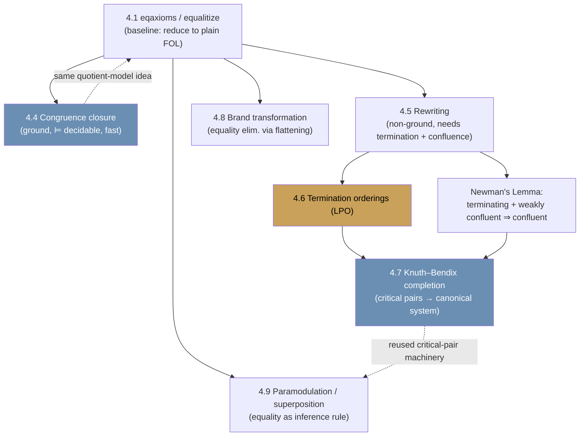

# Equality Reasoning

[[book-guidelines|↩ Back to guidelines]]

## Why equality needs its own chapter

Everything in Chapters 2 and 3 treated `=` as just another binary predicate symbol — syntactically special (infix), but semantically arbitrary. A model was free to interpret `=` as "same parity," or "differ by at most 1," or anything else that happened to satisfy whatever formulas mentioned it. That's a problem the moment you want to reason about actual mathematics: a group axiomatization is worthless if a "model" is allowed to call two different elements equal.

Harrison's fix is to single out the **normal interpretations** — those where `=` really is interpreted as identity on the domain — and then ask: can we get a normal-model-only notion of validity using the ordinary (unrestricted) first-order proof machinery we already built? The answer, and the chapter's opening move, is yes: axiomatize equality's defining behavior (it's an equivalence relation, and every function/predicate respects it), and any model satisfying those axioms is either normal or behaves exactly like a normal one from the theory's point of view.

But that's just the entry ticket. The chapter's real weight — and the reason it is one of the most load-bearing chapters in this book for anyone building a type-theoretic kernel — is what comes after: **how do you decide equality efficiently**, once you stop being satisfied with "throw axioms at a general prover and wait"? That question splits into the ground case (congruence closure — decidable, complete, fast) and the case with variables (rewriting, termination orderings, Knuth–Bendix completion — decidable only in favorable cases, but those cases cover most of practical algebra and, not coincidentally, most of what a dependently-typed kernel needs to normalize).

If you're building an elaborator whose `isDefEq` has to decide whether two terms are definitionally equal, this chapter is describing — almost literally — the machinery underneath it: congruence closure is what makes structural equality checks on partially-evaluated terms fast instead of exponential, and rewriting-with-termination-orders is the theory that makes it safe to normalize a term by repeatedly reducing it rather than searching an equational proof space.

---

## 4.1 Equality axioms — buying back soundness for free provers

**The problem.** A first-order formula prover (MESON, resolution, tableaux — everything built in Chapter 3) has no idea that `=` is supposed to mean identity. If you hand it `∀x. f(x) = f(x) ⇒ P(x)`, it will happily consider models where `f(x) = f(x)` is false.

**The fix.** Call an interpretation **normal** if `=` is interpreted as literal identity on the domain. Any normal interpretation automatically satisfies:

$$\forall x.\, x = x \qquad \forall x\,y.\, x=y \Leftrightarrow y=x \qquad \forall x\,y\,z.\, x=y \land y=z \Rightarrow x=z$$

(equality is an equivalence relation) plus, for every $n$-ary function $f$ and predicate $R$ appearing in the formulas under discussion, a **congruence** axiom:

$$\forall x_1\cdots x_n\,y_1\cdots y_n.\ x_1=y_1\land\cdots\land x_n=y_n \Rightarrow f(x_1,\ldots,x_n)=f(y_1,\ldots,y_n)$$
$$\forall x_1\cdots x_n\,y_1\cdots y_n.\ x_1=y_1\land\cdots\land x_n=y_n \Rightarrow R(x_1,\ldots,x_n) \Rightarrow R(y_1,\ldots,y_n)$$

Harrison writes $\mathrm{eqaxioms}(\Delta)$ for "all of these, for every function/predicate symbol appearing in $\Delta$." The chapter's foundational result:

> **Theorem 4.1.** $\Delta$ has a normal model iff $\Delta \cup \mathrm{eqaxioms}(\Delta)$ has a model (not necessarily normal).

The proof of the hard direction is a **quotient construction**: given any model $M$ of $\Delta \cup \mathrm{eqaxioms}(\Delta)$, define $a \sim b$ iff $=_M(a,b)$ holds; this is an equivalence relation (by the equivalence axioms), and the congruence axioms are exactly what's needed to make function/predicate interpretations well-defined on the quotient $D/{\sim}$. The quotient model is normal by construction, and a structural induction shows it satisfies exactly the same formulas as $M$ did. **This is precisely the "quotient by definitional equality" construction that shows up whenever a type theory's semantics needs `=` to behave like an actual equivalence** — the same shape of argument justifies why a setoid or a quotient type is a sound way to internalize an equivalence relation as if it were identity.

From here, `equalitize(p)` (the OCaml preprocessing function) computes $\mathrm{eqaxiom}(p) \Rightarrow p$ — the finitely many equality axioms relevant to a single formula $p$, conjoined as a hypothesis. Corollary 4.3 gives the payoff: **$p$ is valid in all normal models iff `equalitize(p)` is valid in the ordinary (unrestricted) sense**. So any of the Chapter 3 provers can now handle equality, just by preprocessing.

**What breaks without this.** Without `eqaxioms`, a prover given `f(a) = b, f(a) = c ⊢ b = c` would fail — nothing forces it to treat `=` as transitive, let alone as identity. Congruence is the sharper failure mode: without the congruence axiom for `f`, a prover cannot derive `f(a) = f(b)` from `a = b`, even though that's the single most basic thing "equality" ought to buy you. This is exactly the substitution/congruence rule a type checker's `isDefEq` needs for the trivial case of "these two terms are equal because their corresponding subterms are equal" — get it wrong and the kernel accepts or rejects programs on `=`-irrelevant syntactic differences.

**Grounding — Rust.** The `equalitize` transformation is a program that inspects a formula's function/predicate signature and manufactures axioms:

```rust
/// Mirrors Harrison's `function_congruence`/`predicate_congruence`/`equalitize`.
fn function_congruence(name: &str, arity: usize) -> Option<Formula> {
    if arity == 0 { return None; }
    let xs: Vec<Term> = (0..arity).map(|i| Term::var(format!("x{i}"))).collect();
    let ys: Vec<Term> = (0..arity).map(|i| Term::var(format!("y{i}"))).collect();
    let antecedent = xs.iter().zip(&ys)
        .map(|(x, y)| Formula::eq(x.clone(), y.clone()))
        .fold(Formula::True, Formula::and);
    let consequent = Formula::eq(Term::app(name, xs.clone()), Term::app(name, ys.clone()));
    Some(Formula::forall_all(xs.iter().chain(&ys), antecedent.implies(consequent)))
}
```

This is not a curiosity — it's the *fallback path* for any kernel that hasn't implemented a dedicated congruence-closure check: you can always recover soundness on equality by adding these axioms and calling your general unifier/prover, at the cost of speed. Section 4.4 is precisely about not paying that cost.

**Grounding — Lean.** Lean's kernel does not literally add congruence axioms and call a general prover; it implements congruence as a *primitive* reduction/proof rule (`congrArg`, `congrFun`, `Eq.mpr`, and the `congr` tactic's use of `HEq`/`Eq` recursion). But the *specification* of what congruence must guarantee is exactly Harrison's axiom schema: two applications of the same head are equal if all corresponding arguments are equal. Lean's `Eq.subst`/`rfl`-based congruence lemmas are the "trusted, efficient, structural" realization of what `eqaxioms` provides only "generically, via extra hypotheses."

---

## 4.2 Categoricity and elementary equivalence

A quick but consequential detour. Once you restrict attention to normal models, familiar algebraic structures (groups, rings, orders) become literally "the normal models of a first-order theory." This licenses standard model-theoretic vocabulary: an **isomorphism** between interpretations $M, M'$ is a bijection $i: D \to D'$ commuting with every function and predicate; a set of formulas is **categorical** if all its models are isomorphic; it is **$\kappa$-categorical** if all models of cardinality $\kappa$ are isomorphic (e.g. Steinitz: algebraically closed fields of given characteristic are $\kappa$-categorical for uncountable $\kappa$).

Two consequences worth internalizing:

1. The equalitarian versions of compactness and Löwenheim–Skolem carry over cleanly (Theorems 4.4–4.6): any countable satisfiable set of formulas with normal models has a countable normal model, and — via a compactness trick adding infinitely many "there are at least $n$ elements" sentences $B_n$ — a theory with arbitrarily large finite normal models has an *infinite* one.
2. Because first-order formulas can't pin down cardinality, a set of first-order axioms describing $\mathbb{R}$ (its field structure, order, `sin`, whatever you like) *always* has a countably infinite **nonstandard model** — proved by compactness, adding a constant $c$ forced to exceed every numeral. This is the seed of nonstandard analysis, and more importantly for our purposes it is the standard cautionary tale for **why definitional/judgmental equality in a type theory is never allowed to be "first-order provable equality of the theory's own axioms"** — no first-order axiomatization can force uniqueness of models, so a type theory's notion of equality has to be built into the *judgments themselves* (definitional equality checked by the kernel), not left to be "whatever satisfies some axiom set." Elementary equivalence (same models agree on all first-order sentences) is the honest substitute for isomorphism that first-order theories can actually deliver — and it's exactly why Section 5.6 later develops quantifier elimination as the mechanism for actually deciding a theory complete.

This section doesn't feed the compiler/elaborator project directly (it's classical model theory, not an algorithm), so we move on.

---

## 4.3 Birkhoff's equational logic and its completeness theorem

Restrict attention further: a set $\Delta$ of *equations* (implicitly universally quantified), asking whether $\Delta \models s = t$ (semantic entailment in first-order logic with equality). Birkhoff (1935) gave a purely syntactic proof system for exactly this fragment — six rules, inductively defining a provability relation $\Delta \vdash s = t$:

$$
\frac{(s=t)\in\Delta}{\Delta\vdash s=t}\,\text{AXIOM}
\qquad
\frac{\Delta\vdash s=t}{\Delta\vdash \mathrm{subst}\,i(s=t)}\,\text{INST}
\qquad
\frac{}{\Delta\vdash t=t}\,\text{REFL}
$$
$$
\frac{\Delta\vdash s=t}{\Delta\vdash t=s}\,\text{SYM}
\qquad
\frac{\Delta\vdash s=t \quad \Delta\vdash t=u}{\Delta\vdash s=u}\,\text{TRANS}
\qquad
\frac{\Delta\vdash s_1=t_1\ \cdots\ \Delta\vdash s_n=t_n}{\Delta\vdash f(s_1,\ldots,s_n)=f(t_1,\ldots,t_n)}\,\text{CONG}
$$

> **Theorem 4.7 (Birkhoff).** $\Delta \models s=t$ iff $\Delta \vdash s=t$.

The direction $\vdash \Rightarrow \models$ (soundness) is a routine induction. The direction $\models \Rightarrow \vdash$ (**completeness**) is proved by reducing to the machinery *already built in Chapter 3*: if $\Delta \models s=t$ then $\Delta \cup \{\neg(s=t)\} \cup \mathrm{eqaxioms}$ is unsatisfiable and — because these are all Horn clauses — has a Prolog-style refutation (Section 3.14). That refutation, read backwards, *is* a Birkhoff proof: its internal steps correspond exactly to TRANS/SYM/CONG.

**The distinction that matters — completeness vs. refutation completeness.** This is a genuinely different (and stronger) guarantee than what resolution gives you. Resolution is only *refutation* complete: $\Delta \models \bot$ implies a derivation of $\bot$, but $\Delta \models p$ for $p \ne \bot$ need not be derivable in the same syntactic vocabulary (`P ⊨ P ∨ Q` is true but resolution can't literally *derive* `P ∨ Q` from `P`, only refute their joint negation). Birkhoff's rules give you the equation itself, constructively, as a chain of legal rewrite-and-congruence steps — the kind of proof a human would actually write down.

**What breaks without this.** If your kernel's definitional-equality checker has no analogue of CONG + TRANS + SYM operating directly on terms, you're forced to fall back to "assert the negation, refute" style reasoning for *every* equality check, which is both slower and produces no usable equality certificate/witness — exactly the wrong shape for a proof-producing, trusted-kernel architecture (recall: your standing goal is proof certificates and proof reconstruction, not just yes/no oracles).

**The catch: equational proofs can still be hard to find.** Even though the theory is "tame" (decidable to *check* a Birkhoff proof, sound-and-complete), *finding* one can be brutal — Harrison's own example (deriving `x·i(x)=1` from one-sided group axioms `1·x=x`, `i(x)·x=1`) takes MESON many hours, despite there being a six-line human proof once you know the trick (multiply by `i(i(x))` cleverly). McKenzie (1975) showed equational logic can even embed full first-order logic, so there's no free lunch in general. This motivates the entire rest of the chapter: restrict to special cases (ground terms → congruence closure; oriented rules → rewriting) where search becomes *decidable and fast*, instead of merely complete-in-principle.

---

## 4.4 Congruence closure — deciding ground equality efficiently

This is the chapter's first genuinely load-bearing algorithm for a kernel, and it deserves the depth.

### The setup

Restrict to **ground** equations — no variables — since a Birkhoff proof between ground terms never needs INST. Fix a finite set $G$ of terms closed under subterms (i.e., $t \in G \Rightarrow$ every subterm of $t$ is in $G$). A binary relation $\sim$ on $G$ is a **congruence** if it's an equivalence relation *and* respects function application: $s_1 \sim t_1, \ldots, s_n \sim t_n \Rightarrow f(s_1,\ldots,s_n) \sim f(t_1,\ldots,t_n)$ (whenever all these terms are in $G$). The **congruence closure** of a relation $R$ is the smallest congruence containing $R$.

> **Theorem 4.8.** With $\sim$ the congruence closure of $\{(s_1,t_1),\ldots,(s_n,t_n)\}$ over $G$, the following are all equivalent: (i) $\{s_1=t_1,\ldots\} \models s=t$; (ii) $s \sim t$; (iii) there's a Birkhoff proof of $s=t$ using only terms in $G$; (iv) $\{s_1=t_1,\ldots\} \vdash s=t$.

The crucial part of the proof (ii $\Rightarrow$ deciding validity) builds a **term model** whose domain is the $\sim$-equivalence classes — the *canonical* countermodel construction: if $s \not\sim t$, interpret $=$ as "$\sim$" on the quotient and every hypothesis holds while the goal doesn't. This is the same quotient-model idea from Theorem 4.1, specialized to a finite, computable setting — which is exactly what makes it decidable.

### The algorithm: union-find + predecessor tracking

The implementation keeps two pieces of state:

- a **union-find** (`eqv`) representing the equivalence classes directly (so equivalence-closure is free — you get it from the data structure, not from extra rule applications);
- a **predecessor function** (`pfn`) mapping each canonical representative to the set of terms it occurs in as an immediate argument — this is what lets you *find* the places a merge might trigger a new congruence, instead of rescanning everything.

Testing whether two terms *should* merge by a single congruence step is simple — same head symbol, and all corresponding arguments already equivalent:

```ocaml
let congruent eqv (s,t) =
  match (s,t) with
    Fn(f,a1),Fn(g,a2) -> f = g & forall2 (equivalent eqv) a1 a2
  | _ -> false;;
```

`emerge` merges two terms and propagates:

```ocaml
let rec emerge (s,t) (eqv,pfn) =
  let s' = canonize eqv s and t' = canonize eqv t in
  if s' = t' then (eqv,pfn) else
  let sp = tryapplyl pfn s' and tp = tryapplyl pfn t' in
  let eqv' = equate (s,t) eqv in
  let st' = canonize eqv' s' in
  let pfn' = (st' |-> union sp tp) pfn in
  itlist (fun (u,v) (eqv,pfn) ->
                if congruent eqv (u,v) then emerge (u,v) (eqv,pfn)
                else eqv,pfn)
         (allpairs (fun u v -> (u,v)) sp tp) (eqv',pfn');;
```

Reading it as an algorithm: normalize `s,t` to their current representatives; if already equal, done. Otherwise collect the predecessor sets `sp`, `tp` — the terms where `s'`/`t'` occur as immediate subterms — union them onto the new merged class's predecessor set, and then recursively `emerge` every pair `(u,v)` drawn from `sp × tp` that is now `congruent`. **This is exactly the "propagate a merge through the congruence lattice" step you'd need for a term-DAG-based `isDefEq`**: two subterms became equal, so check whether that makes their immediate parents equal too, transitively.

Termination is immediate — each successful `emerge` call strictly decreases the number of equivalence classes, of which there are finitely many. Correctness (the result is exactly the congruence closure) is proved by a minimality argument: if the final relation weren't congruence-closed, there'd be some first point where two congruent parents `f(s_1,...,s_n)` and `f(t_1,...,t_n)` got all their arguments merged without themselves being merged — but the algorithm's own congruence check would have caught that merge immediately, contradiction.

### Deciding validity of ground equational formulas

To decide $\forall x_1\ldots x_n.\ P[x_1,\ldots,x_n]$ where $P$ uses only $=$ (arbitrary function symbols, no other predicates): Skolemize the negation, put it in DNF, and each disjunct is a conjunction of equations and inequations $s_1=t_1 \land \cdots \land s_n=t_n \land u_1\ne v_1 \land \cdots \land u_m\ne v_m$. **`ccsatisfiable`** builds the congruence closure of the equations via repeated `emerge`, then checks that no `(u_i,v_i)` pair ended up in the same class:

```ocaml
let ccsatisfiable fms =
  let pos,neg = partition positive fms in
  let eqps = map dest_eq pos and eqns = map (dest_eq ** negate) neg in
  let lrs = map fst eqps @ map snd eqps @ map fst eqns @ map snd eqns in
  let pfn = itlist predecessors (unions(map subterms lrs)) undefined in
  let eqv,_ = itlist emerge eqps (unequal,pfn) in
  forall (fun (l,r) -> not(equivalent eqv l r)) eqns;;
```

This is a genuinely fast decision procedure — near-linear with a good union-find (path compression + union by rank), certainly polynomial, in stark contrast to firing up a general first-order prover with `equalitize`.

### Ackermann reduction — a second, more elementary route

Ackermann (1954) observed you can eliminate functions entirely: introduce a fresh variable for every distinct subterm and add implications capturing congruence directly. For `f(f(f(c)))=c ∧ f(f(c))=c ⇒ f(c)=c`, set $x_k = f^k(c)$ and get:

$$(x_0=x_1\Rightarrow x_1=x_2)\land(x_0=x_2\Rightarrow x_1=x_3)\land(x_1=x_2\Rightarrow x_2=x_3) \Rightarrow (x_3=x_0\land x_2=x_0\Rightarrow x_1=x_0)$$

— a formula about equality between *variables only*, no functions. Push further by replacing each `s=t` with a fresh propositional atom $P_{s,t}$ plus equivalence-relation constraints ($P_{s,t}\land P_{t,u}\Rightarrow P_{s,u}$, etc.), and the whole problem collapses to **propositional tautology checking** — connecting ground-equality deciding all the way back to Chapter 2's SAT machinery.

### What breaks without congruence closure

Without it, every "are these two normalized/whnf'd terms structurally equal, accounting for the fact that some subterms are already known equal" question in a kernel degenerates to either (a) full syntactic equality — too strict, rejects definitionally-equal-but-not-syntactically-identical terms, or (b) `equalitize`-style axiom injection plus general proof search — sound but far too slow to run on every `isDefEq` call during elaboration. Congruence closure is the reason a real kernel can afford to ask "are these equal" thousands of times per typechecked file.

### Grounding

**Rust** — this maps almost verbatim onto a union-find over term hash-conses, with a `Vec<TermId>` (or small-vec) as the predecessor list per representative:

```rust
struct CongruenceClosure {
    uf: UnionFind<TermId>,
    predecessors: HashMap<TermId, Vec<TermId>>, // canonical rep -> parent terms
}

impl CongruenceClosure {
    fn congruent(&self, s: TermId, t: TermId) -> bool {
        match (self.arena.get(s), self.arena.get(t)) {
            (Term::App(f, args1), Term::App(g, args2)) =>
                f == g && args1.iter().zip(args2)
                    .all(|(&a, &b)| self.uf.find(a) == self.uf.find(b)),
            _ => false,
        }
    }

    fn emerge(&mut self, s: TermId, t: TermId) {
        let (s, t) = (self.uf.find(s), self.uf.find(t));
        if s == t { return; }
        let (sp, tp) = (self.predecessors.remove(&s).unwrap_or_default(),
                         self.predecessors.remove(&t).unwrap_or_default());
        self.uf.union(s, t);
        let new_rep = self.uf.find(s);
        let combined: Vec<_> = sp.iter().chain(&tp).copied().collect();
        self.predecessors.insert(new_rep, combined.clone());
        for &u in &sp {
            for &v in &tp {
                if self.congruent(u, v) { self.emerge(u, v); }
            }
        }
    }
}
```

This is essentially the design used in every production SMT solver's "equality graph" / e-graph module (and it is the direct ancestor of *equality saturation*, which generalizes congruence closure to a rewriting-plus-congruence search — see Ross Tate's e-graphs thesis elsewhere in this vault's collection, `39_Equality-Saturation-RossThesis2012`).

**Lean.** Lean's kernel does *not* run general congruence closure at the trusted core (it stays deliberately small — reduction plus a handful of primitive rules), but Lean's elaborator and its `simp`/`decide`-adjacent tactics (and definitely `Std.Tactic.Ext`/`congr!`) use congruence-closure-flavored reasoning to discharge goals of the shape "these applications are equal because their arguments are." More directly: Lean's `isDefEq` check, when comparing two applications `f a₁ … aₙ` and `f b₁ … bₙ` with the same head, degenerates to exactly the `congruent` test above — recursively check `aᵢ =?= bᵢ`. Congruence closure is what you'd bolt on top of that pointwise check to get transitive propagation across a whole context of known equalities (e.g. hypotheses `h : a = b` in scope) instead of re-deriving it structurally every time.

---

## 4.5 Rewriting — directional equality for the general (non-ground) case

Ground congruence closure is complete but only for ground terms. The moment variables are involved — real algebraic reasoning — you generally can't enumerate a finite term-closed set $G$, and a Birkhoff proof may need arbitrarily large intermediate terms. Everyday equational reasoning survives this by mostly using equations in **one preferred direction** — `i(x)·x = 1` used left-to-right to *simplify*, not backward to *complicate*. Using an equation directionally like this is **rewriting**.

**Definition.** Given equations $R$ (as left-to-right rules), $t \to_R t'$ if some $(l=r)\in R$ rewrites a subterm of $t$ that's an instance of $l$ into the corresponding instance of $r$. Rewriting is trivially sound ($t = t'$ holds in any model of $R$) since it's decomposable into Birkhoff steps.

### Canonical (convergent) rewrite systems

$E$ is **canonical/convergent** if $E \models s=t$ can be decided by rewriting both $s,t$ to normal forms $s^\downarrow, t^\downarrow$ (repeatedly, everywhere) and comparing syntactically. This needs exactly two properties, stated over an *abstract reduction relation* $\to$ on any set (deliberately more general than terms, so the same theorems reuse later for Gröbner bases, Chapter 5):

- **Termination** (strongly normalizing / noetherian): no infinite reduction sequence.
- **Confluence**: if $x \to^* y_1$ and $x \to^* y_2$, there's a $z$ with $y_1 \to^* z$ and $y_2 \to^* z$ (write $y_1 \downarrow y_2$, "joinable"). **Weak (local) confluence** is the same but with single steps $x\to y_1$, $x\to y_2$ at the top.

### Newman's Lemma — the key leverage point

> **Theorem 4.9 (Newman, 1942; short proof due to Huet, 1980).** Terminating + weakly confluent $\Rightarrow$ confluent.

The proof is wellfounded induction on the terminating order: take $x$ minimal such that some $y \ne y'$ both reachable from it fail to be joinable; $x \to w \to^* y$ and $x \to w' \to^* y'$; weak confluence joins $w, w'$ at some $z$; minimality of $x$ (applied to the strictly-smaller-in-the-order $w, w'$) forces $y = z = y'$ — contradiction.

**Why this matters so much:** confluence, stated directly, quantifies over *all* pairs of reduction sequences of *all* lengths — an infinite check. Weak confluence only asks about pairs of *single* steps from a common ancestor — finitely checkable at each starting term, and (per Section 4.7) reducible to finitely many *critical pairs* overall. Newman's lemma is the bridge that turns "confluence, an infinitary property" into "local confluence, checkable case-by-case" wherever termination is already known — which is exactly the strategic move Knuth–Bendix completion is built on.

**Church–Rosser.** Confluence is equivalent (Theorem 4.10) to the **Church–Rosser property**: $x \leftrightarrow^* y$ (interconvertible via any mix of forward/backward steps) implies $x \downarrow y$ (jointly reducible to something). The equivalence is proved by an induction that repeatedly "fills in" a zig-zag diagram of forward/backward steps using confluence at each stage — the classic picture from $\lambda$-calculus $\beta$-reduction (where the property gets its name, Church and Rosser 1936).

<svg viewBox="0 0 620 300" xmlns="http://www.w3.org/2000/svg" font-family="sans-serif">
  <style>
    .node { fill: #6b8fb3; }
    .lbl { fill: #444444; font-size: 13px; }
    .arr { stroke: #8a8a8a; stroke-width: 1.6; fill: none; marker-end: url(#ah); }
  </style>
  <defs>
    <marker id="ah" markerWidth="8" markerHeight="8" refX="6" refY="3" orient="auto">
      <path d="M0,0 L6,3 L0,6 Z" fill="#8a8a8a"/>
    </marker>
  </defs>
  <text x="10" y="20" class="lbl" font-size="14" font-weight="bold">Newman's Lemma: local confluence + termination ⇒ confluence</text>

  <circle cx="300" cy="55" r="6" class="node"/><text x="312" y="60" class="lbl">x (minimal counterexample)</text>
  <circle cx="180" cy="130" r="6" class="node"/><text x="130" y="150" class="lbl">w</text>
  <circle cx="420" cy="130" r="6" class="node"/><text x="432" y="150" class="lbl">w′</text>
  <circle cx="180" cy="230" r="6" class="node"/><text x="130" y="250" class="lbl">y</text>
  <circle cx="420" cy="230" r="6" class="node"/><text x="432" y="250" class="lbl">y′</text>
  <circle cx="300" cy="230" r="6" class="node"/><text x="308" y="255" class="lbl">z (weak confl.)</text>

  <path d="M294,60 L186,124" class="arr"/>
  <path d="M306,60 L414,124" class="arr"/>
  <path d="M180,136 L180,224" class="arr"/><text x="150" y="185" class="lbl">*</text>
  <path d="M420,136 L420,224" class="arr"/><text x="428" y="185" class="lbl">*</text>
  <path d="M186,136 L296,224" class="arr"/><text x="215" y="165" class="lbl">*</text>
  <path d="M414,136 L306,224" class="arr"/><text x="360" y="165" class="lbl">*</text>

  <text x="60" y="290" class="lbl">y and z are both normal forms reached from the strictly-smaller w ⇒ by minimality y = z, similarly y′ = z, so y = y′.</text>
</svg>

### Implementing rewriting

```ocaml
let rec rewrite1 eqs t =
  match eqs with
    Atom(R("=",[l;r]))::oeqs ->
     (try tsubst (term_match undefined [l,t]) r
      with Failure _ -> rewrite1 oeqs t)
  | _ -> failwith "rewrite1";;

let rec rewrite eqs tm =
  try rewrite eqs (rewrite1 eqs tm) with Failure _ ->
  match tm with
    Var x -> tm
  | Fn(f,args) -> let tm' = Fn(f,map (rewrite eqs) args) in
                  if tm' = tm then tm else rewrite eqs tm';;
```

This is *unconditionally* leftmost-outermost, exhaustive rewriting — precisely the shape of a `normalize`/`whnf`-then-recurse evaluator, except that it's not tied to a single evaluation strategy: Harrison notes any strategy works fine as long as the system is confluent (that's the entire point of confluence — the *order* of reduction stops mattering for the final answer). This is worth sitting with: **normalization strategy independence is not free — it is a theorem you get only after establishing confluence**, and confluence itself is undecidable in general.

**What breaks without termination/confluence.** The chapter gives two cautionary examples worth internalizing viscerally:

- `{x+y = y+x}` alone is *not* terminating: `a+b → b+a → a+b → ...` forever. A kernel `whnf` implemented naively on top of a non-terminating rule set simply hangs.
- `{x·(y+z)=x·y+x·z, (x+y)·z=x·z+y·z}` (the distributive laws) *is* terminating but **not confluent**: `(a+b)·(c+d)` reduces, depending on which side you distribute first, to two different fully-reduced forms that are never re-joined. A kernel using this rule set as its normalizer would report two definitionally-equal terms as *not* equal, depending on evaluation order — silently unsound from the user's perspective, even though every individual step was valid.

**Grounding — Rust.** A term-rewriting engine's inner loop is exactly `rewrite`/`rewrite1` above, typically implemented against an arena-allocated term representation with memoized normal forms:

```rust
fn rewrite1(rules: &[Rule], t: &Term) -> Option<Term> {
    rules.iter().find_map(|r| r.lhs.match_against(t).map(|subst| r.rhs.substitute(&subst)))
}

fn normalize(rules: &[Rule], t: &Term) -> Term {
    let mut cur = t.clone();
    while let Some(next) = rewrite1(rules, &cur) { cur = next; }
    match &cur {
        Term::App(f, args) => {
            let args = args.iter().map(|a| normalize(rules, a)).collect();
            let rebuilt = Term::App(f.clone(), args);
            if rebuilt == cur { rebuilt } else { normalize(rules, &rebuilt) }
        }
        _ => cur,
    }
}
```

**Grounding — Lean.** This *is* Lean's `whnf`/`whnfCore` reduction engine, minus the fact that Lean's rules ($\beta$, $\iota$/recursor-reduction, $\delta$/unfolding, $\zeta$/let-reduction) are not user-supplied but come from the type theory's fixed reduction relation — which is proved confluent and (weakly, for well-typed terms) normalizing as part of the metatheory. `isDefEq t1 t2` is, at its lowest level, "reduce both to (weak head) normal form using this fixed confluent rewrite system and compare" — exactly Harrison's canonical-rewrite-system decision procedure, specialized to a system whose confluence the type theorist proves once, by hand, rather than checking per-instance the way Knuth–Bendix does for a user-supplied equational theory.

---

## 4.6 Termination orderings — proving `→` terminates

Direct termination proofs are hard. The standard trick: exhibit a bigger, already-known-terminating relation `>` that contains `→`. A **rewrite order** must be transitive, irreflexive, and closed under both instantiation ($s>t \Rightarrow \sigma s > \sigma t$) and congruence (replacing one argument of $f$ preserves the ordering); a **reduction order** is a terminating rewrite order. Then:

> **Lemma 4.14.** If $>$ is a reduction order and $l > r$ for every rule $(l=r)\in R$, then $\to_R$ terminates.

(Immediate: every rewrite step is an instance-and-congruence-closed application of some $l>r$, and $>$ is closed under exactly those operations, so every step decreases $>$.)

**Why size alone fails.** The naive idea — order terms by size $|t|$ — is wellfounded, transitive, congruence-respecting, but **fails instantiation-closure**: $f(x,x,x) > g(x,y)$ by size, but instantiate $y \mapsto f(x,x,x)$ and you get $f(x,x,x) > g(x,f(x,x,x))$, false by size. A size-plus-variable-count fix patches this but is still useless for algebra's two canonical hard cases: the **associative law** $(x\cdot y)\cdot z = x\cdot(y\cdot z)$ (equal size both sides — no orientation possible by size alone) and the **distributive law** $x\cdot(y+z)=x\cdot y+x\cdot z$ (RHS is *larger*, yet that's the direction you want).

### The lexicographic path order (LPO)

The fix is to order terms *recursively*, not by a scalar measure, using a precedence on function symbols plus lexicographic comparison of arguments:

```ocaml
let rec lpo_gt w s t =
  match (s,t) with
    (_,Var x) -> not(s = t) & mem x (fvt s)
  | (Fn(f,fargs),Fn(g,gargs)) ->
        exists (fun si -> lpo_ge w si t) fargs or
        forall (lpo_gt w s) gargs &
        (f = g & lexord (lpo_gt w) fargs gargs or
         w (f,length fargs) (g,length gargs))
  | _ -> false
and lpo_ge w s t = (s = t) or lpo_gt w s t;;
```

Read declaratively, $f(\vec s) > t$ when *either* (a) some immediate argument $s_i \ge t$ (the subterm case — handles `s > t` whenever $t$ is a subterm of `s`), *or* (b) `s` dominates every argument of `t` recursively (`s > t_j` for all `j`) **and** either the head symbols tie and the argument tuples compare lexicographically, or `f`'s precedence strictly exceeds `g`'s. That last conjunct — "`s` must also exceed every proper subterm of `t`," not just its top structure — is the fix that rules out the naive-but-broken variant (Harrison's counterexample: `x·(y+z) = x·(z+y)+z` looks orientable by the un-fixed rules but isn't actually terminating).

The chapter proves, in full, that the LPO (over a finite signature) is irreflexive (4.20), transitive (4.16), instantiation-closed (4.18), congruence-closed (4.19), and — the hard part — **terminating** (4.21), via a minimality argument over a hypothetical infinite descending chain that bottoms out in a contradiction with wellfoundedness of the lexicographic extension. A useful shortcut: any **simplification order** (one with the subterm property $s > t$ for $t$ a proper subterm of $s$) is *automatically* terminating (Dershowitz 1979, via Kruskal's tree theorem) — so proving the subterm property alone (easy) gets termination for free, without redoing the LPO-style induction each time.

**Why the precedence matters concretely.** For group-theory completion (Section 4.7), giving `i` (inverse) the *highest* precedence deliberately biases the ordering to expand `(x·y)⁻¹ = y⁻¹·x⁻¹` rather than contract it — because expanding creates more opportunities for adjacent `i(x)·x` cancellations downstream. Choosing an ordering is choosing a *simplification strategy*, not just a termination certificate.

**What breaks without a reduction order.** Without one, "does my rule set terminate" is undecidable in general — you're reduced to running it and hoping, which is exactly the failure mode a trusted kernel cannot tolerate (an unsound or hanging `isDefEq` is worse than a slow one). LPO-style orderings give you a *checkable, syntactic* sufficient condition instead of an empirical one.

**Grounding — Rust/Lean.** A Rust term-rewriting engine that accepts user-supplied rules (e.g. a `simp`-set analogue, or a normalization pass in the refinement-type checker) needs exactly an LPO-style check at rule-registration time, rejecting or requiring a precedence annotation for any rule that can't be shown to decrease. Lean's kernel sidesteps this entirely by fixing its reduction rules once and for all (β/ι/δ/ζ) and proving termination as a metatheorem about *well-typed* terms specifically (strong normalization for CIC-like systems, which does *not* hold for arbitrary untyped terms) — this is precisely why Lean disallows arbitrary user rewrite rules as *definitional* equalities (they'd need exactly this kind of termination certificate) and instead requires them to be proved as propositional equalities and invoked explicitly via `rw`/`simp`, which never risk kernel non-termination because they operate at the tactic/elaboration layer, not inside `whnf`.

---

## 4.7 Knuth–Bendix completion — turning "terminating" into "canonical"

Given a terminating rewrite system $R$, Newman's lemma says confluence reduces to *local* confluence. The question becomes: how do you check local confluence without examining infinitely many starting terms $s$?

### Critical pairs

Non-joinable local divergences can only arise from **overlapping** rewrites — where the redex of one rule occurs (non-trivially, not just at/below a variable position) inside the redex of another. Formally:

> **Definition 4.22.** For rules $l_1=r_1$, $l_2=r_2$ (disjoint variables), if $l_2$ unifies (via MGU $\sigma$) with a non-variable subterm of $l_1$, the pair $(\sigma r_1,\ \sigma\, l_1[l_2 \mapsto r_2])$ is a **critical pair**.

This is deliberately the *most general* representative of every possible overlap — every actual non-joinable divergence at any concrete term is an *instance* of some critical pair (Lemma 4.23) — which is what makes checking finitely many critical pairs sufficient:

> **Theorem 4.24 / Corollary 4.25.** A TRS is (locally) confluent iff every critical pair is joinable; if it's also terminating, this decides full confluence.

<svg viewBox="0 0 640 260" xmlns="http://www.w3.org/2000/svg" font-family="sans-serif">
  <style>
    .box { fill: #f4f1ea; stroke: #9c9c9c; stroke-width: 1; }
    .lbl { fill: #3a3a3a; font-size: 13px; }
    .hd { font-weight: bold; font-size: 14px; fill: #333; }
    .arr { stroke: #8a8a8a; stroke-width: 1.6; fill: none; marker-end: url(#ah2); }
  </style>
  <defs>
    <marker id="ah2" markerWidth="8" markerHeight="8" refX="6" refY="3" orient="auto">
      <path d="M0,0 L6,3 L0,6 Z" fill="#8a8a8a"/>
    </marker>
  </defs>
  <text x="10" y="20" class="hd">Overlap of two rewrite rules → a critical pair</text>

  <rect x="230" y="45" width="180" height="34" rx="4" class="box"/>
  <text x="245" y="67" class="lbl">l1[ l2 , ... ]  (term s)</text>

  <path d="M320,80 L150,150" class="arr"/>
  <text x="180" y="115" class="lbl">rewrite via l1=r1</text>
  <path d="M320,80 L490,150" class="arr"/>
  <text x="400" y="115" class="lbl">rewrite via l2=r2 (inside)</text>

  <rect x="40" y="150" width="200" height="34" rx="4" class="box"/>
  <text x="55" y="172" class="lbl">σ r1   (t1)</text>

  <rect x="400" y="150" width="220" height="34" rx="4" class="box"/>
  <text x="410" y="172" class="lbl">σ l1[ l2 ↦ r2 ]   (t2)</text>

  <path d="M140,184 L300,225" class="arr"/>
  <path d="M510,184 L340,225" class="arr"/>
  <text x="270" y="245" class="lbl" font-style="italic">joinable? (this is the check completion performs)</text>
</svg>

Finding critical pairs is finding, via most-general-unification, every non-variable overlap between two left-hand sides — implemented (`crit1`/`critical_pairs`) by recursively trying to unify `l` against every subterm of the other rule's LHS.

### Completion

The insight that turns "check confluence" into "*build* a confluent system": a joinable-after-normalizing critical pair is fine as is; if the two normal forms `s'`, `t'` differ, `s'=t'` is a **logical consequence** of the existing rules (it was derived from a common ancestor by rewriting), so you can simply **add it as a new oriented rule** and keep going:

```ocaml
let rec complete ord (eqs,def,crits) =
  match crits with
    (eq::ocrits) ->
        let trip =
          try let (s',t') = normalize_and_orient ord eqs eq in
              if s' = t' then (eqs,def,ocrits) else
              let eq' = Atom(R("=",[s';t'])) in
              let eqs' = eq'::eqs in
              eqs',def,
              ocrits @ itlist ((@) ** critical_pairs eq') eqs' []
          with Failure _ -> (eqs,eq::def,ocrits) in
        status trip eqs; complete ord trip
  | _ -> if def = [] then eqs else
         let e = find (can (normalize_and_orient ord eqs)) def in
         complete ord (eqs,subtract def [e],[e]);;
```

Two failure modes are inherent, not implementation bugs:

1. **Non-orientability.** Neither `s'>t'` nor `t'>s'` under the fixed ordering (e.g. `x·y=y·x` — commutativity can *never* be oriented by any rewrite order, since instantiation-closure with `x↦y,y↦x` would force `t>s` too). These go on a `deferred` list, revisited after other progress in case they later normalize to joinability.
2. **Non-termination of completion itself.** New rules generate new critical pairs; it's possible for this process to never settle (completion is a semi-procedure, not a decision procedure).

Applied to the group axioms with a suitable LPO (inverse ranked highest, exactly so `(x·y)⁻¹` expands rather than contracts — see §4.6), completion **derives** the full canonical simplifier for groups — including facts like `i(i(x))=x` and `i(1)=1`, which were *not* among the original three axioms but fall out as consequences. This is a genuinely impressive demonstration: you feed in the bare group axioms and un-oriented, and get back a decision procedure for the word problem in free groups.

### Interreduction — shrinking a bloated result

A raw completion result is typically redundant (equations subsumed by combinations of others). Métivier's theorem licenses simplification:

> **Theorem 4.26 / Corollaries 4.27–4.28.** For a canonical $\to_R$: if the LHS of a rule is reducible by the *other* rules, discard it (both sides remain joinable via the others); simplifying an RHS by the whole system (including itself) preserves canonicity.

```ocaml
let rec interreduce dun eqs =
  match eqs with
    (Atom(R("=",[l;r])))::oeqs ->
        let dun' = if rewrite (dun @ oeqs) l <> l then dun
                   else mk_eq l (rewrite (dun @ eqs) r)::dun in
        interreduce dun' oeqs
  | [] -> rev dun;;
```

The interreduced set is (Métivier 1983) essentially *unique* once the ordering is fixed — completion converges, when it converges, to a canonical form independent of the arbitrary order critical pairs happened to be processed in.

### Handling failure gracefully: unfailing completion

Bachmair–Dershowitz–Plaisted's **unfailing completion** replaces "orient or defer" with **ordered rewriting**: an equation that can't be globally oriented is still used, per-instance, in whichever direction the term ordering favors *for that instance*. This never gets stuck, and even when it never produces a canonical system, it produces a system capable of *proving* $s=t$ whenever that follows semantically — a complete proof procedure for equational logic that degrades gracefully instead of failing outright. Harrison's own example: completing the group axioms *plus* $x^2=1$ deliberately fails to orient the derived critical pair $x^2\cdot x_0 = x_0\cdot x^2$ (a commutativity consequence) — but from the theorem-proving point of view that's not really a failure, it's the discovery that such groups are abelian.

### Why this section is the load-bearing one

Knuth–Bendix completion is the constructive answer to "how do I get from a set of definitional/`rfl`-provable equations to a decision procedure for the theory they generate." A dependently-typed kernel that wants to support user-declared computation rules (e.g. for a custom inductive eliminator, or a `refinement`-style normalizer with domain-specific simplification lemmas) needs exactly this machinery to certify that the rule set it's about to run through `whnf` is safe: terminating (via a reduction order, §4.6) *and* confluent (via critical-pair joinability, this section). Skip this check and you get the same silent-unsoundness failure mode called out in §4.5 — two definitionally-equal terms reducing to different normal forms depending on reduction order, except now it's not a toy `(a+b)(c+d)` example, it's a real proof accepted or rejected inconsistently.

**Grounding — Rust.** A completion procedure is a natural fit for Rust's ownership-driven worklist style — `crits: VecDeque<(Term,Term)>`, `deferred: Vec<(Term,Term)>`, `rules: Vec<Rule>` — with the LPO from §4.6 as the `Ord`-like comparator passed in. This is precisely the kind of static analysis pass you'd run *once*, at compile time / trusted-setup time, over a proposed set of rewrite rules for the refinement-type normalizer, rather than something the runtime kernel does per-check.

**Grounding — Lean.** Lean doesn't run Knuth–Bendix internally (its fixed β/ι/δ/ζ rules are proved confluent once, by hand, as part of the metatheory of the underlying type theory — this is a *meta*-level Church–Rosser theorem, not a per-project completion run). But `simp` sets are exactly an *unmanaged* analogue of a completed rewrite system: a well-behaved `simp` set is expected (though not machine-verified by Lean itself) to be terminating and confluent, and `simp` "doesn't close the goal" or "loops" failures are precisely non-termination/non-confluence bugs in a user-supplied rule set that Knuth–Bendix-style tooling could, in principle, catch ahead of time — exactly the check your Rust normalizer should perform automatically that Lean's `simp` currently leaves to programmer discipline.

---

## 4.8 Equality elimination — the Brand transformation

A different strategy: instead of adding equality axioms as extra *hypotheses* (§4.1) or building a dedicated decision procedure (§4.4–4.7), **transform the input formula itself** so that plain first-order proof search (no equality axioms needed beyond bare reflexivity) suffices.

The key building block, stated generally for any binary relation $R$ (not just `=`, to avoid smuggling in assumptions): if `Equiv` asserts $R$ is an equivalence relation, it's logically equivalent to a single "self-describing" formula:

$$\forall x\,y.\ R(x,y) \Leftrightarrow \big(\forall z.\ R(x,z)\Leftrightarrow R(y,z)\big)$$

> **Theorem 4.29.** $P \land \mathrm{Equiv}$ is satisfiable iff $P^*$ (every $R(s,t)$ in $P$ replaced by $R^*[s,t] := \forall w.\, R(s,w)\Leftrightarrow R(t,w)$) is satisfiable.

The proof is a two-way squeeze: `Equiv` entails the $R \Leftrightarrow R^*$ biconditional pointwise, so $\mathrm{Equiv}\land P \Leftrightarrow \mathrm{Equiv}\land P^*$; conversely, given a model of $P^*$, you can always *define* a new interpretation of $R$ (from the $R^*$-definition) that is provably an equivalence relation and under which $P$ holds. Either way you can drop the `Equiv` axioms once the substitution is made — "killing" them, hence Ohlbach–Gabbay–Plaisted's term "killer transformations."

Brand (1975)'s refinement keeps reflexivity but drops symmetry/transitivity, exploiting NNF to touch only **positive** occurrences of `=`:

- **S-modification** eliminates symmetry: a clause with $n$ positive equations $s_1=t_1\lor\cdots\lor s_n=t_n\lor C$ expands into $2^n$ clauses covering every forward/backward orientation choice.
- **T-modification** eliminates transitivity: replace $s_i=t_i$ by $\neg(t_i=w_i)\lor s_i=w_i$ (a fresh $w_i$ per literal), turning "equal to $t_i$" into "for any $w$, if $t_i=w$ then $s_i=w$."
- **E-modification** (flattening) eliminates the need for congruence axioms: repeatedly pull non-variable subterms out into fresh-variable equations, e.g. the associative law flattens to `x·y=w₁ ∧ y·z=w₂ ⇒ w₁·z = x·w₂`.

> **Theorem 4.30.** For a **flat**, quantifier-free $P$: $P\land E\land C$ (equivalence + congruence axioms) is satisfiable iff $P\land E$ is — congruence becomes *unnecessary* once every function/predicate application is restricted to variable arguments.

The overall **Brand transformation** = E-modify, then S-modify, then T-modify, plus the bare reflexivity clause $x=x$ — after which ordinary MESON (`bmeson`) suffices, with **no equality axioms at all** beyond that single reflexivity clause. Empirically the tradeoffs are real: on group-theory problems Brand's transformation vastly outperforms axiom injection (`emeson`); on other problems (Wishnu's fixed-point puzzle from §4.1) it's the reverse. There is no dominant strategy — which is itself an important lesson for building a general-purpose kernel/prover: **equality handling is not a solved, one-size-fits-all problem even today**; production provers offer multiple strategies and pick heuristically.

**Where this connects.** Flattening (E-modification) is structurally the same move as **A-normal form / ANF conversion** in a compiler — pulling nested subexpressions out into fresh let-bound names so every operation applies only to atomic operands. If your refinement-type checker generates verification conditions by symbolic execution, flattening compound terms before emitting equality constraints to the SMT backend is doing exactly Brand's E-modification, for exactly the same reason: it simplifies what the downstream solver needs to reason about congruence for.

---

## 4.9 Paramodulation — equality as a first-class inference rule

The alternative to preprocessing: bake equality handling directly into the inference engine. **Demodulation** (Wos, Robinson, Carson, Shalla 1967) is the simple version — use unit equations like `x+0=x` as simplification rewrite rules on derived clauses (removing "modulations" of the same underlying fact). It's practically indispensable but *incomplete* on its own.

**Paramodulation** (G. Robinson & Wos, 1969) is the complete generalization — a resolution-shaped rule combining an equation and an arbitrary literal via unification:

$$\frac{C \lor s \mathrel{\dot=} t \qquad D \lor P[s']}{\mathrm{subst}\,\sigma\,(C\lor D\lor P[t])}\ \text{Paramodulation}, \quad \sigma = \mathrm{mgu}(s,s')$$

(where $s\mathrel{\dot=}t$ may be read either direction). Compared to plain rewriting, paramodulation generalizes in three ways at once: the equation can carry side literals $C$; it can be applied in either direction; and the matched subterm is found by full **unification**, not mere pattern matching against a ground instance — this is precisely why paramodulation is the general-purpose analogue of §4.7's *critical pair* computation, reused inside a live proof search rather than a static completion pass (the implementation literally reuses the `overlaps` machinery from Knuth–Bendix, generalized from term-overlaps to overlaps-inside-a-literal via `overlapl`).

### Refutation completeness — and its surprisingly delicate proof

> **Theorem 4.31.** If $S$ has no normal model, $S$ together with reflexivity plus **functional reflexive axioms** $f(\vec x)=f(\vec x)$ (one per function symbol) has a refutation by resolution + paramodulation.

The proof simulates positive hyperresolution (already known refutation-complete with `eqaxioms`) step by step: every hyperresolution step involving a congruence axiom is replicated by a single paramodulation step using the corresponding functional-reflexive axiom as the "trivial" equation to paramodulate into. This is genuinely subtle — the functional reflexive axioms look useless (`f(x)=f(x)` is a tautology!) but they're exactly what lets paramodulation "reach into" a term the way a congruence-axiom-based hyperresolution step would. Brand later strengthened this to show plain reflexivity ($x=x$ alone) already suffices, and that paramodulation can safely be restricted to **never paramodulate into a variable** without losing completeness — a restriction that matters enormously in practice (it prunes a huge fraction of the search space). But the completeness picture is genuinely fragile: combine paramodulation with set-of-support and drop functional reflexivity, and Harrison exhibits a small, concretely unsatisfiable clause set that becomes *unrefutable* — showing the axioms aren't merely a theoretical nicety.

### Superposition — the modern synthesis

The chapter closes by gesturing at [[Algebraic-Decision-Procedures#Where this leads|where this leads]] industrially: encode ordinary atomic formulas $P(t_1,\ldots,t_n)$ as equations $f_P(t_1,\ldots,t_n) = \mathsf{T}$, and *all* first-order inference — resolution included — can be performed via paramodulation-style equational reasoning alone. This is the **superposition** method (Bachmair & Ganzinger 1994), implemented in production provers like E (Schulz 1999), and it's the calculus underlying essentially every serious first-order/equational ATP built since. Superposition adds ordering restrictions (only paramodulate with maximal sides of maximal literals, in the term ordering sense of §4.6) to prune paramodulation's search space the same way LPO-guided rewriting prunes Knuth–Bendix's — the two halves of this chapter converge into one calculus.

**Grounding.** Paramodulation-with-restrictions is essentially what an SMT solver's equality/congruence module is doing when it needs to reason about equalities that appear *inside* disjunctive clauses (not just ground unit facts, where congruence closure alone suffices) — it's the bridge between the purely-ground decision procedure of §4.4 and full first-order proof search. For your CSP/abstract-interpretation kernel's counterexample search: whenever a candidate invariant or Horn-clause refutation needs to combine an equality fact with a disjunctive constraint (rather than a flat conjunction of ground facts), you're outside congruence closure's comfort zone and into paramodulation's.

---

## Where this leads



Within the book: this chapter's decision procedures (congruence closure especially) reappear as a *component* inside Chapter 5's combined decision procedures (Nelson–Oppen, §5.13) — any theory combination needs a fast equality core to propagate shared-variable facts between theories, and that core is exactly `ccvalid`. Rewriting and confluence resurface almost unchanged in §5.11 (Gröbner bases: polynomial reduction is a rewrite relation, S-polynomials are literally critical pairs, [[Algebraic-Decision-Procedures#Buchberger's algorithm|Buchberger's algorithm]] is Knuth–Bendix completion specialized to polynomial rings). Paramodulation's ordering restrictions are the direct ancestor of the demodulation/rewriting machinery used pervasively as a simplification pass inside every later proof procedure in the book.

For the standing project: this chapter is one of the most directly load-bearing in the entire book.

- **Congruence closure (§4.4) is the algorithm your `isDefEq` needs** for fast structural equality over partially-reduced terms with shared subterms — the union-find-plus-predecessor-propagation design generalizes directly into an e-graph, which is the natural data structure for a kernel that wants to cache and reuse equality facts across many typechecking calls rather than re-deriving them.
- **Termination orderings + Knuth–Bendix completion (§4.6–4.7) are exactly the certificate-generation machinery** your refinement-type normalizer needs before it's safe to treat a user- or library-supplied set of rewrite/simp lemmas as part of definitional equality: termination via a checkable ordering, confluence via finitely-many critical-pair checks licensed by Newman's lemma. Skipping this check is precisely how a kernel becomes unsound via reduction-order-dependent results (§4.5's distributive-law counterexample).
- **The Brand transformation's flattening (§4.8)** is the same operation as ANF-conversion of verification-condition terms before handing them to an SMT backend — worth recognizing as one operation wearing two names.
- **Paramodulation/superposition (§4.9)** is where equality reasoning stops being a standalone decision procedure and becomes a first-class inference rule usable inside a general Horn-clause/CHC solver — relevant the moment your CSP kernel needs to reason about equality facts entangled with disjunctive or quantified constraints, not just flat conjunctions of ground equations.
