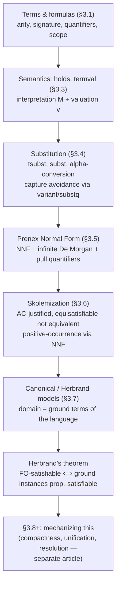

# First-Order Logic: Syntax and Semantics

[[book-guidelines|↩ Back to guidelines]]

## Why propositional logic isn't enough

[[Propositional-Logic|Propositional logic]] treats "the sky is blue" and "the sky is not green" as two unrelated atoms, $p$ and $q$. There's no way to say that these two facts are *about the same object* — the sky — and no way to write a schema like "for every $x$, if $x$ is blue then $x$ is not green" that applies uniformly across many objects. Harrison's own motivating example is arithmetic: the truth of "$m < n$" depends on the specific values of $m$ and $n$, and if each instance ($1 < 2$, $3 < 7$, ...) gets its own fresh propositional atom, you lose all ability to relate them — you can't even state $\neg(m<n \wedge n<m)$ as a single schema. What breaks without a richer logic is *generality*: propositional logic can't express "for all $x$" or "there is some $x$ such that."

First-order (predicate) logic fixes this with two additions: (1) atomic propositions are built from **non-propositional variables and constants** combined via **functions and predicates**, and (2) those variables can be **bound by quantifiers**. This is exactly the move a type checker's context and a proof checker's judgment share: both need variables that range over a domain, and rules that hold uniformly for any instantiation of those variables.

## Terms, formulas, and arity: the two syntactic sorts

Harrison insists on a syntactic distinction that his book's whole first chapter primed you to expect: **terms** denote objects, **formulas** denote truth values. This split is precisely the "two syntactic sorts" move you'll recognize from typed ASTs — you don't want expressions and statements collapsing into one category, because they have different well-formedness rules and different semantics.

```ocaml
type term = Var of string
          | Fn of string * term list;;

type fol = R of string * term list;;
```

A term is either a variable or a function symbol applied to a list of argument terms. The number of arguments a function takes is its **arity** — Harrison's pun on "unary, binary, ternary, quaternary." A **constant** (like the natural number `1`, or `π`) is simply a **nullary** function, `Fn("1", [])` — there's no separate constant category in the grammar, just arity zero. Predicates work the same way: `R("<", [s; t])` for infix `s < t`.

A **signature** is a pair of finite sets — named/aritied function symbols and named/aritied predicate symbols — and the corresponding **language** is the set of terms and formulas built only from that signature (with arbitrary variables). This is your type system's *signature of primitives* — the set of type/term constructors a checker is allowed to use before touching the ambient context of local variables.

**Rust [[Equality-Reasoning#Grounding|grounding]].** This is close to how you'd represent an untyped term AST before adding a type layer:

```rust
enum Term {
    Var(String),
    Fn(String, Vec<Term>),
}

enum Formula {
    False,
    True,
    Atom(String, Vec<Term>),   // predicate application
    Not(Box<Formula>),
    And(Box<Formula>, Box<Formula>),
    Or(Box<Formula>, Box<Formula>),
    Imp(Box<Formula>, Box<Formula>),
    Iff(Box<Formula>, Box<Formula>),
    Forall(String, Box<Formula>),
    Exists(String, Box<Formula>),
}
```

Note that `Fn` here is untyped — arity is a property you'd check against a signature table, not something encoded in the enum itself, exactly as in `term`/`fol`.

## Quantifiers, scope, and variable binding

$\forall x.\,p$ ("for all $x$, $p$") is the **universal quantifier**; $\exists x.\,p$ ("there exists an $x$ such that $p$") is the **existential**. In $\forall x. P[x]$ and $\exists x. P[x]$, the subformula $P[x]$ is the quantifier's **scope**. The quantifier **binds** occurrences of $x$ within its scope; such occurrences are **bound**. Occurrences outside any binding quantifier's scope are **free**. Crucially — and this is the fact that everything downstream depends on — the *same variable name* can be free in one place and bound in another within a single formula:

$$R(x, a) \wedge \forall x.\, R(y, x)$$

Here the first $x$ is free, the second is bound. Harrison's analogy: a bound variable is like an English pronoun ("Although the money was missing, John denied that he stole it") — it's a placeholder referring back to its binding site, not an independent name. This is the same phenomenon as a lambda parameter shadowing an outer variable, or a `let` in Rust shadowing a name from an enclosing scope.

**What breaks without a scope discipline:** if variable identity were purely name-based with no notion of binding, you couldn't tell whether two occurrences of `x` refer to "the same thing" without knowing which binder (if any) captures each one — exactly the ambiguity a de Bruijn-indexed or well-scoped AST is designed to eliminate.

Book's own quantifier-scope convention (concrete syntax): scope extends **as far right as possible**, so `forall x. P(x) ==> Q(x)` parses as $\forall x.(P(x) \Rightarrow Q(x))$, not $(\forall x. P(x)) \Rightarrow Q(x)$ — the opposite of many older texts, so watch for this when cross-referencing other sources. Consecutive same-kind quantifiers get one symbol: $\forall x\,y\,z.\ x+(y+z)=(x+y)+z$ abbreviates $\forall x.\forall y.\forall z.\, \dots$. Unique existence $\exists! x.\, P[x]$ abbreviates $\exists x.\, P[x] \wedge \forall y.\, P[y] \Rightarrow y = x$.

**Higher-order vs. first-order.** First-order logic only quantifies over object variables — never over functions or predicates themselves. $\exists f.\, \forall x.\, P[x, f(x)]$ is *second-order*. This restriction is exactly what makes Skolemization (below) a syntactic trick rather than a directly expressible quantifier elimination — the semantic move ("choose a function") can't be written down in first-order syntax at all.

**Lean grounding.** This is the difference between Lean's `∀ x : A, p x` (a Pi-type, first-order-in-spirit when `A` is a data type) and genuinely quantifying over a *type* or a *proof* — which Lean's dependent type theory allows (that's what makes it higher-order/type-theoretic rather than merely first-order). The scope-and-binding discipline here is literally what Lean's elaborator has to track for every `fun`/`∀`/`let` it processes; "does this occurrence of `x` refer to the binder three levels up, or is it free (an implicit metavariable, a section variable)?" is asked constantly during elaboration.

## Semantics: interpretation, valuation, and `holds`

An **interpretation** $M$ has three parts: a nonempty domain $D$; a mapping of each $n$-ary function symbol $f$ to an actual function $f_M : D^n \to D$; a mapping of each $n$-ary predicate $P$ to $P_M : D^n \to \{\text{false}, \text{true}\}$ (equivalently, $P_M \subseteq D^n$). A **valuation** $v$ separately assigns domain elements to *variables*. Splitting these two concerns — what the vocabulary means (interpretation) vs. what the free/bound-name-in-flight means (valuation) — mirrors splitting *global definitions* from *local context* in a type checker.

Term evaluation is the obvious homomorphism:

$$\texttt{termval}\ M\ v\ x = v(x), \qquad \texttt{termval}\ M\ v\ (f(t_1,\dots,t_n)) = f_M(\texttt{termval}\ M\ v\ t_1, \dots, \texttt{termval}\ M\ v\ t_n)$$

Formula evaluation (`holds`, following Tarski 1936) recurses the same way on the propositional connectives, and handles quantifiers by **updating the valuation at one point**:

$$\texttt{holds}\ M\ v\ (\forall x.\,p) = \text{for all } a \in D,\ \texttt{holds}\ M\ ((x \to a)v)\ p$$
$$\texttt{holds}\ M\ v\ (\exists x.\,p) = \text{for some } a \in D,\ \texttt{holds}\ M\ ((x \to a)v)\ p$$

where $(x \to a)v$ means "$v$, but with $x$ now mapped to $a$." OCaml implementation:

```ocaml
let rec holds (domain,func,pred as m) v fm =
  match fm with
    False -> false
  | True -> true
  | Atom(R(r,args)) -> pred r (map (termval m v) args)
  | Not(p) -> not(holds m v p)
  | And(p,q) -> (holds m v p) & (holds m v q)
  | Forall(x,p) -> forall (fun a -> holds m ((x |-> a) v) p) domain
  | Exists(x,p) -> exists (fun a -> holds m ((x |-> a) v) p) domain;;
```

This function is *literally unrunnable* for infinite domains — you can't enumerate `domain` to test `forall`/`exists` — which is exactly the gap the rest of the book (compactness, Herbrand's theorem, resolution) exists to route around. Note also the asymmetry Harrison flags: a formula is **satisfiable** if there is *some* interpretation $M$ such that *for all* valuations $v$, it holds — "some interpretation, all valuations," not "some valuation." This convention is chosen specifically because it makes life easier after Skolemization, where you want to treat free variables as implicitly universally quantified.

**$\text{FV}(t)$, $\text{FVT}(t)$, ground terms, sentences.** $\text{FVT}(t)$ is the set of variables in a term; a term is **ground** if $\text{FVT}(t) = \emptyset$. $\text{FV}(p)$ is the set of *free* variables of a formula (quantified variables get subtracted out on the way through a binder). A formula with $\text{FV}(p) = \emptyset$ is a **sentence** — note a sentence can still contain variables, so long as every occurrence is bound (e.g. $\forall x.\exists y.\, P(x,y)$).

**Theorem 3.1/3.2 (the "only free variables matter" lemma).** If two valuations agree on every variable free in $t$ (resp. $p$), they agree on `termval`/`holds` for $t$ (resp. $p$). This is proved by structural induction and is the formal backbone of the informal fact "closed terms/sentences don't need an environment." **What this buys you concretely:** Corollary 3.3 — for a sentence, the valuation is completely irrelevant to whether it holds. This is the semantic analogue of *context irrelevance for closed terms* in a type checker: a closed, well-typed term type-checks against the empty context, full stop, regardless of what's floating around outside it.

## Substitution and variable capture — the load-bearing plumbing

This is the section your elaborator will feel most directly, so it's worth slowing down.

**Substitution in terms** is the easy case — a finite partial map `sfn : variable → term`, applied by structural recursion:

```ocaml
let rec tsubst sfn tm =
  match tm with
    Var x -> tryapplyd sfn x tm
  | Fn(f,args) -> Fn(f,map (tsubst sfn) args);;
```

**Lemma 3.4** (free variables of a substituted term): $\text{FVT}(\texttt{tsubst}\ i\ t) = \bigcup_{y \in \text{FVT}(t)} \text{FVT}(i(y))$ — the free variables you end up with are exactly the free variables of whatever you substituted in for each of $t$'s original free variables. **Lemma 3.5**: `termval` of a substituted term equals `termval` of the *original* term under the composed valuation $\texttt{termval}\ M\ v \circ i$ — substitution and evaluation commute, once you thread the right valuation through.

**Substitution in formulas is where it gets hard**, and Harrison is explicit about why: naive structural recursion breaks on bound variables. Two distinct failure modes:

1. **Substituting a bound occurrence is meaningless.** Substituting for $x$ in $\forall x.\, x = x$ should do nothing — every occurrence of $x$ here is bound by the quantifier, so there's no "free $x$" to replace.
2. **Variable capture.** Substituting $x$ for $y$ in $\exists x.\, x + 1 = y$ naively gives $\exists x.\, x + 1 = x$ — but the substituted $x$ has now been *captured* by the quantifier, changing its meaning entirely. What you actually want is to first rename the bound variable — **alpha-convert** — say to $z$, getting $\exists z.\, z + 1 = y$, and only *then* substitute: $\exists z.\, z + 1 = x$.

This is not a cosmetic problem — it's the single most common source of bugs in a hand-rolled substitution function, and it's exactly the bug class that motivates de Bruijn indices, locally-nameless representations, and "fresh variable" conventions in every real type checker.

Harrison's `variant` function invents a fresh name by appending primes until it's unused:

```ocaml
let rec variant x vars =
  if mem x vars then variant (x^"'") vars else x;;
```

and the actual substitution function tests, per quantifier, whether renaming is *needed* (i.e. whether some free variable $y \neq x$ of the body would, after substitution, bring $x$ free into scope) and only then renames:

```ocaml
let rec subst subfn fm =
  match fm with
    Atom(R(p,args)) -> Atom(R(p,map (tsubst subfn) args))
  | Not(p) -> Not(subst subfn p)
  | And(p,q) -> And(subst subfn p,subst subfn q)
  | Forall(x,p) -> substq subfn mk_forall x p
  | Exists(x,p) -> substq subfn mk_exists x p
  | ...

and substq subfn quant x p =
  let x' = if exists (fun y -> mem x (fvt(tryapplyd subfn y (Var y))))
                     (subtract (fv p) [x])
           then variant x (fv(subst (undefine x subfn) p)) else x in
  quant x' (subst ((x |-> Var x') subfn) p);;
```

Worked example from the book:
```
# subst ("y" |=> Var "x") <<forall x. x = y>>;;
- : fol formula = <<forall x'. x' = x>>
```
Substituting `x` for `y` inside `forall x. x = y` alpha-renames the bound `x` to `x'` first, *then* substitutes, giving `forall x'. x' = x` — exactly avoiding capture.

The payoff for all this care is **Lemma 3.6** and **Theorem 3.7**, formula analogues of Lemmas 3.4/3.5 above (free variables of a substituted formula = union of free variables of the instantiation images; `holds` commutes with substitution under the composed valuation) — and both proofs are genuinely harder than the term case precisely because of the renaming case. **Corollary 3.8**: if a formula is valid, so is every substitution instance — the formal statement of "free variables act like implicit $\forall$."

**Rust grounding — why this matters for your elaborator.** A context-carrying substitution function in a Rust type checker faces this exact problem the moment you have binders (`Pi`, `Sigma`, `let`, lambda): substituting a term with free variable `x` into the body of a binder that also uses the name `x` is a capture bug unless you either (a) rename on the fly exactly as `substq` does, or (b) sidestep the whole problem with a **locally nameless** or **de Bruijn** representation, which Harrison explicitly flags as the alternative at the end of §3.4: "separate free and bound variables into different syntactic categories so that capture is impossible... using numerical indices indicating nesting degree for bound variables (de Bruijn 1972)." If your compiler's elaborator does substitution-heavy operations (which any bidirectional/metavariable-based elaborator does, constantly, during unification and definitional-equality checks), you will re-derive this exact tradeoff: named-with-capture-avoidance (readable, `substq`-shaped, easy to get subtly wrong) vs. de Bruijn/locally-nameless (capture-proof by construction, less readable, requires shift/lift bookkeeping). Lean's own kernel uses a locally-nameless-flavored de Bruijn representation internally for exactly this reason — `isDefEq` never has to worry about capture because the representation makes it structurally impossible.

## Prenex normal form: pulling all the quantifiers to the front

A formula is in **prenex normal form (PNF)** if every quantifier sits at the front, with a purely propositional **matrix** (body) behind it: $\forall x.\exists y.\forall z.\, P(x) \wedge P(y) \Rightarrow P(z)$ is PNF; $(\exists x. P(x)) \Rightarrow \exists y.\, P(y) \wedge \forall z.\, P(z)$ is not, since quantified subformulas are combined by connectives.

The transformation pipeline mirrors the propositional NNF/DNF pipeline from Chapter 2, extended with an "infinite" analogue of De Morgan and distribution:

1. **Simplify**: eliminate `False`/`True`, and eliminate **vacuous quantification** — if $x \notin \text{FV}(p)$, then $\forall x.\, p$ (and $\exists x.\, p$) is logically equivalent to plain $p$ (**Theorem 3.9**, proved directly from the definition of `holds` on quantifiers, using domain non-emptiness).
2. **NNF**: eliminate $\Rightarrow$/$\Leftrightarrow$, push negation inward — now extended with the **infinite De Morgan laws for quantifiers**:
   $$\neg(\forall x.\, p) \Leftrightarrow \exists x.\, \neg p, \qquad \neg(\exists x.\, p) \Leftrightarrow \forall x.\, \neg p$$
3. **Pull quantifiers outward** through $\wedge$/$\vee$, by analogy with propositional distribution ($p \wedge (q_1 \vee \dots \vee q_n) \Leftrightarrow \dots$), giving the "infinite distribution" intuition $p \wedge (\exists x.\, q) \Leftrightarrow \exists x.\, p \wedge q$ — **but only once alpha-conversion has ruled out capture**, e.g. renaming to a fresh $y$: $p \wedge (\exists x.\, q) \Leftrightarrow \exists y.\, p \wedge (\texttt{subst}\ (x \Rightarrow y)\ q)$.

**What breaks without the freshness side-condition:** $P(x) \wedge (\exists x.\, Q(x)) \Leftrightarrow \exists x.\, P(x) \wedge Q(x)$ is simply **false** — the left side's free $x$ and the right side's newly-bound $x$ are different variables that the naive rule conflates.

A genuinely subtle warning Harrison flags explicitly: **you cannot merge two quantifiers of the same kind under different connectives.** $(\forall x. p) \wedge (\forall y. q) \Leftrightarrow \forall z.\, p[z/x] \wedge q[z/y]$ is valid, but $(\forall x. p) \vee (\forall y. q) \Leftrightarrow \forall z.\, p[z/x] \vee q[z/y]$ is **not** — take $p = \text{Even}(x)$, $q = \text{Odd}(y)$ over the integers: "everything's even, or everything's odd" is false, but "everything is even-or-odd" is true. This is the quantifier-logic analogue of "$\forall$ doesn't distribute over $\vee$" that shows up constantly when reasoning about universally-quantified specifications (e.g. Hoare-triple preconditions).

```
# pnf <<(forall x. P(x) \/ R(y))
        ==> exists y z. Q(y) \/ ~(exists z. P(z) /\ Q(z))>>;;
- : fol formula =
<<exists x. forall z. ~P(x) /\ ~R(y) \/ Q(x) \/ ~P(z) \/ ~Q(z)>>
```

## Skolemization: trading quantifier alternation for function symbols

This is where equisatisfiability, as distinct from logical equivalence, becomes indispensable — and where the mechanism connects directly to constraint generation in an elaborator.

**The mathematical intuition** is the equivalence (informally, in second-order logic) between:
1. for all $x \in D$, there exists $y \in D$ such that $P[x,y]$;
2. there exists $f: D \to D$ such that for all $x \in D$, $P[x, f(x)]$.

$(2) \Rightarrow (1)$ is trivial (take $y = f(x)$). $(1) \Rightarrow (2)$ is the subtle direction: even if each $x$ has *some* witnessing $y$, choosing *one* $y$ per $x$ — packaging the choice into an actual function $f$ — is exactly the **Axiom of Choice**. Harrison is explicit that he simply assumes AC "in accordance with usual mathematical practice," while noting it's dispensable when the domain is well-ordered (you can always pick the *least* witness) or via Henkin's alternative construction (expanding the language with new constants in countable stages).

**Why this can't be first-order syntax directly.** The semantic content — "there exists a function $f$..." — quantifies over *functions*, which is second-order and outside first-order syntax by definition (recall the earlier §3.1 point: only object variables get quantified in FOL). So instead of writing $\exists f.\forall x.\, P[x,f(x)]$, we **Skolemize**: introduce a brand-new function symbol $f$ (not occurring in the original formula) and simply write $\forall x.\, P[x, f(x)]$ with no existential quantifier at all, treating the *existence of the right interpretation for $f$* as folded into what "satisfiable" already means (a formula is satisfiable if *there exists some interpretation* of its symbols making it hold — so an existentially-quantified function is already implicit in the notion of satisfiability itself).

The formal justification is **Theorem 3.10**: given $p$ not involving fresh $n$-ary $f$, with $\text{FV}(\exists y.\, p) = \{x_1,\dots,x_n\}$, for any interpretation $M$ there's an $M'$ differing from $M$ only in how it interprets $f$, such that $\texttt{holds}\ M\ v\ (\exists y.\, p) = \texttt{holds}\ M'\ v\ (\texttt{subst}\ (y \Rightarrow f(x_1,\dots,x_n))\ p)$ for every valuation $v$. $M'$ is built by literally defining $f_{M'}(a_1,\dots,a_n)$ to be *some* witnessing $b$ when one exists (using AC to pick one), and arbitrary otherwise. Chaining this over every existential subformula in turn (each time picking a genuinely fresh function symbol) gives:

> **Skolemization is satisfiability-preserving, not validity-preserving.** If $p$ is satisfiable, its Skolemization is satisfiable (by construction of the modified model). But the two formulas are in general **not logically equivalent** — they can disagree on some interpretations. They are only **equisatisfiable**: "has a model" transfers in one specific direction, and (for positively-occurring existentials) implication in the other, but "holds in exactly the same models" does not hold.

Harrison flags the danger of skipping the positivity condition with a sharp counterexample: naively Skolemizing the *second* existential in the **unsatisfiable** formula $(\exists y.\, P(y)) \wedge \neg(\exists x.\, P(x))$ — i.e. Skolemizing inside a negation — gives the **satisfiable** $(\exists y.\, P(y)) \wedge \neg P(c)$. This is exactly why Skolemization is always performed *after* NNF: NNF pushes all negations down to atoms, so every remaining existential quantifier is guaranteed to occur **positively**, and Skolemizing only positive existentials preserves the "Skolemized formula implies the original" direction, giving genuine equisatisfiability rather than a silent unsoundness.

**Ordering heuristics** (both purely about keeping Skolem function arities small, not about correctness): (1) Skolemize *before* prenexing — prenexing can widen a quantifier's scope over more free variables than strictly necessary, bloating the Skolem function's argument list; (2) Skolemize outer quantifiers before inner ones, for the same reason:

$$\exists x\,y.\ x\cdot y = 1 \;\longrightarrow\; \exists y.\ c \cdot y = 1 \;\longrightarrow\; c \cdot d = 1 \qquad(\text{outer-first, two constants})$$

vs. the worse:

$$\exists x\,y.\ x \cdot y = 1 \;\longrightarrow\; \exists x.\ x \cdot f(x) = 1 \;\longrightarrow\; c \cdot f(c) = 1 \qquad(\text{inner-first, unary Skolem function needed})$$

The OCaml implementation:

```ocaml
let rec skolem fm fns =
  match fm with
    Exists(y,p) ->
        let xs = fv(fm) in
        let f = variant (if xs = [] then "c_"^y else "f_"^y) fns in
        let fx = Fn(f,map (fun x -> Var x) xs) in
        skolem (subst (y |=> fx) p) (f::fns)
  | Forall(x,p) -> let p',fns' = skolem p fns in Forall(x,p'),fns'
  | ...

let skolemize fm = specialize(pnf(askolemize fm));;
```

— note the function symbol's arguments are exactly `fv(fm)`, the *currently free* variables at the point of Skolemization: a nullary **Skolem constant** if none, an $n$-ary **Skolem function** otherwise. Worked example:

```
# skolemize <<exists y. x < y ==> forall u. exists v. x * u < y * v>>;;
- : fol formula = <<~x < f_y(x) \/ x * u < f_y(x) * f_v(u,x)>>
```

**Skolemization is conservative**: if a Skolemized formula $p^*$ (conjoined with some $q$ not mentioning the new Skolem symbols) entails $q$, then the original $p$ entails $q$ too. This is what licenses using Skolemization as a *proof-search preprocessing step* rather than something that could smuggle in a false theorem — it only ever makes formulas *harder* to satisfy in the direction that matters for refutation.

**This is the load-bearing connection to your project.** Skolemization is *constructive existential-witness generation done at the level of formulas* — exactly the shape of **constraint generation** when an elaborator meets an existential metavariable or an implicit argument that must be resolved by unification later. A Skolem function $f(x_1,\dots,x_n)$ standing in for "the witness of $\exists y$, depending on whatever's currently in scope" is structurally the same move as introducing a fresh metavariable `?m` scoped over the current context `[x1, ..., xn]` in a bidirectional elaborator (a Miller-pattern metavariable is, in effect, a "Skolem term" whose value gets pinned down later by unification instead of by an explicit choice function). If your CSP kernel needs to reason about "does there exist a value making this guard true" inside a universally-quantified invariant, you are Skolemizing that existential into a function of the surrounding program state — this is precisely how Horn-clause-style verification-condition generation turns $\forall \bar{x}.\exists \bar{y}.\, \phi$ obligations into quantifier-free (or purely-universal) constraints a solver can attack.

## Canonical models and Herbrand's theorem

Section 3.7 closes the syntax/semantics arc by asking: once Skolemization has stripped away the existentials, can we get away with checking satisfiability using a *fixed, syntactically-defined* domain, rather than quantifying over "all possible interpretations"?

**Ground case first (Corollary 3.17).** For *ground* (variable-free) formulas, first-order and propositional validity/satisfiability coincide outright — a ground formula just *is* a propositional formula once you treat each distinct atomic formula as an opaque propositional variable. The interesting content is Theorem 3.12/Corollary 3.16, which set up `pholds` (propositional evaluation, but keyed by atomic *formulas* rather than plain propositional letters) and show it agrees with `holds` on any quantifier-free formula, for any interpretation-turned-propositional-valuation.

**Canonical interpretations.** A **canonical interpretation** for $p$ has as its domain some set of *terms themselves*, and interprets each function symbol $f$ occurring in $p$ as the corresponding syntax constructor: $f_M(t_1,\dots,t_n) = f(t_1,\dots,t_n)$ (i.e., `Fn(f,[t1;...;tn])` — the function just builds the term, rather than computing anything). This is the "the syntax is its own semantics" trick: instead of inventing a semantic domain from scratch, use *terms* as the domain, so that evaluating a term under the identity valuation returns the term unchanged (**Lemma 3.14**: $\texttt{termval}\ M_d\ \texttt{Var}\ t = t$). Given a propositional valuation $d$ (an assignment of truth values to atomic formulas), the predicates get set by $R_{M_d}(t_1,\dots,t_n) = d(R(t_1,\dots,t_n))$ — you literally read off the predicate's truth value from the propositional valuation of the syntactic atom. **Theorem 3.15**: $\texttt{holds}\ M_d\ \texttt{Var}\ p = \texttt{pholds}\ d\ p$ — under this construction, first-order truth and propositional truth agree by definition, term-for-term.

**The Herbrand universe/domain.** For practical purposes, you want the *smallest* canonical domain, not "all terms" indiscriminately. The **Herbrand universe** for a language is the set of all *ground* terms buildable from that language's constants and functions (adding a fresh constant $c$ if the language has none, so the universe is never empty). It is finite exactly when the language has no non-nullary functions; otherwise, e.g. with just constant $c$ and unary $f$, it's the infinite set $\{c, f(c), f(f(c)), \dots\}$. A **Herbrand interpretation** is a canonical interpretation whose domain is exactly this universe; a **Herbrand model** of a formula set is a model that happens to be a Herbrand interpretation. A **ground instance** of $p$ is $\texttt{subst}\ i\ p$ for some instantiation $i$ mapping variables into the Herbrand universe.

**Theorem 3.22.** A Herbrand interpretation $H$ satisfies a quantifier-free $p$ iff it satisfies the (possibly infinite) set of *all* its ground instances. **Theorem 3.23 — Herbrand's theorem proper** (technically the Skolem–Gödel–Herbrand theorem, per Harrison's footnote, since Herbrand's own 1930 proof concerned provability, not semantic satisfiability, and had a gap):

> **A quantifier-free formula $p$ is first-order satisfiable if and only if the set of all its ground instances is propositionally satisfiable.**

The proof is a two-way transport: satisfiable-in-some-model $\Rightarrow$ every ground instance is satisfied by the propositional valuation $\texttt{holds}\ M\ v$; propositionally-satisfiable-ground-instances $\Rightarrow$ build a Herbrand interpretation $H$ by $R_H(t_1,\dots,t_n) = d(R(t_1,\dots,t_n))$ directly from the satisfying propositional valuation $d$, and Theorem 3.21 delivers $\texttt{holds}\ H\ i\ p = \texttt{pholds}\ d\ (\texttt{subst}\ i\ p) = \texttt{true}$ for every ground instantiation $i$. **Theorem 3.24** restates this without the propositional detour: a quantifier-free formula has *a* model iff it has a **Herbrand model** — you never need a domain richer than syntax itself.

**The scope restriction matters.** This is only proved for quantifier-free (equivalently, purely universal, via `specialize`) formulas — the exact shape Skolemization produces. Harrison gives the counterexample that shows why: $P(c) \wedge \exists x.\, \neg P(x)$ is satisfiable (interpret $P$ as "is even," $c$ as $0$, over $\mathbb{N}$) but has **no** Herbrand model, because the Herbrand universe here is just $\{c\}$, and the formula fails in that one-element model. This is exactly *why* the pipeline is prenex → Skolemize → drop the (now purely universal) quantifiers before Herbrand's theorem applies — Skolemization is doing the essential work of eliminating the existentials that would otherwise break the theorem.

**Why this matters practically, and where the chapter goes next.** Herbrand's theorem reduces first-order satisfiability to propositional satisfiability of a formula's ground instances — but there can be *infinitely* many ground instances (whenever the Herbrand universe is infinite), so this alone isn't yet an algorithm. Section 3.8 ("Mechanizing Herbrand's theorem," the start of the *next* article's territory) invokes the **compactness theorem** for propositional logic (proved in §2.12): if the (possibly infinite) set of ground instances is unsatisfiable, some *finite* subset already is — which licenses a semi-decision procedure that enumerates finite subsets of ground instances, checking propositional (un)satisfiability at each stage. That naive enumeration is Gilmore's method; making it efficient — rather than blindly trying every ground instance — is exactly what motivates **unification** (§3.9) and everything from tableaux through resolution and MESON.

## Structural summary



## Where this leads

Sections 3.1–3.7 build the entire *logical* foundation — syntax, semantics, and the equivalence-preserving/satisfiability-preserving transformations — that every later proof procedure in the book (Gilmore's method, DPLL-on-ground-instances, tableaux, resolution, model elimination, Prolog) presupposes and never has to re-derive. Everything from §3.8 onward is about turning Herbrand's theorem into something *tractable*: replacing "try every ground instance" with unification-driven instantiation. That material — proof *search* — is deliberately out of scope here and covered in the sibling article "Automated First-Order Theorem Proving."

**For the standing project (Rust dependent-type compiler with elaboration):**

- **Substitution and alpha-conversion (§3.4) are direct prerequisites for context management and definitional equality.** Every time your elaborator's `isDefEq`-equivalent normalizes and compares two terms under a context, it is doing exactly the capture-avoiding substitution machinery derived here — and the choice you will face (named substitution with `variant`-style freshening, vs. de Bruijn/locally-nameless as Harrison flags at the end of §3.4) is the same choice Lean's kernel already made in favor of the latter, precisely to make capture *structurally impossible* rather than merely *carefully avoided*.
- **Skolemization (§3.6) is your first worked example of constraint generation.** The move "replace $\exists y.\, P[x,y]$ by $P[x, f(x)]$ for a fresh function symbol $f$ scoped over the currently-free variables" is structurally identical to introducing a fresh metavariable scoped over the ambient context when your elaborator hits an implicit argument or an existential proof obligation — a Miller-pattern metavariable *is* a Skolem term whose value is deferred to unification instead of to an explicit choice function. The equisatisfiability-not-equivalence distinction is the same distinction between "this constraint set is solvable" and "this constraint set means the same thing" that you'll need when deciding whether a generated verification condition is sound to hand to your CSP/SMT backend.
- **Herbrand's theorem is the historical ancestor of ground-instance-based SMT/CHC solving** — the same "reduce first-order satisfiability to propositional/ground satisfiability of instances" idea underlies instantiation-based approaches to quantified Horn clauses in modern verification pipelines, which is directly relevant to the CHC-based invariant generation named in the project's goals.
