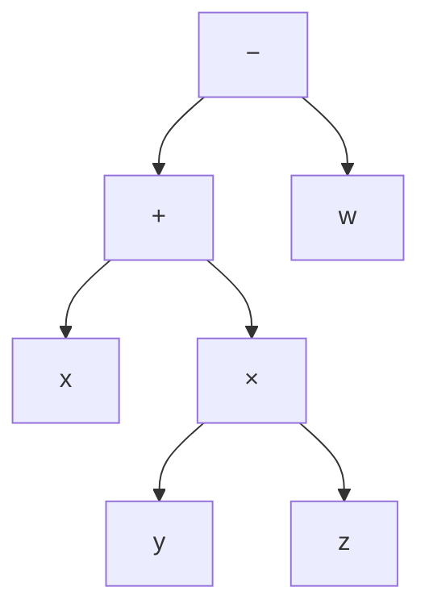

[[book-guidelines|↩ Back to guidelines]]

# Foundations of Symbolic Logic in OCaml

## Why a logic book starts with a chapter that barely mentions logic

Chapter 1 of Harrison's *Handbook* doesn't state a single inference rule. Instead it spends 24 pages doing two things: telling you *why* people thought reasoning could be mechanized at all, and then building — in real, runnable OCaml — the plumbing that every later chapter will assume already exists: a datatype for expressions, a rewriter, a parser, a printer. This is deliberate. Every chapter from here on pairs a metatheorem with working code, and code needs a representation to operate on before it can do anything interesting. Chapter 1 is where that representation, and the discipline of building it precisely, gets established.

The chapter's throughline is a distinction most working programmers use unconsciously but rarely name: the difference between a **symbol** and **what the symbol means**. Harrison insists on making that distinction explicit and permanent, because the entire enterprise of automated reasoning is a program that manipulates symbols and is only *correct* to the extent that those manipulations track the meanings. Get sloppy about the boundary and you can no longer even state what "correct" would mean.

## 1. Logical form: what makes an argument valid independent of its content

Harrison opens with a puzzle about validity. Compare:

> All men are mortal. Socrates is a man. Therefore Socrates is mortal.

against

> All positive integers are the sum of four integer squares. 15 is a positive integer. Therefore 15 is the sum of four integer squares.

These have nothing to do with each other topically, yet both feel equally airtight, because both are instances of the same schema:

$$\text{All } X \text{ are } Y \qquad a \text{ is } X \qquad \therefore\ a \text{ is } Y$$

A logically valid argument is one whose validity survives substituting *anything* for $X$, $Y$, $a$ (respecting grammatical category) — its correctness depends only on the pattern, never on what the terms happen to denote. Contrast this with:

> All Athenians are Greek. Socrates is an Athenian. Therefore Socrates is mortal.

The conclusion is true, but the argument is *not* logically valid — nothing in "Athenian" or "Greek" logically forces "mortal." Swap the conclusion for "Socrates is beardless" and the same-shaped argument fails outright, even though nothing about the premises changed. **What breaks without this distinction:** if you can't separate "true by luck" from "true by form," you can't build an automated reasoner at all — a reasoner that only checks conclusions against a fixed set of known facts isn't reasoning, it's lookup. The fix is characteristic of the whole book: make the hidden premise explicit. Add "all Greeks are mortal" and the argument becomes an instance of

$$\text{All } G \text{ are } M \qquad \text{All } A \text{ are } G \qquad s \text{ is } A \qquad \therefore\ s \text{ is } M$$

which *is* valid for any $G, M, A, s$. This is the seed of **contraposition** too: from "if it has just rained, the ground is wet" it follows that "if the ground is not wet, it has not just rained" — but *not* the converse ("if the ground is wet, it has just rained" could be false, e.g. a burst pipe). The asymmetry between a valid contrapositive and an invalid converse is a small, concrete example of a schema being valid purely by its shape, independent of what "rain" and "wet" mean — exactly the point the Socrates examples make.

Euclid's *Elements* institutionalized this into a method: assert a small number of axioms, then derive everything else by logical reasoning alone, no smuggled assumptions. Harrison notes Euclid didn't fully separate logical from non-logical content (Hilbert and Tarski later patched the gaps, e.g. Pasch's axiom), but the aspiration — form, not content, carries validity — is the one that survives into modern proof systems.

## 2. Calculemus! — Leibniz's dream and why it's the book's ancestor

Hobbes's epigraph to the book claims "REASON... is nothing but Reckoning." Gottfried Leibniz (1646–1716) took this literally and specified what a mechanized-reasoning system would need:

- a **characteristica universalis** — a universal language in which anything can be expressed;
- a **calculus ratiocinator** — a calculus of reasoning that decides the truth of assertions made in that language.

Leibniz imagined disputants, instead of arguing forever, translating their disagreement into the characteristica and simply saying *calculemus* — "let us calculate." He even built a mechanical multiplying machine in 1671, on the theory that calculation should be "relegated to anyone else" (i.e., a machine) rather than waste "excellent men['s]" time. His concrete results were thin and long forgotten, but the two-part decomposition — **a precise representation language**, plus **a mechanical procedure for deciding things in it** — is *exactly* the shape of every chapter that follows in the book: syntax first, algorithm second. It's also, not coincidentally, the shape of a compiler: a language (AST) plus a mechanical procedure (typechecking, evaluation) operating over it.

## 3. Boole's algebra: giving truth values the syntax of arithmetic

Leibniz's ambition was too broad to execute; George Boole (1815–1864) succeeded on a narrower target. Where ordinary algebra manipulates numeric quantities without caring what they denote (Boole: "the validity of the processes of analysis does not depend upon the interpretation of the symbols... but solely on their laws of combination"), Boole built an algebra whose objects are **truth-values** and whose variables stand for **propositions** — assertions that make a declaration of fact and so are meaningfully either true or false ("1 < 2", "the moon is made of cheese", but not e.g. an exclamation or a question).

Boole overlaid arithmetic notation directly onto logic:

| Boole's notation | meaning |
|---|---|
| $0$ | false |
| $1$ | true |
| $pq$ | $p$ and $q$ (conjunction) |
| $p+q$ | $p$ or $q$ (disjunction) |

Some ordinary algebraic laws survive the reinterpretation intact — commutativity ($pq = qp$), the annihilation of $0$ ($0p = 0$) — which is what makes the notation feel natural rather than arbitrary. But Boolean algebra also has laws with **no counterpart in ordinary arithmetic**: idempotence, $p^2 = p$ (i.e. $pp = p$; "$p$ and $p$" just means $p$). That single broken analogy is the tell that you're now in a genuinely different algebraic structure wearing arithmetic's clothes — a preview of the many places later chapters reuse familiar operator symbols ($\wedge, \vee, \Rightarrow$) for structures that only partially resemble the arithmetic intuition attached to $+$ and $\times$.

One more design decision that echoes for the rest of the book: English "or" is ambiguous between inclusive ("p or q or both") and exclusive ("p or q but not both") readings. Boole originally restricted $p+q$ to cases where $pq=0$ (mutually exclusive), mirroring how $x/y$ requires $y \ne 0$ in ordinary algebra. Following Jevons, the book instead adopts the *inclusive* reading throughout, unconditionally — this is the convention every truth table and every `Or` constructor in the rest of the book will assume, so it's worth fixing now rather than rediscovering it by surprise in Chapter 2.

With Boole's notation available, "logical form" gets a precise definition for the first time: two arguments have the same form exactly when both are instances of the same formal expression under a consistent substitution of variables. This retroactively cashes out the informal pattern-matching from Section 1.1.

## 4. Syntax and semantics: the discipline that makes everything else possible

This is the conceptual center of the chapter, and the one piece of vocabulary that recurs, unmarked, in literally every subsequent chapter.

**The core claim:** logic requires a strict, permanent separation between symbolic expressions and the things they denote — sharper than ordinary mathematical practice usually bothers with. When you write "12," you almost immediately stop thinking about it as *two numeral characters* and start thinking about it as *the number twelve, a member of $\mathbb{N}$*. That collapse is harmless in everyday arithmetic. It is fatal in a system built to reason *about* expressions, because equations like $x+y=y+x$ are claims about the objects the symbols denote — you can't even state such an equation, let alone check whether some manipulation of it is legitimate, if you've already forgotten there was a symbol/meaning distinction to begin with.

Harrison formalizes the connection as an **interpretation**: a map from expressions to their meanings.

$$\text{Expression} \xrightarrow{\ \text{Interpretation}\ } \text{Meaning}$$

Borrowing linguistics terminology:

- **Syntax** — the grammar: rules for which strings of symbols count as well-formed, considered in total isolation from meaning (e.g. "x + 1" is grammatical, "+1×" is not — no claim about what either denotes is needed to say so).
- **Semantics** — the systematic assignment of meanings to grammatical expressions.

**What breaks without this distinction, concretely:** a "syntactic" method — one that manipulates expressions purely by their shape, like algebraic rearrangement — becomes justifiable *at all* only once you've separately verified that the manipulation preserves the semantic value under every interpretation. Chapters 2 onward are full of syntactic transformations (simplification, normal-form conversion, Skolemization) whose entire correctness argument is "this syntactic rewrite is sound with respect to the semantics" — a sentence that presupposes syntax and semantics are two different things connected by a stated interpretation, not the same thing.

### Object language and metalanguage

A second distinction, needed because the book is about to use logic to talk *about* logic: a **metalanguage** is a language used to describe a distinct **object language**; correspondingly a **metalogic** reasons about an **object logic**. Results proved *about* a formal system (rather than *inside* it) are called **metatheorems** — not to sound grand, but to keep straight that "$\vdash p$" (a theorem derived inside the object system) and "the object system is sound" (a metatheorem, proved in the metalanguage) are claims at different levels that must not be conflated. **Metamathematics** is what you get when this metalogical reasoning is applied specifically to formalized mathematical proofs (this becomes the entire subject of Chapter 7 — Gödel's theorems are metatheorems about what a formal system *can* prove, established by reasoning in a metalanguage about that system).

Harrison flags, almost in passing, that OCaml's own ancestor ML stands for *Meta Language* — it was built at Edinburgh specifically to write theorem-proving programs, i.e. to serve as the metalanguage in which an object logic's proof search is implemented. This is not just etymology: it is the design lineage that leads, several chapters later, to the LCF approach (Chapter 6), where an *abstract type* in the metalanguage (OCaml) is the actual mechanism enforcing that only sound inferences in the object logic can be constructed.

### Abstract syntax vs. concrete syntax

The chapter's last conceptual move is the one with the most direct engineering payoff. Concrete syntax — the linear string a human types, like `x + y * z - w` — hides its own structure behind conventions (precedence, associativity) that have to be *inferred* before the expression can be manipulated. Even fully parenthesizing it, `(x + (y * z)) - w`, only fixes the ambiguity; operations like "find a subexpression" or "evaluate at particular values" still require scanning back and forth matching brackets.

A **tree** — an **abstract syntax tree (AST)** — makes the structure the *primary* representation instead of something to be re-derived on demand:



**Abstract syntax** is this tree-structured representation, reflecting grammar directly; **concrete syntax** is the linear form people actually write and read. **Parsing** translates concrete → abstract; **prettyprinting** translates abstract → concrete. Harrison is explicit that fine details of concrete syntax carry no theoretical weight — Polish notation (`- + x × y z w`), reverse Polish (`x y z × + w -`), and LISP S-expressions (`(- (+ x (× y z)) w)`) all denote the *same* tree; the book picks ordinary infix notation with precedence purely for readability, not because it's more correct.

*Rust [[Equality-Reasoning#Grounding|grounding]].* This is precisely the AST-as-primary-representation move every compiler frontend makes, and it is worth writing out because the rest of this deep-dive (and much of the reader's own compiler work) will be built the same way:

```rust
enum Expression {
    Var(String),
    Const(i64),
    Add(Box<Expression>, Box<Expression>),
    Mul(Box<Expression>, Box<Expression>),
}
```

The `Box` is required in Rust (unlike OCaml, where the compiler boxes recursive variants for you) because a recursive `enum` has an a priori unbounded size — the type-checker needs an indirection with a statically known size to close the recursion. This is the very first design fork a Rust implementation of Harrison's OCaml will hit, and it recurs for every AST type in this book (formulas, terms, proof terms).

## 5. Symbolic computation and the `expression` datatype

Harrison motivates the OCaml walkthrough by noting that early computers were seen as purely numeric devices — an idea Ada Lovelace had already debunked in 1842, observing that Babbage's engine "can arrange and combine its numerical quantities exactly as if they were letters," and could print results in algebraic rather than numeric notation if built to do so. **Symbolic computation** is manipulation of structured, symbolic data (as in computer algebra systems) rather than pure number-crunching — and theorem provers, Harrison notes, are close cousins of computer algebra systems, sharing both problems and techniques (Gröbner bases resurface in Section 5.11 doing double duty for algebra *and* automated deduction).

The book's running example — before any logic proper — is a tiny algebraic-expression language:

```ocaml
type expression =
   Var of string
 | Const of int
 | Add of expression * expression
 | Mul of expression * expression;;
```

Harrison flags an easy misreading: the `*` in `Add of expression * expression` is OCaml's tuple/product-type constructor (the domain of `Add` is a Cartesian product of two expressions) — it has nothing to do with the arithmetic multiplication the language is modeling. Building `2 × x + y` is then just applying constructors:

```ocaml
# Add(Mul(Const 2,Var "x"),Var "y");;
- : expression = Add (Mul (Const 2, Var "x"), Var "y")
```

### `simplify1` / `simplify`: rewriting as one-step pattern match plus a fixed traversal strategy

The chapter's paradigm example of **term rewriting via pattern matching**: express each simplification as a *rule* — a starting pattern and a replacement — and let OCaml's pattern-match machinery pick the first applicable rule.

```ocaml
let simplify1 expr =
  match expr with
    Add(Const(m),Const(n)) -> Const(m + n)
  | Mul(Const(m),Const(n)) -> Const(m * n)
  | Add(Const(0),x) -> x
  | Add(x,Const(0)) -> x
  | Mul(Const(0),x) -> Const(0)
  | Mul(x,Const(0)) -> Const(0)
  | Mul(Const(1),x) -> x
  | Mul(x,Const(1)) -> x
  | _ -> expr;;
```

`simplify1` performs exactly **one** rewrite step at the *root* of the expression — it doesn't recurse into subterms, and it leaves an expression unchanged (via the wildcard `_ -> expr`) if no rule's left-hand pattern matches. That single-step, root-only character is what forces the second function to exist:

```ocaml
let rec simplify expr =
  match expr with
    Add(e1,e2) -> simplify1(Add(simplify e1,simplify e2))
  | Mul(e1,e2) -> simplify1(Mul(simplify e1,simplify e2))
  | _ -> simplify1 expr;;
```

`simplify` performs a **bottom-up sweep**: recursively simplify both subexpressions all the way down first, *then* apply one root-level `simplify1` step to the (already-simplified) result. **What breaks without the bottom-up traversal:** `simplify1` alone on `Add(Mul(Const 0, Var "x"), Const 1)` doesn't touch the `Mul(Const 0, Var "x")` subterm at all — its top-level constructor is `Add`, and none of `simplify1`'s `Add` patterns fire for it, so it's returned untouched, `0 * x` and all. `simplify` fixes this by simplifying children before applying `simplify1` to the combined result, so `Mul(Const 0, Var "x")` collapses to `Const 0` on the way up, which then lets the surrounding `Add(Const 0, Const 1)` step fire too. On $(0 \times x + 1) \times 3 + 12$ this cascades all the way to `Const 15` in one call. Harrison flags, but doesn't chase, a further refinement: a genuinely top-down-aware simplifier could short-circuit `0 × E` to `0` *without descending into E at all* — a real efficiency question, but one that needs care to avoid looping, and is left as an exercise.

*Note for the reader's own project:* this is the smallest possible instance of the pattern that later becomes definitional CNF (Ch. 2), negation-normal-form conversion (Ch. 2–3), and eventually term-rewriting-system confluence and Knuth–Bendix [[Equality-Reasoning#Completion|completion]] (Ch. 4) — a rewrite *rule* is a syntactic pattern-to-pattern replacement, a rewrite *strategy* (innermost/bottom-up here) is a separate design choice layered on top of the rule set, and the two must be reasoned about independently. The distinction between "is this rule sound" (semantic) and "does this traversal strategy reach a normal form, and is that normal form unique" (a property of the strategy plus the rule set, not the rules alone) is exactly the termination/confluence question Chapter 4 formalizes with Newman's lemma. If the reader's refinement-type elaborator ever normalizes definitional-equality terms via a rewrite system for `isDefEq`, this `simplify1`/`simplify` split — one-step rule application vs. a traversal strategy that reaches a fixpoint — is the direct ancestor of that machinery, right down to the same bug class (a rule that fires at the root but never gets a chance to fire on a subterm the traversal doesn't visit).

## 6. Parsing: lexing, recursive descent, and why the grammar's recursion direction matters

Harrison separates concrete-to-abstract translation into two conventional compiler stages: **lexical analysis (scanning)**, which turns a character stream into **tokens** (words), and **parsing**, which turns a token stream into a tree.

### Lexing

Characters are classified into disjoint classes — space, punctuation, symbolic, alphanumeric — with underscore and prime folded into "alphanumeric" to support `x_1` and `f'`. A token is defined as the **longest** run of characters from one class (so `x1` lexes as one token, not `x`,`1`), except punctuation characters, which are always single-character tokens — a deliberate exception to avoid the "longest match" rule accidentally fusing `((` into one bogus token. The core primitive:

```ocaml
let rec lexwhile prop inp =
  match inp with
    c::cs when prop c -> let tok,rest = lexwhile prop cs in c^tok,rest
  | _ -> "",inp;;
```

`lexwhile` peels off the longest initial run of characters satisfying `prop`. The top-level `lex` uses it three times in sequence per token: first to skip leading whitespace, then (having classified the first surviving character) to grab the rest of that token, with punctuation getting an always-false `prop` so it stops immediately after one character:

```ocaml
let rec lex inp =
  match snd(lexwhile space inp) with
    [] -> []
  | c::cs -> let prop = if alphanumeric(c) then alphanumeric
                        else if symbolic(c) then symbolic
                        else fun c -> false in
             let toktl,rest = lexwhile prop cs in
             (c^toktl)::lex rest;;
```

### Recursive-descent parsing and the BNF-to-code correspondence

The chapter states the precedence structure of `+`/`*` as a **BNF grammar** (Backus–Naur form, named after the two computer scientists who used it to describe ALGOL's syntax):

$$
\begin{aligned}
\text{expression} &\to \text{product} \mid \text{product} + \text{expression}\\
\text{product} &\to \text{atom} \mid \text{atom} * \text{product}\\
\text{atom} &\to (\text{expression}) \mid \text{constant} \mid \text{variable}
\end{aligned}
$$

and then shows that **recursive descent parsing** — one mutually-recursive OCaml function per grammar nonterminal — is an almost mechanical transcription of the grammar itself:

```ocaml
let rec parse_expression i =
  match parse_product i with
    e1,"+"::i1 -> let e2,i2 = parse_expression i1 in Add(e1,e2),i2
  | e1,i1 -> e1,i1

and parse_product i =
  match parse_atom i with
    e1,"*"::i1 -> let e2,i2 = parse_product i1 in Mul(e1,e2),i2
  | e1,i1 -> e1,i1

and parse_atom i =
  match i with
    [] -> failwith "Expected an expression at end of input"
  | "("::i1 -> (match parse_expression i1 with
                  e2,")"::i2 -> e2,i2
                | _ -> failwith "Expected closing bracket")
  | tok::i1 -> if forall numeric (explode tok)
               then Const(int_of_string tok),i1
               else Var(tok),i1;;
```

Each function consumes a prefix of the token list and returns `(tree, remaining tokens)` — a threading pattern that's the OCaml-without-mutable-state version of an explicit parser cursor/position.

**The grammar's recursion direction is not cosmetic — it fixes associativity.** The grammar above is *right-recursive* (`expression → product + expression`), and correspondingly `parse_expression` recurses on the *right* operand after seeing `+`. This produces right-associative trees: `x + y + z` parses as `x + (y + z)`. Had the grammar instead been written left-recursively,

$$\text{expression} \to \text{product} \mid \text{expression} + \text{product}$$

a direct recursive-descent transcription would call `parse_expression` on itself as the very first action, before consuming any input — infinite non-terminating recursion, not merely a wrong parse. (The book notes this is fixable — see `parse_left_infix` in Appendix 3 — but the naive transcription genuinely loops.) For an associative operator like `+`, left- vs. right-associative parses at least *denote* the same value; for `-`, they don't (`x - y - z` almost always means $(x-y)-z$, not $x-(y-z)$), so this is a real correctness decision, not just an implementation convenience. **This is the standard argument for why hand-written top-down parsers for left-associative operators use an explicit iterative "parse one atom, then loop consuming trailing operators" form instead of naive left recursion** — precedence climbing / Pratt parsing is the general solution, and this chapter's right-recursive-grammar dodge is the special case that works when right-associativity happens to be what you want anyway.

*Rust grounding.* The same three-function shape ports directly, with the token stream typically modeled as a slice-with-cursor or a peekable iterator rather than a list threaded by value:

```rust
fn parse_expression(tokens: &mut Peekable<Tokens>) -> Expression {
    let e1 = parse_product(tokens);
    if tokens.peek() == Some(&"+") {
        tokens.next();
        let e2 = parse_expression(tokens); // right-recursive: right-associative
        Expression::Add(Box::new(e1), Box::new(e2))
    } else {
        e1
    }
}
```

This exact structure — one function per grammar production, chained by precedence level — is what the reader will reuse (with a lot more nonterminals) for parsing refinement-type annotations, Hoare-triple contracts, and constraint-language expressions in their own compiler frontend.

## 7. Prettyprinting: precedence as an extra function argument

The reverse direction — abstract syntax back to a human-readable string — starts from a naive, always-fully-parenthesized printer:

```ocaml
let rec string_of_exp e =
  match e with
    Var s -> s
  | Const n -> string_of_int n
  | Add(e1,e2) -> "("^(string_of_exp e1)^" + "^(string_of_exp e2)^")"
  | Mul(e1,e2) -> "("^(string_of_exp e1)^" * "^(string_of_exp e2)^")";;
```

correct (brackets are needed in general — `6*(x+y)` really is different from `6*x+y`), but ugly (`x + 3*y` prints as `(x + (3 * y))`). The fix is to thread a **precedence-level argument** through the recursion, representing "what precedence context is this subexpression sitting inside" — brackets go around a subexpression only when its own top-level operator binds *more loosely* than the surrounding context demands:

```ocaml
let rec string_of_exp pr e =
  match e with
    Var s -> s
  | Const n -> string_of_int n
  | Add(e1,e2) ->
        let s = (string_of_exp 3 e1)^" + "^(string_of_exp 2 e2) in
        if 2 < pr then "("^s^")" else s
  | Mul(e1,e2) ->
        let s = (string_of_exp 5 e1)^" * "^(string_of_exp 4 e2) in
        if 4 < pr then "("^s^")" else s;;
```

Addition is assigned precedence 2, multiplication 4 (leaving room to slot in other operators between and around them later), and the outermost call starts at precedence 0 so nothing at the top level ever gets superfluous parentheses. The asymmetric arguments to the two recursive calls — `string_of_exp 3 e1` vs. `string_of_exp 2 e2` for `Add` — deliberately give the *left* operand a stricter (higher) precedence bound than the right, which is what forces parenthesization when *left*-associating instances of the same operator are nested, matching the right-associative parse tree the parser actually produces. It's the printer's mirror image of the parser's associativity decision from Section 1.7 — get them out of sync and `parse(print(e)) = e` (a property Harrison poses as an exercise) silently fails.

## Where this leads

Nothing in Chapter 1 is *logic* yet — no truth tables, no inference rules, no notion of validity beyond the informal schema-matching of Section 1.1. What it delivers instead is the toolkit every later chapter assumes is already in hand:

- **AST + parser + printer** for `expression` here becomes AST + parser + printer for propositional formulas in Chapter 2 (`False`/`True`/`Atom`/`Not`/`And`/`Or`/`Imp`/`Iff`), then for first-order terms and formulas in Chapter 3 — same three-part structure, strictly larger grammar.
- **`simplify1`/`simplify`'s** one-step-rule-plus-traversal-strategy split reappears, generalized, as `psimplify` (propositional simplification) and negation-normal-form conversion in Chapter 2, and becomes the formal subject of Chapter 4 (rewriting, confluence, Knuth–Bendix completion) — the informal "does this converge to a unique normal form" question this chapter never asks gets answered rigorously there.
- **Syntax vs. semantics**, and **object language vs. metalanguage**, are not local jargon — they're the vocabulary Chapter 6 needs to state what the LCF approach actually buys you (a metalanguage-level abstract type enforcing object-language soundness), and what Chapter 7 needs to state Tarski's undefinability theorem and Gödel's incompleteness theorems, both of which are precisely claims about what an object language can express about itself from inside versus what its metalanguage can prove about it.

For the reader's own compiler project, this chapter is close to a checklist: an `enum`-based recursive AST (with `Box` where OCaml gets boxing for free), a rewrite-rule-plus-fixpoint-traversal simplifier, a recursive-descent parser whose associativity is a direct consequence of which side of each grammar production recurses, and a precedence-threading printer that must stay in lockstep with the parser's own precedence table. Every one of these mechanisms recurs, essentially unchanged in spirit, when the grammar being parsed is refinement-type syntax or Hoare-triple contracts instead of toy arithmetic — this chapter is where to debug the mechanics cheaply, before the grammar (and the semantics riding on it) gets complicated.
