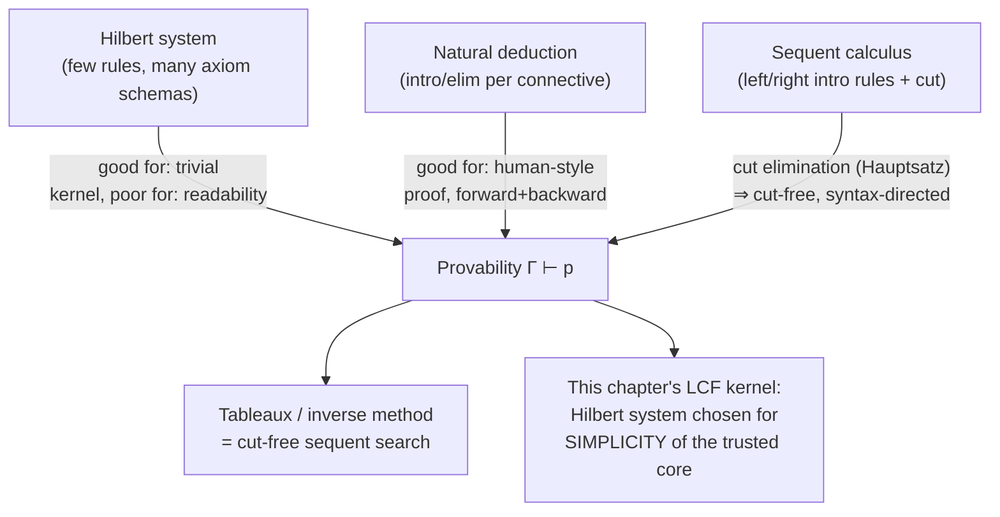
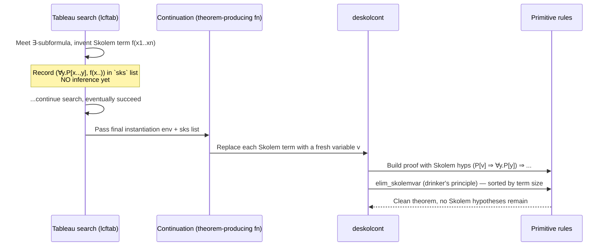

# Interactive Theorem Proving and the LCF Approach

[[book-guidelines|↩ Back to guidelines]]

## Why the book turns away from full automation

Every prior chapter chased the same goal: given a formula, decide (or at least semi-decide) whether it's valid, and do it without a human in the loop. That project has real limits. Harrison opens Chapter 6 by simply admitting it: "the scope of fully automatic methods, subject to any remotely realistic limitations on computing power, covers only a very small part of present-day mathematics." Real mathematical proofs are long, structured, and rely on a human's sense of *which* lemma to reach for next — something search procedures without domain guidance choke on combinatorially.

The historical response split into two camps. **Human-oriented** provers (Newell and Simon's Logic Theorist, Gelerntner's geometry prover, Bledsoe's heuristics, Boyer–Moore's NQTHM) tried to encode how mathematicians actually think — analogy, generalization, diagram manipulation. This mostly lost to systematic algorithmic methods on raw effectiveness (Wang's dry remark about Newell–Shore–Simon "failing to kill the chicken with their butcher's knife" is Harrison quoting the historical scoreboard). The alternative response, and the one this chapter builds, doesn't try to automate mathematical *taste*. It builds a **proof assistant**: a system that lets a human drive the high-level strategy while the machine (a) checks every step for correctness with total rigor and (b) automates the boring, mechanical parts.

That reframes the engineering problem completely. You're no longer asking "can I search this space fast enough?" — you're asking "how do I guarantee that whatever this program outputs as a `theorem` really is one, even though the program is arbitrarily complex, user-extensible, and probably has bugs somewhere?" That question, and Harrison's answer to it, is the real subject of this chapter, and it is — quite explicitly — the architectural blueprint your compiler's trusted core needs to answer the same question about its own type checker.

**What breaks without this reframing.** A prover that tries to be both fully automatic *and* fully general for real mathematics doesn't degrade gracefully — it just doesn't terminate in useful time on anything but toy problems. Chapters 2–5 built genuinely powerful automation, but every one of those procedures is a *decision procedure for a fragment*. Chapter 6's opening move is to stop pretending a single procedure will scale to "prove Fermat's Last Theorem" and instead build infrastructure where a human supplies structure and the machine supplies rigor.

---

## Proof checkers and the SAM family: automation with weak guarantees

Before LCF, the leading approach to human-guided proof was the **proof checker**: a system that takes a proof (or proof sketch) supplied by a human and checks it, rather than searching for one. AUTOMATH and Mizar are the two influential examples. Mizar in particular formalizes the idea of an "obvious" inference — a fixed, precisely defined class of steps (roughly: propositional consequence plus a few built-in facts) that the checker accepts without further justification, everything else must be spelled out.

This is a real design choice with a real cost. Harrison is candid about it: Mizar's notion of "obvious" often diverges sharply from a human mathematician's. Once you've established that some operator `⊗` is associative and commutative, a human considers `w ⊗ (x ⊗ (y ⊗ z)) = (x ⊗ z) ⊗ (w ⊗ y)` obviously true — but deriving it from the axioms mechanically takes several explicit steps, so Mizar rejects it as not-obvious. And crucially, the checker itself isn't user-extensible: you can't teach Mizar new "obvious" facts without touching its source. This observation — that a fixed built-in notion of "obvious" will always be either too weak (tedious) or, if loosened carelessly, unsound — is exactly the argument for making the *automation itself* programmable, safely. That's the gap LCF closes.

---

## The LCF approach: soundness by construction

The Edinburgh LCF project (Milner et al., "Logic of Computable Functions," 1979) is where the idea crystallizes into two design principles, stated by Harrison almost as a manifesto:

1. **The system is implemented inside an interactive, general-purpose programming language**, and the user interacts at that language's top level. So any proof procedure a user can imagine programming, they can add — there is no fixed menu of tactics.
2. **A special abstract type `thm` of proven theorems is distinguished, whose only constructors correspond to approved primitive inference rules.** Anything of type `thm` *by construction* has been proved, not merely asserted.

Point 2 is the whole trick, and it is worth sitting with why it works. In a language with a real module/abstract-type discipline, if `thm` is exported as an opaque type with a small, fixed set of producing functions (the primitive rules), then no matter how much code a user writes on top — however baroque, however buggy — the *only* way to ever get your hands on a value of type `thm` is to have gone through one of those primitive constructors, directly or via a chain of derived-rule calls that bottom out in them. A "derived rule" is just an ordinary function that happens to internally build a `thm` by calling other functions that (recursively) call primitive rules. Bugs in a derived rule can produce the *wrong* theorem — Harrison flags this candidly in a footnote — but they cannot produce something of type `thm` that wasn't legitimately derivable, because the type system simply won't let non-primitive code fabricate a `thm` out of nothing.

This is, verbatim, the "trusted kernel" or "proof-producing architecture" pattern named in your project's own required-connections list, and Chapter 6 is the single most literal worked example of it in the entire book. It is also, not by coincidence, exactly how a modern dependently-typed kernel is structured.

**[[Equality-Reasoning#Grounding|Grounding]] — Rust.** The pattern translates directly into Rust's module-privacy discipline: keep the constructor of a `Thm` type private to a module, and expose only functions that build one *from* other `Thm`s (plus axiom schema functions taking raw data).

```rust
mod kernel {
    #[derive(Clone)]
    pub struct Thm(Formula); // private field — no other module can construct one directly

    impl Thm {
        pub fn concl(&self) -> &Formula { &self.0 }

        // The ONLY ways to produce a Thm from outside this module:
        pub fn modus_ponens(pq: &Thm, p: &Thm) -> Result<Thm, &'static str> {
            match pq.0.clone() {
                Formula::Imp(pp, q) if *pp == p.0 => Ok(Thm(*q)),
                _ => Err("modus_ponens: not applicable"),
            }
        }
        pub fn gen(x: &str, p: &Thm) -> Thm {
            Thm(Formula::Forall(x.to_string(), Box::new(p.0.clone())))
        }
        pub fn axiom_addimp(p: Formula, q: Formula) -> Thm {
            Thm(Formula::Imp(Box::new(p.clone()),
                              Box::new(Formula::Imp(Box::new(q), Box::new(p)))))
        }
        // ... one function per axiom schema, all producing Thm, none consuming
        // an arbitrary Formula and returning a Thm "for free."
    }
}
```

Every derived rule the rest of the compiler ever writes (a `simplify_tac`, an `imp_trans`, a whole tactic combinator library) is just ordinary Rust calling these functions. No matter how elaborate that code gets, `Thm` values it produces are sound by the type system's construction — the compiler literally cannot typecheck code that fabricates a `Thm` any other way. This is your compiler's answer to "how do I let users (or my own elaborator) write arbitrarily rich proof automation without re-auditing my trusted computing base every time."

**Grounding — Lean.** This is where the correspondence stops being an analogy and becomes closer to identity. Lean's kernel *is* an LCF-style abstract type: `Expr` for terms, and internally a small set of primitive rules for `Expr` well-formedness (the type-checking judgment `Γ ⊢ e : t`, reduction, `Eq.refl`, inductive-type recursor application) constitute the only ways the kernel will certify a term as well-typed. Everything else in Lean — the entire elaborator, `simp`, `omega`, `ring`, tactic combinators, metaprogramming via `MetaM` — runs *outside* the kernel and produces terms (proof objects) that the kernel then independently re-checks against its tiny, fixed rule set. A bug in `simp` can make it fail to close a goal, or close the wrong goal, but it cannot make the kernel accept an ill-typed term, for the same reason a bug in a derived LCF rule cannot fabricate a false `thm`. This is precisely the "de Bruijn criterion" architecture, and Chapter 6 is Harrison independently deriving the same shape of solution that Lean's own kernel/elaborator split embodies. When you design your compiler's trusted core, this chapter — not a Lean source-reading exercise — is the primary source text for *why* that split is the right shape, argued from first principles rather than from Lean's specific implementation choices.

**What breaks without an abstract type.** If `thm` were instead, say, a plain `Formula` value (or worse, just a boolean "we believe this holds" flag) with no privacy discipline, any function — including one with a typo, an off-by-one in a substitution, or an outright malicious extension — could return a `Formula` claiming to be proved. You would then be back to trusting the *entire* codebase, including every future extension anyone writes, rather than trusting only the primitive kernel plus the host language's type system. This is exactly the situation with earlier "prove it any way, we'll believe the output" theorem provers, and it is exactly the situation a naive compiler backend is in if its type checker is not cleanly separated from the rest of the pipeline: a bug anywhere becomes a soundness bug everywhere.

---

## Proof systems: Hilbert, natural deduction, sequent calculus

Before implementing anything, Harrison surveys the three classical shapes a formal proof system for first-order logic can take. All three define the same relation of **provability**, $\Gamma \vdash p$ ("$p$ is provable from assumptions $\Gamma$"), via an inductively specified set of permissible proof steps — but they carve up "permissible step" very differently.

- **Hilbert (Frege) systems.** A small number of inference rules (often just one: modus ponens) plus a large supply of logical **axiom schemas** — formula templates, every instance of which is asserted outright as an axiom. Individual steps are trivial to check, but proofs are long and unintuitive because there's no rule for temporarily reasoning "under an assumption."
- **Natural deduction** (Gentzen 1935, Prawitz). One **introduction** and one **elimination** rule per connective — e.g. implication-introduction lets you discharge a hypothesis $p$ used to derive $q$ and conclude $\Gamma \to p \Rightarrow q$; implication-elimination is just modus ponens read as a sequent rule. This tracks how people actually reason (assume something, derive consequences, discharge the assumption), at the cost of some rules (or-elimination in particular) getting syntactically messy.
- **Sequent calculus** (also Gentzen 1935). Only introduction rules, but a **left** (assumption-side) and **right** (conclusion-side) version of each. For example the left-introduction rule for $\Rightarrow$:
$$\frac{\Gamma \to p \qquad \Gamma \cup \{q\} \to r}{\Gamma \cup \{p \Rightarrow q\} \to r}$$

A sequent $\Gamma \to p$ means "if all formulas in $\Gamma$ hold, then $p$ holds" — synonymous, for finite $\Gamma = \{p_1,\ldots,p_n\}$, with $p_1 \land \cdots \land p_n \Rightarrow p$. Harrison deliberately writes $\to$ rather than the more common $\vdash$ here, to keep this provability relation visually distinct from semantic entailment $\models$, and to flag a subtlety: quantification over valuations happens *per formula* in $\models$, not once over the whole sequent — so $P(x) \to P(y)$ is not derivable (rightly), even though $P(x) \models P(y)$ holds under the free-variable-as-implicitly-universal reading used for entailment (Section 3.3). This distinction between "the sequent as syntax" and "the semantic entailment it's meant to mirror" is the same discipline your elaborator needs between a *judgment* ($\Gamma \vdash e : \tau$, a syntactic derivability claim) and the *semantic* statement it's supposed to correspond to.

### The cut rule and the Hauptsatz

Sequent calculus becomes practically usable once you add the **cut rule**:
$$\frac{\Gamma \cup \{p\} \to q \qquad \Gamma \cup \{q\} \to r}{\Gamma \cup \{p\} \to r}$$

This just says "if you can get from $p$ to an intermediate fact $q$, and from $q$ to $r$, you can go straight from $p$ to $r$" — it's exactly how ordinary mathematics chains lemmas: prove an intermediate result once, then reuse it. Without cut, that habit is disallowed at the level of the formal system, and it takes on the order of many more steps to reprove the same content wherever it's needed.

Gentzen's **Hauptsatz** (major theorem) — cut elimination — proves something at first surprising: cut is *inessential*. Any proof using cut can be mechanically transformed into a cut-free proof of the same sequent, at the cost of a potentially unfeasible blowup in size. Why does anyone care, given that blowup? Because a cut-free proof has a powerful structural property: every other rule only ever *introduces* connectives that appear in the eventual result — nothing extraneous ever gets built and later discarded. This makes cut-free proof search **syntax-directed**: at each step, the shape of the goal formula tells you exactly which rule could apply, with no guessing of intermediate lemmas required. Semantic tableaux (Section 3.10) are, in this light, a reformulation of cut-free sequent calculus; the *inverse method* (Maslov) searches the same cut-free space bottom-up instead of top-down.

This is the theoretical justification, hiding in plain sight behind every automated prover in Chapters 2–5: **automation is possible precisely because those systems restrict themselves to cut-free search.** The price paid for that syntax-directedness is exactly the same price an elaborator pays when it insists on **syntax-directed bidirectional typing rules** (each rule triggered by the shape of the term or the shape of the expected type, no unbounded guessing of an intermediate type) instead of an undirected typing relation that would need a human — or an oracle — to supply the missing lemma at each step. Cut elimination is the proof-theoretic ancestor of "keep your typing rules syntax-directed so type checking is decidable/searchable."



**What breaks without cut elimination's insight.** If proof search had to consider arbitrary cut formulas — any lemma, anywhere, as a candidate intermediate step — the search space would be genuinely unbounded (you'd need to guess which of infinitely many possible lemmas to introduce). Cut elimination is what licenses restricting search to cut-free derivations without losing completeness, which is what makes automated first-order proof search a well-defined combinatorial problem instead of an open-ended creative one.

---

## Harrison's chosen system: a minimal Hilbert core

Given three options, Harrison picks a **Hilbert system** for the LCF kernel — deliberately, for the same reason Mizar and every proof checker before it made hard tradeoffs: *simplicity of the trusted core trumps convenience of use*, because the kernel is the one piece of code you cannot afford to get wrong, and everything convenient can be layered on top as derived rules that inherit the kernel's soundness for free.

The language is stripped to just $\{\bot, \Rightarrow, \forall\}$ (plus equality), with the other connectives $\{\neg, \land, \lor, \Leftrightarrow, \exists\}$ introduced only as *definitions* via biconditional axioms — not as primitives. There are exactly two **proper inference rules** (rules that take theorems and produce new theorems):

$$\text{Modus ponens: } \frac{p \Rightarrow q \qquad p}{q} \qquad\qquad \text{Generalization: } \frac{p}{\forall x.\, p}$$

and a fixed list of **axiom schemas** (each standing for infinitely many concrete instances, one per choice of $p, q, r, s_i, t_i, x$):

$$p \Rightarrow (q \Rightarrow p)$$
$$(p \Rightarrow q \Rightarrow r) \Rightarrow (p \Rightarrow q) \Rightarrow (p \Rightarrow r)$$
$$((p \Rightarrow \bot) \Rightarrow \bot) \Rightarrow p \qquad \text{(classical double-negation elimination)}$$
$$(\forall x.\, p \Rightarrow q) \Rightarrow (\forall x.\, p) \Rightarrow (\forall x.\, q)$$
$$p \Rightarrow \forall x.\, p \quad [x \notin \mathrm{FV}(p)]$$
$$\exists x.\, x = t \quad [x \notin \mathrm{FVT}(t)]$$
$$t = t$$
$$s_1=t_1 \Rightarrow \cdots \Rightarrow s_n=t_n \Rightarrow f(s_1,\ldots,s_n)=f(t_1,\ldots,t_n) \qquad \text{(function congruence)}$$
$$s_1=t_1 \Rightarrow \cdots \Rightarrow s_n=t_n \Rightarrow P(s_1,\ldots,s_n) \Rightarrow P(t_1,\ldots,t_n) \qquad \text{(predicate congruence)}$$

plus definitional axioms tying $\Leftrightarrow, \neg, \land, \lor, \exists$ back to $\{\bot,\Rightarrow,\forall\}$, e.g. $\neg p \Leftrightarrow (p \Rightarrow \bot)$, $p \land q \Leftrightarrow (p \Rightarrow q \Rightarrow \bot) \Rightarrow \bot$.

**Theorem 6.1 (soundness).** $\vdash p \implies \models p$. The proof is entirely mechanical: check every axiom schema instance is logically valid, check both proper rules preserve validity, and conclude by rule induction. This is the metatheorem that makes the abstract-type discipline actually meaningful — the type system guarantees *only what's derivable from these rules gets produced*; Theorem 6.1 is the separate, one-time argument that *everything derivable from these rules is actually true*. Together they give you: everything the kernel emits as `thm` is a genuinely valid first-order formula.

### Why substitution is derived, not primitive

Here is the single most instructive design decision in the whole chapter, and the direct precedent for how your elaborator's unifier should be scoped. Nearly every textbook first-order proof system takes as *primitive* a specialization rule: from $\vdash \forall x.\, P[x]$, directly conclude $\vdash P[t]$ for any term $t$. But as Chapter 3 (Section 3.4) already established, a *correct* implementation of capture-avoiding substitution is not trivial — it needs alpha-conversion to dodge variable capture, and getting that wrong is a classic source of unsoundness bugs in real systems.

Harrison's answer: **don't put substitution in the trusted core at all.** Instead, following an idea due to Tarski, derive specialization from the more primitive equality/congruence machinery:

$$\forall x.\, P[x] \;\Rightarrow\; \forall x.\, (x = t \Rightarrow P[t]) \;\Rightarrow\; (\exists x.\, x=t) \Rightarrow P[t] \;\Rightarrow\; P[t]$$

using $x = t \Rightarrow P[x] \Rightarrow P[t]$ (built from the congruence axioms) and the existence axiom $\exists x.\,x=t$. The actual derivation (`ispec`/`subspec`/`isubst` in the OCaml, Section 6.7) is a genuinely delicate piece of code — it has to alpha-convert bound variables to avoid capture exactly where naive substitution would break, using a recursive congruence rule `isubst` that handles the quantifier case by picking a fresh variable `z` and going through it. But *all of that complexity now lives in ordinary, non-trusted, derived-rule code*. If `ispec` has a bug, it produces the wrong theorem (or fails), but — because it can only ever call primitive constructors — it cannot produce an *unsound* one. Complexity got moved out of the trusted computing base and into code whose correctness the type system enforces for free.

This is precisely the design principle your compiler's elaborator needs for substitution during metavariable instantiation and for capture-avoiding renaming during unification: **push substitution's correctness burden onto derived code checked by a small trusted core (alpha-equivalence, congruence, or a de Bruijn representation), rather than trusting an ad hoc substitution routine as a load-bearing primitive.** Lean's kernel takes an analogous stance — its own substitution and reduction machinery is part of the trusted core, but it is kept as small and structurally simple as possible (de Bruijn indices specifically to make substitution's correctness easy to state and check), for exactly this reason.

**Grounding — Lean.** `ispec`/`isubst`'s job — deriving $\forall x. P[x] \Rightarrow P[t]$ soundly, handling variable capture — is exactly what Lean's kernel does every time it beta-reduces `(fun x => P x) t` or instantiates a `∀`-quantified hypothesis; Lean sidesteps the alpha-conversion delicacy entirely by using de Bruijn indices internally, so "which variable is bound to what" is answered by position rather than by name, and capture becomes structurally impossible rather than something you have to prove doesn't happen. Harrison's `isubst` recursion, picking a fresh `z` when quantifier variables clash, is doing by hand exactly what de Bruijn representation buys for free — a good illustration of why kernel implementers gravitate toward index-based binding.

---

## Building up propositional and first-order automation as derived rules

Section 6.5 walks through building a *library* of derived rules purely by composing `modusponens` and `gen` — starting from something as simple as $\vdash p \Rightarrow p$ (which, worked out explicitly in the Hilbert system, takes five steps and is genuinely non-obvious to construct by hand) up through transitivity, contraposition, and properties of $\land$/$\lor$/$\Leftrightarrow$ expressed via $\{\Rightarrow,\bot\}$. None of this is conceptually deep — it's exactly the kind of "tedious but mechanical" work a trusted-core design pushes out of the kernel and into ordinary application code — but it establishes the pattern: *every* subsequent capability (propositional tautology-proving, first-order proof search, tactics) is, all the way down, nothing but compositions of `modusponens` and `gen`.

### `lcfptab`: tableaux reconstructed as literal inference

Section 6.6 is where this pays off dramatically. Instead of the Chapter 3 tableau procedure, which just *asserts* "these formulas are contradictory" by manipulating lists, `lcfptab` performs the *same* recursive case analysis but at every step **actually derives** the corresponding theorem:
$$p_1 \Rightarrow \cdots \Rightarrow p_n \Rightarrow l_1 \Rightarrow \cdots \Rightarrow l_m \Rightarrow \bot$$
The case structure is a direct transliteration of tableau case-splitting (conjunctive splitting via `imp_false_rule`, disjunctive splitting via `imp_true_rule`, complementary-literal detection via `imp_contr`) — but every step is now inference-justified rather than merely trusted. `lcftaut` then proves any propositional tautology $p$ by refuting $p \Rightarrow \bot$ (i.e. deriving $(p\Rightarrow\bot)\Rightarrow\bot$) and applying double-negation elimination. Harrison is candid about the cost: this is noticeably slower than the plain Chapter 2/3 tableau code — "a constant factor of 500" is mentioned later as a plausible real-world overhead — but every output theorem now carries the kernel's soundness guarantee, mechanically, rather than by trusting the tableau implementation's correctness.

This is the general LCF pattern for turning *any* existing algorithm into a proof-*producing* one: keep the same control-flow skeleton, but replace "assert X" with "derive a theorem stating X," using the growing library of derived rules as building blocks.

### `lcffol`: first-order tableaux by inference, and the Skolem-hypothesis trick

Section 6.8 lifts the same idea to full first-order proof search (Section 3.10's tableau procedure), and runs into a genuinely hard problem worth understanding carefully, because it's a beautiful example of "soundness constrains the *shape* of an algorithm, not just its correctness."

**The instantiation-timing problem.** In ordinary tableau search, when you meet a universally quantified formula $\forall x.\,P[x]$ at the head of the problem, you replace $x$ by a fresh variable $y$ and continue; only much later, when a refutation is actually found, do you discover the concrete instantiating term $t$. If you tried to eagerly produce the "obvious" intermediate theorem $P[y] \Rightarrow \cdots \Rightarrow \bot$ using the fresh variable, that formula generally isn't even *true* — you don't yet know what to instantiate $y$ to. Harrison's solution: instead of passing *theorems* through the search's continuation-passing control flow, pass **functions that produce theorems**, parameterized by the eventual instantiation (discovered only at the point of success). No inference actually happens until a refutation path is found — search failures cost nothing in inference overhead, only successful paths pay for building the proof term. This "delay all inference until success, then replay" strategy is the second of the two general techniques Harrison later names for making LCF-style provers fast enough to be useful (the other being directly mimicking an existing algorithm's control flow step-for-step, as `lcfptab` does).

**The Skolemization problem, and why it can't be "undone" by direct inference.** Existentially quantified subformulas (dually, $(\forall y.\,P[x_1,\ldots,x_n,y]) \Rightarrow \bot$ in the negation-normal setting used here) get Skolemized dynamically during search, replacing the quantifier with a fresh Skolem term $f(x_1,\ldots,x_n)$. But Skolemization is only an **equisatisfiability**-preserving transformation, not a validity-preserving one — and crucially, the implication runs the *wrong way* for what proof reconstruction needs:
$$P[t_1,\ldots,t_n,f(t_1,\ldots,t_n)] \;\Rightarrow\; \forall y.\, P[t_1,\ldots,t_n,y]$$
is **not** a logical validity (it can't be — that's exactly what makes Skolemization only equisatisfiable, not equivalent, per Section 3.6). So having built a proof using the Skolemized formula, there is no direct inference step that gets you back to a proof of the un-Skolemized original.

Harrison's trick: don't try to eliminate the Skolem assumption by inference — **retain it, honestly, as an extra hypothesis**, and eliminate it afterward by a separate, valid piece of reasoning. The final theorem coming out of proof search isn't $p_1 \Rightarrow \cdots \Rightarrow \bot$; it's
$$p_1 \Rightarrow \cdots \Rightarrow p_n \Rightarrow l_1 \Rightarrow \cdots \Rightarrow l_m \Rightarrow s_1 \Rightarrow \cdots \Rightarrow s_k \Rightarrow \bot$$
where each $s_i$ is exactly one of these (false-looking-but-usable) Skolem-hypothesis implications. Then, having systematically replaced each ground Skolem *term* $f(t_1,\ldots,t_n)$ throughout the proof by a fresh *variable* $v$ (legal because the proof never actually decomposed the Skolem term — it was used "as is"), each hypothesis takes the shape $(P[v] \Rightarrow \forall y.\,P[y]) \Rightarrow q$ with $v$ otherwise unconstrained in $q$. This is where the **drinker's principle** — "in any nonempty domain, there is some individual $v$ such that if $v$ has property $P$, then everyone does" (Section 3.3) — earns its keep: it is a genuine, provable first-order validity, and `elim_skolemvar` derives exactly this instance of it to discharge the hypothesis by pure inference, no Skolem functions required.

There's one more piece of care needed: Skolem hypotheses can nest (one Skolem term can appear inside another's defining instance), so `elim_skolemvar` has to be applied in an order — sorted by descending term size — that guarantees no variable being eliminated still occurs free in a later hypothesis. Get the order wrong and the elimination step's side condition fails.



The overall wrapper `lcffol` negates the universal closure of the goal, calls `lcfrefute` under iterative deepening (`deepen`, as in Chapter 3), removes the Skolem hypotheses via `deskolcont`, applies double-negation elimination, and re-specializes over the free variables of the original formula.

**Theorem 6.2 (completeness, no equality)** then follows almost for free: since `lcffol` faithfully simulates the (already known complete, Section 3.10) tableau procedure step-for-step, and every step is inference-justified, anything valid gets found and *proved* by the kernel's own rules. **Theorem 6.3** extends this to reasoning with hypotheses ($\Gamma \vdash p \iff \Gamma \models p$, via compactness reducing an infinite $\Gamma$ to a finite witnessing subset), and **Corollary 6.4** — the deduction theorem, $\Gamma \vdash \forall(p) \Rightarrow q \iff \Gamma \cup \{p\} \vdash q$ — is the metatheoretic fact that licenses natural-deduction-style "assume $p$, derive $q$, discharge to $p \Rightarrow q$" reasoning even though the underlying kernel is Hilbert-style and has no primitive rule for it. This is the metatheorem that makes Section 6.9's tactic framework legitimate.

**What breaks without the retain-then-eliminate trick.** Without it, you'd face a hard choice: either build Skolem elimination directly into the trusted kernel as a new primitive rule (defeating the whole point — now you're trusting a nontrivial, Skolemization-specific piece of code inside the TCB), or give up on ever reconstructing genuine first-order proofs involving existentials by inference at all, and fall back to Section 4's fallback path of "throw everything at a general prover and hope." The Skolem-hypothesis trick is what lets Chapter 3's *entire* proof-search machinery get reused, unmodified in spirit, while staying entirely outside the trusted core.

---

## Tactics, tacticals, and the goal/subgoal framework

Sections 6.1–6.8 give you a kernel and enough derived automation to prove first-order validities from scratch. But composing raw inference — even automated inference — is awkward for structured, assumption-heavy human-style reasoning, because Hilbert systems have no primitive way to say "assume $p$ locally, derive $q$, discharge." Section 6.9 fixes this by working **backward**: instead of building up a theorem from axioms, start from the desired conclusion as a **goal** and refine it into simpler subgoals until each is directly provable.

A **goal** is a target conclusion $q$ plus a list of labelled hypotheses $p_1,\ldots,p_n$ — logically corresponding to the theorem $p_1 \land \cdots \land p_n \Rightarrow q$ you're ultimately trying to produce. The `goals` type bundles a *list* of goals (subgoals still open) together with a **justification function**: given theorems solving every subgoal, in order, it produces the theorem solving the original goal.

```
type goals = Goals of ((string * fol formula) list * fol formula) list
                       * (thm list -> thm)
```

A **tactic** is simply a function `goals -> goals`: it rewrites the goal list (typically the first goal) into new, hopefully-easier subgoals, and correspondingly updates the justification function so that theorems solving the *new* subgoals can be assembled into a theorem solving the *old* one. Each tactic corresponds to a natural deduction rule read **in reverse**:

| Natural deduction rule | Tactic | Effect |
|---|---|---|
| $\land$-introduction | `conj_intro_tac` | splits goal $p \land q$ into two subgoals $p$, $q$ |
| $\forall$-introduction | `forall_intro_tac y` | reduces $\forall x.\,P[x]$ to $P[y]$ for fresh $y$ |
| $\exists$-introduction | `exists_intro_tac t` | reduces $\exists x.\,P[x]$ to $P[t]$ for a supplied witness $t$ |
| $\Rightarrow$-introduction | `imp_intro_tac` | reduces $p \Rightarrow q$ to goal $q$ with $p$ added as a hypothesis |
| $\exists$-elimination | `exists_elim_tac` | given $\exists x.P[x]$ provable, reduces goal to using $P[x]$ as a fresh hypothesis |
| $\lor$-elimination | `disj_elim_tac` | given $p \lor q$ provable, splits into two subgoals, one per disjunct as hypothesis |

The proof terminates when the subgoal list is empty; `extract_thm` then invokes the accumulated justification function on the empty list to yield the final theorem, and (because nothing guarantees a badly-written tactic's justification function actually returns the right theorem) `set_goal`/`extract_thm` double-check the returned theorem's conclusion matches what was asked for. **Tacticals** are then just combinators over tactics — sequencing, "repeat until it stops applying," "try this, else that" — playing exactly the role that imperative control-flow constructs play over statements. This whole apparatus, notice, is built *entirely* on top of the primitive kernel: a tactic never needs privileged access to anything, it just calls derived rules (ultimately bottoming out in `modusponens`/`gen`) to build the theorems its justification function needs.

**Grounding — Rust.** The `goals -> goals` shape maps directly onto a `Tactic` trait over an explicit proof-state type — this is close to how a Rust-hosted tactic framework for your compiler's own verifier would be structured, with tacticals as combinators (`.then(...)`, `.repeat()`, `.or_else(...)`) over `Box<dyn Tactic>` or closures.

```rust
type Justification = Box<dyn Fn(Vec<Thm>) -> Thm>;
struct Goals { subgoals: Vec<(Vec<(String, Formula)>, Formula)>, justify: Justification }
type Tactic = Box<dyn Fn(Goals) -> Goals>;

fn then_(t1: Tactic, t2: Tactic) -> Tactic {
    Box::new(move |g| t2(t1(g)))
}
```

### Procedural vs. declarative: same underlying machinery, different discipline

A raw sequence of tactics — `[imp_intro_tac "ant"; conj_intro_tac; auto_tac by ["ant"]; auto_tac by ["ant"]]` — is what Harrison calls a **procedural** proof. It's imperative: a script of state-transforming instructions, readable only by mentally (or actually) replaying it step by step, exactly like reconstructing a chess position from a list of moves. This is efficient to write but genuinely opaque to read cold.

The alternative, inspired directly by Mizar, is **declarative** proof: instead of saying *how* to transform the goal state, you state *what* is true at each step, and the system checks that the stated fact really does follow (using automation, but automation constrained by an explicit citation of which earlier facts to use — `by ["lab1"; "lab2"]` — rather than searching blindly). Harrison implements this entirely inside the *same* tactic framework — `note`/`have` state and prove an intermediate fact via `lemma_tac`; `assume` and `fix`/`consider` introduce hypotheses and variables with explicit block structure; `take` supplies an existential witness; `cases` performs the disjunction split; `conclude`/`our thesis`/`qed` close out the goal. None of this is a different *logical* mechanism from tactics — Harrison is explicit that "the difference is purely one of programming style and readability," not soundness. Both procedural and declarative proofs are, underneath, functions `goals -> goals`, both ultimately grounded in the same kernel.

```
let ewd954 = prove
 <<(forall x y. x <= y <=> x * y = x) /\
   (forall x y. f(x * y) = f(x) * f(y))
   ==> forall x y. x <= y ==> f(x) <= f(y)>>
 [note("eq_sym", <<forall x y. x = y ==> y = x>>) using [eq_sym ...];
  assume ["le", <<...>>; "hom", <<...>>];
  fix "x"; fix "y";
  assume ["xy", <<x <= y>>];
  so have <<x * y = x>> by ["le"];
  so have <<f(x) = f(x) * f(y)>> by ["eq_trans"; "hom"];
  so conclude <<f(x) <= f(y)>> by ["le"];
  qed];;
```

This is the direct proof-theoretic ancestor of your project's "procedural vs. declarative" thread. It also connects cleanly to **bidirectional typing**: a `have`/`conclude` step with a stated goal formula is doing *checking* (verify the stated fact against a target, using constrained search) while unconstrained automation (`auto_tac`) is closer to unconstrained *inference/search*. Mizar-style declarative proof is, in this light, "checking mode all the way down, with the target types written by the human at each step" — the same discipline that makes bidirectional elaboration tractable: search only where the expected type/goal already pins down most of the answer.

**What breaks without the declarative layer.** Procedural tactic scripts are the natural default once you have a tactic framework, but they don't scale to human-auditable formalized mathematics: a 5000-tactic proof is unreadable and unmaintainable without replaying it in the tool. Declarative proof buys back the checkability and stability that a proof checker like Mizar has (each step names its own justification, so edits are local and don't require re-deriving the whole intermediate state by hand) while keeping the flexibility and safety of the LCF kernel underneath — you get proof checker ergonomics without giving up programmability or soundness guarantees.

---

## Efficiency, and the finding/checking split

Harrison closes with a frank efficiency discussion directly relevant to any real implementation of this pattern: LCF-style proving can be *slow*, because everything routes through primitive rules — a constant-factor slowdown of 500× against a direct, unverified implementation is mentioned as plausible. Two general strategies for taming this are named:

1. **Directly mimic an existing algorithm's control flow with inference at every step** (what `lcfptab` does) — straightforward, but pays the inference overhead everywhere, including in blind alleys of search.
2. **Delay inference until a successful proof is found, replaying only the certificate** (what `lcftab`/`lcffol` do via the theorem-producing-function trick) — this exploits a **finding/checking separation**: search is expensive and exploratory, but verifying a found proof is comparatively cheap, so you only pay the inference tax once, on the winning path.

This finding/checking split is exactly the shape of a **proof-producing architecture** more broadly: an expensive, untrusted search phase (SAT/SMT solving, Gröbner basis computation, real quantifier elimination) emits a certificate, and a cheap, trusted checking phase re-verifies just that certificate. Harrison explicitly notes the same pattern recurs for Knuth–Bendix [[Equality-Reasoning#Completion|completion]] and Nullstellensatz-based algebraic refutation (Chapters 4–5) — this is a general strategy, not one specific to first-order tableaux, and it's the strategy your CSP/abstract-interpretation kernel should reach for whenever a heavy search procedure (Horn-clause solving, invariant synthesis, CEGAR refinement) needs to hand its answer to a small trusted verifier rather than being trusted wholesale itself.

As an alternative to LCF-style implementation entirely, Harrison mentions **reflection principles / metatheoretic extensibility**: extend a trusted core with new code only once that code has itself been *proven correct* using the existing system. This is attractive in principle but, as noted, the correctness proofs required are typically harder than just writing the derived rule directly in LCF style — which is itself a useful data point about when the LCF discipline is the pragmatic choice versus overkill.

---

## Where this leads

This chapter is the load-bearing hinge of the book's architecture, not just a self-contained technique. Everything built in Chapters 2–5 (propositional/first-order proof search, congruence closure, quantifier elimination, Nelson–Oppen combination) can now be re-read as a *candidate derived rule or search procedure* to be wrapped in the LCF discipline — proof search stays untrusted and can be as clever or heuristic as you like, while the kernel of Chapter 6 stays the sole arbiter of soundness. Chapter 7's limitative results (Gödel, Church, Tarski) then apply to *this* deductive system specifically — the completeness Theorem 6.2 proved here is what makes those later results bite on something concrete rather than an abstract "some first-order proof system."

For your compiler project, this chapter is close to a direct architectural template rather than merely an analogy:

- The **abstract `thm` type with primitive-rules-only constructors** is the shape your type checker's trusted core should take: a small `Judgment`/`TypedTerm` type, privately constructed, with the kernel's typing/reduction rules as the only producers, and your elaborator, unifier, and CSP-driven refinement search all living *outside* that boundary as ordinary (untrusted, freely extensible) code that merely calls into it.
- **Deriving substitution instead of taking it as primitive** is the precedent for keeping your unifier's instantiation and capture-avoidance logic out of the trusted core, or — following Lean's move — choosing a term representation (de Bruijn indices) that makes the correctness of substitution close to definitional rather than something you have to prove case-by-case.
- The **Skolem-hypothesis retain-then-eliminate trick** is a concrete illustration of a recurring pattern for your project: when an intermediate transformation (Skolemization, an abstract-interpretation over-approximation, a CEGAR refinement step) is *not* itself sound in the direction you need, you don't have to bake a bespoke unsound step into the trusted core — you can carry the necessary extra hypothesis explicitly and discharge it afterward with a genuinely valid piece of reasoning (here, the drinker's principle).
- **Tactics/tacticals and procedural-vs-declarative proof** map directly onto how your elaborator's constraint-solving and your verifier's proof-obligation discharge should be exposed to a user or to automated refinement search: procedural for internal, machine-generated proof scripts (CEGAR loops, invariant search traces); declarative, checking-mode-first structuring for anything a human needs to read, extend, or trust by inspection.
- The **finding/checking split** is the general shape your CSP kernel and abstract interpreter should aim for: let search be as heuristic and untrusted as it needs to be, and route its output through a small, independently-checking core before it's allowed to certify anything about the program under analysis.
