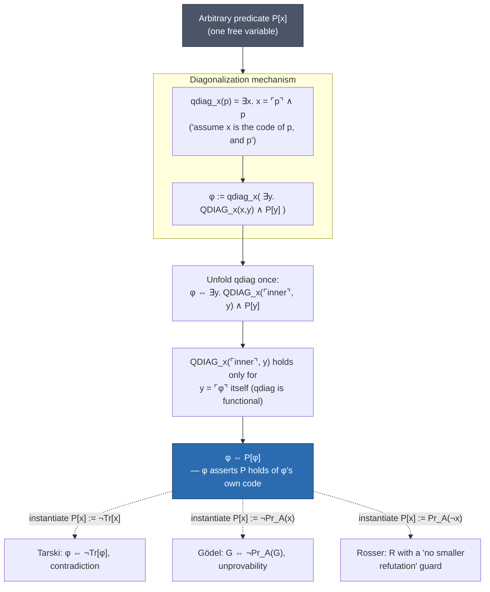

# Limits of Automated Reasoning

[[book-guidelines|↩ Back to guidelines]]

Every previous chapter of this book was a positive result: here is a fragment of logic, and here is an algorithm that decides it. [[Propositional-Logic|Propositional logic]] — decidable, and DPLL decides it fast in practice. Presburger arithmetic — decidable, Cooper's algorithm. Real closed fields — decidable, Tarski/Seidenberg/CAD. Even full first-order logic got a *semi*-decision procedure (resolution, MESON, tableaux) that will find a proof of anything valid, eventually.

Chapter 7 is the chapter where the book turns around and asks: is there a ceiling? And the answer, proved with the same constructive, code-backed rigor as everything before it, is yes — and the ceiling is much lower than you'd hope. The moment you add multiplication to natural-number arithmetic, you fall off a cliff: not merely "no known algorithm," but a *proof* that no algorithm, ever, running on any hardware, implementing any strategy, can decide validity in that theory. Worse: no algorithm can even semi-decide arithmetic *truth* (only provability, which is a strictly smaller set). This is Gödel's and Tarski's and Church's and Turing's territory, and Harrison proves all of it from scratch, with working OCaml, rather than citing it as folklore the way most books do.

This matters for anyone building a theorem prover or a verified compiler, for a specific reason the chapter itself makes explicit: your automation is going to live inside one of two regimes. Either it operates over a decidable fragment (linear arithmetic, EUF, a bounded quantifier prefix) and can promise **complete** decision — always terminates, always correct — or it operates over something Turing-complete (unrestricted first-order logic, arithmetic with multiplication, most real type systems) and the best it can *ever* promise is soundness plus semi-decidability: it will find proofs of true things, eventually, but you cannot bound how long "eventually" takes, and it will sometimes just spin forever on false ones. Chapter 7 is the proof that this isn't an engineering shortfall to be optimized away — it's the actual shape of the mathematical universe your tools live in.

## 7.1 Hilbert's Programme: What Would It Even Mean to Prove Proof Is Safe?

### The problem: some proofs don't build what they claim to prove

Consider two classical theorems from the chapter's opening:

**Theorem 7.1.** There exist algebraic irrational numbers $x, y$ such that $x^y$ is rational.

*Proof.* If $\sqrt2^{\sqrt2}$ is rational, take $x = y = \sqrt2$. If it's irrational, take $x = \sqrt2^{\sqrt2}$, $y=\sqrt2$; then $x^y = \sqrt2^{2} = 2$. $\blacksquare$

This proof is airtight — and it never tells you which case you're in. It establishes existence without exhibiting a witness. Harrison calls this **nonconstructive**: the proof licenses the *conclusion* "$\exists x,y.\ \ldots$" without letting you compute $x$ and $y$. Careful analysis shows nonconstructivity in proofs like this traces back to one of two specific inference principles: the **law of the excluded middle** ($p \lor \lnot p$) in Theorem 7.1's proof (we case-split on whether $\sqrt2^{\sqrt2}$ is rational, without deciding which), or the **principle of contradiction** / **double-negation elimination** ($\lnot\lnot p \Rightarrow p$) elsewhere (Theorem 7.2, $e+\pi$ or $e-\pi$ irrational, argued by deriving a contradiction from "both rational").

**What breaks without this distinction:** without separating constructive from nonconstructive reasoning, you cannot even *state* the question Hilbert wanted to answer. Brouwer's intuitionism rejected excluded middle and double-negation elimination outright for infinite domains — an infinite proposition like "$P$ or not-$P$" for an as-yet-unsolved conjecture asserts more than we're entitled to, on his view, because truth for Brouwer just *is* the existence of a construction. Heyting formalized this as intuitionistic logic, and by contrast the traditional logic used everywhere else in the book has ever since been called **classical logic** — a name that only makes sense once there's something to contrast it with.

Hilbert accepted much of Brouwer's critique but found the resulting "mutilation of mathematics" unacceptable. His alternative: treat infinitary, nonconstructive mathematics (Cantorian set theory, in particular) as a system of "ideal" elements — like the complex numbers before they had a model — and prove, using only the most minimal, finitary reasoning about **proofs themselves** (treated as concrete finite objects — strings, or numbers, via encodings we'll build in §7.2), that any *concrete* consequence reached via the infinitary detour is still true. This move — reasoning *about* formal proofs as mathematical objects in their own right — is what Hilbert christened **metamathematics**, and it's the single idea that makes the rest of this chapter possible: once proofs are numbers, you can quantify over them, and once you can quantify over them inside arithmetic, arithmetic can start talking about itself.

> **Lean connection.** This constructive/classical fork is not historical color — it is Lean's own foundational choice made concrete. Lean's trusted kernel is intuitionistic (proof-irrelevant, computation-based) at its core, and classical reasoning (`Classical.em`, `Classical.choice`) is bolted on as an *axiom*, deliberately kept separate so that `#print axioms` can tell you exactly which theorems secretly depend on non-constructive principles versus which ones compute. A definition marked `noncomputable` in Lean is, almost literally, Harrison's Theorem 7.1: it asserts existence via excluded middle without giving you a program to run. If your compiler project ever needs to distinguish "this refinement-type obligation is discharged by an algorithm" from "this obligation is merely proved to have *some* solution," this is the exact distinction to reach for.

## 7.2 Arithmetizing Syntax: Gödel Numbering and the Machinery of Self-Reference

### The problem: "this sentence is false" needs a host language that can quote itself

The rest of the chapter needs formulas of arithmetic to be able to talk *about* formulas of arithmetic — including, eventually, about themselves. English can do this trivially ("this sentence is false" — the Liar paradox) because quotation is free in natural language. First-order arithmetic has no built-in quotation mechanism. Harrison's fix, following Gödel, is to build one: encode every term and formula as a natural number, so that "formulas" become first-class citizens of the very domain ($\mathbb N$) the language talks about.

**Definability.** First, a formula $p(x_1,\ldots,x_n)$ *defines* a relation $R \subseteq D^n$ in interpretation $M$ if $R = \{(a_1,\ldots,a_n) \mid M, [x_i \mapsto a_i] \models p\}$. A function is definable if its graph is (as a relation) — note this is much weaker than being represented by a *term*: the truncating-halving function $n \mapsto \lfloor n/2\rfloor$ has no term in the language of $+,\cdot$, but its graph $n = 2q \lor n = 2q+1$ is perfectly definable.

**Gödel numbering.** Fix the language: constant $0$, successor $S$, $+, \cdot, <, \le$. Strings map to numbers via a base-256 positional encoding (`number`), and pairs via an explicit injective pairing function:

$$\langle x, y \rangle =_{\text{def}} (x+y)^2 + x + 1$$

(Harrison proves injectivity directly: if $\langle x',y'\rangle = \langle x,y\rangle$ then $x'+y' = x+y$ follows from monotonicity, then $x'=x$, $y'=y$ follow by cancellation.) Lists are encoded by iterated pairing, $[x_1;\ldots;x_n] = \langle x_1,\langle x_2, \langle \cdots \langle x_n, 0\rangle\cdots\rangle\rangle\rangle$, with $0$ as the empty list — the "$+1$" keeps every pair positive, so $0$ is unambiguous as a terminator.

```rust
// A structural port of Harrison's OCaml `pair`, `gterm`, `gform`.
// Real code would use BigUint; u64 shown for clarity.
fn pair(x: u64, y: u64) -> u64 { (x + y) * (x + y) + x + 1 }

enum Term { Var(String), Zero, Succ(Box<Term>), Add(Box<Term>, Box<Term>), Mul(Box<Term>, Box<Term>) }
enum Formula { False, True, Eq(Term, Term), Lt(Term, Term), Le(Term, Term),
               Not(Box<Formula>), And(Box<Formula>, Box<Formula>), /* ... */
               Forall(String, Box<Formula>), Exists(String, Box<Formula>) }

fn gterm(t: &Term) -> u64 {
    match t {
        Term::Var(x)        => pair(0, number(x)),
        Term::Zero          => pair(1, 0),
        Term::Succ(t)       => pair(2, gterm(t)),
        Term::Add(s, t)     => pair(3, pair(gterm(s), gterm(t))),
        Term::Mul(s, t)     => pair(4, pair(gterm(s), gterm(t))),
    }
}
// gform is the same idea, one injective tag per constructor of Formula.
```

The numbering only needs to be **injective** (distinct formulas get distinct codes) — it need not be a bijection, and indeed most naturals aren't the code of anything. This is the whole game: because `gterm`/`gform` are structurally recursive, injective functions built from injective primitives (`pair`, `number`), the *codes themselves* — and predicates about them, like "is $n$ the code of a valid formula" — can be defined by arithmetic formulas, mechanically, the same way you'd write a decoder in any language.

**Primitive recursive functions are definable.** This is the load-bearing lemma of the section. Harrison first shows that if a binary relation $R$ is definable, so is its reflexive-transitive closure $R^*$ — by encoding a witnessing chain $x_0, x_1, \ldots, x_n$ as digits of a number in a sufficiently large prime base $p$, and extracting digits via definable division/remainder. Then, for $f$ given by the primitive-recursive schema

$$f(0) = a, \qquad f(S(n)) = g(n, f(n))$$

with $g$ definable by $G(x,y,z)$, the "step" relation $R(u,v) =_{\text{def}} \exists x\,y\,z.\ G(x,y,z) \land u = \langle x,y\rangle \land v = \langle S(x), z\rangle$ is definable, hence so is $R^*$, hence so is the graph of $f$ itself: $f(n) = p \iff R^*(\langle 0, a\rangle, \langle n, p\rangle)$. Every primitive recursive function — factorial, exponentiation, and crucially the `gnumeral` function mapping $n$ to the Gödel code of its own zero-successor numeral — is therefore definable in arithmetic. This is the technical bridge between "arithmetic can compute" and "arithmetic can define its own syntax," and it is exactly why weak, finitely-axiomatized arithmetic ends up able to talk about proofs of arbitrary length despite having no primitive for "sequence" or "proof" in its signature.

### Self-reference: the diagonal lemma

There's no English-style quotation in first-order logic. Harrison builds the analogue via a string-level warm-up first: define `diag(s)` as "replace every unquoted `x` in `s` by `s` itself, quoted":

```
# diag("p(x)");;
- : string = "p(‘p(x)’)"
```

Feeding `diag` a description of itself produces a fixpoint:

```
# let phi = diag("P(diag(x))");;
val phi : string = "P(diag(‘P(diag(x))’))"
```

`phi` literally says "`P` holds of my own diagonalization" — and it *is* its own diagonalization, up to the mechanical unfolding of `diag`. This is a rigorous version of the Liar sentence, and it's Quine's mechanism for programs that print their own source (quines).

Doing this *inside* logic replaces string quotation with numeral representation of Gödel codes. Diagonalization of formula $p$ w.r.t. variable $x$: $\mathrm{diag}_x(p) =_{\text{def}} \mathrm{subst}(x \mapsto \ulcorner p\urcorner)\,p$ — substitute the *numeral* of $p$'s own code for $x$ inside $p$. For technical reasons (avoiding an explicit "decode" operation inside the object language) Harrison actually uses **quasi-substitution**, $\mathrm{qsubst}(x,t,p) =_{\text{def}} \exists x.\ x = t \land p$, and correspondingly **quasi-diagonalization** $\mathrm{qdiag}_x(p) =_{\text{def}} \exists x.\ x = \ulcorner p \urcorner \land p$.

**Lemma 7.3 (Fixpoint/diagonal lemma, Carnap).** For any arithmetical formula $P[x]$ with exactly one free variable, there is a sentence $\phi$ such that $\phi \Leftrightarrow P[\phi]$ is true in $\mathbb N$. Explicitly,

$$\phi =_{\text{def}} \mathrm{qdiag}_x\bigl(\exists y.\ \mathrm{QDIAG}_x(x,y) \land P[y]\bigr)$$

where $\mathrm{QDIAG}_x(n,y)$ is an explicit definable predicate expressing "$y$ is the code of $\mathrm{qdiag}_x$ applied to the formula coded by $n$." The proof is a five-line equational chain unwinding the definitions, ending exactly where it started: $\phi \Leftrightarrow P[\phi]$.



Every limitative result in the rest of the chapter is *one instantiation of this same lemma* — Tarski's theorem, Gödel's first theorem, and the Rosser sentence are the same fixpoint construction plugging in different predicates $P[x]$ for "truth" vs. "unprovability" vs. "provable-but-not-minimally." Once you see the diagram, the rest of the chapter reads as a sequence of substitutions into one machine, not four unrelated tricks.

> **Lean connection.** Diagonalization-via-quotation is precisely what Lean's kernel *refuses* to let you do directly — there's no built-in `quote` that turns a Lean term into a `Nat` you can then feed back into a predicate over Lean terms and typecheck at the same universe. (Metaprogramming frameworks like Lean's `Expr` quotation live at a different, non-kernel level for exactly this reason: unrestricted self-quotation at the same level is how you build paradoxes, not proofs.) The universe hierarchy and the strict positivity checker on inductive types exist substantially to block a Russell/Curry-style diagonal argument from type-checking.

### Tarski's theorem: truth is not definable

Define $T = \{\ulcorner p \urcorner \mid p \text{ true in } \mathbb N\}$ — the set of codes of true arithmetic sentences.

**Theorem 7.4 (Tarski, undefinability of truth).** There is no formula $\mathrm{Tr}[x]$ in the language of arithmetic defining $T$.

*Proof.* Suppose $\mathrm{Tr}[x]$ did. Apply the fixpoint lemma to $P[x] := \lnot\mathrm{Tr}[x]$: get $\phi$ with $\phi \Leftrightarrow \lnot\mathrm{Tr}[\phi]$ true in $\mathbb N$. But by the defining property of $\mathrm{Tr}$, $\mathrm{Tr}[\phi]$ holds iff $\phi$ is true. So $\lnot\mathrm{Tr}[\phi]$ holds iff $\phi$ is *not* true, i.e. $\phi \Leftrightarrow \lnot\phi$ — contradiction. $\blacksquare$

This is the formalized Liar paradox, and it's a genuine theorem, not a curiosity: **the property "is a true statement of arithmetic" cannot be expressed as a statement of arithmetic.** No matter how clever your formula, it will always disagree with truth on at least one sentence — its own diagonalization.

**What breaks without this:** without Tarski's theorem in hand first, Gödel's incompleteness theorem looks like a one-off trick about provability; *with* it, the incompleteness theorem is almost forced. §7.3 shows provability *is* definable — so provability and truth, being one definable and one not, simply cannot be the same set, and one of "some truth is unprovable" or "some provable thing is false" must hold for *any* definable axiom system. That's the argument of the very next section.

## 7.3 Incompleteness of Axiom Systems: Provability *Is* Definable

Where truth resists arithmetization, **provability doesn't** — and building the formula $\mathrm{Pr}_A(n)$ meaning "$n$ codes a formula provable from axiom set $A$" is the real engineering labor of the chapter (pp. 541–545 are essentially one long definable predicate, built layer by layer):

- $\mathrm{TERM}(n)$ / $\mathrm{FORM}(n)$: $n$ codes a well-formed term/formula, via the reflexive-transitive-closure trick from §7.2 applied to a one-step "term/formula destructor" relation.
- $\mathrm{FREETERM}(m,n)$ / $\mathrm{FREEFORM}(m,n)$: variable numbered $m$ does not occur free in the term/formula coded by $n$ — needed to arithmetize the side-conditions ($x \notin \mathrm{FVT}(t)$, $x \notin \mathrm{FV}(p)$) on quantifier axioms.
- $\mathrm{AXIOM}(a)$: $a$ codes an instance of one of the finitely many Hilbert-style axiom schemas of Chapter 6's proof system — a big definable disjunction, one disjunct per schema.
- $\mathrm{Pr}_1(x,y)$: one step of derivation — either $y$'s formula is an axiom paired onto $x$, or it follows from $x$ by modus ponens, or by generalization.
- $\mathrm{Pr}_A(n) =_{\text{def}} \mathrm{Pr}_{A,1}^*(0, n, 0)$, i.e. the reflexive-transitive closure of $\mathrm{Pr}_1$ (with $\mathrm{AXIOM}$ augmented by a definable extra-axiom predicate $\mathrm{Ax}$ for $A$), applied to encode a *whole derivation sequence* ending in $n$.

None of this needed anything beyond what §7.2 built: $\mathrm{Pr}_A$ is definable **whenever $A$ itself is definable**, because it's assembled entirely from primitive recursive (hence definable) pieces.

**Theorem 7.5.** For any definable axiom set $A$: $\mathrm{Cn}(A)$ does not coincide with the true formulas of $\mathbb N$ — either some axiom is false, or some truth is unprovable.

*Proof.* $\mathrm{Cn}(A)$ (via $\mathrm{Pr}_A$) is definable; the set of true formulas is not (Tarski). Two definable-vs-not sets can't be equal, so they differ; since inference preserves truth, if $A$ is all true then the difference must be a truth $\mathrm{Cn}(A)$ misses. $\blacksquare$

If we additionally assume $A$'s axioms are all true (**soundness**), we get **semantical incompleteness**: some true sentence isn't provable — genuinely different from the earlier *syntactic* incompleteness of a theory (§4.3, "$A \nvdash p$ and $A \nvdash \lnot p$"), because it's about *truth* in the standard model, not mere unprovability from either side.

**Corollary 7.6.** If $A$ is sound and definable, $\mathrm{Cn}(A)$ is (syntactically) incomplete.

*Proof.* By 7.5, some sentence $q$ true but unprovable; let $p = \mathrm{generalize}(q)$. Since $\vdash p \Rightarrow q$, $A \nvdash p$ (else $A \vdash q$). And $A \nvdash \lnot p$ since everything provable is true and $\lnot p$ is false. $\blacksquare$

The definability hypothesis on $A$ is essential — take $A$ to be *all* true formulas and the conclusion trivially fails, since then $\mathrm{Cn}(A)$ just *is* the (non-definable) truth set. Peano Arithmetic ($PA$: successor/injectivity, addition/multiplication recursion equations, plus the induction schema for every formula $P[n]$) is definable — the induction schema, despite being infinite, is definable as a uniform pattern over all $P$, sidestepping the need to arithmetize substitution by phrasing it with an existential "let $x$ stand for..." wrapper.

## 7.4 Gödel's First Incompleteness Theorem

### The sharper, syntactic construction

§7.3 already forces the incompleteness *conclusion*; §7.4 gives Gödel's actual, sharper theorem, which needs no notion of truth at all — only provability, via the fixpoint lemma applied directly to $\mathrm{Pr}_A$. Take $H \Leftrightarrow \mathrm{Pr}_A(\lnot H)$ ("I assert my negation is provable") and set $G =_{\text{def}} \lnot H$, giving:

$$G \Leftrightarrow \lnot \mathrm{Pr}_A(G)$$

**$G$ asserts its own unprovability.** Assuming $A$ is sound:

- If $A \vdash G$: then $\mathrm{Pr}_A(G)$ is true, so by the equivalence $G$ is false — contradicting soundness. So $A \nvdash G$.
- If $A \vdash \lnot G$: by soundness $\lnot G$ is true, so $\mathrm{Pr}_A(G)$ is true, so $A \vdash G$ — giving $A \vdash \bot$, contradicting soundness ($\bot$ isn't true).

So $A \nvdash G$ and $A \nvdash \lnot G$: incomplete, **constructively** — given a concrete $A$, you can exhibit the actual formula $G$ that neither it nor its negation proves.

### Δ₀, Σ₁, Π₁: the classification that makes the theorem sharp

**Definition 7.7 ($\Delta_0$).** All quantifiers *bounded*: $\forall x.\, x \le t \Rightarrow P[x]$, $\exists x.\, x < t \land P[x]$, etc., with $x \notin \mathrm{FVT}(t)$. $\Delta_0$-sentences are **decidable by direct evaluation** — bounded quantifiers are just finite conjunctions/disjunctions in disguise, so `dholds` (a literal interpreter) decides them.

**$\Sigma_1$ / $\Pi_1$**: in prenex form, all *unbounded* quantifiers existential ($\Sigma_1$) or universal ($\Pi_1$); more generally the classification extends compositionally to non-prenex formulas by tracking polarity (negation flips the class, `Imp`'s antecedent flips, etc.). Key asymmetry: a true $\Sigma_1$ sentence, though maybe not decidable outright, is **verifiable** — there's a computable bound $m$ on the witness, found by structural induction on the formula (`sigma_bound`/`veref` in the book), so you just search $0,1,\ldots,m$. A false $\Pi_1$ sentence is refutable the same way. This asymmetry — you can confirm existentials but not refute them in general, confirm negated-universals but not universals — *is* the shape of semi-decidability, and it's exactly why $\Sigma_1$ turns out (§7.5) to coincide with "recursively enumerable."

**Soundness/completeness relativized to a class:** $A$ is $\Sigma_1$-sound (aka **1-consistent**) if every $\Sigma_1$-sentence $A$ proves is true; $\Sigma_1$-complete if every true $\Sigma_1$-sentence is provable from $A$. (Any "realistic" arithmetic axiom set is $\Sigma_1$-complete almost by construction — it needs to prove basic facts of the kind `sholds` checks.)

Since the fixpoint construction only introduces existential quantifiers, if $A$ is $\Sigma_1$-definable then $H$ (from $H \Leftrightarrow \mathrm{Pr}_A(\lnot H)$) is $\Sigma_1$, so $G = \lnot H$ is $\Pi_1$.

**Theorem 7.8.** Let $A$ be $\Sigma_1$-definable, $G$ the $\Pi_1$ sentence with $G \Leftrightarrow \lnot\mathrm{Pr}_A(G)$. If $A$ is $\Pi_1$-sound, $A \nvdash G$ (yet $G$ is true). If $A$ is $\Sigma_1$-sound, $A \nvdash \lnot G$.

**Corollary 7.9/7.10.** $\Sigma_1$-definable + $\Pi_1$-sound $\Rightarrow$ not $\Pi_1$-complete; add $\Sigma_1$-sound $\Rightarrow$ incomplete. And, crucially, for $\Sigma_1$-*complete* $A$: **mere consistency** (not full soundness!) already forces $A \nvdash G$; only the sharper direction $A \nvdash \lnot G$ needs the stronger $\Sigma_1$-soundness hypothesis.

This is the theorem's most quietly important content: **consistency and $\Sigma_1$-soundness are genuinely different properties.** Given consistent, $\Sigma_1$-complete $A$, the theory $A' = A \cup \{\lnot G\}$ is *still consistent* (since $A \nvdash G$) — but $A'$ is **not** $\Sigma_1$-sound, because it now proves the false $\Sigma_1$-sentence $\lnot G$. Consistency alone tolerates provably-false-but-not-outright-contradictory extensions; only the strictly stronger $\Sigma_1$-soundness rules them out. (Gödel's original statement used an even stronger, historically standard hypothesis, **ω-consistency** — "if $A \vdash \lnot P[n]$ for every numeral $n$, then $A \nvdash \exists x. P[x]$" — which implies $\Sigma_1$-soundness for arbitrary $P[x]$ but is strictly more than what's needed, since the proof only ever needs it for the specific $\Sigma_1$ formula $\lnot G$.)

## 7.5 Definability and Decidability: Turing Machines and r.e. Sets

### The Entscheidungsproblem and the Church–Turing thesis

Hilbert's *Entscheidungsproblem* asked for a general decision method for first-order validity. Before anyone could prove none exists, "decision method" had to be pinned down mathematically. Turing's answer — formalized *human calculation* as a discrete process with finitely many mental states, operating on an unbounded but discretely-addressed tape via bounded-lookahead local rules — is what the book implements directly in OCaml, and it maps almost verbatim onto a small Rust state machine:

```rust
#[derive(Clone, Copy, PartialEq)] enum Symbol { Blank, One }
#[derive(Clone, Copy)] enum Direction { Left, Right, Stay }

struct Tape { head: i64, cells: std::collections::HashMap<i64, Symbol> }
impl Tape {
    fn look(&self) -> Symbol { *self.cells.get(&self.head).unwrap_or(&Symbol::Blank) }
    fn write(&mut self, s: Symbol) { self.cells.insert(self.head, s); }
    fn mv(&mut self, d: Direction) {
        self.head += match d { Direction::Left => -1, Direction::Right => 1, Direction::Stay => 0 };
    }
}

// Program: (state, symbol_read) -> (symbol_to_write, direction, next_state).
// State 0 is the halting state by convention; an undefined transition also halts.
type Program = std::collections::HashMap<(u32, Symbol), (Symbol, Direction, u32)>;

fn run(prog: &Program, mut state: u32, mut tape: Tape) -> Tape {
    while let Some(&(c, d, s)) = prog.get(&(state, tape.look())) {
        tape.write(c); tape.mv(d); state = s;
    }
    tape
}
```

**Definition 7.11.** $f: \mathbb N^n \to \mathbb N$ (total or partial) is **computable** if some fixed program computes it on all (defined) inputs, unary-encoded on the tape as runs of `One`s.

This isn't offered as one formalism among many, contra the naive reading — Harrison walks through *why* each restriction (finitely many states, single-square read/write, finitely many symbols, no jumping to arbitrary tape positions) corresponds to a genuinely plausible finiteness limit on discrete, error-free calculation by a "computor," which is why Church's independently-derived, differently-shaped formalism (λ-calculus) turned out **provably equivalent** — this convergence from two unrelated angles is the actual evidence for the **Church–Turing thesis** ("effectively calculable" = Turing/Church-computable), not a proof of it (it can't be proved — "effectively calculable" was never a formal notion to begin with).

### Σ₁ = recursively enumerable

Turing machine configurations (state, scanned symbol, tape-left-of-head, tape-right-of-head, all as one packed number via nested pairing) can themselves be arithmetized exactly like formulas were — each instruction of a program becomes a $\Delta_0$ transition-relation disjunct, and "program halts on this input with this output" becomes a $\Sigma_1$ formula (reflexive-transitive closure of the transition relation, plus the exponential encoding of unary tape contents — itself definable since exponentiation is primitive recursive).

**Definition 7.12.** $S \subseteq \mathbb N^n$ is **recursively enumerable (r.e.)** — semicomputable, semidecidable — if it's the domain of some partial computable $f$.

**The equivalence that makes everything else in the chapter click into place:**

> **A set is recursively enumerable if and only if it is $\Sigma_1$-definable.**

($\Rightarrow$) the graph of any computable $f$ is $\Sigma_1$ (just shown); its domain is $\exists y. R(x,y)$, still $\Sigma_1$. ($\Leftarrow$) any $\Sigma_1$-definable set is the domain of `sigma_bound` (the computable search-for-a-witness procedure from §7.4) — which halts exactly when the formula is true.

This single equivalence is *the* bridge in the chapter between the computability side (Turing machines, r.e. sets — §7.5–7.6) and the logic side (arithmetical definability — §7.2–7.4). It's also the direct explanation for why Tarski's theorem is stronger than it looks: since truth isn't even *definable at all*, a fortiori it isn't $\Sigma_1$-definable, so **arithmetic truth is not even semicomputable** — no program can be trusted to confirm true sentences by running forever on false ones and halting on true ones, because there is no such program even in principle. First-order *provability*, by contrast, is $\Sigma_1$ (that's what §7.3 built), hence r.e. — which is just a restatement of the fact that tableaux/resolution/MESON *are* semi-decision procedures for validity.

**Theorem 7.13.** $\chi_S$ (the characteristic function of $S$) is computable iff **both $S$ and its complement are r.e.** — run both search procedures interleaved, one of them must terminate. Call a set **decidable** ($\Delta_1$) if it's both $\Sigma_1$- and $\Pi_1$-definable. (Careful: this is a property of the *set*, not of a single defining formula — it's weaker than being defined by one formula that is simultaneously $\Sigma_1$ and $\Pi_1$, which collapses to $\Delta_0$.)

## 7.6 Church's Theorem: A Constructive Undecidability Proof via Robinson Arithmetic Q

### Q: a deliberately minimal, still-Σ₁-complete axiom set

$$Q =_{\text{def}} \begin{aligned}[t]
&\forall m\,n.\ S(m)=S(n) \Rightarrow m=n \\
&\land\ \forall n.\ n \ne 0 \Leftrightarrow \exists m.\ n = S(m) \\
&\land\ \forall n.\ 0+n=n \ \land\ \forall m\,n.\ S(m)+n = S(m+n) \\
&\land\ \forall n.\ 0 \cdot n = 0 \ \land\ \forall m\,n.\ S(m)\cdot n = n + m\cdot n \\
&\land\ \forall m\,n.\ m \le n \Leftrightarrow \exists d.\ m+d=n \\
&\land\ \forall m\,n.\ m<n \Leftrightarrow S(m) \le n
\end{aligned}$$

$Q$ is deliberately weak — it can't even prove $\forall n.\ n+0=n$ (that needs induction, which $Q$ lacks entirely; $Q$ is a *finite* set of axioms, no schema). The point of choosing something this weak is to make the undecidability result maximally strong: **if even $Q$ is enough**, then any richer arithmetic (PA, ZF's internal arithmetic, your compiler's own trusted core if it reasons about integers at all) inherits the same limit for free.

Harrison **constructively proves** $Q$ is $\Sigma_1$-complete: for every true $\Sigma_1$-sentence, an explicit OCaml function `sigma_prove` builds a literal Hilbert-style derivation from $Q$. It's not an existence argument; it's a compiler from "true $\Sigma_1$ formula" to "$Q$-proof," and its structure is a genuine, if tiny, automated theorem prover:

- ground equations $s=t$: evaluate both sides to numerals by unfolding $+/\cdot$ recursively (`robeval`), chain equalities — `rob_eq`.
- ground disequations: same evaluation, then `rob_nen` recursively peels $S(\cdot)$ off both numerals until one side is literally $0 = S(\cdot)$, refuted directly by the injectivity/no-confusion axioms.
- $(p \Rightarrow q) \Rightarrow \bot$ (a conjunction in disguise): recursively prove $p$ and $\lnot q$, combine.
- $p \Rightarrow q$: compute the $\Sigma_1$-bound $m$ (§7.4's `sigma_bound`) for the *whole* formula, check semantically with `sholds` whether $q$ or $\lnot p$ is the cheaper thing to actually prove, recurse on that.
- $\lnot\forall x. P[x]$: find the witnessing counterexample numeral by exhaustive search up to the bound, recurse on $\lnot P[n]$.
- bounded $\forall x.\, x \le t \Rightarrow P[x]$: peel off one instance at a time via a monotonicity lemma (`boundquant_step`), reducing the $S(n)$ case to the $P[0]$ base case plus a shifted induction-like step — done entirely with $Q$'s raw axioms, no induction schema required, because the *bound* itself is a concrete numeral, so this is finite case analysis, not real induction.

> **Rust connection.** This is worth pausing on if you're building a proof-producing kernel: `sigma_prove` is a *decision procedure whose output is a proof object*, checked afterward by re-running it through the tiny trusted primitive-rule core from Chapter 6 — the same LCF discipline your compiler's kernel should apply to *any* decision procedure result (a CSP counterexample, an SMT unsat core) that you want to trust without trusting the procedure that produced it. The lesson generalizes past this specific theorem: soundness of the *kernel* only requires soundness of a handful of primitive constructors; a large, complex proof-search procedure like `sigma_prove` can be arbitrarily buggy and the kernel still only accepts genuinely valid derivations.

### Church's theorem

**Theorem 7.14.** If $B$ is finite and $\mathrm{Cn}(A)$ is undecidable, so is $\mathrm{Cn}(A-B)$ (same language). *Proof:* $A \vdash p \iff A-B \vdash b \Rightarrow p$ where $b$ is the (finite) conjunction of $B$'s universal closures — a decision procedure for $\mathrm{Cn}(A-B)$ would give you one for $\mathrm{Cn}(A)$.

Combine with the direct fixpoint argument (unprovability from $\Sigma_1$-sound, $\Sigma_1$-complete $A$ is not $\Sigma_1$-definable, hence — by §7.5's equivalence — not r.e., hence provability itself is undecidable) applied to $Q$, then strip axioms one at a time via Theorem 7.14 down to the empty theory:

**Theorem 7.15 (Church, 1936).** The set of first-order logical validities — even restricted to the language of arithmetic — is **not recursive** (not decidable).

*Proof.* $Q$ is undecidable (just argued). By 7.14, removing finitely many axioms from $Q$ preserves undecidability — down to the smallest theory in the language, i.e. the pure logical validities. $\blacksquare$

**What breaks without this:** this is the theorem that retroactively explains why every automated first-order prover in this book (Chapters 3, 6) is a *search* procedure that sometimes runs forever, rather than a *decision* procedure. It is not an implementation gap Harrison declined to close — Church's theorem proves closing it is impossible. A semi-decision procedure — sound, complete, but not guaranteed to terminate on invalid input — is provably **the best any first-order prover, including yours, can be.**

## 7.7 Further Limitative Results

### Gödel's second incompleteness theorem

Define $\mathrm{Con}(A) =_{\text{def}} \lnot \mathrm{Pr}_A(\bot)$ — the formalized assertion "$A$ is consistent." Since Gödel's *proof* of the first incompleteness theorem is itself a finite chain of elementary reasoning about $\mathrm{Pr}_A$, it can in principle be **re-formalized and re-proved inside $A$**, provided $\mathrm{Pr}_A$ satisfies three purely syntactic closure properties — **Löb's derivability conditions**:

1. $A \vdash p \implies A \vdash \mathrm{Pr}_A(p)$  (if provable, provably provable)
2. $A \vdash \mathrm{Pr}_A(p \Rightarrow q) \Rightarrow \mathrm{Pr}_A(p) \Rightarrow \mathrm{Pr}_A(q)$  (provability respects modus ponens)
3. $A \vdash \mathrm{Pr}_A(p) \Rightarrow \mathrm{Pr}_A(\mathrm{Pr}_A(p))$  (provability of provability is itself provable — this one needs $A$ noticeably stronger than $Q$)

Given these plus the fixpoint property $A \vdash G \Leftrightarrow (\mathrm{Pr}_A(G) \Rightarrow \bot)$, Harrison shows the whole argument mechanizes down to something MESON can literally check (a five-line propositional-schema derivation) and concludes:

**Gödel's second incompleteness theorem.** A sufficiently strong, consistent $A$ cannot prove $\mathrm{Con}(A)$ — unless $A$ is in fact inconsistent, in which case it proves everything.

This is the theorem with the sharpest bite for anyone building a **trusted proof-producing kernel**: *your kernel's own consistency is one of the specific things your kernel (or anything only as strong as it) is provably unable to certify about itself.* You cannot ask your type checker's core logic to prove "my core logic never accepts a false proposition" from inside that same logic — not because nobody's written the proof yet, but because the statement is provably unprovable there, on pain of actual inconsistency if it somehow succeeded. What you *can* get is **relative consistency**: a separately-trusted, typically weaker system $S$ proving $\mathrm{Con}(T) \Rightarrow \mathrm{Con}(T')$ for your kernel $T$ and some extension $T'$ — exactly the pattern behind Gödel's own proof that ZFC + GCH is consistent relative to ZF. What you provably *cannot* get is a system weaker than $T$ certifying $\mathrm{Con}(T)$ outright (Gödel's second theorem again, one level up): if $S \vdash \mathrm{Con}(T)$ and $S$ is no stronger than $T$, you could chain that into $T \vdash \mathrm{Con}(T)$, contradiction. There is no bootstrapping a kernel's soundness certificate purely from inside a system it's at least as strong as.

**Löb's theorem** generalizes the mechanism past $\bot$: for *any* sentence $S$, if $\phi \Leftrightarrow (\mathrm{Pr}_A(\phi) \Rightarrow S)$ is a fixpoint and $A \vdash \mathrm{Pr}_A(S) \Rightarrow S$, then $A \vdash S$ outright. (Gödel's second theorem is the special case $S = \bot$.) Read the other direction: **"provable implies true" is itself unprovable for any $A$, for any non-trivial $S$**, unless $S$ was already a theorem — a formal system genuinely cannot certify its own reliability as a premise, only as a *consequence* of already having the goal in hand.

**Reflection principles** (Feferman): adding a system's own consistency statement as a new axiom, $S_1 = S_0 \cup \{\mathrm{Con}(S_0)\}$, iterated transfinitely, does provably strengthen the theory — but it's fragile: because $\mathrm{Con}$ depends on the *specific formula* defining the axiom set (an "intensional" dependency), pathological re-descriptions of the same axiom set can trivially satisfy their own consistency statement (e.g. $\mathrm{Ax}'(p) =_{\text{def}} \mathrm{Ax}(p) \land \mathrm{Con}(A)$), while a $\Sigma_1$-sound system genuinely does stay $\Sigma_1$-sound under transfinitely many honest reflection additions. The gap between "genuine strengthening" and "circular self-endorsement" is exactly the sort of trust-boundary bookkeeping a real proof-producing architecture has to get right — a certificate that says "trust me because I say I'm trustworthy" is *definable* but worthless; the whole discipline of relative-consistency and reflection is about which self-endorsements are actually informative.

### Hilbert's tenth problem and the MRDP theorem

**Definition.** A relation is **Diophantine** if it's definable by a *purely existentially quantified polynomial equation*: $\exists x_1\ldots x_k.\ p(\vec a, \vec x) = q(\vec a, \vec x)$ — no inequalities, no propositional connectives, no quantifier alternation, just "$\exists \vec x$, this polynomial equals that one."

**MRDP theorem (Matiyasevich, building on Davis, Putnam, J. Robinson).** Every r.e. relation is Diophantine.

Since r.e. = $\Sigma_1$-definable, this collapses the entire, syntactically rich $\Sigma_1$ class down to the single, syntactically minimal shape of a polynomial Diophantine equation — everything a Turing machine can semi-decide, a system of polynomial equations over $\mathbb Z$ can encode. This immediately answers Hilbert's tenth problem in the negative: **there is no algorithm deciding whether an arbitrary polynomial Diophantine equation has an integer solution** — such an algorithm would decide the halting problem, via the Diophantine representation of "this Turing machine halts."

(The theory of *rationals*, in between the decidable reals and the wildly undecidable integers, turns out to be as undecidable as the integers, via J. Robinson's definition of "is an integer" inside the rationals using quadratic forms — but whether the *purely existential* Diophantine problem over $\mathbb Q$ is decidable was, as of the book's writing, still open.)

### Sharper Church's theorem, essential/strong undecidability, and Rosser's construction

- **Reduction classes.** To show a syntactic class $K$ undecidable, exhibit a computable $f$ mapping arbitrary formulas into $K$-formulas preserving validity — then decidability of $K$ would decide everything. Skolemizing a definitional-CNF transform shows the $\exists^n\forall^m$ prefix class is a reduction class (dual to the *decidable* AE fragment of Chapter 5) — a sharp reminder that decidability in this landscape is fragile: the dual of a decidable prefix class is, in general, a reduction class for full undecidability, not "decidable the other way around too."
- **Essential/strong undecidability.** $T$ is *essentially undecidable* if every consistent extension of $T$ is undecidable — $Q$ qualifies, since $\Sigma_1$-completeness (hence the core undecidability argument) is inherited by any extension. A finitely-axiomatized essentially undecidable theory is automatically *strongly* undecidable (every theory merely *compatible* with it — consistent together — is undecidable too), which is how undecidability propagates by interpretation across theories that don't obviously look like arithmetic: the ring of integers, the theory of rings and of fields in general (via Lagrange's four-square theorem embedding $Q$ inside integer arithmetic).
- **The Rosser construction.** Gödel's $G$ needed $\Sigma_1$-*soundness* to show $A \nvdash \lnot G$, not mere consistency. Rosser (1936) tightened this: replace "$p$ codes a proof of $\phi$" with "$p$ codes a proof of $\phi$ *and no smaller number codes a proof of $\lnot\phi$*," diagonalize on that instead, and the resulting Rosser sentence $R$ satisfies $A \vdash R \Leftrightarrow \lnot\mathrm{Pr}_A(R)$ under **mere consistency** — no soundness hypothesis needed at all. This closes the gap the diagram above flags: Rosser is literally the third branch of the same diagonal-lemma diagram, one careful tweak to the "provability" predicate away from Gödel's own $G$.

## 7.8 Retrospective: The Nature of Logic

Harrison closes by asking what actually makes this material *logic* rather than ordinary mathematics dressed up formally. His answer settles on **formal checkability**: a genuinely logical proof should be verifiable by "a clerk, or even a machine," requiring no domain insight, only mechanical rule-following — which is precisely why proof search and proof checking (this book's actual subject) carry philosophical weight beyond their engineering utility. And Tarski's theorem gives that answer a hard edge: for pure first-order logic, mechanical checkability is achievable in full (Chapter 6's `lcffol`, entirely rule-based). The instant you add arithmetic, or set theory, or any sufficiently expressive extension, Tarski's theorem guarantees there will always be truths no mechanical method — however cleverly designed — can ever certify. Checkability is not a property every interesting formal system gets to keep.

## Where This Leads

This chapter is where the book's throughline about *decidable fragments* (Chapters 5–6: Presburger, real-closed fields, congruence closure, all the decision procedures) meets its hard boundary. Everything earlier in the book that terminates and answers correctly does so because it stayed inside a fragment weak enough to dodge Church's theorem — the moment a theory can encode Robinson arithmetic $Q$ (and almost anything expressive enough to be interesting can), completeness of decision is gone for good, and semi-decidability plus soundness is the ceiling.

For the compiler/elaborator project this maps onto directly, without needing to force the connection:

- **Trusted kernels and proof-producing architecture.** Gödel's second theorem is a hard limit on self-certification: a kernel cannot prove its own soundness from inside itself, only relative-consistency claims from a separately-trusted, typically weaker vantage point. Any "prove my type-checker correct" ambition eventually runs headlong into this — the honest target is a small, LCF-style trusted core (Chapter 6's `thm` abstract type is the template) whose soundness is argued *outside* the system, exactly the way `sigma_prove`'s output is only trusted because it re-derives through Chapter 6's primitive rules rather than being trusted directly.
- **Undecidability as a design constraint, not a bug.** Once your CSP/SMT kernel reasons about anything with unrestricted integer arithmetic (nonlinear constraints, unbounded loops as Diophantine-equation-shaped reachability questions), Church's theorem and the MRDP theorem both say completeness is off the table in general — the honest architecture is a sound, terminating decision procedure over the *decidable* fragments you actually need (linear arithmetic, EUF, bounded domains), falling back to semi-decidable search or explicit incompleteness (timeouts, "unknown") outside them, precisely the SMT-style split the book's Chapter 5–7 arc as a whole is arguing for.
- **The r.e. / Σ₁ correspondence** is the formal version of "your prover will find real proofs but can't be trusted to report failure" — worth keeping in mind anywhere your toolchain's automated search (unification, constraint solving, refinement-obligation discharge) can silently become a hang instead of a `false`.
