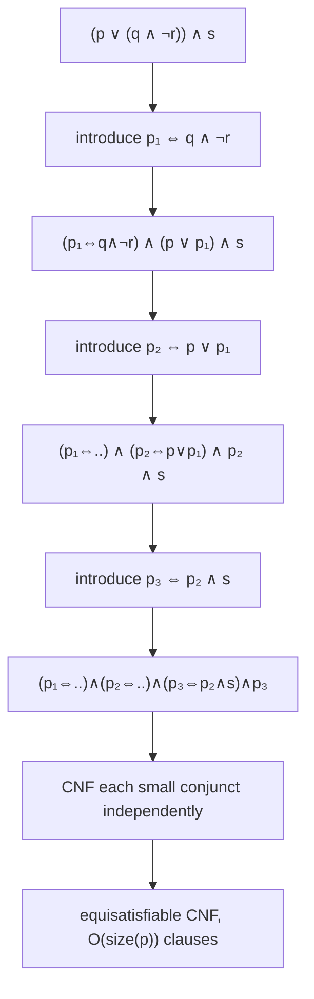
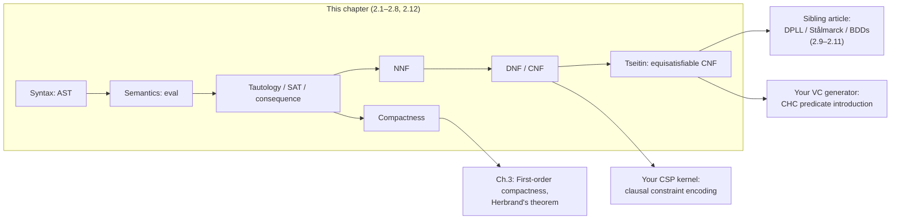

# Propositional Logic

[[book-guidelines|↩ Back to guidelines]]

## Why bother with something this simple?

Propositional logic looks almost too small to be worth a whole chapter: no
quantifiers, no functions, no terms — just atoms glued together with `and`,
`or`, `not`, `implies`, `iff`. It is tempting to skim past it on the way to
first-order logic, where the "real" expressive power lives. Harrison
resists that temptation for a concrete engineering reason: almost every
piece of machinery your compiler's verifier will eventually need — clausal
representations, satisfiability as the master decision problem, the
distinction between "equivalent" and "just as satisfiable," even the proof
technique (compactness) that underwrites first-order model theory — already
shows up here in its cleanest form, uncluttered by variable binding or
quantifier alternation. If you get the propositional layer exactly right,
first-order logic in the next chapter is "the same thing, plus binders,"
rather than a fresh start.

There's also a very concrete payoff for the project this vault is built
around: your refinement-type compiler's verification conditions eventually
bottom out as propositional (or first-order, but often propositionally
encoded) satisfiability queries handed to a SAT/SMT backend. Everything
in this chapter — CNF, Tseitin's construction, compactness — is the theory
of *how a formula gets from "a fact about your program" to "a query a
solver can answer efficiently."*

## 2.1 Syntax: formulas as trees, not strings

Harrison's first move, echoing Chapter 1's syntax/semantics split, is to
insist that a formula is *not* the string you type — it's an abstract
syntax tree. The book's OCaml datatype is:

```ocaml
type ('a)formula = False
                 | True
                 | Atom of 'a
                 | Not of ('a)formula
                 | And of ('a)formula * ('a)formula
                 | Or of ('a)formula * ('a)formula
                 | Imp of ('a)formula * ('a)formula
                 | Iff of ('a)formula * ('a)formula
                 | Forall of string * ('a)formula
                 | Exists of string * ('a)formula;;
```

Two design choices are worth dwelling on because they recur throughout
the book. First, the type is **parametrized over the type of atoms**
(`'a`) — propositional logic gets `'a = prop` (bare names), but the exact
same tree shape is reused for first-order logic in Chapter 3 with `'a`
instantiated to atomic *predicates*. This is a "write the AST once, reuse
it for the richer logic later" move. Second, `Forall`/`Exists` constructors
are present but unused in this chapter — Harrison is deliberately paying a
small present cost (an unused case in every pattern match) to avoid
duplicating all the generic recursion machinery later.

The concrete symbols the book adopts (and that this article uses
throughout) are $\bot$ (false), $\top$ (true), $\neg p$ (not), $p \wedge q$
(and), $p \vee q$ (or), $p \Rightarrow q$ (implies), $p \Leftrightarrow q$
(iff), with precedence $\neg > \wedge > \vee > \Rightarrow > \Leftrightarrow$
and right-associative binary connectives (so $p \Rightarrow q \Rightarrow r$
means $p \Rightarrow (q \Rightarrow r)$, *not* the chained-inequality
reading some readers expect from $x \le y \le z$).

**What breaks without the tree representation.** If you represent formulas
as raw strings, every operation you'll want — substitution, simplification,
normal-form conversion, even just "does this formula mention atom `p`" —
degenerates into ad hoc string surgery, is fragile under precedence and
parenthesization, and can't be verified correct by structural induction.
The tree gives you induction on formula structure for free, which is the
proof technique the book uses for essentially everything in this chapter
(Theorems 2.1, 2.2, 2.3, 2.7 are all structural inductions).

### Rust grounding: the AST as an `enum`

This is the most direct possible translation of Harrison's OCaml. Where
OCaml's polymorphic variant type becomes a Rust generic `enum`, and pattern
matching becomes `match`:

```rust
#[derive(Clone, Debug, PartialEq, Eq)]
enum Formula<A> {
    False,
    True,
    Atom(A),
    Not(Box<Formula<A>>),
    And(Box<Formula<A>>, Box<Formula<A>>),
    Or(Box<Formula<A>>, Box<Formula<A>>),
    Imp(Box<Formula<A>>, Box<Formula<A>>),
    Iff(Box<Formula<A>>, Box<Formula<A>>),
}

// Convenience constructors, mirroring Harrison's mk_and / mk_or / mk_imp
impl<A> Formula<A> {
    fn and(p: Formula<A>, q: Formula<A>) -> Self {
        Formula::And(Box::new(p), Box::new(q))
    }
    fn or(p: Formula<A>, q: Formula<A>) -> Self {
        Formula::Or(Box::new(p), Box::new(q))
    }
    fn not(p: Formula<A>) -> Self {
        Formula::Not(Box::new(p))
    }
}
```

`Box` is doing the job OCaml's boxed variant representation does for free —
every recursive case needs a heap indirection since `Formula<A>` would
otherwise be infinitely sized. Generic recursion combinators like
`onatoms`/`overatoms` (which the book defines to apply a function to every
atom, or fold over every atom, without the caller re-deriving the
formula-traversal boilerplate each time) translate directly as generic
methods:

```rust
impl<A: Clone> Formula<A> {
    fn onatoms<B>(&self, f: &impl Fn(&A) -> Formula<B>) -> Formula<B> {
        use Formula::*;
        match self {
            Atom(a) => f(a),
            Not(p) => Not(Box::new(p.onatoms(f))),
            And(p, q) => Formula::and(p.onatoms(f), q.onatoms(f)),
            Or(p, q) => Formula::or(p.onatoms(f), q.onatoms(f)),
            Imp(p, q) => Imp(Box::new(p.onatoms(f)), Box::new(q.onatoms(f))),
            Iff(p, q) => Iff(Box::new(p.onatoms(f)), Box::new(q.onatoms(f))),
            False => Formula::False,
            True => Formula::True,
        }
    }
}
```

If your compiler's AST for boolean guards, refinement predicates, or
verification-condition bodies looks anything like this — and it almost
certainly will — this is the shape it should take: a small closed set of
constructors, parametrized over the leaf type, with generic fold/map
combinators defined once and reused for every downstream pass (simplification,
NNF, CNF, substitution).

## 2.2 Semantics: what a formula *means*

A formula's meaning depends on a **valuation** $v$: a function from atoms
to $\{\mathsf{false}, \mathsf{true}\}$. Given $v$, `eval` recursively
computes a truth value:

```ocaml
let rec eval fm v =
  match fm with
    False -> false
  | True -> true
  | Atom(x) -> v(x)
  | Not(p) -> not(eval p v)
  | And(p,q) -> (eval p v) & (eval q v)
  | Or(p,q) -> (eval p v) or (eval q v)
  | Imp(p,q) -> not(eval p v) or (eval q v)
  | Iff(p,q) -> (eval p v) = (eval q v);;
```

Two structural theorems the book proves by induction are worth stating
because they justify everything downstream: **Theorem 2.1** — the set of
atoms occurring in a formula, $\mathrm{atoms}(p)$, is always finite; and
**Theorem 2.2** — if two valuations agree on $\mathrm{atoms}(p)$, they agree
on $\mathrm{eval}\ p$. Together these say a formula's truth value is a
genuine *finite-arity function* of finitely many booleans — which is exactly
what licenses truth tables: with $n = |\mathrm{atoms}(p)|$, there are only
$2^n$ rows to check.

**What breaks without this.** If a formula could semantically depend on
infinitely many atoms, or if evaluation could be sensitive to atoms not
syntactically present, you would lose the finiteness that makes truth-table
enumeration (and later, DPLL-style search) even *conceivable* as an
algorithm — you'd need some other argument for why exhaustive case-splitting
terminates.

### The semantics of $\Rightarrow$, defended

Harrison spends real space (pp. 37–39) defending the material conditional
$p \Rightarrow q$ (false exactly when $p$ is true and $q$ is false) against
the everyday intuition that "if $p$ then $q$" should express *causation*.
His argument has two parts. First: *any* truth-functional reading of
$\Rightarrow$ is forced to be this one, once you accept that $p \wedge (p
\Rightarrow q) \Rightarrow q$ (modus ponens) must be valid and that
$p \wedge q \Rightarrow p$ must be valid regardless of $p, q$'s truth values
— those two constraints pin down the truth table uniquely. Second: the
"vacuously true" cases that feel wrong in English ("if the moon is made of
cheese then $2+2=5$") have exact everyday analogues ("if Smith wins the
election, I'll eat my hat") — asserted as trivially true precisely because
the speaker is confident the antecedent is false. This matters concretely
for your project: every Hoare-triple / weakest-precondition encoding you
generate will produce implications whose antecedent is a path condition
that may be unreachable — and the solver's treatment of "vacuously true"
implications for unreachable paths is exactly this material-conditional
semantics at work, not an approximation of it.

## 2.3 Validity, satisfiability, tautology — and Peirce's Law

With `eval` in hand, three central notions:

- $p$ is a **tautology** (logically valid), written $\models p$, if
  $\mathrm{eval}\ p\ v = \mathsf{true}$ for *every* valuation $v$.
- $p$ is **satisfiable** if $\mathrm{eval}\ p\ v = \mathsf{true}$ for
  *some* $v$.
- $p$ is **unsatisfiable** (a contradiction) if no $v$ satisfies it.

These extend to *sets* of formulas: $\Gamma$ is satisfiable if some single
valuation satisfies every member simultaneously — note the "simultaneously":
$\{p \wedge \neg q,\ \neg p \wedge q\}$ is unsatisfiable even though each
formula, alone, is satisfiable. This distinction — satisfiability of a set
versus satisfiability of each member — is precisely the difference between
"each clause of my constraint system is individually solvable" and "the
constraint *system* is solvable," which is the whole point of a CSP kernel.

The book also fixes the notation $\Gamma \models q$ ("$q$ is a **logical
consequence** of $\Gamma$"): every valuation satisfying all of $\Gamma$
also satisfies $q$. For finite $\Gamma = \{p_1, \ldots, p_n\}$ this is the
same as $p_1 \wedge \cdots \wedge p_n \Rightarrow q$ being a tautology — but
the set formulation is what generalizes to the *infinite* case used later
for compactness.

The three notions interlock cleanly: $p$ is a tautology iff $\neg p$ is
unsatisfiable, so `tautology` and `(un)satisfiable` can be defined in terms
of each other:

```ocaml
let tautology fm = onallvaluations (eval fm) (fun s -> false) (atoms fm);;
let unsatisfiable fm = tautology(Not fm);;
let satisfiable fm = not(unsatisfiable fm);;
```

### Peirce's Law: the canonical "surprising tautology"

The book's showcase example of a tautology that looks wrong at first glance
is **Peirce's Law**:

$$((p \Rightarrow q) \Rightarrow p) \Rightarrow p$$

Its truth table is `true` in all four rows. Intuitively: if $((p
\Rightarrow q) \Rightarrow p)$ holds, then either $p$ is already true (done),
or $p$ is false — but then $p \Rightarrow q$ is vacuously true, so the
hypothesis forces $p$ to be true anyway, a contradiction; so $p$ must hold.
Peirce's Law is notable in proof theory precisely because it is *not*
derivable using only intuitionistic natural deduction — it is classically
but not constructively valid, and is one of the standard formulas used to
axiomatize classical logic on top of intuitionistic logic (adding it, or
equivalently double-negation elimination or excluded middle, to an
intuitionistic system yields full classical logic). If you've used Lean or
Coq, this is the same reason `Classical.byContradiction` or `em` need to be
invoked explicitly to prove Peirce's Law's shape of goal — the kernel's
core logic is intuitionistic, and Peirce's Law is exactly the kind of
statement that separates the two.

```lean
-- In Lean, Peirce's law needs classical logic explicitly:
example (p q : Prop) : ((p → q) → p) → p := by
  intro h
  by_cases hp : p
  · exact hp
  · exact h (fun hp' => absurd hp' hp |>.elim)
```

### Substitution and its soundness

The book proves (Theorem 2.3, Corollary 2.4) that substituting an arbitrary
formula for an atom inside a tautology preserves tautology-hood — this is
`psubst`, and it's exactly the propositional-logic ancestor of substitution
soundness lemmas you'll need for Hoare-logic and elaboration: "replacing a
metavariable with a well-typed term preserves well-typedness" is the same
shape of theorem, proved the same way (structural induction, pushing the
substitution through each connective/constructor).

## 2.4 De Morgan, adequacy, and duality

De Morgan's laws:

$$\neg(p \vee q) \Leftrightarrow \neg p \wedge \neg q \qquad\qquad \neg(p \wedge q) \Leftrightarrow \neg p \vee \neg q$$

are used immediately for a sharper question: which *subsets* of connectives
are enough to express all the others? A set of connectives is **adequate**
if every truth-function is expressible using only them. The book shows
$\{\wedge, \neg\}$ is adequate (De Morgan gives you $\vee$ in terms of the
other two), and by a similar chain, $\{\Rightarrow, \bot\}$ is adequate too
— $\neg p \Leftrightarrow p \Rightarrow \bot$, and everything else follows.
Neither $\{\wedge,\vee,\Rightarrow,\Leftrightarrow,\top\}$ (missing
negation) nor any single one of the "positive" binary connectives is
adequate alone, because every one of them maps $(\top,\top) \mapsto \top$,
so no expression built purely from them can ever represent $\neg p$ (which
must be false when $p$ is true).

Surprisingly, a *single* binary connective can be adequate on its own:
**NAND** ($p \mathbin{\uparrow} q = \neg(p \wedge q)$) and **NOR** ($p
\downarrow q = \neg(p \vee q)$), the "Sheffer stroke" connectives. This is
not just a curiosity — it's *why* NAND gates are the universal building
block of digital circuit design (Section 2.7): any boolean circuit can be
built from NAND gates alone.

**Duality.** For formulas built only from $\{\bot, \top, \wedge, \vee\}$
(no $\Rightarrow$/$\Leftrightarrow$), the *dual* swaps $\wedge \leftrightarrow
\vee$ and $\bot \leftrightarrow \top$ throughout:

```ocaml
let rec dual fm =
  match fm with
    False -> True | True -> False
  | Atom(p) -> fm
  | Not(p) -> Not(dual p)
  | And(p,q) -> Or(dual p,dual q)
  | Or(p,q) -> And(dual p,dual q)
  | _ -> failwith "Formula involves connectives ==> or <=>";;
```

**Theorem 2.7** pins down exactly why this works semantically:
$\mathrm{eval}(\mathrm{dual}\ p)\ v = \neg(\mathrm{eval}\ p\ (\neg \circ v))$
— dualizing a formula is the same as negating every atom's valuation and
then negating the whole result, and De Morgan is precisely the algebraic
fact that lets you "bubble" those negations back out to just one at the
top. A pleasant corollary (2.8): if $p$ is a tautology, $\neg(\mathrm{dual}\
p)$ is too — dualizing the distributive law $p \wedge (q \vee r)
\Leftrightarrow (p \wedge q) \vee (p \wedge r)$ automatically hands you the
*other* distributive law $p \vee (q \wedge r) \Leftrightarrow (p \vee q)
\wedge (p \vee r)$ for free, without a separate proof — this is exactly
why DNF and CNF (next section) turn out to be perfectly symmetric,
unlike in ordinary algebra where "product of sums" has no general
factored form for something like $x^2+y^2-1$.

## 2.5 Simplification and negation normal form

Before serious normal-form work, the book applies routine constant-folding
simplifications (`psimplify`): $\bot \wedge p \Leftrightarrow \bot$, $p
\Rightarrow \bot \Leftrightarrow \neg p$, double-negation elimination, etc.
— this is the propositional-logic analogue of the constant-folding pass any
compiler runs before real optimization.

A **literal** is an atom or its negation; positive if it's a bare atom,
negative if negated. A formula is in **negation normal form (NNF)** if it's
built from literals using only $\wedge$ and $\vee$ (plus the degenerate
$\bot$/$\top$) — i.e. $\Rightarrow$/$\Leftrightarrow$ are gone and $\neg$
only ever touches atoms. Getting there is a matter of eliminating
$\Rightarrow$/$\Leftrightarrow$ via

$$p \Rightarrow q \Leftrightarrow \neg p \vee q \qquad\qquad p \Leftrightarrow q \Leftrightarrow (p \wedge q) \vee (\neg p \wedge \neg q)$$

and then repeatedly pushing negations inward with De Morgan and
double-negation elimination:

```ocaml
let rec nnf fm =
  match fm with
  | And(p,q) -> And(nnf p,nnf q)
  | Or(p,q) -> Or(nnf p,nnf q)
  | Imp(p,q) -> Or(nnf(Not p),nnf q)
  | Iff(p,q) -> Or(And(nnf p,nnf q),And(nnf(Not p),nnf(Not q)))
  | Not(Not p) -> nnf p
  | Not(And(p,q)) -> Or(nnf(Not p),nnf(Not q))
  | Not(Or(p,q)) -> And(nnf(Not p),nnf(Not q))
  | Not(Imp(p,q)) -> And(nnf p,nnf(Not q))
  | Not(Iff(p,q)) -> Or(And(nnf p,nnf(Not q)),And(nnf(Not p),nnf q))
  | _ -> fm;;
```

**What breaks without care here**: each time $p \Leftrightarrow q$ is
expanded, *both* $p$ and $q$ get duplicated (once positively, once
negatively). In the worst case, a chain of $n$ equivalences can blow up to
more than $2^n$ connectives in NNF — this is the book's first concrete
demonstration that "put it in normal form" is not a free operation, a
theme that becomes central in Section 2.8. (For the weaker goal of *just*
pushing negations to the leaves while keeping $\Leftrightarrow$ around, the
book offers `nenf`, which avoids the blow-up by keeping $\neg(p
\Leftrightarrow q) \Leftrightarrow (\neg p \Leftrightarrow q)$ rather than
expanding — a smaller normal form for a smaller job.)

NNF matters beyond bookkeeping because it exposes **monotonicity**: in an
NNF formula, if atom $x$ occurs only unnegated, the whole formula is
monotonic in $x$ (increasing $x$'s truth value can only increase the
formula's); if only negated, anti-monotonic. This polarity tracking is the
direct ancestor of *polarity-aware clause generation* — when your
verification-condition generator decides whether a subformula needs a
one-directional or two-directional definitional encoding (see 2.8 below),
it's answering exactly this question.

## 2.6 Disjunctive and conjunctive normal form

A formula is in **disjunctive normal form (DNF)** if it has the shape

$$D_1 \vee D_2 \vee \cdots \vee D_n, \qquad D_i = l_{i1} \wedge l_{i2} \wedge \cdots \wedge l_{im_i}$$

— a disjunction of conjunctions of literals ("sum of products," in Boole's
algebraic reading). Dually, **conjunctive normal form (CNF)** is a
conjunction of disjunctions of literals ("product of sums"):

$$C_1 \wedge C_2 \wedge \cdots \wedge C_n, \qquad C_i = l_{i1} \vee l_{i2} \vee \cdots \vee l_{im_i}$$

Unlike ordinary algebra — where not every polynomial has a "product of
sums" factorization over the reals — propositional logic is perfectly
symmetric here, precisely because of the duality result from Section 2.4:
every formula has *both* a DNF and a CNF equivalent.

### Route 1: DNF via truth tables

Each "true" row of a formula's truth table, over atoms $p_1, \ldots, p_n$,
picks out a valuation; from it you build the conjunction $l_1 \wedge \cdots
\wedge l_n$ where $l_i = p_i$ if that row assigns $p_i = \mathsf{true}$ and
$l_i = \neg p_i$ otherwise. The disjunction of these conjunctions, one per
true row, is a DNF equivalent by construction — it's satisfied by exactly
the valuations that agree with some true row on the relevant atoms. This
method is conceptually the simplest (it needs no prior simplification) but
is tied directly to the truth table's size: $2^n$ rows for $n$ atoms.

### Route 2: DNF via distribution

The algebraic alternative repeatedly applies the distributive laws

$$p \wedge (q \vee r) \Leftrightarrow (p \wedge q) \vee (p \wedge r) \qquad\qquad (p \vee q) \wedge r \Leftrightarrow (p \wedge r) \vee (q \wedge r)$$

to a formula already in NNF, "multiplying out" nested conjunctions over
disjunctions — exactly as you'd expand $(x+y)(u+v) = xu+xv+yu+yv$ in
ordinary algebra. This avoids re-deriving the whole truth table but can
*still* blow up exponentially — e.g. distributing $(p_1 \vee q_1) \wedge
\cdots \wedge (p_n \vee q_n)$ produces $2^n$ disjuncts, one per choice of
$p_i$ or $q_i$ from each conjunct.

Both DNF constructions therefore share the same fundamental limitation:
**worst-case exponential blowup is unavoidable in general** (this is a
real theorem, not an artifact of the algorithm — Reckhow (1976), cited in
Section 2.8). This is precisely the motivating failure that Tseitin's
construction (2.8) is built to sidestep.

### Set-of-sets representation

Rather than nested `And`/`Or` trees, the book represents a DNF/CNF formula
as a **set of sets of literals** — e.g. $p \wedge q \vee \neg p \wedge r$
becomes $\{\{p, q\}, \{\neg p, r\}\}$. This is exactly the *clausal
representation* every SAT solver actually uses internally: a CNF formula
is a set of clauses, each clause a set of literals. Two simplifications
fall out cheaply in this representation:

- **Trivial (contradictory) sets**: a set containing both $p$ and $\neg p$
  is equivalent to $\bot$ (for a DNF disjunct) or $\top$ (for a CNF
  conjunct) and can be dropped.
- **Subsumption**: if $D' \subseteq D$ as literal sets, then $D \vee D'$
  is logically equivalent to just $D'$ alone (the smaller, more general
  conjunct "absorbs" the larger, more specific one) — so $D$ can be
  dropped from a DNF. This is the propositional-logic seed of subsumption,
  a concept that reappears with real teeth in first-order resolution
  (Chapter 3, Section 3.12).

```ocaml
let dnf fm = list_disj(map list_conj (simpdnf fm));;
let purecnf fm = image (image negate) (purednf(nnf(Not fm)));;
```

Note the second line: CNF is obtained *for free* from DNF by negating the
formula, computing its DNF, and negating every literal back — a direct
computational payoff of the De Morgan duality established in 2.4.

**Why this matters for satisfiability testing.** A DNF formula is
satisfiable iff at least one disjunct is (and each disjunct, a conjunction
of literals, is satisfiable iff it has no complementary pair) — so DNF
gives you *fast satisfiability checking* at the cost of possibly-exponential
conversion. Dually, CNF gives you fast *validity* checking. Neither gives
you both — this asymmetry is exactly why practical SAT solvers work
directly on CNF via search (DPLL and its descendants, covered in the
sibling article on satisfiability algorithms) rather than ever fully
materializing a DNF.

### Rust grounding: the clausal representation

```rust
type Literal = i32; // positive int = atom id, negation = negative id
type Clause = Vec<Literal>;   // a disjunction of literals
type Cnf = Vec<Clause>;       // a conjunction of clauses

fn is_trivial(clause: &Clause) -> bool {
    clause.iter().any(|&l| clause.contains(&-l))
}
```

This `Vec<Vec<i32>>` shape (or its `HashSet` variant, matching Harrison's
literal set-of-sets more closely) is essentially the DIMACS CNF format that
every off-the-shelf SAT solver accepts as input — which is exactly the
target representation your constraint generator needs to produce.

## 2.7 Applications: propositional logic's surprising reach

Harrison spends this section demonstrating that SAT is not a toy
question by encoding genuinely hard combinatorial problems as
propositional formulas:

- **Ramsey numbers**: "does every graph on $n$ vertices contain a
  completely-connected $s$-clique or a completely-disconnected $t$-set?"
  becomes a big disjunction of conjunctions over edge-variables
  $p_{ij}$, and checking $R(3,3) = 6$ reduces to a tautology check.
- **Digital circuits**: half/full adders, ripple-carry and carry-select
  multi-bit adders, and multipliers are all directly expressible as
  formulas — an AND gate *is* $\wedge$, a NOT gate *is* $\neg$, and
  circuit equivalence-checking (does the optimized carry-select adder
  compute the same function as the naive ripple-carry one?) becomes a
  tautology check on an implication between the two circuit encodings.
- **Primality testing**: "$p$ is prime" becomes "no factorization of $p$
  into two $(n{-}1)$-bit factors exists," itself expressed using the
  multiplier encoding — another SAT/tautology instance.

The throughline, made explicit at the end of the section, is Cook's
theorem: SAT is NP-complete, so *any* NP problem reduces to it — which is
precisely why "encode your problem as CNF and hand it to a SAT/SMT solver"
is such a broadly effective engineering strategy, not just a cute trick for
these particular examples. For the CSP kernel described in this vault's
learning goals, this section is the concrete demonstration that
constraint-satisfaction encodings (bounded-integer arithmetic via bit
vectors, combinatorial constraints via boolean encodings) are not a
special case bolted onto SAT — they *are* SAT, dressed in problem-specific
notation.

## 2.8 Definitional CNF and the Tseitin transformation

Section 2.6 left an open wound: converting to CNF (or DNF) can blow up
exponentially. Section 2.8 is where the book resolves it — but only by
*weakening the goal*. Instead of demanding a **logically equivalent** CNF
formula, Tseitin's construction (1968) produces one that is merely
**equisatisfiable**: $p'$ is satisfiable if and only if $p$ is, even though
$p$ and $p'$ are not, in general, logically equivalent formulas at all (they
don't even mention the same atoms).

### The construction, worked through the book's example

To convert $(p \vee (q \wedge \neg r)) \wedge s$ to CNF, introduce a fresh
atom $p_1$ abbreviating the subformula $q \wedge \neg r$:

$$(p_1 \Leftrightarrow q \wedge \neg r) \wedge (p \vee p_1) \wedge s$$

then $p_2$ abbreviating $p \vee p_1$:

$$(p_1 \Leftrightarrow q \wedge \neg r) \wedge (p_2 \Leftrightarrow p \vee p_1) \wedge p_2 \wedge s$$

then $p_3$ abbreviating $p_2 \wedge s$:

$$(p_1 \Leftrightarrow q \wedge \neg r) \wedge (p_2 \Leftrightarrow p \vee p_1) \wedge (p_3 \Leftrightarrow p_2 \wedge s) \wedge p_3$$

Each individual conjunct — a "definition" $x \Leftrightarrow e$ for some
small subformula $e$, plus the top-level $p_3$ — is now cheap to put into
CNF *on its own* (a biconditional with a small $e$ expands to only a
handful of clauses), and the whole thing conjoins into CNF with only a
**constant-factor** size increase over the original formula: the number of
new definitions is bounded by the number of connectives in $p$, and each
definition's CNF expansion is small and fixed in size (even the worst case,
$p \Leftrightarrow (q \Leftrightarrow r)$, is only 4 clauses of 3 literals
each).



### Why equisatisfiable, not equivalent — proved

The load-bearing lemma is **Theorem 2.10**: if atom $x$ does not occur in
$q$, then $\mathrm{psubst}(x \mapsto q)\, p$ and $(x \Leftrightarrow q)
\wedge p$ are **equisatisfiable**. The proof is short and instructive:

- ($\Rightarrow$) If a valuation $v$ satisfies $\mathrm{psubst}(x \mapsto
  q)\, p$, extend it to $v' = v$ except $v'(x) = \mathrm{eval}\ q\ v$. By
  Theorem 2.3, $v'$ satisfies $p$; and $v'$ satisfies $x \Leftrightarrow q$
  by construction (since $x$ doesn't occur in $q$, $q$'s value under $v'$
  equals its value under $v$). So $v'$ satisfies $(x \Leftrightarrow q)
  \wedge p$.
- ($\Leftarrow$) If $v$ satisfies $(x \Leftrightarrow q) \wedge p$, then
  $v(x) = \mathrm{eval}\ q\ v$ already, so $v$ satisfies $p$ *and* equals
  its own substitution-extension — hence $v$ satisfies $\mathrm{psubst}(x
  \mapsto q)\, p$ directly.

What this proof does *not* give you is logical equivalence: a valuation
satisfying $\mathrm{psubst}(x \mapsto q)\, p$ says nothing about $x$ (it
doesn't occur), so you could flip $v(x)$ arbitrarily and it would *still*
satisfy $\mathrm{psubst}(x \mapsto q)\, p$ — but flipping $v(x)$ against
$\mathrm{eval}\ q\ v$ breaks $x \Leftrightarrow q$. The introduced
definitions genuinely add new *models* (one per possible assignment to the
new atoms consistent with the definitions) even while preserving
*satisfiability status*.

### Why this is exactly what a CHC/VC generator needs

This is the single most load-bearing piece of Chapter 2 for the compiler
project described in this vault's learning goals. When your elaborator or
weakest-precondition generator turns a program (with nested conditionals,
loops-as-recursion, compound boolean guards) into a verification condition,
naively flattening the whole VC into one CNF formula via distribution
(Section 2.6's route 2) risks the same exponential blowup Harrison warns
about. **Tseitin's trick is exactly the standard mitigation**: introduce a
fresh boolean (or, in the SMT/CHC setting, a fresh *predicate* or *relation
symbol*) per compound subexpression, emit a defining clause relating it to
its sub-VC, and let the solver reason over the flat, linear-size clause set
instead of an exponential expansion. This is precisely what "Tseitin
encoding" or "definitional clausification" means inside every production
SMT solver's preprocessing pipeline, and it's the same move as introducing
auxiliary Horn-clause predicates when generating CHCs for invariant
inference — a fresh relation symbol per loop/procedure boundary is a
Tseitin variable wearing a first-order costume. The "equisatisfiable, not
equivalent" caveat is exactly why such fresh predicates must never leak
into the final answer your verifier reports to the user — they're internal
plumbing, sound for *deciding satisfiability* but semantically meaningless
outside that role.

### Rust grounding: a Tseitin encoder sketch

```rust
struct TseitinEncoder {
    next_var: i32,
    clauses: Vec<Vec<i32>>,
}

impl TseitinEncoder {
    fn fresh(&mut self) -> i32 {
        self.next_var += 1;
        self.next_var
    }

    // Encodes `v <-> (a AND b)` as three clauses, returns v.
    fn define_and(&mut self, a: i32, b: i32) -> i32 {
        let v = self.fresh();
        self.clauses.push(vec![-v, a]);       // v -> a
        self.clauses.push(vec![-v, b]);       // v -> b
        self.clauses.push(vec![v, -a, -b]);   // (a ∧ b) -> v
        v
    }

    // Encodes `v <-> (a OR b)` as three clauses, returns v.
    fn define_or(&mut self, a: i32, b: i32) -> i32 {
        let v = self.fresh();
        self.clauses.push(vec![v, -a]);       // a -> v
        self.clauses.push(vec![v, -b]);       // b -> v
        self.clauses.push(vec![-v, a, b]);    // v -> (a ∨ b)
        v
    }
}
```

Each `define_*` call is doing exactly what `defstep` does in Harrison's
OCaml (`maincnf`/`defstep`, p. 75–76): recursively transform each
subformula, cache already-seen definitions (his `defs` finite map — worth
implementing, since real VCs share subexpressions constantly and caching
turns shared-DAG structure back into shared clauses instead of duplicating
them), and stitch new clauses onto a running accumulator.

## 2.12 Compactness

This is the chapter's deepest theoretical payoff, and Harrison flags it
explicitly as machinery "used essentially in the next chapter" — i.e. this
propositional-logic result is the seed of the *first-order* compactness
theorem, which in turn underwrites Herbrand's theorem and the whole
Gilmore/Davis–Putnam/resolution family of provers in Chapter 3.

**Theorem 2.13 (Compactness).** *For any set $\Gamma$ of propositional
formulas, if every finite subset $\Delta \subseteq \Gamma$ is satisfiable,
then $\Gamma$ itself is satisfiable.*

This is not obvious — satisfiability of every finite piece says nothing
directly about the infinite whole, yet compactness says it's enough. The
book's proof (assuming a countable atom set $p_1, p_2, \ldots$) builds a
single valuation one atom at a time by a clever "always keep both branches
alive" argument:

1. **Extension step.** If truth values $t_1, \ldots, t_n$ are such that
   every finite $\Delta \subseteq \Gamma$ is satisfiable by *some*
   valuation extending $v(p_1)=t_1,\ldots,v(p_n)=t_n$, then some choice of
   $t_{n+1}$ preserves this property one atom further. *Why*: suppose
   neither $t_{n+1}=\mathsf{false}$ nor $t_{n+1}=\mathsf{true}$ works —
   then there are witnessing finite sets $\Delta_0, \Delta_1 \subseteq
   \Gamma$, unsatisfiable under the false-extension and true-extension
   respectively. But $\Delta_0 \cup \Delta_1$ is *still finite* (union of
   two finite sets), and no valuation extending $t_1,\ldots,t_n$ can
   satisfy it either way — contradicting the inductive hypothesis at level
   $n$.
2. **Limit step.** Iterating produces an infinite sequence $(t_i)$, hence
   a valuation $v(p_i) = t_i$. Any single $p \in \Gamma$ only mentions
   finitely many atoms (Theorem 2.1 again, doing real work here), so some
   finite prefix $t_1,\ldots,t_N$ already determines whether $v$ satisfies
   $p$ — and by construction that prefix is consistent with satisfying
   $\{p\}$, so $v \models p$.

Two corollaries the book derives immediately are themselves useful tools:

- **Corollary 2.14**: if $\Gamma$ is *unsatisfiable*, some *finite* subset
  already is — the contrapositive form, and the one you actually reach for
  in practice (it's the theoretical justification for why a solver
  refuting an infinite-in-principle constraint family only ever needs to
  exhibit a finite unsatisfiable core).
- **Corollary 2.15**: if every valuation satisfies *some* member of
  $\Gamma$, then some *finite disjunction* of members of $\Gamma$ is
  already a tautology — proved by applying 2.14 to the negated set.

### The application: colouring infinite graphs

Harrison's worked application both showcases the theorem's power and is
genuinely elegant. The four-colour theorem (Theorem 2.16, proof famously
delegated in part to a computer, Appel–Haken 1976) says every *finite*
planar graph is 4-colourable. Encode $k$-colourability of a graph $(V, E)$
propositionally with atoms $p^i_v$ ("$v$ has colour $i$"):

- every vertex has *some* colour: $\{p^1_v \vee p^2_v \vee p^3_v \vee
  p^4_v \mid v \in V\}$,
- no vertex has *two* colours: pairwise negated conjunctions per vertex,
- adjacent vertices differ: $\{\neg(p^i_a \wedge p^i_b) \mid E(a,b), i \in
  \{1,2,3,4\}\}$.

Call this formula set $\Gamma$. A colouring exists iff $\Gamma$ is
satisfiable — direct translation, no cleverness needed yet. The cleverness
is this: **compactness upgrades the finite four-colour theorem to infinite
graphs for free.** Given an *infinite* planar graph, take any finite subset
$\Delta \subseteq \Gamma$; it mentions only finitely many vertices $V'$;
the induced finite subgraph is planar (a subgraph of a planar graph is
planar) and hence 4-colourable by Theorem 2.16, so the corresponding finite
formula set — which includes $\Delta$ — is satisfiable, so $\Delta$ is
satisfiable. Since *every* finite subset of $\Gamma$ is satisfiable,
compactness says $\Gamma$ itself is — i.e. the whole infinite graph is
4-colourable, with **no new combinatorial argument required** beyond the
finite case plus this one soft theorem.

This pattern — *prove it for the finite case, get the infinite case for
free via compactness* — is exactly the proof technique underlying
Löwenheim–Skolem and much of first-order model theory in the next chapter,
and it is closely related (via the topological remark in Harrison's own
footnote: satisfiability of $\Gamma$ corresponds to nonemptiness of an
intersection of closed sets in a compact product space, Tychonoff's
theorem) to why decision procedures over infinite domains so often reduce
to reasoning about finite syntactic fragments — the finite/small model
property theme that recurs throughout Chapter 5's decidable theories.

### Rust grounding: compactness as an argument, not an algorithm

Compactness is a pure existence theorem — it says a satisfying valuation
exists, but the proof (as given) is not effectively computable in general
(it requires deciding, for arbitrarily large finite $\Delta$, whether an
extension exists — not something you can run for an infinite $\Gamma$).
Its practical payoff for your engineering work is not "here's an
algorithm" but "here's a licence": when you extend a decision procedure or
a proof-search routine from finite instances to some notion of "infinite
but locally finite" constraint family (an unbounded loop unrolling, a
recursive datatype with infinitely many constructors, a family of
verification conditions parametrized by array length), you can lean on
compactness-style reasoning to argue that *checking finite approximations
suffices in the limit* — which is the same intuition behind widening
operators and fixed-point iteration in abstract interpretation: you don't
enumerate the (potentially infinite) concrete state space, you argue that
convergence at a finite stage certifies the infinite property.

## Where this leads



Within the book, this material is the load-bearing foundation for
essentially everything that follows: the *sibling article* on
satisfiability algorithms (Davis–Putnam, DPLL, Stålmarck, BDDs — Sections
2.9–2.11) is built entirely on the clausal (CNF) representation developed
here, and needs the equisatisfiable-CNF machinery from 2.8 to even accept
arbitrary formulas as input. Chapter 3's Herbrand's theorem and its
Gilmore/Davis–Putnam-based provers are a direct lift of this chapter's
compactness theorem to formula sets built from ground first-order
instances, and Chapter 3's tableaux and resolution procedures both quietly
depend on CNF/clausal representation as their working data structure.

For the compiler you're building: this chapter is where "verification
condition" first becomes "SAT instance," and Tseitin's construction is the
specific, load-bearing technique that keeps that translation from being
exponentially expensive — the same discipline scales up, with fresh
*predicate* symbols instead of fresh boolean atoms, when your CHC-based
invariant-inference pipeline needs to clausify nested boolean structure
inside verification conditions without blowing up. The De Morgan/duality
material earns its keep any time you need to push a negation through a
constraint (complementing a reachability query, or negating a candidate
invariant to search for a counterexample via your CSP kernel) — and
compactness is the theoretical backbone for treating unbounded program
behaviour (unbounded loop unrolling, unboundedly deep recursive data) as
reducible, in the limit, to reasoning about finite fragments — the same
licence abstract interpretation invokes when it argues that a
finite-height abstract lattice's fixed point captures an infinite concrete
computation.
