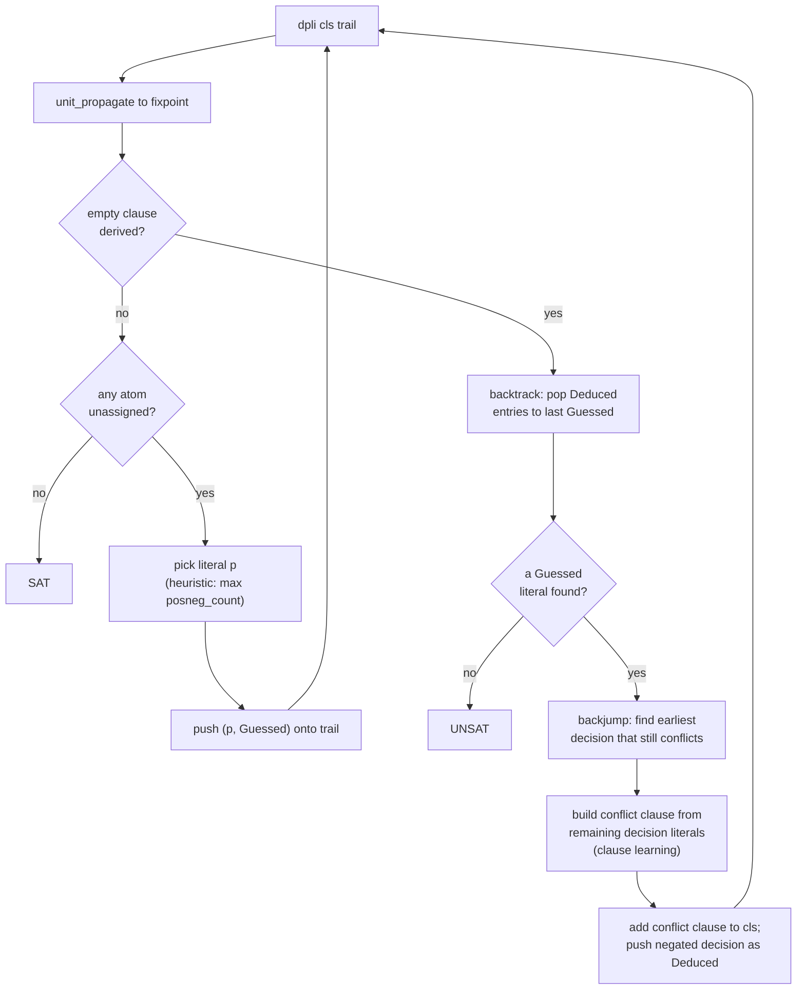
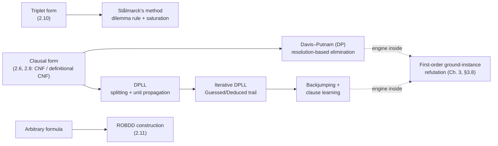

# Propositional Satisfiability Algorithms

[[book-guidelines|↩ Back to guidelines]]

## Why this section exists: tautology-checking doesn't scale

Everything up to this point in the chapter — CNF, DNF, the Tseitin transformation — was about *representing* propositional formulas efficiently. This section is about *deciding* them efficiently, which is a genuinely different problem. The naive algorithm you'd reach for first — evaluate the formula under all $2^n$ valuations of its atoms (`onallvaluations` in Harrison's OCaml, the same brute force that underlies a truth table) — is correct and simple, and it is also useless past a few dozen variables. Harrison makes this concrete before introducing any clever algorithm at all: he builds a generator for towers of genuinely hard tautologies (Ramsey-graph formulas, digital-circuit correctness statements, primality tests encoded as SAT instances) specifically so there is something to *fail* on, motivating everything that follows.

This matters for your project more than almost any other section in the book. Your CSP kernel's job — searching for counterexamples that violate a refinement type's invariant, checking a Hoare-triple side condition, testing whether an abstract-interpretation-generated invariant is actually inductive — is, underneath, repeatedly asking "is this formula (or constraint system) satisfiable?" DPLL's trail, its unit propagation, and its conflict-driven clause learning are the literal ancestors of the search loop you'll be writing in Rust. Read this section as a design document for that loop, not just history.

### What breaks without a better algorithm

Consider `prime 11`, one of Harrison's own running examples: a formula asserting that no factorization of 11 into $(n-1)$-bit numbers reproduces 11. Naive truth-table tautology-checking handles this, but slowly. As soon as you scale to `prime 101` or a 9-bit multiplier correctness check, brute enumeration is off the table — not "slow," but cosmically slow, because the search space is exponential in the number of atoms and brute force does not prune it at all. Every algorithm in this section is a different strategy for pruning that space without losing completeness.

---

## 1. Why propositional logic is worth grinding on: NP-completeness and the SAT reduction target

Before the algorithms, Harrison spends section 2.7 establishing *why* SAT deserves this much engineering effort — because an enormous range of practical problems reduce to it.

**Ramsey's theorem as SAT.** For fixed $s, t, n$, `ramsey s t n` builds a formula that's a tautology exactly when every graph on $n$ vertices contains a completely-connected subgraph of size $s$ or a completely-disconnected one of size $t$. This is a nice small stress test — `ramsey 3 3 6` is a tautology, `ramsey 3 3 5` isn't, confirming $R(3,3) = 6$ — but it also already breaks naive `tautology` at only slightly larger parameters.

**Digital circuits and arithmetic.** This is the payload that matters most for your project, so worth walking through the encoding in detail:

- A **half-adder** ($x, y \to s, c$) is just `Iff(s, Iff(x, Not y))` for the XOR sum and `And(x,y)` for the carry.
- A **full-adder** chains half-adders to handle carry-in: `sum x y z = halfsum (halfsum x y) z`.
- An **n-bit ripple-carry adder** is `n` full-adders wired carry-to-carry — literally a `conjoin` (big AND) over `0 -- (n-1)` of per-bit full-adder constraints, each constraint an `Iff` pinning an output bit to its arithmetic definition.
- A **carry-select adder** computes each $k$-bit block twice (once assuming carry-in 0, once assuming carry-in 1) and multiplexes the correct one in using `mux sel in0 in1 = Or(And(Not sel,in0),And(sel,in1))` — this is exactly a hardware if/then/else compiled into a Boolean formula, the same primitive you'll want for compiling conditional program semantics into your SMT-adjacent encodings.
- **Multiplication** is built from repeated `rippleshift` (an adder that also shifts a carry row), producing the schoolbook long-multiplication layout as nested conjunctions.
- **Circuit-equivalence verification** falls straight out: `mk_adder_test n k` builds a formula asserting that a ripple-carry adder and a carry-select adder agree on all inputs — and checking this is a tautology is architecturally identical to what a hardware or compiler-optimization equivalence checker does. This is the paradigm case for "compile your verification condition to a propositional/SMT formula and hand it to a solver" that your CHC-based invariant checker will eventually rely on.
- **Primality testing**: `prime p` asserts $\lnot\exists$ a factorization of $p$ representable in the right bit-width, itself built from the `multiplier` circuit plus a `congruent_to` predicate pinning specific bits. This shows that even *number-theoretic* claims compile down to propositional SAT once you fix a bit-width — the same idea underlies bounded model checking and bit-blasting in SMT.

**NP-completeness and P vs NP.** Cook (1971) showed SAT is NP-complete: a solver for it is (up to polynomial overhead) a solver for *every* problem in NP, and conversely SAT is exactly as hard as the hardest of them. Harrison is explicit that every algorithm in this section is still worst-case exponential — the whole discipline of "practical" SAT solving is heuristic engineering *within* an unavoidable exponential worst case, not a way around it. This is the complexity backdrop you should keep in mind for your own CSP kernel: propagation and learning make the *typical* case tractable, they do not (and cannot, unless P = NP) make the worst case tractable. NP-completeness is also why reducing a program-verification obligation to SAT/SMT is a legitimate strategy rather than a cop-out — you're reducing your problem to the same well-studied hard problem everyone else reduces to, and inheriting decades of engineering on that target.

---

## 2. The Davis–Putnam procedure (DP): satisfiability by elimination

Harrison is careful to separate two algorithms both casually called "Davis–Putnam": the original **Davis–Putnam (DP)** procedure (Davis and Putnam 1960), and the later **Davis–Putnam–Loveland–Logemann (DPLL)** variant (1962) that essentially all modern SAT solvers descend from. DP comes first historically and conceptually.

DP operates on **clausal form** — a formula in CNF represented as a set of sets of literals (the same `simpcnf`/`defcnfs` output from earlier in the chapter). Two degenerate cases matter: a clause set containing the *empty clause* represents $\bot$ (unsatisfiable), and the *empty set of clauses* represents $\top$ (trivially satisfiable). DP repeatedly rewrites the clause set via three satisfiability-preserving transformations, terminating when one of these degenerate cases is reached:

**Rule I — the 1-literal rule (unit propagation).** If some clause is a *unit clause* $\{p\}$ (a single literal), then $p$ must be true. Remove every clause containing $p$ (satisfied), and delete $\lnot p$ from every remaining clause (since $\lnot p$ can no longer be satisfied that way).

```
let one_literal_rule clauses =
  let u = hd (find (fun cl -> length cl = 1) clauses) in
  let u' = negate u in
  let clauses1 = filter (fun cl -> not (mem u cl)) clauses in
  image (fun cl -> subtract cl [u']) clauses1;;
```

**Rule II — the affirmative-negative rule (pure literal rule).** If some literal occurs only positively or only negatively across the whole clause set, every clause containing it can be deleted outright — such a *pure literal* can always be set to satisfy every clause it appears in, for free, without constraining anything else.

**Rule III — resolution / elimination of an atom.** This is the expensive one, and the one that gives the DP procedure its name. Given a literal $p$ occurring both positively and negatively, split the clause set into $\{p \lor C_i\}$, $\{\lnot p \lor D_j\}$, and clauses not mentioning $p$ at all ($S_0$). Then:

$$S \text{ is satisfiable} \iff S' = \{C_i \lor D_j \mid 1 \le i \le m,\ 1 \le j \le n\} \cup S_0 \text{ is satisfiable}$$

This is Theorem 2.11 in the book, and it is exactly **resolution**: $C_i \lor D_j$ is the *resolvent* of $p \lor C_i$ and $\lnot p \lor D_j$, "obtained by resolution on $p$." The 1-literal rule turns out to be a special case of resolution (subsumption followed by resolving out the unit), which is how Harrison proves Corollary 2.12 (unit propagation preserves satisfiability) for free from the resolution soundness proof.

The catch: resolving on $p$ can produce up to $m \times n$ new clauses from $m + n$ old ones — potentially quadratic blowup, repeated at every step. DP picks the resolution variable to minimize `resolution_blowup = m*n - m - n`, but this is a local greedy heuristic, not a guarantee; in the worst case DP's clause set explodes and exhausts memory before deciding anything. This blowup, empirically severe on the machines of 1960, is precisely what motivated DPLL.

```
let rec dp clauses =
  if clauses = [] then true else if mem [] clauses then false else
  try dp (one_literal_rule clauses) with Failure _ ->
  try dp (affirmative_negative_rule clauses) with Failure _ ->
  dp(resolution_rule clauses);;
```

---

## 3. DPLL: replacing resolution with a splitting rule

Davis, Logemann, and Loveland's 1962 fix keeps rules I and II unchanged but replaces rule III's *resolution* with a **splitting rule**: pick a literal $p$ and recursively decide satisfiability of $\Delta \cup \{p\}$ and $\Delta \cup \{\lnot p\}$ separately — $\Delta$ is satisfiable iff either branch is. Unlike resolution, splitting never grows the clause set; it only ever adds a single unit clause and then lets unit propagation clean up. Termination is easy to see: each split strictly reduces the number of remaining atoms.

```
let rec dpll clauses =
  if clauses = [] then true else if mem [] clauses then false else
  try dpll(one_literal_rule clauses) with Failure _ ->
  try dpll(affirmative_negative_rule clauses) with Failure _ ->
  let pvs = filter positive (unions clauses) in
  let p = maximize (posneg_count clauses) pvs in
  dpll (insert [p] clauses) or dpll (insert [negate p] clauses);;
```

The heuristic for *which* literal to split on picks the one occurring most often (`posneg_count`), on the theory that it triggers the most subsequent unit propagation. Harrison notes, with a footnote citing Liberatore (2000), that choosing the *optimal* split variable is provably about as hard as solving SAT itself — so every real implementation uses a heuristic, never an exact optimum. This is a recurring shape in constraint solving generally, and worth internalizing for your CSP kernel: variable-ordering heuristics for search are almost never "solved," only "empirically good," and you should budget engineering time for tuning them rather than expecting a closed-form answer.

**What breaks without splitting.** The recursive `dpll` above still has a hidden cost: every nested case-split keeps its own OCaml call frame and its own (implicitly copied) view of the modified clause set. For genuinely large problems this recursion depth and the implicit state it carries becomes the bottleneck — which is exactly why production solvers restructure the algorithm around an explicit, flat data structure instead.

### Iterative DPLL: the trail

This is the part of the chapter most directly relevant to a Rust implementation, because it is already phrased as an explicit data structure plus a loop rather than recursion — precisely the shape you want in a systems language without unbounded native-stack recursion.

Rather than mutating the clause set as you descend into case-splits, you keep the **original clauses fixed** and record every current assumption on a **trail**: a list of `(literal, flag)` pairs, most-recent-first, where the flag distinguishes:

- **`Guessed`** — a literal chosen by the splitting rule (a genuine choice point, a place you can backtrack to),
- **`Deduced`** — a literal forced by unit propagation from earlier trail entries (not a choice point).

```
type trailmix = Guessed | Deduced;;
```

This Guessed/Deduced tag is exactly the distinction your CSP kernel will need between *branching decisions* and *propagated consequences* — it's the piece of bookkeeping that makes backjumping (below) and, more generally, any conflict-directed search possible at all. In Rust this is a natural sum type:

```rust
#[derive(Clone, Copy, PartialEq, Eq)]
enum Reason {
    Guessed,               // a branching decision — a real backtrack point
    Deduced,               // forced by unit propagation
}

struct TrailEntry {
    lit: Literal,
    reason: Reason,
}

struct Trail {
    entries: Vec<TrailEntry>,   // most-recent-last, unlike Harrison's list-based reverse order
}
```

Unit propagation to a fixpoint (`unit_subpropagate`) filters clauses against everything already on the trail, and repeats until either no new units appear or the empty clause is derived:

```
let rec unit_subpropagate (cls,fn,trail) =
  let cls' = map (filter ((not) ** defined fn ** negate)) cls in
  let uu = function [c] when not(defined fn c) -> [c] | _ -> failwith "" in
  let newunits = unions(mapfilter uu cls') in
  if newunits = [] then (cls',fn,trail) else
  let trail' = itlist (fun p t -> (p,Deduced)::t) newunits trail
  and fn' = itlist (fun u -> (u |-> ())) newunits fn in
  unit_subpropagate (cls',fn',trail');;
```

`backtrack` pops `Deduced` entries off the trail until it hits the most recent `Guessed` literal (or empties out entirely):

```
let rec backtrack trail =
  match trail with
    (p,Deduced)::tt -> backtrack tt
  | _ -> trail;;
```

And the main loop `dpli` does: propagate to fixpoint; if that derives $\bot$, backtrack to the last decision and flip it to `Deduced` (so the *next* conflict backtracks past it instead of re-flipping it forever — this is what prevents infinite loops); otherwise pick an unassigned atom and push a fresh `Guessed` literal.

```
let rec dpli cls trail =
  let cls',trail' = unit_propagate (cls,trail) in
  if mem [] cls' then
    match backtrack trail with
       (p,Guessed)::tt -> dpli cls ((negate p,Deduced)::tt)
    | _ -> false
  else
       match unassigned cls trail' with
         [] -> true
       | ps -> let p = maximize (posneg_count cls') ps in
               dpli cls ((p,Guessed)::trail');;
```

Note the loop structure: `cls` (the original problem) never changes; only `trail` grows and shrinks. This is precisely the "trail-based DPLL/CDCL loop" pattern you'll build for your CSP kernel — decide, propagate, on conflict analyze-and-backtrack, repeat — and it generalizes past pure SAT: constraint propagation over richer domains (intervals, DFA-shaped domains for your abstract data structure encodings) is unit propagation's natural generalization, still organized around the same "trail of decisions plus their propagated consequences" skeleton.

### Backjumping and clause learning: the load-bearing part for your CEGAR loop

Plain chronological backtracking (flip the most recent decision, try again) has an obvious inefficiency, which Harrison illustrates directly: suppose you nest case-splits over $p_1, \dots, p_{10}$ in order, all assumed true, and the clauses $\lnot p_1 \lor \lnot p_{10} \lor p_{11}$ and $\lnot p_1 \lor \lnot p_{10} \lor \lnot p_{11}$ force a conflict — but that conflict only actually depends on $p_1$ and $p_{10}$, not on $p_2, \dots, p_9$ at all. Chronological backtracking will nonetheless re-explore the $p_{10}$ branch separately under *every* combination of $p_2, \dots, p_9$, wasting enormous amounts of work on a distinction that never mattered.

**Backjumping** fixes this by looking backward through the trail for the earliest decision point that still reproduces the conflict, and jumping straight there instead of one level at a time:

```
let rec backjump cls p trail =
  match backtrack trail with
    (q,Guessed)::tt ->
        let cls',trail' = unit_propagate (cls,(p,Guessed)::tt) in
        if mem [] cls' then backjump cls p tt else trail
  | _ -> trail;;
```

**Clause learning** goes one step further: instead of just jumping past the irrelevant decisions, it *records* the discovered conflict as a brand-new clause — the negation of the conjunction of the decision literals that actually caused it — and adds that clause permanently to the problem:

```
let rec dplb cls trail =
  let cls',trail' = unit_propagate (cls,trail) in
  if mem [] cls' then
    match backtrack trail with
       (p,Guessed)::tt ->
         let trail' = backjump cls p tt in
         let declits = filter (fun (_,d) -> d = Guessed) trail' in
         let conflict = insert (negate p) (image (negate ** fst) declits) in
         dplb (conflict::cls) ((negate p,Deduced)::trail')
    | _ -> false
  else
    match unassigned cls trail' with
       [] -> true
    | ps -> let p = maximize (posneg_count cls') ps in
             dplb cls ((p,Guessed)::trail');;
```

Harrison reports roughly a 4× speedup from this on a `prime 101` benchmark — and this is with a deliberately "trivial" conflict-analysis strategy that just skips a contiguous run of guesses. He notes explicitly that real solvers do much better with proper conflict analysis that works backward through the implication graph and "explains" the conflict clause-by-clause (what the wider SAT literature calls **first-UIP learning**), plus techniques like periodic restarts that keep learned clauses while discarding the current search state entirely.

**Why this is directly load-bearing for your compiler project.** Clause learning is CDCL's version of exactly the move your CEGAR (counterexample-guided abstraction refinement) loop needs to make: when a candidate invariant or a counterexample search fails for a *reason* that's smaller than the full context that produced it, you want to extract that minimal reason and feed it back in as a permanent constraint, so you never re-derive the same failure from a different superset of context. An **unsat core** (mentioned at the end of §2.9 — a minimal subset of clauses whose conjunction is already unsatisfiable) is the SAT-level version of the same idea, and it's the mechanism underlying Craig interpolation and abductive clause generation for refinement-type inference: a learned clause *is* a cheap, syntactic interpolant between the decisions that caused a conflict and the clauses that detected it. When you build constraint propagation over richer domains (integers, DFA-shaped structured domains), keep the trail/Guessed-Deduced/backjump/learn skeleton as your organizing structure — it transfers almost unchanged.



---

## 4. Stålmarck's method: minimizing case-split depth via the dilemma rule

DPLL still nests case-splits arbitrarily deep. **Stålmarck's method** (Stålmarck and Säflund 1990, patented for commercial use) takes a structurally different approach: instead of a fully general "guess and propagate" recursion, it tries to extract as much information as possible from *shallow* case-splits, using a **dilemma rule** that mines the two branches of a split for their common conclusions before ever nesting deeper.

**The dilemma rule.** Suppose you have "simple" deduction rules $R$ generating logical consequences of a formula set. The dilemma rule case-splits over a literal $p$: from $\Delta \cup \{\lnot p\}$, applying $R$ exhaustively yields $\Delta_0$; from $\Delta \cup \{p\}$, it yields $\Delta_1$. Anything in *both* $\Delta_0$ and $\Delta_1$ is a consequence of $\Delta$ alone — true regardless of $p$ — so it can be added to $\Delta$ directly, no case-split needed to keep it:

$$
\Delta \;\xrightarrow{\text{split on } p}\; \big(\Delta \cup \{\lnot p\} \xrightarrow{R} \Delta \cup \Delta_0\big),\; \big(\Delta \cup \{p\} \xrightarrow{R} \Delta \cup \Delta_1\big) \;\longrightarrow\; \Delta \cup (\Delta_0 \cap \Delta_1)
$$

**Saturation levels.** Exhaustively applying the simple rules alone (no splitting) is **0-saturation**, $S_0$. Repeatedly applying the dilemma rule *using* $S_0$ as the inner simple-rule set, until no more progress, is **1-saturation** $S_1$; in general $(n{+}1)$-saturation $S_{n+1}$ nests the dilemma rule one level deeper, using $S_n$ inside each branch. A formula decidable at saturation level $n$ is **$n$-easy**; if it needs exactly $n$ (not $n{-}1$), it's **$n$-hard**. The appeal: Harrison notes (citing Stålmarck 1994a) that an $n$-easy formula with $|p|$ connectives is decidable in time $O(|p|^{2n+1})$ — and empirically, many practically important formula classes (notably digital-circuit correctness conditions, the same adder-equivalence formulas from §2.7) turn out to be 0- or 1-easy, i.e. need almost no nested branching at all, which is precisely where DPLL's naive splitting heuristic can degrade badly.

**Representation: triplets, not clauses.** Stålmarck's method doesn't work over CNF clauses. It reduces the formula to a conjunction of **triplets** $l_i \Leftrightarrow l_j \otimes l_k$ — the same Tseitin-style "introduce a name for every subformula" idea as definitional CNF (§2.8), but stopping one step earlier, before the final CNF expansion of each definition.

The **simple rules** then propagate equivalences $p \Leftrightarrow q$ (where $p, q$ can be $\top$, $\bot$, or literals) through a triplet. For example, given a triplet $p \Leftrightarrow q \land r$:

- knowing $r \Leftrightarrow \top$ lets you deduce $p \Leftrightarrow q$;
- knowing $p \Leftrightarrow \top$ lets you deduce $q \Leftrightarrow \top$ and $r \Leftrightarrow \top$;
- knowing $q \Leftrightarrow \bot$ lets you deduce $p \Leftrightarrow \bot$;
- knowing $q \Leftrightarrow r$ lets you deduce $p \Leftrightarrow q$ and $p \Leftrightarrow r$;
- knowing $p \Leftrightarrow \lnot q$ lets you deduce $p \Leftrightarrow \bot$, $q \Leftrightarrow \top$, $r \Leftrightarrow \bot$.

Harrison's implementation derives this table of implications *automatically* for each of the four triplet shapes ($\land, \lor, \Rightarrow, \Leftrightarrow$) by literally calling the `tautology` checker over all candidate equivalence pairs (`triggers`), rather than hand-enumerating cases — a nice example of bootstrapping a fast decision procedure's rule table using a slow one, offline.

**Union-find for equivalence classes.** Because the simple rules only ever produce *equivalences* between literals (never full clauses), the natural data structure is **union-find**: `equate2` merges two literals' classes while simultaneously merging their negations' classes (identifying $p \equiv q$ forces $\lnot p \equiv \lnot q$). A contradiction is detected the moment some literal's class becomes equal to its own negation's class — at which point $\top$ and $\bot$ get unified, a sentinel `truefalse` checks for.

**0-saturation (`zero_saturate`)** repeatedly applies `equatecons` — which does the union-find merge and figures out which *new* consequences follow from the merge via a `relevance` index mapping each literal to the triplet-triggers it participates in — until no new equivalences are generated.

**Higher saturation (`saturate`/`splits`)** case-splits over each remaining variable, $(n{-}1)$-saturates each branch, and *intersects* the two resulting equivalence-class partitions (`stal_intersect`/`inter`) to keep only what both branches agree on — this intersection-of-partitions step is the concrete implementation of "$\Delta_0 \cap \Delta_1$" from the dilemma rule above.

The top-level `stalmarck` function negates the goal formula, triplet-izes it, asserts the whole thing equal to $\top$, and saturates up to a fixed limit (2, in Harrison's driver) — succeeding early if a contradiction falls out, and *failing* (not returning `false`!) if the limit is exhausted without deciding, since bounded saturation is a **sound but not complete** test at any fixed $n$ (every formula with $n$ atoms is provably $n$-easy, so completeness only holds once you saturate up to the full atom count). On `mk_adder_test 6 3` it needs only 0- through 2-saturation and confirms the circuit-equivalence tautology — degrading, Harrison notes, "much more gracefully with size" than `dplltaut` on this problem class, though for genuinely *non*-tautologous formulas DPLL-style splitting tends to be more effective, motivating hybrid designs that combine saturation with DPLL splitting.

**Why this matters for your project even though you probably won't implement Stålmarck's method itself:** the dilemma rule is a clean instance of a more general pattern — *extract what's invariant across a case split before descending further* — that shows up again in your abstract-interpretation work as "widening at a join point" and in CEGAR as "generalize a spurious counterexample refutation before refining the abstraction." The saturation-level idea (bound how deep nested reasoning needs to go, and many real problems need almost none) is also a useful intuition to carry into tuning your own CSP kernel's search depth heuristics.

---

## 5. Binary decision diagrams: satisfiability by canonical normal form

DPLL and Stålmarck's method both search. **Binary decision diagrams (BDDs)** take an entirely different approach: compile the formula into a canonical graph representation from which satisfiability, tautology-checking, and even *equivalence-checking* fall out as trivial graph inspection, with no search at all.

**From decision tree to DAG.** Picture the $2^n$ valuations of atoms $p_1, \ldots, p_n$ as root-to-leaf paths through a binary tree: at a node labelled $p$, go left if $p$ is true, right if false, and label each leaf T or F according to whether the formula holds there. That's just a trace of the formula's full truth table. Two compressions turn this into a **binary decision diagram**:

1. **Redundant-node elimination**: if a node's left and right subtrees are identical, replace the node with that subtree (the variable doesn't matter here).
2. **Subtree sharing**: collapse structurally identical subtrees into one node, turning the tree into a directed acyclic graph.

If, in addition, every path respects a single **fixed variable ordering**, the result is a **reduced ordered BDD (ROBDD)** (Bryant 1986) — and, crucially, this representation is **unique** for a given formula and ordering. That uniqueness is the entire payoff: checking whether two Boolean expressions (with the same variable order) are equivalent reduces to checking their BDDs are the same graph (isomorphism up to the canonical construction — in practice, identical node identity, since the construction is bottom-up and shared), and checking tautology reduces to checking the BDD is literally the single node `T`.

**Complement edges.** A further refinement (Madre and Billon 1988; Brace, Rudell and Bryant 1990) tags each edge with an optional negation marker. This buys two things: negating an entire BDD becomes $O(1)$ — just flip the top-level tag, no graph rewriting — and only *one* terminal node (`true`) is needed, since `false` is just a complement edge into `true`. The cost is that canonicality needs an extra normalization convention (Harrison's implementation always keeps the "true" branch of any node uncomplemented, rewriting the four ambiguous equivalent forms into one canonical form on construction).

**Implementation shape** (this is worth studying closely as a Rust data-structure template, since it's essentially a hash-consing scheme):

- Each node is `(propositional variable, left-index, right-index)` — indices into a shared table, negative index meaning "complemented."
- The **unique table** maps `node → index`, guaranteeing at most one physical node per distinct `(var, left, right)` triple — this *is* the mechanism that gives canonicality; every node-construction call (`mk_node`/`lookup_unique`) first checks whether an isomorphic node already exists before allocating a new one.
- The **computed table** memoizes results of binary operations like `bdd_and (m1, m2)` — purely a performance optimization (correctness doesn't depend on it), but without it, recomputing shared subresults would blow up exponentially even though the *representation* stays compact.
- `bdd_and` itself recursively descends both operands by their top variable in the fixed order — if the top variables match, recurse on both children pairwise; if they differ, "hold" the operand with the later variable constant and recurse only on the earlier one's children. `bdd_or`, `bdd_imp`, `bdd_iff` are all derived from `bdd_and` via De Morgan-style rewrites (e.g. `bdd_or bdc (m1,m2) = negate(bdd_and bdc (-m1,-m2))`), a nice illustration of how little primitive machinery a full Boolean-operation suite actually needs once conjunction and complementation are solid.

```rust
// A hash-consed ROBDD node table — the Rust shape of Harrison's unique/computed tables.
use std::collections::HashMap;

type NodeId = i32; // negative = complemented edge; 1 = true terminal, -1 = false

#[derive(Clone, Copy, PartialEq, Eq, Hash)]
struct BddNode { var: VarId, lo: NodeId, hi: NodeId }

struct BddStore {
    unique: HashMap<BddNode, NodeId>,   // canonicality: one physical node per shape
    nodes: Vec<BddNode>,                // index -> node, mirrors `expand`
    computed_and: HashMap<(NodeId, NodeId), NodeId>, // memoized bdd_and results
    next_id: NodeId,
}

impl BddStore {
    fn mk_node(&mut self, n: BddNode) -> NodeId {
        if n.lo == n.hi { return n.lo; }               // no real decision here
        if let Some(&id) = self.unique.get(&n) { return id; }
        let id = self.next_id; self.next_id += 1;
        self.nodes.push(n);
        self.unique.insert(n, id);
        id
    }
}
```

**Practical performance note — "exploiting definitions."** Harrison shows `bddtaut` beating `dplltaut` handily on small adder-correctness tests, but degrading badly on larger ones like a 9-bit multiplier check, *because* those formulas were themselves built from a chain of definitions $x_i \Leftrightarrow E_i$ (the same style as definitional CNF). A BDD already shares common subexpressions structurally, so instead of naively inlining every definition into one monolithic formula, `ebddtaut` sorts the definitions into dependency order (`sort_defs`, careful about cyclic definitions like $x \Leftrightarrow y \land r,\; y \Leftrightarrow x \lor s$) and builds each definition's BDD once, substituting its node directly wherever the definition-atom is later used (`mkbdde`/`mkbdds`) rather than re-expanding the definition's formula text at every use site. This is exactly the same "compile once, reference by handle" discipline you'd want in your elaborator for shared subterms/metavariable instantiations — inlining destroys sharing and can turn a linear-size problem into an exponential one, and BDD construction is a very literal demonstration of that failure mode and its fix.

**Where BDDs stop being the right tool.** ROBDDs are exponential in the worst case too (in fact any function requiring superpolynomial DNF, or with the "wrong" variable ordering, can blow up), and the classic bad case is multiplication — worth remembering when reaching for a decision procedure. They shine on structured Boolean functions with locality in the variable dependencies (which most digital circuits and many "shallow" verification conditions have) and are a poor fit for genuinely unstructured or arithmetic-heavy Boolean functions, where CDCL-style SAT search or dedicated arithmetic decision procedures (Presburger, bit-vector theories in SMT) do better.

---

## Where this leads

Structurally, within the book: DP/DPLL and the resolution rule reappear almost unchanged as the propositional engine inside first-order theorem proving in Chapter 3 (§3.8, `dp_loop`, deciding satisfiability of ground instances via Herbrand's theorem) — the propositional decision procedure here is the inner loop that first-order provers repeatedly invoke on growing sets of ground instances. Definitional CNF (§2.8, deliberately excluded from this article) is the encoding layer that feeds all three algorithms here their input; the compactness theorem (§2.12) is the semantic fact — every finite subset satisfiable implies the whole (possibly infinite) set satisfiable — that these *finite* decision procedures are implicitly leaning on whenever they're lifted to justify reasoning about infinite theories later in the book.



For your compiler project specifically, this section is close to load-bearing rather than background reading:

- **The Guessed/Deduced trail is the direct template for your CSP kernel's search state.** Whatever richer domains you propagate over (integer intervals, DFA-shaped abstract domains for structured data), the decide/propagate/conflict/backjump/learn skeleton from iterative DPLL is the control structure to build around, not something to reinvent.
- **Clause learning is your first working model of abductive constraint generation.** A learned clause is a syntactically-derived, minimal explanation of a failure — structurally the same move as extracting a Craig interpolant or an abduced precondition, just computed by resolution instead of interpolation. If your refinement-type inference needs to synthesize a missing hypothesis from a failed proof attempt, "what does DPLL's conflict clause construction do" is a good first mental model even before you get to genuine interpolation-based methods later in the book (§5.13).
- **BDDs are the standard tool for canonical Boolean invariant representation** — if any part of your abstract-interpretation domain needs a canonical, mergeable representation of a Boolean predicate (e.g. characterizing a set of reachable states, or a path condition in symbolic execution), ROBDDs are the classical answer, and the unique-table/computed-table hash-consing pattern here is directly reusable for any hash-consed term representation you build for your elaborator's expression DAGs, not just Boolean formulas.
- **NP-completeness is the honest ceiling.** Every one of these algorithms is worst-case exponential; the entire value of DPLL heuristics, Stålmarck's saturation levels, and BDD variable-ordering choices is in shifting the typical case, not the asymptotic one. Budget your CSP kernel's engineering effort accordingly — correctness first, then heuristic tuning, and expect to revisit variable/branch ordering repeatedly rather than solving it once.
