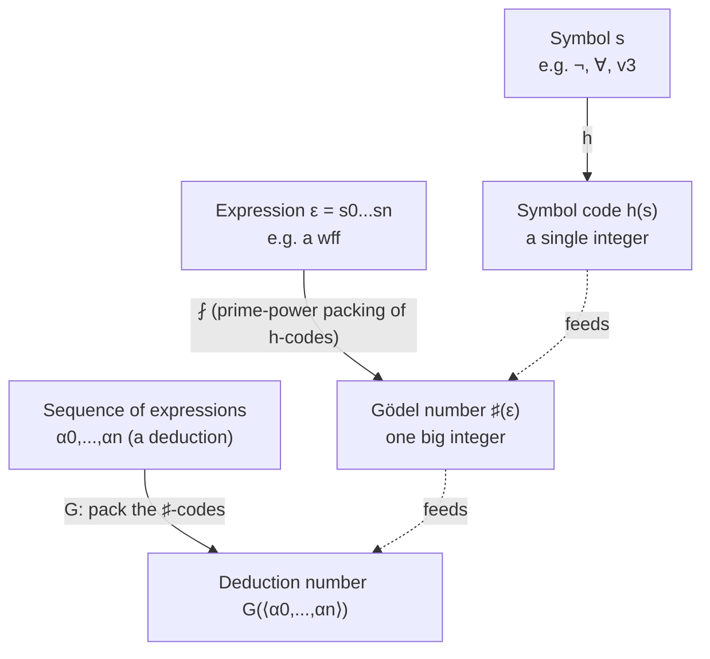

# Arithmetization of Syntax

[[book-guidelines|↩ Back to guidelines]]

## Why the logic needs to talk about itself

Up through Chapter 2, Enderton's formal language and the meta-language used to *talk about* it (English, dressed up with set theory) are strictly separate. The formal language has wffs; English has sentences describing those wffs ("$\alpha$ is a term," "$D$ is a deduction from $\Gamma$"). That separation is safe and comfortable, but it has a ceiling: a formal theory of *numbers* can only ever say things about numbers. It cannot, as stated, say anything about formulas, deductions, or proofs — those are a different kind of object entirely, living in the meta-language.

Chapter 3 needs to break that ceiling. Its target is Gödel's incompleteness theorems, and the engine behind them (the Fixed-Point Lemma, coming in Section 3.5) needs a formula of number theory that can, in effect, refer to *itself*. That's impossible if "formula," "deduction," and "$\varphi$ is provable" are concepts that only exist in English. You cannot build a self-referential sentence about arithmetic out of vocabulary that has no way to mention sentences.

Section 3.4 is the fix. Its move is deceptively simple: encode every syntactic object — symbol, expression, sequence of expressions, deduction — as a single natural number. Once that's done, "$\alpha$ is a wff" stops being a fact about symbol-strings and becomes a fact about the number $\sharp\alpha$ — specifically, a fact about which set that number belongs to. And because number theory's axiom set $A_E$ (introduced in Section 3.3) is strong enough to *represent* facts about natural numbers as formulas the theory can prove or refute, "$\alpha$ is a wff" ends up expressible *inside* the formal language itself, not just about it.

This is the arithmetization of syntax: turning statements about the language into statements *in* the language, by routing them through a numbering scheme. Everything else in the section is the (considerable) technical labor of proving that this routing actually works for every syntactic notion you'll need — term, wff, substitution, deduction, and so on.

**If you've built a compiler, you already know the shape of this problem**, even if you've never called it Gödel numbering. Any time you serialize an AST to bytes (or hash it to a `u64` for a memoization table), you're doing the same move: mapping structured syntax into a single flat value in a domain (integers, byte strings) that your other tools already know how to manipulate. The interesting technical content, both in `serde` and in Enderton's Chapter 3, is not the encoding step itself — it's proving that the encoding is *faithful* (decodable, unambiguous) and that the operations you care about on the original structure (parsing, well-formedness checking, substitution) survive translation into operations on the encoded form.

## Gödel numbering: symbols, expressions, sequences

### The intuitive picture

You want an injective (one-to-one) map from every finite piece of syntax down to a single natural number, in a way that's mechanically reversible — given the number, you can recover exactly the syntax it came from. The classical trick, going back to Gödel's 1931 paper, is:

1. Assign a distinct number to each *symbol* in your alphabet.
2. Encode a *string of symbols* as a single number built from the sequence of symbol-numbers, using unique prime factorization as the "container."
3. Encode a *sequence of strings* (e.g. a whole deduction, one wff per line) the same way, one level up — a sequence of already-encoded numbers, packed again.

The key enabling fact, silently doing all the work, is the Fundamental Theorem of Arithmetic: every positive integer factors into primes in exactly one way. That uniqueness is what makes the whole scheme decodable — it's the reason a Gödel number isn't just an ID, but a *self-describing container* you can take back apart.

### The book's construction

Enderton fixes a function $h$ (named in words: "the symbol-numbering function") assigning an integer to every symbol of the language. For the language of number theory (Table IX), the assignment is:

$$
\begin{array}{llll}
h(\forall) = 0 & h(() = 1 & h(0) = 2 & h()) = 3 \\
h(S) = 4 & h(\neg) = 5 & h(<) = 6 & h(\rightarrow) = 7 \\
h(+) = 8 & h(=) = 9 & h(\cdot) = 10 & h(v_1) = 11 \\
h(E) = 12 & & &
\end{array}
$$

with variables numbered $h(v_i) = 9 + 2i$ in general. Notice the parity split: parameters (non-logical symbols — quantifier, constants, function/predicate symbols) get *even* numbers, logical symbols ($($, $)$, $\neg$, $\rightarrow$, variables) get *odd* numbers. That parity distinction isn't decorative — it's what lets later proofs distinguish "this position holds a parameter" from "this position holds a logical symbol" by a simple evenness test on the number, without re-parsing anything.

For an expression $\varepsilon = s_0 \cdots s_n$ (a string of symbols $s_0$ through $s_n$), define its **Gödel number** $\sharp(\varepsilon)$ by:

$$
\sharp(s_0 \cdots s_n) = 2^{h(s_0)} \cdot 3^{h(s_1)} \cdots p_n^{h(s_n)}
$$

where $p_n$ is the $n$-th prime. (Enderton writes this as $\langle h(s_0), \ldots, h(s_n)\rangle$, the standard sequence-coding notation from Chapter 0 built the same way — successive primes raised to the sequence's entries.) His worked example: encoding $\exists v_3\, v_3 = 0$ — written out fully as $(\neg \forall v_3 (\neg (= v_3\ 0)))$ — produces

$$
\sharp(\exists v_3\, v_3 = 0) = 2^2 \cdot 3^6 \cdot 5^1 \cdot 7^{16} \cdot 11^2 \cdot 13^6 \cdot 17^{10} \cdot 19^{16} \cdot 23^3 \cdot 29^4 \cdot 31^4
$$

— a genuinely enormous number, on the order of $1.3 \times 10^{75}$, for one short formula. This is worth pausing on: Gödel numbers are *not* meant to be a practical serialization format. Nobody computes with them by hand. Their entire purpose is existence — showing that a faithful, decodable, arithmetic-only encoding of syntax exists at all, so that later proofs can quantify over "the number that encodes such-and-such formula" instead of over formulas directly.

Enderton then extends the scheme two more levels:

- To a *set of expressions* $\Sigma$, assign the set of Gödel numbers $\sharp\Sigma = \{\sharp(\varepsilon) \mid \varepsilon \in \Sigma\}$.
- To a *sequence of expressions* $\alpha_0, \ldots, \alpha_n$ (exactly the shape of a deduction — one line per formula), assign $G(\langle\alpha_0,\ldots,\alpha_n\rangle) = \langle \sharp\alpha_0, \ldots, \sharp\alpha_n\rangle$ — sequence-coding applied one more time, now to a sequence of *already-encoded* numbers.

This is a nested encoding, exactly like a `Vec<Vec<u8>>` flattened into one `Vec<u8>` with a length-prefix scheme, or a `serde_json::Value` tree flattened into a byte buffer: strings encode into numbers, sequences of strings encode into numbers-of-numbers, and the encoding composes cleanly because each layer only needs "how do I pack/unpack a finite sequence of naturals," answered once and reused.



**What breaks without unique factorization / injectivity.** If the encoding weren't injective (two different expressions mapping to the same number), then "the set of Gödel numbers of wffs" would stop determining a unique set of wffs — you could no longer recover the source syntax from the number, and every downstream claim ("$a$ is the Gödel number of a deduction of $\sigma$") would become ambiguous. This is exactly the property a hash function is explicitly *allowed* to give up (collisions are tolerated, because a hash is a summary, not a full encoding) but a Gödel number, or a `serde` serialization meant to be deserialized back, cannot give up. Gödel numbering is a full-fidelity encoding, not a digest.

## Recursively numbered languages: the effectiveness requirement

Enderton immediately generalizes past the one specific numbering $h$ he picked for the language of number theory, because the incompleteness results he's building toward need to apply to *other* theories too, in other languages. But he doesn't let just any numbering function qualify. He requires the language to be **recursively numbered**: there must be a one-to-one function $h$ from the language's parameters into the even numbers such that the two relations

$$
\{\langle k,m\rangle \mid k = h(\text{some } m\text{-place predicate parameter})\}
$$

$$
\{\langle k,m\rangle \mid k = h(\text{some } m\text{-place function symbol})\}
$$

are both **representable in** $\mathrm{Cn}\,A_E$ (see the "Where this connects" box below for what representability means).

This is the crux, and it's easy to skate past it as a technicality. Here's the point: it's not enough that a numbering scheme merely *exist* mathematically (any countable set has a bijection to $\mathbb{N}$ — that's trivial and useless). The numbering has to be **effective** — the theory itself has to be able to certify, for a given pair of numbers $\langle k, m\rangle$, whether $k$ is the code of some $m$-place predicate symbol. If that check isn't something $A_E$ can prove or refute, the entire arithmetization program stalls, because every later theorem in this section ("the set of Gödel numbers of terms is representable," "the set of Gödel numbers of wffs is representable," ...) is built by induction *on top of* this base case. A non-effective numbering is a broken foundation everything else is poured onto.

**Grounding this in compiler terms:** a "recursively numbered language" is the arithmetic-representability analogue of *decidable lexing* — the requirement that "is this token a valid identifier / keyword / of this arity" be a property your lexer can check in finite, mechanical time, not something that requires unbounded lookahead or oracle knowledge. If your token-classification function weren't decidable, you couldn't build a parser on top of it — you'd have no reliable base case for the induction a recursive-descent parser performs. Enderton's "recursively numbered" condition is exactly that same demand, phrased in the vocabulary of representable-in-$A_E$ rather than "decidable by an algorithm" (the two turn out to be provably equivalent — that equivalence is Theorem 34A, below).

For the concrete language of number theory $\mathfrak{N}$, this condition is trivially satisfied, because there are only finitely many parameters: the predicate-parameter set is just $\{\langle 6,2\rangle\}$ (the symbol $<$, arity 2) and the function-parameter set is $\{\langle 2,0\rangle, \langle 4,1\rangle, \langle 8,2\rangle, \langle 10,2\rangle, \langle 12,2\rangle\}$ (the symbols $0, S, +, \cdot, E$ with their respective arities). Finite sets are automatically representable, so the condition costs nothing here — but stating it in the general form is what lets the machinery of this section be reused, unmodified, for *other* theories with possibly-infinite parameter sets later in the book (and, implicitly, in generalizations beyond Enderton's book, such as arithmetized metatheory for other first-order languages).

## Representable syntactic relations: the technical heart

This is where the section spends most of its pages, and for good reason — it's the part that actually needs proving, not just defining. Enderton's target, stated up front: show that a long list of syntactic relations and functions — "is a variable," "is a term," "is an atomic formula," "is a wff," substitution, "is free in," "is a sentence," "is a generalization of," "is a tautology," "is a logical axiom," "is a deduction" — are all **representable in $\mathrm{Cn}\,A_E$**. (Representability itself — the machinery of $\rho$ representing a relation $R$ when $A_E \vdash \rho(S^{a_1}0,\ldots)$ correctly tracks membership — is Section 3.3's apparatus; this section is where that machinery gets exercised at scale on syntax specifically.)

### The recurring proof pattern

Nearly every item in this list follows the same shape, and once you see it once you can predict the rest:

1. The syntactic notion (e.g. "term") was defined **inductively** in Chapter 2 — a term is a variable, a constant, or $f$ applied to smaller terms.
2. Translate that inductive definition into a claim about the **characteristic function** $f$ of the corresponding set of Gödel numbers: $f(a) = 1$ if $a$ codes a term, $0$ otherwise. The inductive cases become disjuncts referencing $f$ applied to *smaller* numbers (the codes of the sub-terms).
3. The naive translation has an unbounded existential quantifier (searching over "the" decomposition of $a$ into its constituent codes) — Enderton writes this with the placeholder $\infty$. To apply **primitive recursion** (the technical tool Section 3.3 establishes for building new representable functions from old ones), every quantifier must be *bounded* by some function of $a$.
4. So each proof does real combinatorial work to find an explicit numeric bound. For terms, the bound is $a^{a^{\operatorname{lh} a}}$ (using $\operatorname{lh}$, "length," for sequence length) — derived from the observation that a sub-term's Gödel number can be at most as large as $a$ raised to a power bounded by $a$'s own length. This is genuinely fiddly bookkeeping, but it's mechanical, not deep: the encoding is "big" in a controlled way, and the growth is bounded by an explicit formula.
5. Once every quantifier is bounded, the relation defining $f$'s graph is built entirely from equality, bounded quantification, and substitution of already-representable functions/relations — closure operations Section 3.3 already proved preserve representability. So $f$ (hence the syntactic property it decides) is representable.

Concretely, the book runs this pattern for: Gödel numbers of variables (item 1, the base case — trivially bounded), terms (item 2, worked in full detail as the template), atomic formulas (item 3), wffs (item 4, four-clause induction mirroring the formula-building operations from Chapter 1/2), and then builds up substitution $\mathrm{Sb}$ (item 5, six clauses, "a complicated operation"), free occurrence $\mathrm{Fr}$ (item 7, defined cleverly as $\mathrm{Sb}(a,b,\sharp 0) = a$ — substituting $0$ for $b$ in $a$ changes nothing exactly when $b$ doesn't occur free), sentences (item 8), substitutability $\mathrm{Sbl}$ (item 9), generalization $\mathrm{Gen}$ (item 10), and — via a full re-derivation of truth-table semantics purely in terms of Gödel numbers (items 11.1–11.4) — tautologyhood itself (item 11). Items 12–17 show each of [[The-Deductive-Calculus-for-First-Order-Logic#The six groups of logical axioms|the six groups of logical axioms]] from the deductive calculus (Section 2.4) has a representable Gödel-number set, culminating in item 17: **the set of Gödel numbers of logical axioms is representable.**

**Rust framing, made precise.** This proof pattern is *exactly* the shape of writing a recursive-descent validator over a serialized/flattened AST representation, where each recursive call must provably terminate — the equivalent of Rust's borrow checker or a `fuel`-parameter pattern guaranteeing no infinite recursion. A sketch:

```rust
// A conceptual sketch, not literal Enderton machinery — but the same shape.
// `code: u64` stands in for a Gödel number (in the book, unboundedly large;
// here, bounded, to make the analogy concrete).
fn is_term_code(code: u64, bound: u64) -> bool {
    if bound == 0 {
        return false; // fuel exhausted: no infinite regress allowed
    }
    if is_variable_code(code) {
        return true;
    }
    // Try to decode `code` as (function_symbol_code, arg_codes...)
    if let Some((f_code, arity, arg_codes)) = try_decode_application(code) {
        return is_function_symbol_code(f_code, arity)
            && arg_codes.iter().all(|&c| is_term_code(c, bound - 1));
        //                                                  ^^^^^^^^^^
        // this decrement is doing the same job as Enderton's explicit
        // numeric bound a^(a^(lh a)) — it's what makes the recursion
        // a legitimate primitive recursion instead of an open-ended search
    }
    false
}
```

The `bound` parameter here is doing, structurally, exactly what Enderton's $a^{a^{\operatorname{lh} a}}$ bound does: it converts a semantically-obvious-but-formally-illegal unbounded recursion into one that a total, primitive-recursive (in Rust: provably-terminating) function can perform. **What breaks without the bound:** without it, you don't have primitive recursion — you have general recursion, which needs a separate (and much harder) apparatus, minimization, to justify formally, and which is not even guaranteed representable at all in the naive sense Section 3.3 built up. The entire "is this a valid term" check would stop being something the theory can certify as always terminating, which is fatal to the whole program: you need *every* syntactic notion in this list to be decidable/representable, unconditionally, not just "usually terminates."

**Lean connection.** Lean's kernel faces this exact problem when it needs to decide definitional equality or reduce an `Expr` to whnf: it must guarantee termination of what is conceptually an unbounded search over possible reduction sequences, which is why Lean's kernel reduction is carefully structured (fuel-bounded unfolding, well-founded recursion certificates) rather than a naive recursive walk. The Gödel-numbering proofs here are the historical ancestor of that same discipline: "this operation over syntax must be *provably* total," not just empirically well-behaved.

### Coding deductions

The payoff item is **18**: for a finite set of formulas $A$, the set

$$
\{G(D) \mid D \text{ is a deduction from } A\}
$$

is representable (in fact representable whenever $\sharp A$ itself is). A number $d$ belongs to this set iff $d$ is a (coded) sequence of positive length and, for every position $i < \operatorname{lh}\,d$, the $i$-th line is either (1) a member of $\sharp A$, (2) the Gödel number of a logical axiom, or (3) obtainable from two earlier lines by modus ponens — i.e. there exist earlier positions $j, k < i$ such that line $j$ has the shape "(line $k$ $\rightarrow$ line $i$)." This is a direct arithmetization of [[Interpretations-Between-Theories#The definition|the definition]] of a deduction from Section 2.4 (a finite sequence where every line is an axiom, a premise, or follows from earlier lines by MP) — nothing conceptually new, just cashing in everything proved above: "is a logical axiom" (item 17) and pattern-matching the implication shape are both already representable, so their finite conjunction/disjunction over a bounded range is too.

This is the crux move for everything that follows in the chapter. It says: **"there is a proof of $\sigma$ from $A$" is not just an English statement — it is, via Gödel numbering, an arithmetic statement about the existence of a certain number**, namely $\exists d\, [d \text{ satisfies the item-18 predicate and the last line of } d \text{ codes } \sigma]$. Once "provable" has been turned into "there exists a witnessing number with property $P$," the theory of arithmetic can meaningfully quantify over proofs, which is precisely the ingredient the Fixed-Point Lemma (Section 3.5) needs to build a sentence that asserts something about its own provability.

Item 19 then closes the loop the other direction and states the section's real theorem:

> **Theorem 34A.** A relation is recursive iff it is representable in the theory $\mathrm{Cn}\,A_E$.

(Recursive here means: decidable by the "deduce-until-you-find-an-answer" procedure that runs the item-18 deduction-search relation until it hits either $\rho$ or $\neg\rho$ applied to the numeral — guaranteed to terminate because *some* such deduction always exists for a genuinely recursive relation.) This equivalence is exactly the "decidable check ⇔ representable-in-the-theory" correspondence gestured at above for recursively numbered languages, now proved in full generality. From here on, Enderton simply says "recursive" in place of "representable" — the two notions have been shown to coincide.

**Item 20**, quietly, is a preview of the limits still ahead: for a set $A$ with recursive $\sharp A$, the *consequence set* $\sharp\,\mathrm{Cn}\,A$ (Gödel numbers of everything provable from $A$) is defined by an *unbounded* existential — "there exists some deduction $d$ ending in $a$" — and Enderton flags explicitly that no general bound on $d$ is available. $\sharp\,\mathrm{Cn}\,A$ is only guaranteed to be the *domain of a recursive relation* (what the book will later name **recursively enumerable**): you can verify a proof once you have it, but you cannot, in general, bound how long you'll have to search before finding one (or conclude, from not yet having found one, that none exists). This asymmetry — checkable-when-found versus decidable-in-advance — is exactly the semidecidability gap that later drives the undecidability results, and it's worth naming now because it recurs everywhere in verification tooling: type-checking (checking a supplied proof term) is comparatively cheap; *finding* the proof term (proof search) is where the wall is.

## Where this connects to what you're building

This section is not incidental scaffolding — it is the historical prototype of a move your automated-theorem-prover project needs at a mechanism level: **representing syntax (terms, formulas, proofs) as data the logic itself can quantify over and reason about**, rather than data that only exists at the meta-level, outside the system.

Concretely, three things transfer directly:

- **The encode/decode discipline.** A Rust verifier that wants to support any form of reflection or self-checking (e.g. "does this term satisfy invariant $P$" checked *inside* your system, not just by your Rust host code around it) needs exactly what Gödel numbering provides: an injective, mechanically decodable mapping from your `Term`/`Expr` AST into a domain your core logic can natively manipulate (integers here; in a real system, often a `Vec<u8>`, a `u64` hash used carefully, or an arena index). The representability proofs in this section are the template for proving your encoding is *faithful* — that structural properties of the AST (well-formedness, "is this a valid substitution instance") survive translation into properties of the encoded form that your checker can decide.
- **The bounded-recursion discipline.** Every representability proof here hinges on finding an explicit numeric bound to convert an unbounded existential into primitive recursion. This is precisely the discipline a Rust proof-term checker needs: every recursive traversal over terms/proofs must be provably terminating (structural recursion, explicit fuel, or a well-founded measure) — not "trust it happens to halt."
- **The checkable-vs-searchable asymmetry (item 20).** The gap between "$\sharp\,\mathrm{Cn}\,A$ is r.e. but maybe not recursive" is the proof-checking/proof-search distinction your embedded theorem prover will live inside: your checker only needs the *representable* (decidable) side — verifying a supplied deduction is fast and total — while search for that deduction is the genuinely hard, possibly-unbounded part. Keeping those two roles architecturally separate (a small trusted checker, a larger untrusted search/tactic layer) is the direct engineering payoff of understanding why item 18 is representable but item 20, in general, is not.

The connection to the metavariable-unification elaborator is lighter but real: encoding terms as flat, hashable/comparable data (so a unifier can cheaply compare or memoize on term identity) is the same underlying idea — data-ify the syntax so other machinery can operate on it uniformly — even though the elaborator's concerns (occurs-checks, metavariable scoping) are otherwise a different problem.

## Where this leads

Section 3.4 supplies the load-bearing apparatus for everything else in Chapter 3:

- **Section 3.5 (Incompleteness and Undecidability)** uses the fact that "provable from $A$" is now an arithmetic $\exists$-statement (item 18/20) to build the Fixed-Point Lemma — a sentence $\sigma$ such that $A_E \vdash \sigma \leftrightarrow \beta(S^{\sharp\sigma}0)$, i.e. $\sigma$ asserts $\beta$ holds of *its own* Gödel number. That's only meaningful because Section 3.4 established that "having a certain Gödel number" and "being provable" are both expressible, representable facts of arithmetic. From there: Tarski's Undefinability Theorem, Gödel's First Incompleteness Theorem, and the undecidability of $\mathrm{Th}\,\mathfrak{N}$ all follow.
- **The next article, "[[Representability-and-Recursive-Functions|Representability and Recursive Functions]],"** picks up Section 3.3/3.6's broader theory of what "recursive" means (primitive recursion, minimization, Church's thesis, universal machines) — this section is where that abstract machinery got its first serious workout, applied specifically to syntax.
- **"Gödel's Incompleteness Theorems"** (the article after that) is the payoff: the whole point of building Gödel numbering carefully enough to survive scrutiny was to make self-reference precise rather than a rhetorical trick — a sentence that "talks about itself" only because of what its Gödel number happens to encode, not because of any literal circularity in the syntax.

If you remember one thing from this section: **arithmetization is not a curiosity of 1931 mathematical logic — it's the same move as embedding an interpreter's AST as data the interpreter itself can inspect**, done under the much stricter constraint that every operation on that data must be certified total by the theory doing the reasoning, before you're allowed to trust any conclusion built on top of it.
