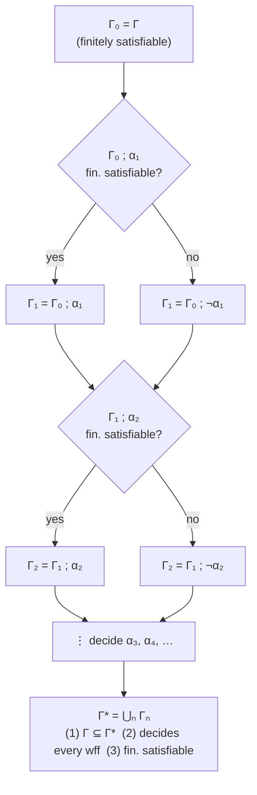
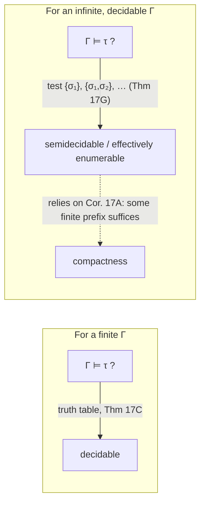

[[book-guidelines|↩ Back to guidelines]]

# Compactness for Sentential Logic

## The debt this section pays off

Back in Section 1.2, Enderton stated the Compactness Theorem and then walked away from it — "we defer the proof." The [[Sentential-Propositional-Logic|Sentential (Propositional) Logic]] article flagged this as a landmark planted early on purpose: *here is where all of this is going*. Section 1.7 is where the bill comes due.

Here's the claim again, precisely:

> **Compactness Theorem.** A set $\Gamma$ of wffs is satisfiable iff every finite subset of $\Gamma$ is satisfiable.

Say $\Gamma$ is **finitely satisfiable** iff every finite $\Gamma_0 \subseteq \Gamma$ is satisfiable. One direction of the theorem is free: if $\Gamma$ itself is satisfiable, some truth assignment $v$ satisfies everything in it, and in particular satisfies every finite subset — satisfiability trivially implies finite satisfiability. And if $\Gamma$ is already finite, the converse is trivial too, since $\Gamma$ is a finite subset of itself. All the content is in the case that actually matters: **an infinite, finitely satisfiable set is satisfiable.**

**What breaks without this.** Without compactness, "no single sentence in $\Gamma$ causes a problem, and no finite combination of them causes a problem" would tell you nothing about whether the *whole infinite collection* is jointly consistent. That's a genuinely surprising gap to close — finite satisfiability is a purely local, checkable property (you can truth-table any *finite* subset), while satisfiability of an infinite set asks for one truth assignment to work simultaneously against infinitely many constraints. The theorem says that gap doesn't actually exist for sentential logic: local consistency (finite pieces) forces global consistency (the whole set). That is exactly the kind of "something for nothing" result that later gets reused, in a structurally identical form, to build infinite models out of nothing but the assumption that no finite piece of a theory is contradictory — the discussion below returns to that in "Where this leads."

## Why the proof needs two acts

You cannot just point at a truth assignment and check it against infinitely many wffs at once — there's no such thing as directly inspecting an infinite object. Enderton's strategy is to convert the infinite problem into a form where a truth assignment can be read off *locally*, one sentence symbol at a time. The proof has two acts:

1. **Extend** the finitely satisfiable $\Gamma$ to a *maximal* finitely satisfiable set $\Gamma^*$ — one that already contains, for every wff $\alpha$, either $\alpha$ or its negation.
2. **Read off** a truth assignment $v$ directly from membership in $\Gamma^*$ (set $v(A) = T$ iff $A \in \Gamma^*$), and show by induction that $v$ satisfies exactly the wffs in $\Gamma^*$ — hence satisfies all of $\Gamma \subseteq \Gamma^*$.

The whole difficulty of the infinite case gets absorbed into step 1: building $\Gamma^*$. Step 2, once you have it, is almost mechanical.

### Act I: building $\Gamma^*$ by recursion on an enumeration

Since the set of sentence symbols — and hence the set of all expressions — is countable (Theorem 0B, from the [[Foundational-Set-Theoretic-Apparatus|Foundational Set-Theoretic Apparatus]] chapter), fix an enumeration of *all* wffs, $\alpha_1, \alpha_2, \alpha_3, \ldots$. Now build a chain of finitely satisfiable sets by recursion:

$$
\Gamma_0 = \Gamma, \qquad
\Gamma_{n+1} =
\begin{cases}
\Gamma_n \mathbin{;} \alpha_{n+1} & \text{if this is finitely satisfiable,} \\
\Gamma_n \mathbin{;} \neg\alpha_{n+1} & \text{otherwise.}
\end{cases}
$$

(Enderton's notation $\Gamma \mathbin{;} t$ just means $\Gamma \cup \{t\}$ — adjoining one element, carried over from Chapter Zero.) At each step you decide the fate of *one* wff $\alpha_{n+1}$: throw it in if that keeps things finitely satisfiable, otherwise throw in its negation instead. Exercise 1 of this section is the load-bearing fact that makes the recursion well-formed at all: **at least one of the two choices always keeps you finitely satisfiable.** (If neither did, some finite $\Gamma_1 \subseteq \Gamma_n \mathbin{;}\alpha_{n+1}$ and finite $\Gamma_2 \subseteq \Gamma_n \mathbin{;}\neg\alpha_{n+1}$ would both be unsatisfiable; but then $\Gamma_1 \cup \Gamma_2$ — a finite subset of $\Gamma_n$ together with $\alpha_{n+1}, \neg\alpha_{n+1}$ — is unsatisfiable no matter which of $\alpha_{n+1}$ or $\neg\alpha_{n+1}$ you throw away, contradicting $\Gamma_n$'s finite satisfiability. Every truth assignment satisfies exactly one of $\alpha_{n+1}, \neg\alpha_{n+1}$, so at least one branch survives.) So the recursion never gets stuck, and induction shows each $\Gamma_n$ is finitely satisfiable.

Let $\Gamma^* = \bigcup_n \Gamma_n$ — the limit of the whole chain. Three facts fall out immediately:

1. $\Gamma \subseteq \Gamma^*$ (it's $\Gamma_0$).
2. For every wff $\alpha$: $\alpha \in \Gamma^*$ or $\neg\alpha \in \Gamma^*$ — every wff got decided at its turn in the enumeration.
3. $\Gamma^*$ is finitely satisfiable — any finite $\Gamma_0' \subseteq \Gamma^*$ only mentions finitely many wffs, so it's already contained in some single $\Gamma_n$ (unions of a chain "stabilize below" any finite subset), and $\Gamma_n$ is finitely satisfiable.

Property (2) is the entire point of the construction: $\Gamma^*$ is a *complete* finitely satisfiable theory — it has an opinion on every wff, one way or the other, with no undecided cases. That completeness is exactly what makes Act II possible.



**Grounding (Rust — primary).** This is, almost verbatim, a greedy commit-or-fallback search that never backtracks — a shape any compiler engineer recognizes from constraint-propagation or worklist algorithms:

```rust
/// A stand-in for "finitely satisfiable" — in the book this is checked
/// abstractly (Exercise 1's argument), not computed; a real SAT solver
/// would be doing exponential work here for arbitrary Gamma.
fn is_finitely_satisfiable(gamma: &HashSet<Wff>) -> bool {
    unimplemented!("truth-table check over every finite subset")
}

/// Builds Gamma-star by deciding one wff per step, forever.
/// This loop never terminates for an infinite enumeration — the book's
/// "Gamma* = union of all Gamma_n" is the limit of an infinite process,
/// not something you could run to completion. It's a mathematical
/// existence argument, not an algorithm; see Theorem 17B/17C below for
/// where genuine effectiveness enters this section.
fn build_gamma_star(gamma: HashSet<Wff>, enumeration: impl Iterator<Item = Wff>) -> HashSet<Wff> {
    let mut current = gamma;
    for alpha in enumeration {
        let mut with_alpha = current.clone();
        with_alpha.insert(alpha.clone());
        if is_finitely_satisfiable(&with_alpha) {
            current = with_alpha;
        } else {
            current.insert(alpha.negate());
        }
    }
    current // never actually reached — this is the "limit," conceptually
}
```

The `unimplemented!` is deliberate and important: nothing about this construction is an *effective procedure* in the technical sense the second half of this section defines. Deciding "is $\Gamma_n \mathbin{;} \alpha_{n+1}$ finitely satisfiable?" for an arbitrary infinite $\Gamma$ is not something any algorithm can do in general — this is a pure existence proof, built by transfinite-style recursion over $\omega$, not a program you could compile and run. Keep that distinction sharp; the second half of the section is precisely about which parts of this landscape *are* effective.

### Act II: reading a truth assignment off $\Gamma^*$

Define $v$ on sentence symbols by

$$
v(A) = T \iff A \in \Gamma^*.
$$

**Claim:** for *every* wff $\varphi$, $v \text{ satisfies } \varphi \iff \varphi \in \Gamma^*$ (Exercise 2 — proved by induction on the construction of $\varphi$, i.e. by the Induction Principle from Section 1.4). The base case (sentence symbols) is true by definition of $v$. The inductive step for, say, $\neg\alpha$: $v$ satisfies $\neg\alpha$ iff $v$ doesn't satisfy $\alpha$ iff (IH) $\alpha \notin \Gamma^*$ iff (property 2, completeness) $\neg\alpha \in \Gamma^*$. The connective cases follow the same pattern, each leaning on property (2) to turn "$v$ doesn't satisfy $\alpha$" into "the *negation* is the thing in $\Gamma^*$" — this is exactly why completeness (deciding every wff one way or the other) was worth building in Act I. Since $\Gamma \subseteq \Gamma^*$, $v$ satisfies every member of $\Gamma$. $\blacksquare$

Notice the division of labor: Act I is where all the infinitary, non-constructive work happens (the recursion runs through infinitely many wffs, and even *deciding* each step assumed you can tell finite satisfiability apart, which for infinite $\Gamma$ you generally can't). Act II is completely mechanical once $\Gamma^*$ exists — it's a syntactic induction, exactly the kind [[Induction-and-Recursion-on-Freely-Generated-Sets|Section 1.4's Induction Principle]] licenses because wffs are freely generated. The theorem's difficulty is entirely front-loaded into constructing the maximal set; using it is easy.

## Zorn's lemma as the other road to $\Gamma^*$

Enderton flags, almost in passing, that the enumeration-based recursion above is not the only way to get $\Gamma^*$ — and it has a real limitation: it needs the set of sentence symbols to be *countable*, so that an enumeration $\alpha_1, \alpha_2, \ldots$ exists at all. **Zorn's lemma** gives an existence proof that works even with uncountably many sentence symbols, at the cost of being less constructive (it asserts a maximal element exists without describing how to reach it step by step).

Recall Zorn's lemma from Chapter Zero: if every chain (totally ordered subset) in a partially ordered set has an upper bound in that set, then the set has a maximal element. Apply it here to the collection

$$
\mathcal{P} = \{\, \Delta : \Gamma \subseteq \Delta \text{ and } \Delta \text{ is finitely satisfiable} \,\},
$$

partially ordered by $\subseteq$. Given any chain of finitely satisfiable supersets of $\Gamma$, their union is again finitely satisfiable — any finite subset of the union is already a finite subset of one member of the chain (a finite set can only draw from finitely many chain elements, and a chain is totally ordered, so it's contained in the largest one among them), hence satisfiable. So every chain has an upper bound in $\mathcal{P}$ (namely its union), and Zorn's lemma delivers a maximal element $\Gamma^*$ of $\mathcal{P}$ directly.

That maximality is exactly property (2) from before, just phrased differently: if some wff $\alpha$ had neither $\alpha$ nor $\neg\alpha$ in $\Gamma^*$, then (by the same either/or argument as Exercise 1) one of $\Gamma^* \mathbin{;} \alpha$ or $\Gamma^* \mathbin{;} \neg\alpha$ would be a *strictly larger* finitely satisfiable superset of $\Gamma$ — contradicting maximality of $\Gamma^*$ in $\mathcal{P}$. So a Zorn's-lemma-maximal element automatically decides every wff, and Act II proceeds exactly as before.

The two proofs are the same idea from two angles: the recursive construction builds the maximal set by hand, one decision at a time, in a specific (enumeration-dependent) order; Zorn's lemma asserts that *some* maximal finitely satisfiable superset exists without ever specifying an order of construction — trading a concrete algorithm-shaped proof for an abstract existence proof that scales past countability.

## Corollary 17A: compactness restated for tautological implication

Compactness is usually invoked in practice not as "$\Gamma$ satisfiable iff finitely satisfiable" directly, but in this equivalent form:

> **Corollary 17A.** If $\Gamma \models \tau$, then there is a finite $\Gamma_0 \subseteq \Gamma$ such that $\Gamma_0 \models \tau$.

The proof is a short chain of equivalences using the basic fact that $\Gamma \models \tau$ iff $\Gamma \mathbin{;} \neg\tau$ is unsatisfiable:

$$
\Gamma_0 \models \tau \text{ for every finite } \Gamma_0 \subseteq \Gamma
\;\Rightarrow\;
\Gamma_0 \mathbin{;} \neg\tau \text{ satisfiable for every finite } \Gamma_0 \subseteq \Gamma
\;\Rightarrow\;
\Gamma \mathbin{;} \neg\tau \text{ finitely satisfiable}
\;\Rightarrow\;
\Gamma \mathbin{;} \neg\tau \text{ satisfiable}
\;\Rightarrow\;
\Gamma \models \tau.
$$

(The middle step is the Compactness Theorem itself, applied to $\Gamma \mathbin{;} \neg\tau$.) Enderton notes the two are in fact equivalent — Exercise 3 asks you to derive the Compactness Theorem back from this corollary, which turns out to be the easy direction. The corollary is the version that gets reused constantly: it says that **any semantic consequence that holds for an infinite set of premises is already forced by some finite piece of them** — you never actually need infinitely many hypotheses to derive a single conclusion. That's the fact behind the four-color-map exercise this section poses (an infinite planar map is four-colorable because every finite sub-map is, via compactness) and it's the exact mechanism reused for first-order logic's compactness theorem later.

## Effectiveness and computability: the other half of the section

Having settled that infinite sets of wffs behave semantically the way you'd hope, Enderton pivots to a question about *procedures*: given a set $\Gamma$ and a wff $\tau$, is there an **effective procedure** to decide whether $\Gamma \models \tau$? This half of the section is informal — "effective" only gets a precise counterpart ("recursive") in Chapter 3 — but the informal notion is pinned down by three conditions worth stating explicitly, because they're exactly the conditions a real algorithm must meet:

1. **Finite instructions.** The program itself must be a finite object, even if it can be arbitrarily long.
2. **No creativity required.** The instructions must be mechanically followable — no leaps of insight, no randomness. (This is doing informally what "Turing machine" or "recursive function" will do formally in Chapter 3.)
3. **Termination with an answer**, for a *decision* procedure specifically: given input $\tau$, it produces yes/no after finitely many steps. (No bound on *how long* — just that it eventually stops.)

Definitions marked with a $\star$ throughout this section are the informal-but-important kind: precise enough to reason about, but resting on this intuitive notion of "effective" rather than a from-scratch formal model.

### Decidable, semidecidable, effectively enumerable

- **Decidable.** $\Delta$ (a set of expressions) is decidable iff some effective procedure, given any expression $\alpha$, decides whether $\alpha \in \Delta$.
  - Theorem 17B: the set of wffs is decidable (the Section 1.3 parsing algorithm *is* the procedure).
  - Theorem 17C: for *finite* $\Gamma$, whether $\Gamma \models \tau$ is decidable — truth tables are the procedure. Corollary 17D: hence for finite $\Gamma$, the set of tautological consequences of $\Gamma$ is decidable (in particular, the tautologies themselves are decidable).
  - A cardinality argument (worth internalizing on its own) explains why *not every* set is decidable: there are $2^{\aleph_0}$ sets of expressions, but only $\aleph_0$ possible finite instruction-strings, hence only countably many effective procedures. Most sets simply have no procedure to point at.
- **Effectively enumerable.** $A$ is effectively enumerable iff some effective procedure lists its members, in some order, such that every member eventually appears (the listing may never terminate if $A$ is infinite — that's fine, it just must not *skip* anyone forever).
- **Semidecidable** (Theorem 17E: equivalent to effectively enumerable). $A$ is semidecidable iff some procedure, given $\varepsilon$, answers "yes" exactly when $\varepsilon \in A$ — and is allowed to answer "no" *or simply never halt* when $\varepsilon \notin A$. This is "half of a decision procedure": it can confirm membership but can't certify non-membership. The equivalence proof is itself a nice piece of machinery — the enumerate-and-test direction uses a **dovetailing** schedule (spend 1 minute on $\varepsilon_1$; then 2 minutes each on $\varepsilon_1,\varepsilon_2$; then 3 minutes each on $\varepsilon_1,\varepsilon_2,\varepsilon_3$; …) so that every candidate gets arbitrarily much cumulative testing time without any one candidate blocking the others forever.
- **Theorem 17F (Kleene's theorem).** $\Delta$ is decidable iff both $\Delta$ and its complement are effectively enumerable — "two semidecision procedures make a whole": race them in parallel, and whichever halts first gives you the answer.
- **Theorem 17G.** If $\Gamma$ is decidable (or just effectively enumerable), the set of tautological consequences of $\Gamma$ is effectively enumerable — even though $\Gamma$ itself may be infinite. The procedure enumerates $\Gamma = \{\sigma_1, \sigma_2, \ldots\}$ and tests, for increasing $n$, whether $\{\sigma_1,\ldots,\sigma_n\} \models \tau$ by truth tables; by Corollary 17A, if $\Gamma \models \tau$ at all, some finite prefix already forces it, so the search is guaranteed to eventually say "yes." This is compactness paying rent a second time in the same section: it's the reason the semidecision procedure is *complete* (never misses a true consequence), even though it can never certify a "no."



**Grounding (Rust — primary).** These three notions map onto three very concrete shapes a checker or verifier can take, and the distinctions matter for exactly the reasons a Rust verifier project cares about:

```rust
// Decidable: a total function. Always halts with a definite answer.
// This is what Theorem 17C/Corollary 17D give you for a *finite* Γ.
fn is_tautological_consequence_finite(gamma: &[Wff], tau: &Wff) -> bool {
    // truth-table over all 2^n assignments to the sentence symbols in gamma ∪ {tau}
    todo!()
}

// Semidecidable: a partial function — `None` covers both "no" and
// "haven't found out yet." This is Theorem 17G's shape for infinite,
// but effectively enumerable, Γ: it can only ever return `Some(true)`.
fn search_for_consequence(gamma_enum: impl Iterator<Item = Wff>, tau: &Wff) -> SearchResult {
    let mut prefix = Vec::new();
    for sigma in gamma_enum {
        prefix.push(sigma);
        if is_tautological_consequence_finite(&prefix, tau) {
            return SearchResult::Yes; // guaranteed to trigger eventually, by Cor. 17A,
                                       // if Γ ⊨ τ really holds — but may run forever otherwise
        }
    }
    unreachable!("gamma_enum is infinite")
}

enum SearchResult { Yes } // deliberately has no `No` variant — that's the point of semidecidability
```

The type-level gap between `bool` (Theorem 17C — total, decidable) and a function that can only ever return `Yes` or hang (Theorem 17G — semidecidable) is the entire content of the effectiveness discussion, made structural: **a decision procedure is a program you can always trust to answer; a semidecision procedure is a program you can only ever trust when it says yes.** Any real theorem prover embedded in a verifier is, honestly, built out of semidecision procedures stitched together with timeouts and heuristics — this section is naming, in 1972-era language, exactly the ceiling any such prover runs into.

**Grounding (Lean — secondary, promoted where relevant).** Lean's own elaborator lives permanently on the semidecidable side of this line. Unification and typeclass search in Lean are *not* guaranteed to terminate or to correctly report "no instance" in general — `isDefEq` can loop, and instance search can diverge, precisely because full definitional-equality checking (with reducibility, universe polymorphism, and elaboration hooks in the mix) is not a decidable problem in Enderton's sense. What Lean actually offers is closer to Theorem 17G's shape: a search procedure that is guaranteed to *find* an answer when a "good enough" one exists reachable within its search strategy, but that can spin or time out rather than certify failure. Keeping the decidable/semidecidable line sharp here is useful precisely because it's the line the elaborator/unifier project (per the standing learning goals) will eventually have to draw for its own metavariable-resolution procedure: deciding *up front* which fragment of unification you're willing to make total (e.g. Miller's pattern-unification fragment, which genuinely is decidable) versus which fragment you'll only ever semi-decide with a bounded search.

## Where this leads

The two-act shape of this proof — enumerate everything that needs deciding, extend greedily to a maximal consistent/satisfiable set one item at a time (falling back to Zorn's lemma when no enumeration is available), then read a model directly off membership in that maximal set — is not a one-off trick. It reappears, essentially unchanged, in Section 2.5's proof of the **Completeness Theorem for first-order logic** via the **Henkin construction**: there, "finitely satisfiable" becomes "consistent," the maximal finitely satisfiable $\Gamma^*$ becomes a maximal consistent set of sentences (extended first with witnessing constants for existential quantifiers, then completed exactly as here), and "read off a truth assignment" becomes "build a structure whose elements *are* the closed terms, modulo provable equality." If this section's argument feels completely mechanical by the end, that's the payoff — the harder first-order version is the same skeleton with more bookkeeping, not a new idea.

The effectiveness half sets up Chapter 3 in a more literal way: "effective procedure" here is deliberately left informal, with a promise that Chapter 3 supplies the precise counterpart ("recursive"), at which point the same decidable/semidecidable/effectively-enumerable trichotomy gets used to prove genuine *negative* results (there is no decision procedure for arithmetic truth) rather than just positive ones. The vocabulary introduced here — decidable, semidecidable, effectively enumerable, Kleene's theorem — is used without re-derivation from Chapter 3 onward.
