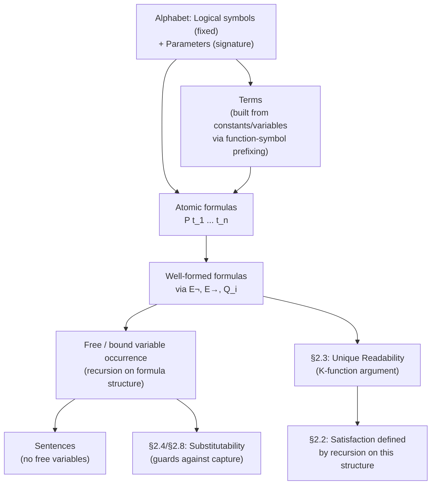

[[book-guidelines|↩ Back to guidelines]]

# First-Order Languages

## Why sentential logic isn't enough

Chapter 1 built sentential logic: a language of sentence symbols glued together by $\neg, \wedge, \vee, \rightarrow, \leftrightarrow$. It's a genuine formal system — well-formed formulas, truth assignments, tautological implication, all precisely defined. But it's also, by design, too crude to be useful as a model of real mathematical reasoning. Enderton opens Chapter 2 with the actual failure mode: if you translate an English argument into sentential logic and get $\Gamma \not\models \tau$, you can't conclude the original argument was invalid — you can only conclude the *translation* was too coarse to preserve the argument's structure.

The concrete thing sentential logic can't see is *internal structure of a claim*. "Every natural number is greater than or equal to zero" and "Socrates is a man" have to become opaque sentence symbols — $P$ and $Q$ — with no way to relate them to "some natural number is negative" or "some men are Greek." Sentential logic can chain propositions together, but it can't look inside one and talk about the individual things ranged over — the "for all," the "there is," the properties and relations between them.

First-order logic is the fix: a language rich enough to have *quantifiers* ($\forall$, and $\exists$ as an abbreviation), *predicate symbols* ($<$, $\in$, "is a man"), *function symbols* ($+, S$), and *constant symbols* ($0$, "Socrates") — enough, Enderton claims, that when a working mathematician says "this follows," the deduction can almost always be mirrored in this system. That's a strong claim, and the rest of the book (soundness, completeness) is spent making good on it. But before any of that, you need the language itself: what strings of symbols even count as a term, an atomic formula, a wff — and that's what §2.1 nails down.

**What breaks without this:** without a formal syntax layer, "first-order logic" is just a vague gesture at "logic with quantifiers." You couldn't state, let alone prove, a unique-readability theorem, define satisfaction by recursion on formula structure, or even ask whether a string of symbols is a legal formula. Every later theorem in the book (soundness, completeness, Gödel's results) is a theorem about objects defined in this section — get the definitions loose and the theorems have nothing precise to be about.

## Logical symbols versus parameters

Enderton's key architectural move, easy to skim past, is splitting the alphabet into two categories with genuinely different jobs:

**A. Logical symbols** — fixed once and for all, the same in every first-order language:
- Parentheses `(`, `)`
- Connectives $\rightarrow, \neg$ (a complete set, per Chapter 1 — no need for more)
- Variables $v_1, v_2, \dots$ (infinitely many)
- Equality `=` (optional — some languages have it, some don't)

**B. Parameters** — the part that varies from language to language:
- The quantifier symbol $\forall$ (technically listed under parameters, though it behaves uniformly)
- $n$-place predicate symbols, for each $n$ (possibly none, but *some* predicate symbol of *some* arity must exist)
- Constant symbols (also called **0-place function symbols** — a deliberate unification that lets later definitions treat constants and function symbols uniformly)
- $n$-place function symbols, for each $n$

A "first-order language" isn't one object — it's a *family* of languages, each one pinned down by (i) whether it includes `=`, and (ii) which parameters it supplies. The language of pure predicate logic, the language of set theory (one predicate symbol, $\in$), and the language of elementary number theory ($<$, $0$, $S$, $+$, $\cdot$, $E$) are three different instances of the same scheme.

**What breaks without this split:** if predicate/function/constant symbols weren't factored out as a free parameter, you'd have to define "term" and "wff" and prove unique readability *separately* for every specific language (one proof for set theory, another for number theory, ...). By making the signature a parameter, Enderton proves the syntax theorems *once*, generically, for any choice of parameters — precisely the move a compiler makes when it defines an AST node type generic over a signature/context rather than hardcoding one grammar per DSL.

### Grounding: this is a signature, and it's exactly a context/environment

This split is the direct ancestor of what a type-theorist or compiler engineer would call a **signature** (sometimes "context" in a term-formation sense, distinct from a typing context, though it plays a similar generic role): a fixed set of symbols with fixed arities that a term-former is instantiated against.

In Rust, the signature is naturally a piece of *data* the parser/AST is generic over, not baked into the type:

```rust
struct Signature {
    predicates: HashMap<String, usize>, // name -> arity
    functions: HashMap<String, usize>,  // name -> arity (0 = constant)
    has_equality: bool,
}
```

In Lean, the closer analogue is a `Sort`-indexed inductive family or (even more literally) an environment of declared constants that term elaboration is checked against — every `Expr` in Lean's kernel is only meaningful relative to the ambient `Environment` of declared constants and their arities/types, exactly as an Enderton term is only meaningful relative to a choice of parameters. "Is `f x y` well-formed" depends on knowing `f`'s arity from the signature, the same way Lean's elaborator needs the declared arity of a constant before it can check an application.

## Terms, atomic formulas, and well-formed formulas

With the alphabet fixed, Enderton defines three nested syntactic categories by increasingly rich induction. This is the syntax layer proper — the AST, in modern terms.

**Terms — the nouns.** A term is anything you can build from constant symbols and variables by *prefixing* function symbols (Polish notation — the function symbol goes on the left, no parentheses or commas needed). Formally, for each $n$-place function symbol $f$, define a term-building operation

$$F_f(\varepsilon_1, \dots, \varepsilon_n) = f\varepsilon_1 \cdots \varepsilon_n$$

and then:

> **Definition.** The set of terms is the set of expressions built up from constant symbols and variables by applying the $F_f$ operations zero or more times.

Example (language of number theory): `+v2 S0`, `SSSS0`, `+Ev1 SS0 Ev2 SS0`. Terms are the expressions that *name objects* — noun phrases, in the intended translation.

**Atomic formulas — not defined inductively at all.** An atomic formula is simply an expression of the form $Pt_1 \cdots t_n$ where $P$ is an $n$-place predicate symbol and each $t_i$ is a term. There's no recursion here — atomic formulas are just directly specified as "predicate symbol followed by the right number of terms." Example: $=v_1v_2$, or in set theory, $\in v_5v_3$.

**Well-formed formulas — built from atomic formulas.** Define formula-building operations

$$E_\neg(\gamma) = (\neg\, \gamma), \qquad E_\rightarrow(\gamma, \delta) = (\gamma \rightarrow \delta), \qquad Q_i(\gamma) = \forall v_i\, \gamma$$

> **Definition.** The set of well-formed formulas (wffs) is the set of expressions built up from the atomic formulas by applying $E_\neg$, $E_\rightarrow$, and $Q_i$ ($i = 1, 2, \dots$) zero or more times.

This is structurally identical to Chapter 1's inductive definition of sentential wffs, with one crucial addition: quantification, $Q_i$, binds a specific variable. That's the new mechanism first-order logic adds on top of sentential logic, and it's what makes free/bound variable tracking (next section) necessary at all.

### What breaks without the term/atomic-formula split

If terms and formulas were defined by a single undifferentiated grammar, you couldn't state "$P$ is an $n$-place predicate symbol and $t_1, \dots, t_n$ are terms" as a *syntactic well-formedness constraint* — you'd have no principled way to reject "$P + $" as ill-formed while accepting "$P\, t_1\, t_2$". The two-tier grammar (terms first, atomic formulas as predicate-applied-to-terms, wffs built from those) is exactly a **sorted grammar** — two syntactic sorts (`Term`, `Formula`) with a typing-like discipline on which sort can appear where. This is the seed of a real type system: arity-checking here is a primitive form of what a compiler's type checker does when it verifies a function call has the right number and kind of arguments.

### Grounding: terms and wffs as an AST

Rust, primary, direct AST translation:

```rust
enum Term {
    Var(usize),                    // v_i
    Const(String),                 // 0-place function symbol
    App(String, Vec<Term>),        // f(t_1, ..., t_n), arity checked against Signature
}

enum Formula {
    Atomic(String, Vec<Term>),     // P(t_1, ..., t_n)
    Not(Box<Formula>),             // (¬ γ)
    Implies(Box<Formula>, Box<Formula>), // (γ → δ)
    ForAll(usize, Box<Formula>),   // ∀ v_i γ
}
```

A well-formedness checker for this AST is precisely a recursive function verifying (a) every `App`/`Atomic` uses a symbol present in the `Signature` with matching arity, and (b) recursion bottoms out at `Var`/`Const`. This is the "elaboration" phase before any semantics (structures, satisfaction — Chapter 2's next section) is even in scope.

Lean, promoted to primary here because the material is literally about term formation: this two-sort grammar (`Term`, `Formula`) is exactly the shape of a two-universe (or two-inductive-type) mutual definition:

```lean
inductive Term (Σ : Signature) where
  | var : Nat → Term Σ
  | const : Σ.constSym → Term Σ
  | app : (f : Σ.funcSym) → (Fin (Σ.arity f) → Term Σ) → Term Σ

inductive Formula (Σ : Signature) where
  | atomic : (P : Σ.predSym) → (Fin (Σ.arity' P) → Term Σ) → Formula Σ
  | not : Formula Σ → Formula Σ
  | implies : Formula Σ → Formula Σ → Formula Σ
  | forall : Nat → Formula Σ → Formula Σ
```

`Term Σ` and `Formula Σ` indexed by a signature `Σ` is exactly what Enderton is doing informally with "parameters" — Lean just makes the dependency on the signature explicit in the type rather than leaving it as an ambient assumption ("we assume henceforth that we have been given...").

Python, a quick illustrative parser sketch, not load-bearing:

```python
def is_term(expr, sig):
    if len(expr) == 1:
        return expr in sig.variables or expr[0] in sig.constants
    f, rest = expr[0], expr[1:]
    n = sig.arity(f)
    return n is not None and split_into_n_terms(rest, n, sig) is not None
```

## Free and bound variable occurrence

This is the subtlest — and, for the stated learning goals, the single most load-bearing — piece of §2.1.

Compare two wffs in the language of set theory:

- $\forall v_2 \in v_2 v_1$ — translates as the incomplete "Every set is a member of ___₁" — you can't finish the sentence without knowing what $v_1$ refers to.
- $(\neg \forall v_1 (\neg \forall v_2 \in v_2 v_1))$ — translates completely: "There is a set such that every set is a member of it."

The difference: in the first, $v_1$ occurs **free**; in the second, every variable is **bound** by a quantifier. Enderton defines this precisely by recursion on formula structure (for a fixed variable $x$):

1. For atomic $\alpha$: $x$ occurs free in $\alpha$ iff $x$ occurs (as a symbol) in $\alpha$.
2. $x$ occurs free in $(\neg\,\alpha)$ iff $x$ occurs free in $\alpha$.
3. $x$ occurs free in $(\alpha \rightarrow \beta)$ iff $x$ occurs free in $\alpha$ or in $\beta$.
4. $x$ occurs free in $\forall v_i\, \alpha$ iff $x$ occurs free in $\alpha$ **and** $x \neq v_i$.

Clause 4 is the whole mechanism: quantifying over $v_i$ *removes* $v_i$ from the free-variable set of whatever's inside, no matter how deeply nested. Enderton restates this as a genuine recursively-defined function $h$ (using the Recursion Theorem from §1.4):

$$h(E_\neg(\alpha)) = h(\alpha), \quad h(E_\rightarrow(\alpha,\beta)) = h(\alpha)\cup h(\beta), \quad h(Q_i(\alpha)) = h(\alpha)\setminus\{v_i\}$$

and $x$ is free in $\alpha$ iff $x \in h(\alpha)$. A wff with $h(\alpha) = \emptyset$ is a **sentence** — translatable into English with no dangling blanks. Sentences are "the usual interesting wffs"; formulas with free variables are second-class citizens, building blocks used inside quantifiers.

Enderton also flags — casually, but it matters — that the *particular choice* of bound variable is immaterial: $\forall v_1(Av_1 \to Bv_1)$ and $\forall v_{27}(Av_{27} \to Bv_{27})$ say the same thing (a bound variable acts as a pronoun; this is what will later become "alphabetic variants," an explicit named concept in §2.2's discussion of substitution).

**What breaks without this:** every later definition that substitutes a term for a variable — logical axioms in the deductive calculus, satisfaction under an assignment — has to know which occurrences of a variable are "live" (free) versus already spoken for by an enclosing quantifier (bound). Substituting into a bound occurrence would silently change the formula's meaning; that's *variable capture*, and Enderton's free/bound machinery is precisely the bookkeeping that later lets him state a **substitutability** condition (§2.4/§2.8) guarding against it.

### Grounding: this is the exact mechanism a substitution function needs

This is the single most directly reusable piece of §2.1 for building anything type-checker- or elaborator-shaped, so it's worth making the correspondence completely explicit rather than gesturing at it.

- Enderton's $h(\alpha)$ — the free-variable-collecting recursion — is exactly a `free_vars(&self) -> HashSet<usize>` method you'd write on a `Formula` AST in Rust, with the `ForAll` case removing the bound index, mirroring clause 4 verbatim.
- The concern Enderton is building toward (don't substitute a term $t$ for $x$ into $\alpha$ if that would let one of $t$'s free variables get "captured" by a quantifier in $\alpha$) is *precisely* the correctness condition a capture-avoiding substitution function must enforce — the same condition that shows up in any Hoare-logic weakest-precondition calculus (substituting into a postcondition) and in Lean's kernel `instantiate`/`Expr.subst`, which is careful to lift de Bruijn indices exactly so that substitution can never accidentally bind a previously-free variable.
- In Lean, bound variables are represented with **de Bruijn indices** rather than named variables specifically to make this bookkeeping automatic: a bound variable's index just says "count $k$ binders outward," so capture becomes structurally impossible to express by construction — you can see Enderton's clause 4 (quantifying over $v_i$ removes it from the free set) as the named-variable version of what de Bruijn indexing sidesteps by construction. A Rust implementation following Enderton literally (named variables + an explicit free-variable check before substituting) is the more elementary but more error-prone route; de Bruijn indices are the standard fix once you've felt that pain.

```rust
impl Formula {
    fn free_vars(&self) -> HashSet<usize> {
        match self {
            Formula::Atomic(_, terms) => terms.iter().flat_map(Term::vars).collect(),
            Formula::Not(a) => a.free_vars(),
            Formula::Implies(a, b) => a.free_vars().union(&b.free_vars()).copied().collect(),
            Formula::ForAll(i, a) => {
                let mut fv = a.free_vars();
                fv.remove(i);
                fv
            }
        }
    }
}
```

This is not an analogy for the sake of one — it is the same function, restated in a different notation. Anyone building a Hoare-triple checker or an implicit-argument elaborator will write this exact recursion, for the exact reason Enderton gives (clause 4) and no other.

## Translating English (and set theory) into first-order form

Enderton spends a substantial chunk of §2.0–§2.1 on worked translation examples, and they matter for reasons beyond pedagogy: they establish the *discipline* of translation as a multi-step, mechanical process, not an act of inspiration.

The translation pipeline he demonstrates (e.g. "there is no set of which every set is a member" — the sentence that will eventually forbid a universal set):

$$\neg[\text{There is a set of which every set is a member}]$$
$$\neg \exists v_1[\text{every set is a member of } v_1]$$
$$\neg \exists v_1 \forall v_2\, v_2 \in v_1$$
$$\neg \forall v_1 \neg \forall v_2 \in v_2 v_1 \quad \text{(eliminate } \exists\text{, replace infix with Polish notation)}$$
$$(\neg(\neg \forall v_1 (\neg \forall v_2 \in v_2 v_1)))$$

Two economy measures recur throughout: (1) only $\neg, \to$ are primitive connectives (complete, per Chapter 1, so $\vee, \wedge, \leftrightarrow$ are all abbreviations); (2) $\exists x\,\alpha$ abbreviates $\neg \forall x \neg \alpha$ rather than being primitive. Both choices trade a smaller primitive kernel for uglier "unabbreviated" formulas — exactly the trade-off a compiler designer makes when deciding a small core IR versus a larger surface language with desugaring.

Two patterns Enderton flags as recurring (and easy to confuse):

$$\forall v(\underline{\quad} \to \underline{\quad}) \qquad \text{"everything with property P has property Q"}$$
$$\exists v(\underline{\quad} \wedge \underline{\quad}) \qquad \text{"something has both property P and property Q"}$$

Mixing these up — $\forall v_1(Av_1 \wedge Bv_1)$ instead of $\forall v_1(Av_1 \to Bv_1)$ — silently strengthens "all apples are bad" into "everything is an apple and everything is bad." This is worth internalizing as a translation reflex: universal quantification pairs with implication, existential pairs with conjunction.

The set-theory and number-theory examples (pair-set axiom, "any nonzero natural number is a successor," the axiom of regularity as an unabbreviated wff spanning several lines) also make a broader point explicit: **all of mathematics can be embedded in the first-order language of set theory** — statements expressed in it, theorems following logically from its axioms. This "metamathematics" framing (studying the sentences a mathematician uses, rather than the mathematical objects themselves) is the entire reason first-order logic is worth building carefully: it's the object language every later chapter (models, completeness, undecidability, Gödel) studies from the outside.

## The parsing algorithm and unique readability (§2.3, briefly)

Section 2.1 *asserts* that terms and wffs can be unambiguously decomposed (this is used already, silently, in defining $h$ by recursion in the free-variable section above) — but the actual proof is deferred to §2.3, a short, optional section extending Chapter 1's unique-readability result to the richer first-order grammar. It's worth a brief look here because it's the technical justification underpinning everything in §2.1's inductive definitions.

The trick is a cleverly-chosen integer-valued function $K$ on symbols, designed so that concatenating symbols adds their $K$-values, and so that **every term has $K$-value exactly 1**:

$$K(x) = 1 \ (\text{variable}), \qquad K(c) = 1\ (\text{constant}), \qquad K(f) = 1-n\ (\text{$n$-place function symbol})$$

**Lemma 23A:** for any term $t$, $K(t) = 1$. **Lemma 23B / Corollary 23C:** no *proper initial segment* of a term is itself a term (because such a segment would need $K < 1$, contradicting the fact that every terminal segment of a term is a concatenation of one or more terms, hence has $K \geq 1$). This one fact — no term is a proper prefix of another term — is exactly what makes greedy left-to-right parsing of Polish-notation terms deterministic: at each step, scan right until $K$ first hits $1$, and that prefix is forced to be the *unique* correct split.

$K$ extends to formulas by adding parentheses, $\forall$, $\neg$, $\to$, and predicate symbols to its domain (e.g. $K(() = -1$, $K()) = 1$, $K(P) = 1-n$ for $n$-place $P$), yielding the analogous **Unique Readability Theorem for Formulas**: the wffs are freely generated from the atomic formulas by $E_\neg, E_\to, Q_i$ — i.e., every non-atomic wff decomposes in exactly one way into its immediate constituents.

**Grounding — this is why a recursive-descent parser terminates and is unambiguous.** The $K$-function argument is the formal justification for the informal claim every compiler-writer takes on faith: that a grammar is "unambiguous enough" for a single deterministic pass to reconstruct the parse tree, with no backtracking. In Rust, this shows up as the *termination and correctness* argument for a `fn parse_term(input: &[Symbol]) -> Option<(Term, &[Symbol])>` — the theorem guarantees that whatever prefix a greedy scan consumes, it's forced to be the one legitimate subterm, never an ambiguous choice among several parses. It's a two-line sketch here rather than a full section because the underlying idea — the same "balanced count" trick Chapter 1 uses via parenthesis-balancing — has already been done once and is just being extended, not reinvented.

## Structure at a glance



## Where this leads

Section 2.1's syntax is the load-bearing foundation for the entire rest of the book: §2.2's definition of satisfaction is a recursion *on exactly this term/wff structure*, and it's only well-defined because §2.3 proves unique readability for it. §2.4's deductive calculus states its logical axioms (e.g. $\forall x\,\alpha \to \alpha^t_x$) using the *substitutability* notion built directly on free/bound tracking from this section — a term $t$ is substitutable for $x$ in $\alpha$ only if substituting it wouldn't let a free variable of $t$ get captured by a quantifier in $\alpha$. Chapter 3's arithmetization of syntax (Gödel numbering) works because terms and wffs are freely generated objects with unique decompositions, letting syntactic properties be coded as numeric predicates.

For the standing goals of this workbench: this section *is* the AST-plus-signature layer any type-checker or elaborator starts from, and the free/bound variable recursion here is not merely analogous to but literally the same function as the `free_vars` computation a capture-avoiding substitution routine needs — the exact plumbing under both Hoare-triple soundness proofs (substituting into a postcondition) and metavariable elaboration (substituting a solved metavariable into a context without capturing a locally-bound name). Enderton's named-variable formulation is the "naive but correct" version of what de Bruijn indices later make structurally automatic; understanding *why* clause 4 in the free-variable recursion is exactly the right definition is a good forcing function for understanding why de Bruijn indexing works at all.
