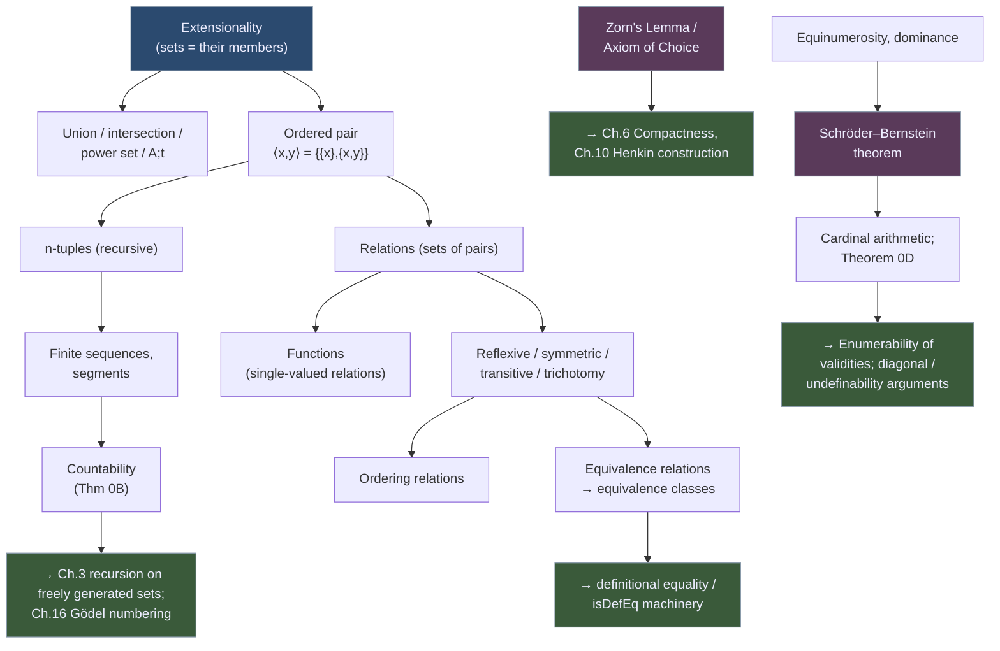

# Foundational Set-Theoretic Apparatus

[[book-guidelines|↩ Back to guidelines]]

## Why a logic book opens with a reference chapter on sets

Enderton is explicit that Chapter Zero is not meant to be read start to finish — it's "a brief summary of facts from set theory we will need," to be consulted "if and when issues of a set-theoretic nature arise in later chapters." That framing matters: everything after this chapter — sentential logic, first-order structures, deductive calculi, Gödel's theorems — is going to be *built as sets*. A "structure" in Chapter 2 will literally be a tuple of sets and functions; a "deduction" in Chapter 2's proof theory will literally be a finite sequence (i.e., a specific kind of set); a Gödel number in Chapter 3 will code a syntax tree as a natural number, itself defined via sets.

If you've written a compiler or a proof checker, you already know this problem from the other side: before you can define what a program *is*, you need some substrate to represent it in — an AST type, a symbol table, an environment. Set theory is doing that job here, except the "language" being defined is mathematics itself, and the substrate has to be defined with essentially no assumptions taken for granted. This is why the chapter is so terse and definitional: it's establishing vocabulary and notation, not a set of interesting theorems in their own right (with a few genuine exceptions we'll get to — Schröder–Bernstein chief among them).

The chapter's throughline is a single idea, stated first and used everywhere after: **a set is completely determined by its members, nothing else.**

## Extensionality: sets have no "identity" beyond their contents

Enderton states the principle directly: if $A$ and $B$ are sets such that for every object $t$,
$$t \in A \iff t \in B,$$
then $A = B$. This is the **axiom of extensionality**, though the book introduces it here as a working principle rather than a formal axiom (formal set theory proper is out of scope; this chapter is naive/informal set theory used as a tool).

**What breaks without it:** without extensionality, two collections could have identical membership yet count as "different sets" — the way two different `struct` instances in Rust can have identical field values but different identities (different addresses, different `id()`s). Set theory deliberately throws that distinction away. $\{x, y\} = \{y, x\}$ isn't a theorem requiring proof — it's immediate from extensionality, since both sides have exactly the same members. This is why set-builder notation like $\{x \mid \varphi(x)\}$ is *safe*: however you enumerate or describe the members, if the membership condition is the same, you get the same set, full stop.

**Grounding (Rust):** a `HashSet<T>` is the closest everyday analogue — `HashSet` derives `PartialEq` by comparing contents, not internal layout or insertion order, which is exactly extensional equality. Contrast this with a `Vec<T>`, which *is* order-sensitive (`vec![1,2] != vec![2,1]`) — a `Vec` is closer to Enderton's later notion of a finite *sequence*, which is genuinely intensional about order. Keeping "sets" and "sequences" as distinct primitives with different equality behavior, right from the first page, is exactly the discipline you want when you later build an environment/context representation for a type checker: is your variable context a *set* of bindings (order irrelevant, no duplicates) or a *sequence* (order matters, e.g. for shadowing)? Enderton's chapter forces you to notice this is a real design decision, because it defines both, separately, on purpose.

**Grounding (Lean):** Lean's `Finset α` requires `DecidableEq α` and internally is a quotient of lists by permutation — literally *implementing* extensionality by quotienting away order and duplicates, so that `Finset.ext` (two finsets are equal iff they have the same elements) is a real, named lemma you can invoke. This is worth citing explicitly: Lean's `Finset.ext_iff` is the formal, machine-checked incarnation of the sentence Enderton states in prose on page 1.

## $A; t$, the empty set, and the power set

The book introduces compact notation for two operations you'll see constantly:

- $A; t$ is "$A$ with $t$ adjoined" — formally $A \cup \{t\}$ — and comes with the biconditional $t \in A \iff A; t = A$ (adjoining an element already present changes nothing, again by extensionality).
- The power set $\mathcal{P}A = \{x \mid x \subseteq A\}$, the set of *all* subsets of $A$, with the small worked examples $\mathcal{P}\emptyset = \{\emptyset\}$ and $\mathcal{P}\{\emptyset\} = \{\emptyset, \{\emptyset\}\}$.

These two examples are worth sitting with, because they show set theory bootstrapping numbers out of nothing: $\emptyset$ can play the role of $0$, $\{\emptyset\}$ (a set with one member) can play the role of $1$, and $\mathcal{P}\{\emptyset\} = \{\emptyset,\{\emptyset\}\}$ has two members, so it can play the role of $2$. This is the seed of the Von Neumann ordinal construction, and it's a good early signal that "set" in this book is not a vague catch-all — it is going to be the actual encoding substrate for numbers, syntax, and proofs alike.

**Grounding (Python, illustrative only):**
```python
def power_set(a: frozenset) -> frozenset:
    elems = list(a)
    return frozenset(
        frozenset(elems[i] for i in range(len(elems)) if (mask >> i) & 1)
        for mask in range(2 ** len(elems))
    )
```
This is a fine sketch for intuition — $\mathcal{P}A$ has $2^{|A|}$ members, one per subset — but it also foreshadows why $\mathcal{P}A$ is never equinumerous with $A$ itself for infinite $A$ (Cantor's theorem, used implicitly later when the book distinguishes $\aleph_0$ from $2^{\aleph_0}$).

## Union and intersection, including the "big union/intersection" of a family

Ordinary $A \cup B$ and $A \cap B$ get the expected definitions, plus **disjointness** ($A \cap B = \emptyset$) and **pairwise disjointness** for a whole collection. The chapter then generalizes: for a set $\mathcal{A}$ whose members are themselves sets,
$$\bigcup \mathcal{A} = \{x \mid x \text{ belongs to some member of } \mathcal{A}\}, \qquad \bigcap \mathcal{A} = \{x \mid x \text{ belongs to all members of } \mathcal{A}\} \ (\mathcal{A} \neq \emptyset).$$
Enderton's own worked example: for $\mathcal{A} = \{\{0,1,5\}, \{1,6\}, \{1,5\}\}$, $\bigcup \mathcal{A} = \{0,1,5,6\}$ and $\bigcap \mathcal{A} = \{1\}$. He also notes the identities $A \cup B = \bigcup\{A,B\}$ and $\bigcup \mathcal{P}A = A$ — small but useful sanity checks for how the "big" operators relate to the binary ones.

**What breaks without $\bigcup \mathcal{A}$-style notation:** later in the book, indexed unions like $\bigcup_{n \in \mathbb{N}} A_n$ appear (e.g. Theorem 0B's proof), and without the general "union of a family" operator you'd have no uniform way to talk about a union over an *infinite* index set — you'd be stuck writing "$A_0 \cup A_1 \cup A_2 \cup \cdots$" informally with no rigorous meaning. The generalized $\bigcup$ is what lets that ellipsis be replaced by an actual definition.

## Ordered pairs and $n$-tuples: encoding order out of unordered sets

This is the chapter's first genuinely clever construction, and it's the one most worth lingering on, because it answers a question a compiler-builder should find familiar: *how do you build an ordered thing (a pair, a tuple, an AST node) out of a primitive (the set) that has no built-in notion of order?*

Enderton states the required property first, before [[Interpretations-Between-Theories#The definition|the definition]] — exactly the "why before symbols" sequencing this book itself models:
$$\langle x, y \rangle = \langle u, v \rangle \iff x = u \text{ and } y = v.$$
*Any* definition satisfying this would do. The one adopted is the **Kuratowski pair**:
$$\langle x, y \rangle = \{\{x\}, \{x,y\}\}.$$
The trick: $\{x\}$ (a singleton) is distinguishable from $\{x,y\}$ (generically a pair) whenever $x \ne y$, so "which of the two inner sets is the singleton" recovers *which coordinate came first* — order is smuggled back in via a size asymmetry between two unordered sets. Triples are then pairs of pairs, $\langle x,y,z\rangle = \langle\langle x,y\rangle, z\rangle$, and general $n$-tuples are defined recursively,
$$\langle x_1, \ldots, x_{n+1}\rangle = \langle \langle x_1,\ldots,x_n\rangle, x_{n+1}\rangle \quad (n > 1),$$
with the base case $\langle x \rangle = x$ chosen precisely so the recursion also covers $n=1$.

**What breaks without this:** if you skip the "properly nested" encoding and instead, say, tried to define $\langle x,y,z \rangle$ as the flat set $\{x,y,z\}$, you'd lose all of: order (which is which), arity (is this a triple or a 3-element set that happens to look like one?), and — critically for later chapters — the ability to tell a pair from a triple from a bare element by structure alone. Enderton makes exactly this point with **Lemma 0A**: if $\langle x_1,\ldots,x_m\rangle = \langle y_1,\ldots,y_{m+k}\rangle$, then $x_1 = \langle y_1,\ldots,y_{k+1}\rangle$ — i.e., mismatched-arity tuples aren't simply *unequal*, they can coincide in a structured way (every triple *is* a pair, of a pair and an element), and the lemma's inductive proof pins down exactly how. This is the "unique readability" concern in embryonic form — the same concern that reappears, much more heavily, when the book later proves wffs of sentential logic parse uniquely.

**Grounding (Rust):** the recursive nested-pair encoding is *literally* how Rust tuples desugar structurally if you think of `(A, B, C)` as `(A, (B, C))` or `((A, B), C)` under a cons-list view — though Rust's actual tuples are fixed-arity primitives with no such runtime encoding. The more faithful translation is an AST node type:
```rust
enum Term {
    Var(String),
    Pair(Box<Term>, Box<Term>),
    // an n-ary application is (curried) nested pairs, exactly as Enderton nests tuples
}
```
The point worth internalizing: **a finite sequence, as an AST, is nothing but nested pairs with a tag for "empty."** This is precisely how you'll represent parsed syntax later — and Enderton's careful arity bookkeeping (Lemma 0A) is the ancestor of the same bookkeeping your parser needs to avoid ambiguity between an $n$-ary and $(n{-}1)$-ary construct that happen to look alike when flattened.

**Grounding (Lean):** Lean's own product type `α × β` is defined as a structure, not literally as Kuratowski pairs, but the *reasoning pattern* — "prove `(a, b) = (c, d) ↔ a = c ∧ b = d`" — is exactly `Prod.mk.injEq`, a lemma the elaborator uses constantly when unifying pair-shaped terms. When you later build a metavariable unifier, decomposing `⟨x, y⟩ =?= ⟨u, v⟩` into two subgoals `x =?= u` and `y =?= v` is precisely appealing to the defining property Enderton opens this section with, before he even gives the encoding.

## Finite sequences, segments, and the Cartesian product / relation machinery

A **finite sequence** (or string) over $A$ is just $S = \langle x_1,\ldots,x_n\rangle$ with each $x_i \in A$ — i.e., sequences are *defined as tuples*, not as functions from $\{1,\ldots,n\}$ into $A$ (Enderton notes the functional definition is more common elsewhere but the tuple definition is "slightly more convenient for us"). A **segment** is a contiguous run $\langle x_k,\ldots,x_m\rangle$; an **initial segment** starts at $k=1$; a segment is **proper** if it differs from all of $S$.

From here: $A \times B$ is the set of pairs $\langle x,y\rangle$ with $x \in A, y \in B$; $A^n$ is the set of $n$-tuples from $A$ (so $A^3 = (A \times A) \times A$, consistent with the nested-pair definition above). A **relation** is simply a set of ordered pairs — Enderton's example, the strict order on $\{0,1,2,3\}$, *is* the set $\{\langle0,1\rangle,\langle0,2\rangle,\langle0,3\rangle,\langle1,2\rangle,\langle1,3\rangle,\langle2,3\rangle\}$, not merely represented by it. $\mathrm{dom}\,R$, $\mathrm{ran}\,R$, and $\mathrm{fld}\,R = \mathrm{dom}\,R \cup \mathrm{ran}\,R$ follow, along with $n$-ary relations as subsets of $A^n$ and the **restriction** of $R$ to $B \subseteq A$: $R \cap B^n$.

A **function** $F$ is a relation that is single-valued (for each $x \in \mathrm{dom}\,F$, exactly one $y$ with $\langle x,y\rangle \in F$, written $F(x) = y$). $F: A \to B$ means $F$ is a function with $\mathrm{dom}\,F = A$ and $\mathrm{ran}\,F \subseteq B$; **onto** adds $\mathrm{ran}\,F = B$; **one-to-one** means each $y \in \mathrm{ran}\,F$ has a unique preimage. An **$n$-ary operation on $A$** is a function $A^n \to A$; restricting an operation $f$ to $B \subseteq A$ gives another operation on $B$ exactly when $B$ is **closed under $f$** (i.e., $f(b_1,\ldots,b_n) \in B$ whenever each $b_i \in B$) — a notion that becomes load-bearing the moment "sets generated from a base by operations" (this book's Chapter 3 topic) shows up.

**What breaks without "function as a set of pairs":** if you instead treat a function as a black-box procedure (the way most programming languages do), you lose the ability to reason about functions *extensionally* the same way you reason about sets — two functions with the same domain and the same input/output behavior simply *are* the same function, no separate "are these implementations equal" question needed. This is precisely the discipline behind Lean's `funext` (function extensionality): `(∀ x, f x = g x) → f = g`. Defining functions as sets of pairs from page one makes `funext` not a special axiom bolted onto an otherwise opaque notion of function, but a direct consequence of ordinary set extensionality applied to the pairs making up $F$.

**Grounding (Rust):** closure under an operation is exactly the discipline enforced by, e.g., checked arithmetic on a bounded integer type, or more relevantly by a well-typed AST constructor: if your `TypeChecker`'s substitution function is meant to be an operation on "well-formed terms," you need the analogue of Enderton's closure condition — substituting a well-formed term into a well-formed term yields a well-formed term — proved once, relied on everywhere after (this is exactly the shape of a *substitution lemma* in a type-safety proof).

## Reflexive, symmetric, transitive, trichotomy: the classification vocabulary

For a relation $R$ on $A$:
- **reflexive on $A$:** $\langle x,x\rangle \in R$ for every $x \in A$;
- **symmetric:** $\langle x,y\rangle \in R \Rightarrow \langle y,x\rangle \in R$;
- **transitive:** $\langle x,y\rangle \in R$ and $\langle y,z\rangle \in R$ $\Rightarrow$ $\langle x,z\rangle \in R$;
- **trichotomy on $A$:** for every $x,y \in A$, exactly one of $\langle x,y\rangle \in R$, $x=y$, $\langle y,x\rangle \in R$ holds.

An **equivalence relation** is reflexive + symmetric + transitive; an **ordering relation** is transitive + trichotomy. For an equivalence relation $R$ on $A$, the **equivalence class** $[x] = \{y \mid \langle x,y\rangle \in R\}$, and Enderton states the two facts that make equivalence classes useful: they *partition* $A$ (every element of $A$ is in exactly one class), and $[x] = [y] \iff \langle x,y\rangle \in R$.

This is load-bearing far beyond Chapter 0: **definitional equality vs. propositional/provable equality**, which sits at the center of your elaborator project, is exactly a relation you need to verify is an equivalence relation (or, for definitional equality specifically, a congruence — an equivalence relation that also respects the term structure) before any of the reasoning about "these two types are interchangeable" is sound. When Lean's kernel checks `isDefEq a b`, it is deciding membership in a specific relation that had better satisfy reflexivity, symmetry, and transitivity, or the whole notion of "these terms are the same for typechecking purposes" collapses into incoherence. Enderton's dry vocabulary list is the precise checklist you'd run against any candidate notion of term equality before trusting it.

**Grounding (Rust):** `PartialEq`/`Eq` in Rust are a direct, if informally-enforced, encoding of this. `Eq` is documented as requiring reflexivity, symmetry, and transitivity — the compiler doesn't check it (it's a *contract*, not a type-level guarantee, unlike Lean where you could actually prove it) — but violating it (e.g., `f64::NAN`, which is why `f64` implements only `PartialEq`) breaks every algorithm that assumes it, from `HashSet` deduplication to sorting. This is the practical, load-bearing reason Enderton bothers to spell these three properties out individually instead of just saying "equivalence relation" and moving on.

## Countability: the tool that will classify almost everything later

$A$ is **finite** iff some one-to-one $f$ maps $A$ onto $\{0,\ldots,n-1\}$ for some natural $n$; $A$ is **countable** iff some function maps $A$ one-to-one *into* $\mathbb{N}$ (note: "into," not "onto" — so finite sets are trivially countable too). The book then shows how to upgrade an injection $A \to \mathbb{N}$ into a genuine enumeration $A \to \mathbb{N}$ bijection for infinite countable $A$, by repeatedly picking out the element mapping to the current least unused natural number — a clean constructive argument worth internalizing as a pattern (it recurs any time you need to convert "an injective encoding exists" into "an explicit enumeration exists").

The chapter's first real theorem:

> **Theorem 0B.** If $A$ is countable, the set of all finite sequences of members of $A$ is countable.

**Proof idea (book's own):** characterize $S = \bigcup_{n \in \mathbb{N}} A^{n+1}$ (the set of *all* finite sequences over $A$, of every length), then map $\langle a_0,\ldots,a_m\rangle$ to $2^{f(a_0)+1}\cdot 3^{f(a_1)+1}\cdots p_m^{f(a_m)+1}$ (product of increasing primes raised to encoded-plus-one exponents), where $f$ is the given injection $A \to \mathbb{N}$. The one wrinkle: this Gödel-style prime-power encoding *could* in principle assign the same number to sequences of different lengths (if uniqueness of prime factorization somehow failed to separate them) — Enderton dispatches this by just always picking the *smallest* number obtainable this way for each sequence, which is a well-defined, provably injective map regardless.

**This is not a throwaway result** — it is, almost verbatim, the technique Gödel numbering will use in Chapter 3 to arithmetize syntax: represent a finite sequence of symbols (or of already-Gödel-numbered expressions) as a single natural number via prime factorization, so that "is this a well-formed proof" becomes a decidable arithmetic question about a single number. Theorem 0B is the general-purpose lemma; the Gödel-numbering machinery later is its specific, heavily engineered application to strings of a formal language. Flagging this now: if your goal is a compiler/verifier and an elaborator, the *pattern* here — encode structured, variable-length data as a single flat value via unique factorization — is a genuinely reusable technique (it's exactly how you'd design a compact serialization format for ASTs if you wanted arithmetic operations on the encoding to mean something about the structure).

**Grounding (Python, illustrative):**
```python
from sympy import prime

def encode(seq: list[int]) -> int:
    # seq[i] is assumed already encoded into N via some injection f
    result = 1
    for i, x in enumerate(seq):
        result *= prime(i + 1) ** (x + 1)
    return result
```
This is a toy version of Enderton's construction and, not coincidentally, a toy version of Gödel numbering.

## Trees: informal pictures, deliberately not load-bearing

Enderton is careful to flag that the book's treatment of trees is *purely informal* — "our comments on trees will always be informal; the theorems and proofs will not rely on trees." A tree is described as having an underlying finite partial ordering $R$ (draw $a$ below $b$ when $\langle a,b\rangle \in R$, connected by a line), a unique highest point (the root — "in mathematics, trees grow downward"), the constraint that points *above* any given vertex lie along a single line (no branching upward), and a **labeling function** whose domain is the vertex set.

This is a deliberate scoping choice worth noting for your own purposes: Enderton is *not* building the formal machinery for tree induction here (that comes later, more rigorously, when Chapter 3 covers [[Induction-and-Recursion-on-Freely-Generated-Sets|induction and recursion on freely generated sets]] — which is really "induction on trees" done properly via unique-parsing arguments). Chapter 0's trees are just an intuition pump for the diagrams the book will draw informally elsewhere. Don't expect a `TreeNode` formalism to fall out of this section — the formal analogue is Chapter 3's abstract induction principle, not this section.

## Zorn's lemma and the axiom of choice

The book adopts a minimalist, practical stance: "at a few points in the book we will use the axiom of choice. But usually these uses can be eliminated if the theorems in question are restricted to countable languages." Among equivalent formulations, **Zorn's lemma** is singled out as the useful one:

> A collection $\mathcal{C}$ of sets is a **chain** iff for any $x, y \in \mathcal{C}$, either $x \subseteq y$ or $y \subseteq x$ (i.e., $\mathcal{C}$ is totally ordered by $\subseteq$).
>
> **Zorn's Lemma.** Let $A$ be a set such that for every chain $\mathcal{C} \subseteq A$, $\bigcup \mathcal{C} \in A$. Then $A$ has a maximal element $m$ — one not a proper subset of any other element of $A$.

**Why this matters and what it's for:** Zorn's lemma is the standard tool for proving existence without construction — "there is a maximal such object" without ever exhibiting it. This shows up later in the book as an alternative route to the Compactness Theorem for sentential logic (extending a finitely satisfiable set to a *maximal* finitely satisfiable set, via Zorn, rather than the countable-language-specific direct construction). The pattern — take the union of a chain of "good" objects and check it's still "good," conclude a maximal good object exists — is the generic template you'll want whenever you need to build a maximal consistent theory (e.g. Henkin's construction toward the Completeness Theorem) without hand-enumerating it.

**Grounding note:** Zorn's lemma doesn't have a clean "code" analogue — it's a pure existence principle, non-constructive by nature, and forcing a Rust/Python sketch of it would misrepresent what it does (you cannot, in general, run an algorithm to find the maximal element it promises). Better to name what it's not: it is the opposite of an algorithm. Worth flagging for the learning-goals angle: any theorem invoking Zorn's lemma is a signal that the corresponding construction in a *verifier* would need a different, decidable substitute (e.g. an explicit fixed enumeration) if you ever wanted the analogous "maximal set" to be something a program actually computes rather than merely proves exists.

## Cardinal numbers and cardinal arithmetic

**Equinumerosity:** $A \sim B$ iff some one-to-one $f$ maps $A$ onto $B$ — reflexive, symmetric, transitive (an equivalence relation on the class of all sets, informally speaking). For finite sets this coincides with "same count"; the point of **cardinal numbers** is to extend "size" sensibly to infinite sets, where counting breaks down. Enderton assigns to each $A$ a cardinal $\mathrm{card}\,A$ satisfying
$$\mathrm{card}\,A = \mathrm{card}\,B \iff A \sim B, \tag{K}$$
and is refreshingly candid that the actual identity of $\mathrm{card}\,A$ (standardly, the least ordinal equinumerous with $A$, which itself needs the axiom of choice to exist) matters much less than the fact that (K) holds — "it matters very little what $\mathrm{card}\,A$ actually is, any more than it matters what the number 2 actually is." This is a genuinely useful abstraction-boundary lesson: define a thing by the *interface it must satisfy*, not by a specific representation, whenever multiple representations would do equally well. (Cantor's own 1895 characterization is quoted, evocatively vague — "the general concept which... comes from the set $M$ upon abstraction from the nature of its various elements.")

**Dominance:** $A \preceq B$ iff $A$ is equinumerous with some subset of $B$ (equivalently, some one-to-one function maps $A$ *into* $B$), with the cardinal-level companion $\mathrm{card}\,A \le \mathrm{card}\,B \iff A \preceq B$. Dominance is reflexive and transitive (not obviously antisymmetric — that's exactly the content of the next theorem). $A$ is countable iff $A \preceq \mathbb{N}$.

### The Schröder–Bernstein theorem — why it needs a real proof

> **(a)** For any sets $A, B$: if $A \preceq B$ and $B \preceq A$, then $A \sim B$.
> **(b)** For cardinals $\kappa,\lambda$: if $\kappa \le \lambda$ and $\lambda \le \kappa$, then $\kappa = \lambda$.

This is the answer to the second Key Question the guidelines flag, and it's worth being explicit about *why* it's nontrivial. $A \preceq B$ only says there's *some* injection $A \hookrightarrow B$; $B \preceq A$ only says there's *some* (possibly totally different, unrelated) injection $B \hookrightarrow A$. Schröder–Bernstein's genuine content is that from these two *unrelated, one-directional* embeddings, you can always *construct* a single bijection $A \to B$ — you cannot simply glue the two given injections together; you have to build a new function by tracking, for each element, whether it's reachable by iterating one injection-then-its-partial-inverse back through a chain of preimages, and split $A$ and $B$ into three cases (elements with a finite chain rooted in $A$, a finite chain rooted in $B$, or an infinite chain) and define the bijection differently on each piece. Enderton doesn't give [[Godels-Incompleteness-Theorems#The construction|the construction]] in this chapter (it's a "standard result" cited, not re-derived, true to the chapter's reference-only character) — but the guidelines' framing is exactly right: *dominance both ways* is a much weaker-looking hypothesis than *equinumerous*, and [[Godels-Incompleteness-Theorems#The theorem|the theorem]] is the nontrivial bridge between them. Compare: in ordinary arithmetic, "$\kappa \le \lambda$ and $\lambda \le \kappa$ implies $\kappa = \lambda$" (antisymmetry of $\le$) is definitionally free once $\le$ is *defined* via subtraction or difference — here it's a genuine theorem because $\preceq$ is defined via the *existence* of some injection, not via any single canonical comparison.

Enderton follows immediately with the companion fact, **Theorem 0C**: for any $A, B$, either $A \preceq B$ or $B \preceq A$ (dually, any two cardinals are comparable) — itself equivalent to the axiom of choice, and stated in the same "sets / cardinals" dual format as Schröder–Bernstein. Together the two theorems establish that $\preceq$ genuinely behaves like a linear order on cardinals: total (0C) and antisymmetric-up-to-equinumerosity (Schröder–Bernstein) — which is what licenses writing "$0, 1, 2, \ldots, \aleph_0, \aleph_1, \ldots$" as an actual ordered list of *all* cardinals, with $\aleph_0 = \mathrm{card}\,\mathbb{N}$ the least infinite cardinal and $2^{\aleph_0} = \mathrm{card}\,\mathbb{R} > \aleph_0$ (since $\mathbb{R}$ is uncountable).

**Cardinal arithmetic:** for disjoint $A, B$ of cardinality $\kappa, \lambda$: $\kappa + \lambda = \mathrm{card}(A \cup B)$; $\kappa \cdot \lambda = \mathrm{card}(A \times B)$ — both well-defined independent of the choice of representative sets. The **Cardinal Arithmetic Theorem**: for $\kappa \le \lambda$ with $\lambda$ infinite, $\kappa + \lambda = \lambda$, and if $\kappa \ne 0$, $\kappa \cdot \lambda = \lambda$ — infinite cardinal arithmetic collapses to "the bigger one absorbs the smaller," strikingly unlike finite arithmetic. In particular $\aleph_0 \cdot \kappa = \kappa$ for infinite $\kappa$.

**Theorem 0D** generalizes Theorem 0B beyond the countable case: for *infinite* $A$, the set of all finite sequences over $A$ has cardinality exactly $\mathrm{card}\,A$ (not larger). **Proof:** each $A^{n+1}$ has cardinality $\mathrm{card}\,A$ (by the Cardinal Arithmetic Theorem applied $n$ times), and the union over $\aleph_0$ many such sets has cardinality $\aleph_0 \cdot \mathrm{card}\,A = \mathrm{card}\,A$ — one clean application of the absorption law. The chapter closes with the worked example that clinches why this matters: the algebraic numbers (roots of integer polynomials) number only $\aleph_0$ — each polynomial is a finite sequence of integer coefficients (so there are $\aleph_0$ polynomials, by Theorem 0D applied to the countably infinite set of integers), each has finitely many roots, so at most $\aleph_0 \cdot \aleph_0 = \aleph_0$ algebraic numbers total — and therefore the transcendental numbers (reals that aren't algebraic) number $2^{\aleph_0}$, since removing an $\aleph_0$-sized piece from a $2^{\aleph_0}$-sized set leaves $2^{\aleph_0}$ behind.

**This is exactly why the topic is "load-bearing":** the *same* counting argument — "the set of finite syntactic objects (formulas, proofs, programs) built over a countable alphabet is itself only countable" — is the one that later powers the enumerability of first-order validities (Chapter 2) and the diagonal/undefinability arguments (Chapters 3, 11). Any time you build a language (a programming language's AST space, a logic's formula space) over a countable set of symbols, Theorem 0D is silently guaranteeing your entire language is only countably infinite — which is precisely the fact Cantor/Turing-style diagonalization arguments exploit to show some object (a function, a set, a truth predicate) *can't* be expressed within that language, because there are more of those objects than there are expressions to name them.

## Structural summary



## Where this leads

Every later chapter treats this one as a settled substrate, not as content to revisit. Concretely:

- **Chapter 1 (Sentential Logic)** builds well-formed formulas as finite sequences of symbols — you now know exactly what "finite sequence" formally means (nested ordered pairs) and why the set of all such sequences over a countable alphabet is countable (Theorem 0B), which is what eventually lets the book enumerate every wff.
- **Chapter 3 (Induction and Recursion on Freely Generated Sets)** formalizes the "trees" that Chapter 0 introduced only informally — [[Induction-and-Recursion-on-Freely-Generated-Sets#The abstract Induction Principle|the abstract induction principle]] is the rigorous replacement for "draw a picture of the tree and reason about it."
- **Chapter 6 (Compactness) and Chapter 10 (Soundness/Completeness)** lean directly on Zorn's lemma to build maximal (finitely) satisfiable / consistent sets — the "chain has an upper bound in the collection" template from this chapter, applied to sets of sentences instead of abstract sets.
- **Chapter 16 ([[Arithmetization-of-Syntax|Arithmetization of Syntax]])** reuses Theorem 0B's exact prime-power encoding technique, scaled up into full Gödel numbering — the mechanism, not just the idea, recurs.
- **Chapters 11 and 14** lean on the countability facts (Theorem 0D, the algebraic/transcendental example) for diagonalization-style undefinability arguments: a countable language cannot express everything about an uncountable universe of objects, for cardinality reasons alone.

For the standing projects: **equivalence relations and equivalence classes are the direct ancestor of definitional equality** in a kernel/elaborator — before trusting any `isDefEq`-style check, you need exactly the reflexive/symmetric/transitive discipline spelled out here, and ideally a congruence property on top of it (respecting term structure) that this chapter doesn't yet need but the elaborator will. **Ordered pairs and the nested-tuple encoding are the direct ancestor of an AST representation** — the arity-mismatch subtlety in Lemma 0A is a small-scale preview of the unique-readability problem your parser and type checker both need solved. And the countability/enumeration machinery (Theorem 0B, the prime-encoding trick) is exactly the tool you'd reach for if you ever needed to serialize or hash proof terms/derivations into a single canonical numeric or string form for a verifier's internal bookkeeping.
