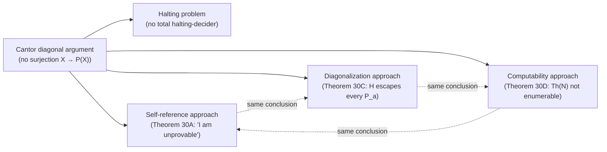

# Gödel's Incompleteness Theorems

[[book-guidelines|↩ Back to guidelines]]

## The tension this section resolves

Here is a sentence that shouldn't be able to exist: "This sentence is false."

If it's true, then what it says is the case, so it's false. If it's false, then what it says is *not* the case — but what it says is that it's false, so it must be true. Neither assignment is stable. This is the Liar Paradox, and it's usually treated as a curiosity about natural language, something you can wave away by saying "natural language is sloppy, formal systems don't have this problem."

Enderton's Chapter 3 spends its energy proving that formal systems have *exactly* this problem — and that the problem, correctly tamed, is not a contradiction but the single most consequential discovery in twentieth-century logic. A first-order theory of arithmetic strong enough to talk about basic facts of number theory turns out to be strong enough to talk about *itself*: about which strings of symbols are formulas, which sequences of formulas are deductions, and which sentences are theorems. Once a theory can encode its own syntax as arithmetic, you can build a sentence that — under the theory's own intended interpretation — asserts something about its own provability. Push that far enough and you get a sentence that says, in effect, "I am not provable."

Why doesn't this collapse into the Liar Paradox? Because "not provable" and "false" are different properties. A sentence can be true (in the intended model) without being provable (in the theory) — that gap is exactly what a genuinely first-order axiomatic theory allows, since deduction is a finite, checkable, purely syntactic process, while truth is a semantic fact about an infinite structure. The self-referential sentence doesn't oscillate between true and false; it just sits there being *true but unprovable*. That's not a paradox. That's a proof that provability and truth are not the same set. This is the entire content of the chapter, and it rests on machinery built earlier: **[[Arithmetization-of-Syntax|arithmetization of syntax]]** (Gödel numbering, from Sections 3.3–3.4), which is the technical trick that lets "a formula about numbers" also be "a formula about formulas." If you haven't internalized that formulas, proofs, and sets of axioms all get coded as natural numbers — and that the syntactic relations among them (is this deduction $d$ a proof of sentence $\sigma$ from axioms $A$?) become genuine *arithmetical* relations on those numbers — the rest of this article will feel like sleight of hand. It isn't; it's a direct consequence of the representability results already established.

This article covers Enderton's Section 3.5 (Incompleteness and Undecidability) and Section 3.7 (Second Incompleteness Theorem), plus the "three approaches" framing from Section 3.0 that Enderton uses to demystify the self-reference trick.

---

## The Fixed-Point Lemma: manufacturing self-reference on purpose

### The problem it solves

You want a sentence $\sigma$ that "talks about itself" — specifically, given any property $\beta$ (expressed as a formula with one free variable), you want a sentence that asserts "$\beta$ holds of me." You can't write this directly, because at the point you're writing $\sigma$, you don't yet know $\sigma$'s own Gödel number to plug into $\beta$. It looks circular in the bad way — like trying to write a function that returns its own not-yet-computed source code.

### The construction

Enderton's **Fixed-Point Lemma** states: given any formula $\beta$ in which only $v_1$ occurs free, there is a sentence $\sigma$ such that

$$A_E \vdash [\sigma \leftrightarrow \beta(S^{\sharp\sigma}0)]$$

Read the notation in words. $A_E$ is the base axiom system for arithmetic (a finite, fixed set of true sentences about $0$, $S$ = successor, $<$, $+$, $\cdot$, and exponentiation, built up in earlier sections). $\vdash$ is "proves." $\sharp\sigma$ is the Gödel number of $\sigma$ — the natural number that arithmetization assigns to the string of symbols making up $\sigma$. $S^n 0$ is the *numeral* for $n$: the term $SS\cdots S0$ with $n$ copies of $S$, which is how the object language names the number $n$. So $S^{\sharp\sigma}0$ is a term inside the theory that denotes the number $\sharp\sigma$ — i.e., a term that names $\sigma$'s own Gödel number. The whole biconditional says: *$A_E$ proves that $\sigma$ is equivalent to "$\beta$ holds of (the number naming) $\sigma$."* Enderton even introduces the shorthand $\ulcorner\sigma\urcorner$ for $S^{\sharp\sigma}0$, so the lemma reads $A_E \vdash (\sigma \leftrightarrow \beta(\ulcorner\sigma\urcorner))$ — visually closer to "$\sigma \leftrightarrow \beta(\sigma)$," which is exactly the self-referential shape you wanted, made rigorous.

Enderton is careful to puncture the mystique here: "$\sigma$ doesn't say anything; it's just a string of symbols." What licenses the "$\sigma$ talks about itself" reading is entirely the fact that we've set up an arithmetical *coding* under which numbers stand for expressions — the self-reference is a fact about the coding, not a magical property of the sentence.

**How the proof actually builds $\sigma$** (worth walking through once, because it de-mystifies the trick completely): let $\theta(v_1, v_2, v_3)$ be a formula that represents, in $\mathrm{Cn}\,A_E$, the function taking $(\sharp\alpha, n)$ to $\sharp(\alpha(S^n 0))$ — i.e., the function "take a formula $\alpha$, substitute numeral $n$ for its free variable, and report the Gödel number of the result." (This function is representable because substitution is a syntactic, hence arithmetized, hence representable operation — this is exactly the payoff of Section 3.4.) Form the formula $\forall v_3[\theta(v_1,v_1,v_3) \to \beta(v_3)]$, call its Gödel number $q$, and substitute the numeral for $q$ back in for $v_1$. The resulting sentence $\sigma$ ends up quoting its *own* construction recipe and then applying it to itself — the same move a quine makes.

### Grounding: the fixed-point lemma is the formal ancestor of a quine

The closest thing a working programmer has already built is a **quine**: a program that prints its own source code. A quine can't just contain a string literal of "its own source," because adding the literal changes the source. The standard trick — used identically in the fixed-point lemma — is to write a program in two parts: a *data* part $D$ (a string) and a *code* part that, given a string, treats it as a template and substitutes it into itself:

```python
s = 's = %r\nprint(s %% s)'
print(s % s)
```

Here `s` holds a *template* for the whole program, with a placeholder for "the source of `s` itself," and `print(s % s)` performs the substitution. The output is exactly the input. This is the fixed-point lemma's $\theta$ (a *representable substitution function*) applied to a formula that quotes itself via $q$ — Enderton's $\sigma$ is built by exactly this "template plus self-substitution" move, just carried out inside first-order arithmetic instead of Python's string formatting.

**What breaks without it:** without a way to make a formula that provably refers to its own Gödel number, there is no route from "arithmetic can encode syntax" to "arithmetic can make claims about its own provability." Representability (Sections 3.3–3.4) gives you the raw materials — the ability to talk *about* any given fixed formula from outside. The fixed-point lemma is what lets a formula talk about *itself*, closing the loop. Every theorem in this article is downstream of this one lemma.

<svg viewBox="0 0 640 300" xmlns="http://www.w3.org/2000/svg" font-family="Helvetica, Arial, sans-serif">
  <style>
    .box { fill: none; stroke: #6b7280; stroke-width: 1.5; }
    .lbl { fill: #6b7280; font-size: 13px; }
    .arrow { stroke: #6b7280; stroke-width: 1.5; fill: none; marker-end: url(#arrowhead); }
    .txt { fill: currentColor; font-size: 13px; }
    .txt-small { fill: currentColor; font-size: 11px; }
  </style>
  <defs>
    <marker id="arrowhead" markerWidth="8" markerHeight="8" refX="6" refY="3" orient="auto">
      <path d="M0,0 L6,3 L0,6 Z" fill="#6b7280"/>
    </marker>
  </defs>

  <rect class="box" x="30" y="30" width="220" height="70" rx="6"/>
  <text class="txt" x="45" y="55">formula β(v₁)</text>
  <text class="txt-small" x="45" y="75">"has property β"</text>

  <rect class="box" x="30" y="150" width="220" height="70" rx="6"/>
  <text class="txt" x="45" y="175">σ, a sentence</text>
  <text class="txt-small" x="45" y="195">contains ⌜σ⌝ = Sᵠᵟ0</text>

  <rect class="box" x="390" y="150" width="220" height="70" rx="6"/>
  <text class="txt" x="405" y="175">β(⌜σ⌝)</text>
  <text class="txt-small" x="405" y="195">"σ has property β"</text>

  <path class="arrow" d="M250 65 C 320 65, 320 65, 320 65 C 320 65, 260 150, 250 185"/>
  <text class="lbl" x="255" y="120">fixed-point construction</text>

  <path class="arrow" d="M250 185 L390 185"/>
  <text class="lbl" x="270" y="175">Aᴇ ⊢</text>

  <path class="arrow" d="M610 185 C 630 185, 630 100, 610 65 C 590 40, 300 40, 250 65" />
  <text class="lbl" x="330" y="30">encodes ⌜σ⌝ (self-reference via Gödel number)</text>

  <text class="txt-small" x="30" y="270">Loop: σ's own Gödel number is baked into σ by substitution,</text>
  <text class="txt-small" x="30" y="285">so σ ↔ β(⌜σ⌝) is a fact about σ itself — not circular, just self-referential by construction.</text>
</svg>

---

## Tarski's Undefinability Theorem (1933): truth can't define itself

### The problem it solves

Given the fixed-point lemma, an obvious question is: what happens if you feed it a formula $\beta$ that (you suspect) defines *truth in $\mathbb{N}$* — the set of Gödel numbers of sentences true in the standard structure $\mathfrak{N} = (\mathbb{N}; 0, S, <, +, \cdot, E)$? You get a sentence that says "I am not true" — the Liar Sentence, made completely rigorous.

### The theorem

**Tarski's Undefinability Theorem.** The set $\sharp\,\mathrm{Th}\,\mathfrak{N}$ (Gödel numbers of sentences true in $\mathfrak{N}$) is not definable in $\mathfrak{N}$.

The proof is short once you have the fixed-point lemma: suppose $\beta$ defined $\sharp\,\mathrm{Th}\,\mathfrak{N}$. Apply the fixed-point lemma to $\neg\beta$ to get $\sigma$ with $\models_{\mathfrak{N}} [\sigma \leftrightarrow \neg\beta(S^{\sharp\sigma}0)]$. If $\beta$ really did define truth, $\sigma$ would indirectly say "I am false" — and then $\sigma$ is true iff $\sigma$ is false, a genuine contradiction. Since no contradiction can actually arise (every sentence is either true or false in a structure), the only way out is that $\beta$ never defined $\sharp\,\mathrm{Th}\,\mathfrak{N}$ in the first place. The theorem doesn't produce a paradox — it produces a proof by contradiction that *no* formula does this job.

This immediately gives **Corollary 35A**: $\sharp\,\mathrm{Th}\,\mathfrak{N}$ is not recursive (not decidable) — because any recursive set is definable in $\mathfrak{N}$ (Corollary 34B), and truth isn't even definable, let alone decidable.

**What breaks without it:** if truth-in-$\mathfrak{N}$ *were* arithmetically definable, you could in principle build a decision procedure — or at least a formula — that settles every arithmetic question by table lookup against that definition. Tarski's theorem forecloses this permanently: there is a hard, structural gap between "expressible in the language of arithmetic" and "definable as a set of numbers within that same structure." Truth, for any sufficiently expressive language, outruns definability in that language. This is the semantic cousin of the syntactic phenomenon (provability outrunning truth) that the rest of the section develops.

### Grounding: this is Tarski's theorem, not a Gödel-numbering curiosity

If you've worked with reflection or metaprogramming, the shape should feel familiar: a system cannot, from inside itself, build a total, self-applicable "is this true" predicate over its own sentences — any attempted definition of "truth" that quantifies over the system's own statements and is expressible *in the same system* runs into exactly this diagonal wall. This is why serious formal-truth theories (Kripke's, or Tarski's own hierarchy of metalanguages) either give up totality or step up a level to a strictly stronger metalanguage to talk about the truth of the weaker object language. There is no way to stay at one level and get both totality and definability of your own truth predicate.

---

## The (First) Gödel Incompleteness Theorem (1931)

### The theorem, stated three ways

Enderton states the headline result plainly:

> **Gödel Incompleteness Theorem (1931).** If $A \subseteq \mathrm{Th}\,\mathfrak{N}$ and $\sharp A$ is recursive, then $\mathrm{Cn}\,A$ is not a complete theory.

In words: take any set $A$ of true axioms about arithmetic whose Gödel numbers form a *decidable* set (a "reasonable," mechanically checkable axiom system). The set of everything provable from $A$ — $\mathrm{Cn}\,A$ — can never equal the full set of arithmetic truths $\mathrm{Th}\,\mathfrak{N}$. There is always a true sentence your axioms cannot prove (and, symmetrically, cannot refute). *There is no complete recursive axiomatization of arithmetic truth.*

The proof rides directly on Tarski's theorem plus the observation (from Section 3.4) that a *complete* recursively axiomatized theory would itself be recursive. Since $\sharp\,\mathrm{Th}\,\mathfrak{N}$ is provably not recursive (Corollary 35A), no recursive $A$ with $\mathrm{Cn}\,A = \mathrm{Th}\,\mathfrak{N}$ can exist.

Enderton then extracts the sharper, more Gödel-flavored reading: for a specific recursive $A \subseteq \mathrm{Th}\,\mathfrak{N}$, take the formula $\beta$ (guaranteed to exist by representability) that defines $\sharp\,\mathrm{Cn}\,A$ in $\mathfrak{N}$, and run the fixed-point/Tarski construction against it. The resulting $\sigma$ is a *true* sentence not in $\mathrm{Cn}\,A$ — and it indirectly says "I am not a theorem of $A$." This is the version closer to Gödel's original 1931 argument, and it's genuinely constructive: you get your hands on the undecidable sentence, not just an existence proof.

### Strengthening: it doesn't matter which axioms, or how many you add

Two more results push this from "arithmetic truth is incomplete" to "*you cannot patch your way out of it*":

**Lemma 35B.** If $\sharp\,\mathrm{Cn}\,\Gamma$ is recursive, then $\sharp\,\mathrm{Cn}(\Gamma; \tau)$ is recursive (adding one new axiom $\tau$ — hence finitely many — preserves decidability of the axiom set).

**Theorem 35C (Strong Undecidability of $\mathrm{Cn}\,A_E$).** Let $T$ be any theory such that $T \cup A_E$ is consistent. Then $\sharp T$ is not recursive.

This is stronger than the incompleteness theorem — it says $\sharp T$ is undecidable *purely from consistency with $A_E$*, dropping the requirement that $A$ consist of true sentences. The proof follows the identical fixed-point recipe: assume $\sharp T'$ (where $T' = \mathrm{Cn}(T \cup A_E)$) is recursive, hence represented by some $\beta$; build $\sigma$ with $A_E \vdash [\sigma \leftrightarrow \neg\beta(S^{\sharp\sigma}0)]$ ("I am not in $T'$"); then show *both* $\sigma \in T'$ and $\sigma \notin T'$ lead to contradiction via consistency. The corollary that falls out (**Corollary 35D**) is Gödel's incompleteness theorem again, but with "truth in $\mathfrak{N}$" replaced by mere "consistency with $A_E$" — a genuinely more general statement, since it applies to *any* consistent extension of basic arithmetic, true or not.

**Church's Theorem (1936)** falls out as a special case: taking $T$ to be the set of *valid* sentences (in the language of $\mathfrak{N}$) in Theorem 35C shows the set of Gödel numbers of valid sentences is not recursive — i.e., *first-order validity itself is undecidable*, as soon as the language is expressive enough to interpret arithmetic (in fact, one two-place predicate symbol suffices, per Corollary 37G later).

**What breaks without this generality:** if incompleteness only applied to $\mathrm{Th}\,\mathfrak{N}$ specifically, you might hope some *other*, cleverer axiomatization of arithmetic — maybe one nobody's found yet — dodges the problem. Theorem 35C forecloses that hope entirely: *any* consistent, recursively axiomatized theory that includes $A_E$ (or is even just consistent with it) is undecidable and incomplete. There's no clever escape hatch; the limitation is about what representable arithmetic *is*, not about a particular choice of axioms.

---

## Three lenses on the same fact: self-reference, diagonalization, computability

Before Section 3.5 formalizes any of this, Enderton's Section 3.0 preview makes an important methodological point: incompleteness is provable via **three superficially different arguments that are, underneath, the same argument**. It's worth holding all three side by side, because each one illuminates a different aspect of *why* the phenomenon is inevitable rather than a quirk of one clever construction.

**1. Self-reference approach.** Build a sentence $\sigma$ that indirectly says "I am unprovable from $A$" (Theorem 30A). If $A \vdash \sigma$, then $\sigma$'s content is false, contradicting $A \subseteq \mathrm{Th}\,\mathfrak{N}$ — so $A \nvdash \sigma$, and by unwinding the construction, $\sigma$ turns out to be true. This is the version Section 3.5 formalizes rigorously (with a variant where $\sigma$ says "I am false," directly recreating the Liar Paradox as Tarski's theorem).

**2. Diagonalization approach.** Define $a\,P\,b \iff$ "the formula with Gödel number $a$ is true of $b$." Every definable-in-$\mathfrak{N}$ set of numbers is some "row" $P_a = \{b \mid \langle a,b\rangle \in P\}$ of this relation. Now diagonalize: let $H = \{b \mid \langle b,b\rangle \notin P\}$ ("$b$ is not true of itself"). $H$ differs from every $P_a$ at the point $b = a$ (Cantor's classic diagonal trick, the same one that proves $|\mathbb{R}| > |\mathbb{N}|$ and that the halting problem is undecidable), so $H$ is on no row — $H$ is not definable in $\mathfrak{N}$ at all. No self-referential sentence appears anywhere in this argument; it's pure counting-and-diagonal-escape, and it lands on the *same conclusion* as Theorem 30A ($\sharp\,\mathrm{Th}\,\mathfrak{N}$ isn't definable) by an entirely different route.

**3. Computability approach.** Any recursive (decidable) or even just effectively enumerable set of axioms yields an effectively enumerable set of theorems $\mathrm{Cn}\,A$ (Section 2.6's results, made precise later). But — via Church's thesis and another diagonal argument — $\mathrm{Th}\,\mathfrak{N}$ itself is *not* effectively enumerable. An enumerable set can never equal a non-enumerable one, so $\mathrm{Cn}\,A \neq \mathrm{Th}\,\mathfrak{N}$ for any such $A$, full stop (Theorem 30D). This framing is the most "engineering-flavored" of the three: it says the theorems your proof-checker can *ever list*, no matter how long you let it run, form a strictly smaller set than the true statements.

Enderton's own remark is the important takeaway: "It will be argued later ... that the three approaches are more closely related than they appear — they are three aspects of one approach." All three cash out the same underlying fact: a sufficiently expressive theory of syntax lets you build a diagonal object that escapes any fixed enumeration procedure, whether you frame that escape as *self-reference*, as *set-theoretic diagonalization*, or as *the limits of enumeration*. This is not a coincidence — it's the same combinatorial move (Cantor's diagonal argument) wearing three different formal costumes. If you've internalized the halting problem's proof (a program that, when run on its own source, does the opposite of what a hypothetical halting-decider predicts it does), you have *already seen* this move; Gödel's theorem is its cousin in the domain of provability rather than computation, and both are cousins of Cantor's original uncountability argument.



**What breaks without seeing all three:** if you only ever meet the self-reference version, incompleteness can feel like a magic trick performed once by a genius, hard to generalize or trust. Seeing the diagonalization and computability framings land on the identical conclusion — using nothing but set-counting and enumeration facts you likely already trust from computability theory — is what converts "clever proof" into "structural law." This matters directly for anyone building a theorem prover: you should expect this wall to show up in *any* framing you choose for reasoning about your own prover's reasoning, not just the syntactic one.

---

## Provability predicates and derivability conditions

Section 3.5 already used *truth in $\mathfrak{N}$* as the yardstick. Section 3.7 replaces truth with something more austere and more powerful: **provability itself, formalized as an arithmetic sentence.**

### Building $\mathrm{Prb}_T\,\sigma$

Suppose $T$ is a recursively axiomatizable theory with recursive axiom set $A$. As in item 20 of Section 3.4, "$a$ is a Gödel number of a theorem of $T$" is itself a recursive (in fact $\Sigma_1$-shaped, "$\exists d$ [...]") relation of $a$: there exists a deduction $d$ from $A$ ending in the sentence numbered $a$. Let $\pi(v_1, v_2)$ numeralwise represent that underlying recursive relation "$d$ is a deduction of the sentence numbered $v_1$." Then define:

$$\mathrm{Prb}_T\,\sigma \;=\; \exists v_2\, \pi(S^{\sharp\sigma}0, v_2)$$

Read in words: $\mathrm{Prb}_T\,\sigma$ is a *sentence of arithmetic* — not a statement in some external metalanguage — that asserts "there exists a deduction number witnessing that $\sigma$ is a theorem of $T$." This is the **provability predicate**: a formalized, internal stand-in for "$T \vdash \sigma$," built entirely out of arithmetic because deductions, being finite syntactic objects, are Gödel-numbered like everything else.

### Lemma 37A: reflection

**Lemma 37A.** (a) Whenever $T \vdash \sigma$, then $A_E \vdash \mathrm{Prb}_T\,\sigma$. (b) If additionally $A_E \subseteq T$, then $T$ has the **reflection property**: $T \vdash \sigma \Rightarrow T \vdash \mathrm{Prb}_T\,\sigma$.

In words: whenever the theory actually proves something, the theory (or at least $A_E$) can also prove *that it proved it* — because you can exhibit the deduction's Gödel number as a witness. Enderton flags a subtlety worth internalizing precisely: this says $T \vdash \sigma \Rightarrow T \vdash \mathrm{Prb}_T\sigma$, **not** $T \vdash (\sigma \to \mathrm{Prb}_T\sigma)$ as a single implication sentence. The first is a statement about the *provability relation itself* (a fact one level up, in the metatheory, about what $T$ can and can't derive); the second would be an internal sentence of $T$ asserting the implication for a specific $\sigma$, and it can genuinely fail — if $\sigma$ is true but unprovable, $(\sigma \to \mathrm{Prb}_{A_E}\sigma)$ is actually *false* in $\mathfrak{N}$, since its antecedent is true and consequent false. This distinction — proved-outside vs. provable-inside — is exactly the hinge the Second Incompleteness Theorem turns on.

### The self-referential unprovability sentence, again

Apply the fixed-point lemma to $\neg\mathrm{Prb}_T$: get $\sigma$ with $A_E \vdash (\sigma \leftrightarrow \neg\mathrm{Prb}_T\sigma)$ — "I am not provable in $T$." **Lemma 37B**: if $T \supseteq A_E$ is consistent, then $T \nvdash \sigma$. Proof is three lines: if $T \vdash \sigma$, then by reflection $T \vdash \mathrm{Prb}_T\sigma$; but by the choice of $\sigma$, $T \vdash \neg\sigma$ too — inconsistency. This is the same fact as before, but now phrased entirely as an internal provability claim rather than a claim about truth in $\mathfrak{N}$.

### The three derivability conditions

Enderton's key observation: the *proof* of Lemma 37B is short and combinatorially simple — so simple it might be **carried out inside $T$ itself**, if $T$ is expressive enough to reason about its own provability predicate the way we, from outside, just did. Formalize what "expressive enough" means as three conditions. A theory $T$ (recursively axiomatizable) is **sufficiently strong** iff:

1. $A_E \subseteq T$. (Gives reflection, by Lemma 37A(b): $T \vdash \sigma \Rightarrow T \vdash \mathrm{Prb}_T\sigma$.)
2. For every sentence $\sigma$: $T \vdash (\mathrm{Prb}_T\sigma \to \mathrm{Prb}_T\mathrm{Prb}_T\sigma)$ — reflection, *formalized inside $T$* as a provable implication, not just a metatheoretic fact.
3. For every $\rho, \sigma$: $T \vdash (\mathrm{Prb}_T(\rho \to \sigma) \to (\mathrm{Prb}_T\rho \to \mathrm{Prb}_T\sigma))$ — modus ponens, *formalized inside $T$*.

These are the **Hilbert–Bernays–Löb derivability conditions** (Enderton doesn't use that name, but this is the standard object). Condition 1 gives you provability tracking actual proof. Conditions 2–3 are what let $T$ *simulate its own reasoning about its own reasoning* — not just "if I proved it, I can show I proved it" (that's Lemma 37A, external), but "I can prove, as one of my own theorems, that provability behaves the way provability should behave."

### Grounding: Lean's kernel, and the wall it cannot cross

This is the single most direct, literal analogue to something a working Lean user has already run into. Lean's kernel is a small, trusted piece of code that checks proof terms. Lean *can* reason about its own definitional equality, reduce terms, and even reflect facts about decidable propositions into `Prop`-level proofs via `decide` — a genuine, working internal reflection mechanism, analogous in spirit to conditions 2–3 letting $T$ reason about its own $\mathrm{Prb}_T$. But there is a specific thing Lean's logic (or any similarly-founded proof assistant's logic) categorically cannot do: prove, as a theorem *inside* its own type theory, a `Prop`-valued statement that amounts to "the kernel's own logic is consistent" (no term of type `False` is ever derivable). If it could, that would be a sufficiently-strong system proving its own consistency sentence — precisely what's coming next.

**What breaks without formalizing derivability conditions explicitly:** without pinning down exactly which internal-reasoning-about-reasoning steps a theory can perform, "sufficiently strong" is hand-wavy — you can't tell in advance whether a specific $T$ (Peano arithmetic? ZF set theory? your own verifier's logic?) actually qualifies. The three conditions turn "sufficiently strong" from a vibe into a checklist you can verify theory-by-theory, which is exactly what Enderton does next for Peano arithmetic and set theory.

---

## The Second Incompleteness Theorem: you cannot prove your own consistency

### Setting up $\mathrm{Cons}\,T$

Define $\mathrm{Cons}\,T = \neg\mathrm{Prb}_T\, 0{=}S0$ — "$T$ does not prove the (obviously false, refutable-from-$A_E$) sentence $0 = S0$," read as "$T$ is consistent." This is a completely ordinary arithmetic sentence, built purely out of the provability predicate.

### Formalized Lemma 37B

Grinding through the derivability conditions carefully (Enderton walks the derivation step by step — applying formalized reflection, then formalized modus ponens, twice) yields:

$$T \vdash (\mathrm{Cons}\,T \to \neg\mathrm{Prb}_T\,\sigma)$$

for $T$ sufficiently strong and $\sigma$ the "I am unprovable" fixed point. Notice what's remarkable here: this whole chain of reasoning — the *unformalized* Lemma 37B was three lines long — is now itself a *theorem of $T$*. $T$ can internally verify "if I'm consistent, then this particular sentence isn't one of my theorems."

### The theorem

**Gödel's Second Incompleteness Theorem (1931).** Assume $T$ is sufficiently strong and recursively axiomatizable. Then $T \vdash \mathrm{Cons}\,T$ if and only if $T$ is inconsistent.

Read this precisely: it is *not* saying consistent sufficiently-strong theories can't prove things about consistency in general — it's saying they specifically cannot prove *the sentence asserting their own consistency*. The proof: if $T \vdash \mathrm{Cons}\,T$, then by Formalized Lemma 37B, $T \vdash \neg\mathrm{Prb}_T\sigma$; by the choice of $\sigma$ (which says exactly "I am not provable," i.e. $\sigma \leftrightarrow \neg\mathrm{Prb}_T\sigma$), this gives $T \vdash \sigma$. But (unformalized) Lemma 37B already told us $T \vdash \sigma$ implies $T$ is inconsistent. Contradiction closes the loop.

So the only theories that "prove their own consistency" are the inconsistent ones — and of course they do, since an inconsistent theory proves *everything*, true or false, including false claims about its own health. A genuinely consistent, sufficiently strong theory is permanently silent about its own consistency, from the inside.

### Löb's Theorem, and why it subsumes this

Enderton proves the sharper **Löb's Theorem (1955)**: if $T$ is sufficiently strong and $T \vdash (\mathrm{Prb}_T\tau \to \tau)$ for *any* sentence $\tau$, then $T \vdash \tau$ outright. (Slogan: "provable-implies-true" collapses to "just true," inside $T$, for any $\tau$ — you cannot bootstrap belief in $\tau$ merely from believing that $\tau$'s provability would establish $\tau$.) Setting $\tau = (0 = S0)$ recovers the Second Incompleteness Theorem immediately: $T \vdash (\mathrm{Prb}_T(0{=}S0) \to 0{=}S0)$ is exactly $T \vdash (\neg\mathrm{Cons}\,T \to 0{=}S0)$'s contrapositive form, i.e. $\mathrm{Cons}\,T \to \neg\mathrm{Prb}_T(0{=}S0)$-flavored reasoning — Löb's theorem forces $T \vdash 0{=}S0$, i.e., $T$ inconsistent, exactly when $T \vdash \mathrm{Cons}\,T$.

### Which theories actually qualify as "sufficiently strong"?

Enderton names two:

**Peano Arithmetic (PA).** $A_E$ plus every instance of the induction schema $\varphi(0) \wedge \forall x(\varphi(x)\to\varphi(Sx)) \to \forall x\,\varphi(x)$. PA is consistent — we know this because it's *true in $\mathfrak{N}$*, and true theories are automatically consistent. But by the Second Incompleteness Theorem, **PA cannot prove its own consistency.** We only "know" PA is consistent via an argument carried out in a *stronger* system — informal mathematics, or set theory. Enderton's framing: "set theory has a higher consistency strength than PA: it proves the consistency of PA and PA does not." Consistency proofs always have to borrow strength from *outside* the system whose consistency is in question — there is no free lunch, ever, for a sufficiently strong theory.

**Axiomatic set theory (ZF or similar), restricted to its arithmetic fragment.** Enderton builds this out carefully in the "Applications to Set Theory" subsection: construct an interpretation $\pi$ of $\mathrm{Cn}\,A_E$ into set theory (numbers become von Neumann ordinals: $0 \mapsto \emptyset$, $n+1 \mapsto n \cup \{n\}$), show the 17 required interpretability demands hold (Theorem 37D, Strong Undecidability of Set Theory), and then run the identical machinery to get **Gödel's Second Incompleteness Theorem for Set Theory**: $\mathrm{Cons}(\mathrm{ST})$ is not a theorem of ST, unless ST is inconsistent. And critically — unlike PA, whose consistency at least has the informal comfort of "true in the standard model $\mathfrak{N}$" — Enderton notes "it is not at all clear that we can meaningfully speak of a 'standard model of set theory'!" Set theory's consistency is even harder to certify from outside than PA's.

### Grounding: this is the literal ceiling on any Lean-shaped or Rust-shaped verifier

This is the most load-bearing result in the article for anyone building a compiler/verifier with an embedded automated theorem prover. If your verifier's internal logic is expressive enough to encode basic arithmetic (and any logic rich enough to reason about program states, loop counters, or recursive data structures typically is), then **your verifier's own logic cannot prove its own consistency, full stop — not as a missing feature to someday add, but as a mathematical impossibility.** This isn't Lean-specific pessimism; Lean's own kernel is a real-world instance of exactly this theorem, and it's why Lean (like every serious proof assistant: Coq, Isabelle, Agda) does not attempt to certify its own soundness from within its own `Prop`. Trust in Lean's consistency instead comes from *outside* — from a much smaller, independently-checkable metatheoretic argument about the kernel's type theory (analogous to Enderton's move of needing set theory, a *stronger* system, to vouch for PA), or ultimately from empirical confidence (no contradiction has been derived in decades of heavy use) rather than a from-within proof.

Practically, for a Rust verifier with an embedded prover: you cannot design the system so that it emits, as one of its own certified outputs, "and by the way, this proof system is sound" — that output, if your logic is sufficiently strong, is either unobtainable or a red flag that something's already broken. Trust has to be anchored *outside* the checked system: in a small trusted kernel whose soundness is argued informally/externally (the classical "de Bruijn criterion" approach every credible proof assistant uses — keep the trusted core tiny enough that a human can audit it directly, since the core itself can never certify itself).

**What breaks without knowing this ceiling exists:** a team building a theorem prover without internalizing the Second Incompleteness Theorem risks two failure modes: (1) wasting effort trying to have the system prove its own soundness as an internal feature — a dead end, provably; (2) worse, mistakenly trusting a system that *does* produce an internal "I am consistent" certificate, not realizing that such a certificate is only possible from an inconsistent (hence unsound, hence dangerous) system. Knowing the theorem in advance turns a possible design catastrophe into an architectural decision made correctly from day one: keep a small trusted kernel, verify it externally, and never ask the big expressive logic to vouch for itself.

---

## Where this leads

Structurally, this section is the payoff of everything Chapter 3 built up to this point. Arithmetization of syntax (3.3–3.4) turned "formulas, proofs, and axiom sets" into "natural numbers and arithmetic relations on them," purely as bookkeeping. This section is where that bookkeeping stops being bookkeeping and starts *biting*: the fixed-point lemma exploits the coding to manufacture genuine self-reference, and everything else — Tarski's theorem, both incompleteness theorems, Church's theorem, the undecidability of validity itself — falls out of that one construction reapplied to different target formulas ($\neg\beta$ for Tarski, $\neg\mathrm{Prb}_T$ for the first incompleteness sentence, and so on).

The book's very next section, **3.8 (Representing Exponentiation)**, is explicitly a piece of unfinished business from earlier: Enderton's representability results throughout Sections 3.3–3.7 quietly assumed exponentiation was available as a primitive of the language (needed for the $\beta$-function trick that lets a single number code an arbitrary-length sequence, which is in turn what makes "Gödel number of a deduction" — a sequence of formulas — expressible at all). Section 3.8 goes back and discharges that assumption rigorously, by showing exponentiation itself is definable from just $+$ and $\cdot$ in $\mathfrak{N}$. It's the last piece of "making the arithmetization machinery from earlier actually rigorous" — worth reading as an appendix to this section rather than a new topic, since without it the entire chapter's coding apparatus would rest on an unproven convenience.

For the standing learning goals: this is **the** hard limit your Rust verifier/theorem-prover project needs to internalize before design decisions get made, not after. The Second Incompleteness Theorem isn't a caveat about *this particular* system of arithmetic — Theorem 35C (strong undecidability) and the sufficiently-strong-theory framework generalize it to *any* consistent, recursively axiomatizable, sufficiently expressive theory, which very much includes whatever internal logic your prover ends up embedding. Plan for a small, externally-audited trusted kernel from the start; do not plan for the kernel to certify itself. Separately, the fixed-point lemma's "template quotes itself, then substitutes" technique is the direct ancestor of every reflection/quining trick that shows up when *any* system — a macro expander, a staged compiler, a self-hosting compiler compiling itself — needs to reason about or reproduce its own syntax; recognizing the pattern here will make those mechanisms far less mysterious when you build them.
