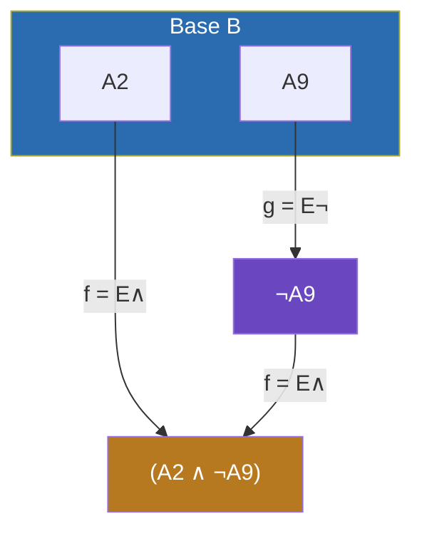
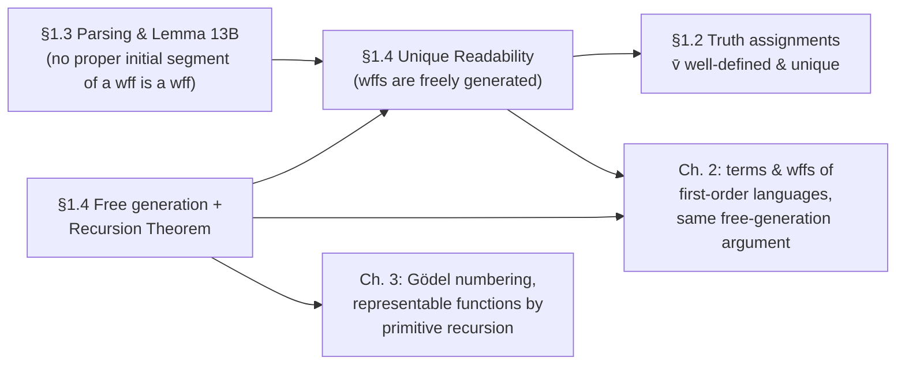

# Induction and Recursion on Freely Generated Sets

[[book-guidelines|↩ Back to guidelines]]

## Why this section has to exist

Go back to §1.2 for a moment. Enderton wants to extend a truth assignment $v$ (which only knows how to grade *sentence symbols*) into $\bar v$, a function that grades *every wff*, via the obvious rules — $\bar v((\neg\alpha)) = T$ iff $\bar v(\alpha) = F$, and so on. That definition looks completely innocent. You've probably written the recursive-descent equivalent of it a dozen times without a second thought: `eval(Not(a)) = !eval(a)`.

But stop and ask what licenses that definition. A wff is defined as *whatever you can build* from sentence symbols using $\neg, \wedge, \vee, \rightarrow, \leftrightarrow$. That's an existential, generative description — "the set of things reachable by these operations" — not a case-by-case enumeration you could induct over by hand. Two things could go wrong with "define $\bar v$ by cases on how $\alpha$ was built":

1. **Existence might fail.** The recursive equations you write down might be mutually contradictory — there might be no function satisfying all of them at once. Enderton gives a clean example of this a few pages in: define $h$ on the natural numbers (built from $0$ by successor and, artificially, by $x \mapsto x\cdot x$) with $h(0)=0$, $h(x\cdot y) = h(x)\cdot h(y)$, $h(x+1) = h(x)+2$. Since $1 = 0+1$ but also $1 = 1\cdot 1$, you get two conflicting demands on $h(1)$, and no such $h$ exists.
2. **Uniqueness might fail.** Even if some function satisfying the equations exists, there might be several, if the "cases" aren't really mutually exclusive — if the same wff could be read two different ways.

So before Enderton can even say "$\bar v$ is *the* extension of $v$," he owes the reader a theorem that (a) says exactly what property of a generating process guarantees this kind of case-based definition is safe, and (b) proves that wffs actually have that property. That's what §1.4 delivers, in full generality, decoupled from truth assignments entirely — because the same machinery will be needed again for first-order terms and wffs in Chapter 2, and for Gödel numbering in Chapter 3. This is one of those sections that looks like a detour into abstract nonsense and turns out to be the load-bearing wall for everything downstream.

If you're building a compiler or a proof checker, you should recognize this problem immediately: it's exactly "is my recursive evaluator over this AST well-defined, and does it terminate with one answer?" Enderton's answer is the mathematical version of what makes `match` over a Rust `enum` — or a recursor in Lean's kernel — sound in the first place.

## Generating a set from a base

**The problem, informally.** You have some universe $U$, a starting set $B \subseteq U$ of "bricks," and some operations that are the "mortar." You want the smallest subset of $U$ containing the bricks and closed under the mortar — everything buildable from $B$ in finitely many applications of the operations, and nothing else.

Enderton fixes ideas with one binary operation $f : U \times U \to U$ and one unary operation $g: U \to U$ (he notes the discussion generalizes to any family of operations, or even relations — Exercise 3 of this section, and this is exactly the generality Chapter 2 needs for $n$-ary function and predicate symbols). The set of interest, $C$, is defined **two different ways**, and the first real theorem of the section is that they agree.

**Top-down (the smallest closed set).** Call $S \subseteq U$ *inductive* if $B \subseteq S$ and $S$ is closed under $f$ and $g$ (i.e. $x,y \in S \Rightarrow f(x,y) \in S$, $x \in S \Rightarrow g(x) \in S$). Define

$$C^{\star} = \bigcap \{\, S \subseteq U \mid S \text{ is inductive} \,\}.$$

An intersection of inductive sets is itself inductive, so $C^\star$ is the *smallest* inductive set — literally "the intersection of every set that would work."

**Bottom-up (build it by hand).** A *construction sequence* is a finite sequence $x_1,\dots,x_n$ where every $x_i$ is either in $B$, or equals $f(x_j,x_k)$ for some earlier $j,k < i$, or equals $g(x_j)$ for some earlier $j<i$. Let $C_\star$ be the set of all points reachable as the *last* element of some construction sequence.

These read as two different definitions of "the wffs," and Enderton proves $C^\star = C_\star$ (call the common set $C$, "generated from $B$ by $f$ and $g$"): $C_\star$ is easily checked to be inductive (concatenate two construction sequences and append the new point), so $C^\star \subseteq C_\star$; conversely an ordinary induction on the length $i$ of a construction sequence shows every $x_i$ lands in every inductive set, so $C_\star \subseteq C^\star$.

**What breaks without this equivalence.** The top-down definition is what you *reason about* (it's a clean fixed-point characterization, good for proofs). The bottom-up definition is what you'd *implement* (a parser or a term-builder literally constructs terms this way, symbol by symbol). If these could disagree, "prove a property of all wffs" and "prove a property by structural recursion on how a wff was built" would be two different, potentially inconsistent activities. The equivalence is what lets you freely switch between "reason about the smallest inductive set" and "reason about how something was actually built," which is exactly what a compiler-writer does constantly without noticing.

**Rust grounding.** The top-down set is the type; the bottom-up process is construction:

```rust
enum Wff {
    Sym(String),                    // base case: B
    Not(Box<Wff>),                  // g
    And(Box<Wff>, Box<Wff>),        // f (one of five binary variants in the real language)
}
```

The *type* `Wff` is exactly $C^\star$: "the smallest set of trees closed under these constructors." Every value you can actually build at runtime — `Wff::Not(Box::new(Wff::Sym("A".into())))` — is a construction sequence made concrete as a call stack. Rust's type system enforces $C^\star = C_\star$ for you *by construction*: you cannot produce a `Wff` value except by bottoming out at `Sym` or applying `Not`/`And` to already-built `Wff`s. There is no back door to conjure a `Wff` that wasn't built this way — which is precisely the property Enderton has to *prove*, because in his set-theoretic universe $U$ (say, the set of all finite strings) nothing stops you from writing down a string that merely *looks like* a wff without a valid construction sequence behind it. That's a large part of why §1.3's parsing algorithm and unique readability matter later in this very section.

**Lean grounding.** This maps even more literally onto an `inductive` type:

```lean
inductive Wff where
  | sym : String → Wff
  | not  : Wff → Wff
  | and  : Wff → Wff → Wff
```

Lean's kernel *takes $C^\star = C_\star$ as a primitive*, rather than proving it from more basic set theory: an inductive type just *is* the smallest type closed under its constructors, and the elaborator generates a recursor (`Wff.rec`) that encodes exactly the top-down "smallest closed set" reading. Enderton is doing, by hand, in ZFC, the metatheoretic work that Lean's kernel discharges automatically whenever you write `inductive`.

## The abstract Induction Principle

Once $C$ (generated from $B$ by $f,g$) is nailed down, the payoff is a proof technique:

> **Induction Principle.** If $S \subseteq C$ includes $B$ and is closed under $f$ and $g$, then $S = C$.

The proof is a one-liner given the top-down characterization: $S$ is inductive, so $C = C^\star \subseteq S$; and $S \subseteq C$ was assumed. Done.

This is the general shape of *every* structural induction proof you've ever written: "show the property holds on the base cases, show it's preserved by each constructor, conclude it holds everywhere." Enderton immediately puts it to work: he defines a "special" wff to be one using only symbols from $\{A_2,A_3,A_5\}$ and connectives from $\{\neg,\rightarrow\}$, and uses [[Sentential-Propositional-Logic#The Induction Principle|the Induction Principle]] to show every wff is either special or requires $\wedge$/$A_9$/etc. — by checking that "special-or-not-special" is closed under all five formula-building operations.

**Rust/Python grounding.** This is `match` exhaustiveness plus structural recursion, stated as a theorem instead of assumed as a language guarantee:

```rust
fn is_special(w: &Wff) -> bool {
    match w {
        Wff::Sym(s) => ["A2", "A3", "A5"].contains(&s.as_str()),
        Wff::Not(a) => is_special(a),
        Wff::And(_, _) => false,   // ∧ isn't in the allowed set
        // ... other connectives recurse the same way
    }
}
```

The compiler enforces that this function is total over `Wff` precisely because the `match` covers every constructor — which is a syntactic proxy for "the property $S$ = {special-or-not} is closed under $f$ and $g$." Enderton has to *argue* closure; Rust's exhaustiveness checker verifies a very similar thing for you at compile time (though it doesn't verify the semantic content of each branch — only that every constructor is handled).

## Free generation: the condition that makes recursive definitions safe

Generation alone (existence of $C$) is *not enough* to define functions on $C$ by cases. Enderton's motivating counterexample, restated: $U = \mathbb R$, $B=\{0\}$, $f(x,y)=x\cdot y$, $g(x) = x+1$; then $C = \mathbb N$, but $1 = g(0)$ *and* $1 = f(g(0),g(0))$ — two different "derivations" of the same value — so a definition of $h$ by cases on which rule produced $x$ genuinely doesn't know which case applies to $1$, and (as shown above) the two cases can actively contradict each other.

The fix has a name from group theory (Enderton draws the analogy explicitly: a free group on generators $B$ is exactly the case where any map of $B$ into another group extends uniquely to a homomorphism):

> $C$ is **freely generated** from $B$ by $f$ and $g$ iff, in addition to being generated, the restrictions $f{\restriction}C$ and $g{\restriction}C$ satisfy:
> 1. $f{\restriction}C$ and $g{\restriction}C$ are **one-to-one**.
> 2. $\operatorname{ran}(f{\restriction}C)$, $\operatorname{ran}(g{\restriction}C)$, and $B$ are **pairwise disjoint**.

In plain terms: every element of $C$ was built in *exactly one way* — you can always tell, just by looking at $x \in C$, whether it's a base element, or came from applying $f$ to a unique pair, or applying $g$ to a unique predecessor, and these possibilities never overlap. Compare the natural numbers under successor alone (freely generated: successor is injective, $0$ isn't a successor) against the integers under successor *and* predecessor (not free: $g(g(x)) = x$ collapses distinctness) or the algebraic functions under $+,\times,\div,\sqrt{}$ (not free: e.g. $x + x$ and $2 \cdot x$ are the same function reached two ways).

**What this buys you: the Recursion Theorem.**

> **Recursion Theorem.** Suppose $C \subseteq U$ is freely generated from $B$ by $f,g$ (of the stated arities), and $V$ is a set with $h: B \to V$, $F: V\times V \to V$, $G: V \to V$. Then there is a **unique** $\bar h: C \to V$ such that
> $$\bar h(x) = h(x) \ \ (x \in B), \qquad \bar h(f(x,y)) = F(\bar h(x),\bar h(y)), \qquad \bar h(g(x)) = G(\bar h(x)).$$

Enderton's own gloss is worth keeping verbatim: think of $\bar h$ as *painting* every element of $C$ some color. $h$ tells you the colors of the bricks; $F$ tells you how to combine the colors of $x,y$ into the color of $f(x,y)$; $G$ tells you how to convert the color of $x$ into the color of $g(x)$. The danger is a **collision** — some point being reachable both as $f(x,y)$ and as $g(z)$, with $F$ and $G$ voting for different colors on the same point. Freeness is *exactly* the hypothesis that rules this out: disjoint ranges mean no point is ever reached two structurally-different ways, and injectivity of $f,g$ means that even within one construction rule, the "arguments" ($x,y$, or $z$) that produced a given point are uniquely recoverable — so $F$ and $G$ are always being asked to combine a well-defined pair of already-computed colors, never an ambiguous one.

Read algebraically (as Enderton flags), [[Godels-Incompleteness-Theorems#The theorem|the theorem]] says exactly: *any map of the generators into another algebra extends uniquely to a homomorphism* — the universal property of a free algebra, specialized to the one-binary/one-unary-operation signature.

**Proof sketch (the "acceptable function" argument).** This is worth internalizing because it's a genuinely reusable technique, not just this-theorem-only machinery. Call a partial function $v$ (domain $\subseteq C$, range $\subseteq V$) *acceptable* if it respects the defining equations wherever it's defined — i.e. it agrees with $h$ on $B \cap \operatorname{dom} v$, and whenever $f(x,y)$ or $g(x)$ is in $\operatorname{dom} v$, so are $x$ (and $y$), with the value computed via $F$ or $G$. Let $\bar h = \bigcup \{v \mid v \text{ acceptable}\}$ — literally the union, as a set of ordered pairs, of *every* finite (or partial) approximation that respects the rules. Four things need checking, and only step 3 uses freeness:

1. $\bar h$ is single-valued (any two acceptable functions that are both defined at a point must agree there — proved by the Induction Principle applied to $S = \{x \mid \text{all acceptable functions agree at } x\}$).
2. $\bar h$ is itself acceptable (immediate from being a function and a union of acceptable pieces).
3. $\bar h$'s domain is all of $C$ — proved by showing $\operatorname{dom}\bar h$ is inductive. This step needs freeness: to show $g(x) \in \operatorname{dom}\bar h$ whenever $x \in \operatorname{dom}\bar h$, you extend $\bar h$ by one pair, $v = \bar h \cup \{\langle g(x), G(\bar h(x))\rangle\}$, and to show *this* is still acceptable you must rule out $g(x)$ accidentally colliding with some $f(s,t)$ or with a base point — which is exactly what disjoint ranges guarantee.
4. Uniqueness — two solutions agree on an inductive set, hence agree everywhere, by the Induction Principle again.

So the entire proof is: *take the union of every partial, locally-consistent attempt, and use freeness to show the union never has to make an inconsistent choice and never runs out of domain.* That "union of consistent partial approximations" pattern reappears verbatim in Chapter 2's completeness theorem (Henkin sets) and is a close cousin of how a type-checker with mutable inference state accumulates a substitution one consistent constraint at a time.

**Rust grounding — this is why `match` over an `enum` terminates with one answer.** The Recursion Theorem is the theoretical justification for writing:

```rust
fn eval(w: &Wff, env: &HashMap<String, bool>) -> bool {
    match w {
        Wff::Sym(s) => env[s],                          // h : B → V
        Wff::Not(a) => !eval(a, env),                    // G : V → V
        Wff::And(a, b) => eval(a, env) && eval(b, env),  // F : V×V → V
    }
}
```

This function is well-defined — one output per input, no ambiguity — *because* Rust's `enum` constructors are, by the language's own semantics, mutually exclusive and injective (you can always pattern-match to recover which variant built a value, and its arguments). That is `Wff` being freely generated, enforced structurally by the language rather than proved as a theorem about strings. Enderton is proving, the hard way, the fact your language runtime is quietly assuming every time it lets you write a recursive function over an algebraic data type.

**Lean grounding — this is the recursor.** Lean elaborates a `match`/structural-recursion definition into an application of the type's *recursor*, `Wff.rec`, whose type signature is a direct transliteration of the Recursion Theorem: give it a motive, a case for `sym`, a case for `not` (using the recursive result on the sub-wff), a case for `and` (using both recursive sub-results), and it produces a total function on `Wff`. The "freeness" conditions (constructors injective, ranges disjoint) are exactly what the kernel's definitional-equality checker relies on when it reduces `Wff.rec (motive) hsym hnot hand (Wff.not a)` to `hnot a (Wff.rec ... a)` by `iota`-reduction — that reduction step *is* the equation $\bar h(g(x)) = G(\bar h(x))$, and it's only sound because no other constructor could also have produced `Wff.not a`.

## The Unique Readability Theorem for wffs

This is the section's payoff for sentential logic specifically: verifying that Example 4 throughout (wffs generated from sentence symbols by the five formula-building operations $E_\neg, E_\wedge, E_\vee, E_\rightarrow, E_\leftrightarrow$) is not just *generated* but *freely* generated.

> **Unique Readability Theorem.** The five formula-building operations, restricted to the set of wffs,
> (a) have ranges that are pairwise disjoint from each other and from the set of sentence symbols, and
> (b) are one-to-one.
> Equivalently: the set of wffs is freely generated from the sentence symbols by the five operations.

**Proof, condensed.** Injectivity: if $(\alpha \wedge \beta) = (\gamma \wedge \delta)$, delete the leading "(" from both sides to get $\alpha \wedge \beta) = \gamma \wedge \delta)$; then $\alpha = \gamma$ (else one is a proper initial segment of the other, contradicting §1.3's Lemma 13B — no proper initial segment of a wff is itself a wff), and hence $\beta = \delta$ follows immediately after. Disjoint ranges: if $(\alpha \wedge \beta) = (\gamma \rightarrow \delta)$, the same "peel the parenthesis" argument forces $\alpha = \gamma$, which forces $\wedge = \rightarrow$ as symbols — contradiction, since the connective symbols are all distinct. The negation and atomic cases are handled by simpler observations (no wff begins with $\neg$ immediately followed by $\wedge$-shaped content in the way a binary case would, and no sentence symbol is a sequence starting with "(").

This is exactly the theorem quietly invoked back in §1.2: to extend a truth assignment $v: S \to \{F,T\}$ to $\bar v$ on all wffs built from $S$, you need (i) the wffs generated from $S$ to be *freely* generated — supplied by Unique Readability — and then (ii) the Recursion Theorem fires and hands you existence and uniqueness of $\bar v$ for free. Enderton makes this dependency explicit: "by applying the unique readability theorem and the recursion theorem we conclude that there is a unique extension." Everything in §1.2 that looked obvious was actually resting on these two theorems.

A worked instance Enderton gives, worth keeping as a template: the Recursion Theorem also justifies a *length* function $h$ on wffs, defined by $h(A) = 1$ for sentence symbols and $h((\neg\alpha)) = 3 + h(\alpha)$, $h((\alpha\wedge\beta)) = 3+h(\alpha)+h(\beta)$ (and likewise for the other three binary connectives) — a definition that looks unremarkable until you realize its well-definedness is, again, a direct corollary of Unique Readability plus the Recursion Theorem, not a free assumption.

**Why this is the theorem behind parser/pretty-printer correctness.** Unique Readability is precisely the statement "the string representation of a wff determines a unique AST, and that AST determines a unique string" — parsing and pretty-printing are mutually inverse. Concretely:

- **Injectivity of each $E_c$** says: two different pairs of sub-wffs never pretty-print to the same string under connective $c$. This is what makes a recursive-descent *parser* deterministic — when you see `(... ∧ ...)`, there's only one way to split it back into `α` and `β`.
- **Disjoint ranges** says: no string produced by one connective could also have been produced by another, or coincide with a bare symbol. This is what makes `match` on the *first token* of a string (or the outermost constructor of a parsed tree) an exhaustive, non-overlapping dispatch — nobody's `Wff::And` output can be misread as a `Wff::Not` output.

In Rust terms, Unique Readability is the theorem that says: **serializing a `Wff` to a string and re-parsing it is a genuine bijection with the original tree** — which is precisely the round-trip property you'd want to unit-test for any AST + printer + parser triple in a real compiler, and precisely the property that fails if your grammar is ambiguous (e.g. omitting parentheses without a precedence table, which is why Enderton is so careful about parenthesization in §1.1–1.3 before he ever states this theorem).

## Diagram: how free generation prevents a collision



Every node here was reached in exactly one way — that's what "freely generated" buys. Contrast with the broken example from the section: $U=\mathbb R$, $B=\{0\}$, $f(x,y)=x\cdot y$, $g(x)=x+1$. There, $1$ is reachable as $g(0)$ *and* as $f(g(0), g(0))$ — two incoming arrows into the same node from different rules — and that's exactly the structural shape that makes defining $h$ by cases on "how was this point built" incoherent:

<svg viewBox="0 0 640 260" xmlns="http://www.w3.org/2000/svg" font-family="sans-serif" font-size="15">
  <rect x="0" y="0" width="640" height="260" fill="none"/>
  <circle cx="120" cy="60" r="26" fill="#2b6cb0"/>
  <text x="120" y="65" text-anchor="middle" fill="#ffffff">0</text>

  <circle cx="120" cy="180" r="26" fill="#6b46c1"/>
  <text x="120" y="185" text-anchor="middle" fill="#ffffff">g(0)</text>

  <circle cx="480" cy="120" r="30" fill="#b7791f"/>
  <text x="480" y="126" text-anchor="middle" fill="#ffffff">1</text>

  <line x1="140" y1="80" x2="470" y2="105" stroke="#888888" stroke-width="2" marker-end="url(#arrow)"/>
  <text x="290" y="80" fill="#a0aec0">g(0) = 1  (via g)</text>

  <line x1="146" y1="180" x2="452" y2="130" stroke="#888888" stroke-width="2" marker-end="url(#arrow)"/>
  <line x1="146" y1="192" x2="452" y2="140" stroke="#888888" stroke-width="2" marker-end="url(#arrow)"/>
  <text x="230" y="220" fill="#a0aec0">f(g(0), g(0)) = 1  (via f)</text>

  <text x="480" y="170" text-anchor="middle" fill="#e53e3e">h(1) = G(h(0))  vs.  h(1) = F(h(g(0)), h(g(0))) — conflict</text>

  <defs>
    <marker id="arrow" markerWidth="10" markerHeight="10" refX="8" refY="3" orient="auto">
      <path d="M0,0 L8,3 L0,6 Z" fill="#888888"/>
    </marker>
  </defs>
</svg>

Two arrows converge on node `1` from structurally different derivations — $g$ applied to $0$, and $f$ applied to $g(0)$ twice — so any rule defining $h$ "by cases on how the point arose" is being asked to satisfy two possibly-contradictory equations at once. Free generation is precisely the guarantee that no node in the wff-construction graph ever has more than one incoming derivation, of any kind — which is exactly what licenses the recursive definition of $\bar h$ on `Wff` (or `Wff.rec` in Lean, or a `match` in Rust) as a *total, single-valued* function.

## Where this leads

Structurally, §1.4 is the load-bearing joint between two things Enderton has already built and one he's about to build:



Everything downstream that says "define X by cases on the structure of a wff/term/deduction" — truth-value extension, substitution, Gödel numbering, the [[Arithmetization-of-Syntax|arithmetization of syntax]] in Chapter 3 — is a fresh application of exactly this Recursion Theorem, re-derived from freeness each time the underlying alphabet changes.

**This is genuinely load-bearing for the compiler/verifier and elaborator projects.** The Recursion Theorem, stated abstractly here, *is* the formal justification for:

- **Structural recursion over an AST being well-defined at all** — every `match`-based evaluator, type-checker, or substitution function you write in your Rust verifier is implicitly invoking this theorem, with your `enum`'s constructors playing the role of $B$/$f$/$g$ and your language's exhaustiveness/injectivity guarantees playing the role of freeness.
- **Why an elaborator's kernel can trust `iota`-reduction (structural unfolding of recursive definitions) as a step of definitional equality** — the "acceptable partial function, union them all, freeness prevents collision" proof is the metatheoretic content behind Lean's recursor and its reduction rules; whenever `isDefEq` unfolds a recursive function call one step, it's relying on exactly the injectivity/disjointness Enderton proves by hand for wffs.
- **Parser/printer round-trip correctness** — Unique Readability, specialized to your own grammar, is the theorem you'd want to state and prove (or at least test) for any hand-rolled recursive-descent parser paired with a pretty-printer, and it's exactly the property that silently fails when a grammar is ambiguous.

In short: this section is the first place in the book where "define a function recursively over syntax" gets a real proof of soundness, rather than an appeal to intuition — and that proof is the direct mathematical ancestor of the machinery your verifier and elaborator will lean on every time they recurse over a term.
