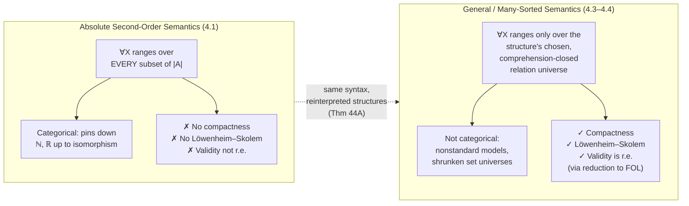

# Many-Sorted and General Second-Order Logic

[[book-guidelines|↩ Back to guidelines]]

## The tension this section resolves

Absolute second-order semantics is the version of second-order logic where quantifiers like $\exists X$ ("there exists a predicate $X$") range over *every* subset of the domain, full stop, no negotiation. That's what makes second-order logic powerful enough to pin $\mathbb{N}$ down up to isomorphism with a handful of axioms — first-order logic can never do that, because of compactness. But that same rigidity is what kills compactness, [[Soundness-and-Completeness#The Löwenheim–Skolem Theorem|the Löwenheim–Skolem theorem]], and effective enumerability of validity for second-order logic itself. You get expressive power and you lose the three theorems that made first-order logic tractable to reason *about*. There's no way to recursively enumerate all second-order validities, no guarantee a satisfiable second-order theory has a countable model, no compactness argument for building nonstandard models.

That's a bad trade if you're trying to build tooling around the logic — a checker, a proof search procedure, anything algorithmic. So the natural question, and the one this section answers, is: can we keep the syntax of second-order logic (the same formulas, the same quantifiers over predicates and functions) while changing what a "structure" is allowed to mean, in a way that buys the metatheorems back?

The answer is yes, and the mechanism is almost embarrassingly simple once you see it: stop treating "the set of all subsets" as a fixed, God-given notion, and instead treat predicate-variables and function-variables as *ranging over a universe supplied by the structure itself* — exactly the way individual variables already do. In other words: make second-order logic many-sorted first-order logic wearing a costume. This is precisely the move a compiler engineer makes constantly: take an expressive-but-intractable feature and give it a restricted, checkable encoding that behaves like the real thing in all the cases you care about. Section 4.3 builds the general apparatus (many-sorted first-order languages, and the fact that they reduce to ordinary first-order logic with no loss). Section 4.4 applies that apparatus specifically to second-order logic, producing "general" semantics as an alternative to "absolute" semantics — and gets compactness, Löwenheim–Skolem, and enumerability back, at the cost of giving up categorical characterization of $\mathbb{N}$.

## Many-sorted languages: first-order logic with labeled universes

### The idea, before the notation

Ordinary first-order logic has one universe: every variable, every quantifier, ranges over the same set $|\mathfrak{A}|$. Many-sorted logic just says: what if we had several universes, and every variable came pre-labeled with which universe it ranges over? You already do this informally in math prose — "let $i$ range over ordinals, $A$ over sets of integers" — many-sorted logic is that informal convention made syntactically rigorous. Each symbol (variable, predicate, function, constant) is tagged with a *sort* (or a tuple of sorts, for predicates/functions with several argument slots), and a well-formed term or formula must respect those tags — you can't apply a predicate of sort $\langle i_1,\dots,i_n\rangle$ to terms of the wrong sorts.

Enderton is explicit that "none of the results of this section are at all deep" — many-sorted logic isn't a new logic, it's a bookkeeping layer on top of first-order logic. The book's own agenda for Section 4.3 is to prove that layer is *free*: anything you can say and derive in many-sorted logic, you can already say and derive in plain one-sorted first-order logic, so all the first-order metatheorems (compactness, Löwenheim–Skolem, enumerability) transfer over automatically. That transfer is the entire payoff, and it's what Section 4.4 will exploit.

### Rust grounding: sorts as a tagged universe

This is close to a type system with one flat enum discriminating "kinds" of values, except the discriminant lives at the level of the *variable declaration*, not the runtime value:

```rust
enum Sort {
    Individual,
    Predicate(usize),   // n-place predicate sort
    Function(usize),    // n-place function sort
}

struct Var {
    name: String,
    sort: Sort,
}

// A predicate symbol of sort <i1,...,in> can only be applied
// to terms whose sorts match i1,...,in — this is checked once,
// syntactically, before any semantics is assigned.
struct PredicateSymbol {
    name: String,
    arg_sorts: Vec<Sort>,
}
```

A many-sorted structure $\mathfrak{A}$ is then just: one universe set `|A|_i` per sort `i` (in Rust terms, one `Vec<T_i>` or domain per sort), plus interpretations of the predicate/function/constant symbols as relations and functions over the *appropriate* domains. Enderton's formal definition (p. 296) is exactly this: to the sort-$i$ quantifier symbol $\forall^i$, $\mathfrak{A}$ assigns a nonempty universe $|\mathfrak{A}|_i$; to a predicate symbol of sort $\langle i_1,\dots,i_n\rangle$, a relation $P^{\mathfrak{A}} \subseteq |\mathfrak{A}|_{i_1} \times \cdots \times |\mathfrak{A}|_{i_n}$; and similarly for constants and functions.

### What breaks without sorts

If you tried to write this in plain first-order logic without sort-tagging, you'd need to either (a) cram every universe into one big domain and hope you never accidentally apply an individual-predicate to a function-value, or (b) hand-roll the tagging yourself with unary predicates marking "this element is an individual," "this element is a 2-place relation," and so on, and manually relativize every quantifier. Enderton's Section 4.3 shows that (b) is not a hack you'd have to invent — it's *provably equivalent* to many-sorted logic, and he does the work of showing exactly how.

### The reduction to one-sorted logic

Here's the actual construction (Lemmas 43A/43B, Theorem 43C), which is the part worth internalizing because it's a template for "encode an expressive feature into a restricted target language":

1. Take a one-sorted language with all the same predicate/constant/function symbols, plus a fresh one-place predicate symbol $Q_i$ for each sort $i$ — think of $Q_i$ as a runtime tag: "this element belongs to sort $i$."
2. Translate each many-sorted formula $\varphi$ into a one-sorted formula $\varphi^*$ by relativizing quantifiers: $\forall^i v_n^i \, \psi$ becomes $\forall v\,(Q_i v \to \psi[v_n^i/v])$ — i.e., "for all $v$, *if* $v$ has tag $i$, then...". This is exactly how you'd desugar a tagged-union pattern match into an untagged check-then-branch.
3. Given a many-sorted structure $\mathfrak{A}$, build a one-sorted $\mathfrak{A}^*$ by taking the union of all the per-sort universes as the single domain, and interpreting $Q_i$ as the subset that was $|\mathfrak{A}|_i$. **Lemma 43A**: a many-sorted sentence $\sigma$ is true in $\mathfrak{A}$ iff $\sigma^*$ is true in $\mathfrak{A}^*$.
4. Going the other way needs guardrails — a one-sorted structure doesn't automatically decompose back into a many-sorted one (nothing guarantees the $Q_i$'s partition things sensibly, or that functions respect them). So Enderton introduces a finite set $\Delta$ of one-sorted axioms enforcing "each sort is nonempty" and "functions of sort $\langle i_1,\dots,i_n,i_{n+1}\rangle$ actually map $Q_{i_1}\times\cdots\times Q_{i_n}$ into $Q_{i_{n+1}}$." Any one-sorted model $\mathfrak{B}$ of $\Delta$ converts back to a many-sorted $\mathfrak{B}^\sharp$ (**Lemma 43B**), by literally slicing $\mathfrak{B}$'s domain along the $Q_i$'s.
5. **Theorem 43C** stitches these together: $\Gamma \models \sigma$ in the many-sorted language iff $\Delta^* \cup \Gamma^* \models \sigma^*$ in the one-sorted language, where $\Delta^*$ (already one-sorted, since $\Delta$ was defined directly over the $Q_i$-tagged domain) supplies the "sorts behave sensibly" guarantees.

Because that's a genuine equivalence with plain first-order logic on the right-hand side, **compactness, [[Soundness-and-Completeness#The Enumerability Theorem|the enumerability theorem]], and the Löwenheim–Skolem theorem all transfer immediately** to many-sorted logic — you just run the ordinary first-order proof on the $*$-translated theory and pull the result back through Lemma 43B. None of this is new logic; it's a faithful compilation pass to a target language (one-sorted FOL) whose metatheory you already trust.

## Applying this to second-order logic: $\varepsilon^n$ and $E^n$

### Setting up the sorts

Section 4.4 takes the machinery just built and points it at the specific many-sorted language that mirrors second-order number theory (and, in general, second-order logic over any signature). The sorts are:

- one **individual sort** (ordinary first-order variables $v_1, v_2, \dots$),
- for each $n>0$, an **$n$-place predicate sort** (variables $X_n^1, X_n^2, \dots$),
- for each $n>0$, an **$n$-place function sort** (variables $F_n^1, F_n^2, \dots$).

Equality is used only between individual-sort terms — there's no built-in notion of "two predicates are equal," which mirrors how extensional equality of predicates is *defined* (they agree on all arguments) rather than primitive.

### The bridging trick: membership and evaluation as ordinary predicates

Here's the crux. In absolute second-order logic, a formula like $X_3\, v_2\, v_1\, v_8$ ("the triple $\langle v_2,v_1,v_8\rangle$ is in the relation $X_3$") is a *primitive* piece of syntax — application of a predicate-variable to arguments, interpreted directly as relation-membership, no further machinery involved. Many-sorted logic can't do that natively, because predicate-variables are just terms of the predicate sort — they can't be "applied" the way first-order predicate *symbols* can.

So Enderton introduces, for each $n > 0$:

- a **membership predicate parameter** $\varepsilon^n$, which takes one term of the $n$-place predicate sort and $n$ terms of the individual sort. $\varepsilon^n X_3\, v_2\, v_1\, v_8$ is now an ordinary atomic formula (predicate symbol applied to arguments, all sort-correct), and it is declared to mean exactly what $X_3\,v_2\,v_1\,v_8$ meant in the second-order original.
- an **evaluation function parameter** $E^n$, which takes one term of the $n$-place function sort and $n$ individual terms, and returns an individual term: $E^n F_n\, t_1 \cdots t_n$ replaces the second-order application $F_n\, t_1\cdots t_n$.

Translating between the second-order language and this many-sorted language is purely mechanical: stick $\varepsilon^n$/$E^n$ on, or peel them off. This is the "reduce an expressive-but-intractable logic to a tractable fragment via encoding" move named directly: second-order application becomes first-order (many-sorted) predicate/function application, with $\varepsilon^n$ and $E^n$ acting as the *interface* between "genuine higher-order application" and "first-order relation membership." If you've ever encoded a higher-order feature (say, first-class functions) as data plus an explicit `apply` function in a language that doesn't have real closures, this is the same idea one level up in the type hierarchy.

### Theorem 44A: recovering "real" membership and evaluation

A many-sorted structure for this language is free to interpret $\varepsilon^n$ and $E^n$ as *anything* of the right type signature — not necessarily genuine set-membership or genuine function-application. **Theorem 44A** shows this freedom is harmless: given any many-sorted structure $\mathfrak{A}$ (with disjoint sort-universes), there's a homomorphism $h$, the identity on the individual universe, mapping $\mathfrak{A}$ onto a structure $\mathfrak{B}$ in which:

- (b) the $n$-place predicate universe of $\mathfrak{B}$ consists of *actual* $n$-ary relations on the individual universe, and $\varepsilon^n$ in $\mathfrak{B}$ *is* literal membership: $\langle R,a_1,\dots,a_n\rangle \in \varepsilon^n_{\mathfrak{B}} \iff \langle a_1,\dots,a_n\rangle \in R$;
- (c) the $n$-place function universe of $\mathfrak{B}$ consists of *actual* functions on the individual universe, and $E^n_{\mathfrak{B}}(f,a_1,\dots,a_n) = f(a_1,\dots,a_n)$ — genuine evaluation;
- (a) $h$ satisfies $\;\models_{\mathfrak{A}} \varphi[s] \iff \models_{\mathfrak{B}} \varphi[h\circ s]$ for every formula $\varphi$.

[[Godels-Incompleteness-Theorems#The construction|The construction]] of $h$ is direct: on the predicate universe, send an element $Q$ to the actual relation $\{\langle a_1,\dots,a_n\rangle : \langle Q,a_1,\dots,a_n\rangle \in \varepsilon^n_{\mathfrak{A}}\}$; similarly send a function-sort element $g$ to the actual function $a_1,\dots,a_n \mapsto E^n_{\mathfrak{A}}(g,a_1,\dots,a_n)$. In other words: whatever opaque object a structure was using to *represent* "the relation $X_3$", $h$ recovers the actual set of tuples it was standing in for, by reading off $\varepsilon^n$'s answers. This is a quotient/normalization step — collapse "arbitrary abstract tokens with an accompanying membership oracle" down to "the literal set the oracle describes."

Because Theorem 44A shows we can always pass to a structure where $\varepsilon^n$ and $E^n$ are *fixed* (forced to be real membership/evaluation), they carry no extra information once we know the rest of the structure — so we can discard them entirely. What's left, after discarding, is called a **general pre-structure**: an ordinary structure (interpreting the individual-sort symbols as usual) *plus*, for each $n$, a chosen set of $n$-ary relations (the "$n$-place relation universe") and a chosen set of $n$-ary functions (the "$n$-place function universe") — these play the role the predicate/function sorts played, minus the $\varepsilon^n/E^n$ scaffolding, since membership/evaluation is now understood implicitly as literal set membership and function application.

## General structures: comprehension as the sanity check

A general pre-structure lets predicate variables range over *some* set of relations, not necessarily all of them. But nothing stops that chosen set from being pathologically small or weird — e.g., a "relation universe" that's not even closed under the operations second-order formulas implicitly assume it supports (union, complement expressed via $\neg$, projections expressed via $\exists$, and so on). A **general structure** is a general pre-structure in which, additionally, *all comprehension sentences are true*.

A comprehension sentence is the generalization of a comprehension formula — the schema that says "the set/relation defined by any formula actually exists as an object the predicate variables can range over":

$$\exists X_n\, \forall v_1\cdots\forall v_n\,(X_n v_1\cdots v_n \leftrightarrow \varphi)$$

($X_n$ not free in $\varphi$), and the function analogue

$$\forall v_1\cdots\forall v_n\,\exists! v_{n+1}\,\psi \;\to\; \exists F_n\,\forall v_1\cdots\forall v_{n+1}\,(F_n v_1\cdots v_n = v_{n+1} \leftrightarrow \psi).$$

Requiring these to hold is exactly requiring that the relation/function universes are closed under first-order (and, recursively, second-order) definability from the structure's own resources. This is the "sanity check": if your predicate universe doesn't even contain the set defined by $\{x : x = x\}$, the whole language stops matching intuition about what quantifying over predicates should mean.

**What breaks without comprehension**: without it, a "general structure" could interpret $\forall X\, \varphi$ vacuously — e.g., a relation universe containing only the empty relation would make $\forall X\, (X v \lor \neg X v)$ come out true for silly reasons, and existential second-order claims like "there is a set satisfying property $P$" could fail even when $P$ obviously defines *something*. Comprehension is what keeps "general" semantics from being a cheat that trivializes the logic; it's the minimal commitment that makes the many-sorted encoding still deserve to be called second-order logic.

### Satisfaction under general semantics: $\models^G_{\mathfrak{A}}$

With comprehension pinned down, truth and satisfaction in a general structure $\mathfrak{A}$ are defined *via the many-sorted translation*: a sentence $\sigma$ is true in $\mathfrak{A}$ iff the many-sorted version of $\sigma$ (with $\varepsilon^n$, $E^n$ inserted, interpreted as literal membership/evaluation) is true in $\mathfrak{A}$. More generally, for a formula $\varphi$ and an assignment $s$ (individual variables to $|\mathfrak{A}|$, predicate variables to the relation universe, function variables to the function universe), $\mathfrak{A}$ satisfies $\varphi$ with $s$ — written $\models^G_{\mathfrak{A}} \varphi[s]$ — iff the many-sorted translation of $\varphi$ is satisfied by $s$ in $\mathfrak{A}$ under the standard membership/evaluation reading. The clauses that matter most:

$$\models^G_{\mathfrak{A}} \forall X^n \varphi[s] \iff \text{for every } R \text{ in the } n\text{-place relation universe of } \mathfrak{A},\; \models^G_{\mathfrak{A}} \varphi[s(X^n\mid R)]$$

$$\models^G_{\mathfrak{A}} \forall F^n \varphi[s] \iff \text{for every } f \text{ in the } n\text{-place function universe of } \mathfrak{A},\; \models^G_{\mathfrak{A}} \varphi[s(F^n\mid f)]$$

Compare this to absolute semantics, where $\forall X^n$ ranges over *every* $n$-ary relation on $|\mathfrak{A}|$ with no exceptions — here it ranges only over whatever relations happen to be in the structure's chosen (but comprehension-closed) relation universe. Syntax unchanged, semantics loosened.

### Lean grounding: this is a stratified universe hierarchy

This is where the parallel to Lean's own type hierarchy is worth naming directly, because it's structurally the same move. Lean has `Prop`, `Type 0`, `Type 1`, ... — a strict hierarchy where what can quantify over what is controlled, and (in the predicative fragment) a `Type u` cannot contain a forall-quantification over itself without bumping to `Type (u+1)`. Many-sorted second-order logic is doing exactly this kind of stratification: individual-sort variables are one universe, $n$-place predicate-sort variables are a *separate, higher* universe (the "type of relations over individuals"), and $\varepsilon^n$ is the operator that lets a predicate-sort object be applied to individual-sort arguments — structurally the same job `Membership.mem` or a `CoeFun` instance does in Lean when bridging "a term of a Set-like type" and "membership of an element in it." Comprehension sentences are the second-order analogue of what a universe-polymorphic elaborator has to guarantee implicitly: that a definable predicate at one level actually *has* a representative object one level up that you can quantify over. If your elaborator's metavariable-unification engine ever needs to decide "does this predicate variable's assigned value actually live in the universe the context expects," that's the same well-formedness question Theorem 44A and the comprehension requirement are jointly answering here — general structures are precisely the ones where the universe bookkeeping is internally consistent.

## The recovered metatheorems

Because general second-order semantics *is* many-sorted first-order semantics (syntax translated via $\varepsilon^n/E^n$, comprehension sentences added as extra premises), everything proved in Section 4.3 for many-sorted logic transfers straight through, using Theorem 44A as the bridge back from many-sorted models to genuine general structures:

- **Löwenheim–Skolem**: if a countable set $\Gamma$ of second-order sentences has a general model, it has a *countable* general model. Proof sketch: let $\Delta$ be the (countable) set of comprehension sentences; $\Gamma \cup \Delta$, viewed many-sortedly, has a countable many-sorted model by Section 4.3's Löwenheim–Skolem theorem; Theorem 44A turns a homomorphic image of that model into a genuine general pre-structure satisfying $\Gamma \cup \Delta$ — hence a general model of $\Gamma$.
- **Compactness**: if every finite subset of a set $\Gamma$ of second-order sentences has a general model, $\Gamma$ has a general model. Same proof shape: every finite subset of $\Gamma \cup \Delta$ has a many-sorted model, apply many-sorted compactness, pull back via Theorem 44A.
- **Enumerability**: for a recursively numbered language, the set of Gödel numbers of sentences true in *every* general structure is recursively enumerable — $\sigma$ is true in every general structure iff it's a many-sorted consequence of $\Delta$, and $\Delta$ is recursive.

Note carefully what's recovered and what isn't: it's the metatheorems about *general* validity/satisfiability, not about absolute validity. The set of sentences true in every general model is a recursively enumerable *subset* of the (non-arithmetical, wildly undecidable) set of absolutely-valid second-order sentences. Enlarging the class of admissible structures (general pre-structures satisfying comprehension, rather than only "genuine" structures with full powerset predicate universes) *shrinks* the set of things that count as universally true — fewer models to be true-in-all-of would make more sentences valid, but here it's the reverse: more models (general ones, not just absolute ones) to be true-in-all-of means fewer sentences qualify, so $\Gamma \models \sigma$ in general semantics implies $\Gamma \models \sigma$ in absolute semantics, but not conversely.

## Absolute vs. general: what you actually traded away

The price for all this is categoricity. Absolute second-order semantics can characterize $\mathbb{N}$ up to isomorphism (Peano's axioms plus the second-order induction axiom force every model to *be* $\mathbb{N}$). General semantics can't: by compactness, you can add a constant $c$ and axioms $c \neq S^n 0$ for every $n$ to the second-order Peano axioms, and every finite subset is satisfiable (in absolute semantics even, trivially, since ordinary $\mathbb{N}$-based structures can be padded), so by *general* compactness the whole set has a general model — a nonstandard one, with an "infinite number." Absolute semantics rules this out; general semantics, being first-order underneath, cannot.

## Worked payoff: analysis and $\omega$-models

Second-order number theory — the second-order Peano axioms $A_E$ plus the induction postulate, called $A_E^2$ — is traditionally called **analysis**, because quantifying over sets of natural numbers is, under the usual identification, the same as quantifying over real numbers. Under absolute semantics, any model of $A_E^2$ is isomorphic to $\mathbb{N}$ (categoricity, as above). Under general semantics — where a **model of analysis** just means a general model of $A_E^2$ — models can now diverge from $\mathbb{N}$ in two independent ways:

1. **Nonstandard individuals**: via the compactness argument above, general models can have elements larger than every "genuine" natural number.
2. **A shrunken predicate universe**: the set universe (one-place relation universe) need not be the full powerset $\mathcal{P}(\mathbb{N})$ — it only needs to be comprehension-closed, which is a much weaker requirement. In fact *every countable* general model must have a proper-subset set universe, since $\mathcal{P}(\mathbb{N})$ is uncountable.

An **$\omega$-model of analysis** rules out divergence (1) but keeps (2) open: it's a model of analysis whose individual universe *is* $\mathbb{N}$ with the genuine $0$, $S$ (and consequently genuine $<,+,\cdot$), but whose set universe can be any comprehension-closed collection of subsets of $\mathbb{N}$, not necessarily all of them. The motivating stance, in Enderton's own words, is that we understand $\mathbb{N}$ well but we don't have the same grip on $\mathcal{P}(\mathbb{N})$ (is its cardinality $\aleph_1$? more? — genuinely open, independent of ZFC) — so it's reasonable to hold $\mathbb{N}$ fixed while leaving $\mathcal{P}(\mathbb{N})$ open to interpretation. This is a strikingly practical epistemic stance disguised as a model-theoretic definition: it's how you localize uncertainty. The absolute model, where the set universe is literally $\mathcal{P}(\mathbb{N})$ in full, is just one $\omega$-model among (uncountably) many.

**Theorem 44B** shows $\omega$-models are determined entirely by their set universe: if $\mathfrak{A}$ and $\mathfrak{B}$ are $\omega$-models of analysis with the same one-place relation universe, then $\mathfrak{A} = \mathfrak{B}$. The proof compresses higher-arity relations down to unary ones via a recursive pairing/sequence-coding function (definable in first-order number theory), so the $n$-ary relation and function universes are all reconstructible from the set universe via comprehension. This means you can identify an $\omega$-model of analysis outright with its set universe — a subset (or subclass) of $\mathcal{P}(\mathbb{N})$ closed under comprehension — reducing "which $\omega$-models exist" to "which comprehension-closed families of subsets of $\mathbb{N}$ exist." Enderton gives three:

1. $\mathcal{P}(\mathbb{N})$ itself — the absolute model.
2. The subsets of $\mathbb{N}$ belonging to any transitive model of set theory $(A,\in^A)$ with genuine membership.
3. The **ramified analytical hierarchy**: build $A_0=\emptyset$, $A_{\alpha+1} = D_{A_\alpha}$ (all subsets of $\mathbb{N}$ definable in the structure with set universe $A_\alpha$, using formulas that can name any set already in $A_\alpha$ as a parameter), $A_\lambda = \bigcup_{\alpha<\lambda} A_\alpha$ at limits. This stabilizes at some countable ordinal $\beta_0$ (countability follows from Löwenheim–Skolem), and $A_{\beta_0}$ — the class of ramified analytical sets — is itself an $\omega$-model, because $D_{A_{\beta_0}} \subseteq A_{\beta_0}$ makes comprehension self-sustaining.

This last example is a genuinely elegant closing move: it builds the *smallest possible* nontrivial $\omega$-model by iterating "add everything definable" until nothing new appears — a fixed-point construction any reader who has built a least-fixed-point analysis pass (e.g., a reaching-definitions or points-to solver) will recognize immediately.

## Where this leads



This closes out the chapter's arc, and in a real sense closes out the book's arc too. The whole progression — sentential logic, then first-order logic with its hard-won soundness/completeness/compactness/Löwenheim–Skolem package, then the discovery in Chapter 3 that even first-order logic is undecidable, then second-order logic reopening the expressiveness question by quantifying over predicates and functions — lands here on a genuinely clarifying insight: *expressiveness and tractable metatheory trade off against each other, and the trade is not accidental but structural*. Absolute second-order semantics buys categoricity by fixing "subset" to its full, non-negotiable, set-theoretic meaning; the price is that satisfiability/validity stop being amenable to any of the finitary, syntactic techniques (Henkin constructions, compactness arguments, recursive enumeration of proofs) that made first-order logic well-behaved. General/many-sorted semantics buys those techniques back by *relaxing* what a structure is allowed to mean by "subset" — no longer the genuine powerset, just some comprehension-respecting stand-in — which is precisely why it reduces to first-order logic and inherits its good behavior. There is no third option that gets both; that tension is the real content of the chapter, and Section 4.4's careful comparison of the two semantics is the cleanest place in the book where it's stated outright.

For the two projects this vault is tracking: the many-sorted encoding ($\varepsilon^n$/$E^n$ plus comprehension) is a direct template for how a Rust verifier could support a *restricted* higher-order feature (quantifying over a bounded, explicitly-tracked family of predicates/invariants) without inheriting full second-order undecidability — you'd be building something structurally like a general structure, with your own comprehension-like closure guarantees enforced by construction rather than left implicit. And the sort stratification itself — individual sort, predicate sorts, function sorts, with $\varepsilon^n$/$E^n$ as the controlled bridge between levels — is the same shape of problem a Lean-style elaborator's universe management has to solve: deciding what's allowed to quantify over what, and keeping that decision consistent under metavariable unification, is exactly the well-formedness discipline Theorem 44A and the comprehension requirement enforce here for second-order logic.
