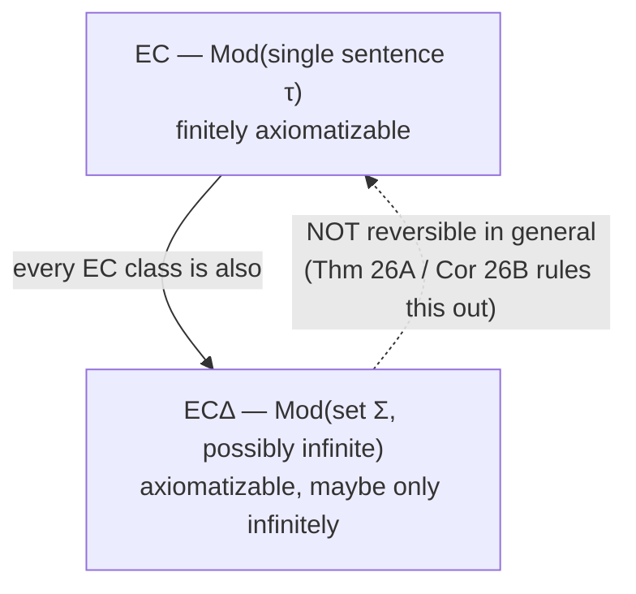
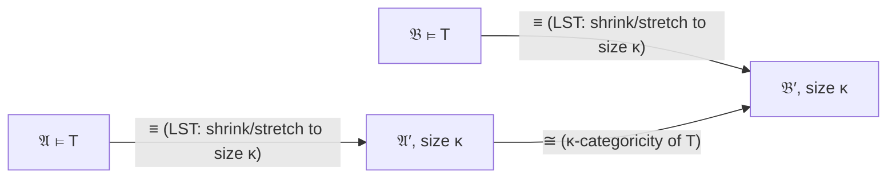
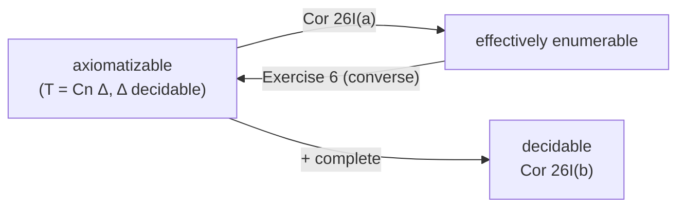

# Models of Theories

[[book-guidelines|↩ Back to guidelines]]

## Why this section exists here, and not earlier

Everything before §2.6 was spent *building* machinery: a formal language, a satisfaction relation, a deductive calculus, and then the two theorems — [[Soundness-and-Completeness|soundness and completeness]] — that make $\vdash$ and $\models$ coincide, plus their corollaries (compactness, Löwenheim–Skolem). §2.6 is the first section that turns around and *uses* all of it to answer concrete questions about structures: How big can a model be forced to be? Can a computer decide what's true in a given finite structure? When are two structures interchangeable as far as first-order logic can tell? When does a theory pin down its models up to isomorphism?

These aren't idle questions. They are the first-order-logic analogue of questions any verifier or theorem prover has to answer operationally: "is this specification even satisfiable," "can I decide truth in this fixed instance," "are two states of my system logically indistinguishable," "does this axiom set have exactly one intended model." Enderton is explicit that this section is where the completeness theorem starts paying rent — nearly every result here either *is* an application of compactness or completeness, or is a decision-procedure question that only makes sense once you know $\vdash$ and $\models$ agree.

The section is organized around four clusters of ideas, and this article covers all of them plus two pieces of adjacent machinery the topic guide asks for (elimination of quantifiers, which Enderton actually develops in Chapter 3 but whose *definition* belongs conceptually here, and noncreative definitions, which opens §2.7). Wherever material is drawn from outside §2.6 itself, this article says so explicitly — that's a deliberate accuracy choice, not an oversight.

## Finite models, and how compactness bounds them

**The question.** Some sentences only have infinite models (e.g. "$<$ is an ordering with no largest element"). Some sentences only have finite models (e.g. $\forall x \forall y\, x = y$, true only in singletons). The natural next question: could a set of sentences have *arbitrarily large finite* models but no infinite model? That would be strange — it would mean "as $n \to \infty$" behavior that never actually crosses over into genuine infinitude.

**What breaks without compactness.** Without compactness, this question has no clean answer — you'd have to reason about each specific $\Gamma$ by hand, checking whether some clever finite encoding trick lets it "almost" have an infinite model without actually having one. Compactness closes this gap in one stroke.

> **THEOREM 26A.** If a set $\Sigma$ of sentences has arbitrarily large finite models, then it has an infinite model.

**Proof idea (worth internalizing, it's a reusable pattern).** For each $k \ge 2$, write a sentence $\lambda_k$ meaning "there are at least $k$ things" — e.g. $\lambda_2 = \exists v_1 \exists v_2\, v_1 \neq v_2$. Form $\Sigma \cup \{\lambda_2, \lambda_3, \dots\}$. Any *finite* subset of this infinite set only mentions finitely many $\lambda_k$'s, so it's satisfied by whichever large-enough finite model of $\Sigma$ your hypothesis guarantees. By compactness, the *whole* (infinite) set has a model — and a model satisfying every $\lambda_k$ is, by definition, infinite.

This is the first appearance of a technique Enderton flags explicitly and reuses constantly for the rest of the chapter: **write down sentences describing the structure you want (possibly in an expanded language), show every finite subset is satisfiable, and let compactness manufacture the infinite object.** You will see this exact move again to build nonstandard models of arithmetic, models with elements "infinitely far" from any standard one, and structures of arbitrary prescribed cardinality.

A pleasant corollary: no group-theoretic equation could possibly hold in every finite group but fail in every infinite group — if it held for arbitrarily large finite groups it would need to hold for some infinite one too.

> **COROLLARY 26B.** The class of all finite structures (for a fixed language) is not $\mathrm{EC}_\Delta$. The class of all infinite structures is not $\mathrm{EC}$.

(The class of infinite structures *is* $\mathrm{EC}_\Delta$ — it's $\mathrm{Mod}\,\{\lambda_2, \lambda_3, \dots\}$ — just not finitely axiomatizable, i.e. not $\mathrm{EC}$. More on this distinction next.)

## Elementarily definable classes: $\mathrm{EC}$ and $\mathrm{EC}_\Delta$

Before §2.6 can talk about "which classes of structures are first-order axiomatizable," it needs a name for that idea — and that name is set up back in §2.2 (p. 92–93), so it's worth restating precisely here since the whole section leans on it.

> **DEFINITION.** A class $K$ of structures for a language is an **elementary class ($\mathrm{EC}$)** iff $K = \mathrm{Mod}\, \tau$ for some single sentence $\tau$. $K$ is an **elementary class in the wider sense ($\mathrm{EC}_\Delta$)** iff $K = \mathrm{Mod}\, \Sigma$ for some (possibly infinite) set of sentences $\Sigma$.

In words: $\mathrm{EC}$ means "nameable by one finite axiom." $\mathrm{EC}_\Delta$ means "nameable by a — possibly infinite — theory." Every $\mathrm{EC}$ class is trivially $\mathrm{EC}_\Delta$ (a singleton set of sentences is a set of sentences), but the reverse fails, and §2.6 is largely devoted to proving specific failures of it (finite structures, infinite groups, fields of characteristic 0 — none of these classes can be pinned down by a *single* sentence, only by an infinite axiom schema).

**Grounding — this is exactly the shape of a spec language.** If you're building a verifier that checks programs against logic-clause specifications, $\mathrm{EC}$ vs. $\mathrm{EC}_\Delta$ is precisely the distinction between "a specification expressible as one clause" and "a specification that genuinely requires an infinite (but still individually checkable) family of clauses" — e.g. "characteristic 0" needs the infinite schema $1 + 1 \neq 0, 1+1+1 \neq 0, \dots$ because no finite Boolean combination of first-order axioms can rule out *every* possible positive characteristic at once. In Rust terms, think of $\mathrm{Mod}\,\Sigma$ as a lazily-generated, potentially unbounded `impl Iterator<Item = Clause>` feeding a solver, versus $\mathrm{Mod}\,\tau$ as a single `Clause` — both are legitimate "specs," but only the second can be handed to a decision procedure that expects one formula.



## Decidability of the theory of a finite structure

This is the section's most implementation-flavored cluster, and directly answers a question any model-checker needs answered: **given a finite structure and a formula, can a machine decide whether the formula holds — and can it decide, in general, everything true about the structure?**

Enderton defines, for any structure $\mathfrak{A}$, its **theory**:

$$
\mathrm{Th}\,\mathfrak{A} = \{\sigma \mid \sigma \text{ is a sentence true in } \mathfrak{A}\}.
$$

He builds up the decidability result through five numbered observations, and they read like a specification for an interpreter:

1. **Canonical form.** Any finite structure $\mathfrak{A}$ is isomorphic to one with universe $\{1, \dots, n\}$ (just relabel each element $a_i \mapsto i$). This matters because it means a finite structure can always be put in a *canonical, communicable* shape.
2. **Finite encoding.** Such a structure — for a finite language — can be written down as a finite string of symbols (numerals, tuples, delimiters). It can be serialized and handed to a machine.
3. **Effective evaluation.** Given such a structure, a formula $\varphi$, and an assignment of universe elements to $\varphi$'s free variables, whether $\models_{\mathfrak A} \varphi[s]$ holds is effectively decidable — you build a tree where each quantifier fans out into a search over the (finite) universe, and each leaf is an atomic-formula table lookup.

This third observation is worth making completely concrete, because it's a real algorithm, not just an existence claim, and it's exactly what a naive finite-model evaluator looks like:

```rust
// A structure over the canonical universe {1, ..., n}.
struct Structure {
    n: u32,                                   // |universe| = {1, ..., n}
    relations: HashMap<PredId, HashSet<Vec<u32>>>,
    functions: HashMap<FnId, HashMap<Vec<u32>, u32>>,
}

enum Formula {
    Atom(Atom),
    Not(Box<Formula>),
    And(Box<Formula>, Box<Formula>),
    ForAll(VarId, Box<Formula>),
    Exists(VarId, Box<Formula>),
}

// Enderton's observation 3, made literal: each quantifier is a bounded loop
// over the finite universe. For a formula with k quantifiers, the number of
// evaluation-tree leaves is bounded by a polynomial in n of degree k.
fn eval(f: &Formula, s: &Structure, env: &mut Env) -> bool {
    match f {
        Formula::Atom(a)      => eval_atom(a, s, env),
        Formula::Not(g)       => !eval(g, s, env),
        Formula::And(g, h)    => eval(g, s, env) && eval(h, s, env),
        Formula::ForAll(v, g) => (1..=s.n).all(|a| { env.bind(*v, a); eval(g, s, env) }),
        Formula::Exists(v, g) => (1..=s.n).any(|a| { env.bind(*v, a); eval(g, s, env) }),
    }
}
```

This is not an analogy — this *is* the algorithm Enderton describes (Figure 9 in the book works exactly this example, checking $\forall v_1 ((\neg \forall v_2 \neg E v_2 v_1) \to E v_1 v_1)$ against a 4-vertex directed graph). If you're building a verifier that needs to check ground facts or bounded-domain instances against a specification, this loop *is* your evaluator's inner core.

4. **Model search over a fixed size.** Given a sentence $\sigma$ and $n$, whether $\sigma$ has an $n$-element model is effectively decidable: by observation 1, restrict to universe $\{1,\dots,n\}$, restrict the language to $\sigma$'s own parameters, enumerate the (finitely many — $2^{n^2}$ for one binary predicate, say) candidate structures, and test each with observation 3.
5. **The spectrum** of $\sigma$, $\{n \mid \sigma \text{ has a model of size } n\}$, is therefore a decidable set of positive integers — a nice, concrete corollary.

Putting 1 and 3 together:

> **THEOREM 26C.** For a finite structure $\mathfrak{A}$ in a finite language, $\mathrm{Th}\,\mathfrak{A}$ is decidable.

Enderton gives a second, slicker proof using a sentence $\delta_{\mathfrak A}$ that pins $\mathfrak A$ down up to isomorphism (constructed in a §2.2 exercise): then $\mathrm{Th}\,\mathfrak{A} = \{\sigma \mid \delta_{\mathfrak A} \models \sigma\}$, and since for every $\sigma$ either $\delta_{\mathfrak A} \models \sigma$ or $\delta_{\mathfrak A} \models \neg\sigma$ (that's what "pins down up to isomorphism" buys you), Corollary 25G (a complete, axiomatizable theory is decidable — see the closing diagram below) finishes the job.

Building on observation 4:

> **THEOREM 26D.** $\{\sigma \mid \sigma \text{ has a finite model}\}$ is effectively enumerable (semi-decide by trying size 1, then 2, then 3, …).
>
> **COROLLARY 26E.** For a finite language, the sentences true in *every* finite structure form a set whose complement is effectively enumerable.

**What breaks: not everything about finite structures is decidable, even collectively.** You might expect "true in every finite structure" to be decidable too, by symmetry with Corollary 26E plus Theorem 17F ("effectively enumerable and co-effectively-enumerable $\Rightarrow$ decidable"). It isn't:

> **TRAKHTENBROT'S THEOREM (1950).** The set $\Gamma = \{\sigma \mid \sigma \text{ is true in every finite structure}\}$ is not, in general, decidable or even effectively enumerable.

Enderton states this without proof, but flags it clearly: it's the finite-structures analogue of the general enumerability theorem, and it *fails*. This is a genuinely useful thing to remember if you're ever tempted to build a "finite model checker that also proves finite-validity" — Theorem 26D only semi-decides *satisfiability by some finite model*, and its complement (finite-validity) doesn't inherit decidability the way you'd hope.

## Elimination of quantifiers

*(This technique's definition is conceptually part of §2.6's toolkit, but Enderton actually develops and applies it in Chapter 3 §3.1–3.2, once concrete decidable theories are on the table — e.g. Presburger-style successor arithmetic. It's included here in full because the guide treats it as belonging with "models of theories," and because it is the single most implementation-relevant idea adjacent to this section.)*

Theorem 26C decides truth in one *fixed finite* structure by brute-force search. That's not yet a "realistically practical" decision procedure for an *infinite* structure's theory, or for a theory in general. Quantifier elimination is the classical technique for turning "is this true" into something checkable without unbounded search:

> **DEFINITION.** A theory $T$ **admits elimination of quantifiers** iff for every formula $\varphi$ there is a *quantifier-free* formula $\psi$ such that $T \models (\varphi \leftrightarrow \psi)$.

[[Interpretations-Between-Theories#The definition|The definition]] sounds like it needs handling every syntactic shape of $\varphi$, but Enderton proves you only need to handle one canonical case:

> **THEOREM 31F.** If for every formula of the form $\exists x(\alpha_0 \land \cdots \land \alpha_n)$ — where each $\alpha_i$ is atomic or the negation of an atomic formula — there's a quantifier-free equivalent (relative to $T$), then $T$ admits elimination of quantifiers for *all* formulas.

The reduction works by putting the formula under the quantifier into disjunctive normal form first, distributing $\exists x$ over the disjunction ($\exists x(A \lor B) \equiv \exists x A \lor \exists x B$), eliminating $x$ from each conjunctive disjunct separately, and then handling nested quantifiers and $\to$/$\neg$ by straightforward induction. So the entire algorithm reduces to one core sub-case: **eliminate a single existential in front of a conjunction of literals.**

Enderton's worked example is $\mathrm{Th}\, N_S = (\mathbb{N}; 0, S)$ — a language with just zero and successor. Every atomic formula there is an equation between terms of shape $S^m u$ ($u$ being $0$ or a variable), and eliminating $\exists x$ from a conjunction of such equations/inequations is pure case analysis: substitute out the witness for $x$ implied by any positive equation, or collapse to $0=0$ if every conjunct is a negation. No unbounded search anywhere — the whole thing is a rewrite.

**Why this matters for your two target systems.** This is exactly the shape of a **compiler pass**, and it's directly relevant to embedding an automated theorem prover: quantifier elimination is one of the classical ways a decidable fragment (linear arithmetic, real-closed fields via the later Sturm-sequence-based procedure Enderton alludes to for $(\mathbb{R};0,1,+,\cdot)$) gets turned into an actual, terminating decision procedure rather than a semi-decision search. In Rust, this is naturally a `trait`:

```rust
trait QeTheory {
    // Eliminate one existential from a conjunction of (possibly negated)
    // atomic literals, producing a logically equivalent quantifier-free
    // formula — the one non-trivial case per Theorem 31F.
    fn eliminate_exists(&self, literals: &[Literal]) -> Formula;
}

// Theorem 31F, generic over any QeTheory: reduce an arbitrary formula
// to quantifier-free form by structural recursion + DNF distribution.
fn eliminate_quantifiers<T: QeTheory>(theory: &T, f: &Formula) -> Formula {
    match f {
        Formula::Exists(_, body) => {
            let dnf = to_dnf(body);                 // disjunction of conjunctions
            or_all(dnf.disjuncts().map(|conj| theory.eliminate_exists(&conj)))
        }
        // ... structural cases for Not/And/Or/ForAll (ForAll x φ ≡ ¬∃x¬φ)
        _ => f.clone(),
    }
}
```

A nice by-product, which Enderton points out: once you have a quantifier-elimination procedure for $\mathrm{Th}\,N_S$, you get an *alternative* proof that the theory is complete (every sentence reduces to a quantifier-free sentence built from atoms, which — for this particular language — is either provably $0=0$ or provably its negation), and the elimination procedure itself is a *more efficient* decision procedure than blind proof search.

## Definable sets, and the diagonal argument for undefinability

*(The definition of "definable" is set up in §2.2 alongside EC/$\mathrm{EC}_\Delta$; the diagonal-argument payoff — Theorem 30C — is proved in §3.5. Both belong to the same conceptual thread §2.6 opens, so they're covered here together, with the source explicitly attributed.)*

**Definable relations, precisely.** For a structure $\mathfrak A$ and a formula $\varphi$ with free variables among $v_1, \dots, v_k$, the formula picks out a $k$-ary relation on $|\mathfrak A|$:

$$
\{\langle a_1, \dots, a_k\rangle \mid \models_{\mathfrak A} \varphi[[a_1,\dots,a_k]]\}.
$$

A relation on $|\mathfrak A|$ is **definable in $\mathfrak A$** iff some formula defines it this way. Concrete instances Enderton walks through: in $(\mathbb{R}; 0,1,+,\cdot)$, the interval $[0,\infty)$ is defined by $\exists v_2\, v_1 = v_2 \cdot v_2$ (a number is nonnegative iff it has a square root); in $\mathbb{N} = (\mathbb{N}; 0, S, +, \cdot)$, the ordering, the singleton $\{n\}$ for any specific $n$, and the set of primes are all definable, and (much less obviously — proved later via the Chinese remainder theorem) so is exponentiation.

**Why not everything is definable.** There are uncountably many relations on $\mathbb{N}$ but only countably many formulas, so most relations are undefinable — a pure cardinality argument, no construction needed. But naming a *specific* undefinable set is harder ("if you can describe it precisely enough to point at it, doesn't that description define it?"). This is where the diagonal argument earns its keep.

**[[Godels-Incompleteness-Theorems#The construction|The construction]] (Theorem 30C, §3.5).** Define a relation $P$ on $\mathbb{N}$: $\langle a, b\rangle \in P$ iff $a$ is the Gödel number of a formula $\alpha(v_1)$ (one free variable) and $\models_{\mathbb N} \alpha(S^b 0)$ — informally, "$a$ is true of $b$." Every definable-in-$\mathbb N$ set of naturals shows up as some "row" $P_a = \{b \mid \langle a,b\rangle \in P\}$ of this relation (take $a$ to be the Gödel number of a defining formula). So the definable sets are exactly the rows $P_1, P_2, \dots$ of $P$ — a list, even if an infinite one. Now diagonalize out of it:

$$
H = \{b \mid \langle b, b \rangle \notin P\}.
$$

$H$ differs from $P_b$ at the point $b$ for *every* $b$ (that's just what $H$'s definition says), so $H$ is nowhere on the list — $H$ is not definable in $\mathbb N$. Pushing the same construction one step further (the barrier isn't Gödel-numbering or substitution, both of which *are* expressible — the barrier is expressing "$\dots$ is true in $\mathbb N$") gives Tarski's theorem: **the set of Gödel numbers of sentences true in $\mathbb N$ is not itself definable in $\mathbb N$**, from which undecidability and non-axiomatizability of $\mathrm{Th}\,\mathbb N$ follow. This is the technical seed of why the diagram at the end of this article has a hole in it — no decidable axiom set can ever catch up to $\mathrm{Th}\,\mathbb N$.

**What breaks without this.** Without the diagonal argument, "there exist undefinable sets" would remain a pure counting fact with no example you could ever point to — which is uncomfortable, because it leaves open the (false) hope that maybe every set anyone would ever *care about* happens to be definable. The Cantor-style diagonalization is what turns "some sets must be undefinable, abstractly" into "here is a specific one, and here specifically is why the definition of *truth itself* can't be one of the definable ones" — the same trick underlying Gödel's incompleteness theorems and Church's undecidability result, both covered later in Chapter 3.

## Elementary equivalence, and the (mostly forward-pointing) idea of an elementary substructure

**Elementary equivalence**, written $\mathfrak A \equiv \mathfrak B$, means $\mathfrak A$ and $\mathfrak B$ satisfy exactly the same *sentences* — i.e. $\mathrm{Th}\,\mathfrak A = \mathrm{Th}\,\mathfrak B$. This is the section's recurring currency: structures don't need to be isomorphic to be indistinguishable by first-order logic, and §2.6 spends real effort showing when that gap opens up.

Two headline examples, both built with the compactness-plus-Löwenheim–Skolem pattern from Theorem 26A:

- $\mathbb N = (\mathbb N; 0, S, <, +, \cdot)$ has a countable elementarily-equivalent structure $\mathfrak M_0$ that is *not isomorphic* to $\mathbb N$: expand the language with a fresh constant $c$, let $\Delta = \{0 < c, S0 < c, SS0 < c, \dots\}$, note every finite subset of $\Delta \cup \mathrm{Th}\,\mathbb N$ is satisfiable (by $\mathbb N$ itself with $c$ interpreted large enough), apply compactness to get a model of the whole thing, then Löwenheim–Skolem to shrink it to a countable one, and restrict off $c$. The resulting $\mathfrak M_0$ satisfies exactly the sentences $\mathbb N$ does, but contains an element ($c^{\mathfrak M}$) bigger than every genuine natural number — a nonstandard element, the direct ancestor of §2.6's later "[[Nonstandard-Analysis|Nonstandard Analysis]]" chapter.
- $(\mathbb Q; <_{\mathbb Q}) \equiv (\mathbb R; <_{\mathbb R})$ — two structures of wildly different cardinality, elementarily equivalent anyway. (Proved via the Łoś–Vaught test below.)

**Elementary substructure and the Tarski–Vaught idea — an honest note on where this actually lives in the book.** A stronger notion than $\equiv$ is: $\mathfrak B$ is an **elementary substructure** of $\mathfrak A$ (written $\mathfrak B \preceq \mathfrak A$) iff $\mathfrak B$ is a substructure of $\mathfrak A$ *and*, for every formula $\varphi$ and every assignment $s$ into $|\mathfrak B|$, $\models_{\mathfrak A} \varphi[s] \iff \models_{\mathfrak B} \varphi[s]$ — agreement not just on sentences but on every formula, under every assignment drawn from the smaller universe. This is strictly stronger than $\equiv$ (it implies it, by taking $\varphi$ to be a sentence, but adds agreement on open formulas too).

It's worth being precise that Enderton does not build the general theory of elementary substructures inside §2.6 itself — the term appears only in a remark attached to an exercise near the very end of the Löwenheim–Skolem discussion in §4.2 (p. 294), where an *improved*, choice-using form of Löwenheim–Skolem is stated: any countable subset $S$ of a countable structure's universe extends to a countable elementary substructure containing $S$. The standard model-theoretic criterion for recognizing an elementary substructure — usually called the **Tarski–Vaught test** in the broader literature — says $\mathfrak B \preceq \mathfrak A$ (for $\mathfrak B$ a substructure of $\mathfrak A$) iff for every formula $\exists x\, \varphi(x, \bar b)$ true in $\mathfrak A$ with parameters $\bar b$ from $|\mathfrak B|$, some witness for $x$ can already be found *inside* $|\mathfrak B|$ — you never have to leave the smaller structure to satisfy an existential it can already state. This is not a named, proved result in Enderton's own text; it's the standard tool this book's exercise-level treatment gestures toward without developing. Flagging that gap explicitly is more useful than silently inventing a "Theorem" that isn't in the source.

**What breaks without the distinction between $\equiv$ and $\preceq$.** If you only had elementary equivalence, you could never talk about *one specific, shared sub-object* that two structures agree on — $\equiv$ tells you two structures can't be told apart by any sentence, but says nothing about a common piece sitting inside both. $\preceq$ is what lets you extract a small, tractable witness structure ($\mathfrak B$) that answers every formula-with-parameters question exactly the way the (possibly huge) ambient structure $\mathfrak A$ does — which is precisely the tool the improved Löwenheim–Skolem theorem needs to shrink an uncountable structure down while keeping a chosen countable subset intact.

## Categoricity and the Łoś–Vaught test for completeness

This is where the machinery cashes out into the section's sharpest tool: a way to *prove a theory complete* — and hence, by Corollary 26I below, decidable — without ever directly analyzing its deductive calculus.

> **DEFINITION.** A theory $T$ is $\kappa$-**categorical** iff all models of $T$ having cardinality $\kappa$ are isomorphic to one another. ($\aleph_0$-categorical is the countable-cardinality special case.)

Categoricity in the *absolute* sense (any two models whatsoever isomorphic) turns out to be essentially impossible for infinite structures in first-order logic — a direct consequence of the upward/downward Löwenheim–Skolem machinery (Corollary 26F): if a theory has one infinite model, it has models of every infinite cardinality, so it certainly can't have all its models pairwise isomorphic. (There's no first-order theory whose models are exactly the structures isomorphic to $(\mathbb N; 0, S, +, \cdot)$ — a genuine expressiveness limit of first-order logic, contrasted later against second-order logic's ability to pin down such structures categorically, at the cost of fixing the meaning of "subset.") $\kappa$-categoricity *for one specific infinite cardinal* $\kappa$ is the useful, achievable substitute.

> **ŁOŚ–VAUGHT TEST (1954).** Let $T$ be a theory in a countable language with no finite models. If $T$ is $\kappa$-categorical for *some* infinite cardinal $\kappa$, then $T$ is complete.

**Proof, and why it works — it's a symmetry argument, not a syntactic one.** Take any two models $\mathfrak A, \mathfrak B \models T$; both are infinite (no finite models allowed). By the LST (upward/downward Löwenheim–Skolem) theorem, stretch or shrink each to elementarily-equivalent structures $\mathfrak A' \equiv \mathfrak A$ and $\mathfrak B' \equiv \mathfrak B$ of the *same* cardinality $\kappa$. Categoricity at $\kappa$ forces $\mathfrak A' \cong \mathfrak B'$ — and isomorphic structures are certainly elementarily equivalent. Chain it together:

$$
\mathfrak A \equiv \mathfrak A' \cong \mathfrak B' \equiv \mathfrak B \implies \mathfrak A \equiv \mathfrak B.
$$

Since $\mathfrak A, \mathfrak B$ were *arbitrary* models of $T$, every two models of $T$ agree on every sentence — which is exactly what completeness means.



The converse is false — there are complete theories that are $\kappa$-categorical for no $\kappa$ at all (the theory of the real field is Enderton's example: decidable, by a deep theorem of Tarski, but not categorical in any infinite cardinality, so this particular test simply doesn't apply to it — decidability there needs a different argument entirely).

**Worked applications, in increasing depth:**

- **Dense linear orders without endpoints.** Axiomatize with $\delta$: trichotomy + transitivity, density, no endpoints. By Cantor's theorem (Theorem 26K, exercise), every *countable* model of $\delta$ is isomorphic to $(\mathbb Q; <_{\mathbb Q})$ — i.e. $\mathrm{Cn}\,\delta$ is $\aleph_0$-categorical. Łoś–Vaught $\Rightarrow$ $\mathrm{Cn}\,\delta$ is complete $\Rightarrow$ any two of its models are elementarily equivalent $\Rightarrow$ $(\mathbb Q;<_{\mathbb Q}) \equiv (\mathbb R;<_{\mathbb R})$, despite one being countable and the other not.
- **Algebraically closed fields of characteristic 0.** Not $\aleph_0$-categorical (countable ACF$_0$'s can differ in transcendence degree), but *is* categorical in every *uncountable* cardinal $\kappa$ — by a theorem of Steinitz, an algebraically closed field is determined up to isomorphism by its characteristic and transcendence degree, and for uncountable fields the cardinality *is* the transcendence degree. Łoś–Vaught (part (b), any infinite categorical cardinal suffices) $\Rightarrow$ the theory is complete $\Rightarrow$ (since it's also axiomatizable, by Corollary 26I(b) below) it's decidable. Since $\mathbb C$ is one particular ACF$_0$, this gives: **the theory of the complex field is decidable** (Theorem 26J) — a genuinely striking result obtained with zero direct analysis of $\mathbb C$'s arithmetic, purely from a categoricity fact.

*(Per the source's own emphasis, this cluster — pure categoricity theory — doesn't map cleanly onto either target project below and isn't force-fit into one; it's included at full depth because it's the section's technical high point and the mechanism directly informs how a completeness argument can be run without touching the deductive calculus at all.)*

## Noncreative definitions and well-definedness

*(This is the opening topic of §2.7, "[[Interpretations-Between-Theories|Interpretations Between Theories]]," pp. 164–166 — placed here because the guide groups it under this topic, and because Theorem 27A is a direct semantic payoff of everything §2.6 built: models, $\mathrm{Th}$, and $\models$.)*

**The problem definitions must solve.** Mathematicians constantly introduce new function symbols by definition — "let $Px$ be the power set of $x$." Definitions are unlike theorems (you don't prove them) and unlike axioms (they're not supposed to add *substantive* information — only convenience). Enderton makes [[Interpretations-Between-Theories#The failure mode|the failure mode]] vivid with a deliberately broken "definition":

$$
f(x) = y \iff x < y.
$$

Since $1 < 2$, this gives $f(1) = 2$. Since $1 < 3$, it also gives $f(1) = 3$. So $2 = 3$ — a contradiction *derived only because a bad definition was permitted*, not present in the base theory at all. The defect: the biconditional $f(v_1) = v_2 \leftrightarrow \varphi$ doesn't pin down a unique $y$ for each $x$, so the name "$f(1)$" is ambiguous.

**The fix, made precise.** Given a theory $T$ in a language without $f$ yet, introduce $f$ via

$$
\forall v_1 \forall v_2\, [f v_1 = v_2 \leftrightarrow \varphi] \tag{$\delta$}
$$

where $\varphi$ is a formula of the *original* language with only $v_1, v_2$ free.

> **THEOREM 27A.** The following are equivalent:
> **(a) (Noncreative.)** For any sentence $\sigma$ in the original (smaller) language, if $T; \delta \models \sigma$ then already $T \models \sigma$ — i.e. adding $f$ via $\delta$ proves *nothing new* about the old vocabulary.
> **(b) ($f$ is well defined.)** $T \models \forall v_1 \exists! v_2\, \varphi$ — i.e. $T$ already proves that $\varphi$ picks out exactly one $y$ for every $x$.

**Proof sketch.** (a)$\Rightarrow$(b): $\delta$ itself logically implies $\exists!$-uniqueness (well-definedness is baked into $\delta$'s reading as a function), so take $\sigma = (\forall v_1\exists!v_2\,\varphi)$ in (a). (b)$\Rightarrow$(a) is the interesting direction: given a model $\mathfrak A \models T$, well-definedness lets you *build* the function $F(d) = $ "the unique $e$ with $\models_{\mathfrak A}\varphi[[d,e]]$" and extend $\mathfrak A$ to $(\mathfrak A, F) \models \delta$. Crucially, $(\mathfrak A, F)$ satisfies exactly the same *old-language* sentences as $\mathfrak A$ did — adding the interpretation of $f$ didn't change any fact expressible without $f$. So any old-language consequence $\sigma$ of $T; \delta$ was already true in $(\mathfrak A, F)$, hence in $\mathfrak A$, hence provable from $T$ alone.

**What breaks without well-definedness.** Exactly the $f(x)=y \iff x<y$ example: a definitional extension that isn't backed by a genuine $\forall v_1 \exists! v_2\,\varphi$ fact is not merely inelegant — it's *unsound as an extension*, capable of proving new (and false) things about the pre-existing vocabulary. [[Godels-Incompleteness-Theorems#The theorem|The theorem]] is precisely the dividing line between "a definition, safe by construction" and "a smuggled-in axiom."

**Lean grounding — this is exactly conservativity of `def`.** This is one of the cleanest matches between Enderton's formalism and how a real proof assistant's kernel works. Lean's `def` (and `abbrev`) mechanism is only sound as a *pure abbreviation* — provably adding no new theorems about pre-existing terms — because the elaborator requires the defining term to actually *exist and be unique up to definitional equality* before accepting it:

```lean
-- A "definition" is only safe if it names something that provably exists
-- and is unique — exactly Enderton's ∀v₁∃!v₂ φ condition.
def doubleOf (n : Nat) : Nat := n + n
-- Lean's kernel treats `doubleOf 3` and `3 + 3` as definitionally equal
-- (`rfl`-provable): unfolding a `def` never lets you conclude anything
-- about `Nat`, `+`, or any prior symbol that wasn't already true — this
-- IS Theorem 27A's noncreativity, enforced structurally by the kernel
-- rather than proved as a metatheorem about the whole system each time.
```

Contrast this with a hypothetical Lean `def` built from a relation that *isn't* functional — Lean's type system won't even let you write `def f (x : Nat) : Nat := the_unique_y_such_that (x < y)`, because there is no term of type `Nat` you can actually produce without first proving `∃! y, x < y` (which is false, so the definition is rightly inexpressible). **This is also directly relevant to your elaborator project**: when the elaborator resolves an implicit argument or a metavariable via unification, that resolution is only *legitimate* — only safe to commit to — exactly when the constraint set pins the metavariable down to a unique solution. Miller pattern unification's whole appeal is that it identifies a fragment of unification problems where "does this have a unique most-general solution" is decidable and cheap to check — it is, structurally, hunting for the elaborator's own version of Enderton's $\forall v_1 \exists! v_2\, \varphi$.

## The diagram Enderton draws, reconstructed

Section 2.6 closes its main thread with an (originally hand-drawn) diagram relating axiomatizability, effective enumerability, completeness, and decidability. Reconstructed from the text and Corollary 26I plus Exercise 6's converse:



Set theory ($\mathrm{Cn}\,A_{ZF}$) sits at "axiomatizable/enumerable" but (Enderton argues in §3.7) not complete, hence this route to decidability doesn't apply to it. Number theory, $\mathrm{Th}\,\mathbb N$, sits at the opposite extreme: complete (it's $\mathrm{Th}$ of one fixed structure) but — by Tarski's theorem above — not even effectively enumerable, hence (contrapositive of Cor 26I(a)) not axiomatizable at all. The algebraically-closed-fields and dense-linear-order examples above are the success stories: axiomatizable *and* (via Łoś–Vaught) complete, therefore decidable.

## Where this leads

- **§2.7, Interpretations Between Theories**, picks up immediately where noncreative definitions left off: it generalizes "defining one new symbol safely" to "translating one entire theory into another's language, safely" — the machinery for showing, e.g., that the theory of $(\mathbb Z; +, \cdot)$ is exactly as strong as the theory of $(\mathbb N; 0, S)$.
- **§4.1's second-order categorical sentences** are the promised payoff of the categoricity limitation noted above — first-order logic's inability to pin down $(\mathbb N;0,S,+,\cdot)$ categorically is exactly what second-order logic buys back, at the cost of fixing "subset" as a rigid notion immune to reinterpretation.
- **§3.1–3.2's quantifier-elimination decision procedures** (successor arithmetic, then real-closed fields) are the promised concrete payoff of the technique introduced-by-name here; this article front-loaded the general definition and Theorem 31F precisely so that material reads as an application, not a fresh start.
- **§3.5's Tarski's theorem and Church's undecidability theorem** are the direct continuation of the diagonal-argument-for-undefinability thread — the same "diagonalize out of the list of definable sets" move reappears, retooled, as the core of Gödel's incompleteness results.
- **The nonstandard-model construction for $\mathbb N$** shown above (compactness + a fresh constant $c$ bigger than every standard numeral) is the exact template §4.3, "Nonstandard Analysis," scales up to build nonstandard models of the reals with genuine infinitesimals.
- **For your two target projects specifically:** Theorem 26C's finite-structure evaluator is close to the literal inner loop of any bounded-domain checker your verifier will need; quantifier elimination is a direct decision-procedure technique worth having in an embedded theorem prover's toolbox (start with linear-arithmetic-style fragments, the way Enderton starts with successor arithmetic); and Theorem 27A's noncreativity/well-definedness condition is the exact semantic justification — stated as a clean $\forall\exists!$ criterion — for why your elaborator's metavariable-unification step is only allowed to *commit* to a solution once it can show that solution is unique, which is precisely the discipline Miller pattern unification is designed to make checkable.
