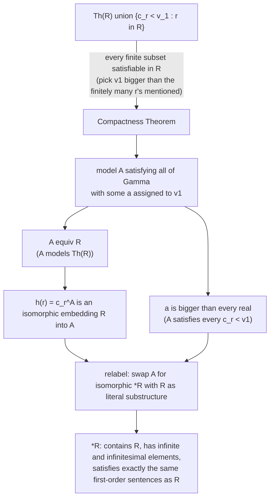

[[book-guidelines|↩ Back to guidelines]]

# Nonstandard Analysis

## The problem infinitesimals were always trying to solve

Newton and Leibniz built calculus on a number that shouldn't exist by ordinary arithmetic standards: something infinitely small yet nonzero. Newton's $o$ could be multiplied by any finite number and stay negligible — but you had to *divide* by it, which means it can't be $0$. Leibniz's $dx$ was "less than any assignable quantity," yet also nonzero. For two centuries this was mathematically productive (Euler built enormous chunks of analysis on it) and simultaneously philosophically indefensible — Bishop Berkeley's famous jab was to call these "ghosts of departed quantities." The nineteenth century resolved the crisis by *eliminating* infinitesimals: Cauchy and Weierstrass's $\varepsilon$-$\delta$ definitions of limit make no reference to infinitely small numbers at all. That's the calculus you learned.

So why does Enderton spend a whole section resurrecting a concept that analysis spent a century successfully getting rid of?

Because in 1961 Abraham Robinson showed the $\varepsilon$-$\delta$ elimination wasn't necessary — it was one *possible* fix, not the only one. The actual problem with "infinitely small nonzero number" was never the concept; it was that no one had a *rigorous construction* of a number system that contains such things without contradiction. Robinson supplied one, using a tool this book has been building toward for two chapters: the **Compactness Theorem**. That's the punchline of this whole section — the same theorem that let you build weird models of arithmetic or set theory (found in [[Compactness-for-Sentential-Logic]] and its first-order generalization) lets you build a number system $^*\mathbb{R}$ that behaves exactly like $\mathbb{R}$ in every first-order-expressible respect, yet contains infinitely small and infinitely large elements alongside the reals you started with. Once you have that model, Newton's and Leibniz's informal reasoning becomes literally correct, not just heuristically suggestive.

**What breaks without compactness here.** You cannot construct $^*\mathbb{R}$ by some direct, hands-on extension of $\mathbb{R}$ — there's no "just add an infinitesimal and see what happens" move that stays consistent with all of ordinary arithmetic, because you'd need to justify *simultaneously* that this new element is smaller than every positive real, which is an infinite family of constraints. Compactness is precisely the tool that turns "every finite piece of an infinite constraint set is satisfiable" into "the whole infinite set is satisfiable at once" — which is exactly the shape of the problem "give me an element smaller than every one of infinitely many reals."

## Building $^*\mathbb{R}$: one compactness argument, three consequences

### Setting up a language rich enough to talk about all of $\mathbb{R}$ at once

The trick is to build a first-order language so expressive that *every* relation and operation on $\mathbb{R}$ has its own symbol. Concretely, the language has equality plus:

- $\forall$ (universal quantifier, meant to range over real numbers),
- an $n$-place predicate symbol $P_R$ for **every** $n$-ary relation $R$ on $\mathbb{R}$,
- a constant symbol $c_r$ for **every** real $r$,
- an $n$-place function symbol $f_F$ for **every** $n$-ary operation $F$ on $\mathbb{R}$.

This is a genuinely enormous language — uncountably many symbols, since $\mathbb{R}$ itself is uncountable and it has uncountably many operations and relations. That's fine; nothing in the Compactness Theorem or the completeness machinery from earlier in Chapter 2 requires the language to be countable. The standard structure $\mathfrak{R}$ interprets each symbol in the obvious way: $|\mathfrak{R}| = \mathbb{R}$, $P_R^{\mathfrak{R}} = R$, $c_r^{\mathfrak{R}} = r$, $f_F^{\mathfrak{R}} = F$.

In words: whatever you can say about the reals using ordinary logical connectives, quantifiers, and this vocabulary, you can express as a first-order sentence. That's the whole point — it maximizes what "first-order expressible" can capture about $\mathbb{R}$, so that the compactness trick below has maximum leverage.

### The compactness move itself

Let $\Gamma$ be the set

$$\Gamma = \operatorname{Th}\mathfrak{R} \cup \{\, c_r \mathrel{P_<} v_1 \mid r \in \mathbb{R} \,\}$$

— every true sentence about $\mathfrak{R}$, together with one formula per real number $r$ asserting "$r < v_1$" (using the free variable $v_1$ as a placeholder for a hypothetical element bigger than every real).

Every *finite* subset of $\Gamma$ is satisfiable in $\mathfrak{R}$ itself: a finite subset only mentions finitely many reals $r_1, \dots, r_n$, so just assign $v_1$ some real larger than all of them. Compactness then hands you a model $\mathfrak{A}$ of the *entire infinite* set $\Gamma$, together with an assignment of some element $a \in |\mathfrak{A}|$ to $v_1$. Because $\mathfrak{A} \models \operatorname{Th}\mathfrak{R}$, we get $\mathfrak{A} \equiv \mathfrak{R}$ (elementary equivalence: same first-order theory). And because $\mathfrak{A}$ satisfies every "$c_r < v_1$" formula, the element assigned to $v_1$ is bigger than *every* real number simultaneously — the infinite family of constraints that no direct construction could satisfy at once, satisfied by fiat via compactness.

The rest of [[Godels-Incompleteness-Theorems#The construction|the construction]] is bookkeeping: Enderton checks that the map $h(r) = c_r^{\mathfrak{A}}$ is an isomorphic embedding of $\mathfrak{R}$ into $\mathfrak{A}$ (injective because distinct reals have provably distinct constants; it preserves every relation, function, and constant because $\mathfrak{A} \equiv \mathfrak{R}$ makes each preservation fact a first-order sentence true in both structures). Then he relabels — swap $\mathfrak{A}$ for an isomorphic copy $^*\mathbb{R}$ in which the copy of each real $r$ *is* literally $r$ — so that $\mathbb{R}$ becomes an actual substructure of $^*\mathbb{R}$, not just an isomorphic image of one. This is a purely cosmetic step (Exercise 24 of Section 2.2 in the book handles the general "replace isomorphic copies by the originals" technique), but it matters for the sequel: from here on $\mathbb{R} \subseteq {}^*\mathbb{R}$ literally, with no translation needed.

### Notation: the asterisk

Enderton fixes notation that recurs for the rest of the section:

- For each relation $R$ on $\mathbb{R}$, $^*R$ is the relation assigned to $P_R$ by $^*\mathbb{R}$ — its extension in the new structure. Since $\mathbb{R} \subseteq {}^*\mathbb{R}$, $^*R$ restricted back to $\mathbb{R}$ is just $R$ again.
- For each operation $F$ on $\mathbb{R}$, $^*F$ is the operation assigned to $f_F$ by $^*\mathbb{R}$ — likewise restricting to $F$ on $\mathbb{R}$.
- Constants need no new notation: $c_r^{*\mathbb{R}} = r$ exactly.

### The transfer principle — the actual engine of the whole section

Here's the method that does essentially all the work from this point on, so it's worth stating explicitly even though the book states it almost in passing:

> To prove a property holds of $^*R$ or $^*F$, it suffices to (1) note the corresponding property holds of $R$ or $F$ in $\mathbb{R}$, (2) express that property as a first-order sentence in the language, and (3) invoke $\mathfrak{R} \equiv {}^*\mathbb{R}$.

This is **transfer**: any first-order-expressible fact about $\mathbb{R}$ automatically transfers to $^*\mathbb{R}$, for free, because the two structures satisfy exactly the same first-order sentences by construction. Transitivity of $<$, commutativity of $+$, the field axioms, trichotomy — all of it transfers mechanically. Enderton uses it so often that by the end of the section he stops spelling it out and just asserts things like $^*|a \mathrel{{}^*+} b| \mathrel{{}^*\leq} {}^*|a| \mathrel{{}^*+} {}^*|b|$, trusting the reader to supply the transfer argument silently.

**What breaks without transfer.** Without it, every single algebraic fact about $^*\mathbb{R}$ — that it's an ordered field, that addition is commutative, that absolute value is subadditive — would need a from-scratch proof about this weird nonstandard structure. Transfer collapses all of that into one reusable observation, at the cost of one crucial restriction: **only first-order-expressible properties transfer.** The least-upper-bound property of $\mathbb{R}$ is a second-order statement (it quantifies over *subsets* of $\mathbb{R}$, not just elements), so it does *not* transfer — and indeed it fails in $^*\mathbb{R}$. $\mathbb{R}$ itself, viewed as a subset of $^*\mathbb{R}$, is bounded above (by any infinite element) yet has no least upper bound in $^*\mathbb{R}$. That failure is not a bug; it's the signature of exactly which properties survived the passage to $^*\mathbb{R}$ and which didn't, and it's precisely what makes room for infinitesimals to exist without $^*\mathbb{R}$ collapsing into $\mathbb{R}$.



### Grounding: this is the Lean model-existence pattern, made concrete

This entire construction is a worked example of a technique that recurs throughout the rest of this book and throughout model theory generally: **build a model by compactness, then use elementary equivalence to transfer properties for free.** If you've internalized Gödel's Completeness Theorem, you already know the shape — "if a theory has no finite contradiction, it has a model" — and this section is just that principle used as a *construction tool* rather than a consistency check.

That framing connects directly to the model-existence reasoning your theorem-prover project will eventually lean on: whenever you need to show some configuration of constraints is jointly satisfiable — a candidate substitution respecting a batch of typing/unification constraints, say — and you can only verify satisfiability locally (constraint by constraint, or in small finite groups), compactness-style reasoning is the general recipe for lifting "every finite piece is fine" to "the whole thing is fine." You won't literally invoke first-order compactness inside a Rust verifier, but the *pattern* — finite satisfiability implies satisfiability, because any witnessing structure only needs to satisfy finitely many constraints at a time to extend — is worth recognizing as the ancestor of things like "if every subterm of a substitution problem has a unifier, does the whole substitution?" (It doesn't, in general, for the same reason: unification isn't compact the way first-order satisfiability is. But knowing *why* compactness holds here is the sharpest way to see why an analogous claim can fail elsewhere.)

In Lean terms, the construction is worth sketching as a thought experiment even though nobody actually formalizes $^*\mathbb{R}$ this way in practice (the standard formalization uses ultrafilters/ultraproducts instead, which sidesteps redoing a compactness argument from scratch):

```lean
-- Sketch only — illustrating the *shape* of the construction, not a literal
-- transcription of Enderton's argument (which goes through first-order
-- compactness rather than an ultraproduct).
def StarR : Type :=
  -- an ultrapower of ℝ by a nonprincipal ultrafilter on ℕ:
  -- germs of sequences ℕ → ℝ, modulo agreement on a "large" set of indices
  Germ (Filter.hyperfilter ℕ) ℝ

-- transfer principle, informally: any first-order sentence φ about ℝ
-- (in the language of ordered fields) holds of StarR too.
-- Łoś's theorem is the ultrafilter-construction analogue of
-- Enderton's "R ≡ *R" step.
```

The point of showing this isn't to teach ultraproducts — it's to note that Enderton's compactness-based construction and the more standard ultrapower construction are two different roads to the same theorem, and the "transfer" step is doing structurally the same job in both: some abstract completeness/model-existence fact (compactness, or Łoś's theorem) is what licenses moving first-order truths across the construction for free.

## Finite elements, infinitesimals, and why the classification matters

Compactness guarantees $^*\mathbb{R} \neq \mathbb{R}$ — the element $b$ assigned to $v_1$ satisfies $r < b$ (in $^*\mathbb{R}$'s order, written $\mathrel{{}^*<}$) for *every* real $r$, so $b$ is bigger than any standard real. Call such a $b$ **infinitely large**. Its reciprocal $1 \mathbin{{}^*/} b$ is then smaller in absolute value than any positive real — a genuine, rigorously constructed **infinitesimal**. Newton's $o$ and Leibniz's $dx$ exist now, as actual elements of an actual ordered field.

Enderton names two subsets of $^*\mathbb{R}$ that organize everything that follows:

$$F = \{\, x \in {}^*\mathbb{R} \mid {}^*|x| \mathrel{{}^*<} y \text{ for some } y \in \mathbb{R} \,\}$$

the **finite elements** — those bounded in absolute value by some standard real.

$$I = \{\, x \in {}^*\mathbb{R} \mid {}^*|x| \mathrel{{}^*<} y \text{ for all positive } y \in \mathbb{R} \,\}$$

the **infinitesimals** — those smaller in absolute value than *every* positive standard real, however small.

In words: $F$ is "not infinitely large," and $I$ is "smaller than any positive real you could name." Every infinitesimal is finite (in fact $0 \in I \subseteq F$), but not every finite element is infinitesimal — most finite elements of $^*\mathbb{R}$ are neither infinite nor infinitesimal, they're just ordinary-sized nonstandard numbers infinitely close to some real (more on that below). The only *standard* infinitesimal — the only member of $\mathbb{R} \cap I$ — is $0$ itself; every other infinitesimal is a genuinely new, nonstandard element.

One more fact worth flagging because it will matter for calculus: if $A \subseteq \mathbb{R}$ is unbounded, then $^*A$ contains infinite elements. (The sentence "for every real $r$ there is a member of $A$ larger than $r$" is first-order and true, hence transfers.) In particular $^*\mathbb{N}$ contains infinite "natural numbers" — a fact the exercises lean on to restate sequence convergence in nonstandard terms.

### $F$ is a subring, $I$ is an ideal — and this is not decoration

**Theorem 28A.** (a) $F$ is closed under $^*+$, $^*-$, $^*\cdot$ — i.e., $F$ is a subring of the field $^*\mathbb{R}$. (b) $I$ is closed under $^*+$, $^*-$, and under multiplication *by anything in $F$*: $x \in I$ and $z \in F \implies x \mathbin{{}^*\cdot} z \in I$ — i.e., $I$ is an **ideal** in the ring $F$.

The proofs are pure "bound-chasing" — if $|x| < a$ and $|y| < b$ then $|x \pm y| < a + b$ and $|xy| < ab$, all standard reals, so sums/differences/products of finite elements stay finite; and if $|x|, |y| < a/2$ then $|x \pm y| < a$, so infinitesimals stay infinitesimal under addition, while an infinitesimal times *any* finite element (not just another infinitesimal) stays infinitesimal, because you can always squeeze the bound: $|x| < a/b$ and $|z| < b$ give $|xz| < a$.

If you've done any abstract algebra, "$I$ is an ideal in $F$" should immediately suggest **quotient ring** $F/I$ — and that anticipation is exactly right; it's what Theorem 28D and Corollary 28E build toward: $F/I \cong \mathbb{R}$.

**Grounding — this is a refinement type, precisely.** The Rust/Lean way to think about $F$ and $I$ is as *nested refinement subtypes* of $^*\mathbb{R}$, closed under specific operations — exactly the shape of a typestate or invariant-preserving newtype:

```rust
// A finite element carries a proof (informally, here just an invariant
// maintained by construction) that its absolute value is bounded by
// some standard real.
struct Finite(StarReal);

impl std::ops::Add for Finite {
    type Output = Finite;
    fn add(self, other: Finite) -> Finite {
        // closure under + is Theorem 28A(a): the sum of two bounded
        // elements is bounded by the sum of the bounds.
        Finite(self.0 + other.0)
    }
}

// An infinitesimal is a Finite that is additionally smaller than every
// positive standard real.
struct Infinitesimal(Finite);

impl std::ops::Mul<Finite> for Infinitesimal {
    type Output = Infinitesimal;
    fn mul(self, z: Finite) -> Infinitesimal {
        // Theorem 28A(b): infinitesimal * finite stays infinitesimal —
        // this is exactly "I absorbs multiplication by the surrounding ring F,"
        // i.e. the ideal property, expressed as a typed operation.
        Infinitesimal(Finite((self.0).0 * z.0))
    }
}
```

The `impl Mul<Finite> for Infinitesimal -> Infinitesimal` signature *is* the ideal property, type-checked: multiplying an infinitesimal by an arbitrary finite element is guaranteed (by the type signature, standing in for Enderton's proof) to land back in `Infinitesimal`, not just in `Finite`. That asymmetry — $I$ absorbs multiplication from all of $F$, whereas $F$ is merely closed under multiplication with itself — is the entire mathematical content of "ideal" versus "subring," and it shows up as a type-signature asymmetry as directly as it shows up in the algebra.

**What breaks without the subring/ideal structure.** If $I$ weren't closed under addition, "the sum of two infinitely-small errors is infinitely small" — which is the whole justification for treating $dx, dy$ as combinable infinitesimal increments in a derivative computation — would fail, and nonstandard calculus wouldn't get off the ground. If $I$ weren't an ideal in $F$ specifically (closed under multiplication by *finite*, not just infinitesimal, elements), then multiplying an infinitesimal error by a finite quantity — exactly what happens when you compute $F'(a) \cdot dx$ and expect the result to still be negligible relative to something finite — could blow up to a non-infinitesimal size. The chain rule proof at the end of the section leans on precisely this.

## Infinitely close: an equivalence relation, and what it buys you

**Definition.** $x$ is **infinitely close** to $y$, written $x \simeq y$, iff $x \mathrel{{}^*-} y \in I$.

In words: two elements of $^*\mathbb{R}$ are infinitely close exactly when their difference is infinitesimal — "closer than any standard positive distance apart." This is the formal replacement for the old informal picture of a variable "approaching" a limit.

**Theorem 28B.**
(a) $\simeq$ is an equivalence relation on $^*\mathbb{R}$.
(b) If $u \simeq v$ and $x \simeq y$, then $u \mathrel{{}^*+} x \simeq v \mathrel{{}^*+} y$ and $\mathrel{{}^*-}u \simeq {}^*{-}v$.
(c) If $u \simeq v$ and $x \simeq y$ and $u,v,x,y$ are all finite, then $u \mathrel{{}^*\cdot} x \simeq v \mathrel{{}^*\cdot} y$.

Every clause here is really just a restatement of Theorem 28A in relational form. Reflexivity of $\simeq$ is "$0 \in I$"; symmetry is "$I$ is closed under negation"; transitivity is "$I$ is closed under addition" (if $x - y$ and $y - z$ are both infinitesimal, their sum $x - z$ is too). Part (b) is again additive closure of $I$. Part (c) is the one place the *ideal* property (not just subring) does real work — the algebraic manipulation

$$u \mathbin{{}^*\cdot} x \mathrel{{}^*-} v \mathbin{{}^*\cdot} y = u \mathbin{{}^*\cdot}(x \mathrel{{}^*-}y) \mathrel{{}^*+} (u \mathrel{{}^*-}v)\mathbin{{}^*\cdot} y$$

splits the error into two terms, each of which is (finite)$\times$(infinitesimal) — landing in $I$ precisely because $I$ absorbs multiplication from $F$. This is why the finiteness hypothesis in (c) is load-bearing: without it, $u \cdot (x - y)$ needn't be infinitesimal, because an infinite $u$ times an infinitesimal can land anywhere.

A useful sanity check: for standard $r, s \in \mathbb{R}$, $r \simeq s$ iff $r = s$, since $0$ is the only standard infinitesimal. So $\simeq$ only does something interesting once you leave the standard reals — it's the relation that lets *nonstandard* elements cluster around standard ones.

**Lemma 28C** (a technical stepping-stone toward Theorem 28D): if $x \simeq y$ and at least one is finite, there is a *standard* $q$ strictly between $x$ and $y$. The proof is an Archimedean-style argument: since $x$ is finite and $y - x$ is bounded below by some standard $b > 0$... actually bounded *above* is what's needed — you find the least positive integer $m$ with $x < mb$, and $mb$ lands strictly between $x$ and $y$ while being (a multiple of a standard number, hence expressible, though not itself claimed standard here — the role of the lemma is purely to squeeze a witness in between for the next proof).

## Standard parts: Theorem 28D and the payoff of the whole construction

This is [[Godels-Incompleteness-Theorems#The theorem|the theorem]] the whole section has been building to.

**Theorem 28D.** Every $x \in F$ is infinitely close to a unique $r \in \mathbb{R}$.

In words: every finite nonstandard number — however bizarre — sits infinitely close to exactly one ordinary real number. Nonstandard numbers aren't a free-floating cloud disconnected from $\mathbb{R}$; every finite one has a real "shadow."

**Proof sketch, in words first.** Given finite $x$, look at the set $S = \{y \in \mathbb{R} \mid y < x\}$ — the standard reals lying below $x$. Because $x$ is finite, $S$ is bounded above (by any standard bound on $|x|$), so — since $\mathbb{R}$ itself *does* have the least-upper-bound property (this reasoning happens entirely among standard reals, where completeness still holds) — $S$ has a least upper bound $r \in \mathbb{R}$. The claim is $x \simeq r$. If not, Lemma 28C hands you a standard $q$ strictly between $x$ and $r$; whichever side $q$ falls on, it either shows $r$ wasn't actually an upper bound for $S$, or contradicts $r$'s leastness. Either way, contradiction — so $x \simeq r$ after all. Uniqueness: if $x \simeq r$ and $x \simeq s$ for standard $r, s$, transitivity of $\simeq$ gives $r \simeq s$, and for standard reals that forces $r = s$.

**Corollary 28E.** Every finite $x$ has a unique decomposition $x = s \mathrel{{}^*+} i$ with $s$ standard and $i$ infinitesimal. Call $s$ the **standard part** of $x$, written $\operatorname{st}(x)$ (also written $^{\circ}x$ in some other sources). For standard $r$, trivially $\operatorname{st}(r) = r$.

**Theorem 28F.** (a) $\operatorname{st}$ maps $F$ onto $\mathbb{R}$. (b) $\operatorname{st}(x) = 0$ iff $x$ is infinitesimal. (c) $\operatorname{st}(x \mathrel{{}^*+} y) = \operatorname{st}(x) + \operatorname{st}(y)$. (d) $\operatorname{st}(x \mathbin{{}^*\cdot} y) = \operatorname{st}(x)\cdot\operatorname{st}(y)$.

In algebraic language (Enderton says this explicitly): $\operatorname{st}$ is a ring homomorphism from $F$ onto the field $\mathbb{R}$, with kernel exactly $I$. By the first isomorphism theorem, $F/I \cong \mathbb{R}$ — the quotient-ring anticipation from Theorem 28A pays off exactly here. Every finite nonstandard number, modulo infinitesimal difference, *is* a real number.

**Grounding.** `st` is precisely a total, well-defined "collapse" function from a refinement type down to its base type, and (c)/(d) say the collapse is a ring homomorphism — it commutes with the arithmetic. In Lean-ish pseudocode:

```lean
-- Given: F is a subtype of StarR (finite elements), I an ideal in F.
-- st : F → ℝ is a surjective ring homomorphism with kernel I.
def st (x : Finite) : ℝ := sorry  -- Theorem 28D supplies existence + uniqueness

theorem st_add (x y : Finite) : st (x + y) = st x + st y := sorry  -- 28F(c)
theorem st_mul (x y : Finite) : st (x * y) = st x * st y := sorry  -- 28F(d)
theorem st_zero_iff_infinitesimal (x : Finite) :
    st x = 0 ↔ x.IsInfinitesimal := sorry                          -- 28F(b)
```

`st`'s existence proof (28D) is a genuine use of completeness of $\mathbb{R}$ *among the standard reals only* — which is worth pausing on, because it's a nice illustration of how nonstandard analysis doesn't abolish classical real analysis, it wraps a new layer of elements around it and repeatedly reaches back into the old, completeness-respecting $\mathbb{R}$ whenever it needs a limiting argument to actually terminate.

**What breaks without Theorem 28D.** Without a guaranteed, unique standard part, "the derivative is the standard part of $dF/dx$" — [[Interpretations-Between-Theories#The definition|the definition]] Enderton gives a few pages later — wouldn't be well-defined: you'd have a finite nonstandard ratio and no canonical way to read off "the real number it's shadowing." The entire reformulation of calculus in terms of infinitesimals depends on `st` being a total function on $F$, not a partial one.

## Where the machinery gets used: convergence, continuity, derivatives, chain rule (brief)

Enderton spends the remainder of the section cashing in the apparatus on ordinary calculus, and it's worth knowing the shape of the payoff even though it isn't the topic's core content:

- **Convergence**: $F$ converges at $a$ to $b$ iff whenever $x \simeq a$ (and $x \neq a$), $^*F(x) \simeq b$. He proves this equivalent to the usual $\varepsilon$-$\delta$ definition by transfer in both directions — a first-order sentence about $\varepsilon, \delta$ holds in $\mathbb{R}$ iff it holds in $^*\mathbb{R}$, and infinitesimals let you existentially instantiate $\delta$ without picking a specific standard value.
- **Limits become a formula**: $\lim_{x \to a} F(x) = \operatorname{st}({}^*F(a + i))$ for any nonzero infinitesimal $i$ — the standard part of the nonstandard image is the limit, full stop.
- **Continuity** (Corollary 28G): $F$ continuous at $a$ iff $x \simeq a \implies {}^*F(x) \simeq F(a)$.
- **Derivatives**: $F'(a) = \operatorname{st}(dF/dx)$ for any nonzero infinitesimal $dx$, where $dF = {}^*F(a + dx) - F(a)$ — Leibniz's notation, made literal and rigorous rather than heuristic.
- **The chain rule** gets a genuinely different (not just re-dressed) proof via infinitesimal ratio manipulation, handling the classic annoyance of "dividing by zero when $dG = 0$" by a short case split.

Enderton is explicit that these aren't nonstandard *analogues* of classical theorems — they're the same classical theorems, proved by different (arguably more intuitive) means. That's the real headline of Robinson's discovery: nonstandard analysis doesn't give you new facts about $\mathbb{R}$, it gives you a different, often more efficient proof technique for old facts, by working in a bigger structure where informal 18th-century intuition about infinitesimals turns out to have been formally correct all along.

## Where this leads

This section is the last stop in Chapter 2's arc of "here's what you get once you have compactness and completeness for first-order logic" — after nonstandard models of the reals, Chapter 3 pivots entirely, from consequences of completeness toward the *limits* of what first-order deductive systems can do: undecidability and Gödel's incompleteness theorems. The compactness-as-model-construction technique doesn't disappear, though — Section 3.1's discussion of nonstandard models of $(\mathbb{N}; 0, S)$ and their "Z-chains" (see [[book-guidelines]]'s Topic 15) reuses exactly the same move: build a first-order theory whose finite subsets are always satisfiable, invoke compactness, and get a model containing elements with no standard counterpart. If this section's construction of $^*\mathbb{R}$ made sense to you, that later construction of nonstandard models of arithmetic will feel like a rerun rather than new material — which is precisely the kind of pattern-recognition this section is designed to install.

This topic doesn't feed directly into the Rust verifier or the elaborator/unification project — it's genuinely self-contained classical mathematics, included in the book as an application of machinery developed for other purposes. The one thing worth carrying forward deliberately is the *proof pattern* itself: compactness turning "no finite obstruction" into "a witnessing structure exists," which is the same shape of reasoning that underlies model-existence arguments generally, including the kind that show up when reasoning about whether a set of typing or unification constraints has a satisfying assignment.
