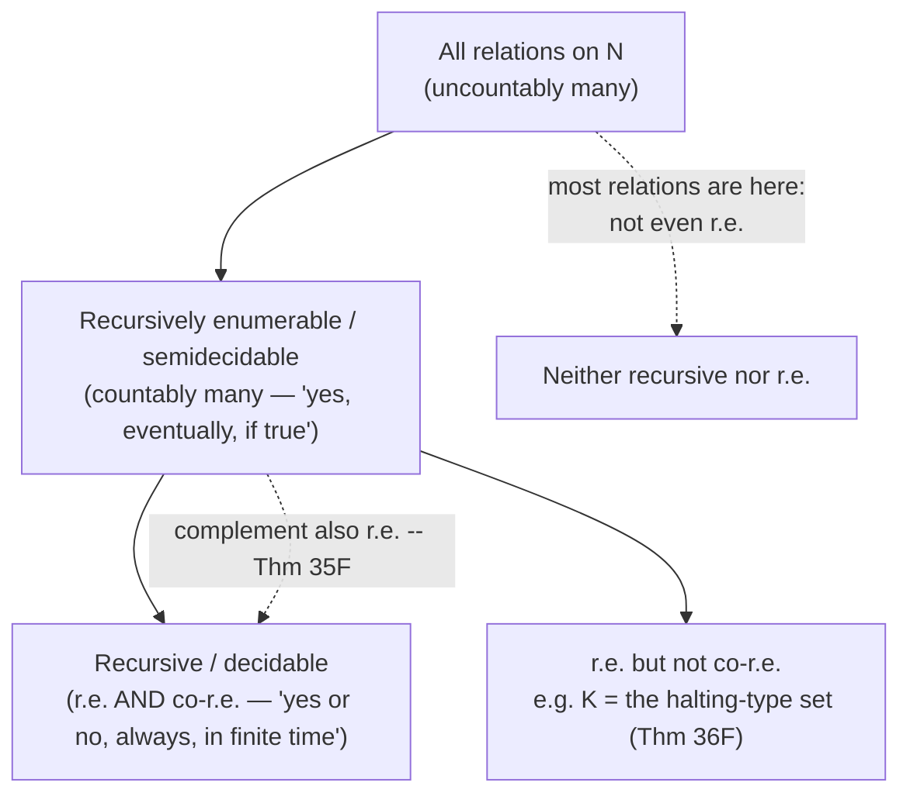

[[book-guidelines|↩ Back to guidelines]]

# Representability and Recursive Functions

## Why "computable" needs a mathematical definition at all

Everything in Chapter 3 of Enderton is aimed at one target: prove that arithmetic (the theory of $\mathfrak{N} = (N; 0, S, <, +, \cdot, E)$) is undecidable, and that any theory strong enough to talk about arithmetic is incomplete. But "undecidable" is a claim about the *absence* of an algorithm, and you cannot prove the absence of something you haven't pinned down. "There's no effective procedure for X" is meaningless until "effective procedure" itself has a mathematical (not just intuitive) definition.

This is the same problem software engineers hit whenever they try to reason formally about what a program *can't* do — you can't prove non-termination, non-computability, or non-decidability in the abstract; you need a fixed model of computation to quantify over. Enderton's route to that model runs through **logic itself**, not through machines: a relation on the natural numbers counts as "effectively decidable" if it can be *captured by a formula that a fixed, finite, weak axiom system can settle one way or the other, for every specific input*. That's the concept of **representability**. Once representability is nailed down, Enderton defines "recursive" *as* "representable," and then spends §3.6 showing this coincides with every other way people have tried to pin down "computable" — Turing machines, register machines, and so on. The claim that all of these coincide with the informal, pre-theoretic notion of "compute it by hand with unlimited time and paper" is **Church's thesis**.

This article covers §3.3 (the axiom set $A_E$, representability, primitive recursion, minimization, the catalog of representable functions) and §3.6 (Church's thesis properly stated, the normal form theorem, universal functions, and the decidable/semidecidable/r.e. hierarchy). Together these two sections are the technical engine behind everything that follows: arithmetization (the previous article) supplies the *encoding*; this topic supplies the *class of functions strong enough to decode, manipulate, and reason about those encodings from inside the theory itself* — which is exactly what the incompleteness theorems (the next article) need.

## The axiom set $A_E$: a deliberately weak theory of arithmetic

Enderton doesn't work with full $\mathrm{Th}\,\mathfrak{N}$ (the set of *all* true sentences of arithmetic) — that's too big and unwieldy to reason about directly. Instead he picks a small, finitely axiomatized theory called $A_E$ (eleven sentences: two for successor, three for order, two recursion equations for addition, two for multiplication, two for exponentiation) and works with $\mathrm{Cn}\,A_E$, the set of its logical consequences.

$$
\begin{aligned}
&\forall x\; Sx \neq 0 &&\text{(S1)}\\
&\forall x\,\forall y\;(Sx = Sy \to x = y) &&\text{(S2)}\\
&\forall x\,\forall y\;(x < Sy \leftrightarrow x \le y) &&\text{(L1)}\\
&\forall x\; x \not< 0 &&\text{(L2)}\\
&\forall x\,\forall y\;(x<y \lor x=y \lor y<x) &&\text{(L3)}\\
&\forall x\; x+0=x &&\text{(A1)}\\
&\forall x\,\forall y\; x+Sy = S(x+y) &&\text{(A2)}\\
&\forall x\; x\cdot 0 = 0 &&\text{(M1)}\\
&\forall x\,\forall y\; x\cdot Sy = x\cdot y + x &&\text{(M2)}\\
&\forall x\; xE0 = S0 &&\text{(E1)}\\
&\forall x\,\forall y\; xESy = xEy\cdot x &&\text{(E2)}
\end{aligned}
$$

Why bother with such a stingy axiom set instead of "everything true about $N$"? Because $A_E$ is chosen to be just strong enough to prove every *quantifier-free* true sentence (Theorem 33C: any variable-free true equation or inequality is a theorem of $A_E$), and no stronger than that. This narrowness is the whole point — it's what makes $A_E$ *finitely axiomatizable* while still being able to simulate arbitrary computation, which is exactly the tension the incompleteness results exploit later.

If you know Peano Arithmetic (PA) already: $A_E$ is dramatically weaker. It has no induction schema at all. $A_E$ can verify any *specific* numerical fact ($2+2=4$) but can't prove *general* facts about all numbers (it can't even prove $\forall y(y=0 \lor \exists x\, y = Sx)$). It is a computation engine, not a reasoning engine — and that's deliberate: representability only needs the computation engine.

**What breaks without a finite axiom set.** If you let $A_E$ be replaced by all of $\mathrm{Th}\,\mathfrak{N}$, "representability in $\mathrm{Th}\,\mathfrak{N}$" collapses into ordinary truth-in-$\mathfrak{N}$ (definability) — which is a *semantic*, not effective, notion, and Tarski's theorem (covered in the next article) shows truth-in-$\mathfrak{N}$ isn't even arithmetically definable, let alone decidable. Finiteness of the axiom set is what lets Theorem 33F below actually deliver an algorithm.

## Representability: "provably decidable from inside the theory"

Here's the core move, and it deserves to be understood before the notation lands.

Take a relation $R$ on the natural numbers — say, "is a prime number," or "is a valid deduction of the following sentence." You already know what it means for a formula $\rho$ to *define* $R$ in the structure $\mathfrak{N}$: $\rho$ is *true of* exactly the tuples in $R$, false of everything else. That's a statement about the model — about semantic truth.

**Representability replaces "true" with "provable from a fixed, finite axiom set."** A formula $\rho$ *represents* $R$ in $\mathrm{Cn}\,A_E$ iff, for every tuple $a_1,\dots,a_m$ of natural numbers, writing $S^k0$ for the numeral denoting $k$ (apply "successor" $k$ times to $0$):

$$
\begin{aligned}
\langle a_1,\dots,a_m\rangle \in R &\implies A_E \vdash \rho(S^{a_1}0,\dots,S^{a_m}0)\\
\langle a_1,\dots,a_m\rangle \notin R &\implies A_E \vdash \neg\rho(S^{a_1}0,\dots,S^{a_m}0)
\end{aligned}
$$

In words: for each specific numeral input, $A_E$ either proves the formula holds, or proves it doesn't — and it always does one or the other, never neither, never both (consistency of $A_E$ rules out both). Enderton names this property separately: a formula with this "always settled, one way or the other, for every numeral substitution" behavior is called **numeralwise determined** by $A_E$ (Theorem 33E: $\rho$ represents $R$ in $\mathrm{Cn}\,A_E$ iff $\rho$ is numeralwise determined by $A_E$ *and* $\rho$ defines $R$ in $\mathfrak{N}$ — i.e., representability = definability + provable settlement).

This is the crucial theorem connecting the two worlds:

> **Theorem 33F.** If $R$ is representable in a consistent, axiomatizable theory, then $R$ is decidable.

The proof is literally an algorithm: since a consistent axiomatizable theory's theorems are effectively enumerable (you can mechanically list all deductions), given a tuple $\vec a$, just enumerate deductions from the theory until you hit either $\rho(\vec{S^a}0)$ or its negation — one of the two is guaranteed to show up eventually, and *when* it shows up tells you the decision. Representability isn't just an analogy to decidability; it's a **certificate of decidability**, with the certificate being the actual halting procedure.

### Rust framing: representability as "the type checker actually terminates with an answer"

This is worth grounding hard, because it's precisely the shape of the guarantee an embedded theorem prover needs to make about a *decidable* fragment of its logic. Think of $A_E$ as playing the role of a fixed, sound inference engine, and "$\rho$ is numeralwise determined" as the property "for every concrete input, the engine is *guaranteed* to derive either the proposition or its negation in finite time" — i.e. a total decision procedure exists and its correctness is baked into [[Weak-Fragments-of-Number-Theory#The axioms|the axioms]], not bolted on after the fact.

```rust
// A "representable relation" is a relation R for which we have a formula
// whose truth or falsity A_E can always settle. Operationally: a function
// that is *guaranteed* to terminate with Yes or No -- never loop forever,
// never panic, never need more axioms than the fixed set A_E gives it.
enum Verdict { Yes, No }

trait Representable<Input> {
    // The contract: this MUST terminate on every input, either branch,
    // by relying only on the fixed axiom set (no external, unbounded search).
    fn decide(&self, input: Input) -> Verdict;
}
```

The point of representability isn't "we can write a checker" — you can always *try* to write a checker. The point is that the check is backed by a **fixed, finite** inference system, so its termination is a structural property of the axioms, not an empirical fact about a particular implementation. That distinction — *fixed and finite axioms guarantee termination* vs. *general search might not* — is exactly the primitive-recursion-vs-minimization split in the next section, and it is exactly the boundary a real theorem prover's proof search has to respect when it wants to promise decidability rather than just semi-decidability.

## Functional representability: functions, not just relations

Representability as defined above is about *relations*. For a *function* $f$, Enderton wants something a bit stronger: not just "the graph of $f$ is representable as a relation," but "there's a formula that pins down the *unique* correct output" — because that's what you need to actually use $f$ as a function inside proofs (substitute it, compose it, chain it).

A formula $\varphi$ (with free variables $v_1,\dots,v_{m+1}$) **functionally represents** $f: N^m \to N$ in $\mathrm{Cn}\,A_E$ iff for every $a_1,\dots,a_m$:

$$
A_E \vdash \forall v_{m+1}\Bigl(\varphi(S^{a_1}0,\dots,S^{a_m}0,v_{m+1}) \leftrightarrow v_{m+1} = S^{f(a_1,\dots,a_m)}0\Bigr)
$$

Read the biconditional as two halves: the "$\leftarrow$" direction says "plugging in the true output value makes $\varphi$ hold" (existence); the "$\rightarrow$" direction says "*nothing else* makes $\varphi$ hold" (uniqueness). Theorem 33J shows functional representability implies (relational) representability; Theorem 33K shows the converse — any relationally representable function can be *upgraded* to a functionally representable one, by conjoining "$\varphi$ holds" with "nothing smaller also makes $\varphi$ hold" (a least-witness trick that recurs constantly in this material). So the two notions coincide in strength; functional representability is just the version that's convenient to compose.

## Primitive recursion and minimization: the two ways to build new representable functions

This is the mechanical heart of §3.3, and it maps almost one-to-one onto a distinction every systems/compiler engineer already has intuition for: **structured recursion that's guaranteed to terminate**, versus **unbounded search that might not**.

### Primitive recursion (Theorem 33P)

Given a representable function $g$ of $k+2$ arguments, primitive recursion defines a new function $f$ by:

$$
f(a,\vec b) = g\bigl(\overline{f}(a,\vec b),\, a,\, \vec b\bigr)
$$

where $\overline{f}(a,\vec b) = \langle f(0,\vec b),\dots,f(a-1,\vec b)\rangle$ is the *sequence of all previous values* of $f$, packed into a single number via the prime-power sequence-coding scheme built earlier in the catalog (item 12 onward: $\langle a_0,\dots,a_m\rangle = \prod_{i\le m} p_i^{a_i+1}$). Unwinding [[Interpretations-Between-Theories#The definition|the definition]] for small values:

$$
f(0,\vec b) = g(\langle\rangle, 0, \vec b), \qquad f(1,\vec b) = g(\langle f(0,\vec b)\rangle, 1, \vec b), \qquad \dots
$$

The exact scheme most textbooks call "primitive recursion" is the simpler special case in Enderton's Exercise 8: $f(0,\vec b) = h(\vec b)$ and $f(a+1,\vec b) = g(f(a,\vec b), a, \vec b)$ — "the base case is given directly, and each successive value is computed from the *immediately preceding* value plus the current index." Enderton's version generalizes this by letting $g$ see the *entire history* $\overline f$, not just the last value — but structurally it's the same idea: **the recursion is on a strictly decreasing natural number, so it is guaranteed to bottom out.** Representability of $f$ follows because "$f(a,\vec b)$ is the least sequence number of length $a$ satisfying a certain (representable) per-index condition" — and "least $x$ satisfying a bounded, decidable condition" is itself representable by the earlier catalog machinery (bounded quantification, Theorem 33I).

**What breaks without primitive recursion being restricted this way:** if you allow $g$ to call $f$ on an argument that *isn't* structurally smaller, you lose the termination guarantee for free, and proving representability (i.e. that a decision procedure exists) becomes a separate obligation you have to discharge by hand every time, rather than something the recursion scheme gives you automatically.

### Minimization / the $\mu$-operator (Theorem 33M)

The second closure operation is unbounded search:

$$
f(\vec a) = \mu b\,[\,g(\vec a, b) = 0\,] \quad \text{("the least } b \text{ such that } g(\vec a, b) = 0\text{")}
$$

Enderton is careful to state the closure theorem with a side condition: it only preserves representability when *for every* $\vec a$ *there is guaranteed to exist some* $b$ with $g(\vec a,b)=0$. Under that hypothesis, the search always terminates, and the formula

$$
\psi(v_1,\dots,v_m,0)\;\wedge\;\forall y\,(y<v_{m+1} \to \neg\psi(v_1,\dots,v_m,y,0))
$$

("$g$ hits zero here, and nowhere smaller") is numeralwise determined, hence representable. Drop that side condition — allow $g(\vec a,\cdot)$ to never hit zero for some $\vec a$ — and $f$ is simply undefined there; the search runs forever with no way to detect that in advance. This is *exactly* where "recursive" (total, always-terminating) functions and "recursive partial" functions (possibly-undefined-on-some-inputs, corresponding to programs that might loop forever) part ways, which §3.6 makes precise.

### Grounding: Rust's termination checker doesn't exist, Lean's does

Rust has no totality checker — a `loop { ... }` with a `break` guarded by an arbitrary condition is exactly unrestricted minimization, and the compiler will happily accept a function that never returns. Structural recursion in Rust (recursion strictly on `.len() - 1`, on `Option::None` base cases, etc.) is *idiomatically* primitive-recursion-shaped, but nothing enforces it; you can write infinite recursion and the type checker won't blink.

```rust
// Primitive-recursion-shaped: structurally decreasing on `n`. Provably total
// by construction -- there's no way to write this so it doesn't terminate.
fn fact(n: u64) -> u64 {
    match n {
        0 => 1,
        n => n * fact(n - 1),
    }
}

// Minimization-shaped: unbounded search, no termination guarantee.
// This is mu b . g(a, b) = 0, spelled out as a loop.
fn find_least_zero(a: u64, g: impl Fn(u64, u64) -> u64) -> u64 {
    let mut b = 0;
    loop {
        if g(a, b) == 0 { return b; }
        b += 1; // may never happen -- this can diverge
    }
}
```

**Lean's termination checker is the most literal modern analogue of this exact split.** Lean requires every recursive definition to either be *structurally* recursive (its termination checker can see a strictly-decreasing structural measure automatically — this is primitive recursion, made a first-class, machine-checked category) or to come with an explicit well-founded relation and a manually-supplied proof that each recursive call decreases it (`termination_by` / `decreasing_by`) — which is you, the author, discharging exactly the side condition Theorem 33M demands before minimization is allowed to count as a genuine function. Lean will simply *refuse to compile* a definition shaped like unrestricted `find_least_zero` above unless you can supply that proof; the kernel treats "might not terminate" as "not a function." That refusal is the type-theoretic incarnation of the same fact Enderton is proving model-theoretically: minimization only produces a *bona fide* total function, representable by a formula that's always settled, when totality is independently guaranteed.

### Python sketch: minimization as literal unbounded search

```python
def mu(g, *args):
    """mu b . g(*args, b) == 0 -- the least b with g(args, b) = 0.
    Diverges if no such b exists."""
    b = 0
    while g(*args, b) != 0:
        b += 1
    return b
```

Five lines, and it's exactly the operator: no static guarantee it halts, just like `find_least_zero` above.

## The catalog: what a total-functions language can express, one entry at a time

§3.3's "Catalog" builds up a whole toolkit of representable functions and relations, entry by entry, closing under operations already shown safe. It's worth reading this catalog the way you'd read a standard library being built up from a minimal core:

| # | What's added | Closure principle used |
|---|---|---|
| 0 | Any quantifier-free-definable relation; closure under $\cup,\cap,\lnot$; bounded $\forall$/$\exists$ | Theorem 33I |
| 1 | $R$ representable iff its characteristic function $K_R$ is | direct construction |
| 2 | $\{\vec a \mid \langle f(\vec a), g(\vec a)\rangle \in R\}$ | composition |
| 3–6 | Bounded quantification variants; divisibility; primality; adjacent primes | 0 + composition |
| 7 | The prime-listing function $p_a$ (the $(a{+}1)$-st prime) | encoded via a clever number-theoretic trick |
| 8–9 | Sequence encoding $\langle a_0,\dots,a_m\rangle = \prod_{i\le m} p_i^{a_i+1}$, and decoding $(a)_b$ | minimization (Theorem 33N) |
| 10–12 | "Is a sequence number," length `lh`, restriction $a \restriction b$ | minimization |
| 13 | **Primitive recursion** (Theorem 33P) | encode the whole history as one sequence number, then minimize for the least such sequence |
| 14 | Bounded products $\prod_{i<a}F(i,\vec b)$ and sums | primitive recursion |
| 15 | String concatenation $a * b$ | composition of the above |

Two things are worth naming explicitly here. First, notice that **primitive recursion itself is implemented, inside the catalog, using minimization** ("$f(a,\vec b)$ is the *least* sequence number satisfying..."). This isn't circular — it just shows that inside $\mathrm{Cn}\,A_E$'s representability framework, minimization is the more fundamental primitive, and primitive recursion is a *derived, always-safe special case of it* (safe precisely because the side condition of Theorem 33M — "a satisfying $b$ always exists" — is automatically guaranteed by well-founded recursion on a natural number). Second: the pairing/sequence-encoding machinery (items 7–12) is doing exactly the job Gödel numbering does at the syntax level (covered in the arithmetization article) — but now applied to *runtime data* (the history of a recursive computation) rather than to *program text*. Same trick, different layer.

**What breaks without the catalog's closure properties:** without composition and primitive-recursion closure established once and for all, every new function you want to use in a proof (exponentiation, sequence-coding, prime enumeration, ...) would need its own from-scratch representability proof. The catalog is what lets §3.4 (arithmetizing syntax) and §3.5 (the actual incompleteness proofs) simply *cite* "this function is representable because it's built from catalog items by composition/recursion/minimization," instead of re-deriving representability every time — exactly the payoff a standard library gives a programming language.

## Church's thesis: closing the gap between the formal and the informal

Theorem 33F only goes one direction: representable $\Rightarrow$ decidable. The converse — every decidable relation is representable in some consistent, finitely axiomatizable theory — **cannot be proven**, because "decidable" on the left is an informal, pre-theoretic notion (an "effective procedure" in the sense of "something a person with unlimited time and paper could mechanically execute"), and you can't formally prove a formal statement equivalent to an informal one. What you *can* do is define:

> **Definition.** A relation $R$ is **recursive** iff it is representable in some consistent, finitely axiomatizable theory (in a language with $0$ and $S$).

and then state **Church's thesis**: a relation is decidable (in the informal sense) if and only if it is recursive (in this precise sense). Enderton is explicit that this is a *judgment*, not a theorem — the same epistemic status as identifying "intuitively continuous" with the formal $\varepsilon$-$\delta$ definition. The evidence for it is empirical and convergent: every relation mathematicians have believed to be decidable has turned out to be recursive; and multiple independently-invented formalizations of "effective computability" — Turing machines (1936), register machines, and this representability-based definition — have all turned out to define the *exact same class* of functions. That convergence from independent directions is what makes the thesis credible even though it isn't a theorem.

Once Church's thesis is accepted, "recursive" becomes the working synonym for "computable/decidable" for the rest of the book, and Enderton switches vocabulary accordingly (Theorem 34A: a relation is recursive iff representable in $\mathrm{Cn}\,A_E$ specifically — the initial choice of $A_E$ turns out to be no real loss of generality, *any* consistent finitely axiomatizable theory that could represent $R$ would already let you represent it in $A_E$ too).

**Where this matters for an embedded theorem prover:** Church's thesis is the reason you can talk meaningfully about "what my proof-search procedure can decide" at all — it's the bridge that lets you reason about the *implementation-independent* limits of any possible decision procedure (Turing machine, Rust function, recursive descent, whatever) by reasoning about the single mathematical class of recursive functions. Any claim like "this fragment of my logic is decidable" is, under Church's thesis, a claim about representability/recursiveness — and any claim like "this fragment is *undecidable*" (which you will eventually need to make honestly, once your prover's logic is expressive enough) is a claim that *no* representable relation captures it, proven the way Enderton proves undecidability of $\mathrm{Th}\,\mathfrak N$ in the next article: diagonalization against the recursive/r.e. hierarchy.

## Universal machines and the normal form theorem

§3.6 makes precise the idea of a **general-purpose computer**: instead of building one specialized decision procedure per relation, build *one* machine that takes a "program" as an extra input and simulates it.

Enderton defines, for each $m$, an $(m+2)$-ary relation $T_m$: the tuple $\langle e, a_1,\dots,a_m,k\rangle \in T_m$ iff (i) $e$ is the Gödel number of a formula $\varphi$ with exactly $v_1,\dots,v_{m+1}$ free, and (ii) $k$ is a sequence number of length 2 whose first component, $(k)_0$, is (the Gödel number of) a deduction from $A_E$ of $\varphi(S^{a_1}0,\dots,S^{a_m}0, S^{(k)_1}0)$. Read $e$ as "the program" (the Gödel number of a formula weakly representing some function $f$), $a_1,\dots,a_m$ as "the input," and $k$ as encoding both "a proof that the output is $(k)_1$" and "the output $(k)_1$ itself." Crucially — **Lemma 36A: $T_m$ is itself recursive** (it's built entirely from the arithmetization machinery of §3.4, which is all catalog-representable). Define the "upshot" function $U(k) = (k)_1$ — also recursive, just a decoding projection.

> **Theorem 36B / Kleene's Normal Form Theorem (1936/1943).** For any recursive function $f: N^m \to N$, there is a number $e$ (the "program") such that
> $$
> f(a_1,\dots,a_m) = U\bigl(\mu k\,[\langle e,a_1,\dots,a_m,k\rangle \in T_m]\bigr).
> $$

This is the formal counterpart of "one universal computer, fed a program and data, can compute any computable function" — Figures 11–12 in the book literally draw this as a special-purpose vs. general-purpose computer. Note the shape: it's $T_m$ (recursive, i.e. *decidable*, "is $k$ a valid, complete proof-encoding for input $\vec a$ under program $e$?") composed with a single outer $\mu$ (minimization, "find the least such proof-encoding") and then a recursive decoding $U$. **Every recursive function, no matter how it was built, can be put in this one canonical shape: a decidable inner check wrapped in exactly one unbounded search.** That's a remarkably strong structural fact — arbitrary nested composition/recursion/minimization always flattens to "decidable check, then search."

### Partial functions, and the honest treatment of "might not halt"

The theory gets more natural once you stop insisting every function is total. Enderton defines $[\![e]\!]_m(\vec a) = U(\mu k\,[\langle e,\vec a,k\rangle \in T_m])$ — *undefined* when no such $k$ exists (the search never finds a witness). This is the **recursive partial function with index $e$** — the formal counterpart of "run program $e$ on input $\vec a$; it may output an answer, or may run forever." A **recursive partial function** is defined as one whose graph (as a relation) is recursively enumerable — not necessarily recursive. The distinction matters: total + r.e. graph $\Rightarrow$ recursive (Theorem 36D — you can always ask "does it equal $c$?" for each $c$ and let the two-sided search resolve it, since a total function's complement-of-graph is automatically r.e. too), but a genuinely partial function can be computable (r.e. graph) while its domain — "does this program halt on this input?" — is *not* decidable. That's precisely the halting problem, and Enderton derives it directly from this machinery:

- $K = \{a \mid [\![a]\!]_1(a) \text{ is defined}\}$ is r.e. but not recursive (Theorem 36F) — proved by a diagonal construction: if $K$ were recursive, the function "$[\![a]\!]_1(a)+1$ if $a\in K$, else $0$" would be a total recursive function, hence $= [\![e]\!]_1$ for some $e\in K$, giving the contradiction $f(e) = [\![e]\!]_1(e)+1 = f(e)+1$.
- **Corollary 36G (Unsolvability of the Halting Problem):** $\{\langle e,a\rangle \mid [\![e]\!]_1(a)\text{ is defined}\}$ is not recursive.

This is the single most consequential fact for anyone building a general-purpose proof search procedure: **you cannot, in general, write a decision procedure that tells you in advance whether a given search will ever terminate.** You can only run it and hope. This is not an engineering limitation to be optimized away — Enderton's diagonal argument shows it's a mathematical impossibility for *any* sufficiently expressive notion of "program," Rust included.

### Decidable, semidecidable, and recursively enumerable — the hierarchy that matters for proof search

Putting the pieces together (the definitions actually appear earlier, in §1.7, for expressions/sentences, and get re-derived for numeric relations across §3.5–3.6, but they're one concept):

- **Decidable**: an effective procedure exists that, given any candidate, always halts and correctly answers "yes" or "no." Equivalent (Theorem 34A) to: representable in $\mathrm{Cn}\,A_E$; equivalent (Theorem 35F) to: the relation *and its complement* are both recursively enumerable.
- **Semidecidable** (= effectively enumerable = recursively enumerable, "r.e."): an effective procedure exists that halts and says "yes" *exactly when* the answer is yes — and may run forever (never answering) when the answer is no. Equivalently (Theorem 35E): $R = \{\vec a \mid \exists b\, \langle \vec a, b\rangle \in Q\}$ for some recursive $Q$ — "check, for a witness, over an unbounded search" is *the* r.e. shape.
- **All sets/relations**: the vast (uncountable) majority are neither.



**This hierarchy is exactly the classification your embedded theorem prover's proof-search procedure lives in.** A typical proof search over an undecidable logic (first-order logic with equality, or anything Turing-complete) is *semidecidable, not decidable*: if a proof exists, systematic search (e.g. exhaustive proof-tree enumeration, resolution with a fair strategy) is guaranteed to find it in finite time — that's the "yes, eventually" half. But if no proof exists, the search may simply never terminate — there is, in general, no way to detect "there is no proof" by watching the search run, precisely because the *complement* of "provable" is not, in general, r.e. (this is literally Corollary 36G's shape: "does $[\![e]\!]$ halt" is semidecidable in the *same* asymmetric way "is $\sigma$ provable" is). This is not a bug in a particular prover's implementation — it's the mathematical ceiling. Any honest specification of what your prover can promise needs to say "if the goal is provable, search will find it" (soundness + completeness of the semidecision procedure) and *not* "search will tell you if the goal is unprovable" — that second promise is only deliverable on a **decidable fragment** (like the propositional/quantifier-free-with-bounded-quantifiers world of Theorem 33I, or successor/Presburger arithmetic elsewhere in the book), and *only* by restricting expressiveness enough that the fragment's search reduces to Theorem 33F's actual algorithm rather than open-ended minimization.

## Where this leads

This topic is the load-bearing machinery for everything after it in Chapter 3:

- **Arithmetization** (previous article) supplies the encoding — Gödel numbers for expressions and deductions. This topic supplies the *class of functions* (recursive/representable) strong enough to manipulate those codes *from inside the axiom system itself* — decoding a sequence number, checking "is $d$ a valid deduction of $\sigma$," extracting the last line of a proof. Without the catalog's closure properties, arithmetization would produce codes you couldn't reason about formally; representability is what makes the codes *usable*.
- **Gödel's Incompleteness Theorems** (next article) need exactly two things this topic delivers: (1) the Fixed-Point Lemma's self-referential sentence is built by composing representable functions (substitution, Gödel-numbering) exactly as catalogued here; (2) the informal-to-formal bridge (Church's thesis) is what licenses saying "$\mathrm{Th}\,\mathfrak N$ is undecidable" as a *mathematical* conclusion rather than a hunch, via Theorem 33F run in reverse (Tarski's theorem shows $\mathrm{Th}\,\mathfrak N$ isn't even definable, hence can't be recursive).
- **For [[Godels-Incompleteness-Theorems#The theorem|the theorem]]-prover project specifically**: the primitive-recursion/minimization split is literally the design question "should my termination checker accept this rule as always terminating, or does it require an unbounded search whose halting I cannot guarantee" — the same question Lean's kernel answers via structural vs. well-founded recursion. And the decidable/semidecidable/r.e. hierarchy is the honest vocabulary for scoping any claim your prover makes about what it can and cannot promise to decide.
