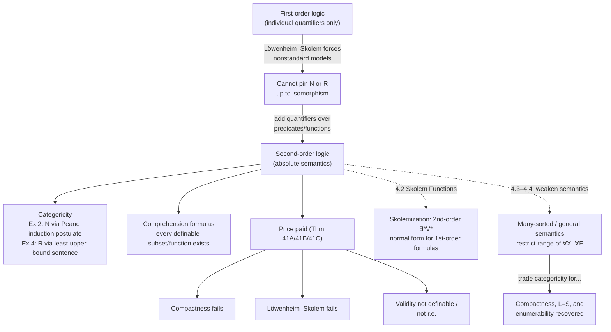

# Second-Order Logic

[[book-guidelines|↩ Back to guidelines]]

## The problem first-order logic can't solve

Everything in this book up through Chapter 3 has been first-order: quantifiers range only over individuals (elements of the domain), never over predicates or functions. That restriction is exactly what buys you the two big metatheorems the book has been building toward — Compactness and Löwenheim–Skolem. But it also buys you a permanent, structural defect: **first-order logic cannot pin down the natural numbers up to isomorphism.**

Any first-order theory that has $(\mathbb{N}; 0, S)$ as a model — say, Peano arithmetic's first-order axioms plus the induction *schema* (one axiom per definable formula $\varphi$) — also has models that are *not* isomorphic to $\mathbb{N}$: nonstandard models containing "infinite" numbers arranged in $\mathbb{Z}$-chains sitting after all the genuine finite numbers. This isn't a defect you can patch by adding more first-order axioms; it's forced by the Compactness Theorem itself (add a constant $c$ and the sentences $c \neq 0, c \neq S0, c \neq SS0, \ldots$ — every finite subset is satisfiable in $\mathbb{N}$, so by compactness the whole set is satisfiable, and that new model can't be $\mathbb{N}$). Löwenheim–Skolem sharpens the same point: any theory with an infinite model has models of every infinite cardinality, so no first-order theory can characterize a structure of a *fixed* infinite size.

So: what if you could quantify not just over numbers, but over *sets of numbers* — over subsets of the domain? That's the entire idea of second-order logic, and it's introduced by Enderton with a small, sharp example before any formal apparatus. The first-order formula

$$\exists x(Px \to \forall x\, Px)$$

is valid — true under every interpretation of $P$ — because it's a tautology of predicate logic regardless of what set $P$ denotes. Since it holds no matter which set gets substituted for $P$, it's natural to say the *stronger* sentence

$$\forall P\, \exists x(Px \to \forall x\, Px)$$

"deserves to be called valid" too. But this new sentence has a quantifier binding $P$ itself — $P$ is no longer a fixed but arbitrary predicate symbol (a *parameter*), it's a *variable* ranging over predicates. That one move — letting quantifiers bind predicate and function symbols, not just individual variables — is second-order logic.

## Predicate and function variables, and what they quantify over

**What this maps to in code.** If you've written generic code, you already have decent intuition here. A first-order formula with a predicate *parameter* $P$ is like a function generic over a fixed, externally-supplied predicate — you write the formula once, and someone else plugs in what $P$ means. Quantifying over $P$ — $\forall P(\ldots)$ — is like universally quantifying over *all possible implementations* of a trait bound: "for every possible set $P$ could denote, this holds." It's the logical analogue of a `where P: SomePredicate` bound ranging over every type/value satisfying that shape, rather than one instantiation of it.

Enderton adds two new families of symbols on top of the first-order language from Section 2.1:

- **Predicate variables**: for each positive integer $n$, the $n$-place predicate variables $X_1^n, X_2^n, \ldots$ — variables ranging over $n$-ary *relations* on the domain.
- **Function variables**: for each positive integer $n$, the $n$-place function variables $F_1^n, F_2^n, \ldots$ — variables ranging over $n$-ary *functions* on the domain.

(The book renames the old $v_1, v_2, \ldots$ to *individual variables* to keep the three kinds straight.) Terms are built exactly as before — from constants and individual variables, but now function *variables* $F$ can be applied just like function *parameters*. Atomic formulas are $Pt_1 \cdots t_n$ where $P$ is a predicate symbol, parameter or variable alike. The formula-building rules gain two new clauses: if $\varphi$ is a wff, so are $\forall X_i^n \varphi$ and $\forall F_i^n \varphi$. A **sentence** is a wff with no free variable of *any* kind — individual, predicate, or function.

Enderton is careful to flag the conceptual point underneath the syntax: a *free* predicate variable and a predicate *parameter* play essentially the same role — both stand for "some fixed but unspecified relation." Quantifying binds that role the same way $\forall x$ binds a free individual variable. Nothing structurally new is happening; you're just extending the space of things a quantifier can range over.

### Satisfaction, extended

To say when a structure satisfies a second-order formula, you extend the assignment function $s$. Previously $s$ mapped individual variables to elements of the domain $|A|$. Now $s$ is defined on *all* variables:

- $s(v_i) \in |A|$ (unchanged),
- $s(X_i^n)$ is an $n$-ary relation on $|A|$,
- $s(F_i^n)$ is an $n$-ary operation (function) on $|A|$.

Atomic satisfaction for a predicate variable $X$ works exactly like it does for a predicate parameter:

$$\models_A Xt_1 \cdots t_n[s] \quad\text{iff}\quad \langle s(t_1), \ldots, s(t_n)\rangle \in s(X).$$

And the two new quantifier clauses are where all the expressive power — and all the trouble — comes from:

5. $\models_A \forall X_i^n \varphi[s]$ iff for **every** $n$-ary relation $R$ on $|A|$, $\models_A \varphi[s(X_i^n \mid R)]$.
6. $\models_A \forall F_i^n \varphi[s]$ iff for **every** function $f: |A|^n \to |A|$, $\models_A \varphi[s(F_i^n \mid f)]$.

Read that quantifier literally: "every $n$-ary relation on $|A|$" means every subset of $|A|^n$ whatsoever — not just the definable ones, not just the ones you can name in the language. This is what the book (and the rest of this article) calls **absolute** second-order semantics: the range of $\forall X$ is fixed externally, by set theory, as the full powerset $\mathcal{P}(|A|^n)$, independent of the language or the structure's own vocabulary.

**Lean correspondence.** This is the single most direct bridge in this whole topic. Lean lets you write exactly this kind of quantifier natively:

```
theorem example1 : ∀ (P : α → Prop), ∃ x, P x → ∀ x, P x := ...
```

Here `P : α → Prop` is a genuine second-order object — a predicate on `α`, i.e. a function into `Prop`. `∀ (P : α → Prop), ...` is *literally* Enderton's $\forall X^1 \varphi$, spelled out with `Prop` playing the role of "the type of predicates." What makes Lean's setup a good stand-in for "absolute" semantics is Lean's universe hierarchy: `Prop` (and more generally `Sort u`) is a genuine, all-inclusive type of all propositions/predicates at that level — there's no notion of "only the definable predicates get to be `Prop`s." Quantifying `∀ (P : α → Prop)` really does range over everything of that shape the type theory admits, which is the proof-theoretic analogue of Enderton's "every subset of $|A|^n$ whatsoever." (Section 4.3–4.4 of the book, previewed at the end of this article, will introduce an *alternative* semantics that restricts this range — the model-theoretic analogue of a smaller universe.)

## Worked examples: what this buys you

Enderton walks through five examples; the two load-bearing ones for this topic are categoricity for $\mathbb{N}$ and for $\mathbb{R}$.

**Example 2 — categorical characterization of $(\mathbb{N}; 0, S)$.** First-order Peano-style axioms can only express induction as a *schema*: one axiom per first-order-definable property $\varphi(v_1)$,

$$\varphi(0) \wedge \forall y(\varphi(y) \to \varphi(Sy)) \to \forall y\, \varphi(y).$$

This only forces closure under $S$ for the *definable* subsets of the domain. Second-order logic lets you state induction as a single sentence quantifying over *all* subsets at once — the actual Peano induction postulate:

$$\forall X\big(X0 \wedge \forall y(Xy \to XSy) \to \forall y\, Xy\big).$$

Enderton states the payoff directly: any model of the successor axioms (S1, S2) plus this postulate is **isomorphic to $(\mathbb{N}; 0, S)$**. The theory is *categorical* — all its models are isomorphic. This is exactly the property first-order logic structurally cannot deliver for an infinite structure.

**What breaks without this.** Take any nonstandard model $A$ of $\mathrm{Th}(\mathbb{N}; 0, S)$ containing a $\mathbb{Z}$-chain (a copy of the integers glued on after all the standard elements). $A$ satisfies every instance of the first-order induction *schema*, because the $\mathbb{Z}$-chain isn't first-order definable, so it never has to be "caught" by any one schema instance. But $A$ does *not* satisfy the second-order induction postulate: take $X$ to be the set of standard (finite) elements. $X$ contains $0$, is closed under $S$, but isn't all of $|A|$ — that's exactly a counterexample witness the second-order $\forall X$ quantifier has access to and the first-order schema doesn't. Enderton's own gloss: "the set of standard points is simply not definable in $\mathbb{N}$" — but second-order quantification doesn't care whether $X$ is definable, since $\forall X$ ranges over *all* subsets absolutely.

**Rust framing.** Think of the first-order induction schema as a trait bound restricted to a fixed enumerable list of "provided" implementations — you get induction only for the properties you can actually name in the language, the way generic code parameterized only over a whitelist of concrete types misses the general case. Second-order induction is `∀ X ⊆ Domain` in the fully generic, unrestricted sense — closer to a universally quantified property over *every* subset, which no finite (or even countably infinite, language-indexed) enumeration of predicates can simulate. That gap between "every definable subset" and "every subset, period" is precisely the gap between a first-order schema and a genuine second-order sentence — and it's not a gap you can close by adding more axioms, only by changing what your quantifiers are allowed to range over.

**Example 4 — categorical characterization of the reals.** The same trick works for $\mathbb{R}$. The first-order axioms for an ordered field don't pin down the reals — e.g. any nonstandard model of real closed fields with infinitesimals satisfies them too. What singles out $\mathbb{R}$ is the least-upper-bound property, which quantifies over *arbitrary sets* of field elements ("any bounded nonempty set has a least upper bound") — inherently second-order:

$$\forall X\big[\exists y\,\forall z(Xz \to z \le y) \wedge \exists z\, Xz \to \exists y\,\forall y'(\forall z(Xz \to z \le y') \leftrightarrow y \le y')\big].$$

Enderton: any ordered field satisfying this second-order sentence is isomorphic to the ordered field of reals. Same mechanism as $\mathbb{N}$: quantifying over *all* subsets, not just definable ones, is what forces uniqueness up to isomorphism.

## Comprehension formulas: what second-order objects are guaranteed to exist

Second-order semantics says $\forall X$ ranges over *every* subset of the domain — but the language itself needs some way to talk about specific such subsets being picked out by formulas. That's what **comprehension formulas** (Example 3) do. For any formula $\varphi$ not containing $X^n$ free,

$$\exists X^n\, \forall v_1 \cdots \forall v_n\, [X^n v_1 \cdots v_n \leftrightarrow \varphi]$$

is *valid* — true in every structure, unconditionally. It says: the relation consisting of exactly the tuples satisfying $\varphi$ exists as an object your quantifiers can range over. There's an analogous **function comprehension formula** for a formula $\psi$ (with the function variable $F^n$ not free in $\psi$) that functionally determines $v_{n+1}$ from $v_1, \ldots, v_n$:

$$\forall v_1 \cdots \forall v_n\, \exists! v_{n+1}\, \psi \;\to\; \exists F^n\, \forall v_1 \cdots \forall v_{n+1}\big(F^n v_1 \cdots v_n = v_{n+1} \leftrightarrow \psi\big).$$

These are trivially valid under absolute semantics, precisely *because* $\forall X$ already ranges over every subset whatsoever — the set defined by $\varphi$ is automatically one of them, no separate axiom needed to admit it. Comprehension only becomes a substantive *axiom you have to add* once you move to a weaker semantics (Section 4.3's many-sorted reading) where the range of $X$ is no longer automatically "everything" — you'll see this exact tension again at the end of this article.

**This is a verifier/type-checker design question, not just a logic footnote.** A comprehension formula answers: *given this predicate, does the "set" it describes actually exist as an object the logic can quantify over and reason about?* That's precisely the question a type-checker or trait system has to answer implicitly every time it accepts a `where` clause or a refinement type: does the predicate you wrote actually carve out a well-formed object in your system's universe of discourse? In absolute second-order semantics the answer is always yes, unconditionally — every predicate-definable subset exists. A verifier design that instead restricts which predicates get reified as first-class objects (say, only decidable ones, or only ones expressible in a fixed sub-language) is making the same move Enderton's Section 4.3 will make: trading the free comprehension of absolute semantics for a smaller, more tractable, but *weaker* universe. Deciding what a logic's comprehension principle admits is deciding what your verifier is allowed to reason about at all.

**Lean/elaborator framing — and the higher-order unification connection.** This is also where the learning-goals thread about higher-order unification is genuinely load-bearing, not decorative. Quantifying $\forall X^n \varphi$ over predicate/function variables and then asking "does a substitution for $X$ exist making $\varphi$ hold" is structurally the same shape of problem as **higher-order unification**: solving equations where the unknown itself stands for a function or predicate, not just an individual term. Comprehension formulas are the semantic guarantee that *a* witness exists whenever $\varphi$ picks one out uniquely — but *finding* that witness algorithmically (which is what an elaborator's metavariable solver has to do when a metavariable stands for a function, not a value) is exactly where full higher-order unification becomes undecidable in general. Miller's pattern unification is the standard way of taming this: it identifies a syntactically restricted fragment (metavariables applied only to distinct bound variables) where unification stays decidable and has unique most-general solutions — a deliberate retreat from "comprehension gives you existence for free" to "we can only *algorithmically discover* the witness in the well-behaved fragment." Whenever you build a metavariable-unification elaborator and a metavariable's type mentions a function or predicate position, you're implicitly relying on something comprehension-shaped ("some function/relation satisfying this specification exists") while hoping your unifier only ever gets asked to *solve for* it in the Miller-pattern-tractable cases.

## The price: compactness and Löwenheim–Skolem fail

Categoricity for $\mathbb{N}$ and $\mathbb{R}$ sounds like a strict upgrade — until you see what it costs. Enderton proves this immediately using the same absolute quantification that bought categoricity in the first place.

**Theorem 41A (failure of Compactness).** *There is an unsatisfiable set of second-order sentences every finite subset of which is satisfiable.*

The proof reuses Example 5: a second-order sentence $\lambda_\infty$ that is true in a structure iff its domain is infinite (it says there's a transitive, irreflexive, "total" relation on the domain — i.e., there's a strict linear-order-like structure with no maximum — which only an infinite set can carry; Enderton also gives an equivalent version using an injective-but-not-surjective function). Pair $\neg \lambda_\infty$ with the first-order sentences $\lambda_2, \lambda_3, \ldots$ ("there are at least $n$ things," for every $n$). Every *finite* subset of $\{\neg\lambda_\infty, \lambda_2, \lambda_3, \ldots\}$ is satisfiable — some large enough finite structure satisfies $\neg\lambda_\infty$ and any finite prefix of the $\lambda_n$'s. But the whole infinite set is unsatisfiable: nothing can be simultaneously finite (witnessing $\neg\lambda_\infty$) and have at least $n$ elements for every $n$. Compactness, which said "if every finite subset is satisfiable, so is the whole set," is simply false here.

**Theorem 41B.** There's a second-order sentence in the language of pure equality (no parameters but $=$) true in a structure iff its cardinality is exactly $2^{\aleph_0}$. (Proof sketch: take the ordered-field axioms conjoined with the second-order least-upper-bound sentence from Example 4 — categorical for $\mathbb{R}$ — then existentially quantify away the parameters $0, 1, +, \cdot, <$, turning "isomorphic to $\mathbb{R}$" into "has the cardinality of $\mathbb{R}$.") This is Löwenheim–Skolem's failure made concrete: a first-order theory with an infinite model always has models of *every* infinite cardinality; this second-order sentence pins the cardinality to exactly one value and no other.

**Theorem 41C (non-definability, hence non-enumerability, of validity).** The set of Gödel numbers of valid second-order sentences is not definable in $\mathbb{N}$ by any second-order formula. The proof reuses Tarski's undefinability-of-truth argument: let $T_2$ be the (Gödel-numbered) second-order theory of $\mathbb{N}$; that set is already not definable by Tarski's theorem. Conjoin [[Weak-Fragments-of-Number-Theory#The axioms|the axioms]] $AE$ with the second-order Peano postulate to get a sentence $\alpha$ categorical for $\mathbb{N}$ (any model of $\alpha$ is isomorphic to $\mathbb{N}$); then $\sigma \in T_2$ iff $(\alpha \to \sigma)$ is valid, so if validity were definable, $T_2$ would be too — contradiction. A fortiori, the validities aren't even recursively enumerable: there's no effective proof procedure, no completeness theorem, for absolute second-order logic.

**What breaks without absoluteness — and why the loss is structural, not incidental.** Notice the pattern across all three theorems: each one *reuses* the same absolute-quantification machinery that made categoricity possible. $\lambda_\infty$'s $\forall X$/$\exists X$ ranges over every subset unconditionally — that's exactly what lets it force infinitude uncompromisingly, with no escape hatch a compactness argument could exploit. The categorical pin on $\mathbb{R}$'s cardinality in 41B and the categorical pin on $\mathbb{N}$ in 41C are the very same categoricity from Examples 2 and 4, now weaponized to prove non-definability. This is the core trade-off of the whole topic: **the expressive power that lets second-order logic single out one structure up to isomorphism is the same power that breaks compactness, breaks Löwenheim–Skolem, and breaks effective enumerability of validity.** You don't get to keep the metatheorems and the categoricity both — under absolute semantics, they're in direct tension, and categoricity wins at their expense.

## Mental map



## Where this leads

Section 4.2 (Skolem Functions) turns this same second-order apparatus to a different use: showing every first-order formula has a logically equivalent second-order $\exists^*\forall^*$ (prenex) normal form, which becomes a tool for proving undecidability results about *first-order* satisfiability — categoricity's machinery repurposed as a proof technique rather than an end in itself.

Sections 4.3–4.4 confront the trade-off head-on. They reinterpret second-order logic as a *many-sorted first-order* language — separate sorts for individuals, $n$-place predicates, and $n$-place functions, with explicit membership/evaluation parameters connecting them — and define **general structures** as those satisfying all comprehension sentences under this weaker reading. The payoff is exactly the mirror image of this section: Compactness, Löwenheim–Skolem, and enumerability of validity all come back, at the direct cost of losing full categoricity. This is the formal analogue of restricting `∀X` to range over only a designated sub-universe of predicates/functions rather than the true absolute powerset — precisely the move that distinguishes Lean's `Prop`/`Sort` hierarchy (which, like absolute semantics, really does treat its universes as containing everything of that shape within the type theory) from a semantics deliberately built to be smaller and better-behaved.

For the elaborator project specifically: this section is the cleanest source-text statement of *why* full higher-order quantification is intractable in general (Theorem 41C's non-enumerability is the semantic reflection of full higher-order unification's undecidability), and comprehension formulas are the cleanest source-text statement of the existence guarantee that Miller pattern unification's restricted fragment is trying to constructively deliver on. Keep this section in mind as the "what absolute semantics promises" half of that story; Miller patterns are "what you can actually compute" half.
