[[book-guidelines|↩ Back to guidelines]]

# Sentential Connectives and Their Completeness

## Why ask this question at all

Section 1.4 finished building the machine: wffs, freely generated from sentence symbols by five formula-building operations, with a recursion theorem guaranteeing every truth assignment extends uniquely. Section 1.5 opens by pointing the machine back at its own blueprint and asking an oddly self-doubting question: *did we pick the right five connectives?*

Enderton motivates this with a genuinely new connective — a three-place **majority symbol** $\#$, where $v((\#\alpha\beta\gamma))$ agrees with the majority of $v(\alpha), v(\beta), v(\gamma)$. Nothing stops you from adding it: extend [[Sentential-Propositional-Logic#The alphabet|the alphabet]], add a sixth formula-building operation $E_\#(\alpha,\beta,\gamma) = (\#\alpha\beta\gamma)$, and specify how $v$ computes it. The question is whether this buys you anything. It doesn't — $(\#\alpha\beta\gamma)$ turns out to be tautologically equivalent to
$$
(\alpha \wedge \beta) \vee (\alpha \wedge \gamma) \vee (\beta \wedge \gamma),
$$
a formula built entirely from $\wedge, \vee$. The extension is convenient (shorter formulas) but not *expressive* — everything it can say, the original five connectives could already say.

**What breaks without pinning this down.** Enderton is careful to flag why this argument works at all: it depends on $v((\#\alpha\beta\gamma))$ being *computable from* $v(\alpha), v(\beta), v(\gamma)$ alone. Everyday modal-sounding operators like "it is possible that $\varphi$" or "I believe that $\varphi$" don't have this property — the truth of "I believe that $\varphi$" isn't a function of the truth value of $\varphi$. If sentential connectives could behave like that, the entire semantic apparatus of Section 1.2 (a truth assignment on sentence symbols, extended by the recursion theorem) would fail to pin down a unique extension. Every connective sentential logic is willing to admit must correspond to a function from truth values to a truth value — nothing more exotic. That restriction is the whole reason the question "is our stock of connectives complete?" has a clean mathematical answer at all.

## Boolean functions: throwing away the syntax

Once a connective is understood as "a function from truth-value tuples to a truth value," the formal language becomes a hindrance to stating the general theorem, so Enderton strips it away entirely.

> **Boolean function.** A $k$-place Boolean function is a function from $\{F,T\}^k$ into $\{F,T\}$. ($F$ and $T$ are also permitted as 0-place Boolean functions.)

Named examples the book fixes for reuse: the $i$-th **projection** $I_i^n(X_1,\ldots,X_n) = X_i$; **negation** $N(F)=T,\ N(T)=F$; **and** $K(T,T)=T$, else $F$; **or** $A(F,F)=F$, else $T$; **conditional** $C(T,F)=F$, else $T$; **biconditional** $E(X,X)=T$, else $F$.

Every wff $\alpha$ with sentence symbols among $A_1,\ldots,A_n$ *realizes* an $n$-place Boolean function:
$$
B_\alpha^n(X_1,\ldots,X_n) = v(\alpha), \text{ where } v(A_i) = X_i.
$$
This is exactly a truth table read as a function — $B_{A_1 \wedge A_2}$ is literally Table V of the text, reinterpreted as a map $\{F,T\}^2 \to \{F,T\}$. Composing named functions recovers composite wffs: $B_{\neg A_1 \vee \neg A_2}^2(X_1,X_2) = A(N(I_1^2(X_1,X_2)), N(I_2^2(X_1,X_2)))$ — literally the Polish-notation parse tree of $\neg A_1 \vee \neg A_2$, read as function composition instead of syntax.

**Grounding.** This is the single most concrete idea in the section, and it deserves to be made literal immediately, because it is exactly how a compiler or SAT toolkit would represent Boolean functions internally: as **truth-table bitmasks**. A $k$-place Boolean function has $2^k$ input rows, so it's fully described by a $2^k$-bit integer — bit $i$ (indexed by the bit pattern of the $i$-th input row) holds the output.

```rust
/// A k-place Boolean function, represented as its truth table: bit i of
/// `table` is the output on the input row whose bit pattern equals i
/// (bit j of i is the value of input variable j).
#[derive(Clone, Copy, PartialEq, Eq, Debug)]
struct BoolFn { arity: u32, table: u64 } // arity <= 6 fits in a u64

impl BoolFn {
    fn eval(&self, inputs: u32) -> bool {
        (self.table >> inputs) & 1 == 1
    }
    // Named functions from the book, at arity 2:
    fn and2() -> Self { BoolFn { arity: 2, table: 0b1000 } } // K: only row 11 -> T
    fn or2()  -> Self { BoolFn { arity: 2, table: 0b1110 } } // A: all but row 00
    fn neg1() -> Self { BoolFn { arity: 1, table: 0b01 } }   // N: row 0 -> T, row 1 -> F
}
```

Two Boolean functions are literally `==` on their tables — no case analysis needed. This bitmask view is what Theorem 15A below turns into a precise correspondence.

> **Theorem 15A.** Let $\alpha,\beta$ have sentence symbols among $A_1,\ldots,A_n$. Impose $F < T$. Then
> (a) $\alpha \models \beta$ iff $B_\alpha(\vec X) \le B_\beta(\vec X)$ for all $\vec X$;
> (b) $\alpha \mathbin{|\!=\!|} \beta$ iff $B_\alpha = B_\beta$;
> (c) $\models \alpha$ iff $B_\alpha$ is the constant function $T$.

Part (a)'s proof is a direct unwinding of the definitions: $\alpha \models \beta$ means every truth assignment satisfying $\alpha$ satisfies $\beta$, i.e. whenever $B_\alpha(\vec X) = T$ then $B_\beta(\vec X) = T$ — which, with $F<T$, is exactly $B_\alpha \le B_\beta$ pointwise. Parts (b) and (c) are corollaries taking $\le$ in both directions and taking $\beta$ to be a fixed tautology, respectively. [[Godels-Incompleteness-Theorems#The theorem|The theorem]]'s real content is conceptual: passing from wffs to the Boolean functions they realize **identifies tautologically equivalent wffs**. In Rust terms, `B_alpha == B_beta` (equal truth tables) is precisely `alpha` and `beta` being interchangeable everywhere a SAT solver, a circuit synthesizer, or a proof search procedure would care — tautological equivalence collapses to bitmask equality.

## Every Boolean function is realizable — and how to build the wff

Freeing yourself from the syntax raises an obvious worry: are there Boolean functions with *no* realizing wff? Enderton's answer, credited to Emil Post (1921), is no — and the proof is constructive, which is the part worth internalizing.

> **Theorem 15B.** Let $G$ be an $n$-place Boolean function, $n \ge 1$. There is a wff $\alpha$ with $G = B_\alpha^n$.

*Proof idea.* If $G$ is constantly $F$, take $\alpha = A_1 \wedge \neg A_1$. Otherwise list the $k>0$ input rows $\vec X_1,\ldots,\vec X_k$ where $G$ outputs $T$. For each row, build a conjunction $\gamma_i = \beta_{i1} \wedge \cdots \wedge \beta_{in}$ where $\beta_{ij} = A_j$ if that row's $j$-th coordinate is $T$, else $\beta_{ij} = \neg A_j$ — a literal that pins down exactly that row. Then $\alpha = \gamma_1 \vee \cdots \vee \gamma_k$ satisfies $\alpha$ under exactly the truth assignments corresponding to those $k$ rows (each $\gamma_i$ is satisfied by exactly one assignment, and the disjunction is satisfied by the union), so $B_\alpha = G$.

The book works a concrete three-place $G$ (its 8-row truth table has $T$ at rows $001, 010, 100, 111$), giving
$$
\alpha = (\neg A_1 \wedge \neg A_2 \wedge A_3) \vee (\neg A_1 \wedge A_2 \wedge \neg A_3) \vee (A_1 \wedge \neg A_2 \wedge \neg A_3) \vee (A_1 \wedge A_2 \wedge A_3).
$$
(This particular $G$ is the 3-place **parity** function — $\alpha$ is also equivalent to the much shorter $A_1 \leftrightarrow A_2 \leftrightarrow A_3$, which is Enderton's reminder that the realizing wff from the proof is never claimed to be *shortest*, only *correct*.)

This construction is exactly the standard **truth-table-to-DNF** compiler pass:

```rust
/// Build a disjunctive-normal-form realization of a Boolean function
/// directly from its truth table — this is literally Theorem 15B's proof.
#[derive(Clone, Debug)]
enum Lit { Pos(u32), Neg(u32) }          // A_j or ¬A_j
type Clause = Vec<Lit>;                   // a conjunction γ_i (an AND-clause)
type Dnf = Vec<Clause>;                   // a disjunction of clauses (the α)

fn dnf_from_truth_table(f: &BoolFn) -> Dnf {
    (0..(1u32 << f.arity))
        .filter(|&row| f.eval(row))                 // rows where G outputs T
        .map(|row| {
            (0..f.arity)
                .map(|j| if (row >> j) & 1 == 1 { Lit::Pos(j) } else { Lit::Neg(j) })
                .collect()
        })
        .collect()
}
```

This is not a loose analogy — it *is* the algorithm every symbolic-logic or circuit-synthesis tool uses to turn a specification table into a formula, and it is the same shape as **Tseitin-style CNF encoding** used to feed problems into SAT solvers (with $\wedge/\vee$ swapped, per Corollary 15C below).

Because every Boolean function has a realizing wff using only $\wedge, \vee, \neg$, Enderton draws the immediate corollary:

> **Corollary 15C.** Every wff $\varphi$ is tautologically equivalent to a wff $\alpha$ in **disjunctive normal form (DNF)**: $\alpha = \gamma_1 \vee \cdots \vee \gamma_k$, each $\gamma_i = \beta_{i1} \wedge \cdots \wedge \beta_{in}$, each $\beta_{ij}$ a literal.

DNF's advantage, as the book notes, is that it *reads off* the satisfying assignments directly — each disjunct names one. (The dual notion, **conjunctive normal form (CNF)**, is Exercise 9: a conjunction of disjunctions of literals; every wff has an equivalent CNF too, by the same argument with $\wedge/\vee$ interchanged. CNF is the representation almost every real SAT solver actually consumes.)

**Lean connection.** Post's theorem is the mathematical justification for why a tactic like `decide` can settle a proposition about a finite Boolean combination purely by *computing its truth table* — the tactic doesn't need a clever proof search because Theorem 15A(c) already tells it $\models \varphi$ iff $B_\varphi$ is the constant-$T$ function, and that's decidable by brute enumeration over $2^n$ rows. If you were formalizing this section in Lean, `BoolFn n` would naturally be `Vector Bool n → Bool`, and Theorem 15B would be a `Decidable`-driven construction: for each `row` with `f row = true`, emit the conjunction of literals it names, exactly mirroring the Rust closure above.

## Completeness: the technical meaning of "enough connectives"

With every Boolean function realizable using only $\{\wedge,\vee,\neg\}$, Enderton names the property:

> A set of connectives is **complete** iff every Boolean function $G:\{F,T\}^n \to \{F,T\}$ ($n\ge1$) is realized by some wff using only those connectives.

$\{\wedge,\vee,\neg\}$ is complete by Corollary 15C. This is a strictly stronger claim than "expressive enough to translate ordinary English" — completeness demands realizing *every* function on the nose, not just the handful that show up in practice. Once you have one complete set, you get a general closure fact for free: given any wff $\varphi$, build $\alpha$ using only the complete set's connectives with $B_\alpha = B_\varphi$; then $\alpha \mathbin{|\!=\!|} \varphi$ by Theorem 15A(b). So completeness of a set of connectives is really a property of the *set of realizable functions* being all of them — and it means you can always rewrite any formula using only that restricted vocabulary.

Completeness can be pushed further:

> **Theorem 15D.** Both $\{\neg,\wedge\}$ and $\{\neg,\vee\}$ are complete.

*Proof.* Start from an $\alpha$ using $\{\wedge,\vee,\neg\}$ realizing $G$ (Theorem 15B), then eliminate $\vee$ using De Morgan's law $\beta \vee \gamma \mathbin{|\!=\!|} \neg(\neg\beta \wedge \neg\gamma)$, applied by induction on formula structure. The inductive step's $\vee$-case is the whole proof in miniature: if $\alpha = (\beta \vee \gamma)$, take $\alpha' = \neg(\neg\beta' \wedge \neg\gamma')$ where $\beta',\gamma'$ are the already-eliminated versions of $\beta,\gamma$; then $\alpha' \mathbin{|\!=\!|} \neg(\neg\beta \wedge \neg\gamma) \mathbin{|\!=\!|} \beta \vee \gamma = \alpha$.

**Grounding.** This is precisely an IR-lowering compiler pass — rewriting a formula to use only a minimal instruction set, the same operation as lowering a high-level AST to a target ISA with fewer opcodes than the source language:

```rust
/// Rewrite a formula to use only {¬, ∧} — De Morgan elimination of ∨,
/// exactly Theorem 15D's induction.
#[derive(Clone)]
enum Wff { Sym(u32), Not(Box<Wff>), And(Box<Wff>, Box<Wff>), Or(Box<Wff>, Box<Wff>) }

fn to_nand_basis(w: &Wff) -> Wff {
    match w {
        Wff::Sym(_) => w.clone(),
        Wff::Not(b) => Wff::Not(Box::new(to_nand_basis(b))),
        Wff::And(l, r) => Wff::And(Box::new(to_nand_basis(l)), Box::new(to_nand_basis(r))),
        Wff::Or(l, r) => {
            // β ∨ γ  |==|  ¬(¬β ∧ ¬γ)
            let (b, g) = (to_nand_basis(l), to_nand_basis(r));
            Wff::Not(Box::new(Wff::And(
                Box::new(Wff::Not(Box::new(b))),
                Box::new(Wff::Not(Box::new(g))),
            )))
        }
    }
}
```

**Showing incompleteness is harder — you need an invariant.** Enderton's method: find a syntactic *peculiarity* that every wff built from a candidate connective set preserves, then exhibit a Boolean function lacking it.

> **Example.** $\{\wedge,\rightarrow\}$ is not complete. If every sentence symbol is assigned $T$, any wff built only from $\wedge,\rightarrow$ is assigned $T$ (provable by induction: $A \models \alpha$ for such $\alpha$, i.e. $B_\alpha^1(T) = T$). Negation $\neg A$ violates this ($B_{\neg A}(T) = F$), so no wff over $\{\wedge,\rightarrow\}$ can realize it. The same argument kills $\{\wedge,\vee,\rightarrow,\leftrightarrow\}$.

This "monotone under all-$T$" invariant is a specific instance of a broader technique — Post's own 1941 classification of *all* incomplete connective sets works by finding the finitely many such invariants (preserving $T$, preserving $F$, self-duality, monotonicity, linearity) and showing they exhaust the failure modes. Enderton doesn't develop the full lattice (that's Post's completeness theorem for Boolean clones), but the exercises gesture at two of these invariants directly: Exercise 5 asks you to show $\{\top,\bot,\neg,\leftrightarrow,+\}$ is incomplete via an evenness (linearity) invariant, and Exercise 7 names $+_3$ as the ternary parity connective underlying that invariant.

## Cataloging the connectives, by arity

Since there are $2^{2^n}$ $n$-place Boolean functions, identifying a connective with the function it realizes gives a precise count of "how many $n$-ary connectives there are":

- **0-ary ($n=0$):** exactly two, $F$ and $T$, given symbols $\bot,\top$. Each is a wff on its own — $\bot$ is a logical symbol with $v(\bot)=F$ for every $v$ (unlike a sentence symbol, whose value varies with $v$). $A \to \bot$ is tautologically equivalent to $\neg A$, checkable by a two-line truth table.
- **Unary ($n=1$):** four functions, but only negation is interesting — the other three are the identity and the two constants (already covered at arity 0 in disguise).
- **Binary ($n=2$):** sixteen functions, but only ten are "really binary" (Table VI) — six degenerate to a 0-ary constant or a unary projection/negation on one argument. The ten real ones: $\wedge$ (and — corresponds to multiplication mod 2 if $F=0,T=1$), $\vee$ (or), $\rightarrow$ (conditional), $\leftrightarrow$ (biconditional), $\leftarrow$ (reversed conditional), $+$ (**exclusive or** — $(A\vee B)\wedge\neg(A\wedge B)$, addition mod 2), $\downarrow$ (**nor**, $\neg(A\vee B)$), $\mid$ (**nand**, $\neg(A\wedge B)$ — the **Sheffer stroke**), $<$ and $>$ (strict orderings under $F<T$).
- **Ternary ($n=3$):** 256 functions; 2 are essentially 0-ary, 6 essentially unary, 30 essentially binary, leaving 218 genuinely ternary — among them the majority connective $\#$ from the opening example, the dual minority connective $M$, and the parity connective $+_3$ (Exercise 7).

Two singleton completeness results stand out, both connecting directly to real hardware and real logic:

> **Example.** $\{\mid\}$ and $\{\downarrow\}$ are each complete alone. For $\mid$: $\neg\alpha \mathbin{|\!=\!|} \alpha \mid \alpha$ and $\alpha \vee \beta \mathbin{|\!=\!|} (\neg\alpha)\mid(\neg\beta)$; since $\{\neg,\vee\}$ is complete and both are simulable by $\mid$ alone, $\{\mid\}$ is complete.

> **Example.** $\{\neg,\rightarrow\}$ is complete (eight of the ten "really binary" connectives, added to $\neg$, give a complete pair — only $+$ and $\leftrightarrow$ fail, Exercise 5). $\{\bot,\rightarrow\}$ is not just complete but **supercomplete** — it realizes even the two 0-place functions without needing $\bot$ and $\top$ as separate primitives, since $\bot$ is already in the set.

This is exactly why real digital logic families standardize on **NAND-only** (or NOR-only) gate libraries: $\{\mid\}$'s completeness is the mathematical fact underlying "you can build any circuit out of nothing but NAND gates," which Section 1.6 ([[Switching-Circuits|Switching Circuits]]) makes literal.

## Duality (§1.2, Exercise 9, p. 28)

Although grouped with completeness in the topic index, Enderton actually plants **duality** earlier, as Exercise 9 of §1.2 — worth pulling forward here because it's a structural fact about the $\{\wedge,\vee,\neg\}$-fragment that completeness makes meaningful (once you know every formula reduces to that basis, a symmetry *of* that basis is a symmetry of all of sentential logic).

> **Duality.** Let $\alpha$ use only $\wedge,\vee,\neg$. Let $\alpha^*$ be the result of swapping every $\wedge \leftrightarrow \vee$ and negating every sentence symbol. Then $\alpha^* \mathbin{|\!=\!|} \neg\alpha$. Consequently, if $\alpha \mathbin{|\!=\!|} \beta$ then $\alpha^* \mathbin{|\!=\!|} \beta^*$.

This is De Morgan's laws generalized to arbitrary formula depth, proved by the same structural induction pattern as Theorem 15D: the base case is a literal ($A^* = \neg A$, trivially $\neg\neg A \mathbin{|\!=\!|} \neg A$... more precisely the induction tracks $\neg$ through both connectives), and the two inductive cases are exactly De Morgan's two laws applied one level up.

```rust
// Duality: (α ∧ β)* = α* ∨ β*, (α ∨ β)* = α* ∧ β*, negate every atom.
fn dual(w: &Wff) -> Wff {
    match w {
        Wff::Sym(i) => Wff::Not(Box::new(Wff::Sym(*i))),
        Wff::Not(b) => Wff::Not(Box::new(dual(b))),      // ¬ commutes with dual
        Wff::And(l, r) => Wff::Or(Box::new(dual(l)), Box::new(dual(r))),
        Wff::Or(l, r)  => Wff::And(Box::new(dual(l)), Box::new(dual(r))),
    }
}
```

At the truth-table level, duality is the statement that swapping $\wedge \leftrightarrow \vee$ and complementing every input row's bits complements the output bit too — a bitmask-reversal symmetry that any implementation built on the Rust `BoolFn` representation above gets almost for free.

## Resolution and the Interpolation Theorem (§1.5, Exercises 10–11)

The section's final exercises introduce a genuinely load-bearing mechanism, presented as an exercise rather than a proved theorem in the main text — but its content is exactly the operation underneath modern SAT solving.

> **Exercise 10 (resolution).** Add $\top,\bot$ to the language. For a wff $\varphi$ and sentence symbol $A$, let $\varphi^\top_A$ be $\varphi$ with $A$ replaced by $\top$ everywhere, similarly $\varphi^\bot_A$, and define $\varphi^*_A = (\varphi^\top_A \vee \varphi^\bot_A)$. Then: (a) $\varphi \models \varphi^*_A$; (b) if $\varphi \models \psi$ and $A$ doesn't appear in $\psi$, then $\varphi^*_A \models \psi$; (c) $\varphi$ is satisfiable iff $\varphi^*_A$ is satisfiable.

$\varphi^*_A$ is "everything $\varphi$ says, minus any mention of $A$" — the strongest $A$-free consequence, obtained by case-splitting on $A$'s two possible values and disjoining the results. Enderton names this construction **resolution on $A$**, and it is *the* inference rule of the resolution proof system: eliminating a variable from a clause set by combining the case where it's true with the case where it's false is precisely the clause-resolution rule every DPLL/CDCL SAT solver implements as its core deduction step, iterated until either a contradiction (empty clause) or a satisfying assignment falls out.

> **Exercise 11 (Interpolation Theorem).** If $\alpha \models \beta$, there is a $\gamma$ whose sentence symbols occur in both $\alpha$ and $\beta$, with $\alpha \models \gamma \models \beta$.

The suggested route is to repeatedly resolve away, from $\alpha$, every sentence symbol *not* shared with $\beta$ — each resolution step preserves logical implication toward $\beta$ (by 10(b)) while shrinking the vocabulary, until only shared symbols remain; that residue is the interpolant $\gamma$. Enderton flags that the first-order analogue of this theorem is true but needs a genuinely different proof, precisely because there is no first-order analogue of Exercise 10's resolution construction (quantifiers don't reduce to a finite case-split the way one sentence symbol's two truth values do).

## The completeness landscape, at a glance

```mermaid
graph TD
    A["{∧, ∨, ¬}<br/>complete (Cor. 15C)"] -->|"De Morgan eliminates ∨"| B["{¬, ∧}<br/>complete (Thm 15D)"]
    A -->|"De Morgan eliminates ∧"| C["{¬, ∨}<br/>complete (Thm 15D)"]
    B --> D["{&#124;} NAND alone<br/>complete"]
    C --> E["{↓} NOR alone<br/>complete"]
    B --> F["{¬, →}<br/>complete"]
    F --> G["{⊥, →}<br/>supercomplete"]
    H["{∧, →}<br/>NOT complete<br/>(all-T invariant)"]
    I["{∧, ∨, →, ↔}<br/>NOT complete<br/>(same invariant)"]
    J["{⊤, ⊥, ¬, ↔, +}<br/>NOT complete<br/>(linearity invariant)"]

    style A fill:#2b6cb0,stroke:#1a4971,color:#fff
    style B fill:#2b6cb0,stroke:#1a4971,color:#fff
    style C fill:#2b6cb0,stroke:#1a4971,color:#fff
    style D fill:#2f855a,stroke:#22543d,color:#fff
    style E fill:#2f855a,stroke:#22543d,color:#fff
    style F fill:#2f855a,stroke:#22543d,color:#fff
    style G fill:#6b46c1,stroke:#44337a,color:#fff
    style H fill:#c53030,stroke:#822727,color:#fff
    style I fill:#c53030,stroke:#822727,color:#fff
    style J fill:#c53030,stroke:#822727,color:#fff
```



## Where this leads

Structurally, this section is the hinge between two very different chapters. Immediately forward, **Section 1.6 (Switching Circuits)** is a direct reinterpretation of everything here: a Boolean function realized by a wff becomes a Boolean function realized by a *device*, and $\{\wedge,\vee,\neg\}$-completeness becomes "AND/OR/NOT gates suffice to build any circuit" — the NAND-completeness fact above is the textbook reason real chips standardize on one gate family. Further out, **Section 1.7's Compactness Theorem** reuses the same "collapse everything to a canonical semantic object" move: there, maximal finitely-satisfiable sets $\Gamma^*$ play the role that Boolean-function realizability plays here — both proofs work by exhibiting *enough* canonical structure to force existence.

For the two engineering targets this study is aimed at, this section is unusually load-bearing rather than merely background:

- **The automated theorem prover.** DNF/CNF (Corollary 15C and Exercise 9) are the two normal forms every SAT/SMT-style prover's internal representation is built around, and Theorem 15B's proof *is* the truth-table-to-clause-set compiler pass shown above. Resolution (Exercise 10) is not an analogy for CDCL's core rule — it is that rule, three pages before its first-order generalization would need to become the beating heart of a real prover's proof search. If the eventual Rust verifier embeds any SAT-style clause solver, this section is its direct ancestor.
- **The elaborator/unifier.** Less central here — this section is combinatorial rather than proof-theoretic — but Theorem 15A's collapse of tautological equivalence to truth-table equality is the same move a `decide`-style Lean tactic performs when it settles a decidable proposition by computation rather than proof search: both trade a search problem for a $2^n$-row enumeration once completeness guarantees the representation is expressive enough to make that enumeration exhaustive.
