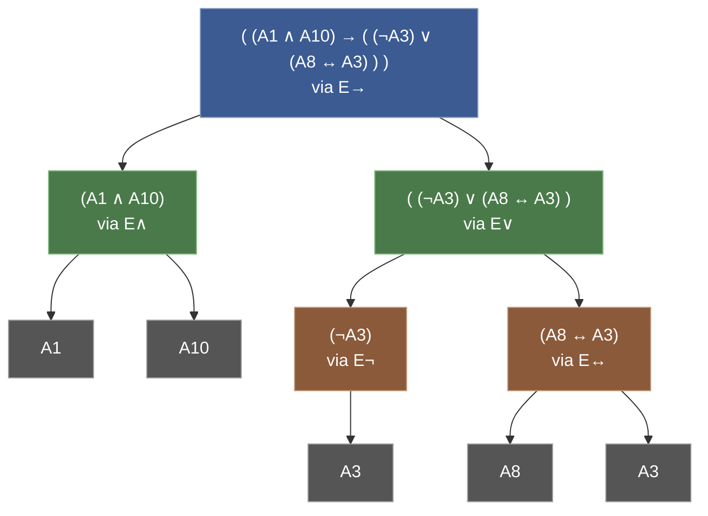
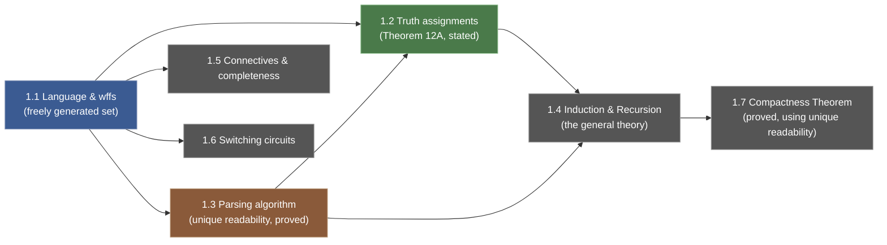

[[book-guidelines|↩ Back to guidelines]]

# Sentential (Propositional) Logic

## Why build a language before you build a logic

Enderton opens not with logic but with a complaint about English: it's ambiguous. "Neither did the sample contain chlorine, nor were traces of potassium observed" could plausibly mean $(\neg C) \wedge (\neg K)$ or $\neg(C \vee K)$ — and until you know which, you can't say whether the sentence is true or false in a given lab report. Natural language lets structure hide inside word order and idiom. A *formal* language refuses to hide it: every sentence's structure is visible in its symbols, and nothing about how to combine those symbols is left to intuition.

A formal language, in Enderton's setup, is exactly three things:

1. an **alphabet** — the finite (or countably infinite) stock of symbols you're allowed to use,
2. a **grammar** — the rules that say which finite strings of symbols count as "grammatically correct" (Enderton's *well-formed formulas*, or **wffs**),
3. a **translation scheme** — how those grammatical strings correspond to meaning (here: English sentences, later: truth values).

This is the same three-part shape as a programming language (lexical alphabet, syntax/parser, semantics), and Enderton says so explicitly, comparing sentential logic's wffs to assembly-language bit strings, `STEP#ADDIMAX, A`-style machine code, and even a snippet of C++ (`while(*s++);`). The point of the analogy: you can manipulate a wff — or compile a program — with zero regard for what it means, purely by the shape of its symbols. Meaning only enters at step 3. Everything sentential logic does in this chapter — parsing, computing truth values, proving compactness — is a fact about step 2's grammar first, and step 3's meaning only by derivation from that.

**What breaks without this discipline:** if wffs weren't syntactically self-describing, you couldn't define "the truth value of a formula" by looking only at its symbols — you'd need some outside oracle to tell you how it was built. The rest of this article is essentially the story of removing that oracle: making the *syntax alone* determine a unique construction history, so that *semantics can be defined by recursion on syntax* with no ambiguity left over.

## 1.1 The formal language: symbols, expressions, and wffs

### The alphabet

Enderton fixes an infinite alphabet (Table II, p. 14):

- two punctuation symbols, `(` and `)`;
- five **sentential connective symbols**: $\neg$ (negation), $\wedge$ (conjunction), $\vee$ (disjunction), $\rightarrow$ (conditional), $\leftrightarrow$ (biconditional);
- infinitely many **sentence symbols** $A_1, A_2, A_3, \ldots$.

The connectives plus parentheses are the **logical symbols** — their translation into English never changes. The sentence symbols are the **parameters** (or *nonlogical symbols*) — they stand for whatever atomic declarative sentence you want ("traces of potassium were observed," "the suspect is guilty," anything with a definite truth value). This logical/nonlogical split is worth internalizing early: it's the same split every formal system in the book will make, right up through first-order logic's predicate and function symbols in Chapter 2.

An **expression** is simply a finite sequence of symbols — concatenation of expressions $\alpha$ and $\beta$ is just $\alpha\beta$. Almost all expressions are nonsense, e.g. `((→ A₃`. The job of the grammar is to carve out the meaningful ones.

### wffs as a freely generated set

Enderton defines **well-formed formula** not by a BNF grammar (that comes later, informally, via the "omitting parentheses" conventions) but constructively: a wff is anything reachable from the sentence symbols by finitely many applications of five **formula-building operations**:

$$
\begin{aligned}
E_\neg(\alpha) &= (\neg\, \alpha) \\
E_\wedge(\alpha,\beta) &= (\alpha \wedge \beta) \\
E_\vee(\alpha,\beta) &= (\alpha \vee \beta) \\
E_\rightarrow(\alpha,\beta) &= (\alpha \rightarrow \beta) \\
E_\leftrightarrow(\alpha,\beta) &= (\alpha \leftrightarrow \beta)
\end{aligned}
$$

So: (a) every sentence symbol is a wff; (b) if $\alpha,\beta$ are wffs then so are $(\neg\alpha)$, $(\alpha\wedge\beta)$, $(\alpha\vee\beta)$, $(\alpha\rightarrow\beta)$, $(\alpha\leftrightarrow\beta)$; (c) nothing is a wff unless compelled to be by (a) and (b). Clause (c) is doing the real work — it's what rules out "and everything else, too" and makes this a genuine inductive (least-fixed-point) definition rather than an open-ended one.

Equivalently, a **construction sequence** for $\alpha$ is a finite list $\varepsilon_1,\ldots,\varepsilon_n = \alpha$ where each $\varepsilon_i$ is either a sentence symbol or the result of applying some $E_\square$ to earlier entries in the list. A wff is exactly an expression with a construction sequence ending in it — think of this as the "flattened," linear stand-in for the two-dimensional **ancestral tree** Enderton draws for an example like

$$((A_1 \wedge A_{10}) \rightarrow ((\neg A_3) \vee (A_8 \leftrightarrow A_3))).$$



Five sentence symbols occur (with $A_3$ reused), and five applications of formula-building operations construct the whole formula — this example is atypical only in using all five connectives at once.

**Rust grounding (primary).** "Freely generated from a base by some operations" is precisely what a recursive `enum` gives you for free:

```rust
enum Wff {
    Sym(u32),                  // a sentence symbol A_n  (the base case)
    Not(Box<Wff>),             // E¬
    And(Box<Wff>, Box<Wff>),   // E∧
    Or(Box<Wff>, Box<Wff>),    // E∨
    Cond(Box<Wff>, Box<Wff>),  // E→
    Iff(Box<Wff>, Box<Wff>),   // E↔
}
```

Every value of type `Wff` is, by construction, reachable from a `Sym` by finitely many constructor applications — Rust's `enum` gives you clause (c) ("nothing is a wff unless compelled to be") automatically, because there is no other way to build a `Wff` value. This is the AST your eventual compiler/verifier will walk, and everything below (the Induction Principle, unique readability, recursive truth evaluation) is really a theorem about *this exact data type*, proved before enums existed as a piece of engineering notation.

**Lean grounding (secondary, promoted here).** This is one of those sections the workbench's learning goals call out explicitly: a freely generated set *is* an inductive type, and Enderton spends the entire next two sections proving, by hand, facts that Lean's kernel gives you for free when you write

```lean
inductive Wff where
  | sym  : Nat → Wff
  | not  : Wff → Wff
  | and  : Wff → Wff → Wff
  | or   : Wff → Wff → Wff
  | cond : Wff → Wff → Wff
  | iff  : Wff → Wff → Wff
```

Lean's `inductive` mechanism bakes in two guarantees that Enderton has to *prove* for his string-based encoding: **no confusion** (the constructors `.not`, `.and`, `.or`, … produce syntactically disjoint results — you can never mistake an `and` for an `or`) and **no junk** (every `Wff` is built by finitely many constructor applications, nothing else). Enderton's Lemma 13A/13B and the parsing algorithm (Section 1.3, below) are exactly the work of *establishing* no-confusion and no-junk for the parenthesized-string encoding — work Lean's type theory discharges automatically because it represents formulas as an actual tree (a term), not as a flattened string that merely *looks* tree-shaped once parsed correctly.

### The Induction Principle

Because wffs are freely generated, you get a proof principle for free:

> **Induction Principle.** If $S$ is a set of wffs containing all the sentence symbols and closed under all five formula-building operations, then $S$ is the set of *all* wffs.

Enderton gives two proofs — one via "walk up the ancestral tree," one via "strong induction on position in the construction sequence" — because they're the same argument seen two ways, and both generalize (Section 1.4) to induction on *any* freely generated set, not just wffs. He immediately puts it to use to show **every wff has equally many left and right parentheses** (the set of "balanced" expressions contains the sentence symbols and is closed under all five operations, so by the Induction Principle it contains every wff) — a fact whose only job in this chapter is to be Lemma 13A in Section 1.3.

This is worth sitting with as a mechanism, not just a fact: **structural induction on an AST is the Induction Principle**, and it is the proof technique your verifier will use for *every* soundness argument once you're proving properties of typing judgments or Hoare triples over an AST — "closed under all the constructors, therefore true of everything" is the shape those proofs will take too.

## 1.2 Truth assignments: giving wffs a value without appealing to English

### The problem semantics has to solve

"$A_1$ follows from $A_1 \wedge A_2$" should be true no matter what English sentence $A_1$ stands for — but "no matter what translation into English" is hopelessly vague as a mathematical condition. Enderton's fix: replace "all possible English translations" with **all possible functions to $\{F, T\}$**. A **truth assignment** for a set $S$ of sentence symbols is simply a function

$$v : S \to \{F, T\}.$$

That's it — no meaning, just an assignment of one of two abstract points to each parameter. This is the whole trick of formal semantics in one move: quantifying over "every way the world could make the atomic sentences true or false" is intractable, but quantifying over "every function $S \to \{F,T\}$" is a completely well-defined mathematical operation.

### Extending $v$ to all of $S^\dagger$: Theorem 12A

Given $v$ on the sentence symbols in $S$, you want a unique **extension** $\bar v$ defined on every wff built from $S$ (Enderton writes this set as $S^\dagger$), satisfying:

$$
\begin{aligned}
0.\ & \bar v(A) = v(A) \text{ for } A \in S. \\
1.\ & \bar v((\neg\alpha)) = T \text{ iff } \bar v(\alpha) = F. \\
2.\ & \bar v((\alpha \wedge \beta)) = T \text{ iff } \bar v(\alpha) = T \text{ and } \bar v(\beta) = T. \\
3.\ & \bar v((\alpha \vee \beta)) = T \text{ iff } \bar v(\alpha) = T \text{ or } \bar v(\beta) = T. \\
4.\ & \bar v((\alpha \rightarrow \beta)) = F \text{ iff } \bar v(\alpha) = T \text{ and } \bar v(\beta) = F. \\
5.\ & \bar v((\alpha \leftrightarrow \beta)) = T \text{ iff } \bar v(\alpha) = \bar v(\beta).
\end{aligned}
$$

Note condition 4 carefully — it's the one place ordinary English intuition and the formal definition visibly diverge. $(\alpha \rightarrow \beta)$ is **vacuously true whenever $\alpha$ is false**: "if you're telling the truth, then I'm a monkey's uncle" comes out true the instant you're lying, with no causal claim intended. Enderton is explicit that this is a *choice* made for mathematical convenience, not a claim about ordinary usage.

**THEOREM 12A.** *For any truth assignment $v$ for a set $S$, there is a unique function $\bar v : S^\dagger \to \{F,T\}$ meeting conditions 0–5.*

Enderton states this here but *defers the proof* to Sections 1.3–1.4 — and flags exactly why it's nontrivial: $\bar v(\varphi)$ is defined by recursion, i.e., in terms of $\bar v$ applied to the (syntactically smaller) parts of $\varphi$. For that self-reference to be legitimate, you need to know two things about the underlying syntax: that every wff decomposes in **exactly one way** (otherwise $\bar v$ might get two different answers depending on which decomposition you used), and that the decomposition always proceeds to *strictly smaller* pieces (so the recursion terminates). The first of these is unique readability — the content of Section 1.3. The uniqueness half of Theorem 12A (Exercise 14) is comparatively easy and follows directly from the Induction Principle; it's *existence* that's hostage to unique readability.

**What breaks without unique readability:** if some wff had two different construction histories — say once as $(\alpha \wedge \beta)$ and once as $(\gamma \vee \delta)$ for unrelated $\alpha,\beta,\gamma,\delta$ — then "the" recursive definition of $\bar v$ would be asking two different questions of the same string, and there would be no guarantee the two answers agree. $\bar v$ (and hence "the truth value of a formula") would simply not be a well-defined function. This is exactly the ambiguity Enderton demonstrates with the unparenthesized string $A_1 \vee A_2 \wedge A_3$: read as $(A_1 \vee A_2) \wedge A_3$ vs. $A_1 \vee (A_2 \wedge A_3)$, the two readings can disagree (e.g. $v(A_1){=}T$, $v(A_3){=}F$).

### Tautological implication, tautology, tautological equivalence

With $\bar v$ in hand (writing just $v$ for it henceforth, as Enderton does after this point), $v$ **satisfies** $\varphi$ iff $v(\varphi) = T$. Then for a set of wffs $\Gamma$ (hypotheses) and a wff $\tau$ (candidate conclusion):

$$\Gamma \models \tau \iff \text{every truth assignment satisfying every member of } \Gamma \text{ also satisfies } \tau.$$

This is **tautological implication**. Two edge cases matter:

- $\Gamma = \varnothing$: vacuously, every assignment satisfies every member of $\varnothing$, so $\varnothing \models \tau$ reduces to *every* assignment satisfies $\tau$ — this case is called $\tau$ being a **tautology**, written $\models \tau$.
- No assignment satisfies every member of $\Gamma$ (e.g. $\Gamma = \{A, \neg A\}$): then $\Gamma \models \tau$ *for every* $\tau$, vacuously — $\{A, \neg A\} \models B$ for a completely unrelated $B$. There's no deep principle here, just the shape of the definition ("ex falso" is a corollary of "for all," not a separate axiom).

If $\sigma \models \tau$ and $\tau \models \sigma$ both hold, $\sigma$ and $\tau$ are **tautologically equivalent**, $\sigma \mathbin{|\!=\!|} \tau$ — e.g. the two Section 1.0 translations $\neg(C \vee K)$ and $(\neg C) \wedge (\neg K)$ are tautologically equivalent (this is De Morgan's law making its first appearance).

Enderton also states, without proof (it's proved in Section 1.7, and is Topic 6 in this book's own list), the **Compactness Theorem**: if every finite subset of an infinite $\Gamma$ is satisfiable, then $\Gamma$ itself is satisfiable. It's placed here purely as a landmark — "here is where all of this is going" — not yet argued.

### Truth tables as a decision procedure, and its cost

Because there are only $2^n$ truth assignments for $n$ sentence symbols, you can *always* settle $\{\sigma_1,\ldots,\sigma_k\} \models \tau$ by brute enumeration: build the table, compute every column, check that every row satisfying all the $\sigma_i$ also satisfies $\tau$. This is a genuine decision procedure — total, terminating, correct — and Enderton works two examples ($\neg(A \wedge B) \models (\neg A) \vee (\neg B)$, then the tautology $(A \vee (B \wedge C)) \leftrightarrow ((A \vee B) \wedge (A \vee C))$), showing along the way how case-splitting on partial assignments (if one row already forces $T$ regardless of the rest, skip the rest) shrinks the table from 8 or 16 lines to 2–3.

Then comes the sting: full truth tables cost $2^n$ rows, and $2^n$ is not a curiosity of small examples — it is *actually infeasible*. Enderton runs the numbers: even at a million rows per second, $n=80$ sentence symbols requires roughly $2^{80}$ microseconds $\approx 38$ billion years, longer than the age of the universe. This lands directly on the **P vs. NP problem**: is there *any* algorithm — not necessarily truth tables, any algorithm whatsoever — that decides tautologyhood of an $n$-symbol wff in time polynomial in $n$? Nobody knows, though the conjectured answer is no. (Determining tautologyhood is the complement of SAT, so this is literally the P vs. NP question, stated in its most elementary possible form.) Note carefully what this section is *not* claiming: it's not that truth tables are a bad algorithm that a cleverer one could always beat asymptotically — it's that we don't know whether *any* algorithm can beat exponential blowup on the worst case, and this is among the most consequential open problems in mathematics and computer science.

**Rust grounding (primary) — the decision procedure, mechanically.** A brute-force tautology checker is a direct, faithful transcription of "enumerate all $2^n$ assignments":

```rust
fn eval(w: &Wff, v: &std::collections::HashMap<u32, bool>) -> bool {
    match w {
        Wff::Sym(n)      => v[n],
        Wff::Not(a)      => !eval(a, v),
        Wff::And(a, b)   => eval(a, v) && eval(b, v),
        Wff::Or(a, b)    => eval(a, v) || eval(b, v),
        Wff::Cond(a, b)  => !eval(a, v) || eval(b, v),   // vacuously true if a is false
        Wff::Iff(a, b)   => eval(a, v) == eval(b, v),
    }
}

fn is_tautology(w: &Wff, symbols: &[u32]) -> bool {
    let n = symbols.len();
    (0..1u64 << n).all(|bits| {
        let v = symbols.iter().enumerate()
            .map(|(i, &s)| (s, (bits >> i) & 1 == 1))
            .collect();
        eval(w, &v)
    })
}
```

`eval` *is* $\bar v$ — one match arm per formula-building operation, structurally recursive, total because `Wff` has no infinite values. `is_tautology`'s `1u64 << n` is the $2^n$ from the book made literal: this function is correct and it will never finish on realistic verifier-sized formulas. That gap between "correct" and "usable" is precisely the P-vs-NP content of this section, and it is exactly the gap your planned automated theorem prover has to find a way around (via clause learning, decision heuristics, incompleteness on hard instances, or restricting to tractable fragments) rather than defeat outright — nobody has defeated it outright.

**Python grounding (tertiary) — same idea, five lines, for a quick sketch:**

```python
from itertools import product

def is_tautology(evaluate, symbols):
    return all(evaluate(dict(zip(symbols, bits))) for bits in product([False, True], repeat=len(symbols)))
```

### A selected list of tautologies

Enderton closes 1.2 with a reference list — associativity/commutativity of $\wedge, \vee, \leftrightarrow$; the distributive laws; double negation $\neg\neg A \leftrightarrow A$; De Morgan's laws; excluded middle $A \vee \neg A$; contradiction $\neg(A \wedge \neg A)$; contraposition $(A \to B) \leftrightarrow (\neg B \to \neg A)$; and exportation $((A \wedge B) \to C) \leftrightarrow (A \to (B \to C))$. These aren't proved individually here (each is a one-line truth-table check, left to the exercises); they're catalogued because Chapter 1.5 will need a stock of known tautologies to establish which connective sets are *complete*.

## 1.3 The parsing algorithm: proving there's no ambiguity

### Why parentheses have to earn their keep

Section 1.2's Theorem 12A was left with a hole exactly the size of "does every wff decompose in only one way?" Enderton opens 1.3 by showing what happens if you don't force that: strip the parentheses from $((A_1 \vee A_2) \wedge A_3)$ and $(A_1 \vee (A_2 \wedge A_3))$ and both become the bare string $A_1 \vee A_2 \wedge A_3$ — genuinely ambiguous, with no way to recover which reading was intended, and (as shown above) the two readings can disagree on truth value. The parenthesized notation is designed precisely to make this collision impossible; Section 1.3's job is to *prove* it succeeds.

### Two lemmas, then an algorithm

**Lemma 13A** (proved already, in 1.1, as the running example of the Induction Principle): every wff has equally many left and right parentheses.

**Lemma 13B**: *any proper initial segment of a wff has an excess of left parentheses* — hence no proper initial segment of a wff is itself a wff. Proved again by the Induction Principle: for the base case (a bare sentence symbol) there are no proper initial segments, vacuously true; for the inductive step (say $E_\wedge$), Enderton enumerates the six possible proper initial segments of $(\alpha \wedge \beta)$ — `(`, `(α₀` for a proper initial segment $\alpha_0$ of $\alpha$, `(α`, `(α∧`, `(α ∧ β₀`, `(α ∧ β` — and checks each is left-parenthesis-heavy, using the inductive hypothesis on $\alpha$ and $\beta$ themselves in the two nontrivial cases.

These two lemmas are exactly what's needed to make the **parsing algorithm** deterministic. Given an expression, grow a tree downward from it:

1. If every minimal (bottom) vertex is a bare sentence symbol, stop — success, and the tree is built. Otherwise pick a minimal vertex whose expression isn't a sentence symbol.
2. Its first symbol must be `(` (else reject: not a wff). If the second symbol is `¬`, go to step 4.
3. Scan left-to-right for the shortest balanced-parenthesis prefix $\alpha$ after the opening `(`. The next symbol must be a binary connective (the **principal connective**). The remainder must be $\beta)$. Attach $\alpha$, $\beta$ as the two children. Return to step 1.
4. The first two symbols are `(¬`; the remainder must be $\beta)$. Attach $\beta$ as the single child. Return to step 1.

**Why this can't go wrong, and why that matters.** Enderton's correctness argument leans on the two lemmas directly: in step 3, you couldn't take *less* than $\alpha$ for the left constituent (Lemma 13A — anything shorter would be parenthesis-unbalanced), and you couldn't take *more* than $\alpha$ either (Lemma 13B — any longer balanced prefix would make $\alpha$ itself a wff sitting as a proper initial segment of another wff, which 13B forbids). So $\alpha$ — and hence the principal connective right after it — is *forced*. Every step of the algorithm has exactly one legal continuation. That is what "unique readability" means concretely: not just that a construction tree exists, but that this deterministic procedure recovers *the* tree, and no other tree could have produced the same string.

This closes the loop opened in 1.2: Theorem 12A's existence claim for $\bar v$ now has its proof. Given any wff $\varphi$, run the parsing algorithm to get *the* unique tree; compute $\bar v$ bottom-up along that tree using conditions 1–5; there is no other tree that could have produced a conflicting answer. (Uniqueness of $\bar v$, recall, was the easier half, from Exercise 14 of 1.2 via the Induction Principle directly.)

**Rust grounding (primary) — the algorithm as an actual parser.** Steps 2–4 are a textbook recursive-descent parser, and writing it makes "unique readability" tangible: at every recursive call there is exactly one legal way to consume the next tokens, so there's no backtracking anywhere in this grammar.

```rust
fn parse(tokens: &[Tok]) -> Result<(Wff, &[Tok]), ParseError> {
    match tokens {
        [Tok::Sym(n), rest @ ..] => Ok((Wff::Sym(*n), rest)),
        [Tok::LParen, Tok::Not, rest @ ..] => {
            let (inner, rest) = parse(rest)?;                 // step 4
            match rest {
                [Tok::RParen, rest @ ..] => Ok((Wff::Not(Box::new(inner)), rest)),
                _ => Err(ParseError::MissingRParen),
            }
        }
        [Tok::LParen, rest @ ..] => {
            let (lhs, rest) = parse(rest)?;                    // step 3: scan the balanced α
            let (op, rest) = take_connective(rest)?;           // the forced principal connective
            let (rhs, rest) = parse(rest)?;
            match rest {
                [Tok::RParen, rest @ ..] => Ok((op(Box::new(lhs), Box::new(rhs)), rest)),
                _ => Err(ParseError::MissingRParen),
            }
        }
        _ => Err(ParseError::NotAWff),
    }
}
```

This is not an analogy — it *is* the algorithm Enderton describes, with the tree built by ordinary function-call recursion instead of drawn by hand, and Lemmas 13A/13B are exactly the facts that guarantee this function never needs to backtrack or guess.

**Lean grounding (secondary).** This is the concrete payoff of "no confusion, no junk" from Section 1.1: because `Wff` in Lean is an honest inductive type, a Lean *parser* only ever needs to worry about turning a string into a `Wff` term — once you have a `Wff` value, pattern matching on it (`match w with | .and a b => ...`) is unconditionally exhaustive and unambiguous, by construction of the type. Enderton has to do the work of Lemmas 13A/13B by hand because his wffs are strings that merely *represent* trees; Lean's kernel gets unique readability for free because it stores the tree, not a re-parseable serialization of it. If you ever need to serialize your own verifier's ASTs to text (for a REPL, a trace log, a proof certificate), Lemmas 13A/13B are the precise conditions your textual encoding needs to satisfy for the round-trip parse to be unambiguous — this is a real, recurring engineering constraint, not just a historical curiosity of 1970s logic textbooks.

### Polish notation and the parenthesis-omitting conventions

Enderton notes in passing that ambiguity can be defeated *without* parentheses at all, via **Polish notation**: $D_\wedge(\alpha,\beta) = {\wedge}\alpha\beta$ instead of $(\alpha \wedge \beta)$, prefixing the connective instead of infixing it. A full unique-readability proof for Polish notation is deferred to Section 2.3, but the idea — that prefix notation with fixed arities is self-delimiting — is exactly why later compiler pipelines convert to Polish (prefix) or reverse-Polish (postfix) form before code generation: no parentheses are needed once every operator's arity is fixed and known in advance.

Finally, having *proved* unique readability, Enderton immediately starts relaxing notation: drop outermost parentheses; let $\neg$ bind as tightly as possible ($\neg A \wedge B$ is $(\neg A) \wedge B$, not $\neg(A \wedge B)$); let $\wedge,\vee$ bind tighter than $\to,\leftrightarrow$; and group repeated same-connective chains to the right ($\alpha \to \beta \to \gamma$ is $\alpha \to (\beta \to \gamma)$). This is only safe to do *now* — a shorthand convention layered on top of a grammar already proved unambiguous, not a replacement for the proof.

## Where this leads



Sections 1.0–1.3 are the load-bearing foundation for everything else in the book, not just this chapter: Section 1.4 lifts the "freely generated set + Induction Principle" story from wffs specifically to *any* base-and-operations construction, proving the general Recursion Theorem that Theorem 12A was really an instance of; Section 1.7's Compactness Theorem proof leans directly on unique readability (it needs "every wff decides some truth assignment or its negation, unambiguously") to build a maximal finitely satisfiable set into an actual truth assignment.

For the standing project: this is the cleanest possible first example of the pattern that recurs at every later layer — **freely generated syntax + structural recursion + a proof that the recursion is well-defined** — which is exactly the shape a type checker's `eval`/`typecheck` function and a proof checker's soundness argument both take. Enderton proving unique readability by hand, the long way, for parenthesized strings is the same problem Lean's `inductive` mechanism solves once, at the kernel level, for every inductive type you ever define — worth remembering the next time an `inductive` block or a recursive `match` in Rust feels like free machinery: Section 1.3 is what you'd have to prove yourself if it weren't.
