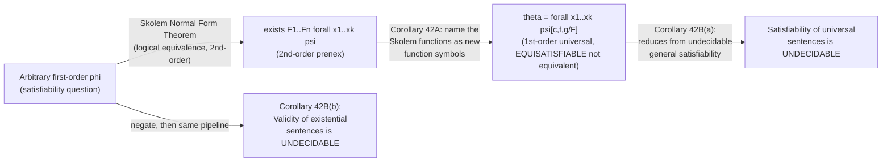

# Skolem Functions and Normal Forms

[[book-guidelines|↩ Back to guidelines]]

## The problem: "there exists" is not something a machine can search for

Suppose you have the first-order formula $\forall x \exists y\, \varphi(x, y)$ — "for every $x$ there is some $y$ such that $\varphi$ holds of $x$ and $y$." Semantically this is perfectly clear. Operationally it's a nightmare. If you're a proof-search procedure — a human doing a derivation, or a program trying to check satisfiability — an existential quantifier is a promise with no address. It tells you a witness exists somewhere in the universe, but it doesn't tell you *which* one, or how to compute it from the surrounding context. Every time the existential recurs inside the scope of a universal, the witness is allowed to depend on the universally-quantified variable in an unconstrained way — you can't just pick one $y$ up front, you need a whole *rule* for producing $y$ from $x$.

This is exactly the gap between an existence proof and a constructive one, and it's the same gap a compiler engineer runs into with closures over free variables, or an elaborator runs into with unresolved metavariables. The fix in all three settings is the same move: stop asserting that a value exists, and instead *name a function* that produces it. That's what a Skolem function is. Enderton's Section 4.2 formalizes this move, proves it's always available (the Skolem Normal Form Theorem), shows exactly what you gain and lose semantically when you apply it (Corollary 42A), and then cashes the whole apparatus in for a genuine undecidability result about first-order logic (Corollary 42B).

**What breaks without this.** Without Skolemization, a formula like $\forall x_1 \exists y_1 \forall x_2 \exists y_2\, \psi$ has quantifier alternations baked into its syntax, and every proof procedure that wants to search for a model or a refutation has to deal with those alternations directly — case-splitting on existentials, tracking which witnesses depend on which universals, re-deriving the dependency structure by hand every time. Modern SAT/SMT-based provers and resolution theorem provers don't do that. They work over flat, quantifier-free (or purely universal) clause sets. Skolemization is the preprocessing pass that gets you there — it's not optional machinery, it's the reason clausal proof search is possible at all.

## Skolem functions in a fixed structure

Enderton starts concretely, in a single structure, before making any claim about logical equivalence in general. Take the simplest quantifier pattern:

$$\forall x \exists y\, \varphi(x, y) \;\;|\!=\!|\;\; \exists F \, \forall x\, \varphi(x, Fx)$$

Read the double turnstile ($|\!=\!|$) as "logically equivalent." $F$ here is a **function variable** — second-order logic lets you quantify over functions on the universe, not just over individuals, and that's the extra expressive room this whole chapter is exploiting.

The "$=\!|$" direction (right implies left) is immediate: if some function $F$ makes $\varphi(x, Fx)$ true for every $x$, then trivially for every $x$ there's *some* $y$ (namely $Fx$) making $\varphi(x,y)$ true.

The "$|=$" direction is the interesting one, and it's where you should slow down, because this is where the axiom of choice enters. Fix a structure $\mathfrak{A}$ and an assignment $s$ that satisfies $\forall x \exists y\, \varphi(x,y)$. For every element $a$ in the universe $|\mathfrak{A}|$, we know *some* $b$ makes $\varphi(a,b)$ true — but the formula gives us no algorithm for finding $b$ from $a$. Enderton's move: for each $a$, just *choose* one witnessing $b$, and define $f(a) = b$. Doing this simultaneously for every $a$ in the universe is exactly an application of the axiom of choice (you're choosing one element from each of possibly infinitely many nonempty "witness sets"). Once you've made that choice, $f$ is a genuine function on $|\mathfrak{A}|$, and by construction $\mathfrak{A} \models \forall x\, \varphi(x, Fx)$ under the assignment sending $F$ to $f$.

> **Definition (Skolem function).** This function $f$ is called a *Skolem function* for the formula $\forall x \exists y\, \varphi$ in the structure $\mathfrak{A}$.

Notice the phrase "in the structure $\mathfrak{A}$" — a Skolem function is relative to a specific model. It's not part of the formula's syntax; it's a semantic gadget that happens to exist in every structure satisfying the universal-existential formula, by choice.

**Grounding (Rust — primary).** This is precisely what you do when you compile a closure that captures a computation depending on an outer variable. Think of $\varphi(x,y)$ as a spec that a value $y$ must satisfy relative to $x$, and think of "there exists $y$" as an under-specified interface:

```rust
// Before: an existence claim with no computational content.
// "For every x, there exists a y such that phi(x, y) holds."
trait WitnessExists<X> {
    fn holds_for_some_y(x: X) -> bool; // we can *check* phi(x, y) for a given y,
                                        // but nothing here *produces* a y.
}

// After Skolemization: replace the existence claim with an explicit
// witness-producing function. This is exactly closure conversion —
// turning an unresolved "there's a value out there" into a concrete
// `Fn(X) -> Y` that you can actually call during proof search.
fn skolem_function<X, Y>(phi: impl Fn(&X, &Y) -> bool, universe: impl Fn(&X) -> Y) -> impl Fn(X) -> Y {
    // `universe` stands in for "the choice function guaranteed by AC";
    // in a finite/decidable setting this would be a real search.
    move |x: X| universe(&x)
}
```

The type signature change is the whole story: `exists y. phi(x, y)` becomes `Fn(x: X) -> Y` plus a proof obligation that the returned `y` satisfies `phi`. That's defunctionalization of an existential — you're not proving a value exists anymore, you're handing over the function that builds it. A theorem prover that has done this can treat "does a satisfying $y$ exist" as "call the function and check," which is mechanical in a way "search all of $|\mathfrak{A}|$" is not.

**Grounding (Lean — secondary, and worth naming explicitly).** Lean's own kernel does exactly this move when you write `Exists.choose` on a proof of `∃ y, φ y`. Given `h : ∃ y, φ y`, `h.choose` is a *term* of type `Y` — a genuine value, extracted via `Classical.choice`, Lean's axiom-of-choice primitive — and `h.choose_spec` is the proof that this particular value satisfies `φ`. That is the Skolem function construction, specialized to a single existential with no surrounding universal to range over. When Enderton's construction ranges the choice over all $x$ in the universe simultaneously, that's the same `Classical.choice` idea applied pointwise, bundled into a genuine function `Fx`. If you're building a metavariable-unification elaborator, file this away: introducing a metavariable `?y` for an unresolved existential and deferring its resolution to later unification is structurally identical to introducing a Skolem function — both are "postpone the witness, but keep enough structure around (the dependency on `x`, or on the ambient context) to resolve it later." The difference between a metavariable and a full Skolem function is exactly whether the witness is allowed to depend on outer universally-bound variables — a plain metavariable is a Skolem function of zero arguments, i.e. a Skolem *constant*.

## The Skolem Normal Form Theorem

The single-quantifier case generalizes completely: you can pull *every* existential individual quantifier out to the front, past all the universals, by turning it into an existential function quantifier and threading the newly-available universal variables through as its arguments.

Enderton works this through with a genuinely alternating example:

$$\exists y_1 \forall x_1 \exists y_2 \forall x_2 \forall x_3 \exists y_3\, \psi(y_1, y_2, y_3)$$

The leading $\exists y_1$ is already in the right place — leave it. What remains, $\forall x_1 \exists y_2 \forall x_2 \forall x_3 \exists y_3\, \psi$, is an instance of the single-quantifier pattern above (with $\varphi(x_1, y_2) := \forall x_2 \forall x_3 \exists y_3\, \psi(y_1, y_2, y_3)$), so it's equivalent to

$$\exists F_2\, \forall x_1 \forall x_2 \forall x_3 \exists y_3\, \psi(y_1, F_2 x_1, y_3).$$

Now $\exists y_1 \exists F_2$ are both out front; what's left, $\forall x_1 \forall x_2 \forall x_3 \exists y_3\, \psi(y_1, F_2 x_1, y_3)$, is again an instance of the pattern (this time the "$\forall x$" is really three universals bundled together), giving a *three-place* function variable $F_3$ — because by the time you reach $y_3$, three universal variables ($x_1, x_2, x_3$) are in scope and the witness is allowed to depend on all of them:

$$\exists F_3\, \forall x_1 \forall x_2 \forall x_3\, \psi(y_1, F_2 x_1, F_3 x_1 x_2 x_3).$$

Chaining these steps gives the fully pulled-out form:

$$\exists y_1 \exists F_2 \exists F_3\, \forall x_1 \forall x_2 \forall x_3\, \psi(y_1, F_2 x_1, F_3 x_1 x_2 x_3).$$

That's a **prenex** formula (all quantifiers out front) whose quantifier prefix is: existentials first (individual and function), then universals (individual only), then a quantifier-free matrix. Enderton states this as a general theorem, proved by exactly this kind of induction on quantifier prefixes:

> **Skolem Normal Form Theorem.** For any first-order formula, we can find a logically equivalent second-order formula consisting of:
> (a) first a string (possibly empty) of existential individual and function quantifiers, followed by
> (b) a string (possibly empty) of universal individual quantifiers, followed by
> (c) a quantifier-free formula.

Note the arity discipline: each Skolem function's arity equals exactly the number of universal variables governing it at the point its existential was eliminated — the third function $F_3$ takes three arguments precisely because $x_1, x_2, x_3$ are all in scope by the time $y_3$'s existential is reached. Get the arity wrong (e.g. forget a dependency, or add a spurious one) and the equivalence breaks. This is worth internalizing as a discipline, not just a bookkeeping detail — it's the same discipline as computing the correct free-variable set when you closure-convert a nested lambda, or the correct local context when you generalize a metavariable in an elaborator.

**What breaks without this.** If you tried to pull existentials to the front *without* threading the intervening universal variables as arguments — i.e., if you replaced each $y_i$ with a plain constant instead of a function of the governing $x$'s — you would be claiming that a *single* witness works for *every* value of $x$, which is a strictly stronger (and usually false) statement. The whole reason $F_2$, $F_3$ need to be *functions* rather than *constants* is to preserve the "witness may depend on the universal variables that logically precede it" content of the original formula. This is the second-order analogue of not being allowed to hoist a let-binding out past the loop variable it depends on.

## Skolemization and equisatisfiability — logically equivalent is not the same as equally satisfiable

This is the subtlety the whole chapter has been building toward, and it's genuinely easy to misstate, so slow down here.

The Skolem Normal Form Theorem gives you a **second-order** formula that is *logically equivalent* to the original first-order one — same truth value in every structure, full stop. But second-order formulas quantify over functions, and function quantifiers are not something a first-order proof procedure can search over directly (this is the whole reason Chapter 4 opened by showing second-order logic loses compactness and effective enumerability). So the Skolem normal form by itself doesn't yet give you something a first-order decision procedure can chew on.

Corollary 42A performs one more move: instead of *quantifying* over the Skolem functions, just **name them** as brand-new function symbols in an expanded first-order language.

> **Corollary 42A.** For any first-order $\varphi$, we can find a universal formula $\theta$ in an expanded language containing function symbols, such that $\varphi$ is satisfiable iff $\theta$ is satisfiable.

Concretely, continuing the running example: replace the second-order formula $\exists y_1 \exists F_2 \exists F_3\, \forall x_1 \forall x_2 \forall x_3\, \psi(y_1, F_2 x_1, F_3 x_1 x_2 x_3)$ by the purely first-order

$$\theta \;:=\; \forall x_1 \forall x_2 \forall x_3\, \psi(c, f x_1, g x_1 x_2 x_3),$$

where $c$, $f$, $g$ are brand-new function symbols of arity $0$, $1$, $3$ respectively, added to the language. $\theta$ is a **universal** ($\forall_1$) sentence — all its quantifiers are universal, and it's over a first-order language, so it's the kind of object a resolution prover or a Herbrand-style search procedure can actually operate on.

But — and this is the point Enderton stops to flag explicitly — **$\theta$ is not logically equivalent to $\varphi$ in general.** What holds is only:

- $\theta \models \varphi$ (in the expanded language), and
- any model of $\varphi$ can be *expanded* (by choosing correct interpretations for $c$, $f$, $g$ — exactly the Skolem-function-in-a-structure construction from the first section) into a model of $\theta$.

Together these two facts say $\varphi$ and $\theta$ are **equisatisfiable**: one is satisfiable if and only if the other is, even though they are not logically equivalent as formulas (in general $\theta$ is strictly stronger — it commits to *specific* named functions, whereas $\varphi$ only asserted that suitable witnesses exist somewhere). This is a real distinction with real content, not a technicality: $\theta$ might fail to be true in some model of $\varphi$ where the "natural" interpretation of $c$, $f$, $g$ isn't the one satisfying $\theta$ — what's guaranteed is only that *some* interpretation of the new symbols works, in any model where $\varphi$ already held.

**Grounding.** This equisatisfiable-but-not-equivalent distinction is exactly the distinction between a program's specification and one particular implementation satisfying it. `∃ y. φ(x, y)` says an implementation exists; `f x` (a concrete Skolem function) is one specific implementation. The specification and the implementation are not the same proposition — the implementation is *strictly more informative* — but for the purpose of asking "is this satisfiable / does an implementation exist at all," checking the implementation suffices and is far more tractable than reasoning about the specification directly. Any clausal theorem-prover front end (Prolog's clausification, resolution provers, SMT preprocessing pipelines converting to CNF) performs exactly this Skolemization step before doing any real search, precisely because it converts an unbounded-search existence question into a first-order universal-formula satisfiability question — and universal formulas, unlike arbitrary formulas, expand into a well-defined (if infinite) set of ground instances that sentential/propositional logic can attack. That's not incidental to this section either: Enderton's own next subsection, "Herbrand Expansions," does exactly this — it shows that satisfiability of a universal formula reduces further to propositional satisfiability of its ground instances over the *Herbrand universe* (the set of all variable-free terms built from the new Skolem function symbols), via Herbrand's Theorem. That's the direct ancestor of every ground/instantiation-based approach used by modern SAT-based automated theorem provers, and it's exactly the kind of "how you'd implement it" mechanism worth keeping in view if you're embedding a theorem prover in a Rust verifier: Skolemize, generate ground instances from the Herbrand universe, hand the propositional skeleton to a SAT solver, and a satisfying assignment (or its absence) answers the original first-order question.

**What breaks without this.** If you conflated "equisatisfiable" with "logically equivalent" here, you'd be tempted to Skolemize inside a *validity* argument the same way you Skolemize inside a *satisfiability* argument, and get a wrong answer — Skolemizing a formula's existentials is sound for satisfiability-preservation but the corresponding move for a formula you're trying to prove *valid* is to Skolemize its universals (turning universally-quantified individual variables into fresh Herbrand constants, not functions) — genuinely the dual construction, applied to $\neg \varphi$ in Corollary 42B below. Mixing these up is a classic bug in home-grown clausifiers: Skolemizing on the wrong side of a negation silently changes what you're proving.

## The undecidability payoff

Having reduced arbitrary first-order satisfiability to universal-formula satisfiability, Enderton immediately reduces arbitrary first-order *validity* to existential-formula validity, by applying Corollary 42A to $\neg\varphi$ (satisfiability of $\neg\varphi$'s Skolemization $\iff$ $\neg\varphi$ satisfiable $\iff$ $\varphi$ not valid; and negating a universal formula's Skolemization gives an existential one). Then:

> **Corollary 42B.** Consider a recursively numbered language with a two-place predicate symbol and infinitely many $k$-place function symbols for each $k \geq 0$.
> (a) The set of Gödel numbers of satisfiable universal (first-order) sentences is not recursive.
> (b) The set of Gödel numbers of valid existential (first-order) sentences is not recursive.

The proof of (b) is short precisely because all the real work was already done: given any sentence $\sigma$, apply Corollary 42A to $\neg\sigma$ to *effectively* (i.e., by a genuine algorithm, not just an existence claim) produce an existential sentence that is valid iff $\sigma$ is valid. If deciding validity of existential sentences were decidable, this reduction would hand you a decision procedure for *arbitrary* first-order validity — contradicting Church's theorem (the undecidability of first-order validity in general, from Chapter 3). So no such decision procedure can exist.

This is a genuinely satisfying capstone to the whole apparatus: Skolemization started as a proof-theoretic convenience (turn existentials into functions so proof search is mechanical) and ends up being precise enough, as a *reduction*, to transport an undecidability result from the general case down to two much narrower-looking syntactic fragments — purely universal sentences, and purely existential sentences. Enderton notes the result is tight (Exercise 3): $\exists_1$ satisfiability and $\forall_1$ validity — the *other* two combinations — are both decidable, so the asymmetry here (universal-satisfiability and existential-validity are the hard ones) is exactly dual to Skolemization's own asymmetry (existentials get Skolemized away for satisfiability; universals get Skolemized away, via negation, for validity).



## Where this leads

Inside the book, this section is the hinge between two halves of Chapter 4. Everything before it (Section 4.1) showed absolute second-order semantics is *expressive* — categorical, quantifying over functions and predicates directly — but *badly behaved* metatheoretically (no compactness, no Löwenheim–Skolem, non-enumerable validity). Skolemization is the tool that lets you extract exactly the useful part of that extra expressiveness (a controlled, syntactically restricted use of function quantifiers) and cash it back in for genuine first-order results — undecidability chief among them, but also (via the Löwenheim–Skolem exercises in this section, and via Herbrand's theorem) alternative, deductive-calculus-free proofs of compactness and enumerability for first-order logic itself, closing a loop back to Section 2.5. The next section, Many-Sorted Logic (4.3), takes the opposite tack: instead of restricting second-order quantification the way Skolemization does, it *simulates* full second-order quantification inside many-sorted first-order logic, recovering compactness and Löwenheim–Skolem generally at the cost of full categoricity — the topic that closes out the book's treatment of second-order logic.

For the two standing projects this vault is tracking: this section is close to load-bearing for the **Rust theorem-prover/verifier**. Skolemization-then-clausification-then-ground-instantiation (Herbrand's theorem, sketched immediately after Corollary 42B in the source text) is *literally* the CNF/clausal preprocessing pipeline that sits in front of any resolution or SAT-based prover you'd embed in a verifier — this is not an analogy, it's the actual algorithm. And for the **Lean-style elaborator**: the equisatisfiable-not-equivalent distinction between a formula and its Skolemization is the same distinction your elaborator will need between a proposition with an unresolved existential and a term with a metavariable standing in for the witness — a Skolem function of the right arity, resolved later by unification against the surrounding context, is precisely what a dependent metavariable *is*.
