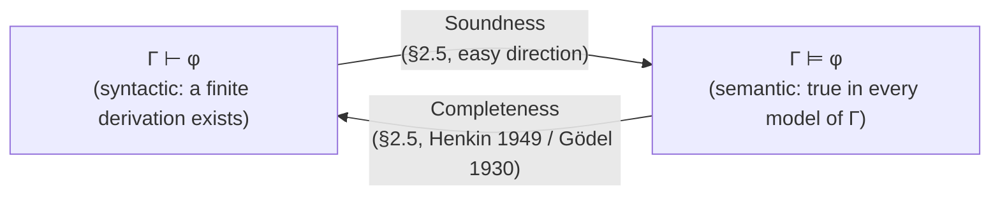
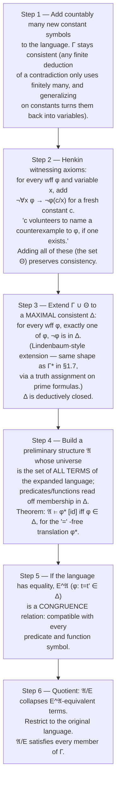

# Soundness and Completeness

[[book-guidelines|↩ Back to guidelines]]

## Why this pair of theorems is the whole point

Every earlier section in this chapter was building toward exactly one question. Section 2.4 handed you a deductive calculus: six groups of logical axioms $\Lambda$, one rule of inference (modus ponens), and a syntactic relation $\Gamma \vdash \varphi$ — "$\varphi$ has a finite derivation from $\Gamma$ using only these axioms and this rule." Section 2.2 handed you an entirely separate, semantic relation $\Gamma \models \varphi$ — "$\varphi$ is true in every structure that satisfies $\Gamma$." Nothing forced these two relations to agree. You could design a deductive calculus that proves nonsense (derives falsehoods from true premises), or one that's semantically safe but too weak to prove everything that's actually true. Enderton says as much explicitly at the top of §2.5: the choice of $\Lambda$ was "somewhat arbitrary" — what matters is that *some* choice makes $\vdash$ and $\models$ coincide.

That coincidence is not a formality. It is the entire justification for treating "search for a derivation" as a legitimate way to answer "is this true." If you're building anything that checks proofs mechanically — a Hoare-logic verifier, a kernel that type-checks proof terms, an automated theorem prover — you are relying on exactly this pair of facts:

- **Soundness** ($\Gamma \vdash \varphi \Rightarrow \Gamma \models \varphi$): if your checker accepts a derivation, the conclusion is *actually true* in every model of the premises. Without this, your verifier could rubber-stamp broken specifications.
- **Completeness** ($\Gamma \models \varphi \Rightarrow \Gamma \vdash \varphi$): if a conclusion is *actually true* in every model of the premises, a derivation exists — your calculus isn't too weak to find it. Without this, your prover could loop forever searching for a proof of something true but underivable, and you'd have no way to tell "not yet found" from "unfindable."

Soundness is the cheap direction, proved by a short induction. Completeness is the deep one — Gödel's 1930 result — and its proof (due to Leon Henkin, 1949) is a machine for *building a model out of syntax*, one that will resurface almost everywhere in the rest of the book. This article covers both theorems and their immediate corollaries: compactness, the Löwenheim–Skolem theorem, and the enumerability of validities.



## The Soundness Theorem

> **SOUNDNESS THEOREM.** If $\Gamma \vdash \varphi$, then $\Gamma \models \varphi$.

The proof is a structural induction on the deduction itself — the finite sequence of formulas witnessing $\Gamma \vdash \varphi$, where each entry is either a member of $\Gamma$, a logical axiom, or follows from two earlier entries by modus ponens. Three cases:

1. $\varphi$ is a logical axiom $\Rightarrow$ $\models \varphi$ (by **Lemma 25A**, below) $\Rightarrow$ *a fortiori* $\Gamma \models \varphi$.
2. $\varphi \in \Gamma$ $\Rightarrow$ trivially $\Gamma \models \varphi$.
3. $\varphi$ comes from $\psi$ and $\psi \to \varphi$ by modus ponens, and by the inductive hypothesis $\Gamma \models \psi$ and $\Gamma \models (\psi \to \varphi)$ $\Rightarrow$ $\Gamma \models \varphi$ immediately, since logical implication is closed under modus ponens at the semantic level too.

So the whole theorem collapses to one lemma:

> **LEMMA 25A.** Every logical axiom is valid (true in every structure, under every variable assignment).

Enderton checks this group by group. Groups 3, 4, 5 (equality reflexivity, vacuous quantification, etc.) are essentially immediate from [[Interpretations-Between-Theories#The definition|the definition]] of satisfaction. Group 1 (tautologies) reduces to the sentential-logic fact that a tautology is valid regardless of what its sentence symbols stand for. Group 6 (substitution of equals for equals) is a short argument by induction on terms. The interesting one is **Group 2** — the specialization axiom $\forall x\,\alpha \to \alpha^t_x$ (replace $x$ by term $t$, provided $t$ is *substitutable* for $x$ in $\alpha$, i.e. no variable in $t$ gets accidentally captured by a quantifier in $\alpha$). Proving this valid requires knowing that substituting $t$ for $x$ inside a formula has the same semantic effect as reassigning $x \mapsto s(t)$ in the variable assignment — and that equivalence is exactly what the **Substitution Lemma** states:

$$
\models_{\mathfrak A} \varphi^t_x[s] \quad \text{iff} \quad \models_{\mathfrak A} \varphi[s(x \mid s(t))]
$$

whenever $t$ is substitutable for $x$ in $\varphi$. It's proved by induction on $\varphi$, and the one case that needs real care is the quantifier case: if $\varphi = \forall y\,\psi$ and $x$ occurs free in it, you lean on the substitutability hypothesis to know $y$ doesn't occur in $t$, so swapping the assignment for $x$ commutes past the $\forall y$ binder cleanly.

**Why the "substitutable" side-condition matters.** This is the load-bearing detail that a naive implementation gets wrong. If you allow $t$ to contain a variable that a quantifier in $\varphi$ would capture, $\forall x\,\alpha \to \alpha^t_x$ stops being valid — you'd be "proving" a specialization that silently changes meaning. Concretely: $\forall x\, \exists y\,(y \neq x)$ is a true statement ("everything has something distinct from it"), but naively substituting $t = y$ for $x$ without the substitutability guard gives $\exists y\,(y \neq y)$ — false. The guard exists precisely to block this.

**Rust grounding.** If you're writing a proof checker, Lemma 25A + the induction above *is* the soundness argument for your checker, and it tells you exactly what to trust and what to verify mechanically:

```rust
// A checker only needs to get two things right to inherit soundness:
// (1) every primitive axiom-instantiation rule really produces a valid formula,
// (2) modus ponens is applied correctly (antecedents match syntactically).
// Everything else is induction — free, once (1) and (2) hold.
fn check_derivation(steps: &[Step], premises: &[Formula]) -> Result<Formula, CheckError> {
    let mut proved: Vec<Formula> = Vec::new();
    for step in steps {
        let formula = match step {
            Step::Axiom(instance) => {
                // The ONLY place a bug here compromises the whole checker's soundness:
                // this must reject any substitution that isn't "substitutable"
                // (capture-avoiding), or you resurrect the counterexample above.
                validate_axiom_instance(instance)?
            }
            Step::Premise(f) if premises.contains(f) => f.clone(),
            Step::ModusPonens { antecedent_idx, conditional_idx } => {
                let ant = &proved[*antecedent_idx];
                let cond = &proved[*conditional_idx];
                match cond {
                    Formula::Implies(lhs, rhs) if **lhs == *ant => (**rhs).clone(),
                    _ => return Err(CheckError::MalformedModusPonens),
                }
            }
            _ => return Err(CheckError::InvalidStep),
        };
        proved.push(formula);
    }
    proved.last().cloned().ok_or(CheckError::EmptyDerivation)
}
```

The point of writing it this way: `validate_axiom_instance` is the *only* function that needs a soundness proof at all — everything downstream inherits it by structural induction, exactly as Enderton's three-case argument shows. This is also precisely the design of a small trusted kernel (Lean's, or any LCF-style prover's): keep the axiom-instantiation and inference-rule code minimal and audited, and let a large, untrusted "elaborator" build arbitrarily complex derivations on top, because the checker's soundness argument never has to trust the elaborator — only the kernel.

**Consequences (Corollaries 25C–25E).** Two are used constantly downstream without comment: if $\vdash (\varphi \leftrightarrow \psi)$ then $\varphi$ and $\psi$ are logically equivalent (25C); and if $\Gamma$ is **satisfiable** (some structure satisfies every member) then $\Gamma$ is **consistent** (no formula $\varphi$ has both $\Gamma \vdash \varphi$ and $\Gamma \vdash \neg\varphi$) — Corollary 25E. This last one is the direction you get *for free* from soundness; the converse — consistent implies satisfiable — is exactly the content of the Completeness Theorem, and it's not free at all.

## The Completeness Theorem (Gödel, 1930)

> **(a)** If $\Gamma \models \varphi$, then $\Gamma \vdash \varphi$.
> **(b)** Any consistent set of formulas is satisfiable.

Enderton proves these are equivalent (via $\Gamma \models \varphi$ iff $\Gamma \cup \{\neg\varphi\}$ is unsatisfiable) and then proves only (b), because it's the one with real content: **every syntactically consistent theory describes an actual mathematical structure.** Consistency is a purely finitary, checkable property — no proof of $(\beta \wedge \neg\beta)$ exists, for any $\beta$. Satisfiability is a claim about the existence of an object (a structure) that might be infinite, uncountable, wildly complicated. [[Godels-Incompleteness-Theorems#The theorem|The theorem]] says the cheap property implies the expensive one. That's the surprise, and Henkin's proof earns it by *literally constructing* the model out of the syntax of $\Gamma$ itself.

### The construction, step by step

This is the same skeleton as the sentential-logic compactness proof in §1.7 (see [[Compactness-for-Sentential-Logic]]) — extend a consistent set to a *maximal* consistent one, then read a model straight off which formulas that maximal set contains — with one genuinely new ingredient: because first-order formulas have quantifiers, "deciding $\varphi$ or $\neg\varphi$" isn't enough to pin down truth for $\exists x\,\varphi$; you also need the maximal set to contain an actual *witness* for every existential it commits to. That's what the new constant symbols are for.



A few of these steps deserve unpacking, because they're the part of the proof that generalizes far beyond this one theorem.

**Step 2 — witnessing constants are Skolemization's ancestor, and a dead ringer for elaboration metavariables.** The axiom $\neg\forall x\,\varphi \to \neg\varphi^c_x$ says: *if it's not the case that $\varphi$ holds of everything, then in particular $c$ is a counterexample.* Notice what this buys you — it converts a purely existential commitment ("$\Delta$ says $\exists x\,\neg\varphi$ holds somewhere") into a **concrete, nameable term** that Step 4's model can point $x$ at. This is exactly the move an elaborator makes when it meets a goal of existential shape: instead of reasoning about "some value with property $P$" abstractly, it introduces a **fresh metavariable** (or, in Lean's kernel terms, a fresh free variable / Skolem constant standing for the witness) and defers the question of *which* value to later unification. Henkin's $c$ *is* a metavariable that never needs to be solved further — the maximal-consistency machinery in Step 3 guarantees it's assigned a coherent value implicitly, by construction. If your target elaborator resolves implicit arguments via metavariable unification (per your project's Miller-pattern-unification goal), this is the cleanest textbook illustration of "introduce a placeholder now, let the surrounding consistency constraints pin down what it must denote."

**Step 3 — maximal consistent extension is proof search's ceiling.** Enderton offers two routes to build $\Delta$: literally repeat the §1.7 argument, or (the route given in full) reduce it to sentential-logic compactness by treating each wff as a "prime formula" and pulling a truth assignment $v$ out of the (still-consistent) union of $\Gamma \cup \Theta$ with the logical axioms $\Lambda$. Either way, $\Delta$ is *deductively closed*: $\Delta \vdash \varphi \Rightarrow \varphi \in \Delta$. This is worth sitting with if you're designing a proof-search procedure: $\Delta$ is the theoretical "if you could decide every formula's truth without contradiction, you'd have decided everything" ceiling that any actual, terminating search procedure is trying to approximate with a finite amount of work.

**Step 4 — the term model is a free (Herbrand-style) model.** $|\mathfrak A|$ is *literally the set of syntactic terms* of the language — no abstract objects, no choice of "intended" universe. A predicate holds of some terms exactly when the corresponding atomic formula is in $\Delta$. This is the same idea underlying Herbrand universes and Prolog-style term models in automated deduction: syntax itself, suitably quotiented, is always available as a semantic domain. The inductive proof that $\models_{\mathfrak A} \varphi^*[s]$ iff $\varphi \in \Delta$ runs case-by-case over connectives and the quantifier, and the quantifier case is where Step 2's witnessing axiom gets cashed in: to show $\models_{\mathfrak A}\forall x\,\varphi^*[s] \Rightarrow \forall x\,\varphi \in \Delta$, you use that if $\neg\forall x\,\varphi$ *were* in $\Delta$, the witnessing axiom would force $\neg\varphi^c_x \in \Delta$ too, contradicting satisfaction at $c$.

**Steps 5–6 — equality by quotient is congruence closure.** $E^{\mathfrak A}$ (terms related when $\Delta$ says they're equal) is shown to be a *congruence relation*: an equivalence relation compatible with every predicate and function symbol (compatibility with predicates/functions follows from the equality axioms Eq4/Eq5 that Group 5/6 of $\Lambda$ supplied). Quotienting $|\mathfrak A|$ by $E^{\mathfrak A}$ then collapses provably-equal terms into single elements, and the equality predicate in the quotient structure becomes genuine set-theoretic identity.

**Rust/Lean grounding.** If you've implemented (or plan to implement) an SMT-style equality reasoner, Step 5's congruence relation is exactly what a *union-find with congruence closure* maintains at runtime:

```rust
// Steps 5-6 in miniature: E is a congruence relation over terms.
// A union-find that also propagates equality through function applications
// (t1 = t1' ⇒ f(t1,...) = f(t1',...)) IS this quotient, computed incrementally.
struct CongruenceClosure {
    uf: UnionFind,                       // equivalence classes of terms (Step 5.i)
    apps: HashMap<(FuncId, Vec<ClassId>), ClassId>, // canonical f(args) per class-tuple
}

impl CongruenceClosure {
    fn merge(&mut self, a: TermId, b: TermId) {
        // Union the classes, then re-canonicalize every function application
        // that mentions either class, propagating new merges — this is
        // exactly condition (iii) of Enderton's congruence relation.
        self.uf.union(a, b);
        self.propagate_congruence();
    }
}
```

On the Lean side, this is the closest thing in the book to what a kernel's `isDefEq`/`whnf`-driven definitional-equality check is doing at a semantic level: deciding when two syntactic objects must denote the same thing, given a background theory of equalities. The Henkin term model shows *why* that quotient is always well-defined once you know the congruence conditions hold — it's not an implementation convenience, it's forced by the equality axioms.

## The Compactness Theorem, again — now derived, not re-proved

> **(a)** If $\Gamma \models \varphi$, then $\Gamma_0 \models \varphi$ for some finite $\Gamma_0 \subseteq \Gamma$.
> **(b)** If every finite subset of $\Gamma$ is satisfiable, then $\Gamma$ is satisfiable.

In §1.7 (sentential logic) compactness needed its own bespoke proof via a maximal finitely-satisfiable set. Here it falls out in three lines, *because* soundness and completeness are already in hand:

$$
\Gamma \models \varphi \;\Rightarrow\; \Gamma \vdash \varphi \;\Rightarrow\; \Gamma_0 \vdash \varphi \text{ for some finite } \Gamma_0 \subseteq \Gamma \text{ (deductions are finite objects!)} \;\Rightarrow\; \Gamma_0 \models \varphi.
$$

This is the payoff Enderton flags explicitly in the guidelines' framing of this section: once you have one sound-and-complete deductive calculus, compactness (and, next, Löwenheim–Skolem and enumerability) stop being independent theorems you'd have to prove separately for every new logic, and become one-line corollaries of a single fact — *derivations are finite strings*. That's the entire content of part (a)'s middle step, and it's worth noticing how little machinery it needs: no maximal sets, no models, just "a proof is a finite sequence of symbols."

## The Löwenheim–Skolem Theorem

Stated at the top of §2.6, but it's really squeezing one more fact out of exactly the same Henkin construction, so it belongs here:

> **(a)** Let $\Gamma$ be a satisfiable set of formulas in a *countable* language. Then $\Gamma$ is satisfiable in some **countable** structure.
> **(b)** If a set of sentences in a countable language has any model, it has a countable model.

The proof is one sentence: $\Gamma$ satisfiable $\Rightarrow$ (soundness) $\Gamma$ consistent $\Rightarrow$ (completeness) $\Gamma$ is satisfied by the term-model $\mathfrak A/E$ built in Steps 1–6 above. And $\mathfrak A/E$ is *automatically countable* whenever the starting language is countable — because Step 1 only adds countably many new constants, so the set of all terms (and hence $|\mathfrak A|$, and hence its quotient $|\mathfrak A/E|$) is a countable set. You get "arbitrarily large structures can always be modeled countably" as a side effect of *how the completeness proof happens to build its model*, not from any extra argument. This is also the source of Skolem's paradox: a countable model of set theory still satisfies the (relativized) sentence "there exist uncountably many sets" — nothing contradictory, just a reminder that "uncountable" as judged *from outside* a structure and "uncountable" as a formula true *inside* it are different claims.

## The Enumerability Theorem

> For a "reasonable" language (parameters effectively enumerable, and predicate/function arity decidable), the set of valid wffs can be effectively enumerated.

The proof leans on a fact you now have for free: **$\Lambda$, the set of logical axioms, is decidable** — given any expression, you can mechanically check whether it has the syntactic shape of a tautology-generalization, or of axiom-group 2 through 6, in finite time. Since $\Lambda$ is decidable, the set of tautological consequences of $\Lambda$ — which by soundness/completeness (Theorem 24B) is exactly $\{\varphi \mid {\vdash}\varphi\} = \{\varphi \mid \varphi \text{ valid}\}$ — is effectively enumerable: enumerate all finite sequences of wffs, check each one mechanically for being a legitimate deduction (a decidable check, since checking one step against $\Lambda$-membership and modus ponens is decidable), and collect the conclusions of the ones that pass.

**Why this is the theoretical ceiling on any automated prover you build.** "Effectively enumerable" is *not* "decidable." You can mechanically list every valid formula, eventually — but you cannot, in general, mechanically decide in advance whether a *given* formula will ever show up on that list, because deciding "not valid" would require somehow certifying that no finite proof will ever be found, and (as Church's theorem in §3.5 will show) that certification is not computable for first-order logic in general. Concretely: an automated theorem prover built on this calculus can be **complete** (given enough time, it *will* find a derivation of anything valid) but can never be turned into a **decision procedure** (there's no way to bound in advance how long "enough time" is, or to safely report "definitely not provable"). This is precisely the wall a Hoare-triple verifier's embedded prover runs into once its specification logic is expressive enough to encode first-order arithmetic: full automation gives up decidability, and practical tools respond by restricting the fragment (decidable theories, SMT-friendly logics) or accepting user-supplied proof hints (tactics) to keep the search space tractable — the prover stays *sound* (it never accepts a false triple) but sacrifices being a total decision procedure.

## Where this leads

This section is the hinge of the whole book. §2.6 ("[[Models-of-Theories|Models of Theories]]") immediately reuses the countable term-model from Löwenheim–Skolem to answer questions about finite models, elementary equivalence, and decidability of theories — all previously unanswerable without knowing $\vdash$ and $\models$ agree. §2.8's construction of a nonstandard model of the reals is a direct application of compactness exactly as derived here. And Chapter 3's [[Arithmetization-of-Syntax|arithmetization of syntax]] presupposes that "provability" is the kind of thing that can be enumerated mechanically — which is precisely the Enumerability Theorem, now applied to a much richer language, on the way to the incompleteness theorems.

For your two standing projects, this is arguably the single most load-bearing section in the book:

- **The Rust Hoare-triple verifier's entire trust model is the Soundness Theorem, specialized.** Whatever deductive calculus you give your verifier for manipulating pre/post-conditions, its soundness proof will have exactly this shape — validate that every primitive rule preserves semantic truth, then get the general case by induction on derivations. The `check_derivation` sketch above *is* that argument, made executable.
- **Henkin's witnessing constants are the conceptual ancestor of your elaborator's metavariables.** The move "replace an existential commitment with a fresh, unresolved placeholder, and let global consistency constraints pin down what it must denote" is the same move Miller-pattern unification formalizes for implicit-argument resolution — this section is the cleanest place in classical logic to see that idea in its original, unadorned form, decades before it became elaboration machinery.
- **The Enumerability Theorem is the honest ceiling on what "automate the prover" can promise you.** Completeness guarantees your search will *eventually* succeed on anything true; it does not and cannot guarantee termination or a clean failure signal. Designing around that gap — restricting to decidable fragments, or accepting that "still searching" and "unprovable" are indistinguishable in finite time — is a decision this theorem forces on any serious automated verifier, not an implementation shortcut.
