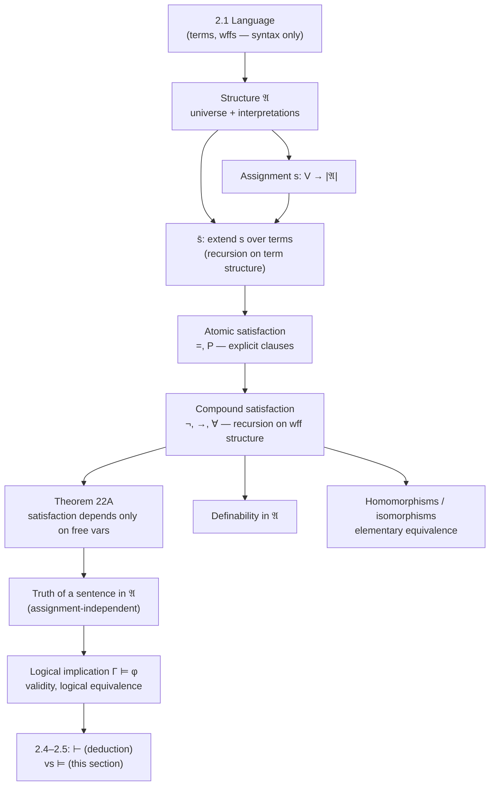

[[book-guidelines|↩ Back to guidelines]]

# Structures, Truth, and Satisfaction

## Why syntax alone can't tell you what's true

Chapter 2's Section 2.1 (a companion article covers this ground — terms, wffs, free/bound variables) gave you a language: a precise grammar for building expressions like $\forall x \exists y\, Pxy$. But a grammar is just a shape-checker. Nothing in the grammar says whether $\forall x \exists y\, Pxy$ is *true*. You could write $Pxy$ to mean "$x$ loves $y$," or "$x$ divides $y$," or "$x$ is an edge to $y$ in some graph" — the wff itself is silent about which. This is the same gap a language spec always leaves open: BNF tells you `while (*s++);` parses as a statement, but nothing about the grammar tells you what the program *does*. That requires an evaluator — an assignment of meaning to every symbol the grammar treats as opaque.

In sentential logic (Chapter 1) this assignment was just a **truth assignment**: a function from sentence symbols to $\{T, F\}$. First-order logic has more moving parts — a domain of individuals, the quantifier $\forall$ ranging over it, predicate/function/constant symbols denoting relations, operations, and points in that domain — so the analogous object is richer. Enderton calls it a **structure**, $\mathfrak{A}$. Building a rigorous definition of "$\varphi$ is true in $\mathfrak{A}$" without smuggling in appeals to English or intuition is the entire content of this section, and it's worth taking Enderton's own motivating jab seriously: "If you think you have [a criterion for asserting some English sentences are true], try it on the sentence 'This sentence is false.'" The goal is to make truth-in-a-structure *purely mathematical* — computable, in the loose sense, by structural recursion over the wff.

**What breaks without this:** if "truth" stayed an intuitive, extra-mathematical judgment, none of the deep theorems later in the chapter — soundness, completeness, compactness — could even be *stated* precisely, because their entire content is a claim about the relationship between a syntactic notion (provability, $\vdash$) and this semantic one ($\models$). Get the semantics loose, and the theorems dissolve into hand-waving.

## Structures as interpretations of a language

A **structure** $\mathfrak{A}$ for a first-order language is formally just a function whose domain is the set of parameters (everything in the language except the fixed logical symbols $\neg, \rightarrow, (, ), =$, variables, and $\forall$ itself), satisfying:

1. $\mathfrak{A}$ assigns to $\forall$ a nonempty set $|\mathfrak{A}|$, the **universe** (or *domain*) of $\mathfrak{A}$ — what "everything" means when a quantifier says "for everything."
2. To each $n$-place predicate symbol $P$, $\mathfrak{A}$ assigns an $n$-ary relation $P^{\mathfrak{A}} \subseteq |\mathfrak{A}|^n$.
3. To each constant symbol $c$, $\mathfrak{A}$ assigns a point $c^{\mathfrak{A}} \in |\mathfrak{A}|$.
4. To each $n$-place function symbol $f$, $\mathfrak{A}$ assigns an $n$-ary *total* operation $f^{\mathfrak{A}} : |\mathfrak{A}|^n \to |\mathfrak{A}|$.

Two side conditions matter more than they look: the universe must be *nonempty* (this is what later makes $\forall x\, Qx \models \exists y\, Qy$ valid — an empty universe would make every universally quantified sentence vacuously true and every existential one vacuously false, breaking that implication), and every $f^{\mathfrak{A}}$ must be *total* on $|\mathfrak{A}|^n$ — no partial functions allowed, so there's never a "what if $f^{\mathfrak{A}}$ is undefined here" case to worry about in the semantics.

Enderton is careful to distinguish $\mathfrak{A}$ (the structure, a whole dictionary) from *interpretation*, which he reserves for a different concept in Section 2.7 (translating one theory into another). Worth flagging since "interpretation" is used loosely elsewhere in logic and CS.

Two worked examples from the book fix the idea. First, the language of set theory (only parameter: $\in$) interpreted over the natural numbers with $\in^{\mathfrak{A}} = \{\langle m,n\rangle : m < n\}$ — under this structure, "$x < $ everything doesn't exist" becomes true (translate $\exists x\, \forall y\, \neg\, y \in x$: "there's a smallest natural number"), but the pairing axiom of set theory comes out false, since $<$ has no analogue of "the pair $\{x,y\}$." Second, a finite structure $\mathfrak{B}$ with $|\mathfrak{B}| = \{a,b,c,d\}$ and $E^{\mathfrak{B}} = \{\langle a,b\rangle, \langle b,a\rangle, \langle b,c\rangle, \langle c,c\rangle\}$ — literally a directed graph, with $Exy$ read as "edge from $x$ to $y$." Both examples make the same point: *the same formal sentence can be true or false depending purely on which structure you plug in.* That dependency is the entire content of "semantics."

### Grounding: a structure is an interpreter's environment

This maps almost too neatly onto something you already know from building interpreters: a **structure is an environment plus a set of built-in operation implementations.**

```rust
// A structure for a language with predicate symbols, constant symbols,
// and function symbols, over some universe type U.
struct Structure<U: Eq + Clone> {
    universe: Vec<U>,                       // |A| — must be nonempty
    predicates: HashMap<String, Box<dyn Fn(&[U]) -> bool>>,   // P -> P^A
    constants: HashMap<String, U>,                              // c -> c^A
    functions: HashMap<String, Box<dyn Fn(&[U]) -> U>>,         // f -> f^A (total!)
}
```

The parallel to run with: a **language** (Section 2.1) is like a set of trait *signatures* — `fn P(x: U, y: U) -> bool` with no body. A **structure** is one particular `impl` block giving those signatures bodies. The same trait (language) can have arbitrarily many `impl`s (structures) — exactly why $\forall x \exists y\, Pxy$ has no fixed truth value until you pick one. This is precisely the syntax/semantics split every compiler makes between an AST node `Call(fn_name, args)` and the actual function pointer or `impl` that executes when you run it.

## Satisfaction: recursion on formula structure

Sentential logic could define "true under $v$" directly on wffs, because sentence symbols carried complete meaning by themselves. First-order wffs can have *free variables* ($Pxy$ has no truth value on its own — it depends on what $x$ and $y$ *are*), so Enderton needs one more ingredient before defining truth: an **assignment** $s : V \to |\mathfrak{A}|$, a function from the (infinite) set of all variables into the universe, telling you what every variable currently denotes.

Given $\mathfrak{A}$ and $s$, Enderton defines $\models_{\mathfrak{A}} \varphi[s]$ — read "$\mathfrak{A}$ **satisfies** $\varphi$ with $s$" — by structural recursion, in three layers:

**I. Terms.** First extend $s$ to a function $\bar s : T \to |\mathfrak{A}|$ over *all terms*, by recursion on term structure:

$$
\begin{aligned}
\bar s(x) &= s(x) &&\text{(variable)}\\
\bar s(c) &= c^{\mathfrak{A}} &&\text{(constant)}\\
\bar s(f\,t_1 \cdots t_n) &= f^{\mathfrak{A}}(\bar s(t_1), \ldots, \bar s(t_n)) &&\text{(function application)}
\end{aligned}
$$

This is literally an evaluator for an expression tree — the recursion theorem (Section 1.4) guarantees $\bar s$ exists and is unique precisely *because* terms have unique decompositions (unique readability, Section 2.3): every term is built one way, so there's exactly one way to fold $\bar s$ over it.

**II. Atomic formulas.** Since atomic formulas are defined *explicitly* rather than inductively, their satisfaction clause is explicit too, not recursive:

$$
\models_{\mathfrak{A}} =t_1 t_2\,[s] \iff \bar s(t_1) = \bar s(t_2), \qquad
\models_{\mathfrak{A}} Pt_1\cdots t_n\,[s] \iff \langle \bar s(t_1),\ldots,\bar s(t_n)\rangle \in P^{\mathfrak{A}}.
$$

**III. Compound wffs**, by recursion on wff structure (the base case is II):

$$
\begin{aligned}
\models_{\mathfrak{A}} \neg\varphi\,[s] &\iff \text{not } \models_{\mathfrak{A}}\varphi\,[s] \\
\models_{\mathfrak{A}} (\varphi \rightarrow \psi)\,[s] &\iff \text{not }\models_{\mathfrak{A}}\varphi\,[s]\text{, or }\models_{\mathfrak{A}}\psi\,[s]\text{ (or both)} \\
\models_{\mathfrak{A}} \forall x\,\varphi\,[s] &\iff \text{for every } d \in |\mathfrak{A}|,\ \models_{\mathfrak{A}}\varphi\,[s(x\mid d)]
\end{aligned}
$$

where $s(x \mid d)$ is $s$ modified at exactly one point: $s(x\mid d)(y) = s(y)$ if $y \neq x$, and $= d$ if $y = x$. Once $\neg$, $\rightarrow$, and $\forall$ are handled, the rest ($\wedge, \vee, \leftrightarrow, \exists$) come for free as defined abbreviations — e.g. Enderton derives $\models_{\mathfrak{A}} \exists x\, \alpha[s]$ iff *some* $d \in |\mathfrak{A}|$ satisfies $\models_{\mathfrak{A}} \alpha[s(x\mid d)]$, by unwinding $\exists x\,\alpha := \neg\forall x\,\neg\alpha$ through the clauses above — a genuinely nice small proof, reprinted in the source, that's worth doing yourself once by hand.

Enderton flags — and this is worth taking seriously as a design principle, not just a technicality — that satisfaction can equally be phrased as: fix $\mathfrak{A}$, define (by the same recursion) a function $h$ where $h(\varphi)$ is *the set of assignments that satisfy $\varphi$*, and then $\models_{\mathfrak{A}}\varphi[s] \iff s \in h(\varphi)$. That's denotational semantics in miniature: $h$ is a compositional map from syntax to *meaning-as-a-set*, built by recursion on syntax, exactly like a `fn eval(expr: &Expr, env: &Env) -> Value` — except here the "value" of a formula is which environments make it true, not a single output.

### Grounding: satisfaction is `eval`, structural recursion is the interpreter's shape

This is the single cleanest match in the whole section to something you've written before: satisfaction-by-recursion-on-formula-structure is *exactly* the shape of a tree-walking evaluator, with the wonderful simplification that the "value" of every expression is `bool`.

```rust
enum Term { Var(String), Const(String), App(String, Vec<Term>) }
enum Wff {
    Eq(Term, Term),
    Pred(String, Vec<Term>),
    Not(Box<Wff>),
    Imp(Box<Wff>, Box<Wff>),
    ForAll(String, Box<Wff>),
}

type Assignment = HashMap<String, U>; // s : V -> |A|

fn eval_term(t: &Term, s: &Assignment, a: &Structure<U>) -> U {
    match t {
        Term::Var(x)      => s[x].clone(),
        Term::Const(c)    => a.constants[c].clone(),
        Term::App(f, ts)  => {
            let args: Vec<U> = ts.iter().map(|t| eval_term(t, s, a)).collect();
            (a.functions[f])(&args)
        }
    }
}

fn satisfies(phi: &Wff, s: &Assignment, a: &Structure<U>) -> bool {
    match phi {
        Wff::Eq(t1, t2)     => eval_term(t1, s, a) == eval_term(t2, s, a),
        Wff::Pred(p, ts)    => {
            let args: Vec<U> = ts.iter().map(|t| eval_term(t, s, a)).collect();
            (a.predicates[p])(&args)
        }
        Wff::Not(phi)       => !satisfies(phi, s, a),
        Wff::Imp(phi, psi)  => !satisfies(phi, s, a) || satisfies(psi, s, a),
        Wff::ForAll(x, phi) => a.universe.iter().all(|d| {
            let mut s2 = s.clone();
            s2.insert(x.clone(), d.clone());
            satisfies(phi, &s2, a)
        }),
    }
}
```

Notice `ForAll` iterating `a.universe` — that's exactly $s(x \mid d)$ ranging over $|\mathfrak{A}|$, made concrete. (When $|\mathfrak{A}|$ is infinite, as it usually is in real logic, this loop is a mathematical idealization, not literally runnable — Enderton flags exactly this: deciding validity, which quantifies over *every possible* $|\mathfrak{A}|$, is undecidable in general, Section 3.5. The `eval` shape is exact; the *executability* is not, and that gap is where the entire soundness/completeness apparatus of Sections 2.4–2.5 comes from — a syntactic proof system that's finitary standing in for a semantic notion that provably isn't.)

In Lean, this correspondence is even tighter, because Lean's own kernel is *itself* an evaluator over a term language with binders, which is exactly what $\forall x\,\varphi$'s satisfaction clause is doing. A shallow but genuinely illuminating embedding:

```lean
-- A structure, as data: a carrier type, plus interpretations of the symbols.
structure FOStructure (Sig : Type) where
  carrier : Type
  nonempty : Nonempty carrier
  interp  : Sig → carrier → carrier → Prop   -- e.g. interpret one binary predicate

-- Satisfaction of ∀x (P x x) becomes literally a Lean ∀ over the carrier —
-- the object-language quantifier is discharged into the meta-language quantifier.
def satisfiesForallDiag (M : FOStructure Sig) (P : Sig) : Prop :=
  ∀ d : M.carrier, M.interp P d d
```

This is the move Enderton's clause 4 is making abstractly: the *object-language* $\forall$ becomes a genuine *meta-language* $\forall$ once you fix a structure. Every time you see a proof assistant discharge an object-level quantifier by asking Lean (or Rust's type checker, in a smaller way) to check something for "every" value of a type, you're re-running this exact translation.

## Theorem 22A: satisfaction only cares about free variables

Assignments $s$ carry information about *every* variable, including ones that don't even occur in $\varphi$. That's obviously wasteful — and Enderton proves precisely how wasteful:

> **Theorem 22A.** If $s_1, s_2 : V \to |\mathfrak{A}|$ agree on every variable free in $\varphi$, then $\models_{\mathfrak{A}} \varphi[s_1] \iff \models_{\mathfrak{A}} \varphi[s_2]$.

The proof is induction on $\varphi$'s structure (the same recursion satisfaction was defined by, run in reverse as an inductive argument):

- **Atomic** $\varphi = Pt_1\cdots t_n$: every variable in $\varphi$ occurs free, so $s_1, s_2$ agree on all variables in every $t_i$, hence $\bar s_1(t_i) = \bar s_2(t_i)$ (itself by induction on term structure).
- **$\neg\alpha$, $\alpha\rightarrow\beta$**: immediate from the inductive hypothesis.
- **$\forall x\,\psi$**: the variables free in $\forall x\,\psi$ are exactly the ones free in $\psi$ *except* $x$. So for any $d$, $s_1(x\mid d)$ and $s_2(x\mid d)$ still agree on everything free in $\psi$ — the inductive hypothesis applies to $\psi$ with these modified assignments, and the $\forall$-clause pulls the result back up to $\forall x\,\psi$.

This single theorem is why the notation $\models_{\mathfrak{A}}\varphi[[a_1,\ldots,a_k]]$ makes sense at all: if every free variable of $\varphi$ is among $v_1,\ldots,v_k$, you can talk about satisfaction using *only the finitely many values assigned to those variables*, ignoring what $s$ does everywhere else. And when $\varphi$ is a *sentence* (no free variables), $s$ drops out of the picture entirely — either **every** assignment satisfies $\varphi$, or **none** does (Corollary 22B), which is exactly what licenses calling $\varphi$ simply "true in $\mathfrak{A}$" ($\models_{\mathfrak{A}}\sigma$), with no assignment mentioned.

**What breaks without this theorem:** without it, "truth of a sentence in a structure" wouldn't even be well-defined as a two-valued fact — you'd have to ask "true under *which* assignment?" every time, since a priori different assignments to irrelevant variables might have disagreed. Theorem 22A is what collapses assignment-relative satisfaction down to assignment-*independent* truth for sentences, and it's the fact every later theorem (soundness, compactness, elementary equivalence) implicitly leans on whenever it talks about "a sentence being true in a model" as a bare, assignment-free fact.

### Grounding: this is scope analysis, computed once and cached

Theorem 22A is a semantic mirror of a purely syntactic fact your compiler almost certainly already computes: *free-variable analysis*. A closure that only reads variables $x, y$ from its enclosing environment doesn't need the entire environment — it only needs the slice of it that its free variables name. Rust's closures do exactly this at compile time (only captured variables are stored in the closure's synthesized struct); Theorem 22A is the semantic justification that this is *sound* — evaluating with a smaller, filtered environment gives the identical answer to evaluating with the full one, precisely because nothing free-variable-irrelevant can influence the result. It's also the mathematical fact underlying why a type-checker can check a lambda's body using only the bindings actually in scope, rather than needing to thread the entire ambient context through unchanged.

## Logical implication, validity, and logical equivalence

With satisfaction pinned down, Enderton assembles the chapter's central semantic vocabulary — the first-order analogues of Chapter 1's tautological implication and tautologies:

> **Definition.** $\Gamma \models \varphi$ ("$\Gamma$ **logically implies** $\varphi$") iff for every structure $\mathfrak{A}$ and every $s : V \to |\mathfrak{A}|$: if $\mathfrak{A}$ satisfies every member of $\Gamma$ with $s$, then $\mathfrak{A}$ satisfies $\varphi$ with $s$ too.
>
> $\varphi$ is **valid** ($\models \varphi$) iff $\emptyset \models \varphi$ — i.e. *every* structure with *every* assignment satisfies $\varphi$.
>
> $\varphi$ and $\psi$ are **logically equivalent** ($\varphi \mathbin{|\!\!=\!\!|} \psi$) iff $\varphi \models \psi$ and $\psi \models \varphi$.

For sentences specifically, Theorem 22A lets you restate this purely in terms of models rather than assignments (**Corollary 22C**): $\Gamma \models \tau$ iff every model of $\Gamma$ is a model of $\tau$; $\tau$ is valid iff it's true in *every* structure. Enderton's worked examples are worth internalizing because several are exactly the quantifier-swap traps that trip people up in real proofs: $\forall v_1\, Qv_1 \models Qv_2$ holds, but $Qv_1 \not\models \forall v_1\, Qv_1$ (a one-element universe collapses the difference, which is why the book insists you exhibit a structure with *at least two* elements to see the failure). And crucially: $\exists x \forall y\, Pxy \models \forall y \exists x\, Pxy$ but *not* conversely — "there's one $x$ that works for every $y$" is strictly stronger than "for every $y$ some $x$ works," a distinction that resurfaces constantly (a global witness vs. a per-case witness) anywhere you reason about dependent choice.

Enderton is explicit about a complexity cliff here that's easy to gloss over: checking tautological implication in sentential logic is finitary — finitely many truth assignments, each mechanically checkable. Checking *validity* in first-order logic requires quantifying over **every possible structure**, including ones with infinite universes — a fundamentally different, and (as Section 3.5 proves) undecidable, question. That validity nonetheless turns out to coincide with a genuinely finitary notion — *deducibility*, $\vdash$, defined syntactically in Section 2.4 — is the entire payoff of the Completeness Theorem in Section 2.5. This section is setting up exactly the semantic side of that eventual equivalence.

### Grounding: `≡` as observational equivalence, validity as "true for all environments"

Logical equivalence maps directly onto **observational equivalence** in a language semantics sense — two program fragments are observationally equivalent iff they produce the same result *in every context/environment*, which is precisely $\varphi \mathbin{|\!\!=\!\!|} \psi$: agreement of truth value under every structure and assignment, not just some convenient one. Validity is the special case "true regardless of context" — the semantic analogue of a Rust function whose postcondition holds unconditionally, independent of any input (a `const fn` returning a fixed truth value under any Hoare-triple precondition, in the target-project's terms). This is the semantic notion the eventual verifier's proof obligations will bottom out in: "does this Hoare-triple postcondition follow from the precondition and program *in every structure satisfying [[Weak-Fragments-of-Number-Theory#The axioms|the axioms]]*" is literally $\Gamma \models \varphi$ with $\Gamma$ the axioms/precondition and $\varphi$ the postcondition.

## Definability, homomorphisms, and elementary equivalence — a preview of "same shape" reasoning

The rest of Section 2.2 (pp. 89–104 in the source) builds outward from satisfaction toward questions about *comparing* structures, material that's used repeatedly starting in Section 2.6 but worth previewing here since it's continuous with everything above:

- **Definability in a structure**: a $k$-ary relation on $|\mathfrak{A}|$ is *definable* iff some formula $\varphi$ (free variables among $v_1,\ldots,v_k$) picks it out exactly: $\{\langle a_1,\ldots,a_k\rangle : \models_{\mathfrak{A}}\varphi[[a_1,\ldots,a_k]]\}$. E.g. in the real field $\mathfrak{R} = (\mathbb{R}; 0,1,+,\cdot)$, the nonnegative reals are definable by $\exists v_2\, v_1 = v_2\cdot v_2$ (a number has a square root iff it's $\geq 0$) — you get "$\leq$" for free without adding it as a primitive symbol.
- **Homomorphisms and isomorphisms**: a function $h : |\mathfrak{A}| \to |\mathfrak{B}|$ that preserves every relation and function (both directions, for relations — Enderton's "strong" homomorphisms) is a homomorphism; a one-to-one homomorphism is an isomorphism (embedding). The **Homomorphism Theorem** ties this to satisfaction directly: for quantifier-free, equality-free $\alpha$, $\models_{\mathfrak{A}}\alpha[s] \iff \models_{\mathfrak{B}}\alpha[h\circ s]$; strengthen to isomorphisms and equality is allowed back in; strengthen to *onto* homomorphisms and quantifiers are allowed back in.
- **Elementary equivalence** ($\mathfrak{A} \equiv \mathfrak{B}$: same sentences true in both) follows as a corollary — isomorphic structures are always elementarily equivalent, though the converse fails ($(\mathbb{Q};<)$ and $(\mathbb{R};<)$ are elementarily equivalent but not isomorphic, since one is countable and the other isn't; Section 2.6 develops this gap fully).

This cluster is the section's answer to "when are two structures *interchangeable* as far as first-order logic can tell?" — a question that recurs, sharpened, throughout the rest of the book (elementary substructures, [[Soundness-and-Completeness#The Löwenheim–Skolem Theorem|the Löwenheim–Skolem theorem]], nonstandard models).

## Substitution and quantifier capture — a deliberate preview, not (yet) this section's content

Worth being upfront about: the Topic List's fifth thread here — *substitution, alphabetic variants, and quantifier capture* — is **not** actually developed in Section 2.2 itself. Enderton's own treatment of substitutable terms and the quantifier-capture problem lives in **Section 2.4** (the deductive calculus), where the axiom schema $\forall x\,\alpha \rightarrow \alpha^t_x$ needs $t$ to be *substitutable for* $x$ in $\alpha$ — precisely to block a free variable in $t$ from being accidentally captured by a quantifier already inside $\alpha$. The material genuinely earns its place on this Topic List entry as a forward pointer, since it's the syntactic side of the exact semantic question this section already answers: Theorem 22A tells you semantically that satisfaction only depends on *free* variable values, and substitutability is the syntactic discipline that keeps a term's variables free (not accidentally bound) when you plug it in for $x$. Treat this section's satisfaction machinery as the "why substitution has to be capture-avoiding" story, and Section 2.4 (a separate article, when covered) as the "how you check that mechanically" story — this is precisely the ancestor of Lean's capture-avoiding substitution and `isDefEq`, worth flagging strongly given the stated learning goals, but the book's own formal machinery for it belongs to the next section, not this one.

## Structural map



## Where this leads

Everything downstream of Chapter 2 stands on [[Interpretations-Between-Theories#The definition|the definition]] of $\models_{\mathfrak{A}}\varphi[s]$ built here. Section 2.4's deductive calculus $\vdash$ is a purely syntactic proof system whose entire justification (Section 2.5's [[Soundness-and-Completeness|Soundness and Completeness]] Theorems) is a claim about how it relates to $\models$ as defined here — soundness says every $\vdash$-derivation stays inside what $\models$ already guarantees; completeness says $\vdash$ captures *all* of it. The Compactness and Löwenheim–Skolem theorems (2.5–2.6) are theorems about models — structures, in the sense defined here — and elementary equivalence/elementary classes (2.6) directly extend the homomorphism/definability material previewed above.

For the two engineering targets this study is aimed at, this section is close to maximally load-bearing:

- **The Rust verifier.** The satisfaction relation $\models_{\mathfrak{A}}\varphi[s]$, defined by recursion on formula structure with a mutable-at-one-point environment update ($s(x\mid d)$), *is* the shape of any Hoare-logic verifier's semantic evaluator — the thing the syntactic proof rules (weakest-precondition calculus, etc.) are checked sound against. Theorem 22A — satisfaction depends only on free variables — is the exact fact that lets a verifier's environment/context tracking be scoped rather than global, and it's also precisely the semantic backdrop against which substitution has to be capture-avoiding, which is why Section 2.4's substitutability condition exists at all.
- **The elaborator/unifier.** The Homomorphism Theorem's escalating conditions (quantifier-free → isomorphism-with-equality → onto-with-quantifiers) is a template worth remembering for how "does this transformation preserve meaning" questions get stratified by formula complexity — the same stratification shows up whenever a unifier has to reason about which class of terms (patterns vs. arbitrary terms) it can safely handle completely. And the $\forall$-satisfaction clause turning into a literal meta-language `∀` (shown above in the Lean sketch) is the same discharge Lean's kernel performs whenever it typechecks a `∀`-introduction — worth keeping in mind as the cleanest available bridge between this book's semantics and the kernel's actual behavior.
